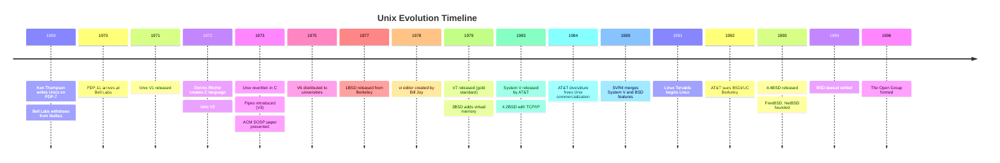
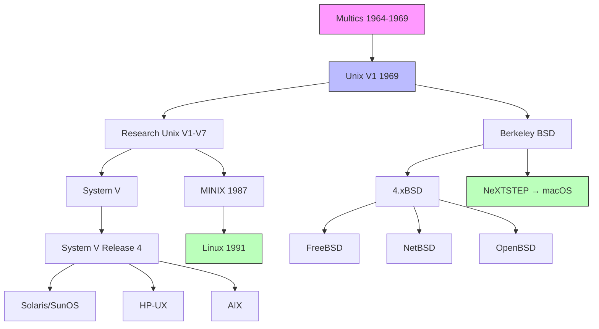
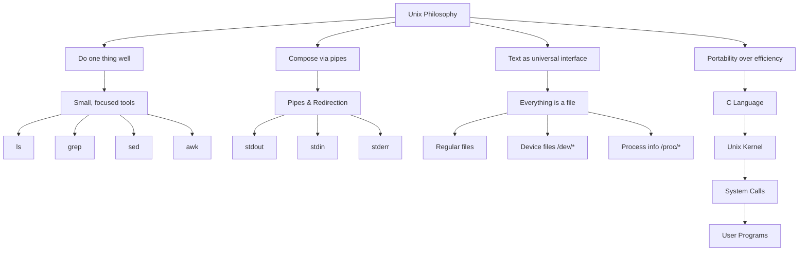

# Chapter 1: Unix History and Heritage

## 1.1 Introduction

Unix is the intellectual ancestor of virtually every modern operating system in widespread use today—from Linux and macOS to Android and iOS. Its influence is so pervasive that understanding Unix history is not merely an academic exercise; it is foundational to understanding why operating systems work the way they do. This chapter traces the arc of Unix from its humble origins on a PDP-7 minicomputer in a Bell Labs hallway to its role as the bedrock of enterprise computing, the internet, and the open-source revolution that followed.

## 1.2 Intuition

Before diving into dates and version numbers, it helps to understand the *spirit* of Unix. The Unix philosophy can be summarized in a few core tenets:

1. **Do one thing and do it well.** Each program should be a tool that performs a single, well-defined task.
2. **Expect the output of every program to become the input to another.** This leads to composable tools connected by pipes.
3. **Design and build software to be tried early.** Prototyping beats planning.
4. **Prefer portability over efficiency.** Write in high-level languages when possible.

These principles emerged organically from the constraints and culture of Bell Labs in the late 1960s and early 1970s. Understanding *why* Unix was designed the way it was requires understanding the environment that produced it.

## 1.3 Bell Labs: The Cradle of Computing Innovation

### 1.3.1 The Computing Science Research Center

Bell Labs, the research and development arm of AT&T (American Telephone and Telegraph), was one of the most prolific research institutions of the 20th century. Its Murray Hill, New Jersey campus was responsible for the transistor, the laser, information theory (Claude Shannon), the C programming language, and, of course, Unix.

The Computing Science Research Center (often called "CSRC" or simply "the Computing Center") was a small group of perhaps 30–40 researchers. Unlike modern corporate research labs, Bell Labs researchers enjoyed extraordinary freedom. They were expected to pursue interesting problems, publish papers, and create tools that others would find useful. There was no product manager, no sprint planning, no quarterly roadmap.

The group operated on a minicomputer called a **PDP-1** (Programmed Data Processor), manufactured by Digital Equipment Corporation (DEC). This would be the first of several DEC machines that shaped Unix history.

### 1.3.2 The Multics Failure

The story of Unix cannot be told without Multics. In 1964, MIT, GE, and Bell Labs embarked on an ambitious project called **Multics** (Multiplexed Information and Computing Service). Multics was intended to be a time-sharing operating system of unprecedented sophistication—supporting hundreds of simultaneous users, dynamic linking, hierarchical file systems, and fine-grained security.

Bell Labs withdrew from the Multics project in 1969 for several reasons:

- The project was behind schedule and over budget.
- The GE-645 mainframe required to run Multics was expensive.
- The design was becoming increasingly complex—what we would now call "feature creep."
- AT&T management grew impatient with the lack of practical deliverables.

Ken Thompson and Dennis Ritchie, both of whom had worked on Multics, were left with a craving for the interactive computing experience Multics had promised but never delivered at scale.

### 1.3.3 The "Space Travel" Catalyst

A now-legendary anecdote: Ken Thompson had written a game called **Space Travel** on the GE-645 under Multics. When Bell Labs pulled out, Thompson ported the game to the smaller GE-635, but the experience was poor—it ran too slowly and cost $75 per hour in CPU time on the mainframe.

Thompson began looking for a smaller, cheaper machine to run his game. He found the **PDP-7**, a minicomputer with a modest 8K 18-bit word memory (roughly 18KB of RAM by modern byte-oriented reckoning). The PDP-7 had no operating system—it was essentially a bare machine with an assembler.

In the summer of 1969, Thompson began writing an operating system for the PDP-7. This was not a funded project. It was a side project, a hobby, an itch to be scratched.

## 1.4 The Birth of Unix

### 1.4.1 Thompson and Ritchie

**Ken Thompson** (born 1943) was a brilliant programmer with an almost supernatural ability to write correct code on the first attempt. He was a pragmatist—what mattered was that the system *worked*, not that it was theoretically elegant.

**Dennis Ritchie** (1941–2011) was more of a theoretician, deeply interested in programming languages and type systems. He would go on to create the C programming language, which would become the implementation language of Unix and, arguably, the most influential programming language in history.

Together, Thompson and Ritchie formed one of the greatest partnerships in computing history. Their collaboration was remarkably complementary: Thompson was the systems hacker, Ritchie the language designer.

### 1.4.2 First Implementation: PDP-7

The first version of Unix (not yet named) was written in PDP-7 assembly language in 1969. Thompson designed the file system first, then built the process control mechanisms on top of it. The system had:

- A hierarchical file system with directories
- The `fork()` system call for process creation
- Simple I/O redirection
- A rudimentary shell (the "Thompson shell")

The file system design was directly inspired by Multics, but much simpler. Where Multics used a complex segmented address space, Unix used a simple tree of directories and files. This simplicity was a deliberate design choice—Thompson later said:

> "The first thing to realize is that the right thing to do is to make the system as simple as possible."

### 1.4.3 The Name "Unix"

The operating system was initially called **Unics** (Uniplexed Information and Computing Service), a punning contrast to "Multics"—where Multics was "multiplexed" (many things at once), Unics was "uniplexed" (one thing at a time, on one machine, for one user). The name was likely coined by Brian Kernighan. The spelling was later shortened to **Unix**.

### 1.4.4 The PDP-11 Transition

By 1970, Thompson and Ritchie wanted a better machine. DEC was releasing the **PDP-11**, a 16-bit minicomputer that was far more capable than the PDP-7. Thompson wrote a proposal to Bell Labs management to purchase a PDP-11/20 for $65,000.

The proposal was framed not as a research project but as a "document preparation system"—Bell Labs needed a tool for patent document formatting. This was a pragmatic bit of political maneuvering: AT&T, as a regulated monopoly, was restricted from entering the computer business. But it could develop tools for internal use.

The PDP-11/20 arrived in late 1970. Unix was ported to it, and the system began to be used for real work—document preparation, text processing, and internal Bell Labs research.

## 1.5 The C Rewrite and the First Portable OS

### 1.5.1 The Creation of C

In 1972, Dennis Ritchie developed the **C programming language**, evolving it from Thompson's earlier **B language** (which itself descended from BCPL). C was designed to be a "portable assembler"—close enough to the hardware to be efficient, but abstract enough to be readable and portable.

The key insight was that C could compile to efficient machine code on different architectures. This meant that an operating system written in C could, in principle, be moved from one machine to another with relatively little effort.

### 1.5.2 The First Rewrite

Between 1972 and 1973, Thompson and Ritchie rewrote Unix in C. This was a revolutionary act. Operating systems of the era were invariably written in assembly language—the conventional wisdom was that an OS written in a high-level language would be too slow.

The rewrite was completed in 1973. Unix was now the **first operating system whose kernel was written in a high-level language**. This fact cannot be overstated—it made Unix portable in a way no other OS had ever been.

### 1.5.3 The ACM Paper

In October 1973, Thompson and Ritchie presented a paper at the Fourth ACM Symposium on Operating Systems Principles (SOSP) at Purdue University: *"The UNIX Time-Sharing System."* This paper brought Unix to the attention of the wider academic and research community and generated enormous interest.

## 1.6 Unix Evolution: Research Editions

### 1.6.1 Version History

Unix evolved through a series of numbered versions, distributed to universities and research institutions on magnetic tape:

| Version | Year | Key Features |
|---------|------|--------------|
| V1 | 1971 | First edition on PDP-11; `fork()`, file system, assembler |
| V2 | 1972 | Still PDP-11 assembly; `write()` system call |
| V3 | 1973 | C rewrite begins; pipes introduced |
| V4 | 1973 | Rewritten entirely in C |
| V5 | 1974 | First version distributed to universities outside Bell Labs |
| V6 | 1975 | Most widely used research edition; basis of the first university Unix courses |
| V7 | 1979 | Considered the "gold standard" of research Unix; portable C library, `make`, `awk`, `sh` (Bourne shell) |

### 1.6.2 The Bourne Shell

Version 7 introduced the **Bourne shell** (`sh`), written by Stephen Bourne at Bell Labs. The Bourne shell replaced Thompson's original shell and introduced features that remain fundamental:

- Shell scripting with variables, control flow, and functions
- I/O redirection with `>`, `<`, `>>`
- Pipes with `|`
- Command substitution with backticks

The Bourne shell became the basis for virtually all subsequent Unix shells (bash, ksh, zsh).

### 1.6.3 The `/usr` Hierarchy

An interesting historical note: the `/usr` directory was originally intended to hold **user home directories** (hence "usr"). When disks filled up, a second disk was mounted at `/usr`, and user files were stored there. Over time, `/usr` evolved into a directory for shareable, read-only data (programs, libraries, documentation), and users were moved to `/home`.

This explains why many Unix commands live in both `/bin` and `/usr/bin`, and why the Filesystem Hierarchy Standard (FHS) specifies both locations.

## 1.7 The Berkeley Connection: BSD

### 1.7.1 The University of California, Berkeley

In 1977, the Computer Science department at the University of California, Berkeley acquired a Unix license from AT&T. Berkeley's involvement with Unix would prove almost as consequential as Bell Labs' original work.

**Bill Joy**, a graduate student at Berkeley, began enhancing the V6 Unix distribution with improvements. His work, distributed as the **Berkeley Software Distribution (BSD)**, started with 1BSD in 1978.

### 1.7.2 BSD Releases

| Release | Year | Key Contributions |
|---------|------|-------------------|
| 1BSD | 1978 | Pascal compiler, `ex` editor (precursor to `vi`) |
| 2BSD | 1979 | `vi` editor, C shell (`csh`) |
| 3BSD | 1979 | Virtual memory support (critical innovation) |
| 4.1BSD | 1981 | Performance improvements; used at many universities |
| 4.2BSD | 1983 | TCP/IP networking stack (BSD sockets), `fast file system` |
| 4.3BSD | 1986 | Improved TCP/IP performance |
| 4.4BSD | 1993 | Last release from Berkeley; networking, NFS support |

### 1.7.3 BSD's Impact

BSD's contributions to computing are enormous:

- **BSD Sockets**: The socket API for network programming, developed by Bill Joy and others at Berkeley, became the *de facto* standard for network programming on all Unix-like systems (and eventually Windows via Winsock).
- **TCP/IP**: The BSD implementation of TCP/IP was the reference implementation that was shipped with virtually every Unix system. This is the code that powered the early internet.
- **Virtual Memory**: 4.2BSD's virtual memory system influenced all subsequent Unix systems.
- **The `vi` Editor**: Bill Joy's `vi` remains one of the most widely used text editors in the world.
- **`sendmail`**: Eric Allman's mail transport agent, developed at Berkeley, handled the majority of internet email for decades.
- **`csh`/`tcsh`**: The C shell introduced many interactive features still used today.

### 1.7.4 The BSD/AT&T Lawsuit

In 1992, AT&T's Unix Systems Laboratories (USL) sued Berkeley Software Design, Inc. (BSDi) and, by extension, the University of California, alleging that BSD contained proprietary AT&T Unix code. The lawsuit was settled in 1994, with the court finding that only 6 files out of approximately 18,000 were at issue.

The lawsuit had a chilling effect on BSD development and, ironically, opened the door for Linux. During the two years of legal uncertainty, many potential BSD users and developers turned to the nascent Linux project, which had no such legal baggage.

The settlement allowed BSD development to continue, and the three major BSD forks—**FreeBSD**, **NetBSD**, and **OpenBSD**—emerged in the wake of the lawsuit.

## 1.8 System V and Commercial Unix

### 1.8.1 AT&T's Commercial Ambitions

After the breakup of AT&T in 1984 (following the antitrust settlement with the U.S. Department of Justice), AT&T was freed from restrictions that had prevented it from entering the computer business. AT&T began commercializing Unix with **System V** (System Five), released in 1983.

System V was based on the research Unix V7 but added features aimed at commercial users:

- **STREAMS**: A flexible I/O framework for networking and terminal handling
- **TLI (Transport Layer Interface)**: AT&T's alternative to BSD sockets
- **IPC mechanisms**: Message queues, semaphores, shared memory
- **The `init` system**: The System V init process (`/etc/init.d/` scripts, runlevels) became the standard for most commercial Unix systems

### 1.8.2 The Unix Wars

The late 1980s and early 1990s were dominated by the **Unix Wars**—a period of intense competition between different Unix vendors, each with their own variant:

- **AT&T System V**
- **Sun Microsystems SunOS** (BSD-based) → later **Solaris** (System V-based)
- **HP-UX** (Hewlett-Packard)
- **AIX** (IBM)
- **IRX** (SGI)
- **Digital UNIX/Tru64** (DEC/Compaq)
- **SCO Unix** (Santa Cruz Operation)
- **NeXTSTEP** (NeXT, Steve Jobs' company)

Each vendor added proprietary extensions, creating fragmentation that made it difficult for software developers to write portable applications. This fragmentation was a key factor in Microsoft's ability to dominate the desktop market—Windows was one target, while Unix was a dozen targets.

### 1.8.3 The OSF and UI

The Unix Wars produced two competing standards bodies:

- **OSF (Open Software Foundation)**: Founded in 1988 by IBM, DEC, HP, and others, in response to AT&T and Sun's alliance. OSF/1 was their Unix variant.
- **UI (Unix International)**: A competing alliance led by AT&T and Sun Microsystems.

The rivalry was eventually resolved through the merger of OSF and UI into **The Open Group** in 1996, which became the custodian of the Unix trademark and the Single UNIX Specification.

### 1.8.4 System V Release 4 (SVR4)

In 1989, AT&T and Sun Microsystems jointly developed **System V Release 4 (SVR4)**, which merged the best features of System V, BSD, and SunOS:

- TCP/IP networking from BSD
- Virtual memory from SunOS
- STREAMS from System V
- The ELF (Executable and Linkable Format) binary format
- Enhanced `sh` and `ksh` shells

SVR4 became the basis for most commercial Unix systems going forward and remains influential today.

## 1.9 The Unix Philosophy

### 1.9.1 Kernighan and Pike's Formulation

The Unix philosophy was articulated most clearly in *"The UNIX Programming Environment"* (1984) by Brian Kernighan and Rob Pike, and later in *"The Art of Unix Programming"* (2003) by Eric S. Raymond. The core ideas:

1. **Make each program do one thing well.** To do a new job, build afresh rather than complicate old programs by adding new features.

2. **Expect the output of every program to become the input to another, as yet unknown.** Don't clutter output with extraneous information. Avoid stringently columnar or binary input formats. Don't insist on interactive input.

3. **Design and build software, even operating systems, to be tried early, ideally within weeks.** Don't hesitate to throw away the clumsy parts and rebuild them.

4. **Use tools in preference to unskilled help to lighten a programming task**, even if you have to detour to build the tools and expect to throw some of them out after you've finished using them.

### 1.9.2 Pipes: The Killer Feature

The pipe mechanism, introduced in Unix Version 3 (1973) by Doug McIlroy, was arguably Unix's most important innovation. McIlroy, the head of the Bell Labs Computing Sciences Research Center, had been advocating for a "cascade of processes" for years. When Thompson and Ritchie implemented it, McIlroy reportedly said:

> "We should have some way of connecting programs like a garden hose—screw in another segment when it becomes necessary to massage data in another way."

The pipe operator `|` allows the standard output of one program to be connected to the standard input of another. This simple mechanism enables extraordinary composability:

```bash
# Count the number of unique IP addresses in an Apache log
cat /var/log/apache2/access.log | awk '{print $1}' | sort | uniq | wc -l
```

Each of these programs (`cat`, `awk`, `sort`, `uniq`, `wc`) does one thing well, but together they perform a complex data analysis task.

### 1.9.3 Everything is a File

Another fundamental Unix design principle is that **everything is a file**. Devices, processes, network sockets, and regular data are all represented as files in the file system. This abstraction provides a uniform interface for I/O operations:

- `/dev/sda` — a hard disk device
- `/proc/self/status` — process status information
- `/dev/null` — the null device (discard all output)
- `/dev/random` — a source of random data

This principle was inherited from Multics and refined by Thompson. It means that the same `read()`, `write()`, and `open()` system calls work for regular files, devices, and inter-process communication.

## 1.10 Internal Architecture

### 1.10.1 The Unix Kernel

The Unix kernel is the core of the operating system, responsible for:

- **Process management**: Creating, scheduling, and terminating processes
- **Memory management**: Virtual memory, paging, memory allocation
- **File systems**: Organizing data on storage devices
- **Device drivers**: Interfacing with hardware
- **Networking**: Protocol stacks, socket management
- **Security**: User authentication, file permissions, access control

The kernel runs in a privileged mode (kernel space) and provides a set of **system calls** as the interface between user programs and the kernel:

```
┌─────────────────────────────────────────┐
│              User Space                  │
│  ┌──────────┐  ┌──────────┐  ┌────────┐ │
│  │  App 1   │  │  App 2   │  │  App 3 │ │
│  └────┬─────┘  └────┬─────┘  └───┬────┘ │
│       │              │             │      │
├───────┼──────────────┼─────────────┼──────┤
│       │    System Call Interface    │      │
│       ▼              ▼             ▼      │
│              Kernel Space                 │
│  ┌──────────────────────────────────────┐ │
│  │             Kernel                   │ │
│  │  ┌─────────┐ ┌─────────┐ ┌────────┐ │ │
│  │  │ Process │ │  Memory │ │  File  │ │ │
│  │  │ Manager │ │ Manager │ │Systems │ │ │
│  │  └─────────┘ └─────────┘ └────────┘ │ │
│  │  ┌─────────┐ ┌─────────┐            │ │
│  │  │ Device  │ │Network  │            │ │
│  │  │ Drivers │ │ Stack   │            │ │
│  │  └─────────┘ └─────────┘            │ │
│  └──────────────────────────────────────┘ │
│                   │                       │
│  ┌────────────────┴─────────────────────┐ │
│  │            Hardware                   │ │
│  └──────────────────────────────────────┘ │
└─────────────────────────────────────────┘
```

### 1.10.2 The Process Model

Unix's process model is elegant and simple:

- Each process has a unique **PID** (Process ID).
- Processes are created using `fork()`, which creates an exact copy of the parent process.
- After `fork()`, the child typically calls `exec()` to replace its image with a new program.
- Processes can communicate via **signals**, **pipes**, **sockets**, and **shared memory**.
- Every process (except `init`, PID 1) has a parent process. When a parent dies, the child is "orphaned" and reparented to `init`.

This model is beautifully simple and has survived virtually unchanged from the original Unix to modern Linux.

### 1.10.3 The File System

The Unix file system is a tree rooted at `/`. Key characteristics:

- **Hierarchical**: Directories contain files and other directories.
- **Permissions**: Every file has an owner, a group, and a set of permissions (read, write, execute) for each.
- **Inodes**: Each file is represented by an inode, which stores metadata (permissions, timestamps, data block pointers) but not the filename. Filenames are stored in directory entries that point to inodes.
- **Mount points**: Additional file systems can be "mounted" at any directory in the tree.

```
                    /
                    │
    ┌───────┬───────┼───────┬───────┐
    │       │       │       │       │
   bin     etc     usr     var    home
    │               │               │
    │        ┌──────┼──────┐        │
    │        │      │      │       alice
    │       bin    lib    local     │
    │                               │
    │                        ┌──────┼──────┐
    │                      .bashrc  .vimrc Documents
    │
    ├── ls
    ├── cp
    ├── mv
    └── cat
```

## 1.11 Code Examples

### 1.11.1 The fork() System Call

The `fork()` system call is the fundamental mechanism for process creation in Unix:

```c
#include <stdio.h>
#include <unistd.h>
#include <sys/wait.h>

int main() {
    pid_t pid = fork();
    
    if (pid < 0) {
        // Fork failed
        perror("fork failed");
        return 1;
    } else if (pid == 0) {
        // Child process
        printf("Child process (PID: %d), parent PID: %d\n", 
               getpid(), getppid());
        // Replace with a new program
        execlp("ls", "ls", "-la", NULL);
        // exec only returns on error
        perror("exec failed");
        return 1;
    } else {
        // Parent process
        printf("Parent process (PID: %d), child PID: %d\n", 
               getpid(), pid);
        wait(NULL);  // Wait for child to finish
        printf("Child process completed\n");
    }
    return 0;
}
```

### 1.11.2 Pipes in C

```c
#include <stdio.h>
#include <unistd.h>
#include <sys/wait.h>

int main() {
    int pipefd[2];
    pid_t pid;
    
    if (pipe(pipefd) == -1) {
        perror("pipe");
        return 1;
    }
    
    pid = fork();
    if (pid == 0) {
        // Child: write to pipe
        close(pipefd[0]);  // Close read end
        dup2(pipefd[1], STDOUT_FILENO);  // Redirect stdout to pipe
        execlp("ls", "ls", "-la", NULL);
    } else {
        // Parent: read from pipe
        close(pipefd[1]);  // Close write end
        dup2(pipefd[0], STDIN_FILENO);  // Redirect stdin from pipe
        execlp("wc", "wc", "-l", NULL);
    }
    return 0;
}
```

### 1.11.3 Simple Shell in C

A minimal shell demonstrates the Unix process model:

```c
#include <stdio.h>
#include <stdlib.h>
#include <string.h>
#include <unistd.h>
#include <sys/wait.h>

#define MAX_LINE 1024
#define MAX_ARGS 64

int main() {
    char line[MAX_LINE];
    char *args[MAX_ARGS];
    
    while (1) {
        printf("mysh> ");
        fflush(stdout);
        
        if (fgets(line, sizeof(line), stdin) == NULL) {
            break;  // EOF
        }
        
        // Remove trailing newline
        line[strcspn(line, "\n")] = 0;
        
        // Check for exit command
        if (strcmp(line, "exit") == 0) {
            break;
        }
        
        // Parse arguments
        int argc = 0;
        char *token = strtok(line, " ");
        while (token != NULL && argc < MAX_ARGS - 1) {
            args[argc++] = token;
            token = strtok(NULL, " ");
        }
        args[argc] = NULL;
        
        if (argc == 0) continue;
        
        // Fork and exec
        pid_t pid = fork();
        if (pid == 0) {
            execvp(args[0], args);
            perror("execvp failed");
            exit(1);
        } else if (pid > 0) {
            waitpid(pid, NULL, 0);
        } else {
            perror("fork failed");
        }
    }
    return 0;
}
```

## 1.12 Diagrams

### 1.12.1 Unix Timeline



### 1.12.2 Unix Family Tree



### 1.12.3 The Unix Design Hierarchy



## 1.13 Common Pitfalls

### 1.13.1 Conflating Unix and Linux

**The mistake**: Using "Unix" and "Linux" interchangeably.

**The reality**: Unix is a family of operating systems descended from the original Bell Labs system. Linux is a Unix-*like* operating system inspired by Unix but written from scratch. Linux is not a descendant of Unix code—it was independently created by Linus Torvalds. However, it implements the Unix API and follows Unix conventions.

The distinction matters legally (Unix is a trademark of The Open Group), historically (Linux was created in response to the limitations of MINIX and the inaccessibility of Unix source code), and technically (Linux has features like `epoll`, `cgroups`, and namespaces that don't exist in traditional Unix).

### 1.13.2 The Myth of the "Clean" History

**The mistake**: Assuming Unix development was a smooth, linear progression.

**The reality**: Unix history is full of political infighting (the Unix Wars), legal battles (AT&T vs. BSD), corporate mismanagement (USL's attempt to commercialize), and lucky breaks (the AT&T divestiture). The clean narrative we tell today is a retrospective simplification.

### 1.13.3 Overemphasizing the "One Thing Well" Philosophy

**The mistake**: Treating the Unix philosophy as an absolute rule.

**The reality**: Even in classic Unix, programs did multiple things. `ls` has dozens of flags. `awk` is a complete programming language. `emacs` is... well, emacs. The philosophy is a guideline, not a law. The real lesson is about *appropriate* scope, not minimalist extremism.

## 1.14 Best Practices

### 1.14.1 Learn the History to Understand the Design

Understanding *why* Unix was designed the way it was helps you make better decisions when designing systems today. For example:

- The file permission model (owner/group/other with rwx) was a pragmatic solution for a multi-user minicomputer. Understanding this helps you understand why Linux later added ACLs and capabilities.
- The `fork()/exec()` model was chosen because it was simple to implement. Understanding this helps you understand why threads and `clone()` were added later.

### 1.14.2 Study the Original Papers

The original Unix papers are remarkably readable:

- Thompson & Ritchie, "The UNIX Time-Sharing System" (1974 CACM version)
- McIlroy, Pinson, and Tague, "UNIX Time-Sharing System: Foreword" (1978)
- Ritchie and Thompson, "The UNIX Time-Sharing System" (1974 BSTJ)

### 1.14.3 Use Classic Unix Tools

The classic Unix tools (`grep`, `sed`, `awk`, `find`, `xargs`, `sort`, `uniq`, `cut`, `paste`) are still powerful and worth learning. They form a composable toolkit that can replace many specialized programs.

## 1.15 Exercises

### Exercise 1: Timeline Research
Research and document the complete timeline of a specific Unix variant (e.g., Solaris, AIX, or HP-UX). Identify its major versions, key features, and current status.

### Exercise 2: Pipe Composition
Using only classic Unix tools (`cat`, `grep`, `sort`, `uniq`, `cut`, `awk`, `wc`, `head`, `tail`), solve the following:
- Find the 10 most common words in a text file
- Count the number of unique IP addresses in a web server log
- Find all files modified in the last 7 days and count them by extension

### Exercise 3: Implement `fork()` and `exec()`
Write a C program that:
1. Creates a child process using `fork()`
2. In the child, executes a command passed as a command-line argument
3. In the parent, waits for the child and prints its exit status

### Exercise 4: The Unix Philosophy Debate
Research and write a 500-word essay arguing either for or against the proposition: "The Unix philosophy is obsolete in the age of microservices and container orchestration."

### Exercise 5: Compare Shells
Compare the features of `sh` (Bourne shell), `bash`, `zsh`, and `fish`. Create a feature matrix showing which features each supports.

## 1.16 References

1. Ritchie, D.M. and Thompson, K. (1974). "The UNIX Time-Sharing System." *Communications of the ACM*, 17(7), pp. 365–375.
2. Kernighan, B.W. and Pike, R. (1984). *The UNIX Programming Environment*. Prentice Hall.
3. Raymond, E.S. (2003). *The Art of Unix Programming*. Addison-Wesley.
4. Salus, P.H. (1994). *A Quarter Century of UNIX*. Addison-Wesley.
5. Toomey, W. (2014). "The First Unix Port." USENIX ;login:, 39(5).
6. McKusick, M.K. (1999). "Twenty Years of Berkeley Unix: From AT&T-Owned to Freely Redistributable." *Open Sources: Voices from the Open Source Revolution*.
7. Garfinkel, S., Spafford, G., and Schwartz, A. (2003). *Practical UNIX and Internet Security*. O'Reilly.
8. The Open Group. "The Single UNIX Specification." https://www.opengroup.org/unix
9. unixhistory.github.io — Interactive Unix family tree visualization.
10. Computerphile. "Unix: Making Computers Easier to Use." YouTube, 2015.
