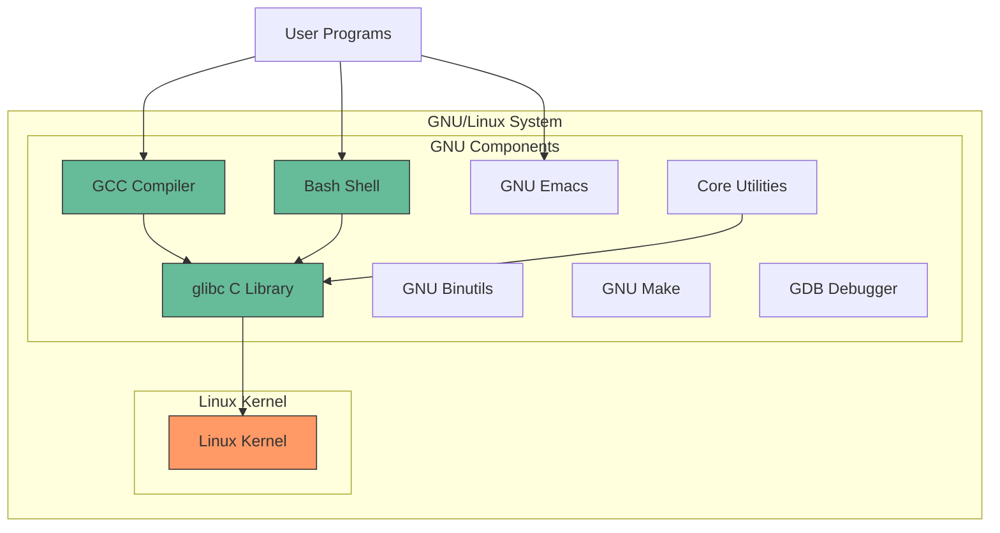
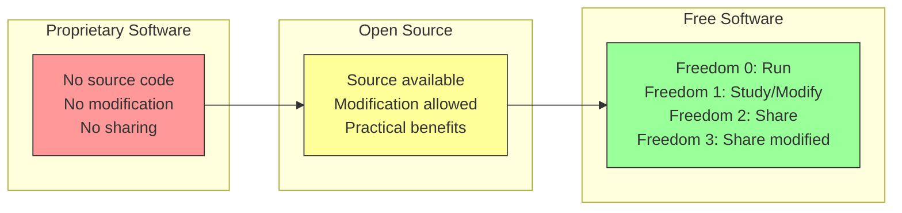
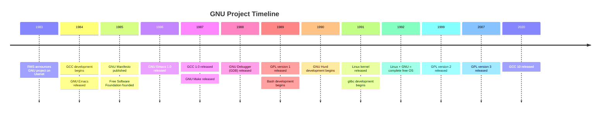

# Chapter 2: The GNU Project and Free Software Movement

## 2.1 Introduction

The GNU Project and the Free Software Movement are the philosophical and legal foundations upon which the entire Linux ecosystem stands. Without Richard Stallman's vision of a free operating system and the legal machinery of the GNU General Public License, Linux would be just another hobby kernel. This chapter explores the origins, philosophy, technical achievements, and lasting impact of the movement that made open-source computing possible.

## 2.2 Intuition

To understand the GNU Project, you must understand the computing world of the late 1970s and early 1980s. In the 1970s, the computing culture at places like MIT's Artificial Intelligence Laboratory was deeply collaborative. Programmers shared code freely, improved each other's work, and distributed modifications without restriction. Source code was considered a form of scientific knowledge—something to be shared for the collective good.

By the early 1980s, this culture was dying. Companies began distributing programs as binary-only executables, requiring non-disclosure agreements and prohibiting modification. The collaborative hacker culture was being systematically dismantled by commercial interests.

Richard Stallman experienced this transformation personally and found it intolerable. His response—the GNU Project and the Free Software Foundation—was not merely a technical endeavor; it was an act of resistance against what he saw as the destruction of a community.

## 2.3 Richard Stallman: The Last Hacker

### 2.3.1 Early Life and MIT

Richard Matthew Stallman (born March 16, 1953) is known universally by his initials, **RMS**. He joined MIT's Artificial Intelligence Laboratory in 1971 as a programmer. The AI Lab was a remarkable place—a small group of brilliant hackers who shared a PDP-10 mainframe running ITS (Incompatible Timesharing System).

The Lab's culture was radically open. There were no passwords on the PDP-10 (Stallman reportedly broke the password system to restore the communal access that had existed before). Source code for all programs was available to anyone who wanted to read or modify it. When a printer jammed, programmers would fix the driver software. When a program had a bug, anyone could fix it.

This was not altruism in the abstract—it was practical cooperation among people who understood that shared code improves faster than isolated code.

### 2.3.2 The Printer Incident

The pivotal event in Stallman's conversion from programmer to activist involved a **Xerox 9700 laser printer**. The AI Lab had received a donation of this printer, and Stallman wanted to modify its driver software to send an alert when the printer jammed (the previous printer, a XGP, had such a feature that a lab member had written).

Stallman asked Xerox for the source code of the printer driver. Xerox refused—the source was proprietary. Stallman was stunned. He later described this as the moment he realized the old collaborative culture was truly dead.

> "I was faced with a choice: I could join the proprietary software world, signing nondisclosure agreements and promising not to help my fellow hacker. Or I could leave computing. Or I could do what I did—create a new operating system and make it free."

### 2.3.3 The AI Lab's Decline

The AI Lab's communal culture disintegrated in the early 1980s as key hackers left for commercial ventures. Symbolics and LMI (Lisp Machines, Inc.) hired away most of the Lab's programmers. The remaining staff was left with aging, unmaintained equipment.

Stallman was the last of the old guard. Rather than follow his colleagues into the proprietary world, he chose a different path: he would build a complete, free operating system from scratch.

## 2.4 The GNU Project

### 2.4.1 The Announcement

On September 27, 1983, Stallman posted a message to the `net.unix-wizards` and `net.usoft` Usenet newsgroups:

> **Subject: Free Unix!**
> 
> Starting this Thanksgiving I am going to write a complete Unix-compatible software system called GNU (for Gnu's Not Unix), and give it away free to everyone who can use it. Contributions of time, money, programs and equipment are greatly needed.

The name "GNU" is a recursive acronym: **GNU's Not Unix**. This was a deliberate statement—GNU would be Unix-compatible but was not derived from Unix code. This distinction was legally important; AT&T was actively defending its Unix intellectual property.

### 2.4.2 The GNU Manifesto

In 1985, Stallman published the **GNU Manifesto**, a detailed explanation of his motivations and plans. The manifesto argued that software should be free (in the sense of freedom, not price) and laid out the practical plan for building the GNU system.

Key arguments from the manifesto:

1. **The Golden Rule**: "I consider that the Golden Rule requires that if I like a program I must share it with other people who like it."

2. **Social cohesion**: Software sellers "try to divide and conquer the users by encouraging each user to not share with others."

3. **Practical benefits**: Free software allows users to fix bugs, add features, and learn from the code.

4. **Programmer's livelihood**: Stallman argued that programmers could still be paid—just not through restrictive licenses. He suggested support contracts, customization fees, and donations.

### 2.4.3 The Four Freedoms

The philosophical core of the GNU Project is the **Free Software Definition**, articulated through four essential freedoms:

- **Freedom 0**: The freedom to run the program for any purpose.
- **Freedom 1**: The freedom to study how the program works, and change it to make it do what you wish. Access to the source code is a precondition for this.
- **Freedom 2**: The freedom to redistribute copies so you can help your neighbor.
- **Freedom 3**: The freedom to distribute copies of your modified versions to others. Access to the source code is a precondition for this.

Stallman emphasizes the distinction between "free as in freedom" (*libre*) and "free as in free beer" (*gratis*). Free software is about liberty, not price. A program can be sold for money and still be free software, as long as the buyer receives the four freedoms.

### 2.4.4 What GNU Built

The GNU Project was extraordinarily ambitious—it aimed to build an **entire Unix-compatible operating system** from scratch, including:

- **Kernel**: GNU Hurd (more on this below)
- **C Compiler**: GCC (GNU Compiler Collection)
- **Debugger**: GDB (GNU Debugger)
- **Text Editor**: GNU Emacs
- **C Library**: glibc
- **Shell**: Bash (Bourne Again Shell)
- **Core Utilities**: `ls`, `cp`, `mv`, `rm`, `cat`, `grep`, `sed`, `awk`, etc.
- **Build System**: GNU Make
- **Text Processing**: groff, Texinfo
- **Binary Utilities**: GNU Binutils (assembler, linker, etc.)

By the early 1990s, GNU had produced virtually every component needed for a complete operating system—except the kernel.

## 2.5 The GNU Toolchain

### 2.5.1 GCC: The GNU Compiler Collection

GCC is one of the most important software projects in history. Originally the **GNU C Compiler**, it evolved into a multi-language compiler supporting C, C++, Fortran, Ada, Go, and more.

Stallman began writing GCC in 1984. The first version was written entirely by him. GCC's architecture was revolutionary:

- **Front end**: Parses source code into an intermediate representation (IR)
- **Middle end**: Optimizes the IR
- **Back end**: Generates machine code for the target architecture

This modular design meant adding a new language (front end) or a new target architecture (back end) could be done independently. This was a direct application of the Unix philosophy—modular, composable components.

GCC became the standard compiler for virtually all free Unix-like systems and remains the default compiler on many Linux distributions today (though LLVM/Clang has gained significant market share).

### 2.5.2 GNU Emacs

GNU Emacs, first released in 1984, is Stallman's most personal creation. It is an extensible, customizable text editor built around a Lisp interpreter (Emacs Lisp). Users can modify virtually any behavior by writing Emacs Lisp code.

GNU Emacs is notable for several reasons:

- It was one of the first programs to clearly articulate the concept of free software licensing.
- Its extensibility model (embedding a full programming language) influenced many subsequent editors and IDEs.
- The "editor wars" between Emacs and vi/vim are one of computing's longest-running debates.
- Emacs is sometimes jokingly called an "operating system" that happens to have a text editor (it includes a web browser, email client, file manager, games, and even a psychotherapist).

### 2.5.3 Bash: The Bourne Again Shell

**Bash** (Bourne Again Shell—another recursive pun, on the Bourne shell and "born again") was written by Brian Fox for the GNU Project in 1989. It was designed to be a free replacement for the Bourne shell (`sh`) with additional features borrowed from the Korn shell (`ksh`) and C shell (`csh`).

Bash became the default shell on most Linux distributions and was ported to macOS (as the default shell until 2019, when Apple switched to zsh). Its ubiquity made bash scripting one of the most widely used programming paradigms in the world.

Key features bash added over the original Bourne shell:

- Command-line editing and history
- Tab completion
- Arrays
- Arithmetic expansion `$(( ))`
- Brace expansion `{a,b,c}` and `{1..10}`
- Process substitution `<(command)`
- Here documents and here strings

### 2.5.4 glibc: The GNU C Library

**glibc** (GNU C Library) is the C library that provides the system call interface and standard C functions for GNU/Linux systems. It was originally written by Roland McGrath and Ulrich Drepper.

glibc implements:
- POSIX standard C library functions
- System call wrappers (`read()`, `write()`, `fork()`, etc.)
- Thread support (pthreads)
- Internationalization (i18n)
- Name resolution (DNS, `/etc/hosts`)
- Dynamic linking (`ld-linux.so`)

glibc is one of the most critical components of a Linux system—virtually every program depends on it. Its development and maintenance have been continuous since the 1980s.

### 2.5.5 GNU Binutils

GNU Binutils is a collection of binary tools:

- `as` — the GNU assembler
- `ld` — the GNU linker
- `objdump` — display information from object files
- `objcopy` — copy and translate object files
- `nm` — list symbols from object files
- `readelf` — display information from ELF files
- `strip` — discard symbols from object files
- `ar` — create, modify, and extract from archives
- `strings` — print printable strings from files

These tools form the foundation of the compilation toolchain and are essential for debugging, reverse engineering, and system programming.

## 2.6 The GNU Hurd

### 2.6.1 What is the Hurd?

The **GNU Hurd** is the GNU Project's kernel, intended to be the final piece of the GNU operating system. The Hurd is a collection of servers running on top of the **Mach microkernel** (developed at Carnegie Mellon University).

The Hurd's architecture is fundamentally different from monolithic kernels like Unix:

```
┌─────────────────────────────────────────────────┐
│                  User Programs                   │
├─────────────────────────────────────────────────┤
│              GNU Hurd Servers                    │
│  ┌──────────┐ ┌──────────┐ ┌──────────────────┐│
│  │ext2fs    │ │tmpfs     │ │procfs            ││
│  │(file     │ │(tmp      │ │(process          ││
│  │ system)  │ │ storage) │ │ info)            ││
│  └──────────┘ └──────────┘ └──────────────────┘│
│  ┌──────────┐ ┌──────────┐ ┌──────────────────┐│
│  │auth      │ │pf        │ │exec              ││
│  │(auth     │ │(packet   │ │(exec             ││
│  │ server)  │ │ filter)  │ │ server)          ││
│  └──────────┘ └──────────┘ └──────────────────┘│
├─────────────────────────────────────────────────┤
│               Mach Microkernel                   │
│     (IPC, virtual memory, task management)       │
├─────────────────────────────────────────────────┤
│                   Hardware                       │
└─────────────────────────────────────────────────┘
```

The key design principle of the Hurd is that **any system service can be replaced at runtime**. If you don't like the default file system server, you can replace it with a different one—without rebooting. This is because each service runs as a separate user-space process, communicating via Mach's inter-process communication (IPC) mechanisms.

### 2.6.2 Why the Hurd Failed

The Hurd was announced in 1990 and has been under development ever since—making it one of the longest-running software development projects in history. However, it has never reached production quality.

Reasons for the Hurd's failure to gain traction:

1. **Technical difficulties with Mach**: The Mach microkernel's IPC performance was poor, and the Hurd's architecture amplified this problem.
2. **Complexity**: The microkernel design, while elegant, introduced enormous complexity. Each system call might require multiple IPC round-trips between servers.
3. **Competition from Linux**: By the time the Hurd was usable in any form (late 1990s), Linux had already captured the free OS market.
4. **Lack of developers**: The Hurd attracted far fewer developers than Linux, creating a vicious cycle—fewer developers meant slower progress, which meant fewer users, which meant fewer developers.
5. **Moving target**: As hardware evolved rapidly, the Hurd team spent much of their time catching up with new hardware support rather than developing the Hurd's unique features.

### 2.6.3 The Irony

The great irony of the GNU Project is that it produced everything *except* the kernel. When Linus Torvalds released Linux in 1991, it combined naturally with GNU's tools to form a complete operating system—**GNU/Linux**. The GNU Project's tools were essential to Linux's success, but the kernel they were designed to work with (the Hurd) was not the one that succeeded.

This is why Stallman and the FSF insist on the name "GNU/Linux"—the system is a combination of the Linux kernel and the GNU operating system components.

## 2.7 The Free Software Foundation

### 2.7.1 Founding

The **Free Software Foundation (FSF)** was founded on October 4, 1985, by Richard Stallman and a group of supporters. It was initially funded by donations and by selling copies of GNU software (which was perfectly legal—free software can be sold).

The FSF's mission is to promote computer user freedom and defend the rights of all free software users. Its activities include:

- Maintaining the GNU Project
- Holding copyrights on GNU software (contributors assign copyright to the FSF for legal enforcement)
- Developing and maintaining free software licenses (GPL, LGPL, AGPL)
- Campaigning against software patents, DRM, and proprietary software
- Maintaining the Free Software Directory

### 2.7.2 Key FSF Activities

The FSF has been involved in several significant campaigns:

1. **Defective by Design**: A campaign against Digital Rights Management (DRM), which the FSF considers an attack on users' freedom.

2. **End Software Patents**: The FSF argues that software patents stifle innovation and threaten free software development.

3. **PlayOgg**: A campaign to promote the Ogg Vorbis audio format and Ogg Theora video format as free alternatives to patented formats like MP3 and H.264.

4. **Respects Your Freedom (RYF)**: A certification program for hardware that respects users' freedom to run, study, modify, and share software.

### 2.7.3 Stallman's Leadership

Stallman served as president of the FSF until 2019, when he resigned amid controversy over comments he made regarding the Jeffrey Epstein case. He returned to the FSF board in 2021, sparking an open letter calling for his removal signed by thousands of free software developers, and a counter-letter of support.

Regardless of his personal controversies, Stallman's technical and philosophical contributions are undeniable. The four freedoms, the GPL, and the GNU Project itself are his lasting legacies.

## 2.8 Free Software vs. Open Source

### 2.8.1 The Split

In 1998, a group of prominent free software developers—Eric S. Raymond, Bruce Perens, Tim O'Reilly, and others—coined the term **"open source"** and founded the **Open Source Initiative (OSI)**. They argued that the term "free software" was confusing (English "free" means both "free of cost" and "free of restrictions") and off-putting to business.

The split was philosophical as well as terminological:

| Aspect | Free Software (FSF) | Open Source (OSI) |
|--------|---------------------|-------------------|
| Primary value | Freedom/ethics | Pragmatism/quality |
| Framing | Moral imperative | Development methodology |
| Business appeal | Secondary concern | Primary concern |
| Target audience | Developers, activists | Businesses, corporations |

Stallman has consistently rejected the term "open source" as missing the point. For him, the issue is not that open-source development produces better software (though he agrees it often does), but that proprietary software is fundamentally unethical.

### 2.8.2 Why the Distinction Matters

The distinction matters because it affects decision-making:

- A free software advocate would reject a technically superior proprietary tool in favor of a free alternative, even if the free alternative is worse.
- An open-source advocate might choose the proprietary tool if it's more practical, while still preferring open-source alternatives.

In practice, most of the Linux community uses the terms interchangeably, though the FSF and OSI have different definitions of what constitutes a "free" or "open source" license (they mostly overlap, but not entirely).

## 2.9 Code Examples

### 2.9.1 Using GCC

```bash
# Compile a C program
gcc -o hello hello.c

# Compile with warnings and optimizations
gcc -Wall -Wextra -O2 -o hello hello.c

# Compile with debugging symbols
gcc -g -o hello hello.c

# Compile to assembly
gcc -S hello.c

# Preprocess only
gcc -E hello.c

# Compile for a specific architecture
gcc -march=x86-64 -mtune=native -o hello hello.c

# Show all predefined macros
gcc -dM -E - < /dev/null
```

### 2.9.2 Understanding the Four Freedoms in Practice

```python
# Freedom 0: Run for any purpose
# You can run this script for personal use, commercial use, 
# education, research, or anything else.

# Freedom 1: Study and modify
# You can read this code, understand how it works, and change it.

def fibonacci(n):
    """Calculate the nth Fibonacci number."""
    if n <= 1:
        return n
    a, b = 0, 1
    for _ in range(2, n + 1):
        a, b = b, a + b
    return b

# Freedom 2: Redistribute copies
# You can give a copy of this script to your friend, colleague,
# or anyone else.

# Freedom 3: Distribute modified versions
# You can improve this function (e.g., add memoization) and 
# share your improved version with others.

def fibonacci_memo(n, memo={}):
    """Calculate the nth Fibonacci number with memoization."""
    if n in memo:
        return memo[n]
    if n <= 1:
        return n
    memo[n] = fibonacci_memo(n-1, memo) + fibonacci_memo(n-2, memo)
    return memo[n]
```

### 2.9.3 Emacs Lisp Example

```elisp
;; GNU Emacs is extended using Emacs Lisp
;; This is a simple function that numbers lines in a region

(defun number-lines-in-region (start end)
  "Add line numbers to each line in the region."
  (interactive "r")
  (save-excursion
    (goto-char start)
    (let ((line-num 1))
      (while (< (point) end)
        (beginning-of-line)
        (insert (format "%d: " line-num))
        (setq line-num (1+ line-num))
        (forward-line 1)))))
```

## 2.10 Diagrams

### 2.10.1 The GNU System Architecture



### 2.10.2 Freedom Spectrum



### 2.10.3 GNU Timeline



## 2.11 Common Pitfalls

### 2.11.1 Confusing "Free" with "Gratis"

**The mistake**: Thinking "free software" means software that costs nothing.

**The reality**: "Free" refers to freedom, not price. The FSF explicitly states that free software can be sold. The four freedoms are about what you can *do* with the software, not what you paid for it.

### 2.11.2 Assuming the GNU Project Failed

**The mistake**: Because the Hurd kernel never gained traction, assuming the GNU Project failed.

**The reality**: The GNU Project's tools (GCC, glibc, Bash, Coreutils, etc.) are used by virtually every Linux system in the world. The GNU Project succeeded—it just didn't produce the kernel. Linux filled that gap.

### 2.11.3 Dismissing Stallman as a Radical

**The mistake**: Dismissing Stallman's philosophy as impractical idealism.

**The reality**: Whether or not you agree with Stallman's ethics, the practical results of his philosophy—the GPL, the GNU tools, the free software movement—have been enormously successful. The majority of the world's servers, smartphones (Android), and supercomputers run on free software.

## 2.12 Best Practices

### 2.12.1 Use Free Software When Possible

Practical benefits of free software:
- You can audit the code for security vulnerabilities
- You can fix bugs without waiting for a vendor
- You can customize the software to your needs
- You're not locked into a single vendor's decisions

### 2.12.2 Contribute Back

If you use free software and make improvements, consider contributing them back to the community. This is not just altruism—it ensures your improvements are maintained by the community and included in future releases.

### 2.12.3 Understand License Obligations

If you distribute software that includes GPL-licensed components, you must:
- Provide the source code (or an offer to provide it)
- License your software under a compatible license
- Include the original copyright notice and license text

## 2.13 Exercises

### Exercise 1: Compile from Source
Download the source code for GNU Coreutils (https://ftp.gnu.org/gnu/coreutils/). Compile it from source using GCC. Document each step of the build process.

### Exercise 2: Write an Emacs Extension
Write a simple Emacs Lisp function that:
- Counts the number of words in the current buffer
- Displays the count in the minibuffer

### Exercise 3: Compare Compilers
Write a C program and compile it with both GCC and Clang. Compare:
- Compilation speed
- Generated assembly
- Warning messages
- Optimization levels

### Exercise 4: License Analysis
Research and compare the following licenses:
- GPL v2
- GPL v3
- MIT License
- Apache License 2.0
- BSD 3-Clause

Create a compatibility matrix showing which combinations are allowed.

### Exercise 5: The Four Freedoms Audit
Choose a piece of software you use daily. Evaluate it against the four freedoms:
- Can you run it for any purpose?
- Can you study and modify it?
- Can you redistribute copies?
- Can you distribute modified versions?

Write a brief assessment.

## 2.14 References

1. Stallman, R. (1985). "The GNU Manifesto." https://www.gnu.org/gnu/manifesto.en.html
2. Stallman, R. (2002). *Free Software, Free Society: Selected Essays of Richard M. Stallman*. GNU Press.
3. Stallman, R. (2015). "Overview of the GNU System." https://www.gnu.org/gnu/gnu-history.en.html
4. Williams, S. (2002). *Free as in Freedom: Richard Stallman's Crusade for Free Software*. O'Reilly.
5. Free Software Foundation. "The Free Software Definition." https://www.gnu.org/philosophy/free-sw.en.html
6. Free Software Foundation. "GNU Project History." https://www.gnu.org/gnu/gnu-history.en.html
7. Moody, G. (2001). *Rebel Code: Linux and the Open Source Revolution*. Perseus.
8. Raymond, E.S. (1999). *The Cathedral and the Bazaar*. O'Reilly.
9. DiBona, C., Ockman, S., and Stone, M. (1999). *Open Sources: Voices from the Open Source Revolution*. O'Reilly.
10. Gay, J. (2002). *Free Software, Free Society: Selected Essays of Richard M. Stallman*. GNU Press.
