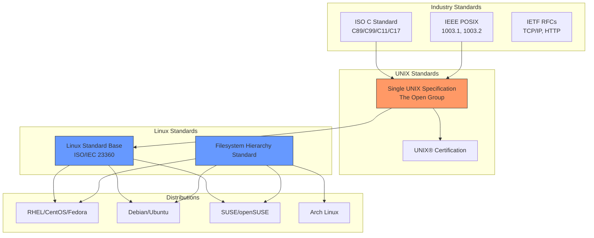
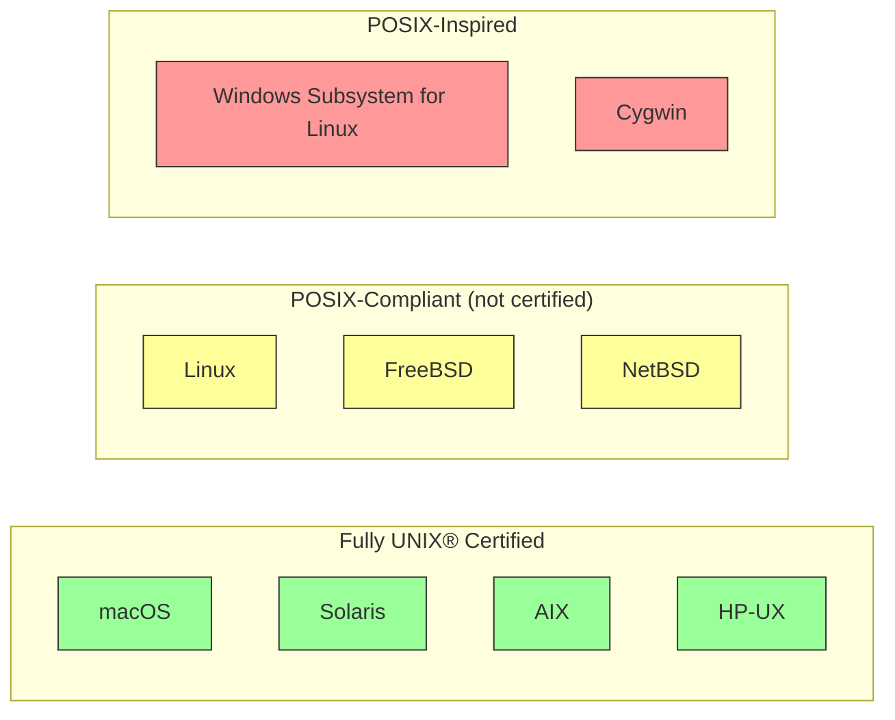
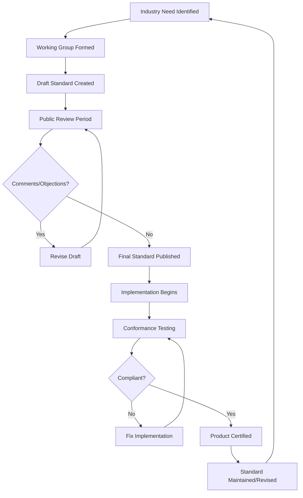

# Chapter 3: POSIX and Standards

## 3.1 Introduction

Standards are the invisible infrastructure of computing. Without POSIX, the Single UNIX Specification (SUS), and related standards, Unix-like systems would be a Tower of Babel—incompatible variants that fragment the ecosystem and make portable software impossible. This chapter explains why standards matter, how they are created, and how they shaped the Linux ecosystem.

## 3.2 Intuition

Consider a simple C program that reads a file:

```c
#include <stdio.h>
#include <fcntl.h>
#include <unistd.h>

int main() {
    int fd = open("data.txt", O_RDONLY);
    char buf[1024];
    ssize_t n = read(fd, buf, sizeof(buf));
    write(STDOUT_FILENO, buf, n);
    close(fd);
    return 0;
}
```

This program uses `open()`, `read()`, `write()`, and `close()`—system calls defined by POSIX. Because these interfaces are standardized, this program will compile and run on Linux, macOS, FreeBSD, Solaris, AIX, HP-UX, and virtually every other Unix-like system.

Without standards, each system might define these interfaces differently. You would need different code for each platform. Standards eliminate this fragmentation by defining a common contract between the operating system and application programs.

## 3.3 The Problem Standards Solve

### 3.3.1 The Unix Wars Revisited

As discussed in Chapter 1, the late 1980s and early 1990s were dominated by the Unix Wars—competing vendors each adding proprietary extensions to their Unix variants. The result was:

- **Application developers** had to write separate code for each Unix variant
- **System administrators** had to learn different tools and conventions for each system
- **Users** experienced inconsistent behavior across platforms
- **Businesses** were reluctant to invest in Unix because of vendor lock-in

The Unix Wars threatened to destroy the Unix ecosystem. Microsoft, with its single Windows platform, was the beneficiary of this fragmentation.

### 3.3.2 The Need for a Common Interface

The solution was obvious: define a common standard that all Unix vendors would implement. This would:

- Allow developers to write portable applications
- Give users a consistent experience across platforms
- Reduce the cost of maintaining software
- Create a level playing field for vendors

The challenge was political as much as technical: getting competing vendors to agree on a common standard required diplomacy, compromise, and sometimes legal mandates.

## 3.4 POSIX

### 3.4.1 What is POSIX?

**POSIX** (Portable Operating System Interface) is a family of standards specified by the IEEE (Institute of Electrical and Electronics Engineers). The name was coined by Richard Stallman, who was invited to contribute to the standardization effort.

POSIX defines the application programming interface (API), along with shell and utilities interfaces, for software compatible with variants of Unix and other operating systems.

The formal designation is **IEEE Std 1003**, with various subparts:

| Standard | Title | Description |
|----------|-------|-------------|
| IEEE 1003.1 | System Interface | C API for system calls and library functions |
| IEEE 1003.2 | Shell and Utilities | Shell command language and utility programs |
| IEEE 1003.13 | Real-time Profiles | Real-time extensions |
| IEEE 1003.15 | Batch Processing | Batch queueing extensions |
| IEEE 1003.17 | Directory Services | Directory services API |

### 3.4.2 POSIX.1: The System Interface

**POSIX.1** (IEEE Std 1003.1-1988, later revised as 1003.1-1990, 1003.1-2001, 1003.1-2008, and 1003.1-2017) defines the C language interface to the operating system. It specifies:

#### System Calls
- **Process management**: `fork()`, `exec()` family, `wait()`, `waitpid()`, `_exit()`
- **File I/O**: `open()`, `close()`, `read()`, `write()`, `lseek()`, `fcntl()`
- **File system**: `stat()`, `fstat()`, `lstat()`, `mkdir()`, `rmdir()`, `link()`, `unlink()`
- **Signals**: `signal()`, `sigaction()`, `kill()`, `raise()`
- **Process groups and sessions**: `setsid()`, `getpgrp()`, `setpgid()`
- **Terminal I/O**: `tcgetattr()`, `tcsetattr()`
- **Pipes**: `pipe()`, `mkfifo()`
- **Memory management**: `mmap()`, `munmap()`, `mprotect()`

#### Library Functions
- **Standard I/O**: `fopen()`, `fclose()`, `fread()`, `fwrite()`, `printf()`, `scanf()`
- **String functions**: `strlen()`, `strcpy()`, `strcat()`, `strcmp()`
- **Memory functions**: `malloc()`, `free()`, `memcpy()`, `memset()`
- **Math functions**: `sin()`, `cos()`, `sqrt()`, `pow()`
- **Regular expressions**: `regcomp()`, `regexec()`
- **Date and time**: `time()`, `strftime()`, `localtime()`

### 3.4.3 POSIX.2: Shell and Utilities

**POSIX.2** defines the shell command language and a set of standard utility programs. This ensures that shell scripts are portable across POSIX-compliant systems.

#### The POSIX Shell
The POSIX shell is based on the Bourne shell and specifies:
- Variable expansion
- Command substitution
- Arithmetic expansion
- Quoting rules
- Control flow (`if`, `while`, `for`, `case`)
- Functions
- Here documents

#### Standard Utilities
POSIX.2 defines approximately 160 utilities, including:
- File manipulation: `ls`, `cp`, `mv`, `rm`, `mkdir`, `chmod`, `chown`
- Text processing: `grep`, `sed`, `awk`, `sort`, `uniq`, `cut`, `tr`
- Process management: `ps`, `kill`, `nice`, `nohup`
- Shell built-ins: `cd`, `echo`, `exit`, `export`, `set`, `unset`

### 3.4.4 The POSIX Branding

The IEEE allows products to be certified as "POSIX-compliant" through a testing process. However, few vendors actually pursued formal certification—most simply claimed "POSIX compliance" without formal testing.

The Open Group later took over POSIX certification through the **UNIX® certification program**, which tests compliance with the Single UNIX Specification (which incorporates POSIX).

## 3.5 The Single UNIX Specification (SUS)

### 3.5.1 History

The **Single UNIX Specification (SUS)** is a superset of POSIX, maintained by **The Open Group**. Its lineage:

1. **1984**: /usr/group standard (the first attempt at a Unix standard)
2. **1988**: POSIX.1 (IEEE)
3. **1990**: POSIX.2 (IEEE)
4. **1994**: X/Open CAE (Common Applications Environment) Spec 4 (XPG4)
5. **1997**: Single UNIX Specification Version 2 (SUSv2)
6. **2001**: Single UNIX Specification Version 3 (SUSv3) — merged with POSIX.1-2001
7. **2008**: Single UNIX Specification Version 4 (SUSv4) — merged with POSIX.1-2008
8. **2018**: Single UNIX Specification Version 5 (SUSv5) — merged with POSIX.1-2017

### 3.5.2 What SUS Adds Over POSIX

SUS extends POSIX with additional interfaces:

- **System interfaces**: Additional functions like `dlopen()` (dynamic linking), `pthreads` extensions, and real-time extensions
- **Commands and utilities**: Additional utilities like `pax` (portable archive exchange)
- **Networking**: Socket interfaces (from BSD)
- **Internationalization**: Wide character support, locale handling
- **Threads**: POSIX threads (pthreads) specification

### 3.5.3 UNIX® Certification

The Open Group grants the right to use the **UNIX®** trademark to operating systems that pass the SUS compliance tests. Currently certified UNIX systems include:

- **macOS** (Apple)
- **Solaris** (Oracle)
- **HP-UX** (Hewlett Packard Enterprise)
- **AIX** (IBM)
- **z/OS** (IBM, mainframe)

Notably, **Linux is not UNIX® certified** (though individual distributions could pursue certification, none have done so as of 2024). Linux is "Unix-like" but not officially Unix.

## 3.6 The Linux Standard Base (LSB)

### 3.6.1 What is LSB?

The **Linux Standard Base (LSB)** is a joint project by several Linux distributions under the Linux Foundation. It extends POSIX and SUS with Linux-specific standardizations:

- **Binary compatibility**: LSB defines a standard ABI (Application Binary Interface) so that applications compiled for LSB can run on any LSB-compliant distribution.
- **Package format**: LSB originally specified RPM as the standard package format (though this was controversial).
- **System initialization**: LSB defined a standard init script interface.
- **Libraries**: LSB specifies which system libraries must be available and their interfaces.
- **Desktop**: LSB includes specifications for the desktop environment (Qt, GTK).

### 3.6.2 LSB Versions

| Version | Year | Key Features |
|---------|------|--------------|
| LSB 1.0 | 2001 | Initial specification |
| LSB 1.1 | 2001 | Added IA-64 and S/390 architectures |
| LSB 1.2 | 2002 | Added PPC architecture |
| LSB 1.3 | 2002 | Improved desktop support |
| LSB 2.0 | 2004 | Major revision, added C++ ABI |
| LSB 3.0 | 2005 | Aligned with ISO standardization |
| LSB 3.1 | 2005 | ISO/IEC 23360 |
| LSB 3.2 | 2007 | Updated libraries |
| LSB 4.0 | 2008 | Major update |
| LSB 4.1 | 2011 | Latest major release |
| LSB 5.0 | 2015 | Simplified specification |

### 3.6.3 LSB's Decline

LSB has largely faded in relevance. Several factors contributed:

1. **Distribution diversity**: The Linux ecosystem is too diverse for a single standard. Distributions have different philosophies, package managers, and system configurations.
2. **Containerization**: Containers (Docker, etc.) solve the portability problem differently—by bundling the application with its dependencies.
3. **Flatpak and Snap**: Universal package formats that bypass the distribution-specific package manager.
4. **Lack of adoption**: Few applications actually targeted LSB certification.
5. **Distro fragmentation**: The fragmentation between RPM-based and Debian-based distributions made a single standard difficult.

Despite its decline, LSB influenced Linux development by documenting best practices and providing a reference for system behavior.

## 3.7 Other Relevant Standards

### 3.7.1 Filesystem Hierarchy Standard (FHS)

The **FHS** defines the directory structure and directory contents in Linux and other Unix-like operating systems:

| Directory | Purpose |
|-----------|---------|
| `/` | Root of the filesystem |
| `/bin` | Essential user command binaries |
| `/boot` | Boot loader files |
| `/dev` | Device files |
| `/etc` | System configuration files |
| `/home` | User home directories |
| `/lib` | Essential shared libraries |
| `/media` | Mount points for removable media |
| `/mnt` | Mount points for temporary filesystems |
| `/opt` | Add-on application software packages |
| `/proc` | Process information pseudo-filesystem |
| `/root` | Home directory for the root user |
| `/sbin` | Essential system binaries |
| `/srv` | Data for services provided by the system |
| `/sys` | Kernel and system information pseudo-filesystem |
| `/tmp` | Temporary files |
| `/usr` | Secondary hierarchy (shareable, read-only data) |
| `/var` | Variable data (logs, spool, cache) |

### 3.7.2 The IETF and RFCs

The **Internet Engineering Task Force (IETF)** defines networking standards through **RFCs** (Requests for Comments). Relevant RFCs include:

- **RFC 791**: Internet Protocol (IP)
- **RFC 793**: Transmission Control Protocol (TCP)
- **RFC 768**: User Datagram Protocol (UDP)
- **RFC 2616**: HTTP/1.1
- **RFC 3986**: URI Syntax
- **RFC 5321**: SMTP

Linux's networking stack implements these standards, making it a key platform for internet services.

### 3.7.3 C Language Standards

The C programming language is standardized by ISO:

| Standard | Year | Common Name |
|----------|------|-------------|
| ANSI C | 1989 | C89, ANSI C |
| ISO C90 | 1990 | C90 (same as C89) |
| C99 | 1999 | C99 |
| C11 | 2011 | C11 |
| C17 | 2018 | C17 |
| C23 | 2024 | C23 |

GCC and glibc implement these standards, with C99 and C11 being the most commonly targeted versions in Linux development.

## 3.8 Why Standards Matter for Linux

### 3.8.1 Portability

Standards ensure that code written for one Linux distribution (or Unix-like system) will work on others. This is critical for:

- **Application developers**: Write once, run anywhere (within the POSIX ecosystem)
- **System administrators**: Scripts and tools work across different distributions
- **Embedded systems**: Consistent behavior across different hardware platforms

### 3.8.2 Quality Assurance

Standards provide a reference against which implementations can be tested. The **POSIX Test Suite** (maintained by The Open Group) includes thousands of test cases that verify compliance.

### 3.8.3 Education

Standards provide a stable reference for teaching operating systems concepts. When a textbook says "the `fork()` system call creates a new process," students can look up the POSIX specification to understand the exact behavior.

### 3.8.4 Legal and Regulatory Compliance

Some industries (financial services, healthcare, government) require compliance with specific standards. POSIX compliance can be a requirement for government contracts.

## 3.9 Code Examples

### 3.9.1 POSIX-Compliant Process Creation

```c
#include <stdio.h>
#include <stdlib.h>
#include <unistd.h>
#include <sys/wait.h>
#include <errno.h>
#include <string.h>

int main(void) {
    pid_t pid;
    int status;
    
    pid = fork();
    
    if (pid == -1) {
        /* POSIX requires fork() to set errno */
        fprintf(stderr, "fork failed: %s\n", strerror(errno));
        return EXIT_FAILURE;
    } else if (pid == 0) {
        /* Child process */
        /* POSIX specifies execlp searches PATH */
        execlp("echo", "echo", "Hello from child", NULL);
        
        /* If execlp returns, an error occurred */
        fprintf(stderr, "execlp failed: %s\n", strerror(errno));
        _exit(EXIT_FAILURE);  /* Use _exit(), not exit() after fork */
    } else {
        /* Parent process */
        /* POSIX specifies waitpid behavior */
        if (waitpid(pid, &status, 0) == -1) {
            fprintf(stderr, "waitpid failed: %s\n", strerror(errno));
            return EXIT_FAILURE;
        }
        
        if (WIFEXITED(status)) {
            printf("Child exited with status %d\n", 
                   WEXITSTATUS(status));
        }
    }
    
    return EXIT_SUCCESS;
}
```

### 3.9.2 POSIX Signal Handling

```c
#include <stdio.h>
#include <signal.h>
#include <unistd.h>
#include <string.h>

volatile sig_atomic_t got_signal = 0;

/* POSIX-safe signal handler: only set a flag */
void signal_handler(int signum) {
    got_signal = signum;
}

int main(void) {
    struct sigaction sa;
    
    /* POSIX: Use sigaction() instead of signal() */
    memset(&sa, 0, sizeof(sa));
    sa.sa_handler = signal_handler;
    sa.sa_flags = 0;  /* No SA_RESTART - let read() be interrupted */
    sigemptyset(&sa.sa_mask);
    
    if (sigaction(SIGINT, &sa, NULL) == -1) {
        perror("sigaction");
        return 1;
    }
    
    printf("PID: %d - Press Ctrl+C to send SIGINT\n", getpid());
    
    while (!got_signal) {
        pause();  /* POSIX: suspend until signal */
    }
    
    printf("\nReceived signal %d\n", got_signal);
    return 0;
}
```

### 3.9.3 POSIX Threads

```c
#include <stdio.h>
#include <stdlib.h>
#include <pthread.h>
#include <unistd.h>

#define NUM_THREADS 4

/* POSIX thread function signature: void* (*)(void*) */
void *thread_func(void *arg) {
    int thread_id = *(int *)arg;
    
    printf("Thread %d: started (TID: %lu)\n", 
           thread_id, (unsigned long)pthread_self());
    
    /* Simulate work */
    sleep(1);
    
    printf("Thread %d: finished\n", thread_id);
    
    /* POSIX: return value from thread */
    int *result = malloc(sizeof(int));
    *result = thread_id * 10;
    return result;
}

int main(void) {
    pthread_t threads[NUM_THREADS];
    int thread_ids[NUM_THREADS];
    int i;
    
    /* POSIX: Create threads */
    for (i = 0; i < NUM_THREADS; i++) {
        thread_ids[i] = i;
        int ret = pthread_create(&threads[i], NULL, 
                                 thread_func, &thread_ids[i]);
        if (ret != 0) {
            fprintf(stderr, "pthread_create failed: %d\n", ret);
            return 1;
        }
    }
    
    /* POSIX: Join threads and collect results */
    for (i = 0; i < NUM_THREADS; i++) {
        void *retval;
        pthread_join(threads[i], &retval);
        
        int *result = (int *)retval;
        printf("Main: thread %d returned %d\n", i, *result);
        free(result);
    }
    
    printf("All threads completed.\n");
    return 0;
}
```

### 3.9.4 POSIX-Compliant Shell Script

```bash
#!/bin/sh
# POSIX-compliant shell script
# Note: #!/bin/sh, not #!/bin/bash

# POSIX variable expansion
name="World"
echo "Hello, ${name}!"

# POSIX command substitution (preferred: $() over backticks)
current_date=$(date '+%Y-%m-%d')
echo "Today is: $current_date"

# POSIX test (preferred: [ ] over [[ ]])
if [ -f "/etc/passwd" ]; then
    echo "File exists"
fi

# POSIX arithmetic (no bashisms like (( )) or $(( )) in [ ])
count=10
if [ "$count" -gt 5 ]; then
    echo "Count is greater than 5"
fi

# POSIX portable shebang and set options
set -e  # Exit on error
set -u  # Treat unset variables as errors
set -f  # Disable globbing

# POSIX portable string operations
path="/usr/local/bin/program"
dir="${path%/*}"      # Remove filename: /usr/local/bin
file="${path##*/}"    # Remove directory: program

echo "Directory: $dir"
echo "File: $file"

# POSIX portable loop
for file in *.txt; do
    [ -f "$file" ] || continue  # Skip if no .txt files
    echo "Processing: $file"
done
```

## 3.10 Diagrams

### 3.10.1 Standards Hierarchy



### 3.10.2 POSIX Compliance Spectrum



### 3.10.3 The Standards Process



## 3.11 Common Pitfalls

### 3.11.1 Bashisms in POSIX Scripts

**The mistake**: Using bash-specific syntax in a script with `#!/bin/sh`.

**Common bashisms to avoid:**
- `[[ ]]` — Use `[ ]` instead
- `(( ))` — Use `expr` or `$(( ))` instead
- `${var:offset:length}` — Use `expr substr` or parameter expansion
- `<<<` (here strings) — Use `echo ... |` instead
- `source` — Use `.` instead
- `function` keyword — Use `funcname()` instead
- Arrays — Not available in POSIX sh
- `&>` — Use `>file 2>&1` instead

**Tool**: Use `shellcheck` to detect bashisms in shell scripts.

### 3.11.2 Assuming POSIX Means Identical Behavior

**The mistake**: Assuming all POSIX-compliant systems behave identically.

**The reality**: POSIX specifies *interfaces*, not *implementations*. Two systems can implement the same interface with different behavior in edge cases. For example:
- The order of entries returned by `readdir()` is unspecified
- The behavior of `signal()` vs `sigaction()` varies (BSD vs System V semantics)
- Thread scheduling policies have different default behaviors

### 3.11.3 Ignoring Error Handling

**The mistake**: Not checking return values from POSIX functions.

**The reality**: POSIX functions have well-defined error reporting mechanisms (return values and `errno`). Ignoring errors leads to undefined behavior and hard-to-debug failures.

## 3.12 Best Practices

### 3.12.1 Write POSIX-Portable Code When Possible

- Use `#include <unistd.h>` for POSIX functions
- Use `#define _POSIX_C_SOURCE` to enable POSIX features
- Avoid GNU-specific extensions unless necessary
- Use `autoconf`/`automake` for portability detection

### 3.12.2 Use the Latest Relevant Standard

- Target C11 (or C99 minimum) for new C code
- Target POSIX.1-2008 (or later) for system interfaces
- Use `_POSIX_C_SOURCE 200809L` to enable POSIX.1-2008 features

### 3.12.3 Test on Multiple Platforms

Even if you target Linux, testing on multiple distributions (and optionally FreeBSD/macOS) helps catch portability issues early.

## 3.13 Exercises

### Exercise 1: POSIX Compliance Check
Write a shell script that checks whether your system is POSIX-compliant by:
- Checking for required utilities (`ls`, `grep`, `sed`, etc.)
- Verifying standard directories exist (`/bin`, `/usr`, `/etc`)
- Testing POSIX shell features (parameter expansion, command substitution)

### Exercise 2: Port a Script to POSIX sh
Take a bash script and rewrite it to be POSIX-compliant. Use `shellcheck -s sh` to verify.

### Exercise 3: Study the POSIX Specification
Read the POSIX.1-2017 specification for the `fork()` system call. Document:
- Required behavior
- Optional behavior
- Error conditions
- Differences from the Linux implementation

### Exercise 4: Build a Portable C Program
Write a C program that:
- Uses only POSIX-specified interfaces
- Compiles without warnings on both GCC and Clang
- Runs on both Linux and macOS (if available)

### Exercise 5: FHS Compliance Audit
Audit your Linux system's filesystem hierarchy against the FHS specification. Identify:
- Non-standard directories or files
- Missing required directories
- Files in the wrong location

## 3.14 References

1. IEEE Std 1003.1-2017. "IEEE Standard for Information Technology—Portable Operating System Interface (POSIX™)." https://pubs.opengroup.org/onlinepubs/9699919799/
2. The Open Group. "The Single UNIX Specification." https://www.opengroup.org/unix
3. Linux Standard Base. https://refspecs.linuxfoundation.org/lsb.shtml
4. Filesystem Hierarchy Standard. https://refspecs.linuxfoundation.org/fhs.shtml
5. Open Group Base Specifications. https://pubs.opengroup.org/onlinepubs/9699919799/
6. Lewine, D. (1991). *POSIX Programmer's Guide*. O'Reilly.
7. Butenhof, D.R. (1997). *Programming with POSIX Threads*. Addison-Wesley.
8. Stevens, W.R. and Rago, S.A. (2013). *Advanced Programming in the UNIX Environment*. 3rd ed. Addison-Wesley.
9. Garfinkel, S., Weise, G., and Strassmann, S. (1994). *The UNIX-HATERS Handbook*. IDG Books.
10. shellcheck. https://www.shellcheck.net/
