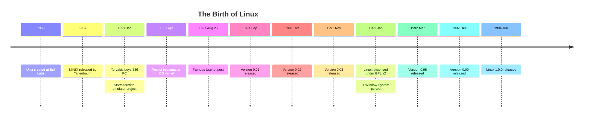
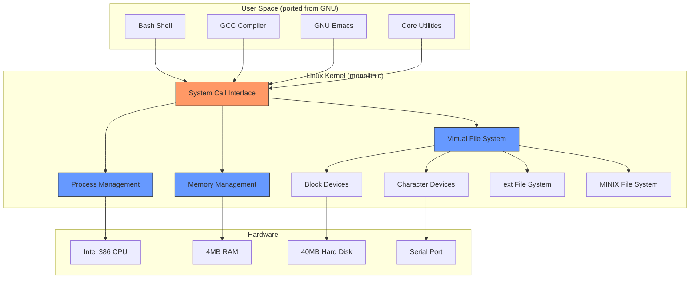
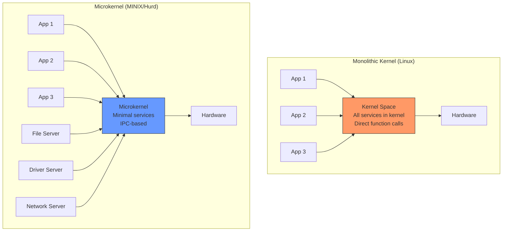

# Chapter 4: The Creation of Linux

## 4.1 Introduction

The creation of Linux is one of the most remarkable stories in the history of technology. A 21-year-old Finnish student, frustrated by the limitations of a teaching operating system, wrote a kernel from scratch as a hobby project. That hobby project would grow to power the majority of the world's servers, all of the top 500 supercomputers, billions of Android phones, and much of the internet's infrastructure. This chapter tells the story of how Linux came to be.

## 4.2 Intuition

To understand why Linus Torvalds created Linux, you need to understand three converging forces in 1991:

1. **The PC revolution**: IBM PC compatibles with Intel 386 processors were becoming powerful enough to run a real operating system—not just DOS.

2. **The Unix accessibility problem**: Real Unix cost thousands of dollars and required expensive hardware. Students and hobbyists couldn't afford it.

3. **MINIX's limitations**: Andrew Tanenbaum's MINIX, while educational, was deliberately limited—it was a teaching tool, not a production operating system.

Linux was born at the intersection of these forces: a powerful PC, a desire for Unix, and the absence of an affordable, capable, hackable Unix-like system for personal computers.

## 4.3 Linus Torvalds

### 4.3.1 Early Life

Linus Benedict Torvalds was born on December 28, 1969, in Helsinki, Finland. His family was Swedish-speaking Finnish (Finland has both Finnish and Swedish as official languages). His father, Nils Torvalds, was a journalist and politician. His mother, Anna Torvalds, was also a journalist.

Linus was named after Linus Pauling, the Nobel Prize-winning chemist—a choice made by his grandfather, a statistics professor and communist sympathizer who admired Pauling's left-wing politics.

### 4.3.2 First Computer

Torvalds got his first computer in 1981: a **Commodore VIC-20**, an 8-bit home computer with 5KB of RAM. He learned BASIC and 6502 assembly language on it. He later described the experience:

> "It was the first time I had a computer that was mine. I could program it, and nobody could tell me what to do with it."

In 1988, Torvalds enrolled at the University of Helsinki to study computer science. That same year, the university acquired a **MicroVAX** running Ultrix (DEC's version of Unix). Torvalds was hooked.

### 4.3.3 The 386 PC

In January 1991, Torvalds purchased an **Intel 386-based PC**—a 33 MHz 80386DX with 4MB of RAM and a 40MB hard drive. This was a significant investment for a student. The 386 was the first Intel processor with protected mode, virtual memory, and paging—features essential for a modern operating system.

Torvalds initially ran MS-DOS on the machine but quickly grew bored. He wanted Unix. He tried MINIX but was frustrated by its limitations.

## 4.4 MINIX: The Catalyst

### 4.4.1 What is MINIX?

**MINIX** (Mini-Unix) was created by **Andrew S. Tanenbaum**, a professor of computer science at the Vrije Universiteit in Amsterdam. Tanenbaum wrote MINIX as a teaching tool to accompany his textbook *Operating Systems: Design and Implementation* (1987).

MINIX was a Unix-like operating system designed to run on IBM PC compatibles. It was:
- Small enough to be understood by a student (approximately 12,000 lines of C code)
- Well-documented (the textbook explained every line of code)
- Available with source code

However, MINIX had deliberate limitations:
- It was designed for the 8086/8088 processor (though later versions supported the 286 and 386)
- Tanenbaum resisted adding features that would make it a "real" operating system
- Its license restricted modification and redistribution (it was not free software in the GNU sense)

### 4.4.2 Tanenbaum's Philosophy vs. Torvalds' Ambition

Tanenbaum believed that an operating system should be:
- **Simple**: Easy to understand and teach
- **Modular**: Based on a microkernel architecture
- **Clean**: Well-designed from the start

Torvalds wanted an operating system that was:
- **Powerful**: Could exploit the full capabilities of the 386
- **Practical**: Could be used for real work, not just education
- **Hackable**: Could be modified and extended freely

This philosophical difference would later lead to the famous Tanenbaum-Torvalds debate (Chapter 5).

### 4.4.3 The Terminal Emulator

In early 1991, Torvalds began writing a **terminal emulator**—a program to connect to the university's Unix server from his PC. He wanted to dial into the university's MicroVAX and use it remotely.

But Torvalds didn't want to write a simple terminal emulator. He wanted to understand the hardware at a deep level. So instead of writing a DOS program, he wrote directly to the hardware—bypassing DOS entirely.

This terminal emulator grew. First it could dial into the university. Then it could read and write to the disk. Then it had a simple file system. Then it could run processes.

By April 1991, Torvalds realized he was no longer writing a terminal emulator—he was writing an operating system kernel.

## 4.5 The Famous Usenet Post

### 4.5.1 The Announcement

On August 25, 1991, Torvalds posted a message to the `comp.os.minix` Usenet newsgroup:

```
From: torvalds@klaava.Helsinki.FI (Linus Benedict Torvalds)
Newsgroups: comp.os.minix
Subject: What would you like to see most in minix?
Summary: small poll for my new operating system
Message-ID: <1991Aug25.205708.9541@klaava.Helsinki.FI>
Date: 25 Aug 91 20:57:08 GMT
Organization: University of Helsinki

Hello everybody out there using minix -

I'm doing a (free) operating system (just a hobby, won't be big and
professional like gnu) for 386(486) AT clones.  This has been brewing
since april, and is starting to get ready.  I'd like any feedback on
things people like/dislike in minix, as my OS resembles it somewhat
(same physical layout of the file-system (due to practical reasons)
among other things).

I've currently ported bash(1.08) and gcc(1.40), and things seem to work.
This implies that I'll get something practical within a few months, and
I'd like to know what features most people would want.  Any suggestions
are welcome, but I won't promise I'll implement them :-)

                Linus (torvalds@kruuna.helsinki.fi)

PS.  Yes - it's free of any minix code, and it has a multi-threaded fs.
It is NOT protable (sic) (it utilizes 386 task switching etc), and it
probably never will support anything other than AT-harddisks, as that's
all I have :-(.
```

This message is one of the most significant postings in computing history. Several things are notable:

1. **"just a hobby, won't be big and professional like gnu"**: Famous last words.
2. **"it's free of any minix code"**: Torvalds was careful to ensure his kernel was original work, not a copy of MINIX.
3. **"NOT protable"**: Torvalds initially thought Linux would never be portable beyond the 386. It now runs on everything from smartphones to supercomputers.
4. **"probably never will support anything other than AT-harddisks"**: Linux now supports virtually every storage device ever made.

### 4.5.2 The Naming Controversy

Torvalds initially called his kernel **"Freax"** (a combination of "free," "freak," and the Unix convention of appending "x" to names). When Ari Lemmke, a fellow student who administered the FTP server where the kernel was uploaded, created a directory for the project, he named it "linux" instead of "freax." Torvalds didn't object, and the name stuck.

The pronunciation has been debated. Torvalds himself pronounces it "LEE-nooks" (with a short 'i'), but "LIH-nooks" is more common in English. In a famous 2005 video, Torvalds demonstrated the pronunciation and declared, "I am Linus Torvalds, and I pronounce Linux as 'Linux'."

### 4.5.3 Version 0.01

Linux version 0.01 was released in September 1991. It was not a complete operating system—it couldn't even boot on its own. You needed MINIX to compile and run it. The code was approximately 10,000 lines of C and assembly.

Version 0.01 could:
- Run a shell (bash)
- Run basic Unix utilities (ported from GNU)
- Read and write MINIX filesystems
- Handle basic process management

It could not:
- Boot independently (required MINIX as a development environment)
- Access the network
- Run X Window System
- Handle more than one terminal

### 4.5.4 Version 0.02

Version 0.02, released in October 1991, was the first version that Torvalds considered usable. It could run GNU Emacs (a significant milestone) and basic Unix utilities. Torvalds began receiving patches from other users.

### 4.5.5 Version 0.03

Version 0.03, released in December 1991, added the `ioctl()` system call and could run more programs. By this point, Torvalds was receiving regular contributions from other developers.

### 4.5.6 Version 0.10 and 0.11

Version 0.10, released in December 1991, and version 0.11, released in January 1992, were the first versions that were genuinely usable as a Unix-like system. They could:
- Run X Window System (ported by Orest Zborowski)
- Support multiple users
- Run most GNU utilities
- Access the network (basic support)

## 4.6 The Licensing Decision

### 4.6.1 The Original License

Linux was initially released under a license that prohibited commercial redistribution. Torvalds wanted to ensure that nobody would sell his work without contributing back.

However, this license was incompatible with the GNU GPL, which meant that GNU tools (like GCC and glibc) could not be legally distributed with Linux.

### 4.6.2 The Switch to GPL

In January 1992, Torvalds re-licensed Linux under the **GNU General Public License (GPL) version 2**. This was a pivotal decision:

1. **Compatibility**: Linux could now be distributed with GNU tools (GCC, glibc, Bash, etc.), forming a complete operating system.
2. **Contributions**: Developers were more willing to contribute to a GPL-licensed project, knowing their contributions would remain free.
3. **Distribution**: Linux distributions could legally bundle GNU tools with the kernel.

The GPL decision was arguably as important as the technical work itself. Without the GPL, Linux might have remained a niche hobby project.

## 4.7 Early Development Community

### 4.7.1 The First Contributors

The Linux development community grew rapidly in 1992 and 1993. Early contributors included:

- **Theodore Ts'o (tytso)**: Contributed the ext2 file system, which became the standard Linux file system for many years.
- **Remy Card**: Also contributed to ext2.
- **Alan Cox**: Major contributor to networking code and later a key maintainer.
- **H. Peter Anvin**: Contributed to the boot process and assembly code.
- **Miguel de Icaza**: Later founded the GNOME desktop project.
- **Orest Zborowski**: Ported X Window System to Linux.

### 4.7.2 The Development Model

The early Linux development model was informal:
- Torvalds collected patches via email
- Discussions happened on the `comp.os.minix` and later `linux.dev` Usenet newsgroups
- Releases were uploaded to the FTP server at `ftp.funet.fi`
- There was no formal bug tracking, no code review process, no CI/CD

This model worked because the community was small and Torvalds was a remarkably skilled integrator—he could read patches, understand their implications, and merge them quickly.

## 4.8 The Tanenbaum-Torvalds Debate

### 4.8.1 The Exchange

In January 1992, Andrew Tanenbaum posted a message to `comp.os.minix` with the subject "LINUX is obsolete":

> "I was personally impressed by the Linux effort. However, I think the choice of a monolithic kernel is a big mistake. The monolithic approach is fundamentally flawed... Linux is obsolete."

Tanenbaum argued that microkernels were the future of operating system design. Monolithic kernels (like Linux) were, in his view, a step backward.

Torvalds responded:

> "Your langstrumpf langstrumpf langstrumpf langstrumpf langstrumpf langstrumpf langstrumpf langstrumpf langstrumpf..."

Just kidding. Torvalds' actual response was more measured but equally firm:

> "If the GNU kernel had been ready last spring, I'd not have bothered to even start my project: the fact is that it wasn't and still isn't. Linux wins heavily on points of being available now."

### 4.8.2 The Technical Debate

The debate centered on two architectural approaches:

**Monolithic kernel (Linux)**:
- All kernel services run in kernel space
- Direct function calls between subsystems
- Higher performance (no IPC overhead)
- A single bug can crash the entire system

**Microkernel (MINIX, Hurd)**:
- Minimal kernel in kernel space
- Most services run in user space
- Better fault isolation
- IPC overhead can reduce performance
- More complex design

The debate has never been fully resolved. In practice, Linux's monolithic approach (with loadable modules) has proven remarkably successful. Most modern operating systems use a **hybrid** approach—neither purely monolithic nor purely microkernel.

### 4.8.3 Historical Context

Tanenbaum's argument was not unreasonable. Microkernels were a hot research topic in the early 1990s, and several high-quality microkernels existed (Mach, QNX, L4). The conventional wisdom in academic OS research was that monolithic kernels were architecturally inferior.

However, Torvalds' pragmatic approach—ship a working system now, optimize later—proved more successful in the marketplace than Tanenbaum's theoretically cleaner design.

## 4.9 The Linux Foundation's Role

The Linux Foundation (originally the Open Source Development Labs, or OSDL, merged with the Free Standards Group in 2007) was established to:

1. **Support Linux development**: Provide infrastructure, funding, and legal support
2. **Promote Linux adoption**: Work with enterprises and governments
3. **Manage trademarks**: The Linux trademark is owned by Linus Torvalds and managed by the Linux Foundation
4. **Host collaborative projects**: Kubernetes, Node.js, Let's Encrypt, and many others

Torvalds himself is employed by the Linux Foundation, where he continues to maintain the kernel.

## 4.10 Code Examples

### 4.10.1 A Simple Kernel Module (Modern Equivalent)

While the original Linux 0.01 was very different, here's what a minimal kernel module looks like in modern Linux—showing the same spirit of Torvalds' original work:

```c
/*
 * hello.c - A simple Linux kernel module
 * 
 * This is the modern equivalent of what Torvalds might have written
 * in 1991, adapted for today's kernel API.
 */

#include <linux/init.h>
#include <linux/module.h>
#include <linux/kernel.h>

MODULE_LICENSE("GPL");
MODULE_AUTHOR("Your Name");
MODULE_DESCRIPTION("A simple Hello World kernel module");
MODULE_VERSION("0.1");

static int __init hello_init(void) {
    printk(KERN_INFO "Hello, World! Welcome to Linux.\n");
    printk(KERN_INFO "Kernel version: %s\n", UTS_RELEASE);
    return 0;  // 0 = success
}

static void __exit hello_exit(void) {
    printk(KERN_INFO "Goodbye, World! Unloading module.\n");
}

module_init(hello_init);
module_exit(hello_exit);
```

Build with:
```makefile
# Makefile for kernel module
obj-m += hello.o

KDIR := /lib/modules/$(shell uname -r)/build

all:
	$(MAKE) -C $(KDIR) M=$(PWD) modules

clean:
	$(MAKE) -C $(KDIR) M=$(PWD) clean
```

### 4.10.2 A Minimal User-Space Program from 1991

The following C program would have compiled and run on Linux 0.01:

```c
/*
 * A minimal program that would have run on Linux 0.01
 * Uses only system calls available in the original kernel
 */

#include <unistd.h>
#include <fcntl.h>
#include <sys/types.h>

int main(void) {
    const char *msg = "Hello from Linux!\n";
    int fd;
    
    /* write() - one of the first system calls Torvalds implemented */
    write(STDOUT_FILENO, msg, 18);
    
    /* open() and write() to a file */
    fd = open("/tmp/test.txt", O_WRONLY | O_CREAT | O_TRUNC, 0644);
    if (fd >= 0) {
        write(fd, "Linux 0.01 test file\n", 21);
        close(fd);
    }
    
    return 0;
}
```

### 4.10.3 Examining the Boot Process

```bash
# Check your kernel version
uname -r

# View kernel boot messages
dmesg | head -50

# Check kernel command line
cat /proc/cmdline

# View loaded modules
lsmod | head -20

# Check kernel configuration
zcat /proc/config.gz | grep "CONFIG_MODULES" || cat /boot/config-$(uname -r) | grep "CONFIG_MODULES"
```

## 4.11 Diagrams

### 4.11.1 The Birth of Linux Timeline



### 4.11.2 Linux Architecture at Birth



### 4.11.3 The Microkernel vs Monolithic Kernel Debate



## 4.12 Common Pitfalls

### 4.12.1 Myth: Linux is a Clone of Unix

**The mistake**: Saying Linux is a copy of Unix.

**The reality**: Linux was written from scratch. It implements the same interfaces (POSIX) and follows the same design principles as Unix, but it contains no Unix code. It's "Unix-like," not "Unix-derived."

### 4.12.2 Myth: Torvalds Wrote Linux Alone

**The mistake**: Attributing all of Linux to Torvalds.

**The reality**: While Torvalds wrote the initial kernel and remains its lead maintainer, Linux has received contributions from over 20,000 developers. The GNU tools, which are essential to a functional Linux system, were written by the GNU Project. Linux is a collaborative effort.

### 4.12.3 Myth: Linux Started as a Professional Project

**The mistake**: Assuming Linux was a funded, planned project.

**The reality**: Linux started as a hobby. Torvalds' Usenet post explicitly says "just a hobby, won't be big and professional like gnu." The organic, unplanned nature of Linux's growth is part of its charm—and its strength.

## 4.13 Best Practices

### 4.13.1 Learn from the Original Source

The Linux kernel source code is freely available. You can browse the earliest versions to understand how Torvalds made design decisions:

```bash
# Download Linux 0.01 source (historical curiosity)
git clone https://github.com/torvalds/linux.git
git log --reverse --oneline | head -20
```

### 4.13.2 Understand the Licensing

Always understand the license of the software you use and contribute to. The GPL's requirements are specific and legally binding.

### 4.13.3 Appreciate the Community

Linux's success is a testament to the power of collaborative development. When you contribute to open-source projects, you're participating in a tradition that stretches back to the earliest days of computing.

## 4.14 Exercises

### Exercise 1: Read the Original Source
Download or browse the Linux 0.01 source code (available at https://github.com/torvalds/linux/releases/tag/0.01). Read the `kernel/sched.c` file and the `kernel/chr_drv/console.c` file. Document what you find.

### Exercise 2: Compile a Modern Kernel
Compile the Linux kernel from source:
1. Download the latest kernel source from kernel.org
2. Configure with `make menuconfig`
3. Build with `make -j$(nproc)`
4. Install and boot your custom kernel

### Exercise 3: Write a Kernel Module
Write a kernel module that:
- Prints "Hello from my module" on load
- Prints "Goodbye from my module" on unload
- Creates a `/proc/hello` file that returns "Hello, World!" when read

### Exercise 4: Reproduce the Famous Post
Write a modern version of Torvalds' 1991 Usenet post, adapted for a hypothetical new operating system you're creating. Include:
- What inspired you
- What you've built so far
- What you need help with

### Exercise 5: The Tanenbaum-Torvalds Debate
Research the full text of the Tanenbaum-Torvalds debate. Write a 1000-word essay analyzing:
- Who was right about microkernels vs. monolithic kernels?
- How has the debate evolved since 1992?
- What would you choose for a new OS today?

## 4.15 References

1. Torvalds, L. (1991). Usenet post to comp.os.minix. https://groups.google.com/g/comp.os.minix/c/dlNtH7RRrGA/m/SwRavCzVE7gJ
2. Torvalds, L. and Diamond, D. (2001). *Just for Fun: The Story of an Accidental Revolutionary*. HarperBusiness.
3. Tanenbaum, A.S. (1987). *Operating Systems: Design and Implementation*. Prentice Hall.
4. Moody, G. (2001). *Rebel Code: Linux and the Open Source Revolution*. Perseus.
5. Torvalds, L. (2005). "Linux kernel source code." https://github.com/torvalds/linux
6. Linux 0.01 source code. https://github.com/torvalds/linux/releases/tag/0.01
7. Raymond, E.S. (1999). *The Cathedral and the Bazaar*. O'Reilly.
8. Gorman, M. (2004). "The Linux Kernel." https://www.kernel.org/doc/
9. Kroah-Hartman, G. (2006). *Linux Kernel in a Nutshell*. O'Reilly.
10. The Linux Foundation. "History of Linux." https://www.linuxfoundation.org/
