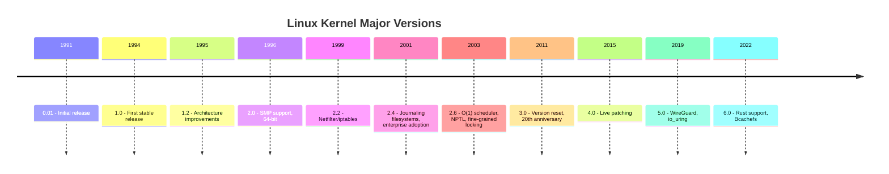
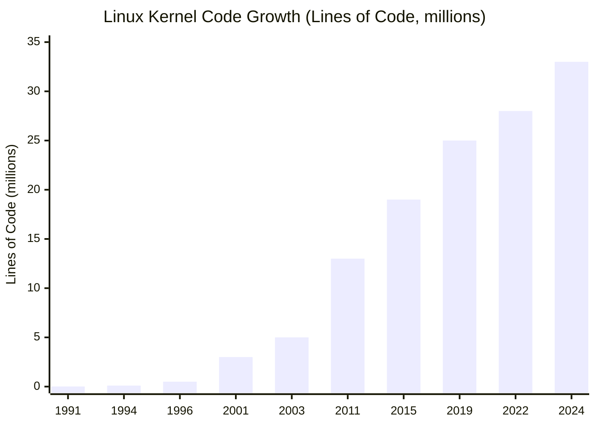

# Chapter 5: Kernel Evolution — From 0.01 to 6.x

## 5.1 Introduction

The Linux kernel has evolved from a 10,000-line terminal emulator to a 30-million-line operating system kernel that powers everything from embedded devices to the world's fastest supercomputers. This chapter traces that evolution through every major version, highlighting the technical innovations, architectural changes, and community milestones that shaped modern Linux.

## 5.2 Intuition

The Linux kernel's evolution follows a pattern common to successful open-source projects:

1. **Scratch an itch**: Each major feature was added because someone needed it.
2. **Release early, release often**: Rapid iteration allowed quick feedback and course correction.
3. **Community-driven development**: Features that mattered to real users got implemented first.
4. **Backward compatibility**: Old applications continue to work on new kernels.

Understanding this pattern helps you predict where the kernel is going and why certain features were prioritized over others.

## 5.3 Pre-1.0: The Wild West (1991–1994)

### 5.3.1 Version 0.01 (September 1991)

The first release. Approximately 10,000 lines of C and assembly. Could run bash and gcc on a 386 PC with a MINIX filesystem. No networking, no X, no multi-user support.

Key features:
- Basic process management (`fork()`, `exec()`)
- MINIX file system support
- Terminal driver
- Basic memory management (no paging)

### 5.3.2 Version 0.02 (October 1991)

The first version Torvalds considered "usable." Could run GNU Emacs and basic Unix utilities. The beginning of the development community—patches started arriving from other users.

### 5.3.3 Version 0.10 (December 1991)

Significant improvements:
- Multiple virtual consoles
- Improved memory management
- Better device driver support
- The beginning of the ext file system

### 5.3.4 Version 0.11 (January 1992)

A major milestone:
- X Window System support (ported by Orest Zborowski)
- Multiple users
- Improved filesystem support
- More device drivers

### 5.3.5 Version 0.95 (March 1992)

The first version that could genuinely be called a Unix-like operating system:
- TCP/IP networking (early implementation)
- Improved virtual memory
- More hardware support

### 5.3.6 Version 0.99 (December 1992)

The last pre-1.0 release. By this point, Linux was a capable Unix-like system with:
- Full TCP/IP networking
- Extended file system (ext)
- X Window System
- Most GNU utilities
- Support for multiple architectures (early)

### 5.3.7 The Rush to 1.0

As Linux 0.99 approached, the community pushed for a 1.0 release. Torvalds was reluctant—he felt there were still too many bugs. But the pressure was immense, and the symbolic importance of "1.0" was undeniable.

## 5.4 Linux 1.0: The First Stable Release (March 1994)

### 5.4.1 What Was in 1.0?

Linux 1.0, released on March 14, 1994, included:
- Stable TCP/IP networking
- The ext file system (later replaced by ext2)
- Support for multiple architectures (i386, Alpha, MIPS)
- Loadable kernel modules
- Improved memory management
- Basic SMP support (very early)

### 5.4.2 What Wasn't in 1.0?

Notable absences:
- No journaled file system (ext2 was available but not journaled)
- Limited SMP support (essentially uniprocessor with some SMP groundwork)
- No USB support
- No 64-bit support
- Limited driver support

### 5.4.3 Community Growth

By 1.0, the Linux community had grown from a handful of contributors to hundreds of active developers. Major distributions (Slackware, Debian, Red Hat) were already shipping.

## 5.5 Linux 1.2 (March 1995)

### 5.5.1 Key Features

- **Improved architecture support**: Better support for Alpha, MIPS, and PowerPC
- **Networking improvements**: NFS client support, improved TCP/IP
- **File system improvements**: Better ext2 performance
- **Device driver updates**: More hardware support

## 5.6 Linux 2.0: The Major Milestone (June 1996)

### 5.6.1 Significance

Linux 2.0 was a major release that brought several critical improvements:

- **Symmetric Multi-Processing (SMP)**: Support for multiple processors. This was essential for enterprise adoption.
- **64-bit architectures**: Support for Alpha and SPARC64
- **Improved networking**: Better TCP/IP performance, IP masquerading
- **Loadable kernel modules**: Improved module system
- **More file systems**: Support for HPFS (OS/2), ISO 9660 (CD-ROM)

### 5.6.2 The SMP Revolution

SMP support transformed Linux from a hobbyist's operating system to a viable server platform. For the first time, Linux could exploit the power of multi-processor servers.

The initial SMP implementation was coarse-grained—a "Big Kernel Lock" (BKL) serialized most kernel operations. This limited scalability but was a necessary first step.

### 5.6.3 Architecture Expansion

Linux 2.0 expanded beyond Intel x86:
- **Alpha** (DEC/Compaq): 64-bit support
- **SPARC** (Sun Microsystems): Workstation support
- **MIPS**: Embedded and workstation support
- **PowerPC**: Apple Macintosh support (early)

## 5.7 Linux 2.2 (January 1999)

### 5.7.1 Key Features

- **Improved SMP**: Finer-grained locking, better scalability
- **Networking improvements**: Netfilter/iptables (replacing ipchains), improved IPv6 support
- **File system improvements**: Better ext2 performance, initial ReiserFS support
- **Memory management**: Improved virtual memory, better page replacement
- **PCMCIA support**: Better laptop support
- **USB support**: Early USB device support

### 5.7.2 Netfilter/iptables

The introduction of **Netfilter** and **iptables** was significant for networking. These replaced the older ipchains and provided a flexible, powerful framework for packet filtering, NAT, and firewalling.

Netfilter's architecture:
```
┌─────────────────────────────────────────┐
│              User Space                  │
│  ┌─────────────────────────────────────┐│
│  │           iptables                  ││
│  └─────────────────────────────────────┘│
├─────────────────────────────────────────┤
│              Kernel Space                │
│  ┌─────────────────────────────────────┐│
│  │           Netfilter                 ││
│  │  ┌─────┐ ┌─────┐ ┌─────┐ ┌─────┐  ││
│  │  │Pre- │ │For- │ │Post-│ │Local│  ││
│  │  │Rout-│ │ward│ │Rout-│ │In/  │  ││
│  │  │ing  │ │    │ │ing  │ │Out  │  ││
│  │  └─────┘ └─────┘ └─────┘ └─────┘  ││
│  └─────────────────────────────────────┘│
│  ┌─────────────────────────────────────┐│
│  │         TCP/IP Stack                ││
│  └─────────────────────────────────────┘│
└─────────────────────────────────────────┘
```

## 5.8 Linux 2.4 (January 2001)

### 5.8.1 Key Features

- **Improved SMP**: Much better multi-processor scalability
- **Networking**: Improved TCP/IP performance, better IPv6, Netfilter improvements
- **File systems**: Journaling file systems (ext3, ReiserFS, XFS, JFS)
- **Device support**: USB 2.0, FireWire, PCMCIA improvements
- **Enterprise features**: Better reliability, improved memory management
- **IA-64 support**: Intel Itanium architecture
- **64-bit improvements**: Better 64-bit support across architectures

### 5.8.2 ext3: The First Journaling File System

The introduction of **ext3** (a journaling extension of ext2) was critical for enterprise adoption. Journaling ensures that file system metadata is consistent even after a crash, eliminating the need for lengthy `fsck` checks.

ext3 added a **journal** to ext2:
- Before writing metadata, write it to the journal first
- After the metadata is committed to the journal, write it to the main file system
- On recovery after a crash, replay the journal to restore consistency

### 5.8.3 Enterprise Adoption

Linux 2.4 was the first kernel widely adopted by enterprises. Companies like IBM, Dell, and HP began offering Linux on their servers. The 2.4 kernel was also the basis for the first major enterprise Linux distributions (Red Hat Enterprise Linux 2.1, released in 2002).

## 5.9 Linux 2.6: The Game Changer (December 2003)

### 5.9.1 Significance

Linux 2.6 was a watershed release that transformed Linux from a viable server operating system to the dominant platform for servers, embedded systems, and eventually mobile devices.

### 5.9.2 Major Features

#### Scheduler: O(1) Scheduler
The **O(1) scheduler**, developed by Ingo Molnár, replaced the previous O(n) scheduler. It could schedule processes in constant time regardless of the number of processes, dramatically improving scalability on systems with thousands of processes.

#### Improved SMP: Fine-Grained Locking
The 2.6 kernel replaced the Big Kernel Lock with fine-grained locking, allowing true parallel execution on multi-processor systems. This was essential for the coming era of multi-core processors.

#### Kernel Preemption
The 2.6 kernel supported **preemptive scheduling**—the kernel could be interrupted at almost any point to schedule a higher-priority process. This reduced latency and improved interactivity.

#### Native POSIX Threads (NPTL)
The **Native POSIX Thread Library (NPTL)**, developed by Ulrich Drepper and Ingo Molnár, replaced the older LinuxThreads implementation. NPTL provided true POSIX-compliant threads with much better performance and scalability.

#### Improved Memory Management
The 2.6 kernel included a completely rewritten memory management subsystem with:
- Better page replacement algorithms
- Improved NUMA (Non-Uniform Memory Access) support
- Reverse mapping for better page reclaim
- Huge page support

#### File Systems
- **ext3** improvements (online resizing, larger file systems)
- **XFS** port from SGI IRIX
- **ReiserFS** improvements
- **sysfs**: A virtual file system for device information
- **FUSE**: Filesystem in Userspace

#### Device Support
- **udev**: Dynamic device management (replacing static `/dev`)
- **ALSA**: Advanced Linux Sound Architecture (replacing OSS)
- **Improved USB**: Better USB 2.0 support
- **Wireless**: Improved wireless networking support

#### Security
- **SELinux**: Security-Enhanced Linux integration
- **Capabilities**: Fine-grained privilege model (replacing setuid root)
- **LSM (Linux Security Modules)**: Framework for security modules

### 5.9.3 The 2.6.x Series

After 2.6.0, the kernel moved to a time-based release model. The 2.6.x series continued until 2.6.39 (May 2011), with each release adding incremental improvements.

Notable 2.6.x releases:
- **2.6.11** (2005): Improved virtualization support
- **2.6.13** (2005): inotify (file system event notification)
- **2.6.19** (2006): GFS2 cluster file system
- **2.6.21** (2007): CFS scheduler (Completely Fair Scheduler)
- **2.6.24** (2008): Cgroups (control groups)
- **2.6.25** (2008): RCU improvements
- **2.6.28** (2008): ext4 file system
- **2.6.30** (2009): Btrfs, NILFS2
- **2.6.32** (2009): KMS (Kernel Mode Setting)
- **2.6.36** (2010): AppArmor integration

## 5.10 Linux 3.0 (July 2011)

### 5.10.1 The Name Change

Linux 3.0 was not a technical revolution—it was a numbering change. Torvalds decided that the minor version numbers had gotten too large (2.6.39) and reset to 3.0 to mark the kernel's 20th anniversary.

### 5.10.2 Key Features

- **Btrfs improvements**: Continued development of the next-generation file system
- **Open vSwitch**: Virtual networking for virtual machines
- **pNFS**: Parallel NFS support
- **Improved virtualization**: KVM improvements

## 5.11 Linux 3.x Series (2011–2015)

### 5.11.1 Notable 3.x Releases

- **3.1** (2011): Improved power management
- **3.2** (2012): Better ext4 performance, improved memory management
- **3.6** (2012): TCP small queues, better NUMA balancing
- **3.8** (2013): User namespaces, ARM improvements
- **3.10** (2013): SSD caching (dm-cache), improved ARM support
- **3.11** (2013): Lustre file system, improved power management
- **3.13** (2014): nftables (successor to iptables), improved NUMA balancing
- **3.15** (2014): Improved suspend/resume, better ARM64 support
- **3.18** (2014): OverlayFS, improved memory management
- **3.19** (2015): Improved networking, ARM64 improvements

## 5.12 Linux 4.x Series (2015–2019)

### 5.12.1 Notable 4.x Releases

- **4.0** (2015): Live kernel patching (no reboot required for some updates)
- **4.1** (2015): Improved ARM support
- **4.4** (2016): First LTS kernel in the 4.x series, improved networking
- **4.6** (2016): USB 3.1 support, improved power management
- **4.7** (2016): Radeon RX 480 support, improved Btrfs
- **4.8** (2016): Huge page improvements, better ARM support
- **4.9** (2016): LTS kernel, Greybus subsystem for Project Ara
- **4.10** (2017): Virtual GPU support, improved NUMA balancing
- **4.12** (2017): BFQ I/O scheduler, improved real-time support
- **4.14** (2017): LTS kernel, WireGuard (early), improved memory management
- **4.15** (2018): KPTI (Kernel Page Table Isolation) for Meltdown/Spectre mitigation
- **4.19** (2018): LTS kernel, improved Bcachefs, WireGuard (more)
- **4.20** (2018): Energy-aware scheduling, improved networking

### 5.12.2 Meltdown and Spectre

In January 2018, the **Meltdown** and **Spectre** vulnerabilities were disclosed. These hardware vulnerabilities affected virtually all modern processors and required kernel-level mitigations:

- **KPTI** (Kernel Page Table Isolation): Separates kernel and user page tables to prevent Meltdown attacks
- **Retpoline**: Compiler mitigation for Spectre variant 2
- **IBRS/IBPB**: Hardware mitigations for Spectre variants

The kernel community's response was remarkable—patches were developed and merged within weeks of the embargo lifting.

## 5.13 Linux 5.x Series (2019–2022)

### 5.13.1 Notable 5.x Releases

- **5.0** (2019): Again a numbering change (not a major technical leap), AMD GPU improvements, Energy-Aware Scheduling
- **5.1** (2019): Improved Btrfs, faster kernel boot
- **5.2** (2019): Sound Open Firmware, improved Btrfs
- **5.3** (2019): Intel Speed Select, improved AMD support
- **5.4** (2019): LTS kernel, exFAT support, WireGuard
- **5.5** (2020): Improved Btrfs, io_uring improvements
- **5.6** (2020): WireGuard merged, USB4 support, io_uring improvements
- **5.7** (2020): Btrfs zstd compression, improved ARM support
- **5.8** (2020): Largest kernel release ever (merged ~14,000 non-merge commits)
- **5.9** (2020): Improved Btrfs, better ARM64 support
- **5.10** (2020): LTS kernel, improved Btrfs, better real-time support
- **5.11** (2021): Intel Alder Lake support, improved memory management
- **5.12** (2021): Bcachefs improvements, improved io_uring
- **5.13** (2021): Apple M1 support (early), improved ARM64
- **5.14** (2021): Core scheduling for SMT, improved security
- **5.15** (2021): LTS kernel, NTFS3 driver, improved Btrfs
- **5.16** (2022): AMD CPU optimizations, improved memory management
- **5.17** (2022): Real-time "PREEMPT_RT" merged, improved ARM
- **5.18** (2022): User-space shadow stacks, improved AMD
- **5.19** (2022): Apple M1 NVMe support, Rust (initial support)

### 5.13.2 WireGuard

**WireGuard**, a modern VPN protocol, was merged in Linux 5.6 (2020). It was notable for:
- Simplicity: ~4,000 lines of code (vs. ~100,000 for OpenVPN/OpenSwan)
- Performance: Much faster than IPsec
- Security: Modern cryptographic primitives
- Design: Clean, minimal, auditable

### 5.13.3 io_uring

**io_uring**, developed by Jens Axboe, is a modern asynchronous I/O interface that provides:
- High-performance asynchronous I/O
- Reduced system call overhead
- Better batching of I/O operations
- Submission and completion queues

io_uring has become the standard for high-performance I/O on Linux.

## 5.14 Linux 6.x Series (2022–Present)

### 5.14.1 Notable 6.x Releases

- **6.0** (2022): Another numbering change, improved networking, better ARM support
- **6.1** (2022): LTS kernel, initial Rust support in the kernel
- **6.2** (2023): Improved Apple M1/M2 support, better Rust integration
- **6.3** (2023): Improved Btrfs, better ARM64 support
- **6.4** (2023): User-space shadow stacks, improved io_uring
- **6.5** (2023): AMD P-State improvements, improved memory management
- **6.6** (2023): LTS kernel, improved scheduling, better real-time
- **6.7** (2024): Bcachefs merged, improved networking
- **6.8** (2024): Improved ARM64, better memory management
- **6.9** (2024): Rust improvements, improved scheduling
- **6.10** (2024): Improved networking, better security
- **6.11** (2024): Improved power management, better ARM support
- **6.12** (2024): LTS kernel, improved real-time, better scheduling

### 5.14.2 Rust in the Kernel

One of the most significant developments in recent kernel history is the introduction of **Rust** as a second implementation language (alongside C). Rust provides memory safety guarantees at compile time, eliminating entire classes of bugs (buffer overflows, use-after-free, data races) that have plagued C codebases for decades.

As of Linux 6.x:
- Rust support is available as an experimental option
- Some drivers are being written in Rust
- The Rust abstractions for kernel APIs are maturing
- Full adoption will take years, but the direction is clear

### 5.14.3 Bcachefs

**Bcachefs**, a copy-on-write file system inspired by ZFS and Btrfs, was merged in Linux 6.7 (2024). It promises:
- Better performance than Btrfs
- Full checksumming and data integrity
- Compression
- Snapshots
- RAID support

## 5.15 Diagrams

### 5.15.1 Linux Kernel Version Timeline



### 5.15.2 Kernel Growth Over Time



### 5.15.3 Key Kernel Subsystems Evolution

```mermaid
graph LR
    subgraph "1991-1994 (1.x)"
        V1_FS[MINIX/ext FS]
        V1_Proc[Basic Process Mgmt]
        V1_Mem[Simple Memory Mgmt]
    end
    
    subgraph "1996-2001 (2.0-2.4)"
        V2_SMP[SMP Support]
        V2_Net[TCP/IP Networking]
        V2_ext3[ext3 Journaling]
        V2_USB[USB Support]
    end
    
    subgraph "2003-2011 (2.6)"
        V26_Sched[O(1)/CFS Scheduler]
        V26_NPTL[NPTL Threads]
        V26_KVM[KVM Virtualization]
        V26_Cgroups[Cgroups]
    end
    
    subgraph "2019-Present (5.x-6.x)"
        V5_WG[WireGuard VPN]
        V5_IO[io_uring]
        V5_Rust[Rust Support]
        V5_RT[Real-Time]
    end
    
    V1_FS --> V2_ext3
    V1_Proc --> V2_SMP
    V1_Mem --> V26_Sched
    V2_SMP --> V26_NPTL
    V2_Net --> V26_KVM
    V26_Sched --> V5_RT
    V26_Cgroups --> V5_IO
```

## 5.16 Common Pitfalls

### 5.16.1 Assuming Bigger Version Numbers Mean Bigger Changes

**The mistake**: Thinking Linux 5.0 had bigger changes than 4.20.

**The reality**: The version number changes (2.6→3.0, 4.x→5.0, 5.x→6.0) were mostly cosmetic. The real changes happen incrementally in each minor release.

### 5.16.2 Ignoring LTS Kernels

**The mistake**: Always using the latest kernel.

**The reality**: LTS (Long-Term Support) kernels receive security updates and bug fixes for 2-6 years. For production systems, LTS kernels are often the better choice.

### 5.16.3 Overestimating the Importance of Any Single Release

**The mistake**: Thinking one kernel release will "change everything."

**The reality**: Kernel development is incremental. Each release adds improvements, but no single release is revolutionary. The cumulative effect over years is what matters.

## 5.17 Best Practices

### 5.17.1 Choose the Right Kernel for Your Needs

- **Development/testing**: Latest stable kernel
- **Production servers**: LTS kernel (e.g., 6.6, 6.1)
- **Embedded systems**: LTS kernel with vendor patches
- **Desktop**: Distribution-provided kernel (usually latest stable)

### 5.17.2 Monitor Kernel Security Updates

Subscribe to the linux-kernel mailing list (LKML) or use tools like `needrestart` to know when a kernel update requires a reboot.

### 5.17.3 Understand Kernel Configuration

Learn to use `make menuconfig` to understand what features are enabled in your kernel. This knowledge is invaluable for debugging and optimization.

## 5.18 Exercises

### Exercise 1: Kernel Version Comparison
Compare the features of two kernel versions (e.g., 5.10 LTS and 6.6 LTS). Create a feature matrix showing what each supports.

### Exercise 2: Build a Custom Kernel
1. Download the latest kernel source
2. Configure with `make menuconfig`
3. Disable unnecessary drivers and features
4. Build and boot your custom kernel
5. Compare boot time and memory usage with the distribution kernel

### Exercise 3: Read Kernel Changelogs
Read the changelog for a recent kernel release (available at kernel.org). Identify:
- The most significant changes
- Changes that affect your use case
- Security fixes

### Exercise 4: Kernel Module Development
Write a kernel module that:
- Registers a character device
- Allows reading and writing data
- Handles multiple processes accessing it simultaneously

### Exercise 5: Research a Kernel Subsystem
Choose a kernel subsystem (e.g., scheduler, memory management, networking) and research its evolution from 2.6 to 6.x. Write a 1000-word summary.

## 5.19 References

1. The Linux Kernel Archives. https://www.kernel.org/
2. Linux Kernel Newbies. https://kernelnewbies.org/
3. LWN.net. https://lwn.net/ — Excellent kernel development coverage
4. Torvalds, L. Linux kernel git repository. https://github.com/torvalds/linux
5. Kroah-Hartman, G. "Linux Kernel Development." Various talks and articles.
6. Love, R. (2010). *Linux Kernel Development*. 3rd ed. Addison-Wesley.
7. Bovet, D.P. and Cesati, M. (2005). *Understanding the Linux Kernel*. 3rd ed. O'Reilly.
8. Mauerer, W. (2010). *Professional Linux Kernel Architecture*. Wrox.
9. Corbet, J., Kroah-Hartman, G., and McPherson, A. "Linux Kernel Development Reports." Linux Foundation.
10. kernel.org changelogs. https://cdn.kernel.org/pub/linux/kernel/
