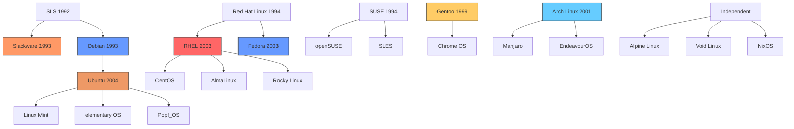
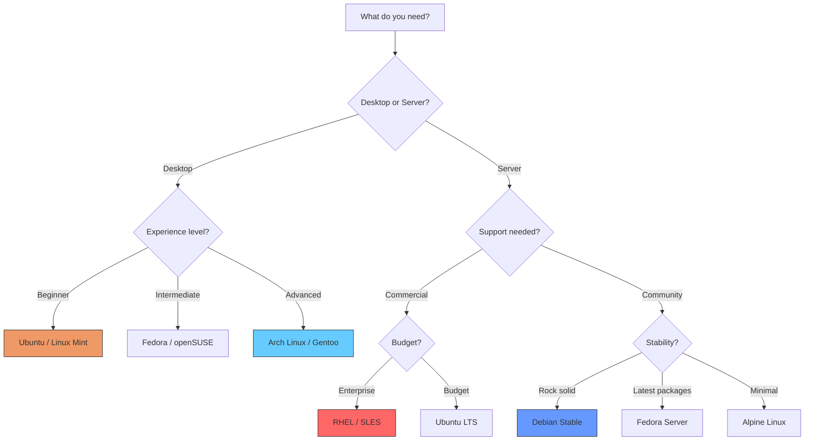

# Chapter 6: Linux Distributions

## 6.1 Introduction

A Linux distribution (or "distro") is a complete operating system built around the Linux kernel, packaged with system libraries, utilities, a package manager, and often a desktop environment. There are hundreds of distributions, each tailored to different use cases, philosophies, and user preferences. This chapter explores the major distributions, their histories, design philosophies, and the relationships between them.

## 6.2 Intuition

Why so many distributions? The answer lies in the nature of open-source software. Because all the components are freely available, anyone can assemble them into a complete operating system. Different people have different priorities:

- **Stability vs. bleeding edge**: Some want rock-solid systems (Debian Stable), others want the latest software (Arch Linux).
- **Ease of use vs. control**: Some want everything configured automatically (Ubuntu), others want to build from scratch (Gentoo).
- **Community vs. commercial**: Some are community-driven (Debian), others are commercially backed (RHEL, Ubuntu).
- **Philosophy**: Some prioritize free software (Trisquel), others include proprietary drivers (Ubuntu).

This diversity is a strength, not a weakness. It allows Linux to serve an extraordinary range of use cases.

## 6.3 Distribution Anatomy

### 6.3.1 What Makes Up a Distribution?

A Linux distribution typically includes:

```
┌─────────────────────────────────────────────┐
│           Desktop Environment                │
│     (GNOME, KDE, XFCE, etc.)               │
├─────────────────────────────────────────────┤
│           Applications                       │
│  (Firefox, LibreOffice, GIMP, etc.)         │
├─────────────────────────────────────────────┤
│           System Utilities                   │
│  (systemd/OpenRC, coreutils, etc.)          │
├─────────────────────────────────────────────┤
│           Package Manager                    │
│  (apt, dnf, pacman, portage, etc.)          │
├─────────────────────────────────────────────┤
│           System Libraries                   │
│  (glibc, zlib, openssl, etc.)               │
├─────────────────────────────────────────────┤
│           Linux Kernel                       │
│  (with distribution-specific patches)        │
├─────────────────────────────────────────────┤
│           Hardware                           │
└─────────────────────────────────────────────┘
```

### 6.3.2 Package Management Philosophy

The most significant technical difference between distributions is the package management system:

| Family | Package Format | Package Manager | Distributions |
|--------|---------------|-----------------|---------------|
| Debian | `.deb` | dpkg, apt | Debian, Ubuntu, Mint |
| Red Hat | `.rpm` | rpm, dnf/yum | Fedora, RHEL, CentOS |
| Arch | `.pkg.tar.zst` | pacman | Arch, Manjaro |
| Gentoo | source-based | Portage | Gentoo |
| SUSE | `.rpm` | zypper | openSUSE, SLES |
| Slackware | `.tgz` | pkgtool | Slackware |

## 6.4 Slackware: The Oldest Surviving Distribution

### 6.4.1 History

**Slackware** was created by **Patrick Volkerding** in 1993, making it the oldest surviving Linux distribution. It was originally based on the Softlanding Linux System (SLS), which was one of the earliest distributions but was poorly maintained.

Volkerding forked SLS, fixed its bugs, and released Slackware 1.0 in July 1993. The name "Slackware" comes from the Church of the SubGenius, a parody religion that emphasizes "slack" (the opposite of hard work).

### 6.4.2 Design Philosophy

Slackware's philosophy is "keep it simple"—but "simple" in the sense of "straightforward," not "easy":

- **No dependency resolution**: The package manager (`pkgtool`) does not automatically resolve dependencies. You must install packages in the correct order.
- **BSD-style init**: Uses traditional SysVinit (not systemd)
- **Vanilla packages**: Minimal patching of upstream software
- **Text-based configuration**: Configuration files are plain text, not GUI tools
- **No automatic updates**: You choose when and what to update

### 6.4.3 Significance

Slackware was the first distribution many early Linux users encountered. Its emphasis on simplicity and transparency taught users how Linux actually works. While its market share has declined, it remains actively maintained and has a loyal following.

## 6.5 Debian: The Universal Operating System

### 6.5.1 History

**Debian** was founded by **Ian Murdock** on August 16, 1993. The name is a portmanteau of his then-girlfriend (now wife) Debra and his own name: Deb + Ian = Debian.

Murdock's vision was ambitious: create a distribution that was developed openly, maintained by a community of volunteers, and committed to the principles of free software.

### 6.5.2 Design Philosophy

Debian is guided by the **Debian Social Contract** and the **Debian Free Software Guidelines (DFSG)**:

1. **Free software**: Debian will remain 100% free software
2. **Give back**: Improvements will be shared with the community
3. **Don't hide problems**: Bug reports are public
4. **Prioritize users and free software**: Users' needs come first

Debian's release process is famously conservative:
- **Unstable (Sid)**: Rolling release, latest packages, may break
- **Testing**: Packages that have been in Unstable for a while without critical bugs
- **Stable**: Released every ~2 years, only receives security updates
- **Oldstable**: Previous Stable release, still supported

### 6.5.3 The Debian Repository

Debian's greatest contribution is its **package repository** system. The `apt` package manager, combined with the vast Debian repository (over 59,000 packages in the current stable release), provides an unmatched ecosystem of easily installable software.

The repository is organized into components:
- **main**: Free software that meets the DFSG
- **contrib**: Free software that depends on non-free software
- **non-free**: Non-free software (not officially part of Debian)
- **non-free-firmware**: Non-free firmware (new in Debian 12)

### 6.5.4 Impact

Debian is the foundation for hundreds of derivative distributions, most notably Ubuntu. Its package format (`.deb`) and tools (`dpkg`, `apt`) are the most widely used in the Linux ecosystem.

## 6.6 Red Hat and the RPM Ecosystem

### 6.6.1 Red Hat History

**Red Hat** was founded by **Bob Young** and **Marc Ewing** in 1993. Red Hat Linux was one of the first commercially successful Linux distributions.

Key milestones:
- **1994**: Red Hat Linux 1.0 released
- **1999**: Red Hat goes public (IPO), one of the most successful tech IPOs of the era
- **2003**: Red Hat Linux discontinued, replaced by Fedora (community) and RHEL (commercial)
- **2019**: IBM acquires Red Hat for $34 billion—the largest software acquisition in history

### 6.6.2 Red Hat Enterprise Linux (RHEL)

**RHEL** is Red Hat's commercial distribution, targeted at enterprises:

- **Long support cycles**: 10 years of support per major version
- **Certification**: Hardware and software vendors certify their products on RHEL
- **Support**: Commercial support with SLAs
- **Stability**: Conservative package versions, extensive testing
- **Subscription model**: Annual subscription for updates and support

RHEL versions and their release dates:
| Version | Year | Kernel | Key Features |
|---------|------|--------|--------------|
| RHEL 2.1 | 2002 | 2.4.9 | First RHEL release |
| RHEL 3 | 2003 | 2.4.21 | Improved SMP, NUMA support |
| RHEL 4 | 2005 | 2.6.9 | SELinux, virtualization |
| RHEL 5 | 2007 | 2.6.18 | Xen virtualization |
| RHEL 6 | 2010 | 2.6.32 | KVM virtualization, ext4 |
| RHEL 7 | 2014 | 3.10 | systemd, XFS default |
| RHEL 8 | 2019 | 4.18 | Application Streams, Wayland |
| RHEL 9 | 2022 | 5.14 | Stratis, improved security |

### 6.6.3 Fedora

**Fedora** is the community-driven distribution sponsored by Red Hat. It serves as a testing ground for technologies that eventually appear in RHEL:

- **Release cycle**: Every ~6 months
- **Cutting edge**: Latest software versions
- **Innovation**: First to adopt new technologies (SELinux, systemd, Wayland, PipeWire)
- **Community governance**: Fedora Council makes decisions

### 6.6.4 CentOS

**CentOS** (Community Enterprise Operating System) was a free rebuild of RHEL—essentially RHEL without the branding, support, or subscription. It was enormously popular for servers.

In December 2020, Red Hat announced that CentOS would shift from a stable, RHEL-compatible distribution to **CentOS Stream**, a rolling-release distribution that sits *upstream* of RHEL (preview of the next RHEL release) rather than *downstream* (rebuild of the current RHEL release).

This decision was controversial and led to the creation of alternatives:
- **AlmaLinux**: Founded by CloudLinux, aims to be a 1:1 RHEL replacement
- **Rocky Linux**: Founded by Gregory Kurtzer (CentOS co-founder), also aims for 1:1 RHEL compatibility

### 6.6.5 The Fedora/RHEL/CentOS Relationship

```
┌─────────────────────────────────────────────────┐
│               Upstream Projects                  │
│     (Linux kernel, GNOME, systemd, etc.)        │
└─────────────────────┬───────────────────────────┘
                      │
┌─────────────────────▼───────────────────────────┐
│                Fedora Rawhide                    │
│         (bleeding-edge development)              │
└─────────────────────┬───────────────────────────┘
                      │
┌─────────────────────▼───────────────────────────┐
│                Fedora Stable                     │
│           (released every ~6 months)             │
└─────────────────────┬───────────────────────────┘
                      │
┌─────────────────────▼───────────────────────────┐
│             CentOS Stream                        │
│      (preview of next RHEL release)              │
└─────────────────────┬───────────────────────────┘
                      │
┌─────────────────────▼───────────────────────────┐
│        Red Hat Enterprise Linux (RHEL)           │
│           (commercial, 10-year support)          │
└─────────────────────┬───────────────────────────┘
                      │
        ┌─────────────┼─────────────┐
        │             │             │
┌───────▼──────┐ ┌───▼────┐ ┌──────▼───────┐
│  AlmaLinux   │ │ Rocky  │ │   Oracle     │
│  (1:1 clone) │ │ Linux  │ │   Linux      │
└──────────────┘ └────────┘ └──────────────┘
```

## 6.7 Ubuntu: Linux for Human Beings

### 6.7.1 History

**Ubuntu** was founded by **Mark Shuttleworth** and his company **Canonical** in 2004. Shuttleworth, a South African entrepreneur who had sold his company Thawte to VeriSign for $575 million, funded Ubuntu's development personally.

The name "Ubuntu" comes from the Nguni Bantu term meaning "humanity towards others"—a philosophy of communal sharing and respect.

### 6.7.2 Design Philosophy

Ubuntu's philosophy is captured in its tagline: "Linux for Human Beings." The goal was to make Linux accessible to everyone, not just technical users:

- **Ease of use**: Simple installation, automatic hardware detection
- **Regular releases**: Every 6 months (April and October), with LTS releases every 2 years
- **Proprietary drivers**: Willingness to include proprietary drivers and codecs for better hardware support
- **Community and commercial**: Backed by Canonical but community-driven

### 6.7.3 Release Cycle

Ubuntu's release cycle follows a predictable pattern:
- **Standard releases**: Supported for 9 months
- **LTS (Long Term Support) releases**: Supported for 5 years (standard) or 10 years (with ESM)

Release naming: `YY.MM` format (e.g., 22.04 = April 2022)

Notable Ubuntu LTS releases:
| Version | Name | Key Features |
|---------|------|--------------|
| 6.06 | Dapper Drake | First LTS, improved installer |
| 8.04 | Hardy Heron | Wubi (Windows installer) |
| 10.04 | Lucid Lynx | Ubuntu Light, Ubuntu One |
| 12.04 | Precise Pangolin | Unity desktop (default) |
| 14.04 | Trusty Tahr | systemd (partial) |
| 16.04 | Xenial Xerus | snap packages, systemd default |
| 18.04 | Bionic Beaver | GNOME 3 (replacing Unity) |
| 20.04 | Focal Fossa | WireGuard, ZFS support |
| 22.04 | Jammy Jellyfish | GNOME 42, Wayland default |
| 24.04 | Noble Numbat | GNOME 46, improved snap |

### 6.7.4 Ubuntu Flavors

Ubuntu has several official flavors with different desktop environments:
- **Ubuntu (GNOME)**: The main release
- **Kubuntu (KDE Plasma)**
- **Xubuntu (XFCE)**
- **Lubuntu (LXQt)**
- **Ubuntu MATE (MATE)**
- **Ubuntu Budgie (Budgie)**
- **Ubuntu Studio (multimedia production)**
- **Edubuntu (education)**

### 6.7.5 Controversies

Ubuntu has been involved in several controversies:
- **Unity desktop** (2011-2017): Ubuntu's custom desktop interface was unpopular with many users
- **Amazon integration** (2012): Ubuntu 12.10 included Amazon search results in the desktop search, raising privacy concerns
- **snap packages**: Ubuntu's push for snap (a universal package format) over traditional `.deb` packages has been controversial, particularly because the snap store is controlled by Canonical
- **CLA (Contributor License Agreement)**: Canonical requires contributors to sign a CLA, which some consider a power imbalance

Despite controversies, Ubuntu remains the most popular Linux distribution for desktops and is widely used in cloud computing.

## 6.8 Arch Linux: The DIY Distribution

### 6.8.1 History

**Arch Linux** was created by **Judd Vinet** in 2001, inspired by CRUX (a minimalist distribution). The name comes from the word "arch," meaning "primary" or "chief."

### 6.8.2 Design Philosophy

Arch follows the **KISS principle** (Keep It Simple, Stupid), but "simple" here means "simple from a developer's perspective," not "easy for beginners":

- **Simplicity**: Minimal patches, close to upstream
- **User centrality**: The user decides what to install and configure
- **Rolling release**: Always up to date, no version numbers
- **Code correctness over convenience**: Clean, correct code is preferred over user-friendly hacks

### 6.8.3 The Arch Way

1. **Simplicity**: Without unnecessary additions or modifications
2. **Modernity**: Keeping packages up to date
3. **Pragmatism**: Practical solutions over ideological purity
4. **User-centrality**: The user is in control
5. **Versatility**: From minimal to full-featured

### 6.8.4 The Arch User Repository (AUR)

The **AUR** (Arch User Repository) is a community repository of package build scripts (PKGBUILDs). It contains packages not in the official repositories, maintained by the community. The AUR is one of Arch's greatest strengths—virtually any software is available.

However, AUR packages are not officially supported and may contain bugs or security vulnerabilities. Users must exercise caution.

### 6.8.5 Arch-Based Distributions

Several distributions are based on Arch:
- **Manjaro**: More user-friendly, with a graphical installer and curated updates
- **EndeavourOS**: Close to Arch but with a graphical installer
- **Garuda Linux**: Performance-oriented with Btrfs and snapshots
- **SteamOS 3.0** (Steam Deck): Based on Arch

## 6.9 Gentoo: The Source-Based Distribution

### 6.9.1 History

**Gentoo** was created by **Daniel Robbins** in 1999. It was originally called Enoch Linux, renamed to Gentoo after the Gentoo penguin (the fastest swimming penguin).

### 6.9.2 Design Philosophy

Gentoo is a **source-based distribution**—packages are compiled from source code rather than distributed as pre-built binaries. This allows:

- **Optimization**: Compile with specific CPU optimizations
- **Customization**: Choose which features to enable/disable via USE flags
- **Learning**: Understanding how software is built
- **Minimalism**: Install only what you need

### 6.9.3 Portage

**Portage** is Gentoo's package management system, inspired by BSD's Ports system:

- **Ebuilds**: Text files that describe how to build a package
- **USE flags**: Options that control which features are compiled
- **Dependencies**: Automatically resolved and compiled
- **Profiles**: System-wide defaults for USE flags and other settings

Example USE flag configuration:
```bash
# /etc/portage/package.use
app-editors/vim python lua
www-client/firefox hwaccel pulseaudio
media-video/vlc dvd bluray
```

### 6.9.4 Gentoo Install Time

A typical Gentoo installation takes several hours to days, as the entire system (including the kernel) must be compiled from source. This is a feature, not a bug—it forces users to understand their system deeply.

## 6.10 SUSE and openSUSE

### 6.10.1 History

**SUSE** (Software und System-Entwicklung) was founded in Germany in 1992. It was one of the earliest European Linux distributions.

Key milestones:
- **1992**: SUSE founded as a Unix consulting firm
- **1994**: First SUSE Linux release
- **2003**: Novell acquires SUSE for $210 million
- **2011**: Attachmate acquires Novell
- **2014**: Micro Focus acquires Attachmate
- **2018**: EQT Partners acquires SUSE (independent again)

### 6.10.2 openSUSE

**openSUSE** is the community-driven counterpart to SUSE Linux Enterprise (SLES):
- **openSUSE Tumbleweed**: Rolling release
- **openSUSE Leap**: Regular release, shares code base with SLES

### 6.10.3 YaST

SUSE's most distinctive feature is **YaST** (Yet another Setup Tool), a comprehensive system configuration tool that handles everything from partitioning to network configuration to service management.

### 6.10.4 SUSE Enterprise Linux (SLES)

**SLES** is SUSE's enterprise distribution, competing with RHEL:
- **Long support cycles**: 13 years (10 general + 3 extended)
- **Certification**: Major hardware and software vendors certify on SLES
- **YaST**: Comprehensive system administration
- **Live patching**: SUSE pioneered kernel live patching

## 6.11 Other Notable Distributions

### 6.11.1 Mint

**Linux Mint** is based on Ubuntu, focused on ease of use and multimedia support. It uses the Cinnamon desktop (a fork of GNOME 3) and includes proprietary codecs by default.

### 6.11.2 Elementary OS

**elementary OS** is based on Ubuntu, featuring the Pantheon desktop environment (inspired by macOS). It emphasizes design and user experience.

### 6.11.3 Alpine

**Alpine Linux** is a minimal, security-oriented distribution using musl libc and BusyBox. It's popular for containers (Docker images) due to its small size (~5MB).

### 6.11.4 NixOS

**NixOS** uses the Nix package manager, which provides reproducible builds and atomic upgrades. The entire system is described declaratively in a configuration file.

### 6.11.5 Void Linux

**Void Linux** is an independent, rolling-release distribution using the runit init system (not systemd). It uses the XBPS package manager.

## 6.12 Diagrams

### 6.12.1 Distribution Family Tree



### 6.12.2 Distribution Selection Guide



## 6.13 Common Pitfalls

### 6.13.1 Distribution Hopping

**The mistake**: Constantly switching between distributions instead of learning one well.

**The reality**: Choose a distribution that fits your needs and stick with it. Deep knowledge of one distribution is more valuable than superficial knowledge of many.

### 6.13.2 Assuming All Distributions Are the Same

**The mistake**: Thinking that knowledge of Ubuntu automatically transfers to RHEL.

**The reality**: While the kernel and core utilities are similar, distributions differ significantly in package management, init systems, default configurations, and administration tools.

### 6.13.3 Ignoring Support Lifecycles

**The mistake**: Using a distribution release past its end-of-life.

**The reality**: Unsupported releases don't receive security updates, leaving systems vulnerable. Always track your distribution's support lifecycle.

## 6.14 Best Practices

### 6.14.1 Choose Based on Your Needs

- **Desktop**: Ubuntu, Fedora, or Mint for ease of use; Arch for learning
- **Server**: RHEL, Debian, or Ubuntu LTS for stability; Alpine for containers
- **Enterprise**: RHEL or SLES for commercial support
- **Embedded**: Alpine or custom minimal builds

### 6.14.2 Use LTS for Production

For servers and production systems, always use LTS (Long Term Support) releases. They receive security updates for years and are extensively tested.

### 6.14.3 Contribute Back

If you find bugs or make improvements, contribute them back to the distribution's community. This benefits everyone and ensures the distribution continues to improve.

## 6.15 Exercises

### Exercise 1: Distribution Comparison
Install two different distributions in virtual machines and compare:
- Installation process
- Default package selection
- Package manager usability
- Desktop experience
- Documentation quality

### Exercise 2: Package Manager Mastery
Using your distribution's package manager, perform the following tasks:
- Search for a package
- Install a package
- Remove a package
- List installed packages
- Check for updates
- View package information

### Exercise 3: Build a Minimal System
Using a distribution like Arch or Gentoo, build a minimal Linux system:
- Install only the base system
- Add a window manager (not a full desktop environment)
- Configure networking manually
- Install and configure a web server

### Exercise 4: Distribution History
Research the history of a distribution not covered in this chapter (e.g., Mandriva, PCLinuxOS, Puppy Linux). Write a 500-word summary of its history and philosophy.

### Exercise 5: Enterprise vs. Community
Compare RHEL (enterprise) with Fedora (community). Document the differences in:
- Package versions
- Support lifecycle
- Default configurations
- Available packages

## 6.16 References

1. DistroWatch. https://distrowatch.com/ — Comprehensive distribution database
2. The Debian Project. https://www.debian.org/
3. Red Hat. https://www.redhat.com/
4. Ubuntu. https://ubuntu.com/
5. Arch Linux Wiki. https://wiki.archlinux.org/
6. Gentoo Wiki. https://wiki.gentoo.org/
7. openSUSE. https://www.opensuse.org/
8. Slackware. http://www.slackware.com/
9. linuxquestions.org — Distribution forums
10. LWN.net — Distribution coverage and analysis
