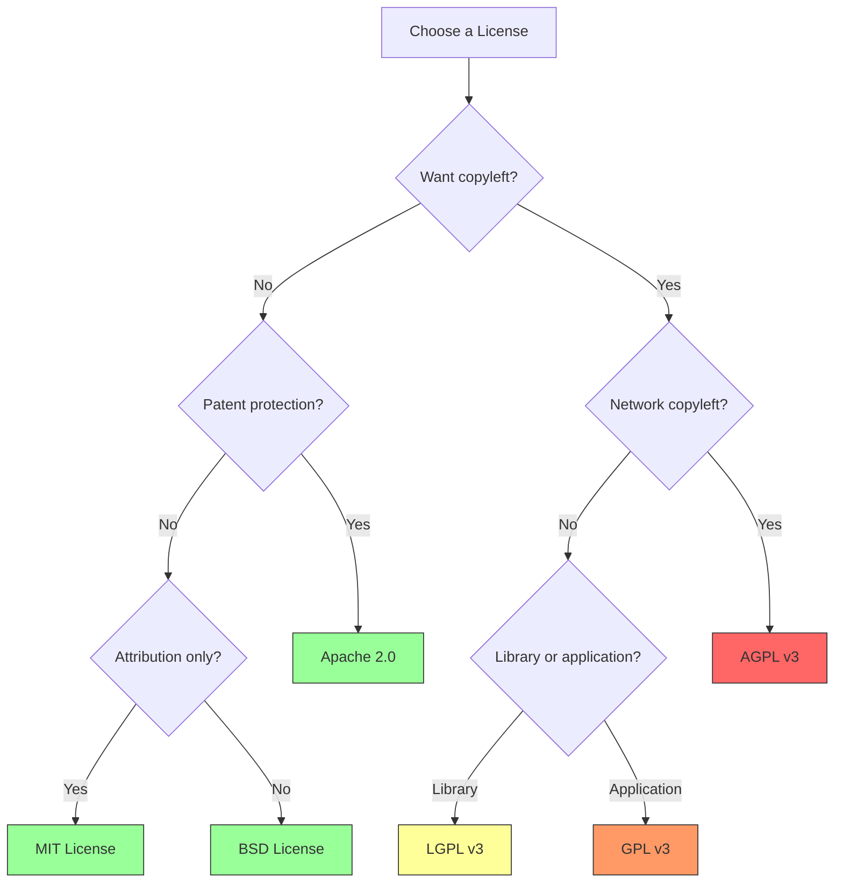
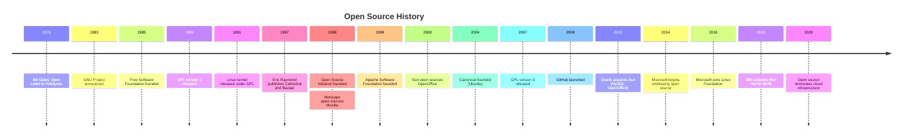
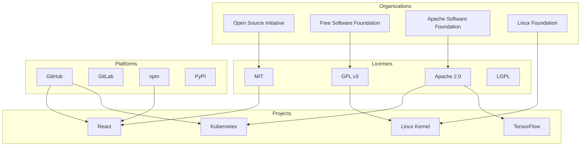

# Chapter 7: Open Source History and Licensing

## 7.1 Introduction

Open source licensing is the legal infrastructure that makes collaborative software development possible. Without well-crafted licenses, the open-source ecosystem would collapse into legal chaos. This chapter explores the history of the open-source movement, the major licenses, their philosophies, and their practical implications for developers and organizations.

## 7.2 Intuition

A software license answers a fundamental question: **what can you do with this code?**

Without a license, the answer is "nothing"—copyright law gives the author exclusive rights to copy, modify, and distribute the work. A license grants specific permissions. The choice of license determines:

- Can I use this code in my commercial product?
- Can I modify it and keep my changes private?
- If I distribute my modifications, must I share the source code?
- Can I combine this code with code under a different license?

These questions have enormous practical consequences for businesses, developers, and the open-source ecosystem.

## 7.3 Historical Context

### 7.3.1 The Pre-License Era

In the early days of computing (1950s–1970s), software was typically distributed with source code. Hardware vendors bundled software with their machines, and users freely modified and shared it. There was no concept of "software licensing" in the modern sense.

The shift began in the late 1970s:
- **1976**: Bill Gates' "Open Letter to Hobbyists" argued that software should be paid for
- **1978**: The Copyright Act of 1976 was amended to explicitly cover software
- **1980s**: Proprietary software became the norm

### 7.3.2 The Free Software Movement

As discussed in Chapter 2, Richard Stallman launched the GNU Project in 1983 and the Free Software Foundation in 1985. The **GNU General Public License (GPL)**, first released in 1989, was the first widely used free software license.

### 7.3.3 The Open Source Initiative

In 1998, Eric S. Raymond, Bruce Perens, and others founded the **Open Source Initiative (OSI)**. They coined the term "open source" and created the **Open Source Definition (OSD)**, a set of criteria that a license must meet to be considered "open source":

1. **Free redistribution**: The license must allow free redistribution
2. **Source code**: The program must include source code
3. **Derived works**: The license must allow modifications and derived works
4. **Integrity of the author's source code**: The license may restrict distribution of modified source (but must allow "patch files")
5. **No discrimination against persons or groups**
6. **No discrimination against fields of endeavor**
7. **Distribution of license**: Rights must apply to all recipients
8. **License must not be specific to a product**
9. **License must not restrict other software**
10. **License must be technology-neutral**

## 7.4 The License Spectrum

Software licenses exist on a spectrum from permissive to copyleft:

```
Most Permissive                                      Most Restrictive
│                                                            │
▼                                                            ▼
Public Domain → MIT → BSD → Apache → LGPL → GPL → AGPL → Proprietary
│                         │        │      │      │      │
│   Permissive            │        │      │      │      │
│   (do whatever)         │        │      │      │      │
│                         │        │      │      │      │
│                         │   Weak Copyleft   │  Strong Copyleft  │
│                         │        │      │      │      │
│                         │        │      │      │      │
│                         │        │      │  Network Copyleft  │
```

### 7.4.1 Permissive Licenses

Permissive licenses grant broad permissions with minimal restrictions:

**MIT License (Expat License)**
```
MIT License

Copyright (c) [year] [fullname]

Permission is hereby granted, free of charge, to any person obtaining a copy
of this software and associated documentation files (the "Software"), to deal
in the Software without restriction, including without limitation the rights
to use, copy, modify, merge, publish, distribute, sublicense, and/or sell
copies of the Software, and to permit persons to whom the Software is
furnished to do so, subject to the following conditions:

The above copyright notice and this permission notice shall be included in all
copies or substantial portions of the Software.

THE SOFTWARE IS PROVIDED "AS IS", WITHOUT WARRANTY OF ANY KIND, EXPRESS OR
IMPLIED, INCLUDING BUT NOT LIMITED TO THE WARRANTIES OF MERCHANTABILITY,
FITNESS FOR A PARTICULAR PURPOSE AND NONINFRINGEMENT. IN NO EVENT SHALL THE
AUTHORS OR COPYRIGHT HOLDERS BE LIABLE FOR ANY CLAIM, DAMAGES OR OTHER
LIABILITY, WHETHER IN AN ACTION OF CONTRACT, TORT OR OTHERWISE, ARISING FROM,
OUT OF OR IN CONNECTION WITH THE SOFTWARE OR THE USE OR OTHER DEALINGS IN THE
SOFTWARE.
```

**Key characteristics:**
- You can do anything with the code
- You must include the copyright notice and license
- No warranty
- Compatible with almost all other licenses

**Used by:** React, jQuery, Node.js, Ruby on Rails, .NET, VS Code

**BSD Licenses (2-Clause and 3-Clause)**

The BSD licenses come in two variants:

**BSD 2-Clause (Simplified):**
```
Copyright (c) [year], [fullname]
All rights reserved.

Redistribution and use in source and binary forms, with or without
modification, are permitted provided that the following conditions are met:

1. Redistributions of source code must retain the above copyright notice, this
   list of conditions and the following disclaimer.
2. Redistributions in binary form must reproduce the above copyright notice,
   this list of conditions and the following disclaimer in the documentation
   and/or other materials provided with the distribution.

THIS SOFTWARE IS PROVIDED BY THE COPYRIGHT HOLDERS AND CONTRIBUTORS "AS IS"
AND ANY EXPRESS OR IMPLIED WARRANTIES, INCLUDING, BUT NOT LIMITED TO, THE
IMPLIED WARRANTIES OF MERCHANTABILITY AND FITNESS FOR A PARTICULAR PURPOSE ARE
DISCLAIMED.
```

**BSD 3-Clause (New BSD):** Adds a non-endorsement clause:
```
3. Neither the name of the copyright holder nor the names of its
   contributors may be used to endorse or promote products derived from
   this software without specific prior written permission.
```

**Key characteristics:**
- Very permissive (similar to MIT)
- The 3-Clause version prevents using the author's name for endorsement
- Compatible with GPL

**Used by:** FreeBSD, OpenBSD, Django, Flask, Spring Boot

**Apache License 2.0**

```
Apache License, Version 2.0

Licensed under the Apache License, Version 2.0 (the "License");
you may not use this file except in compliance with the License.
You may obtain a copy of the License at

    http://www.apache.org/licenses/LICENSE-2.0

Unless required by applicable law or agreed to in writing, software
distributed under the License is distributed on an "AS IS" BASIS,
WITHOUT WARRANTIES OR CONDITIONS OF ANY KIND, either express or implied.
See the License for the specific language governing permissions and
limitations under the License.
```

**Key characteristics:**
- Permissive like MIT/BSD
- Includes an explicit patent grant (contributors grant patent licenses)
- Requires preservation of copyright notices and license text
- Includes a "NOTICE" file mechanism
- Compatible with GPL v3 (but not GPL v2)

**Used by:** Android (AOSP), Kubernetes, TensorFlow, Swift, Rust

### 7.4.2 Copyleft Licenses

Copyleft licenses require that derivative works be distributed under the same license:

**GNU General Public License (GPL)**

The GPL is the most important copyleft license. We'll cover it in detail in Chapter 8.

**Key characteristics:**
- You can use, modify, and distribute the code
- If you distribute a modified version, you must release the source code under the GPL
- If you distribute a program that links to GPL code, your program must also be GPL
- "Viral" nature ensures freedom propagates

**Used by:** Linux kernel, GCC, WordPress, Drupal, GIMP

**GNU Lesser General Public License (LGPL)**

The LGPL is a "weak copyleft" license—less restrictive than the GPL:

**Key characteristics:**
- You can link to LGPL libraries without your program being GPL
- Modifications to the LGPL library itself must be released
- Allows proprietary software to use LGPL libraries

**Used by:** glibc, Qt (formerly), many libraries

**GNU Affero General Public License (AGPL)**

The AGPL closes the "SaaS loophole" in the GPL:

**Key characteristics:**
- Same as GPL, but also covers software accessed over a network
- If you modify AGPL software and make it available as a web service, you must release the source code
- Designed for the cloud era

**Used by:** MongoDB (formerly), Grafana, Nextcloud

## 7.5 License Compatibility

### 7.5.1 The Problem

Not all licenses are compatible—you cannot combine code under two incompatible licenses. This creates a complex web of compatibility relationships.

### 7.5.2 Compatibility Matrix

| Can combine → | MIT | BSD | Apache 2.0 | LGPL | GPL v2 | GPL v3 | AGPL |
|---------------|-----|-----|------------|------|--------|--------|------|
| **MIT** | ✓ | ✓ | ✓ | ✓ | ✓ | ✓ | ✓ |
| **BSD** | ✓ | ✓ | ✓ | ✓ | ✓ | ✓ | ✓ |
| **Apache 2.0** | ✓ | ✓ | ✓ | ✓ | ✗* | ✓ | ✓ |
| **LGPL** | ✓ | ✓ | ✓ | ✓ | ✓ | ✓ | ✓ |
| **GPL v2** | ✓ | ✓ | ✗* | ✓ | ✓ | ✗* | ✗ |
| **GPL v3** | ✓ | ✓ | ✓ | ✓ | ✗* | ✓ | ✓ |
| **AGPL** | ✓ | ✓ | ✓ | ✓ | ✗ | ✓ | ✓ |

*Apache 2.0 is not compatible with GPL v2 because of patent clause differences.
*GPL v2 and GPL v3 are not mutually compatible (one-way: v2→v3 not allowed).

### 7.5.3 Practical Guidance

1. **For libraries**: Use MIT, BSD, or Apache 2.0 (maximize compatibility)
2. **For applications**: Use GPL if you want copyleft; MIT/Apache if you don't
3. **For web services**: Consider AGPL if you want to ensure modifications are shared
4. **When combining**: Check compatibility before combining code from different licenses

## 7.6 The Open Source Initiative (OSI)

### 7.6.1 Founding and Mission

The OSI was founded in February 1998 by Eric S. Raymond and Bruce Perens. Its mission is to promote and protect open-source software, processes, and communities.

### 7.6.2 License Approval Process

The OSI maintains a list of **OSI-approved licenses**—licenses that meet the Open Source Definition. As of 2024, there are over 80 approved licenses.

The approval process involves:
1. Submission of a license for review
2. Public discussion on the license-review mailing list
3. Board vote
4. If approved, added to the OSI license list

### 7.6.3 Notable OSI-Approved Licenses

- MIT License
- BSD 2-Clause and 3-Clause
- Apache License 2.0
- GNU GPL v2 and v3
- GNU LGPL v2.1 and v3
- GNU AGPL v3
- Mozilla Public License 2.0
- Eclipse Public License 2.0
- Common Development and Distribution License (CDDL)
- Artistic License 2.0

## 7.7 Corporate Open Source

### 7.7.1 The Shift

In the early 2000s, major corporations were hostile to open source. Steve Ballmer (Microsoft CEO) called Linux "a cancer" in 2001. By 2020, Microsoft was the largest contributor to open-source projects on GitHub.

This shift was driven by:
- **Cloud computing**: Cloud providers build on open-source infrastructure
- **Developer preference**: Developers prefer open-source tools
- **Cost savings**: Open source reduces development costs
- **Talent attraction**: Open-source contributions attract top talent

### 7.7.2 Open Source Business Models

Companies use several business models around open source:

1. **Support and services**: Red Hat sells support for RHEL (free software, paid support)
2. **Open core**: Core is open source, enterprise features are proprietary (GitLab, Redis)
3. **SaaS/hosting**: Offer a hosted version (WordPress.com, MongoDB Atlas)
4. **Dual licensing**: Offer under both open-source and commercial licenses (Qt, MySQL)
5. **Consulting**: Provide consulting and customization (many small firms)

### 7.7.3 Open Source Program Offices (OSPOs)

Many large companies have established **OSPOs** (Open Source Program Offices) to manage their open-source activities:
- Google, Microsoft, Facebook, Amazon, Netflix, Uber, Spotify, and many others
- OSPOs handle license compliance, contribution policies, and community engagement

## 7.8 SPDX and License Identification

### 7.8.1 What is SPDX?

**SPDX** (Software Package Data Exchange) is a standard developed by the Linux Foundation for communicating software bill of material information, including components, licenses, copyrights, and security references. SPDX provides:

- A standardized license identifier system (e.g., `MIT`, `Apache-2.0`, `GPL-2.0-only`)
- A machine-readable format for license information
- A comprehensive license list with canonical texts

### 7.8.2 SPDX License Identifiers

SPDX license identifiers are now widely used in source code headers and package metadata:

```python
# SPDX-License-Identifier: MIT
# Copyright (c) 2024 Your Name

def hello():
    print("Hello, World!")
```

```c
// SPDX-License-Identifier: GPL-2.0-only
/*
 * Copyright (c) 2024 Your Name
 */

#include <linux/module.h>
```

### 7.8.3 The REUSE Initiative

The **REUSE** initiative (https://reuse.software/) by the Free Software Foundation Europe provides a standardized way to declare copyright and licensing information in software projects. REUSE recommends:

1. Include the full license text in a `LICENSES/` directory
2. Add SPDX headers to every source file
3. Include a `REUSE.toml` or `.reuse/dep5` file for files that can't contain headers (images, binaries)

```bash
# Check REUSE compliance
reuse lint

# Generate a bill of materials
reuse spdx
```

### 7.8.4 License Detection Tools

Several tools can automatically detect licenses in source code:

```bash
# ScanCode Toolkit (Python)
pip install scancode-toolkit
scancode --license --copyright --json output.json /path/to/project

# FOSSology (web-based)
# https://www.fossology.org/

# licensee (Ruby, used by GitHub)
gem install licensee
licensee detect /path/to/project

# askalono (Rust, by Amazon)
cargo install askalono
askalono detect /path/to/project
```

## 7.9 Code Examples

### 7.8.1 Adding a License to Your Project

```bash
# Create a LICENSE file with MIT License
cat > LICENSE << 'EOF'
MIT License

Copyright (c) 2024 Your Name

Permission is hereby granted, free of charge, to any person obtaining a copy
of this software and associated documentation files (the "Software"), to deal
in the Software without restriction, including without limitation the rights
to use, copy, modify, merge, publish, distribute, sublicense, and/or sell
copies of the Software, and to permit persons to whom the Software is
furnished to do so, subject to the following conditions:

The above copyright notice and this permission notice shall be included in all
copies or substantial portions of the Software.

THE SOFTWARE IS PROVIDED "AS IS", WITHOUT WARRANTY OF ANY KIND, EXPRESS OR
IMPLIED, INCLUDING BUT NOT LIMITED TO THE WARRANTIES OF MERCHANTABILITY,
FITNESS FOR A PARTICULAR PURPOSE AND NONINFRINGEMENT. IN NO EVENT SHALL THE
AUTHORS OR COPYRIGHT HOLDERS BE LIABLE FOR ANY CLAIM, DAMAGES OR OTHER
LIABILITY, WHETHER IN AN ACTION OF CONTRACT, TORT OR OTHERWISE, ARISING FROM,
OUT OF OR IN CONNECTION WITH THE SOFTWARE OR THE USE OR OTHER DEALINGS IN THE
SOFTWARE.
EOF
```

### 7.8.2 License Header in Source Files

```python
# Copyright (c) 2024 Your Name
# Licensed under the MIT License. See LICENSE file in the project root.

def hello():
    """A simple function."""
    print("Hello, World!")

if __name__ == "__main__":
    hello()
```

### 7.8.3 Checking License Compatibility

```bash
# Install and use a license checker
pip install pip-licenses
pip-licenses --from=mixed --format=table

# For Node.js projects
npx license-checker --summary

# For Go projects
go-licenses report ./...
```

## 7.9 Diagrams

### 7.9.1 License Decision Tree



### 7.9.2 Open Source Timeline



### 7.9.3 The Open Source Ecosystem



## 7.10 Common Pitfalls

### 7.10.1 Using Code Without a License

**The mistake**: Using code from GitHub that has no license file.

**The reality**: Without a license, you have no rights to use the code. Copyright law applies by default, meaning all rights are reserved by the author.

### 7.10.2 Assuming "Open Source" Means "No Restrictions"

**The mistake**: Thinking you can do anything with open-source code.

**The reality**: Even permissive licenses have requirements (attribution, license notice). Copyleft licenses have significant restrictions on distribution.

### 7.10.3 Mixing Incompatible Licenses

**The mistake**: Combining GPL v2-only code with Apache 2.0 code.

**The reality**: These licenses are incompatible. You must either find compatible alternatives or contact the copyright holders for a relicensing exception.

### 7.10.4 Ignoring License Obligations in Containers

**The mistake**: Assuming that distributing software in a container (Docker image) doesn't trigger license obligations.

**The reality**: Distributing a container with GPL-licensed software triggers the same obligations as distributing the software directly.

## 7.11 Best Practices

### 7.11.1 Choose a License Early

Add a license to your project from the beginning. Changing licenses later requires consent from all contributors.

### 7.11.2 Use Standard Licenses

Custom licenses create legal uncertainty. Use well-known, OSI-approved licenses whenever possible.

### 7.11.3 Track Dependencies

Use tools to track the licenses of your dependencies. This is especially important for copyleft licenses.

### 7.11.4 Understand Your Obligations

Before using open-source software, understand what the license requires. This includes attribution, source code distribution, and patent grants.

## 7.12 Exercises

### Exercise 1: License Audit
Audit a project you're working on. Identify all third-party dependencies and their licenses. Check for compatibility issues.

### Exercise 2: License Comparison
Create a detailed comparison table of MIT, BSD 3-Clause, Apache 2.0, and GPL v3 licenses. Include:
- Permissions
- Conditions
- Limitations
- Patent grants
- Compatibility

### Exercise 3: Add a License
Take an existing project without a license and add an appropriate license. Document why you chose that license.

### Exercise 4: OSI Review
Read the Open Source Definition (https://opensource.org/osd). For each of the 10 criteria, find a license that doesn't meet that criterion (if one exists).

### Exercise 5: Business Model Analysis
Research a company that uses an open-source business model (e.g., Red Hat, MongoDB, Elastic). Analyze:
- What license do they use?
- What is their revenue model?
- How do they balance community and commercial interests?

## 7.13 Software Bill of Materials (SBOM)

### 7.13.1 What is an SBOM?

A **Software Bill of Materials (SBOM)** is a formal, machine-readable inventory of software components and dependencies used in building a given piece of software. It includes:

- Component names and versions
- Licenses for each component
- Suppliers (authors/organizations)
- Dependency relationships
- Known vulnerabilities (when combined with vulnerability databases)

### 7.13.2 Why SBOMs Matter

SBOMs have become critical due to:

1. **Regulatory requirements**: The U.S. Executive Order 14028 (May 2021) requires SBOMs for software sold to the federal government
2. **Supply chain security**: Understanding what's in your software helps identify vulnerabilities
3. **License compliance**: SBOMs help track license obligations across the supply chain
4. **Incident response**: When a vulnerability is discovered (e.g., Log4Shell), SBOMs help identify affected systems

### 7.13.3 SBOM Formats

The two dominant SBOM formats are:

- **SPDX**: Linux Foundation standard, now an ISO standard (ISO/IEC 5962:2021)
- **CycloneDX**: OWASP standard, focused on security use cases

```bash
# Generate an SPDX SBOM using syft
syft packages dir:/path/to/project -o spdx-json > sbom.spdx.json

# Generate a CycloneDX SBOM
cdxgen -o sbom.json /path/to/project

# Analyze an SBOM for vulnerabilities
grype sbom:sbom.spdx.json
```

## 7.14 References

1. Open Source Initiative. https://opensource.org/
2. Free Software Foundation. https://www.fsf.org/
3. GNU License List. https://www.gnu.org/licenses/license-list.en.html
4. Choose a License. https://choosealicense.com/
5. SPDX License List. https://spdx.org/licenses/
6. Raymond, E.S. (1999). *The Cathedral and the Bazaar*. O'Reilly.
7. Perens, B. (1999). "The Open Source Definition." *Open Sources: Voices from the Open Source Revolution*.
8. Rosen, L. (2005). *Open Source Licensing: Software Freedom and Intellectual Property Law*. Prentice Hall.
9. Lauri Koskela. "Practical Guide to Open Source Licensing." https://opensource.guide/
10. TLDRLegal. https://tldrlegal.com/ — Plain-language license summaries
