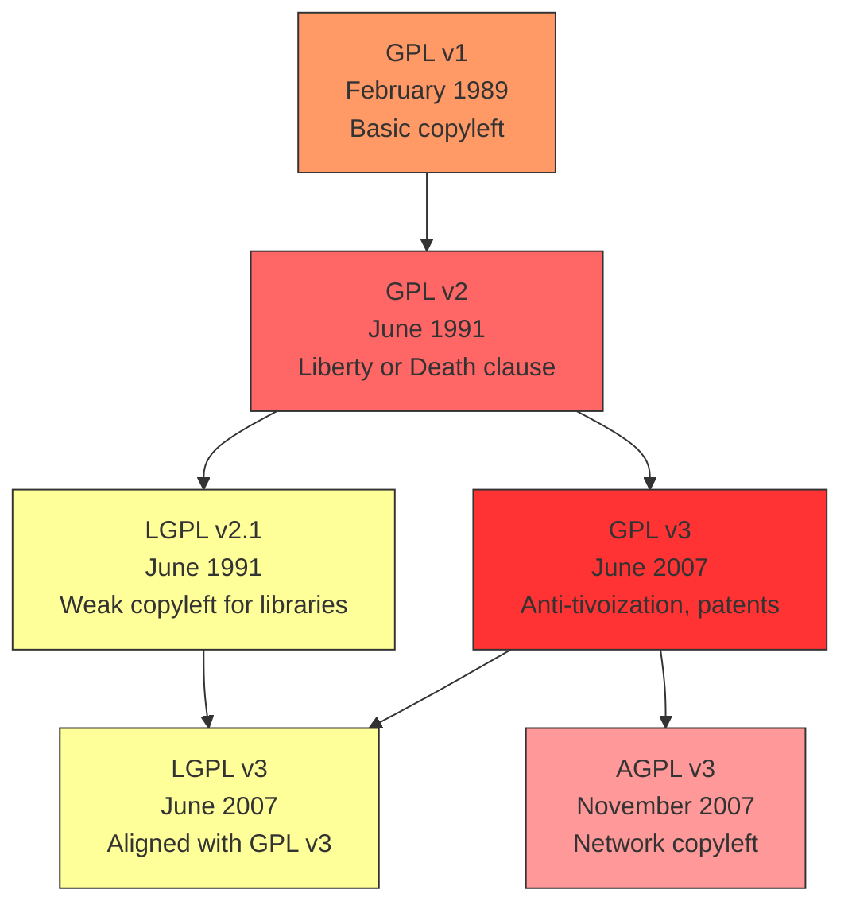
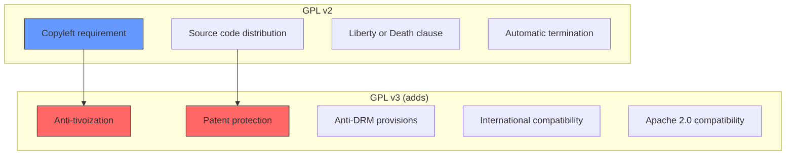

# Chapter 8: The GPL and Copyleft

## 8.1 Introduction

The GNU General Public License (GPL) is the most influential software license in history. It is the legal foundation of the Linux kernel, the GNU toolchain, and thousands of other projects. The GPL's "copyleft" mechanism—requiring derivative works to be distributed under the same terms—has shaped the entire open-source ecosystem. This chapter explores the GPL in depth, including its versions, legal cases, enforcement, and philosophical implications.

## 8.2 Intuition

The GPL is based on a simple but powerful idea: **if you receive software with the freedom to use, modify, and share it, you must pass those same freedoms on to others.**

This is the opposite of how proprietary software works. Proprietary software restricts your freedoms; the GPL ensures freedoms propagate. It's "viral" in the sense that freedom spreads, not restriction.

The analogy is a gift with a condition: "You may have this gift, but if you give it to others, you must give them the same freedoms you received." This prevents anyone from taking free software, adding proprietary restrictions, and distributing the result.

## 8.3 The GPL Versions

### 8.3.1 GPL Version 1 (February 1989)

The first version of the GPL was released by the Free Software Foundation in 1989. It established the basic copyleft principle:

- You can copy and distribute the software
- You can modify the software
- If you distribute modified versions, you must distribute the source code
- You cannot impose additional restrictions

GPL v1 was relatively simple and focused on ensuring that software freedom was preserved through distribution.

### 8.3.2 GPL Version 2 (June 1991)

GPL v2 was released to address practical issues discovered with v1:

**Key additions:**
- **Liberty or Death clause**: If you cannot distribute the software while satisfying both the GPL and some other obligation (e.g., a patent license), you cannot distribute it at all
- **Improved source code requirements**: Clearer definition of "source code"
- **Termination**: License terminates automatically if you violate it, but can be reinstated if the violation is corrected

**The Linux kernel uses GPL v2** (specifically "GPL v2 only," not "GPL v2 or later").

#### The Full Text

The GPL v2 preamble states:

> "The licenses for most software are designed to take away your freedom to share and change it. By contrast, the GNU General Public License is intended to guarantee your freedom to share and change free software—to make sure the software is free for all its users."

#### Key Sections

**Section 0**: Definitions
- "The Program" refers to any copyrightable work licensed under the GPL
- "Work based on the Program" means the Program or any derivative work

**Section 1**: Verbatim copying
- You may copy and distribute verbatim copies of the Program's source code
- You must give recipients all the rights you have
- You must provide a copy of the GPL with the Program

**Section 2**: Modification
- You may modify your copy or copies of the Program
- The modified work must be licensed as a whole under the GPL
- You must cause any work that you distribute to publish a copyright notice

**Section 3**: Distribution of binaries
- You may distribute the Program in object code or executable form
- You must accompany it with the complete source code, or a written offer to provide the source code

### 8.3.3 GPL Version 3 (June 2007)

GPL v3 was the most controversial update. It was developed over 18 months with extensive public consultation.

**Key changes from v2:**

#### Anti-Tivoization
**Tivoization** refers to the practice of using hardware restrictions to prevent users from running modified versions of GPL software. The TiVo DVR used GPL software but was designed so that modified software would not run on the device.

GPL v3 requires that if you distribute GPL software in a product, you must provide the "installation information" necessary to install and run modified versions on that product. This doesn't prohibit DRM, but it ensures users can exercise their freedom to modify the software.

#### Patent Protection
GPL v3 includes an explicit patent grant: contributors automatically grant patent licenses for their contributions. This protects users from patent trolls who might contribute code and then sue for patent infringement.

#### International Compatibility
GPL v3 was drafted with international legal input to be more compatible with different legal systems. The language is more precise and less US-centric.

#### Anti-DRM Provisions
GPL v3 includes provisions against Digital Rights Management (DRM) that would restrict users' ability to exercise their GPL freedoms.

#### Compatibility with Apache 2.0
GPL v3 is compatible with the Apache License 2.0 (GPL v2 is not, due to patent clause differences).

### 8.3.4 Why Linux Stayed with GPL v2

The Linux kernel remains under **GPL v2 only** (not "GPL v2 or later"). Several key kernel developers, including Linus Torvalds, opposed GPL v3 for several reasons:

1. **Anti-Tivoization concerns**: Some argued that hardware manufacturers should be allowed to restrict what runs on their devices
2. **Complexity**: GPL v3 is significantly longer and more complex than v2
3. **Patent provisions**: Some developers were uncomfortable with the automatic patent grant
4. **Process concerns**: The development process for GPL v3 was seen as too FSF-controlled

Torvalds explicitly stated:

> "I think GPLv2 is a great license. I think GPLv3 is a disaster."

## 8.4 The LGPL

### 8.4.1 What is the LGPL?

The **GNU Lesser General Public License (LGPL)** is a "weak copyleft" license designed primarily for libraries:

- You can link to LGPL libraries from proprietary software
- Modifications to the LGPL library itself must be released under the LGPL
- You must allow users to replace the LGPL library with a modified version

### 8.4.2 LGPL v2.1 and v3

| Version | Key Features |
|---------|--------------|
| LGPL v2.1 | Allows proprietary linking; requires source for library modifications |
| LGPL v3 | Same as v2.1 but with GPL v3's anti-tivoization and patent provisions |

### 8.4.3 When to Use the LGPL

The LGPL is appropriate for libraries that want to:
- Allow proprietary software to use the library
- Ensure improvements to the library itself remain free
- Maximize adoption while maintaining some copyleft protection

Examples: glibc, Qt (formerly), many GNU libraries.

### 8.4.4 Dynamic vs. Static Linking

The LGPL distinguishes between dynamic and static linking:

- **Dynamic linking**: Proprietary software can dynamically link to an LGPL library without being affected by the LGPL
- **Static linking**: If you statically link to an LGPL library, you must provide the object files so users can relink with a modified version of the library

This distinction is important for embedded systems, where static linking is common.

## 8.5 The AGPL

### 8.5.1 The SaaS Loophole

GPL v2 and v3 both trigger their copyleft requirements when you **distribute** software. However, running software as a web service (SaaS) is not "distribution"—you're providing a service, not distributing a copy.

This means a company can take GPL software, modify it, run it as a web service, and never release their modifications. This is the "SaaS loophole" or "ASP (Application Service Provider) loophole."

### 8.5.2 AGPL v3

The **GNU Affero General Public License (AGPL) v3** closes this loophole:

- Same as GPL v3, but with an additional requirement
- If you modify AGPL software and make it available to users over a network, you must provide the source code of your modifications
- This applies even if you don't "distribute" the software in the traditional sense

### 8.5.3 Use Cases

AGPL is commonly used for:
- **Web applications**: Nextcloud, Grafana, MongoDB (formerly)
- **SaaS platforms**: Companies that want to ensure modifications are shared
- **Server software**: Where the primary use is as a network service

## 8.6 Legal Cases

### 8.6.1 Free Software Foundation v. Cisco (2008)

In 2008, the FSF sued Cisco Systems for distributing GPL-licensed software (including GCC, glibc, and other GNU tools) in its Linksys routers without providing the source code as required by the GPL.

The case was settled in 2009. Cisco agreed to:
- Appoint a Free Software Director
- Make ongoing compliance efforts
- Make a monetary contribution to the FSF

This case established that large corporations could not ignore GPL obligations.

### 8.6.2 BusyBox Lawsuits

**BusyBox**, a minimal implementation of many Unix utilities, has been the subject of numerous GPL enforcement lawsuits:

- **2007-2012**: The Software Freedom Conservancy (SFC) filed lawsuits on behalf of BusyBox developers against companies distributing BusyBox in embedded devices without providing source code
- **Companies sued**: Verizon, Samsung, Westinghouse, and many others
- **Outcome**: Most cases were settled, with companies agreeing to comply with the GPL

These cases established that GPL violations could be enforced in U.S. courts.

### 8.6.3 Patrick McHardy Enforcement

**Patrick McHardy**, a former Linux kernel developer, conducted aggressive GPL enforcement in Germany:

- He claimed copyright interests in Linux kernel code
- He demanded license compliance from hundreds of companies
- His methods were controversial—some considered them "copyright trolling"
- The Linux kernel community distanced itself from his approach

This case highlighted the difference between constructive enforcement (educating violators and achieving compliance) and aggressive enforcement (extracting settlements).

### 8.6.4 Hellwig v. VMware (2015-2019)

**Christoph Hellwig**, a Linux kernel developer, sued VMware in Germany for violating the GPL. The case centered on VMware's ESXi product, which Hellwig alleged contained modified Linux kernel code.

The case was significant because:
- It tested whether linking Linux kernel modules creates a derivative work under the GPL
- The Hamburg court dismissed the case in 2016, citing insufficient evidence of copyright infringement
- The case was appealed and continued until 2019, when it was settled

The legal question of when linking creates a derivative work remains unresolved.

### 8.6.5 SFC v. Vizio (2021)

In 2021, the Software Freedom Conservancy sued Vizio for distributing smart TVs with GPL-licensed software without providing source code. This case was notable because:

- It was filed in state court (California) rather than federal court
- It argued that GPL violations are breach of contract, not just copyright infringement
- If successful, it could expand the legal tools available for GPL enforcement

## 8.7 GPL Enforcement

### 8.7.1 Who Enforces the GPL?

The GPL is enforced by:
- **Copyright holders**: The original authors of GPL code
- **FSF**: Holds copyrights on GNU software and has pursued enforcement
- **Software Freedom Conservancy (SFC)**: Provides legal support for GPL enforcement
- **gpl-violations.org**: Founded by Harald Welte, has pursued enforcement in Germany

### 8.7.2 The Compliance Process

The standard enforcement process follows these steps:

1. **Discovery**: A violation is identified (e.g., a company distributing a product with GPL software but no source code)
2. **Notification**: The violator is notified of the violation
3. **Opportunity to comply**: The violator is given time to come into compliance
4. **Resolution**: If the violator complies, the matter is resolved
5. **Legal action**: If the violator refuses to comply, legal action may be taken

The goal is compliance, not punishment. Most violations are resolved without litigation.

### 8.7.3 Common Violations

The most common GPL violations involve:
- **Embedded devices**: Routers, TVs, cameras, and other devices using Linux or BusyBox without providing source code
- **Cloud services**: Companies using GPL software in their infrastructure without understanding their obligations
- **Binary distributions**: Distributing compiled GPL software without source code or a written offer

## 8.8 The "GPL Violation" Debate

### 8.8.1 What Constitutes a Derivative Work?

The most contentious legal question in GPL enforcement is: **when does one work become a "derivative work" of another?**

This is particularly important for the Linux kernel. If you write a kernel module that links to the kernel, is your module a derivative work of the kernel? If so, it must be GPL-licensed.

The kernel community's position (documented in the `COPYING` file) is nuanced:

> "This copyright does *not* cover user programs that use kernel services by normal system calls—this is merely considered normal use of the kernel, and does *not* fall under the heading of 'derived work.'"

This means:
- User-space programs that use system calls are NOT derivative works
- Kernel modules that are tightly integrated with the kernel MAY be derivative works
- The boundary is unclear and has not been definitively tested in court

### 8.8.2 The "Mere Aggregation" Clause

GPL v2 includes a "mere aggregation" clause:

> "In addition, mere aggregation of another work not based on the Program with the Program (or with a work based on the Program) on a volume of a storage or distribution medium does not bring the other work under the scope of this License."

This means you can distribute GPL software alongside proprietary software on the same medium (e.g., a Linux distribution with both GPL and proprietary packages), as long as the works are independent.

### 8.8.3 The "System Library" Exception

GPL v2 includes an exception for "System Libraries":

> "The 'System Libraries' of an executable work include anything, other than the work as a whole, that (a) is included in the normal form of packaging a Major Component, but which is not part of that Major Component."

This exception allows GPL programs to link against proprietary system libraries (like proprietary GPU drivers) without violating the GPL.

## 8.9 Code Examples

### 8.9.1 GPL License Header

```c
/*
 * Copyright (C) 2024 Your Name <your.email@example.com>
 *
 * This program is free software; you can redistribute it and/or modify
 * it under the terms of the GNU General Public License as published by
 * the Free Software Foundation; either version 2 of the License, or
 * (at your option) any later version.
 *
 * This program is distributed in the hope that it will be useful,
 * but WITHOUT ANY WARRANTY; without even the implied warranty of
 * MERCHANTABILITY or FITNESS FOR A PARTICULAR PURPOSE.  See the
 * GNU General Public License for more details.
 *
 * You should have received a copy of the GNU General Public License along
 * with this program; if not, write to the Free Software Foundation, Inc.,
 * 51 Franklin Street, Fifth Floor, Boston, MA 02110-1301 USA.
 */

#include <linux/module.h>
#include <linux/kernel.h>

MODULE_LICENSE("GPL");
MODULE_AUTHOR("Your Name");
MODULE_DESCRIPTION("A GPL-licensed kernel module");
```

### 8.9.2 Understanding "Source Code" Requirements

If you distribute a GPL-licensed program in binary form, you must provide:

```bash
# Option 1: Include source code with the binary
product/
├── bin/
│   └── myprogram          # Binary
├── src/
│   ├── main.c             # Complete source
│   ├── Makefile           # Build instructions
│   └── README.md          # Build instructions
└── LICENSE                 # GPL license text

# Option 2: Written offer to provide source code
# Include a written offer valid for at least 3 years:
cat > SOURCE_OFFER.txt << 'EOF'
For a period of three (3) years from the date of distribution,
we will provide the complete corresponding source code for this
product at a charge no more than the cost of physically performing
source distribution. Contact: source@example.com
EOF
```

### 8.9.3 Checking License Compatibility

```python
#!/usr/bin/env python3
"""
Check if two licenses are compatible for combining code.
"""

# Simplified compatibility matrix
COMPATIBLE = {
    ('MIT', 'GPL-2.0'): True,
    ('MIT', 'GPL-3.0'): True,
    ('MIT', 'Apache-2.0'): True,
    ('Apache-2.0', 'GPL-3.0'): True,
    ('Apache-2.0', 'GPL-2.0'): False,  # Patent clause issue
    ('GPL-2.0', 'GPL-3.0'): False,  # Not mutually compatible
    ('GPL-3.0', 'AGPL-3.0'): True,
    ('LGPL-2.1', 'GPL-2.0'): True,
    ('LGPL-3.0', 'GPL-3.0'): True,
}

def check_compatibility(license_a, license_b):
    """Check if two licenses are compatible."""
    pair = (license_a, license_b)
    reverse_pair = (license_b, license_a)
    
    if pair in COMPATIBLE:
        return COMPATIBLE[pair]
    elif reverse_pair in COMPATIBLE:
        return COMPATIBLE[reverse_pair]
    else:
        return None  # Unknown compatibility

# Example usage
print("MIT + GPL-3.0:", check_compatibility('MIT', 'GPL-3.0'))
print("Apache-2.0 + GPL-2.0:", check_compatibility('Apache-2.0', 'GPL-2.0'))
print("GPL-2.0 + GPL-3.0:", check_compatibility('GPL-2.0', 'GPL-3.0'))
```

## 8.10 Diagrams

### 8.10.1 GPL Version Evolution



### 8.10.2 Copyleft Propagation

```mermaid
flowchart LR
    A[Original GPL Code] --> B[You Modify It]
    B --> C{Distribute?}
    C -->|Yes| D[Must Release Source<br/>Under GPL]
    C -->|No| E[Keep Changes Private<br/>(Internal Use OK)]
    D --> F[Recipient Gets<br/>Same Freedoms]
    F --> G[Recipient Can Modify<br/>and Distribute]
    G --> D
    
    style A fill:#9f9,stroke:#333
    style D fill:#f96,stroke:#333
    style E fill:#99f,stroke:#333
```

### 8.10.3 GPL v2 vs v3 Comparison



## 8.11 Common Pitfalls

### 8.11.1 "GPL is Contagious"

**The misconception**: Touching GPL code infects all your code.

**The reality**: The GPL only requires you to release source code if you *distribute* GPL-licensed software. You can use GPL software internally without any obligation. The "viral" nature only applies to distribution.

### 8.11.2 "I Can't Use GPL Software in My Company"

**The misconception**: Companies can't use GPL software.

**The reality**: Companies can use GPL software freely for internal purposes. The obligations only trigger when you distribute the software (or, for AGPL, when you provide it as a network service).

### 8.11.3 "GPL v2 and v3 Are Interchangeable"

**The misconception**: GPL v2 and v3 are essentially the same.

**The reality**: They have significant differences, particularly around patents and tivoization. Code licensed "GPL v2 only" cannot be combined with "GPL v3 only" code.

### 8.11.4 "I Can Relicense GPL Code Under MIT"

**The misconception**: You can change the license of GPL code to something more permissive.

**The reality**: You cannot change the license unless you are the copyright holder. If the code has multiple contributors, you need consent from all of them.

## 8.12 Best Practices

### 8.12.1 Choose the Right GPL Version

- **GPL v2 only**: If you want to stay compatible with the Linux kernel
- **GPL v2 or later**: Maximum compatibility (the FSF's recommendation)
- **GPL v3**: If you want anti-tivoization and patent protections
- **LGPL**: For libraries that should be usable by proprietary software
- **AGPL**: For web services where you want to ensure modifications are shared

### 8.12.2 Understand Your Obligations

Before using GPL software, understand:
- Whether you're "distributing" the software
- Whether you're creating a "derivative work"
- What source code you need to provide
- How long you need to provide it

### 8.12.3 Get Legal Advice

If you're unsure about GPL compliance, consult a lawyer specializing in open-source licensing. The cost of legal advice is far less than the cost of a GPL violation lawsuit.

## 8.13 Exercises

### Exercise 1: Read the GPL
Read the full text of GPL v2 and GPL v3. Identify:
- The key differences between the two versions
- The sections that address patent concerns
- The anti-tivoization provisions in v3

### Exercise 2: License Compliance Audit
Audit a product that uses Linux. Check:
- Is the GPL source code available?
- Is there a written offer for source code?
- Are the license texts included?

### Exercise 3: Write a GPL Compliance Policy
Write a policy for a company that uses GPL software in its products. Include:
- How to identify GPL obligations
- How to provide source code
- Who to contact for questions

### Exercise 4: Case Study
Research one of the GPL legal cases discussed in this chapter. Write a 500-word analysis of the case, its outcome, and its implications.

### Exercise 5: License Decision
You're starting a new project. It's a library that you want to be widely adopted. You also want to ensure that improvements to the library are shared. Which license would you choose, and why?

## 8.14 References

1. GNU General Public License, Version 2. https://www.gnu.org/licenses/old-licenses/gpl-2.0.en.html
2. GNU General Public License, Version 3. https://www.gnu.org/licenses/gpl-3.0.en.html
3. GNU Lesser General Public License. https://www.gnu.org/licenses/lgpl-3.0.en.html
4. GNU Affero General Public License. https://www.gnu.org/licenses/agpl-3.0.en.html
5. Free Software Foundation. "GPL FAQ." https://www.gnu.org/licenses/gpl-faq.en.html
6. Moglen, E. "Enforcing the GNU GPL." https://www.fsfe.org/activities/gplv3/stallman-moglen-gpl3-speech.en.html
7. Software Freedom Conservancy. https://sfconservancy.org/
8. gpl-violations.org. https://www.gpl-violations.org/
9. Rosen, L. (2005). *Open Source Licensing*. Prentice Hall.
10. Fontana, K. "A Practical Guide to GPL Compliance." Software Freedom Conservancy.
