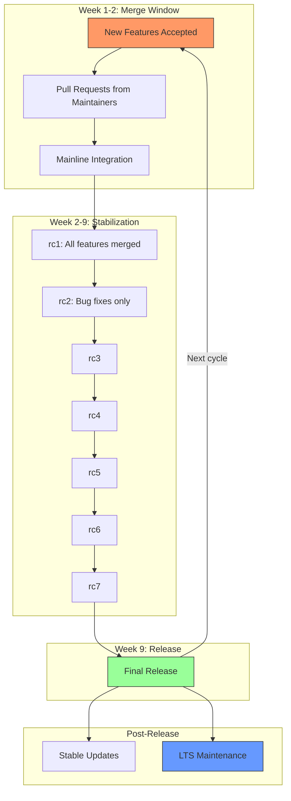
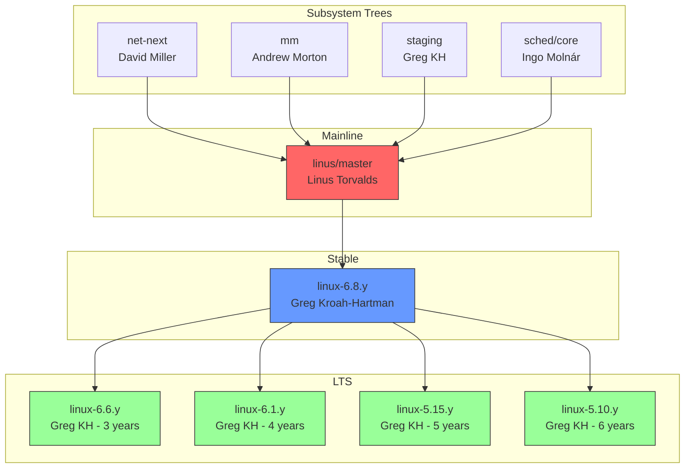
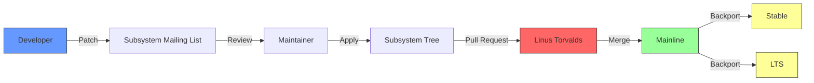

# Chapter 9: The Kernel Release Model

## 9.1 Introduction

The Linux kernel development process is one of the most successful open-source development models in history. Every 9-10 weeks, a new kernel version is released, incorporating contributions from thousands of developers across hundreds of organizations. This chapter explains how the kernel release model works, including the roles of mainline, stable, and LTS kernels, the merge window, and the development cycle.

## 9.2 Intuition

The kernel release model balances two competing needs:

1. **Rapid innovation**: New features, driver support, and performance improvements must flow quickly to users.
2. **Stability**: Production systems need reliable, well-tested kernels that don't break.

The solution is a **time-based release model** with multiple branches:

- **Mainline**: The bleeding edge, where new features land
- **Stable**: Mainline releases that receive bug fixes
- **LTS**: Selected releases that receive extended maintenance

This model allows developers to contribute features without waiting for a "feature freeze," while ensuring that production users have access to stable, well-tested kernels.

## 9.3 The Historical Evolution

### 9.3.1 The Early Days (1991-2003)

In the early days, kernel releases were ad hoc. Torvalds released new versions whenever he felt they were ready. There was no predictable schedule, no formal process for accepting patches, and no concept of "stable" vs. "development" kernels.

### 9.3.2 The 2.6 Series (2003-2011)

With the 2.6 kernel, the development model shifted to a **time-based release** model. The "even/odd" numbering scheme (even = stable, odd = development) was abandoned. Instead:

- The mainline kernel (2.6.x) was always considered "stable"
- New features were merged directly into mainline
- Releases happened every 2-3 months

This model worked well initially but had problems:
- **Regression risk**: New features could introduce bugs
- **Long release cycles**: Releases took longer than planned
- **No formal stable process**: Bug fixes were ad hoc

### 9.3.3 The Modern Model (2005-Present)

In 2005, the kernel community formalized the release process:

- **Andrew Morton** became the "second in command" (maintaining the -mm tree for testing)
- **Greg Kroah-Hartman** took over stable kernel maintenance
- **The merge window** was formalized
- **LTS kernels** were introduced

## 9.4 The Mainline Kernel

### 9.4.1 What is Mainline?

The **mainline kernel** is the official Linux kernel maintained by Linus Torvalds. It is the "source of truth" from which all other kernel trees derive.

Mainline is where:
- New features are developed and merged
- Major architectural changes happen
- New hardware support is added
- New system calls and APIs are introduced

The mainline repository is at: `https://git.kernel.org/pub/scm/linux/kernel/git/torvalds/linux.git`

### 9.4.2 Who Maintains Mainline?

**Linus Torvalds** is the sole maintainer of the mainline kernel. He:
- Pulls changes from subsystem maintainers
- Makes the final decision on what goes into each release
- Tags releases
- Resolves disputes (rarely)

Torvalds does not write much code himself anymore. His role is that of an **integrator**—he reviews and merges code from subsystem maintainers.

### 9.4.3 The Merge Window

The **merge window** is the first two weeks of each kernel development cycle. During this period:

- New features are merged into mainline
- Subsystem maintainers send pull requests to Torvalds
- No bug fixes are accepted (only new features)

After the merge window closes:
- A **release candidate** (rc1) is tagged
- Only bug fixes are accepted
- New features wait for the next merge window

## 9.5 The Development Cycle

### 9.5.1 The 9-10 Week Cycle

Each kernel release follows a predictable cycle:

```
Week 0:  Release of previous version (e.g., 6.7)
Week 1-2: Merge window (new features accepted)
Week 2:  rc1 tagged (merge window closes)
Week 3:  rc2 (bug fixes only)
Week 4:  rc3
Week 5:  rc4
Week 6:  rc5
Week 7:  rc6
Week 8:  rc7
Week 9:  Final release (e.g., 6.8)
```

The cycle is typically 9-10 weeks, but can vary:
- **Shorter cycles** (8 weeks): When the kernel is stable and few regressions are reported
- **Longer cycles** (10-11 weeks): When serious regressions need to be fixed

### 9.5.2 Release Candidates

Release candidates (rc1, rc2, ..., rc7) are pre-release versions. They are:
- **rc1**: Contains all new features from the merge window
- **rc2-rc7**: Contain only bug fixes
- **rc7 or rc8**: If very few regressions remain, a final release may follow

Most releases have 7 release candidates. If serious regressions remain after rc7, an rc8 may be released.

### 9.5.3 The Release Process

```bash
# Typical kernel release timeline
# Week 0: 6.7 released
# Week 1-2: Merge window for 6.8
# Week 2: 6.8-rc1
# Week 3: 6.8-rc2
# Week 4: 6.8-rc3
# Week 5: 6.8-rc4
# Week 6: 6.8-rc5
# Week 7: 6.8-rc6
# Week 8: 6.8-rc7
# Week 9: 6.8 released
```

## 9.6 Stable Kernels

### 9.6.1 What is Stable?

After a mainline kernel is released, it enters the **stable** phase. The stable kernel receives:
- Bug fixes
- Security patches
- Driver updates (sometimes)

The stable kernel is maintained by **Greg Kroah-Hartman** (and other developers). The stable repository is at:
`https://git.kernel.org/pub/scm/linux/kernel/git/stable/linux.git`

### 9.6.2 Stable Release Cadence

Stable kernels are updated approximately weekly:
- **6.8.1**, **6.8.2**, **6.8.3**, etc.
- Each stable release contains accumulated bug fixes
- Users are encouraged to update to the latest stable release

### 9.6.3 When Does Stable End?

A stable kernel is maintained until the **next** mainline kernel is released. For example:
- 6.7 stable is maintained until 6.8 is released
- 6.8 stable is maintained until 6.9 is released

This means each stable kernel receives approximately 9-10 weeks of maintenance (unless it's an LTS kernel).

## 9.7 Long-Term Support (LTS) Kernels

### 9.7.1 What is LTS?

**LTS (Long-Term Support)** kernels receive extended maintenance—typically 2-6 years. LTS kernels are selected by the kernel community and maintained by Greg Kroah-Hartman and other developers.

LTS kernels are critical for:
- **Embedded systems**: Devices that are deployed for years and can't easily update
- **Enterprise servers**: Systems that need long-term stability
- **Distributions**: LTS-based distributions (e.g., Ubuntu LTS, Debian Stable)

### 9.7.2 Current LTS Kernels

| Kernel | Released | EOL | Maintainer | Duration |
|--------|----------|-----|------------|----------|
| 6.12 | Dec 2024 | Dec 2026 | Sasha Levin | 2 years |
| 6.6 | Oct 2023 | Dec 2026 | Greg KH | 3 years |
| 6.1 | Dec 2022 | Dec 2026 | Greg KH | 4 years |
| 5.15 | Oct 2021 | Dec 2026 | Greg KH | 5 years |
| 5.10 | Dec 2020 | Dec 2026 | Greg KH | 6 years |
| 5.4 | Nov 2019 | Dec 2025 | Greg KH | 6 years |
| 4.19 | Oct 2018 | Dec 2024 | Greg KH | 6 years |
| 4.14 | Nov 2017 | Jan 2024 | Greg KH | 6 years |

*Note: LTS durations have been extended from 2 years to 6 years for recent kernels.*

### 9.7.3 LTS Selection Criteria

The kernel community selects LTS kernels based on:
- **Timing**: Every year, one kernel release is designated as LTS
- **Stability**: The kernel should be well-tested before being designated LTS
- **Community interest**: There should be sufficient community interest in long-term maintenance

Typically, the **last kernel release of the year** (usually November or December) is designated as LTS.

### 9.7.4 LTS Maintenance

LTS kernels receive:
- **Bug fixes**: Critical bugs are backported from mainline
- **Security patches**: CVE fixes are backported
- **Driver updates**: Important driver fixes are backported

LTS kernels do **not** receive:
- **New features**: Only bug fixes and security patches
- **Major driver updates**: Only critical fixes

## 9.8 The Role of Subsystem Maintainers

### 9.8.1 Maintainer Hierarchy

The kernel development process relies on a hierarchical structure of **maintainers**:

```
Linus Torvalds (mainline)
    │
    ├── Andrew Morton (memory management, mm tree)
    ├── David Miller (networking)
    ├── Greg Kroah-Hartman (staging, USB, stable)
    ├── Ingo Molnár (scheduler, core)
    ├── Thomas Gleixner (interrupts, time)
    ├── Jens Axboe (block I/O)
    ├── Mark Brown (SPI, regulators)
    ├── Arnd Bergmann (architecture, Y2038)
    └── ... (hundreds of other maintainers)
```

Each maintainer is responsible for a specific subsystem:
- Reviews patches
- Tests changes
- Sends pull requests to Torvalds during the merge window
- Maintains their own git tree

### 9.8.2 The MAINTAINERS File

The kernel source tree contains a `MAINTAINERS` file that lists:
- Who maintains each subsystem
- What files they're responsible for
- Their email address
- Their git tree URL
- The status of the subsystem (Maintained, Supported, Odd Fixes, Orphan, etc.)

```bash
# Search for maintainers of a specific file
perl scripts/get_maintainer.pl -f drivers/net/ethernet/intel/e1000e/netdev.c
```

### 9.8.3 Pull Requests

During the merge window, maintainers send **pull requests** to Torvalds. A pull request is a request to merge a git tree into mainline:

```bash
# Example pull request (from a maintainer to Torvalds)
# The following is a typical pull request message:

The following changes since commit abc1234:

  Linux 6.7 (2024-01-07 12:00:00 -0800)

are available in the Git repository at:

  git://git.kernel.org/pub/scm/linux/kernel/git/networking.git net-next

for you to fetch changes up to def5678:

  Merge branch 'net-next-6.8' (2024-01-21 10:00:00 -0800)

----------------------------------------------------------------
Networking subsystem updates for 6.8:

* New features:
  - Support for new Ethernet hardware
  - TCP performance improvements
  - IPv6 enhancements

* Bug fixes:
  - Fix race condition in socket handling
  - Fix memory leak in driver X

* Cleanup:
  - Remove deprecated APIs
  - Code style fixes

----------------------------------------------------------------
John Doe (50):
      net: Add support for new Ethernet hardware
      tcp: Improve performance for high-latency links
      ipv6: Add new extension header support
      ...
```

## 9.9 Contributing to the Kernel

### 9.9.1 The Patch Submission Process

Contributing to the Linux kernel follows a well-defined process:

1. **Find or report a bug**: Check the kernel bugzilla, mailing lists, or static analysis reports
2. **Write the patch**: Follow the kernel coding style (see `Documentation/process/coding-style.rst`)
3. **Test the patch**: Ensure the patch compiles, passes tests, and doesn't introduce regressions
4. **Format the patch**: Use `git format-patch` to create a properly formatted patch
5. **Send the patch**: Email the patch to the appropriate mailing list and maintainer
6. **Respond to feedback**: Address review comments and send updated versions
7. **Wait for merge**: The maintainer will merge the patch into their subsystem tree

### 9.9.2 The Kernel Coding Style

The kernel has a specific coding style documented in `Documentation/process/coding-style.rst`:

```c
/*
 * Good kernel code example
 * Note: tabs for indentation (8 spaces wide)
 */

#include <linux/module.h>
#include <linux/kernel.h>

struct my_data {
	int value;
	char name[32];
};

static int my_function(struct my_data *data)
{
	if (!data)
		return -EINVAL;

	if (data->value > 100) {
		pr_warn("Value %d exceeds maximum\n", data->value);
		return -ERANGE;
	}

	pr_info("Processing %s with value %d\n", data->name, data->value);
	return 0;
}
```

Key style points:
- **Tabs, not spaces**: 8-character tab stops
- **Brace placement**: Opening brace on the same line for functions, next line for control structures
- **Naming**: `lowercase_with_underscores` for functions and variables
- **Comments**: C89 style (`/* */`), not C99 (`//`)
- **Line length**: 80 columns (soft limit, not hard)
- **Includes**: Sorted alphabetically, grouped by subsystem

### 9.9.3 Kernel Testing

The kernel has extensive testing infrastructure:

```bash
# Run kernel self-tests
cd tools/testing/selftests
make
make run_tests

# Run KUnit tests (in-kernel unit testing)
make -C /path/to/kernel M=tools/testing/kunit

# Static analysis with sparse
make C=1  # Run sparse on files being compiled

# Static analysis with smatch
make CHECK=smatch

# Static analysis with Coccinelle
make coccicheck

# Checkpatch (coding style checker)
./scripts/checkpatch.pl my_patch.patch
```

### 9.9.4 The Kernel CI Ecosystem

The kernel has a continuous integration ecosystem:

- **KernelCI**: Automated testing on real hardware
- **0-Day Bot**: Automated build and boot testing
- **Intel 0-Day**: Intel's automated testing service
- **LKFT**: Linaro Kernel Functional Testing
- **Syzkaller**: Fuzz testing for the kernel
- **syzbot**: Automated bug reporting from syzkaller

## 9.10 Code Examples

### 9.9.1 Checking Kernel Version

```bash
# Check current kernel version
uname -r
# Output: 6.8.0-40-generic

# Detailed version information
uname -a
# Output: Linux hostname 6.8.0-40-generic #40-Ubuntu SMP PREEMPT_DYNAMIC x86_64 GNU/Linux

# Check kernel version from /proc
cat /proc/version
# Output: Linux version 6.8.0-40-generic (buildd@lcy02-amd64-080) ...

# View kernel release information
cat /proc/sys/kernel/osrelease
# Output: 6.8.0-40-generic
```

### 9.9.2 Checking Available Kernel Updates

```bash
# Debian/Ubuntu
apt list --upgradable | grep linux

# Fedora/RHEL
dnf check-update kernel

# Arch Linux
pacman -Qu linux

# openSUSE
zypper list-updates | grep kernel
```

### 9.9.3 Kernel Version Parsing

```python
#!/usr/bin/env python3
"""Parse and analyze Linux kernel versions."""

import re

def parse_kernel_version(version_string):
    """
    Parse a Linux kernel version string.
    
    Examples:
        6.8.0-40-generic → (6, 8, 0, 40, 'generic')
        6.8.0 → (6, 8, 0, None, None)
        6.8-rc7 → (6, 8, 'rc7', None, None)
    """
    # Main version: X.Y.Z
    match = re.match(r'^(\d+)\.(\d+)\.(\d+)', version_string)
    if not match:
        return None
    
    major, minor, patch = int(match.group(1)), int(match.group(2)), int(match.group(3))
    
    # Check for release candidate
    rc_match = re.search(r'-rc(\d+)', version_string)
    rc = f'rc{rc_match.group(1)}' if rc_match else None
    
    # Check for distribution suffix
    suffix_match = re.search(r'-(\d+)-(\w+)', version_string)
    build = int(suffix_match.group(1)) if suffix_match else None
    flavor = suffix_match.group(2) if suffix_match else None
    
    return (major, minor, patch, rc, build, flavor)

def is_lts(version):
    """Check if a version is an LTS kernel."""
    lts_versions = [
        (6, 12), (6, 6), (6, 1), (5, 15), (5, 10), (5, 4),
        (4, 19), (4, 14), (4, 9), (4, 4)
    ]
    return (version[0], version[1]) in lts_versions

# Example
version = parse_kernel_version("6.8.0-40-generic")
print(f"Parsed: {version}")
print(f"Is LTS: {is_lts(version)}")
```

### 9.9.4 Viewing Kernel Changelog

```bash
# View recent kernel changelog
cd /usr/src/linux-headers-$(uname -r)
head -100 Makefile

# View git log (if you have the kernel source)
git log --oneline -20

# View changes between kernel versions
git log --oneline v6.7..v6.8 | head -20
```

## 9.10 Diagrams

### 9.10.1 The Kernel Development Cycle



### 9.10.2 Kernel Branch Hierarchy



### 9.10.3 Patch Flow



## 9.11 Common Pitfalls

### 9.11.1 Using Mainline in Production

**The mistake**: Running the latest mainline kernel in production.

**The reality**: Mainline kernels receive minimal testing before release. Use stable or LTS kernels for production systems.

### 9.11.2 Ignoring Stable Updates

**The mistake**: Installing a kernel and never updating it.

**The reality**: Stable kernels receive critical bug fixes and security patches. Always update to the latest stable release.

### 9.11.3 Confusing LTS with "Long-Term Everything"

**The mistake**: Assuming LTS kernels are maintained forever.

**The reality**: LTS kernels have defined end-of-life dates. Plan for kernel upgrades before your LTS kernel reaches EOL.

### 9.11.4 Not Testing Kernel Updates

**The mistake**: Applying kernel updates to production without testing.

**The reality**: Always test kernel updates in a staging environment before deploying to production.

## 9.12 Best Practices

### 9.12.1 Choose the Right Kernel for Your Use Case

| Use Case | Recommended Kernel |
|----------|-------------------|
| Desktop/Laptop | Distribution-provided (latest stable) |
| Production Server | LTS kernel (e.g., 6.6 or 6.1) |
| Embedded Device | LTS kernel (matched to product lifecycle) |
| Development/Testing | Latest stable or mainline |

### 9.12.2 Monitor Kernel Security

Subscribe to:
- linux-kernel mailing list (LKML) for general development
- linux-distros mailing list for security embargoed issues
- Your distribution's security announcements

### 9.12.3 Automate Kernel Updates

For servers, use tools like `kexec` or `livepatch` to apply kernel updates with minimal downtime.

## 9.13 Exercises

### Exercise 1: Track the Kernel Release Cycle
Monitor the kernel release cycle for one full release:
- Note the merge window dates
- Track each release candidate
- Document the final release date
- Compare with the expected timeline

### Exercise 2: Compare Kernel Versions
Compare the features of two kernel versions (e.g., 6.6 LTS and 6.8 mainline):
- What features are in 6.8 but not in 6.6?
- What security patches have been backported to 6.6?
- Which would you choose for a production server?

### Exercise 3: Kernel Update Policy
Write a kernel update policy for a production environment:
- When to apply stable updates
- When to upgrade to a new LTS kernel
- How to test updates before deployment
- How to roll back if something goes wrong

### Exercise 4: MAINTAINERS File Analysis
Parse the kernel's MAINTAINERS file:
- How many subsystems are maintained?
- How many maintainers are there?
- What percentage of subsystems are "Maintained" vs. "Odd Fixes" vs. "Orphan"?

### Exercise 5: Kernel Development Contribution
Find a simple bug in the kernel (check the kernel bugzilla or mailing lists) and write a patch. Follow the kernel coding style and submit process.

## 9.14 Kernel Release Infrastructure

### 9.14.1 kernel.org

**kernel.org** is the primary distribution site for the Linux kernel. It hosts:

- The mainline git repository
- Stable and LTS kernel trees
- Source tarballs for all releases
- PGP signatures for all releases
- The kernel mailing list archives

### 9.14.2 Release Signing

All kernel releases are signed by Linus Torvalds (mainline) or Greg Kroah-Hartman (stable/LTS) using GPG keys. Users should verify signatures before using kernel source:

```bash
# Import the kernel signing keys
gpg --keyserver hkps://keyserver.ubuntu.com --recv-keys 647F28654894E3BD457199BE38DBBDC86092693E

# Download kernel and signature
wget https://cdn.kernel.org/pub/linux/kernel/v6.x/linux-6.8.tar.xz
wget https://cdn.kernel.org/pub/linux/kernel/v6.x/linux-6.8.tar.sign

# Verify the signature
xz -cd linux-6.8.tar.xz | gpg --verify linux-6.8.tar.sign -
```

### 9.14.3 The Kernel Workflow Tool

The kernel community uses several tools to manage the development process:

- **git**: Version control (Linus Torvalds wrote git specifically for kernel development)
- **b4**: Tool for applying patches from the mailing list
- **lei**: Linux kernel email indexing tool
- **git-publish**: Tool for preparing patch series

```bash
# Apply a patch series from the mailing list using b4
b4 am 20240115123456.12345-1-author@example.com

# Apply to current tree
git am *.mbx
```

## 9.15 References

1. The Linux Kernel Archives. https://www.kernel.org/
2. Linux Kernel Documentation. https://www.kernel.org/doc/html/latest/
3. Kroah-Hartman, G. "Linux Kernel Release Model." https://www.kernel.org/doc/html/latest/process/development-process.html
4. Corbet, J. "A Guide to the Kernel Development Process." https://www.kernel.org/doc/html/latest/process/development-process.html
5. LWN.net. https://lwn.net/ — Excellent kernel development coverage
6. Linux Kernel Mailing List (LKML). https://lkml.org/
7. kernel.org LTS releases. https://kernel.org/category/releases.html
8. Kroah-Hartman, G. "Stable Kernel Rules." https://www.kernel.org/doc/html/latest/process/stable-kernel-rules.html
9. Torvalds, L. Linux kernel git repository. https://github.com/torvalds/linux
10. Linux Foundation. "Linux Kernel Development Reports." https://www.linuxfoundation.org/
