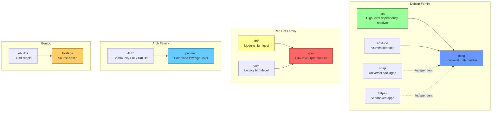
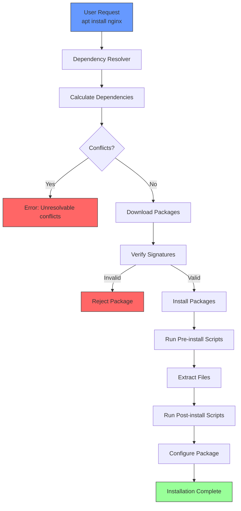
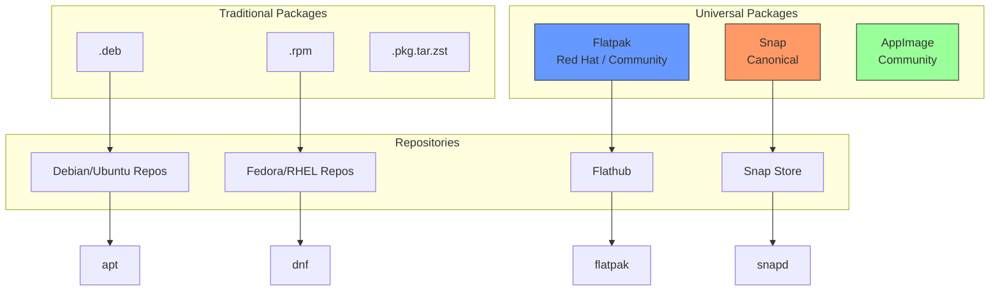

# Chapter 10: Package Managers and the Distribution Ecosystem

## 10.1 Introduction

Package managers are the unsung heroes of Linux distributions. They handle the installation, upgrade, configuration, and removal of software, managing complex dependency trees and ensuring system consistency. Understanding package managers is essential for effective Linux administration. This chapter covers the major package management systems, their architectures, and their ecosystems.

## 10.2 Intuition

A package manager solves a fundamental problem: **software has dependencies**.

Consider installing a web server. It depends on a networking library, which depends on a cryptography library, which depends on a math library. Each of these has its own dependencies. Manually tracking and installing these would be tedious and error-prone.

A package manager:
1. **Resolves dependencies** automatically
2. **Downloads packages** from repositories
3. **Verifies integrity** (checksums, signatures)
4. **Installs files** in the correct locations
5. **Tracks what's installed** for easy removal
6. **Handles upgrades** without breaking dependencies

## 10.3 Package Management Concepts

### 10.3.1 Package Formats

A **package** is a compressed archive containing:
- The compiled software (binaries, libraries)
- Configuration files
- Metadata (name, version, dependencies, description)
- Pre/post-installation scripts
- License information

Common package formats:

| Format | Extension | Used By |
|--------|-----------|---------|
| DEB | `.deb` | Debian, Ubuntu, Mint |
| RPM | `.rpm` | Fedora, RHEL, SUSE, CentOS |
| PKG | `.pkg.tar.zst` | Arch Linux |
| tarball | `.tbz2`, `.txz` | Slackware |
| ebuild | `.ebuild` | Gentoo (source-based) |

### 10.3.2 Repositories

A **repository** is a collection of packages hosted on a server. Distributions maintain official repositories with tested, compatible packages. Users can also add third-party repositories.

### 10.3.3 Dependency Resolution

**Dependency resolution** is the process of determining which packages need to be installed to satisfy a given package's requirements. This is a graph problem:

```
Package A depends on:
├── Library B (>= 2.0)
│   ├── Library C (>= 1.5)
│   └── Library D
└── Library E
    └── Library C (>= 1.0)
```

The resolver must:
1. Find all required packages
2. Check version constraints
3. Detect conflicts
4. Find an installation order that satisfies all dependencies

### 10.3.4 Package States

Packages can be in several states:
- **Installed**: Present on the system
- **Not installed**: Available but not installed
- **Held**: Installed but pinned to a specific version
- **Broken**: Installed but with unmet dependencies
- **Configured**: Installed and configured
- **Unpacked**: Installed but not yet configured

## 10.4 dpkg and APT (Debian/Ubuntu)

### 10.4.1 dpkg: The Low-Level Tool

**dpkg** is the base package management tool for Debian-based systems. It handles individual `.deb` packages but does not resolve dependencies.

```bash
# Install a local .deb package
dpkg -i package.deb

# Remove a package
dpkg -r package_name

# Purge a package (remove config files too)
dpkg -P package_name

# List installed packages
dpkg -l | grep package_name

# Show package information
dpkg -s package_name

# List files in a package
dpkg -L package_name

# Find which package owns a file
dpkg -S /path/to/file

# Check package status
dpkg --status package_name

# Configure unconfigured packages
dpkg --configure -a
```

### 10.4.2 APT: The High-Level Tool

**APT** (Advanced Package Tool) is the high-level package manager that resolves dependencies, downloads packages from repositories, and handles upgrades.

```bash
# Update package lists
apt update

# Upgrade all packages
apt upgrade

# Full upgrade (may remove packages to resolve conflicts)
apt full-upgrade

# Install a package
apt install package_name

# Remove a package
apt remove package_name

# Remove a package and its config files
apt purge package_name

# Remove unused dependencies
apt autoremove

# Search for a package
apt search keyword

# Show package information
apt show package_name

# List all available packages
apt list --all-versions package_name

# List installed packages
apt list --installed

# Clean package cache
apt clean

# Download a package without installing
apt download package_name
```

### 10.4.3 APT Configuration

APT configuration is spread across several files:

```bash
# Main configuration
/etc/apt/apt.conf
/etc/apt/apt.conf.d/

# Repository lists
/etc/apt/sources.list
/etc/apt/sources.list.d/

# Package preferences (pinning)
/etc/apt/preferences
/etc/apt/preferences.d/

# GPG keys for repository verification
/etc/apt/trusted.gpg
/etc/apt/trusted.gpg.d/
```

### 10.4.4 Repository Management

```bash
# Add a repository
echo "deb http://archive.ubuntu.com/ubuntu/ jammy universe" | sudo tee -a /etc/apt/sources.list

# Add a PPA (Personal Package Archive)
sudo add-apt-repository ppa:user/repo

# Add a GPG key
wget -qO - https://example.com/key.gpg | sudo apt-key add -

# Modern way: signed-by in sources.list
echo "deb [signed-by=/usr/share/keyrings/example.gpg] https://example.com/repo stable main" | sudo tee /etc/apt/sources.list.d/example.list
```

### 10.4.5 APT Pinning

APT pinning allows you to prefer packages from specific repositories or versions:

```bash
# /etc/apt/preferences.d/specific-package
Package: specific-package
Pin: release a=stable
Pin-Priority: 900

# Pin a package to a specific version
Package: firefox
Pin: version 115.*
Pin-Priority: 1000
```

Priority values:
- **>1000**: Force version (even downgrade)
- **990**: Prefer this version
- **500**: Default priority
- **100**: Installed packages
- **<100**: Only if no other version available

## 10.5 RPM and DNF/Yum (Fedora/RHEL)

### 10.5.1 RPM: The Low-Level Tool

**RPM** (Red Hat Package Manager) is the base package management tool for Red Hat-based systems.

```bash
# Install a local .rpm package
rpm -ivh package.rpm

# Upgrade a package
rpm -Uvh package.rpm

# Fresh install only (fail if already installed)
rpm -Fvh package.rpm

# Remove a package
rpm -e package_name

# Query installed packages
rpm -qa | grep package_name

# Show package information
rpm -qi package_name

# List files in a package
rpm -ql package_name

# Find which package owns a file
rpm -qf /path/to/file

# Verify package integrity
rpm -V package_name

# Import GPG key
rpm --import /path/to/key.gpg
```

### 10.5.2 DNF: The Modern High-Level Tool

**DNF** (Dandified YUM) replaced YUM as the default package manager in Fedora 22 (2015) and RHEL 8 (2019).

```bash
# Install a package
dnf install package_name

# Remove a package
dnf remove package_name

# Update all packages
dnf update

# Update a specific package
dnf update package_name

# Search for a package
dnf search keyword

# Show package information
dnf info package_name

# List available packages
dnf list available

# List installed packages
dnf list installed

# Check for updates
dnf check-update

# Remove unused dependencies
dnf autoremove

# Clean cache
dnf clean all

# Install a local .rpm file
dnf install /path/to/package.rpm

# History
dnf history
dnf history undo <transaction_id>
```

### 10.5.3 DNF Plugins

DNF has a plugin system for extending functionality:

```bash
# Enable a repository
dnf config-manager --add-repo https://example.com/repo.repo

# Enable/disable a repository
dnf config-manager --set-enabled repo_name
dnf config-manager --set-disabled repo_name

# Install a group of packages
dnf group list
dnf group install "Development Tools"

# Module streams (RHEL 8+)
dnf module list
dnf module enable module:stream
dnf module install module:stream/profile
```

### 10.5.4 YUM (Legacy)

**YUM** (Yellowdog Updater, Modified) was the predecessor to DNF. It's still available on older systems but has been replaced by DNF.

```bash
# YUM commands (similar to DNF)
yum install package_name
yum update
yum remove package_name
yum search keyword
yum info package_name
```

### 10.5.5 Repository Configuration

```bash
# Repository files location
/etc/yum.repos.d/

# Example repository file
cat > /etc/yum.repos.d/example.repo << 'EOF'
[example]
name=Example Repository
baseurl=https://example.com/repo/$releasever/$basearch/
enabled=1
gpgcheck=1
gpgkey=https://example.com/repo/RPM-GPG-KEY-example
EOF
```

## 10.6 Pacman (Arch Linux)

### 10.6.1 Overview

**Pacman** is the package manager for Arch Linux. It's known for its simplicity, speed, and the Arch User Repository (AUR).

```bash
# Synchronize package databases and update system
pacman -Syu

# Install a package
pacman -S package_name

# Remove a package
pacman -R package_name

# Remove a package and its dependencies
pacman -Rs package_name

# Remove a package, dependencies, and config files
pacman -Rns package_name

# Search for a package
pacman -Ss keyword

# Show package information
pacman -Si package_name

# Show installed package information
pacman -Qi package_name

# List files owned by a package
pacman -Ql package_name

# Find which package owns a file
pacman -Qo /path/to/file

# List all installed packages
pacman -Q

# List explicitly installed packages
pacman -Qe

# List orphaned packages
pacman -Qdt

# Clean package cache
pacman -Sc

# Search for a file in packages
pacman -F filename
```

### 10.6.2 AUR (Arch User Repository)

The **AUR** (Arch User Repository) is a community repository of package build scripts (PKGBUILDs). AUR packages are built from source on your machine.

```bash
# Clone an AUR package
git clone https://aur.archlinux.org/package-name.git

# Build and install
cd package-name
makepkg -si

# AUR helpers (automate AUR installation)
# yay (Yet Another Yogurt)
yay -S package_name

# paru
paru -S package_name
```

### 10.6.3 Pacman Configuration

```bash
# Main configuration
/etc/pacman.conf

# Mirror list
/etc/pacman.d/mirrorlist

# Keyring
/etc/pacman.d/gnupg/
```

Key configuration options in `/etc/pacman.conf`:
```ini
[options]
HoldPkg = pacman glibc
Architecture = auto
CheckSpace
SigLevel = Required DatabaseOptional
LocalFileSigLevel = Optional

[core]
Include = /etc/pacman.d/mirrorlist

[extra]
Include = /etc/pacman.d/mirrorlist

[multilib]
Include = /etc/pacman.d/mirrorlist
```

## 10.7 Portage (Gentoo)

### 10.7.1 Overview

**Portage** is Gentoo's package management system, inspired by BSD's Ports system. It's a source-based system—packages are compiled from source code.

```bash
# Synchronize repository
emerge --sync

# Install a package
emerge package_name

# Remove a package
emerge --unmerge package_name

# Update all packages
emerge --update --deep --newuse @world

# Search for a package
emerge --search keyword

# Show package information
emerge --info package_name

# Pretend install (dry run)
emerge --pretend package_name

# Dependency graph
emerge --tree package_name
```

### 10.7.2 USE Flags

**USE flags** are Portage's most distinctive feature—they control which features are compiled into packages.

```bash
# View available USE flags for a package
emerge --pretend --verbose package_name

# Set USE flags globally
# /etc/portage/make.conf
USE="X gtk3 qt5 pulseaudio bluetooth -console"

# Set USE flags per package
# /etc/portage/package.use
app-editors/vim python lua
www-client/firefox hwaccel pulseaudio

# View current USE flags
emerge --info | grep USE
```

### 10.7.3 Ebuilds

An **ebuild** is a text file that describes how to build a package:

```bash
# Example ebuild (simplified)
# /var/db/repos/gentoo/app-editors/vim/vim-9.0.1234.ebuild

EAPI=8

inherit vim-plugin

DESCRIPTION="Vim, an improved vi-style text editor"
HOMEPAGE="https://www.vim.org/"
SRC_URI="https://github.com/vim/vim/archive/v${PV}.tar.gz -> vim-${PV}.tar.gz"

LICENSE="vim"
SLOT="0"
KEYWORDS="amd64 x86"
IUSE="python lua X gtk3"

DEPEND="python? ( dev-lang/python )
        lua? ( dev-lang/lua )
        X? ( x11-libs/libXt )
        gtk3? ( x11-libs/gtk+:3 )"
RDEPEND="${DEPEND}"
```

### 10.7.4 Portage Configuration

```bash
# Main configuration
/etc/portage/make.conf

# Package-specific USE flags
/etc/portage/package.use/

# Package keywords (testing/stable)
/etc/portage/package.keywords/

# Masked packages
/etc/portage/package.mask/

# Unmasked packages
/etc/portage/package.unmask/
```

## 10.8 Zypper (openSUSE/SLES)

### 10.8.1 Overview

**Zypper** is the command-line package manager for openSUSE and SUSE Linux Enterprise (SLES). It uses the libzypp library.

```bash
# Refresh repositories
zypper refresh

# Install a package
zypper install package_name

# Remove a package
zypper remove package_name

# Update all packages
zypper update

# Search for a package
zypper search keyword

# Show package information
zypper info package_name

# List repositories
zypper repos

# Add a repository
zypper addrepo https://example.com/repo.repo

# Remove a repository
zypper removerepo repo_name

# List installed packages
zypper packages --installed

# Clean cache
zypper clean
```

### 10.8.2 Patterns and Products

openSUSE uses **patterns** (groups of packages) and **products**:

```bash
# List available patterns
zypper patterns

# Install a pattern
zypper install -t pattern pattern_name

# List available products
zypper products
```

### 10.8.3 Repository Management

```bash
# Repository configuration
/etc/zypp/repos.d/

# Priority-based repository management
# Lower number = higher priority
zypper modifyrepo --priority=90 repo_name
```

## 10.9 Universal Package Formats

### 10.9.1 Flatpak

**Flatpak** is a distribution-agnostic package format developed by Red Hat:

```bash
# Install Flatpak
sudo apt install flatpak  # Debian/Ubuntu
sudo dnf install flatpak  # Fedora

# Add Flathub repository
flatpak remote-add --if-not-exists flathub https://flathub.org/repo/flathub.flatpakrepo

# Install an application
flatpak install flathub org.mozilla.Firefox

# Run an application
flatpak run org.mozilla.Firefox

# Update all Flatpaks
flatpak update

# List installed Flatpaks
flatpak list

# Remove a Flatpak
flatpak uninstall org.mozilla.Firefox
```

### 10.9.2 Snap

**Snap** is Canonical's universal package format:

```bash
# Install snapd
sudo apt install snapd  # Debian/Ubuntu

# Install a snap
sudo snap install package_name

# Remove a snap
sudo snap remove package_name

# List installed snaps
snap list

# Search for a snap
snap find keyword

# Update all snaps
sudo snap refresh

# Information about a snap
snap info package_name
```

### 10.9.3 AppImage

**AppImage** is a portable application format:

```bash
# Download an AppImage
wget https://example.com/app.AppImage

# Make executable
chmod +x app.AppImage

# Run
./app.AppImage
```

### 10.9.4 Comparison

| Feature | Flatpak | Snap | AppImage |
|---------|---------|------|----------|
| Sandboxing | Yes (bubblewrap) | Yes (AppArmor) | No |
| Auto-updates | Yes | Yes | No |
| Repository | Flathub | Snap Store | None |
| Disk usage | Higher | Higher | Single file |
| Desktop integration | Good | Good | Variable |
| Distro support | Most | Most (Ubuntu-centric) | All |

## 10.10 Package Manager Comparison

### 10.10.1 Feature Comparison

| Feature | apt | dnf | pacman | portage | zypper |
|---------|-----|-----|--------|---------|--------|
| Binary packages | ✓ | ✓ | ✓ | ✗ | ✓ |
| Source packages | ✗ | ✓ | ✗ | ✓ | ✓ |
| Dependency resolution | ✓ | ✓ | ✓ | ✓ | ✓ |
| Parallel downloads | ✓ | ✓ | ✓ | N/A | ✓ |
| Transaction rollback | ✗ | ✓ | ✗ | ✗ | ✓ |
| Delta updates | ✗ | ✓ | ✗ | ✗ | ✓ |
| Package signing | ✓ | ✓ | ✓ | ✓ | ✓ |
| Automatic updates | ✓ | ✓ | ✓ | ✓ | ✓ |

### 10.10.2 Command Comparison

| Task | apt | dnf | pacman | portage | zypper |
|------|-----|-----|--------|---------|--------|
| Install | `apt install` | `dnf install` | `pacman -S` | `emerge` | `zypper install` |
| Remove | `apt remove` | `dnf remove` | `pacman -R` | `emerge --unmerge` | `zypper remove` |
| Update all | `apt upgrade` | `dnf update` | `pacman -Syu` | `emerge --update @world` | `zypper update` |
| Search | `apt search` | `dnf search` | `pacman -Ss` | `emerge --search` | `zypper search` |
| Info | `apt show` | `dnf info` | `pacman -Si` | `emerge --info` | `zypper info` |
| Clean | `apt clean` | `dnf clean` | `pacman -Sc` | `emerge --clean` | `zypper clean` |

## 10.11 Code Examples

### 10.11.1 Automated Package Installation Script

```bash
#!/bin/bash
# Automated package installation for multiple distributions

set -euo pipefail

PACKAGES="vim git curl wget htop tmux"

install_packages() {
    local distro
    distro=$(awk -F= '/^ID=/ {print $2}' /etc/os-release | tr -d '"')
    
    case "$distro" in
        ubuntu|debian)
            sudo apt update
            sudo apt install -y $PACKAGES
            ;;
        fedora)
            sudo dnf install -y $PACKAGES
            ;;
        centos|rhel|almalinux|rocky)
            sudo dnf install -y $PACKAGES || sudo yum install -y $PACKAGES
            ;;
        arch|manjaro)
            sudo pacman -Syu --noconfirm $PACKAGES
            ;;
        opensuse*|sles)
            sudo zypper refresh
            sudo zgpper install -y $PACKAGES
            ;;
        *)
            echo "Unsupported distribution: $distro"
            exit 1
            ;;
    esac
}

install_packages
echo "Packages installed successfully!"
```

### 10.11.2 Package Dependency Graph Visualization

```python
#!/usr/bin/env python3
"""Visualize package dependencies using dpkg."""

import subprocess
import sys

def get_dependencies(package_name):
    """Get direct dependencies of a package."""
    try:
        result = subprocess.run(
            ['apt-cache', 'depends', '--no-suggests', package_name],
            capture_output=True, text=True, check=True
        )
        deps = []
        for line in result.stdout.splitlines():
            if line.strip().startswith('Depends:'):
                dep = line.strip().split(':')[1].strip()
                deps.append(dep)
        return deps
    except subprocess.CalledProcessError:
        return []

def build_dependency_tree(package_name, depth=0, max_depth=3):
    """Build and display dependency tree."""
    if depth > max_depth:
        return
    
    indent = "  " * depth
    print(f"{indent}├── {package_name}")
    
    deps = get_dependencies(package_name)
    for dep in deps:
        build_dependency_tree(dep, depth + 1, max_depth)

if __name__ == "__main__":
    if len(sys.argv) < 2:
        print("Usage: python3 dep_tree.py <package_name>")
        sys.exit(1)
    
    print(f"Dependency tree for {sys.argv[1]}:")
    build_dependency_tree(sys.argv[1])
```

### 10.11.3 Repository Configuration Script

```bash
#!/bin/bash
# Configure additional repositories for a fresh system

set -euo pipefail

configure_debian() {
    # Enable contrib and non-free
    sudo sed -i 's/main$/main contrib non-free non-free-firmware/' /etc/apt/sources.list
    
    # Add backports
    echo "deb http://deb.debian.org/debian bookworm-backports main" | \
        sudo tee /etc/apt/sources.list.d/backports.list
    
    sudo apt update
}

configure_fedora() {
    # Enable RPM Fusion
    sudo dnf install -y \
        https://download1.rpmfusion.org/free/fedora/rpmfusion-free-release-$(rpm -E %fedora).noarch.rpm \
        https://download1.rpmfusion.org/nonfree/fedora/rpmfusion-nonfree-release-$(rpm -E %fedora).noarch.rpm
    
    sudo dnf update
}

configure_arch() {
    # Enable multilib
    sudo sed -i '/\[multilib\]/,/Include/s/^#//' /etc/pacman.conf
    sudo pacman -Syu
}

# Detect distribution and configure
distro=$(awk -F= '/^ID=/ {print $2}' /etc/os-release | tr -d '"')

case "$distro" in
    ubuntu|debian) configure_debian ;;
    fedora) configure_fedora ;;
    arch|manjaro) configure_arch ;;
    *) echo "No additional configuration for $distro" ;;
esac

echo "Repository configuration complete!"
```

## 10.12 Diagrams

### 10.12.1 Package Manager Hierarchy



### 10.12.2 Package Installation Flow



### 10.12.3 Universal Package Ecosystem



## 10.13 Common Pitfalls

### 10.13.1 Mixing Package Managers

**The mistake**: Using both apt and snap/flatpak for the same software.

**The reality**: This can lead to conflicts, duplicate installations, and confusion about which version is running. Stick to one package source per application.

### 10.13.2 Not Updating Regularly

**The mistake**: Installing a system and never updating it.

**The reality**: Regular updates are essential for security. Unpatched systems are vulnerable to known exploits.

### 10.13.3 Ignoring Dependency Warnings

**The mistake**: Forcing package installation despite dependency warnings.

**The reality**: Dependency warnings exist for a reason. Forcing installation can break your system.

### 10.13.4 Using Untrusted Repositories

**The mistake**: Adding third-party repositories without verifying their trustworthiness.

**The reality**: Untrusted repositories can contain malicious packages. Only add repositories from trusted sources.

### 10.13.5 Not Cleaning Package Cache

**The mistake**: Letting the package cache grow indefinitely.

**The reality**: The package cache can consume significant disk space. Clean it regularly:
```bash
apt clean          # Debian/Ubuntu
dnf clean all      # Fedora/RHEL
pacman -Sc         # Arch
```

## 10.14 Best Practices

### 10.14.1 Use the Distribution's Package Manager

Whenever possible, use the distribution's native package manager. It handles dependencies, integrates with the system, and receives security updates.

### 10.14.2 Prefer Official Repositories

Official repositories contain tested, compatible packages. Third-party repositories should be used only when necessary.

### 10.14.3 Automate Updates

For servers, configure automatic security updates:
```bash
# Debian/Ubuntu: unattended-upgrades
sudo apt install unattended-upgrades
sudo dpkg-reconfigure unattended-upgrades

# Fedora/RHEL: dnf-automatic
sudo dnf install dnf-automatic
sudo systemctl enable --now dnf-automatic.timer
```

### 10.14.4 Pin Critical Packages

For production systems, pin critical packages to known-good versions to prevent unexpected upgrades.

### 10.14.5 Use Version Control for Configuration

Store package lists and repository configurations in version control:
```bash
# Export installed packages
dpkg --get-selections > packages.list  # Debian
rpm -qa > packages.list                # Red Hat

# Store repository configurations
cp /etc/apt/sources.list git-repo/    # Debian
cp -r /etc/yum.repos.d/ git-repo/     # Red Hat
```

## 10.15 Exercises

### Exercise 1: Package Manager Mastery
Using your distribution's package manager, perform all the tasks in the "Command Comparison" table. Document the output of each command.

### Exercise 2: Dependency Resolution
Install a complex package (e.g., `build-essential` on Debian or `Development Tools` on Fedora). Document:
- How many packages were installed
- What dependencies were resolved
- How much disk space was used

### Exercise 3: Repository Configuration
Configure your system with:
- At least one third-party repository
- Proper GPG key verification
- Appropriate priority settings

### Exercise 4: Universal Package Comparison
Install the same application using both the distribution's package manager and a universal format (Flatpak or Snap). Compare:
- Disk usage
- Startup time
- Integration with the system
- Update mechanism

### Exercise 5: Build a Package
Create a simple package for your distribution:
- Debian: Create a `.deb` package using `dpkg-deb`
- Red Hat: Create an `.rpm` package using `rpmbuild`
- Arch: Create a `PKGBUILD` and build with `makepkg`

## 10.16 References

1. Debian Package Management. https://www.debian.org/doc/manuals/debian-reference/ch02.en.html
2. APT User's Guide. https://manpages.debian.org/bookworm/apt/apt.8.en.html
3. DNF Documentation. https://dnf.readthedocs.io/
4. Arch Linux Pacman. https://wiki.archlinux.org/title/Pacman
5. Gentoo Portage. https://wiki.gentoo.org/wiki/Handbook:AMD64/Working/Portage
6. Zypper Documentation. https://en.opensuse.org/Portal:Zypper
7. Flatpak Documentation. https://docs.flatpak.org/
8. Snap Documentation. https://snapcraft.io/docs
9. AppImage Documentation. https://docs.appimage.org/
10. Debian Policy Manual. https://www.debian.org/doc/debian-policy/
