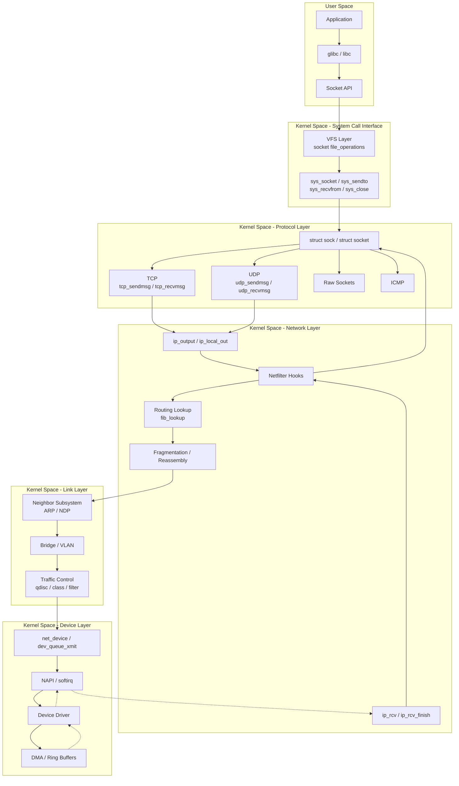
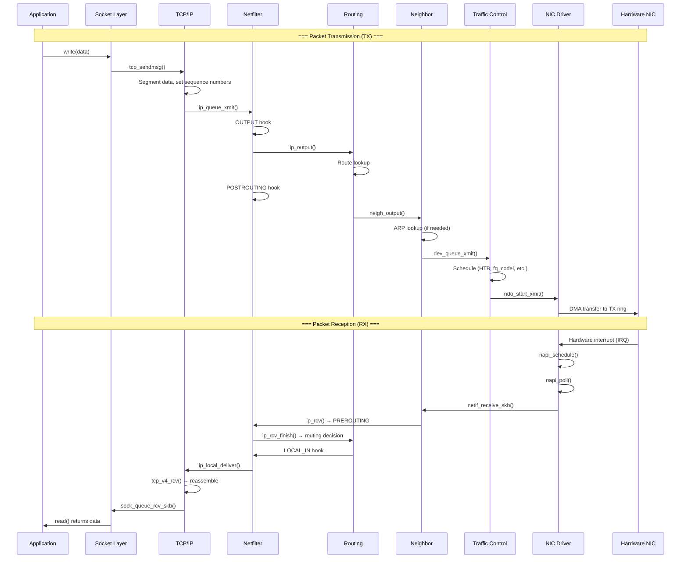

# Chapter 141: TCP/IP Architecture

## Introduction

The Transmission Control Protocol/Internet Protocol (TCP/IP) suite is the foundational communication framework of the modern Internet and virtually all contemporary computer networks. Understanding TCP/IP architecture is not merely an academic exercise—it is the essential knowledge required to debug network problems, optimize performance, secure systems, and build robust distributed applications. This chapter provides a deep exploration of the layered networking models, the socket abstraction, and the Linux kernel's networking stack implementation.

## Intuition: Why Layered Architecture?

Imagine sending a letter. You write content (application), place it in an envelope with an address (transport), the postal service routes it through sorting offices (network), and physical delivery trucks carry it (link/physical). Each layer has a distinct responsibility, and changes at one layer don't require changes at others.

Networking works the same way. A web browser doesn't need to know whether the underlying network is Ethernet, Wi-Fi, or fiber optics. The network layer doesn't need to know whether the payload is HTTP or SMTP. This separation of concerns is the fundamental insight behind layered network architectures.

### The Problem Layering Solves

Without layering, every application would need to implement every protocol detail—from electrical signals on the wire to application-level message formatting. Layering allows:

- **Modularity**: Each layer can be developed, tested, and updated independently
- **Interoperability**: Different vendors can implement different layers as long as interfaces are preserved
- **Abstraction**: Higher layers work with simpler abstractions (e.g., "reliable byte stream" instead of "manage sequence numbers, retransmissions, and flow control")
- **Reusability**: The same IP layer serves HTTP, SSH, DNS, and thousands of other protocols

## The OSI Reference Model

The Open Systems Interconnection (OSI) model, defined in ISO/IEC 7498, is a seven-layer conceptual framework. While the Internet doesn't strictly follow OSI, understanding it provides invaluable vocabulary and mental models.

### Layer 1: Physical Layer

The physical layer deals with raw bit transmission over a physical medium.

- **Responsibilities**: Electrical signals, optical pulses, radio frequencies, connector specifications
- **Examples**: Ethernet physical standards (1000BASE-T), 802.11 Wi-Fi PHY, USB electrical signaling
- **Linux relevance**: Device drivers interact with hardware at this level; `ethtool` can inspect PHY settings

### Layer 2: Data Link Layer

The data link layer provides node-to-node transfer and handles error detection.

- **Sub-layers**: LLC (Logical Link Control, IEEE 802.2) and MAC (Media Access Control)
- **Responsibilities**: Framing, MAC addressing, error detection (CRC), medium access control
- **Examples**: Ethernet (IEEE 802.3), Wi-Fi (IEEE 802.11), PPP
- **Linux relevance**: `struct sk_buff` represents frames; `net_device` represents interfaces; bridge and VLAN operate here

### Layer 3: Network Layer

The network layer handles routing and forwarding across network boundaries.

- **Responsibilities**: Logical addressing (IP addresses), routing, packet fragmentation/reassembly
- **Examples**: IPv4, IPv6, ICMP, IPsec (network-layer encryption)
- **Linux relevance**: The routing subsystem (`fib_trie`), `ip route`, netfilter hooks

### Layer 4: Transport Layer

The transport layer provides end-to-end communication services.

- **Responsibilities**: Segmentation, flow control, error recovery, multiplexing via port numbers
- **Examples**: TCP (reliable, connection-oriented), UDP (unreliable, connectionless), SCTP, DCCP
- **Linux relevance**: `struct tcp_sock`, `struct udp_sock`, socket buffer management

### Layer 5: Session Layer

The session layer manages sessions and dialog control.

- **Responsibilities**: Session establishment, maintenance, termination; checkpointing
- **Examples**: RPC, NFS session management, SMB sessions
- **Linux relevance**: Kernel RPC client (`sunrpc` module), SMB client (`ksmbd`)

### Layer 6: Presentation Layer

The presentation layer handles data representation and encryption.

- **Responsibilities**: Data encoding/decoding, encryption/decryption, compression
- **Examples**: SSL/TLS (often considered transport-layer in practice), XDR, ASN.1
- **Linux relevance**: Kernel TLS (`kTLS`), crypto API

### Layer 7: Application Layer

The application layer provides network services to applications.

- **Responsibilities**: Application protocols, user authentication, data representation
- **Examples**: HTTP, FTP, SMTP, DNS, SSH
- **Linux relevance**: User-space applications, kernel-assisted protocols

## The TCP/IP Model

The TCP/IP model (also called the Internet protocol suite) predates the OSI model in practice and is what the Internet actually uses. It has four (or five) layers:

### Layer 1: Link Layer (Network Interface)

Corresponds to OSI Layers 1-2. Handles physical transmission and local network communication.

```
┌─────────────────────────────────────────────────┐
│                 Link Layer                       │
│  ┌──────────┐  ┌──────────┐  ┌──────────┐      │
│  │ Ethernet  │  │   Wi-Fi  │  │    PPP   │      │
│  └──────────┘  └──────────┘  └──────────┘      │
│  Device drivers, ARP, NDP                        │
└─────────────────────────────────────────────────┘
```

### Layer 2: Internet Layer

Corresponds to OSI Layer 3. Handles logical addressing and routing.

```
┌─────────────────────────────────────────────────┐
│               Internet Layer                     │
│  ┌──────┐  ┌──────┐  ┌──────┐  ┌──────┐       │
│  │ IPv4 │  │ IPv6 │  │ ICMP │  │ ICMPv6│       │
│  └──────┘  └──────┘  └──────┘  └──────┘       │
│  Routing, fragmentation, encapsulation           │
└─────────────────────────────────────────────────┘
```

### Layer 3: Transport Layer

Corresponds to OSI Layer 4. Provides end-to-end communication.

```
┌─────────────────────────────────────────────────┐
│              Transport Layer                      │
│  ┌──────┐  ┌──────┐  ┌──────┐  ┌──────┐       │
│  │ TCP  │  │ UDP  │  │ SCTP │  │ DCCP │       │
│  └──────┘  └──────┘  └──────┘  └──────┘       │
│  Reliability, flow control, multiplexing         │
└─────────────────────────────────────────────────┘
```

### Layer 4: Application Layer

Combines OSI Layers 5-7. Contains application protocols.

```
┌─────────────────────────────────────────────────┐
│             Application Layer                    │
│  ┌──────┐  ┌──────┐  ┌──────┐  ┌──────┐       │
│  │ HTTP │  │ DNS  │  │ SSH  │  │ SMTP │       │
│  └──────┘  └──────┘  └──────┘  └──────┘       │
│  Application protocols and data                  │
└─────────────────────────────────────────────────┘
```

## Socket Layer: The Application-Kernel Interface

The socket API is the primary interface between user-space applications and the kernel networking stack. Created in the 1980s at UC Berkeley, it remains the standard networking API on Unix-like systems.

### Socket System Calls

```c
#include <sys/socket.h>
#include <netinet/in.h>
#include <unistd.h>
#include <stdio.h>
#include <string.h>

int main() {
    int sockfd;
    struct sockaddr_in addr;

    // Create a TCP socket
    sockfd = socket(AF_INET, SOCK_STREAM, 0);
    if (sockfd < 0) {
        perror("socket");
        return 1;
    }

    // Bind to an address
    memset(&addr, 0, sizeof(addr));
    addr.sin_family = AF_INET;
    addr.sin_addr.s_addr = htonl(INADDR_ANY);
    addr.sin_port = htons(8080);

    if (bind(sockfd, (struct sockaddr *)&addr, sizeof(addr)) < 0) {
        perror("bind");
        close(sockfd);
        return 1;
    }

    // Listen for connections
    if (listen(sockfd, SOMAXCONN) < 0) {
        perror("listen");
        close(sockfd);
        return 1;
    }

    printf("Listening on port 8080\n");

    // Accept a connection
    struct sockaddr_in client_addr;
    socklen_t client_len = sizeof(client_addr);
    int client_fd = accept(sockfd, (struct sockaddr *)&client_addr,
                           &client_len);
    if (client_fd < 0) {
        perror("accept");
        close(sockfd);
        return 1;
    }

    // Read data
    char buf[1024];
    ssize_t n = read(client_fd, buf, sizeof(buf));
    if (n > 0) {
        write(STDOUT_FILENO, buf, n);
    }

    close(client_fd);
    close(sockfd);
    return 0;
}
```

### Socket Types

| Type | Constant | Description | Protocol |
|------|----------|-------------|----------|
| Stream | `SOCK_STREAM` | Reliable, ordered, connection-based | TCP |
| Datagram | `SOCK_DGRAM` | Unreliable, connectionless messages | UDP |
| Raw | `SOCK_RAW` | Direct protocol access | IPv4, IPv6 |
| SeqPacket | `SOCK_SEQPACKET` | Reliable, ordered, message-boundary-preserving | SCTP |
| DCCP | `SOCK_DCCP` | Datagram Congestion Control Protocol | DCCP |

### Address Families

| Family | Constant | Description |
|--------|----------|-------------|
| IPv4 | `AF_INET` | 32-bit addresses, port numbers |
| IPv6 | `AF_INET6` | 128-bit addresses, port numbers |
| Unix | `AF_UNIX` | Pathname-based local IPC |
| Netlink | `AF_NETLINK` | Kernel-user communication |
| Packet | `AF_PACKET` | Raw link-layer access |
| VSOCK | `AF_VSOCK` | Host-guest communication (VMs) |

### The Socket Call Path in Linux

When an application calls `socket()`, the kernel performs these steps:

1. **`sys_socket()`** → **`__sys_socket()`**: System call entry
2. **`sock_create()`**: Allocates a `struct socket` (BSD layer)
3. **`sk_alloc()`**: Allocates the protocol-specific socket (e.g., `struct tcp_sock`)
4. **`sock_map_fd()`**: Installs the socket in the process file descriptor table

```c
/* Simplified socket creation flow in the kernel */

// net/socket.c
int __sys_socket(int family, int type, int protocol) {
    struct socket *sock;
    int fd;

    // Create the socket
    fd = sock_create(family, type, protocol, &sock);
    if (fd < 0)
        return fd;

    // Allocate a file descriptor and attach the socket
    fd = sock_map_fd(sock, flags & (O_CLOEXEC | O_NONBLOCK));
    if (fd < 0)
        sock_release(sock);

    return fd;
}
```

## Architecture: The Linux Kernel Networking Stack

The Linux networking stack is one of the most complex and capable networking implementations in any operating system. It supports a vast array of protocols, features, and hardware.

### High-Level Architecture



### Packet Reception Path (RX)

When a packet arrives at a network interface:

1. **Hardware**: NIC receives the frame, performs DMA to ring buffer
2. **Hardware interrupt (IRQ)**: NIC raises an interrupt
3. **NAPI poll**: Kernel switches to polling mode for efficiency
4. **`netif_receive_skb()`**: Packet enters the kernel networking stack
5. **Bridge/VLAN processing**: Layer 2 decisions
6. **`ip_rcv()`**: IP header validation and processing
7. **Netfilter PREROUTING**: Packet filtering/mangling before routing
8. **`ip_rcv_finish()` → `ip_route_input()`**: Routing decision (local, forward, or discard)
9. **Netfilter LOCAL_IN**: Filter packets destined for local delivery
10. **`ip_local_deliver()`**: Deliver to transport protocol
11. **`tcp_v4_rcv()` / `udp_rcv()`**: Transport-layer processing
12. **Socket receive buffer**: Data available for `recv()` system call

### Packet Transmission Path (TX)

When an application sends data:

1. **`send()` system call**: Application writes data
2. **Socket layer**: Data copied from user space to kernel buffer
3. **`tcp_sendmsg()` / `udp_sendmsg()`**: Protocol-specific processing
4. **`ip_queue_xmit()` / `udp_send_skb()`**: IP layer output
5. **Netfilter OUTPUT**: Filter locally-generated packets
6. **`ip_output()` → `ip_local_out()`**: IP header construction
7. **Netfilter POST_ROUTING**: Final filtering/mangling
8. **`ip_finish_output()`**: Fragmentation if needed
9. **`neigh_output()`**: ARP/neighbor resolution
10. **`dev_queue_xmit()`**: Enqueue to device
11. **Traffic control (qdisc)**: Scheduling, shaping
12. **`ndo_start_xmit()`**: Driver transmits the packet
13. **Hardware DMA**: Packet copied to NIC ring buffer for transmission

## Kernel Data Structures

### struct sk_buff (Socket Buffer)

The `sk_buff` is the most fundamental data structure in the Linux networking stack. Every packet in the kernel is represented by an `sk_buff`.

```c
/* include/linux/skbuff.h (simplified) */
struct sk_buff {
    /* Linked list management */
    struct sk_buff      *next, *prev;
    struct sk_buff_head *list;

    /* Time stamps */
    ktime_t             tstamp;

    /* This is the buffer we're working with */
    struct sock         *sk;          /* Owning socket */
    struct net_device   *dev;         /* Associated device */
    struct net_device   *skb_iif;     /* Ingress interface index */

    /* Protocol headers (pointers into head/data) */
    __u16               transport_header;  /* TCP/UDP header offset */
    __u16               network_header;    /* IP header offset */
    __u16               mac_header;        /* Ethernet header offset */

    /* Data pointers */
    unsigned char       *head;        /* Start of allocated buffer */
    unsigned char       *data;        /* Start of actual data */
    unsigned int         len;         /* Length of data */
    unsigned int         data_len;    /* Length of paged data */
    unsigned int         truesize;    /* Total buffer size including skb */

    /* Cloned/shared info */
    atomic_t             users;

    /* Protocol-specific */
    __u16               protocol;     /* Packet protocol (ETH_P_IP, etc.) */
    __u8                pkt_type;     /* Packet type (HOST, BROADCAST, etc.) */
    __be16              priority;     /* Packet queueing priority */

    /* Checksum offload */
    __u16               ip_summed;    /* Checksum state */
    __u16               csum_start;
    __u16               csum_offset;

    /* VLAN tags */
    __u16               vlan_tci;

    /* Network namespace */
    struct net           *dev_net;

    /* Security */
    struct sec_path     *sp;

    /* Extensions / metadata */
    char                cb[48];       /* Control block for protocol use */

    /* End marker */
    sk_buff_data_t      end;
    sk_buff_data_t      tail;
};
```

### sk_buff Memory Layout

```
head                data                 tail                 end
  │                   │                    │                    │
  ▼                   ▼                    ▼                    ▼
  ┌──────────┬────────┬────────────────────┬───────────────────┐
  │ headroom │headers │    payload data    │     tailroom      │
  │          │+ data  │                    │                   │
  └──────────┴────────┴────────────────────┴───────────────────┘
  ←──── headroom ────→←──── len ──────────→←── tailroom ──────→

  Headroom: Space for prepending headers (encapsulation)
  Tailroom: Space for appending data (padding, trailers)
```

### struct sock (Transport Socket)

```c
/* include/net/sock.h (simplified) */
struct sock {
    /* Socket state */
    sock_state_t        __sk_common;
#define sk_state        __sk_common.skc_state

    /* Addressing */
    sk_family_t         sk_family;       /* AF_INET, AF_INET6, etc. */
    __be16              sk_port;         /* Source port */
    __be32              sk_bound_dev_if; /* Bound device index */

    /* Receive queue */
    struct sk_buff_head sk_receive_queue;
    struct sk_buff_head sk_write_queue;
    struct sk_backlog   sk_backlog;

    /* Socket options */
    int                 sk_rcvbuf;       /* Receive buffer size */
    int                 sk_sndbuf;       /* Send buffer size */
    int                 sk_rcvlowat;     /* Receive low water mark */

    /* Protocol operations */
    const struct proto  *sk_prot;        /* Protocol operations */

    /* Timer management */
    struct timer_list   sk_timer;

    /* Security */
    struct sk_security_struct *sk_security;

    /* Reference counting */
    refcount_t          sk_refcnt;

    /* Destructors */
    void                (*sk_destruct)(struct sock *sk);
};
```

### struct net_device (Network Device)

```c
/* include/linux/netdevice.h (simplified) */
struct net_device {
    char                name[IFNAMSIZ];   /* Interface name (e.g., "eth0") */
    unsigned int        ifindex;          /* Unique interface index */

    /* Device addresses */
    unsigned char       addr_len;         /* Hardware address length */
    unsigned char       dev_addr[MAX_ADDR_LEN]; /* Hardware address */

    /* MTU and features */
    unsigned int        mtu;              /* Maximum Transfer Unit */
    unsigned long       features;         /* Feature flags (checksum offload, etc.) */

    /* Queue management */
    unsigned int        num_tx_queues;
    struct netdev_queue *_tx;

    /* Statistics */
    struct net_device_stats stats;

    /* Network namespace */
    struct net          *nd_net;

    /* Device operations (driver callbacks) */
    const struct net_device_ops *netdev_ops;
    const struct ethtool_ops *ethtool_ops;

    /* Wireless extensions */
    const struct iw_handler_def *wireless_handlers;

    /* State flags */
    unsigned long       state;
    unsigned int        flags;

    /* Packet scheduling */
    struct Qdisc        *qdisc;

    /* Device type (Ethernet, loopback, etc.) */
    unsigned char       type;
};
```

### Complete Packet Flow Diagram



## Source Code Walkthrough

### Key Source Files

| File | Description |
|------|-------------|
| `net/socket.c` | Socket system call implementation |
| `net/ipv4/af_inet.c` | IPv4 protocol family |
| `net/ipv4/tcp.c` | TCP protocol main |
| `net/ipv4/tcp_input.c` | TCP receive path |
| `net/ipv4/tcp_output.c` | TCP transmit path |
| `net/ipv4/udp.c` | UDP protocol |
| `net/ipv4/ip_input.c` | IP receive path |
| `net/ipv4/ip_output.c` | IP transmit path |
| `net/ipv4/route.c` | IPv4 routing |
| `net/core/dev.c` | Core device handling |
| `net/core/skbuff.c` | Socket buffer management |
| `net/netfilter/core.c` | Netfilter core |
| `include/linux/skbuff.h` | sk_buff definitions |
| `include/net/sock.h` | Socket definitions |

### Socket Creation Deep Dive

```c
/* net/socket.c - __sys_socket() implementation */

int __sys_socket(int family, int type, int protocol)
{
    struct socket *sock;
    int flags;

    /* Extract flags from type (SOCK_NONBLOCK, SOCK_CLOEXEC) */
    flags = type & ~SOCK_TYPE_MASK;
    type &= SOCK_TYPE_MASK;

    /* Create the socket structure */
    if (sock_create(family, type, protocol, &sock) < 0)
        return -errno;

    /* Map to file descriptor */
    return sock_map_fd(sock, flags & (O_CLOEXEC | O_NONBLOCK));
}

/* sock_create() calls into the address family's create function */
int sock_create(int family, int type, int protocol, struct socket **res)
{
    return __sock_create(current->nsproxy->net_ns,
                        family, type, protocol, res, 0);
}

int __sock_create(struct net *net, int family, int type, int protocol,
                  struct socket **res, int kern)
{
    struct socket *sock;
    const struct net_proto_family *pf;

    /* Allocate the BSD socket */
    sock = sock_alloc();
    if (!sock)
        return -ENOMEM;

    /* Look up the address family handler */
    pf = rcu_dereference(net_families[family]);
    if (!pf) {
        sock_release(sock);
        return -EAFNOSUPPORT;
    }

    /* Call the family's create function (e.g., inet_create) */
    err = pf->create(net, sock, protocol, kern);
    if (err < 0) {
        sock_release(sock);
        return err;
    }

    *res = sock;
    return 0;
}
```

### The inet_create() Function

```c
/* net/ipv4/af_inet.c - Creating an IPv4 socket */

static int inet_create(struct net *net, struct socket *sock, int protocol,
                       int kern)
{
    struct sock *sk;
    struct inet_protosw *answer;
    struct inet_sock *inet;
    int err;

    /* Look up the protocol (TCP, UDP, ICMP, etc.) */
    answer = inet_find_protocol(sock->type, protocol);
    if (!answer)
        return -ESOCKTNOSUPPORT;

    /* Allocate the transport socket */
    sk = sk_alloc(net, PF_INET, GFP_KERNEL, answer->prot, kern);
    if (!sk)
        return -ENOBUFS;

    /* Initialize the socket operations based on type */
    switch (sock->type) {
    case SOCK_STREAM:
        sock->ops = &inet_stream_ops;  /* TCP operations */
        break;
    case SOCK_DGRAM:
        sock->ops = &inet_dgram_ops;   /* UDP operations */
        break;
    case SOCK_RAW:
        sock->ops = &inet_sockraw_ops; /* Raw socket operations */
        break;
    }

    /* Initialize the inet_sock */
    inet = inet_sk(sk);
    inet->inet_num = protocol;
    inet->inet_sport = htons(inet->inet_num);

    /* Call protocol-specific initialization */
    if (sk->sk_prot->init) {
        err = sk->sk_prot->init(sk);
        if (err)
            sk_common_release(sk);
    }

    return err;
}
```

## Performance Considerations

### Latency Budget

A typical packet traverses the following layers with approximate latencies:

| Component | Typical Latency | Notes |
|-----------|----------------|-------|
| Application `send()` | 1-5 μs | System call + copy |
| TCP processing | 1-10 μs | Segmentation, timers |
| IP processing | 0.5-2 μs | Routing lookup |
| Netfilter | 0.5-5 μs | Rule evaluation |
| Driver TX | 1-5 μs | DMA setup |
| Wire | 0.1-100 ms | Network transit |
| Driver RX | 1-5 μs | DMA + IRQ |
| NAPI poll | 1-10 μs | sk_buff allocation |
| IP receive | 0.5-2 μs | Validation |
| TCP receive | 1-10 μs | Reassembly, ACK |
| Application `recv()` | 1-5 μs | Copy to user |

### High-Performance Techniques

1. **NAPI (New API)**: Reduces interrupt overhead by switching to polling under high load
2. **GRO/GSO**: Generic Receive Offload / Generic Segmentation Offload reduce per-packet processing
3. **Busy polling**: `SO_BUSY_POLL` allows sockets to poll for data, reducing latency
4. **Zero-copy**: `sendfile()` and `MSG_ZEROCOPY` avoid unnecessary data copies
5. **CPU affinity**: Pinning IRQs and softirqs to specific CPUs for cache locality
6. **Multi-queue NICs**: Distribute packet processing across multiple CPU cores

### Measuring Stack Performance

```bash
# Watch per-protocol statistics
cat /proc/net/snmp
cat /proc/net/netstat

# Detailed TCP statistics
ss -s
nstat -a

# Per-softirq timing
cat /proc/net/softnet_stat

# Watch packet drops
watch -n 1 'cat /proc/net/softnet_stat | awk "{print \"drops:\", \$2}"'
```

## Security Considerations

### Network Stack Hardening

```bash
# Disable IP forwarding (unless routing)
echo 0 > /proc/sys/net/ipv4/ip_forward

# Disable source routing
echo 0 > /proc/sys/net/ipv4/conf/all/accept_source_route

# Enable SYN flood protection
echo 1 > /proc/sys/net/ipv4/tcp_syncookies

# Ignore ICMP redirects
echo 0 > /proc/sys/net/ipv4/conf/all/accept_redirects

# Enable reverse path filtering
echo 1 > /proc/sys/net/ipv4/conf/all/rp_filter

# Log martian packets
echo 1 > /proc/sys/net/ipv4/conf/all/log_martians

# Disable ICMP echo responses (optional)
echo 1 > /proc/sys/net/ipv4/icmp_echo_ignore_all
```

### Namespace Isolation

```c
/* Network namespaces provide isolation */
// Create a network namespace
int unshare(int flags);  // with CLONE_NEWNET

// Each namespace has its own:
// - Network interfaces
// - Routing tables
// - Firewall rules
// - Socket lists
// - /proc/net contents
```

## Common Pitfalls

1. **Confusing bytes and bits**: Bandwidth is often quoted in bits/sec, but `read()`/`write()` deal with bytes
2. **Not handling partial reads**: TCP is a byte stream; a single `read()` may return less than requested
3. **Assuming message boundaries**: TCP has no message boundaries; use length prefixes or delimiters
4. **Ignoring TIME_WAIT**: After closing a TCP connection, the port enters TIME_WAIT for 2×MSL
5. **Forgetting endianness**: Network byte order is big-endian; always use `htons()`, `ntohl()`, etc.
6. **Buffer overflow**: Never trust packet lengths from the network; always validate
7. **Blocking on both directions**: Use `select()`, `poll()`, `epoll()`, or non-blocking I/O for bidirectional communication

## Best Practices

1. **Use `SO_REUSEADDR`** for server sockets to avoid `EADDRINUSE` during restart
2. **Set appropriate buffer sizes**: `SO_RCVBUF` and `SO_SNDBUF` affect throughput
3. **Handle `EINTR`**: System calls can be interrupted by signals
4. **Use `TCP_NODELAY`** for interactive applications (disable Nagle's algorithm)
5. **Validate all input**: Never trust data from the network
6. **Monitor `/proc/net/`**: Regular statistics review catches problems early
7. **Use namespaces**: Isolate network environments for testing and security

## Exercises

1. **Socket creation trace**: Use `strace` to trace the system calls made when creating a TCP connection with `nc`. Document each system call and its arguments.

2. **Packet capture**: Use `tcpdump` or Wireshark to capture the TCP three-way handshake. Identify the SYN, SYN-ACK, and ACK packets and their sequence/acknowledgment numbers.

3. **sk_buff inspection**: Write a kernel module that hooks into the `ip_rcv` path using Netfilter and prints the `sk_buff` fields (protocol, len, data pointers) for each received packet.

4. **Layer analysis**: Download a webpage with `curl -v` and identify at which layer each piece of debug output corresponds to (socket creation, TCP handshake, HTTP request, HTTP response).

5. **Network namespace lab**: Create two network namespaces connected by a veth pair. Configure IP addresses and demonstrate connectivity between them.

6. **Kernel source exploration**: Locate the `tcp_v4_rcv()` function in the kernel source and trace the packet delivery path from IP layer to socket receive queue.

## References

1. Stevens, W. R., et al. *UNIX Network Programming, Volume 1: The Sockets Networking API*, 3rd Edition. Addison-Wesley, 2003.
2. Tanenbaum, A. S., & Wetherall, D. J. *Computer Networks*, 5th Edition. Pearson, 2010.
3. Linux kernel source: `net/socket.c`, `net/ipv4/af_inet.c`
4. Linux man pages: `socket(7)`, `ip(7)`, `tcp(7)`, `udp(7)`
5. RFC 791: Internet Protocol
6. RFC 793: Transmission Control Protocol
7. RFC 1122: Requirements for Internet Hosts
8. Linux kernel documentation: `Documentation/networking/`
9. Wehrle, K., et al. *The Linux Networking Architecture: Design and Implementation of Network Protocols in the Linux Kernel*. Prentice Hall, 2004.
10. Herbert, T. *The Linux TCP/IP Stack: Networking for Embedded Systems*. Charles River Media, 2004.
