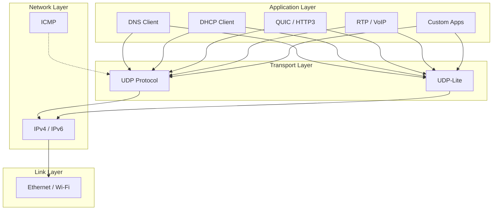
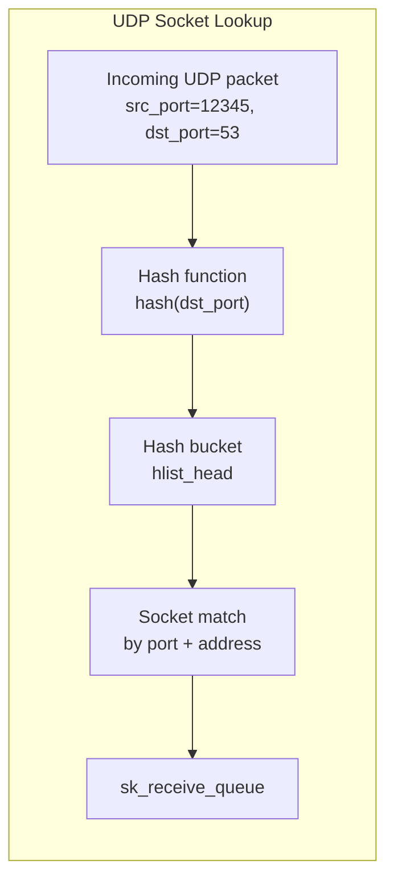
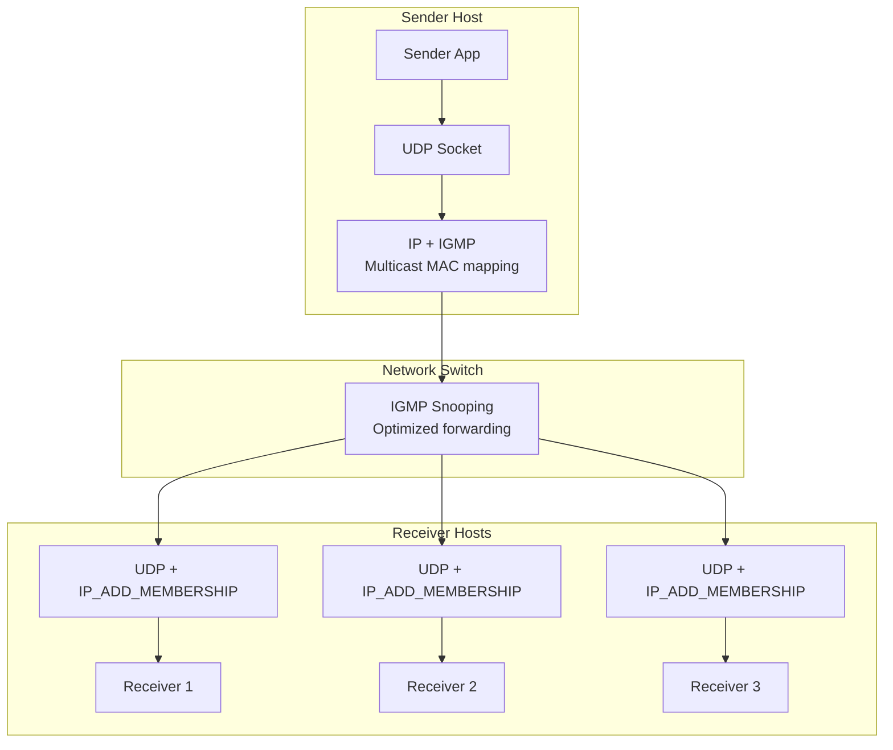

# Chapter 142: UDP — User Datagram Protocol

## Introduction

The User Datagram Protocol (UDP) is one of the core members of the Internet protocol suite. Defined in RFC 768 (1980), UDP provides a minimal, connectionless transport service that sends datagrams between hosts without establishing a connection, guaranteeing delivery, or ensuring ordering. While TCP gets the lion's share of attention for its reliability features, UDP is equally important—and for many use cases, far more appropriate. DNS queries, video streaming, online gaming, VoIP, IoT telemetry, and many modern protocols (QUIC, WireGuard, VXLAN) are built on UDP.

Understanding UDP means understanding when *not* to pay the cost of reliability. TCP's guarantees come with latency overhead: three-way handshake, congestion control, head-of-line blocking, and retransmission timers. UDP strips all of that away, giving applications raw, fast datagram delivery. The trade-off is that applications must handle their own reliability, ordering, and congestion control—if they need those features at all.

## Intuition: The Postal Analogy

If TCP is registered mail with delivery confirmation, UDP is dropping a postcard in a mailbox. You write the address, drop it in, and walk away. It might arrive, it might not, it might arrive out of order. But it's fast—no waiting in line at the post office, no signing for delivery, no tracking number overhead.

For some communications, this is perfect:
- A weather sensor reporting temperature every second: missing one reading is fine
- A video stream: displaying a fresh frame is better than waiting for a retransmitted old one
- A DNS query: one request, one response, minimal overhead
- A game server: the latest position matters; old positions don't

## Protocol Structure

### UDP Header

The UDP header is remarkably simple—just 8 bytes:

```
 0                   1                   2                   3
 0 1 2 3 4 5 6 7 8 9 0 1 2 3 4 5 6 7 8 9 0 1 2 3 4 5 6 7 8 9 0 1
├─┼─┼─┼─┼─┼─┼─┼─┼─┼─┼─┼─┼─┼─┼─┼─┼─┼─┼─┼─┼─┼─┼─┼─┼─┼─┼─┼─┼─┼─┼─┼─┤
│          Source Port          │       Destination Port        │
├─┼─┼─┼─┼─┼─┼─┼─┼─┼─┼─┼─┼─┼─┼─┼─┼─┼─┼─┼─┼─┼─┼─┼─┼─┼─┼─┼─┼─┼─┼─┼─┤
│            Length             │           Checksum            │
├─┼─┼─┼─┼─┼─┼─┼─┼─┼─┼─┼─┼─┼─┼─┼─┼─┼─┼─┼─┼─┼─┼─┼─┼─┼─┼─┼─┼─┼─┼─┼─┤
│                         Data ...                              │
└─┴─┴─┴─┴─┴─┴─┴─┴─┴─┴─┴─┴─┴─┴─┴─┴─┴─┴─┴─┴─┴─┴─┴─┴─┴─┴─┴─┴─┴─┴─┴─┘
```

| Field | Size | Description |
|-------|------|-------------|
| Source Port | 16 bits | Sender's port (optional, 0 if unused) |
| Destination Port | 16 bits | Receiver's port |
| Length | 16 bits | Total datagram length (header + data), minimum 8 |
| Checksum | 16 bits | Checksum of pseudo-header + header + data (optional in IPv4, mandatory in IPv6) |

### Header Comparison: UDP vs TCP

```
UDP Header: 8 bytes          TCP Header: 20-60 bytes
┌──────────────┐             ┌──────────────────────┐
│ Source Port  │             │ Source Port           │
│ Dest Port    │             │ Dest Port             │
│ Length       │             │ Sequence Number       │
│ Checksum     │             │ Ack Number            │
└──────────────┘             │ Data Offset/Flags     │
                             │ Window Size           │
                             │ Checksum              │
                             │ Urgent Pointer        │
                             │ Options (variable)    │
                             └──────────────────────┘
```

## Architecture

### UDP in the Protocol Stack



### Socket API for UDP

UDP uses `SOCK_DGRAM` sockets. Key differences from TCP:

| Feature | TCP | UDP |
|---------|-----|-----|
| Connection | `connect()` + `accept()` | Optional `connect()` |
| Sending | `write()` / `send()` | `sendto()` / `sendmsg()` |
| Receiving | `read()` / `recv()` | `recvfrom()` / `recvmsg()` |
| Message boundaries | Byte stream (none) | Preserved |
| Reliability | Guaranteed | None |
| Ordering | Guaranteed | Not guaranteed |

### Basic UDP Client-Server

**Server:**
```c
#include <stdio.h>
#include <stdlib.h>
#include <string.h>
#include <unistd.h>
#include <arpa/inet.h>
#include <sys/socket.h>

#define PORT 5353
#define BUF_SIZE 4096

int main(void)
{
    int sockfd;
    struct sockaddr_in servaddr, cliaddr;
    char buf[BUF_SIZE];
    socklen_t cliaddr_len;

    /* Create UDP socket */
    sockfd = socket(AF_INET, SOCK_DGRAM, 0);
    if (sockfd < 0) {
        perror("socket");
        exit(EXIT_FAILURE);
    }

    /* Allow address reuse */
    int optval = 1;
    setsockopt(sockfd, SOL_SOCKET, SO_REUSEADDR, &optval, sizeof(optval));

    /* Bind to address */
    memset(&servaddr, 0, sizeof(servaddr));
    servaddr.sin_family = AF_INET;
    servaddr.sin_addr.s_addr = htonl(INADDR_ANY);
    servaddr.sin_port = htons(PORT);

    if (bind(sockfd, (struct sockaddr *)&servaddr, sizeof(servaddr)) < 0) {
        perror("bind");
        close(sockfd);
        exit(EXIT_FAILURE);
    }

    printf("UDP server listening on port %d\n", PORT);

    /* Receive and echo loop */
    while (1) {
        cliaddr_len = sizeof(cliaddr);
        ssize_t n = recvfrom(sockfd, buf, BUF_SIZE, 0,
                             (struct sockaddr *)&cliaddr, &cliaddr_len);
        if (n < 0) {
            perror("recvfrom");
            continue;
        }

        buf[n] = '\0';
        printf("Received %zd bytes from %s:%d: %s\n",
               n, inet_ntoa(cliaddr.sin_addr), ntohs(cliaddr.sin_port), buf);

        /* Echo back */
        if (sendto(sockfd, buf, n, 0,
                   (struct sockaddr *)&cliaddr, cliaddr_len) < 0) {
            perror("sendto");
        }
    }

    close(sockfd);
    return 0;
}
```

**Client:**
```c
#include <stdio.h>
#include <stdlib.h>
#include <string.h>
#include <unistd.h>
#include <arpa/inet.h>
#include <sys/socket.h>

#define PORT 5353
#define BUF_SIZE 4096

int main(int argc, char *argv[])
{
    int sockfd;
    struct sockaddr_in servaddr;
    char buf[BUF_SIZE];
    const char *message = "Hello, UDP server!";

    if (argc > 1)
        message = argv[1];

    /* Create UDP socket */
    sockfd = socket(AF_INET, SOCK_DGRAM, 0);
    if (sockfd < 0) {
        perror("socket");
        exit(EXIT_FAILURE);
    }

    /* Server address */
    memset(&servaddr, 0, sizeof(servaddr));
    servaddr.sin_family = AF_INET;
    servaddr.sin_port = htons(PORT);
    inet_pton(AF_INET, "127.0.0.1", &servaddr.sin_addr);

    /* Send message */
    ssize_t sent = sendto(sockfd, message, strlen(message), 0,
                          (struct sockaddr *)&servaddr, sizeof(servaddr));
    if (sent < 0) {
        perror("sendto");
        close(sockfd);
        exit(EXIT_FAILURE);
    }
    printf("Sent %zd bytes\n", sent);

    /* Receive response */
    socklen_t len = sizeof(servaddr);
    ssize_t n = recvfrom(sockfd, buf, BUF_SIZE, 0,
                         (struct sockaddr *)&servaddr, &len);
    if (n < 0) {
        perror("recvfrom");
        close(sockfd);
        exit(EXIT_FAILURE);
    }

    buf[n] = '\0';
    printf("Received: %s\n", buf);

    close(sockfd);
    return 0;
}
```

## Kernel Implementation

### UDP Socket Structure

```c
/* include/net/udp.h (simplified) */
struct udp_sock {
    /* inet_sock must be first for casting */
    struct inet_sock    inet;

    /* UDP-specific fields */
    __u16               len;          /* Total datagram length */
    __u16               pending;      /* Pending frame count */

    /* Multicast */
    __u8                pcslen;
    __u8                pcrlen;
    __u8                unused[4];

    /* UDP-Lite */
    __u8                pcflag;       /* Partial checksum flag */
    __u8                unused2;

    /* Encapsulation (for UDP tunnels) */
    int (*encap_rcv)(struct sock *sk, struct sk_buff *skb);
    int (*encap_err_lookup)(struct sock *sk, struct sk_buff *skb,
                           struct inet_sock *inet);
    void (*encap_destroy)(struct sock *sk);
    bool encap_enabled;

    /* GRO (Generic Receive Offload) */
    bool gro_enabled;

    /* Statistics */
    atomic_t udp_drops;
};
```

### UDP Send Path

```c
/* net/ipv4/udp.c - Simplified send path */

int udp_sendmsg(struct sock *sk, struct msghdr *msg, size_t len)
{
    struct udp_sock *up = udp_sk(sk);
    struct inet_sock *inet = inet_sk(sk);
    struct flowi4 fl4;
    struct rtable *rt;
    struct sk_buff *skb;
    __be16 dport, sport;
    int err;

    /* Extract destination from message or connected socket */
    if (msg->msg_name) {
        struct sockaddr_in *usin = msg->msg_name;
        dport = usin->sin_port;
        fl4.daddr = usin->sin_addr.s_addr;
    } else {
        /* Use connected socket address */
        dport = inet->inet_dport;
        fl4.daddr = inet->inet_daddr;
    }

    sport = inet->inet_sport;

    /* Build flow for route lookup */
    fl4.flowi4_proto = IPPROTO_UDP;
    fl4.fl4_sport = sport;
    fl4.fl4_dport = dport;

    /* Route lookup */
    rt = ip_route_output_flow(sock_net(sk), &fl4, sk);
    if (IS_ERR(rt))
        return PTR_ERR(rt);

    /* Allocate socket buffer */
    skb = sock_alloc_send_skb(sk, len + sizeof(struct udphdr) +
                              sizeof(struct iphdr),
                              msg->msg_flags & MSG_DONTWAIT, &err);
    if (!skb)
        goto out;

    /* Reserve space for headers */
    skb_reserve(skb, sizeof(struct iphdr));
    skb_push(skb, sizeof(struct udphdr));
    skb_reset_transport_header(skb);

    /* Build UDP header */
    uh = udp_hdr(skb);
    uh->source = sport;
    uh->dest = dport;
    uh->len = htons(len + sizeof(struct udphdr));
    uh->check = 0;  /* Computed later */

    /* Copy data from user space */
    err = memcpy_from_msg(skb_put(skb, len), msg, len);
    if (err)
        goto out_free;

    /* Compute UDP checksum */
    udp_set_csum(false, skb, fl4.saddr, fl4.daddr, len);

    /* Send via IP */
    err = udp_send_skb(skb, &fl4, &inet->cork);

out:
    ip_rt_put(rt);
    return err;
}
```

### UDP Receive Path

```c
/* net/ipv4/udp.c - Simplified receive path */

int udp_rcv(struct sk_buff *skb)
{
    return __udp4_lib_rcv(skb, &udp_table, IPPROTO_UDP);
}

int __udp4_lib_rcv(struct sk_buff *skb, struct udp_table *udptable,
                   int proto)
{
    struct udphdr *uh;
    struct sock *sk;
    int len;

    /* Validate minimum length */
    if (!pskb_may_pull(skb, sizeof(struct udphdr)))
        goto drop;

    uh = udp_hdr(skb);
    len = ntohs(uh->len);

    /* Validate length */
    if (len > skb->len)
        goto drop;

    /* Trim to actual UDP length */
    if (len < skb->len)
        pskb_trim(skb, len);

    /* Verify UDP checksum */
    if (udp_lib_checksum_complete(skb))
        goto csum_error;

    /* Look up destination socket */
    sk = __udp4_lib_lookup_skb(skb, uh->source, uh->dest, udptable);
    if (sk) {
        /* Found matching socket */
        int ret = udp_queue_rcv_skb(sk, skb);
        if (ret > 0)
            /* Protocol handler consumed it */
            return -ret;
        return 0;
    }

    /* No matching socket */
    /* Send ICMP port unreachable */
    if (!xfrm4_policy_check(NULL, XFRM_POLICY_IN, skb))
        goto drop;
    icmp_send(skb, ICMP_DEST_UNREACH, ICMP_PORT_UNREACH, 0);
    kfree_skb(skb);
    return 0;

drop:
    kfree_skb(skb);
    return 0;
}
```

### Data Structures: Socket Lookup

```c
/* UDP socket hash table for fast port-based lookup */

struct udp_hslot {
    struct hlist_head   head;
    spinlock_t          lock;
};

struct udp_table {
    struct udp_hslot    *hash;        /* Hash table by port */
    struct udp_hslot    *hash2;       /* Secondary hash (for SO_REUSEPORT) */
    unsigned int        mask;         /* Hash mask */
    unsigned int        log;          /* Log2 of table size */
};
```



## UDP-Lite (Lightweight UDP)

UDP-Lite (RFC 3828) extends UDP to support partial checksums. This is useful for multimedia codecs where some bit errors are tolerable and don't warrant discarding the entire packet.

### UDP-Lite Header

Identical to UDP, but the Length field is repurposed as a Checksum Coverage field when set to a value less than 8.

```
 0                   1                   2                   3
 0 1 2 3 4 5 6 7 8 9 0 1 2 3 4 5 6 7 8 9 0 1 2 3 4 5 6 7 8 9 0 1
├─┼─┼─┼─┼─┼─┼─┼─┼─┼─┼─┼─┼─┼─┼─┼─┼─┼─┼─┼─┼─┼─┼─┼─┼─┼─┼─┼─┼─┼─┼─┼─┤
│          Source Port          │       Destination Port        │
├─┼─┼─┼─┼─┼─┼─┼─┼─┼─┼─┼─┼─┼─┼─┼─┼─┼─┼─┼─┼─┼─┼─┼─┼─┼─┼─┼─┼─┼─┼─┼─┤
│       Checksum Coverage      │           Checksum            │
├─┼─┼─┼─┼─┼─┼─┼─┼─┼─┼─┼─┼─┼─┼─┼─┼─┼─┼─┼─┼─┼─┼─┼─┼─┼─┼─┼─┼─┼─┼─┼─┤
│                         Data ...                              │
└─┴─┴─┴─┴─┴─┴─┴─┴─┴─┴─┴─┴─┴─┴─┴─┴─┴─┴─┴─┴─┴─┴─┴─┴─┴─┴─┴─┴─┴─┴─┴─┘
```

- **Checksum Coverage = 0**: Entire datagram is covered (like UDP)
- **Checksum Coverage = 7**: Invalid (header only = no checksum)
- **Checksum Coverage ≥ 8**: Number of octets covered by checksum (from UDP header start)

### UDP-Lite Programming

```c
/* Creating a UDP-Lite socket */
int sockfd = socket(AF_INET, SOCK_DGRAM, IPPROTO_UDPLITE);

/* Set checksum coverage: cover at least 8 bytes (header) */
int coverage = 8;
setsockopt(sockfd, IPPROTO_UDPLITE, UDPLITE_SEND_CSCOV,
           &coverage, sizeof(coverage));

/* Receive: accept datagrams with coverage >= 12 bytes */
int rcv_coverage = 12;
setsockopt(sockfd, IPPROTO_UDPLITE, UDPLITE_RECV_CSCOV,
           &rcv_coverage, sizeof(rcv_coverage));
```

## Multicast

UDP is the primary transport for IP multicast, where a single sender can reach multiple receivers.

### Multicast Address Ranges

| Range | Description |
|-------|-------------|
| 224.0.0.0 - 224.0.0.255 | Local network control (IGMP, OSPF) |
| 224.0.1.0 - 238.255.255.255 | Internetwork control and application |
| 239.0.0.0 - 239.255.255.255 | Administratively scoped (private) |

### Multicast Sender

```c
#include <stdio.h>
#include <stdlib.h>
#include <string.h>
#include <unistd.h>
#include <arpa/inet.h>
#include <sys/socket.h>

#define MCAST_GROUP "239.1.1.1"
#define MCAST_PORT  12345

int main(void)
{
    int sockfd;
    struct sockaddr_in mcast_addr;
    const char *message = "Hello, multicast group!";
    int ttl = 1;  /* Restrict to local network */

    sockfd = socket(AF_INET, SOCK_DGRAM, 0);
    if (sockfd < 0) {
        perror("socket");
        exit(EXIT_FAILURE);
    }

    /* Set TTL for multicast */
    setsockopt(sockfd, IPPROTO_IP, IP_MULTICAST_TTL, &ttl, sizeof(ttl));

    /* Disable loopback (don't receive our own packets) */
    int loop = 0;
    setsockopt(sockfd, IPPROTO_IP, IP_MULTICAST_LOOP, &loop, sizeof(loop));

    /* Set outgoing interface (optional) */
    struct in_addr ifaddr;
    inet_pton(AF_INET, "0.0.0.0", &ifaddr);
    setsockopt(sockfd, IPPROTO_IP, IP_MULTICAST_IF, &ifaddr, sizeof(ifaddr));

    /* Destination address */
    memset(&mcast_addr, 0, sizeof(mcast_addr));
    mcast_addr.sin_family = AF_INET;
    mcast_addr.sin_port = htons(MCAST_PORT);
    inet_pton(AF_INET, MCAST_GROUP, &mcast_addr.sin_addr);

    /* Send messages */
    for (int i = 0; i < 10; i++) {
        char buf[256];
        int len = snprintf(buf, sizeof(buf), "%s [%d]", message, i);

        ssize_t sent = sendto(sockfd, buf, len, 0,
                              (struct sockaddr *)&mcast_addr,
                              sizeof(mcast_addr));
        if (sent < 0)
            perror("sendto");
        else
            printf("Sent %zd bytes to %s:%d\n",
                   sent, MCAST_GROUP, MCAST_PORT);

        sleep(1);
    }

    close(sockfd);
    return 0;
}
```

### Multicast Receiver

```c
#include <stdio.h>
#include <stdlib.h>
#include <string.h>
#include <unistd.h>
#include <arpa/inet.h>
#include <sys/socket.h>
#include <net/if.h>

#define MCAST_GROUP "239.1.1.1"
#define MCAST_PORT  12345

int main(void)
{
    int sockfd;
    struct sockaddr_in servaddr;
    struct ip_mreq mreq;
    char buf[4096];

    /* Create socket */
    sockfd = socket(AF_INET, SOCK_DGRAM, 0);
    if (sockfd < 0) {
        perror("socket");
        exit(EXIT_FAILURE);
    }

    /* Allow address reuse */
    int optval = 1;
    setsockopt(sockfd, SOL_SOCKET, SO_REUSEADDR, &optval, sizeof(optval));

    /* Bind to multicast port */
    memset(&servaddr, 0, sizeof(servaddr));
    servaddr.sin_family = AF_INET;
    servaddr.sin_addr.s_addr = htonl(INADDR_ANY);
    servaddr.sin_port = htons(MCAST_PORT);

    if (bind(sockfd, (struct sockaddr *)&servaddr, sizeof(servaddr)) < 0) {
        perror("bind");
        close(sockfd);
        exit(EXIT_FAILURE);
    }

    /* Join multicast group */
    inet_pton(AF_INET, MCAST_GROUP, &mreq.imr_multiaddr);
    mreq.imr_interface.s_addr = htonl(INADDR_ANY);
    if (setsockopt(sockfd, IPPROTO_IP, IP_ADD_MEMBERSHIP,
                   &mreq, sizeof(mreq)) < 0) {
        perror("setsockopt IP_ADD_MEMBERSHIP");
        close(sockfd);
        exit(EXIT_FAILURE);
    }

    printf("Listening for multicast on %s:%d\n", MCAST_GROUP, MCAST_PORT);

    /* Receive loop */
    while (1) {
        struct sockaddr_in src_addr;
        socklen_t src_len = sizeof(src_addr);

        ssize_t n = recvfrom(sockfd, buf, sizeof(buf) - 1, 0,
                             (struct sockaddr *)&src_addr, &src_len);
        if (n < 0) {
            perror("recvfrom");
            continue;
        }

        buf[n] = '\0';
        printf("Received from %s:%d: %s\n",
               inet_ntoa(src_addr.sin_addr), ntohs(src_addr.sin_port), buf);
    }

    /* Leave multicast group (unreachable in this example) */
    setsockopt(sockfd, IPPROTO_IP, IP_DROP_MEMBERSHIP, &mreq, sizeof(mreq));
    close(sockfd);
    return 0;
}
```

### Multicast Architecture



## UDP Encapsulation and Tunnels

Modern protocols use UDP as a tunneling substrate, taking advantage of its simplicity and NAT traversal properties.

### Common UDP Tunnels

| Protocol | Port | Use Case |
|----------|------|----------|
| VXLAN | 4789 | Layer 2 over Layer 3 (data center) |
| Geneve | 6081 | Generic network virtualization |
| WireGuard | 51820 | VPN tunnel |
| QUIC | 443 | HTTP/3 transport |
| GTP | 2152 | Mobile network tunneling |
| DTLS | varies | TLS over UDP |

### UDP Encapsulation Receive Hook

```c
/* UDP tunnel encapsulation in the kernel */

/* In udp_rcv(), check for encapsulation */
if (udp_lib_checksum_complete(skb))
    goto csum_error;

/* Check if socket has encap handler */
if (up->encap_type) {
    /* Call the encap handler (e.g., VXLAN, Geneve, WireGuard) */
    int ret;
    if (up->encap_rcv)
        ret = up->encap_rcv(sk, skb);
    if (ret <= 0)
        return -ret;
    /* Fall through to normal UDP processing */
}
```

## Performance Optimization

### Send and Receive Buffer Sizing

```bash
# Default UDP buffer sizes
sysctl net.core.rmem_default    # Default receive buffer
sysctl net.core.wmem_default    # Default send buffer
sysctl net.core.rmem_max        # Maximum receive buffer
sysctl net.core.wmem_max        # Maximum send buffer

# For high-throughput UDP (e.g., video streaming)
sysctl -w net.core.rmem_max=26214400
sysctl -w net.core.wmem_max=26214400
sysctl -w net.core.rmem_default=1048576
sysctl -w net.core.wmem_default=1048576
```

### SO_REUSEPORT for Multi-threaded UDP

```c
/* SO_REUSEPORT allows multiple sockets on the same port */
/* Kernel distributes incoming packets across sockets */

int optval = 1;
setsockopt(sockfd, SOL_SOCKET, SO_REUSEPORT,
           &optval, sizeof(optval));

/* With SO_REUSEPORT, create multiple sockets on the same port */
/* Each in its own thread - kernel load-balances packets */
```

### GRO (Generic Receive Offload) for UDP

```c
/* Enable UDP GRO for large datagrams */
int gro = 1;
setsockopt(sockfd, IPPROTO_UDP, UDP_GRO, &gro, sizeof(gro));
```

```bash
# Check GRO support
ethtool -k eth0 | grep gro

# Enable GRO on the interface
ethtool -K eth0 gro on
```

### Performance Comparison

```bash
# Benchmark UDP throughput
# Using iperf3 in UDP mode
iperf3 -s -u                          # Server
iperf3 -c 192.168.1.1 -u -b 1G       # Client, 1 Gbps target

# Using nuttcp
nuttcp -S                             # Server
nuttcp -u -Ri 1000m 192.168.1.1      # Client
```

## Security Considerations

### UDP Amplification Attacks

UDP is commonly used in DDoS amplification attacks because:
1. No connection state: source address can be spoofed
2. Some protocols generate larger responses than requests

| Protocol | Amplification Factor | Port |
|----------|---------------------|------|
| NTP (monlist) | 556x | 123 |
| DNS | 28-54x | 53 |
| SSDP | 30x | 1900 |
| Memcached | 10,000-51,000x | 11211 |
| CLDAP | 56-70x | 636 |

### Defense Measures

```bash
# Rate limit UDP traffic with iptables
iptables -A INPUT -p udp --dport 53 -m limit --limit 100/s \
    --limit-burst 200 -j ACCEPT
iptables -A INPUT -p udp --dport 53 -j DROP

# Disable IP source routing
echo 0 > /proc/sys/net/ipv4/conf/all/accept_source_route

# Enable reverse path filtering
echo 1 > /proc/sys/net/ipv4/conf/all/rp_filter
```

### UDP-Lite Security

```bash
# Block UDP-Lite if not needed
ip6tables -A INPUT -p udplite -j DROP
iptables -A INPUT -p udplite -j DROP
```

## Common Pitfalls

1. **Assuming delivery**: UDP datagrams can be lost, duplicated, or reordered
2. **No flow control**: A fast sender can overwhelm a slow receiver, causing drops
3. **ICMP "Port Unreachable"**: When no socket is bound, the kernel sends ICMP back to the sender
4. **Connected vs unconnected**: `connect()` on a UDP socket sets a default destination but doesn't create a "connection"
5. **Zero-length datagrams**: Valid in UDP (sends a header-only packet); some firewalls drop them
6. **Broadcast storms**: Sending to 255.255.255.255 can generate excessive traffic
7. **Fragmentation**: UDP datagrams larger than the path MTU get fragmented by IP, which can cause performance issues and is blocked by many middleboxes

## Best Practices

1. **Use `sendmmsg()`/`recvmmsg()`**: Batch system calls for higher throughput
2. **Handle `ECONNREFUSED`**: `connect()`-ed UDP sockets receive ICMP errors
3. **Set appropriate timeouts**: Applications should implement their own timeout/retry logic
4. **Consider UDP-Lite**: For multimedia where partial errors are acceptable
5. **Use `SO_REUSEPORT`**: For multi-threaded servers with per-thread sockets
6. **Validate checksums**: Always verify UDP checksums, especially on IPv6
7. **Implement congestion control**: For high-throughput applications, implement application-level congestion control (as QUIC does)

## Exercises

1. **UDP echo server with timeout**: Implement a UDP echo server that uses `select()` with a timeout to handle multiple clients and detect idle periods.

2. **Multicast chat application**: Build a multicast-based chat application where participants join a multicast group and can send/receive messages.

3. **Reliable UDP**: Implement a simple reliable transport over UDP with sequence numbers, acknowledgments, and retransmission timers. Compare performance with TCP.

4. **UDP-Lite experiment**: Set up a UDP-Lite sender and receiver. Demonstrate how partial checksums allow corrupted payloads to be delivered.

5. **Packet loss measurement**: Write a UDP client/server pair that measures packet loss rate under different conditions (different buffer sizes, network loads).

6. **Encapsulation trace**: Capture VXLAN or WireGuard traffic with `tcpdump` and analyze the nested headers (outer UDP + inner Ethernet/IP).

## References

1. RFC 768: User Datagram Protocol
2. RFC 3828: The Lightweight User Datagram Protocol (UDP-Lite)
3. RFC 1112: Host Extensions for IP Multicasting
4. RFC 5765: UDP Encapsulations for NAT Traversal
5. RFC 9000: QUIC: A UDP-Based Multiplexed and Secure Transport
6. Linux kernel source: `net/ipv4/udp.c`
7. Linux man pages: `udp(7)`, `udplite(7)`, `ip(7)`
8. Stevens, W. R. *UNIX Network Programming, Volume 1*, Chapter 2: "The UDP Echo Client/Server"
9. Linux kernel documentation: `Documentation/networking/`
