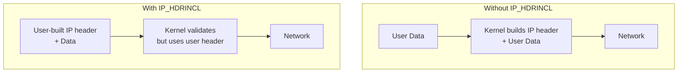
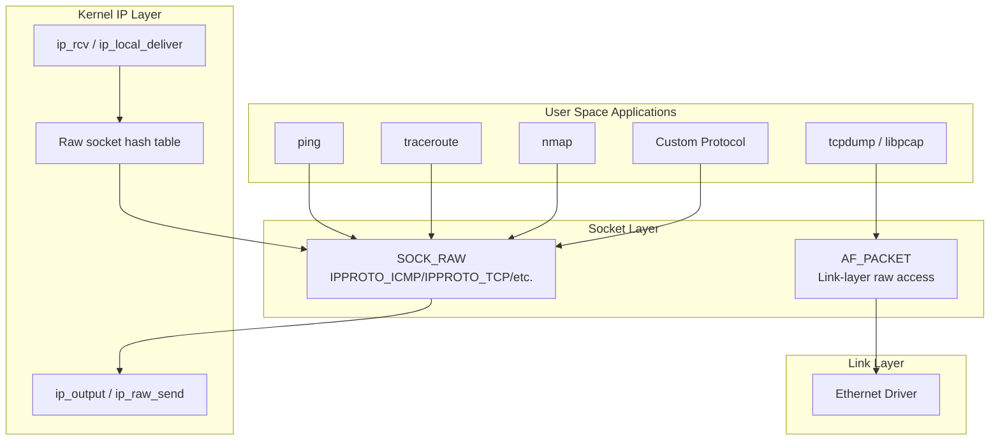
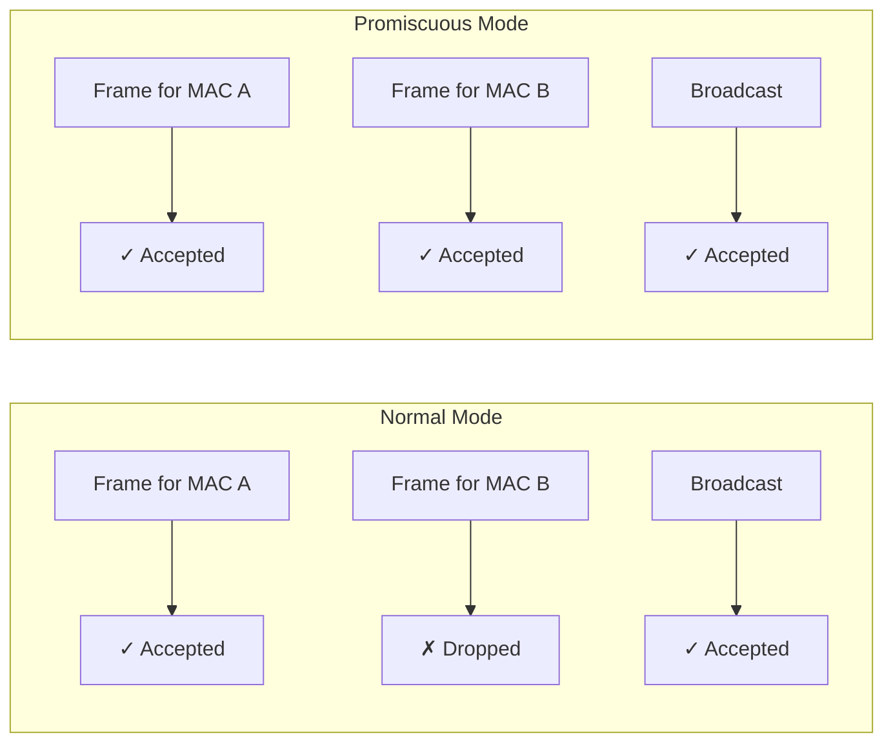

# Chapter 143: Raw Sockets

## Introduction

Raw sockets provide direct access to the network layer, bypassing the transport-layer processing that the kernel normally performs. With raw sockets, applications can send and receive IP packets with custom protocol headers, craft specialized packets for diagnostic tools, implement custom transport protocols in user space, and perform network monitoring and security analysis. Tools like `ping`, `traceroute`, `nmap`, `tcpdump`, and packet analyzers all rely on raw sockets.

Raw sockets exist at the boundary between user space and the kernel's network stack, offering power that comes with significant responsibility. They can be used for legitimate network administration and research, but they can also be used for network attacks—packet spoofing, port scanning, and denial-of-service. This dual nature means Linux restricts raw socket creation to processes with `CAP_NET_RAW` capability.

## Intuition: Why Raw Sockets?

Normal sockets (`SOCK_STREAM`, `SOCK_DGRAM`) provide a clean abstraction: send data, receive data. The kernel handles all the protocol details—TCP sequence numbers, IP headers, checksums, fragmentation. But what if you need to:

- **Send a ping**: ICMP is not a transport protocol; you can't use TCP or UDP
- **Trace a route**: You need to send packets with specific TTL values
- **Implement a custom protocol**: You're designing a new transport protocol
- **Monitor traffic**: You need to see all packets on the wire, not just those addressed to you
- **Test firewall rules**: You need to send packets with specific flags and options

Raw sockets let you get under the hood. Instead of the kernel building the IP header for you, you build it yourself—or at least parts of it.

## Socket Types and Protocols

### Creating Raw Sockets

```c
#include <sys/socket.h>
#include <netinet/in.h>

/* Method 1: Raw socket with automatic IP header construction */
int sockfd = socket(AF_INET, SOCK_RAW, IPPROTO_ICMP);

/* Method 2: Raw socket where user provides the IP header */
int sockfd = socket(AF_INET, SOCK_RAW, IPPROTO_RAW);

/* Method 3: Packet socket for link-layer access */
int sockfd = socket(AF_PACKET, SOCK_RAW, htons(ETH_P_ALL));
```

### IP_HDRINCL Option

When `IP_HDRINCL` is set, the user provides the complete IP header:

```c
int one = 1;
setsockopt(sockfd, IPPROTO_IP, IP_HDRINCL, &one, sizeof(one));
```



### Protocol Constants

| Protocol | Constant | Number | Description |
|----------|----------|--------|-------------|
| ICMP | `IPPROTO_ICMP` | 1 | Internet Control Message Protocol |
| TCP | `IPPROTO_TCP` | 6 | Transmission Control Protocol |
| UDP | `IPPROTO_UDP` | 17 | User Datagram Protocol |
| ICMPv6 | `IPPROTO_ICMPV6` | 58 | ICMP for IPv6 |
| GRE | `IPPROTO_GRE` | 47 | Generic Routing Encapsulation |
| OSPF | `IPPROTO_OSPF` | 89 | Open Shortest Path First |
| All | `IPPROTO_RAW` | 255 | Raw IP (user provides IP header) |

## Architecture

### Raw Socket in the Protocol Stack



### Packet Delivery to Raw Sockets

When a packet arrives at the IP layer, raw sockets receive a copy of packets matching their protocol:

```c
/* net/ipv4/raw.c - Raw socket delivery */

int raw_rcv(struct sock *sk, struct sk_buff *skb)
{
    /* Strip the IP header */
    if (skb->protocol == htons(ETH_P_IP)) {
        __skb_pull(skb, ip_hdr(skb)->ihl * 4);
        skb->transport_header = (unsigned char *)ip_hdr(skb) -
                                 skb->head + ip_hdr(skb)->ihl * 4;
    }

    /* Deliver to socket receive queue */
    if (sock_queue_rcv_skb(sk, skb) < 0) {
        kfree_skb(skb);
        return NET_RX_DROP;
    }
    return NET_RX_SUCCESS;
}
```

**Key point**: Raw sockets receive *copies* of packets. The original packet continues through the normal protocol stack (e.g., TCP still processes it).

## Comprehensive Example: Ping Implementation

### Complete Ping Client

```c
/*
 * ping.c - A simplified ping implementation using raw sockets
 *
 * Demonstrates: SOCK_RAW, IPPROTO_ICMP, IP_HDRINCL,
 *               ICMP echo request/reply, checksum calculation
 */

#include <stdio.h>
#include <stdlib.h>
#include <string.h>
#include <unistd.h>
#include <errno.h>
#include <sys/socket.h>
#include <sys/time.h>
#include <netinet/in.h>
#include <netinet/ip.h>
#include <netinet/ip_icmp.h>
#include <arpa/inet.h>
#include <signal.h>

#define PACKET_SIZE     64
#define ICMP_DATA_LEN   (PACKET_SIZE - sizeof(struct icmphdr))
#define PING_TIMEOUT    5

static volatile int running = 1;
static int sent = 0, received = 0;

/* ICMP checksum calculation */
static unsigned short checksum(void *b, int len)
{
    unsigned short *buf = b;
    unsigned int sum = 0;

    for (sum = 0; len > 1; len -= 2)
        sum += *buf++;
    if (len == 1)
        sum += *(unsigned char *)buf;

    sum = (sum >> 16) + (sum & 0xFFFF);
    sum += (sum >> 16);
    return (unsigned short)(~sum);
}

/* Build ICMP echo request packet */
static void build_packet(char *packet, int seq)
{
    struct icmphdr *icmp = (struct icmphdr *)packet;

    memset(packet, 0, PACKET_SIZE);

    icmp->type = ICMP_ECHO;
    icmp->code = 0;
    icmp->un.echo.id = htons(getpid() & 0xFFFF);
    icmp->un.echo.sequence = htons(seq);

    /* Fill data with pattern */
    char *data = packet + sizeof(struct icmphdr);
    for (int i = 0; i < ICMP_DATA_LEN; i++)
        data[i] = 'A' + (i % 26);

    /* Compute checksum (must be zero before calculation) */
    icmp->checksum = 0;
    icmp->checksum = checksum(packet, PACKET_SIZE);
}

/* Send a ping */
static int send_ping(int sockfd, struct sockaddr_in *addr, int seq)
{
    char packet[PACKET_SIZE];
    build_packet(packet, seq);

    ssize_t sent_bytes = sendto(sockfd, packet, PACKET_SIZE, 0,
                                (struct sockaddr *)addr, sizeof(*addr));
    if (sent_bytes < 0) {
        perror("sendto");
        return -1;
    }

    sent++;
    return 0;
}

/* Receive a ping reply */
static int recv_ping(int sockfd)
{
    char buf[1024];
    struct sockaddr_in from;
    socklen_t fromlen = sizeof(from);

    ssize_t n = recvfrom(sockfd, buf, sizeof(buf), 0,
                         (struct sockaddr *)&from, &fromlen);
    if (n < 0) {
        if (errno == EAGAIN || errno == EWOULDBLOCK)
            return -1;
        perror("recvfrom");
        return -1;
    }

    /* Skip IP header */
    struct iphdr *ip = (struct iphdr *)buf;
    int ip_hdr_len = ip->ihl * 4;

    if (n < ip_hdr_len + (int)sizeof(struct icmphdr))
        return -1;

    struct icmphdr *icmp = (struct icmphdr *)(buf + ip_hdr_len);

    /* Verify it's an echo reply */
    if (icmp->type != ICMP_ECHOREPLY)
        return -1;

    /* Verify our ID */
    if (ntohs(icmp->un.echo.id) != (getpid() & 0xFFFF))
        return -1;

    received++;

    struct timeval now;
    gettimeofday(&now, NULL);

    /* Extract timestamp from data */
    struct timeval *tv = (struct timeval *)(buf + ip_hdr_len +
                         sizeof(struct icmphdr));
    long rtt_us = (now.tv_sec - tv->tv_sec) * 1000000 +
                  (now.tv_usec - tv->tv_usec);

    printf("%zd bytes from %s: icmp_seq=%d ttl=%d time=%.3f ms\n",
           n - ip_hdr_len,
           inet_ntoa(from.sin_addr),
           ntohs(icmp->un.echo.sequence),
           ip->ttl,
           rtt_us / 1000.0);

    return 0;
}

static void handle_signal(int sig)
{
    (void)sig;
    running = 0;
}

int main(int argc, char *argv[])
{
    if (argc < 2) {
        fprintf(stderr, "Usage: %s <destination> [count]\n", argv[0]);
        exit(EXIT_FAILURE);
    }

    const char *dest = argv[1];
    int count = (argc > 2) ? atoi(argv[2]) : 4;

    /* Create raw socket (requires CAP_NET_RAW or root) */
    int sockfd = socket(AF_INET, SOCK_RAW, IPPROTO_ICMP);
    if (sockfd < 0) {
        perror("socket (need CAP_NET_RAW or root)");
        exit(EXIT_FAILURE);
    }

    /* Set receive timeout */
    struct timeval tv = { .tv_sec = PING_TIMEOUT, .tv_usec = 0 };
    setsockopt(sockfd, SOL_SOCKET, SO_RCVTIMEO, &tv, sizeof(tv));

    /* Set TTL */
    int ttl = 64;
    setsockopt(sockfd, IPPROTO_IP, IP_TTL, &ttl, sizeof(ttl));

    /* Resolve destination */
    struct sockaddr_in addr;
    memset(&addr, 0, sizeof(addr));
    addr.sin_family = AF_INET;
    if (inet_pton(AF_INET, dest, &addr.sin_addr) != 1) {
        fprintf(stderr, "Invalid address: %s\n", dest);
        close(sockfd);
        exit(EXIT_FAILURE);
    }

    signal(SIGINT, handle_signal);

    printf("PING %s (%s) %d bytes of data.\n",
           dest, dest, PACKET_SIZE);

    for (int seq = 1; seq <= count && running; seq++) {
        send_ping(sockfd, &addr, seq);
        recv_ping(sockfd);
        if (seq < count)
            sleep(1);
    }

    /* Print statistics */
    printf("\n--- %s ping statistics ---\n", dest);
    printf("%d packets transmitted, %d received, %.1f%% packet loss\n",
           sent, received,
           sent ? (100.0 * (sent - received) / sent) : 0);

    close(sockfd);
    return 0;
}
```

## Traceroute Implementation

### Simple Traceroute

```c
/*
 * traceroute.c - Simplified traceroute using raw sockets
 *
 * Sends UDP packets with increasing TTL, listens for ICMP
 * Time Exceeded messages from intermediate routers.
 */

#include <stdio.h>
#include <stdlib.h>
#include <string.h>
#include <unistd.h>
#include <errno.h>
#include <sys/socket.h>
#include <sys/time.h>
#include <netinet/in.h>
#include <netinet/ip.h>
#include <netinet/ip_icmp.h>
#include <netinet/udp.h>
#include <arpa/inet.h>

#define MAX_HOPS        30
#define TIMEOUT_SEC     3
#define PROBES_PER_HOP  3
#define BASE_PORT       33434

static unsigned short checksum(void *b, int len)
{
    unsigned short *buf = b;
    unsigned int sum = 0;
    for (sum = 0; len > 1; len -= 2)
        sum += *buf++;
    if (len == 1)
        sum += *(unsigned char *)buf;
    sum = (sum >> 16) + (sum & 0xFFFF);
    sum += (sum >> 16);
    return (unsigned short)(~sum);
}

int main(int argc, char *argv[])
{
    if (argc < 2) {
        fprintf(stderr, "Usage: %s <destination>\n", argv[0]);
        exit(EXIT_FAILURE);
    }

    struct sockaddr_in dest;
    memset(&dest, 0, sizeof(dest));
    dest.sin_family = AF_INET;
    if (inet_pton(AF_INET, argv[1], &dest.sin_addr) != 1) {
        fprintf(stderr, "Invalid address: %s\n", argv[1]);
        exit(EXIT_FAILURE);
    }

    /* Sending socket: raw UDP */
    int send_fd = socket(AF_INET, SOCK_DGRAM, IPPROTO_UDP);
    if (send_fd < 0) {
        perror("socket (send)");
        exit(EXIT_FAILURE);
    }

    /* Receiving socket: raw ICMP */
    int recv_fd = socket(AF_INET, SOCK_RAW, IPPROTO_ICMP);
    if (recv_fd < 0) {
        perror("socket (recv) - need root/CAP_NET_RAW");
        close(send_fd);
        exit(EXIT_FAILURE);
    }

    struct timeval tv = { .tv_sec = TIMEOUT_SEC, .tv_usec = 0 };
    setsockopt(recv_fd, SOL_SOCKET, SO_RCVTIMEO, &tv, sizeof(tv));

    printf("traceroute to %s, %d hops max\n", argv[1], MAX_HOPS);

    for (int ttl = 1; ttl <= MAX_HOPS; ttl++) {
        printf("%2d ", ttl);
        int reached = 0;

        for (int probe = 0; probe < PROBES_PER_HOP; probe++) {
            int port = BASE_PORT + (ttl - 1) * PROBES_PER_HOP + probe;

            /* Set TTL */
            setsockopt(send_fd, IPPROTO_IP, IP_TTL, &ttl, sizeof(ttl));

            /* Send UDP probe */
            struct sockaddr_in target = dest;
            target.sin_port = htons(port);

            struct timeval t1;
            gettimeofday(&t1, NULL);

            if (sendto(send_fd, "", 1, 0,
                       (struct sockaddr *)&target, sizeof(target)) < 0) {
                perror("sendto");
                continue;
            }

            /* Receive ICMP response */
            char buf[1024];
            struct sockaddr_in from;
            socklen_t fromlen = sizeof(from);

            ssize_t n = recvfrom(recv_fd, buf, sizeof(buf), 0,
                                 (struct sockaddr *)&from, &fromlen);

            struct timeval t2;
            gettimeofday(&t2, NULL);
            double rtt = (t2.tv_sec - t1.tv_sec) * 1000.0 +
                         (t2.tv_usec - t1.tv_usec) / 1000.0;

            if (n < 0) {
                printf(" * ");
                continue;
            }

            struct iphdr *ip = (struct iphdr *)buf;
            struct icmphdr *icmp = (struct icmphdr *)(buf + ip->ihl * 4);

            /* Print the router address */
            char addr_str[INET_ADDRSTRLEN];
            inet_ntop(AF_INET, &ip->saddr, addr_str, sizeof(addr_str));

            if (probe == 0)
                printf("%s ", addr_str);

            printf(" %.3fms", rtt);

            /* Check if we reached the destination */
            if (icmp->type == ICMP_DEST_UNREACH &&
                icmp->code == ICMP_PORT_UNREACH)
                reached = 1;
        }

        printf("\n");

        if (reached) {
            printf("Reached destination\n");
            break;
        }
    }

    close(send_fd);
    close(recv_fd);
    return 0;
}
```

## Kernel Implementation Details

### Raw Socket Hash Table

The kernel maintains a hash table for raw sockets, keyed by protocol number:

```c
/* include/net/raw.h */
struct raw_hashinfo {
    rwlock_t            lock;
    struct hlist_head   ht[RAW_HTABLE_SIZE];
};

/* Hash function */
static inline int raw_hashfn(const struct net *net, __be16 protocol)
{
    return hash_32(net_hash_mix(net) ^ protocol, RAW_HTABLE_SIZE_LOG);
}
```

### Raw Socket Receive Path

```c
/* net/ipv4/raw.c - Delivering packets to raw sockets */

int raw_local_deliver(struct sk_buff *skb, int protocol)
{
    struct hlist_head *head;
    struct hlist_node *node;
    struct sock *sk;
    struct net *net;

    head = &raw_v4_hashinfo.ht[raw_hashfn(dev_net(skb->dev), protocol)];

    read_lock(&raw_v4_hashinfo.lock);
    sk_for_each(sk, node, head) {
        /* Check if socket matches this protocol */
        if (inet_sk(sk)->inet_num != protocol)
            continue;

        /* Check network namespace */
        if (!net_eq(sock_net(sk), dev_net(skb->dev)))
            continue;

        /* Check device binding */
        if (sk->sk_bound_dev_if &&
            sk->sk_bound_dev_if != skb->skb_iif)
            continue;

        /* Clone the skb and deliver */
        struct sk_buff *clone = skb_clone(skb, GFP_ATOMIC);
        if (clone)
            raw_rcv(sk, clone);
    }
    read_unlock(&raw_v4_hashinfo.lock);

    return 0;
}
```

### Raw Socket Send Path

```c
/* net/ipv4/raw.c - Sending from raw sockets */

static int raw_sendmsg(struct sock *sk, struct msghdr *msg, size_t len)
{
    struct inet_sock *inet = inet_sk(sk);
    struct ipcm_cookie ipc;
    struct rtable *rt;
    struct flowi4 fl4;
    struct sk_buff *skb;
    int err;

    /* With IP_HDRINCL, user provides the full IP header */
    if (inet->hdrincl) {
        err = raw_send_hdrincl(sk, &fl4, msg, len, &ipc, &rt);
        goto done;
    }

    /* Without IP_HDRINCL, kernel builds IP header */
    err = ip_route_output_flow(sock_net(sk), &fl4, sk);
    if (err)
        goto done;

    /* Allocate and build the packet */
    skb = sock_alloc_send_skb(sk, len + sizeof(struct iphdr) + 15,
                              msg->msg_flags & MSG_DONTWAIT, &err);
    if (!skb)
        goto done;

    skb_reserve(skb, sizeof(struct iphdr));
    /* Copy data from user space */
    err = memcpy_from_msg(skb_put(skb, len), msg, len);
    if (err)
        goto done_free;

    /* Build IP header and send */
    skb->ip_summed = CHECKSUM_NONE;
    err = ip_push_pending_frames(sk, &fl4);

done_free:
    if (err)
        kfree_skb(skb);
done:
    ip_rt_put(rt);
    return err;
}
```

## AF_PACKET: Link-Layer Raw Sockets

### Packet Socket Types

```c
/* AF_PACKET with SOCK_RAW: includes link-layer header */
int sockfd = socket(AF_PACKET, SOCK_RAW, htons(ETH_P_ALL));

/* AF_PACKET with SOCK_DGRAM: link-layer header stripped */
int sockfd = socket(AF_PACKET, SOCK_DGRAM, htons(ETH_P_IP));
```

### Capturing All Packets (Promiscuous Mode)

```c
#include <stdio.h>
#include <stdlib.h>
#include <string.h>
#include <unistd.h>
#include <sys/socket.h>
#include <sys/ioctl.h>
#include <net/if.h>
#include <net/ethernet.h>
#include <netinet/ip.h>
#include <netinet/tcp.h>
#include <linux/if_packet.h>
#include <arpa/inet.h>

/* Enable promiscuous mode on an interface */
static int set_promiscuous(int sockfd, const char *ifname, int enable)
{
    struct ifreq ifr;
    strncpy(ifr.ifr_name, ifname, IFNAMSIZ - 1);

    if (ioctl(sockfd, SIOCGIFFLAGS, &ifr) < 0) {
        perror("ioctl SIOCGIFFLAGS");
        return -1;
    }

    if (enable)
        ifr.ifr_flags |= IFF_PROMISC;
    else
        ifr.ifr_flags &= ~IFF_PROMISC;

    if (ioctl(sockfd, SIOCSIFFLAGS, &ifr) < 0) {
        perror("ioctl SIOCSIFFLAGS");
        return -1;
    }

    printf("%s promiscuous mode on %s\n",
           enable ? "Enabled" : "Disabled", ifname);
    return 0;
}

/* Bind packet socket to specific interface */
static int bind_interface(int sockfd, const char *ifname)
{
    struct ifreq ifr;
    strncpy(ifr.ifr_name, ifname, IFNAMSIZ - 1);

    if (ioctl(sockfd, SIOCGIFINDEX, &ifr) < 0) {
        perror("ioctl SIOCGIFINDEX");
        return -1;
    }

    struct sockaddr_ll sll;
    memset(&sll, 0, sizeof(sll));
    sll.sll_family = AF_PACKET;
    sll.sll_ifindex = ifr.ifr_ifindex;
    sll.sll_protocol = htons(ETH_P_ALL);

    if (bind(sockfd, (struct sockaddr *)&sll, sizeof(sll)) < 0) {
        perror("bind");
        return -1;
    }

    return 0;
}

/* Parse and print packet */
static void parse_packet(const unsigned char *buf, ssize_t len)
{
    if (len < (ssize_t)sizeof(struct ether_header))
        return;

    struct ether_header *eth = (struct ether_header *)buf;

    printf("ETH: src=%02x:%02x:%02x:%02x:%02x:%02x "
           "dst=%02x:%02x:%02x:%02x:%02x:%02x type=0x%04x\n",
           eth->ether_shost[0], eth->ether_shost[1],
           eth->ether_shost[2], eth->ether_shost[3],
           eth->ether_shost[4], eth->ether_shost[5],
           eth->ether_dhost[0], eth->ether_dhost[1],
           eth->ether_dhost[2], eth->ether_dhost[3],
           eth->ether_dhost[4], eth->ether_dhost[5],
           ntohs(eth->ether_type));

    /* Parse IP header if it's an IP packet */
    if (ntohs(eth->ether_type) == ETHERTYPE_IP) {
        struct iphdr *ip = (struct iphdr *)(buf + sizeof(struct ether_header));
        struct in_addr src, dst;
        src.s_addr = ip->saddr;
        dst.s_addr = ip->daddr;

        printf("  IP: src=%s dst=%s proto=%d ttl=%d len=%d\n",
               inet_ntoa(src), inet_ntoa(dst),
               ip->protocol, ip->ttl, ntohs(ip->tot_len));

        /* Parse TCP header */
        if (ip->protocol == IPPROTO_TCP) {
            struct tcphdr *tcp = (struct tcphdr *)(buf +
                sizeof(struct ether_header) + ip->ihl * 4);
            printf("    TCP: sport=%d dport=%d flags=%s%s%s%s%s%s\n",
                   ntohs(tcp->source), ntohs(tcp->dest),
                   tcp->syn ? "S" : "", tcp->ack ? "A" : "",
                   tcp->fin ? "F" : "", tcp->rst ? "R" : "",
                   tcp->psh ? "P" : "", tcp->urg ? "U" : "");
        }
    }
}

int main(int argc, char *argv[])
{
    const char *ifname = (argc > 1) ? argv[1] : "eth0";

    /* Create raw packet socket */
    int sockfd = socket(AF_PACKET, SOCK_RAW, htons(ETH_P_ALL));
    if (sockfd < 0) {
        perror("socket (need root)");
        exit(EXIT_FAILURE);
    }

    /* Bind to interface */
    if (bind_interface(sockfd, ifname) < 0) {
        close(sockfd);
        exit(EXIT_FAILURE);
    }

    /* Enable promiscuous mode */
    set_promiscuous(sockfd, ifname, 1);

    printf("Capturing on %s (Ctrl+C to stop)...\n\n", ifname);

    unsigned char buf[65535];
    while (1) {
        ssize_t n = recvfrom(sockfd, buf, sizeof(buf), 0, NULL, NULL);
        if (n < 0) {
            perror("recvfrom");
            continue;
        }
        parse_packet(buf, n);
        printf("---\n");
    }

    /* Cleanup (unreachable) */
    set_promiscuous(sockfd, ifname, 0);
    close(sockfd);
    return 0;
}
```

### Packet Fanout for Multi-threaded Capture

```c
/* Distribute captured packets across multiple threads */

int fanout_type = PACKET_FANOUT_HASH;  /* Hash by 5-tuple */
int fanout_group = 1234;  /* Fanout group ID */

setsockopt(sockfd, SOL_PACKET, PACKET_FANOUT,
           &(uint32_t){ (fanout_group | (fanout_type << 16)) },
           sizeof(uint32_t));

/* Multiple sockets with the same fanout group ID */
/* Kernel distributes packets across them */
```

## Promiscuous Mode

### What is Promiscuous Mode?

By default, a network interface only accepts frames addressed to its own MAC address (or broadcast/multicast). In promiscuous mode, the interface accepts *all* frames on the wire, regardless of destination address.



### Enabling Promiscuous Mode

```c
/* Method 1: Via ioctl */
struct ifreq ifr;
strncpy(ifr.ifr_name, "eth0", IFNAMSIZ);
ioctl(sockfd, SIOCGIFFLAGS, &ifr);
ifr.ifr_flags |= IFF_PROMISC;
ioctl(sockfd, SIOCSIFFLAGS, &ifr);

/* Method 2: Via packet socket with PACKET_ADD_MEMBERSHIP */
struct packet_mreq mreq;
memset(&mreq, 0, sizeof(mreq));
mreq.mr_ifindex = if_nametoindex("eth0");
mreq.mr_type = PACKET_MR_PROMISC;
setsockopt(sockfd, SOL_PACKET, PACKET_ADD_MEMBERSHIP,
           &mreq, sizeof(mreq));
```

```bash
# Command-line promiscuous mode
ip link set eth0 promisc on
ip link set eth0 promisc off

# Check status
ip link show eth0 | grep PROMISC
```

## Security and Capabilities

### Capability Requirements

| Operation | Required Capability |
|-----------|-------------------|
| `SOCK_RAW` (IPv4) | `CAP_NET_RAW` (or historically, root) |
| `SOCK_RAW` (IPv6) | `CAP_NET_RAW` |
| `AF_PACKET` | `CAP_NET_RAW` |
| `IP_HDRINCL` | `CAP_NET_RAW` |
| Promiscuous mode | `CAP_NET_RAW` |

### Security Hardening

```bash
# Restrict raw socket access
# Only users with CAP_NET_RAW can create raw sockets
# This is the default on modern Linux

# For containers, drop CAP_NET_RAW
# docker run --cap-drop=NET_RAW ...

# Limit raw socket creation with sysctl
# (kernel.suid_dumpable = 0 prevents core dumps of privileged programs)

# Monitor raw socket usage
# Check /proc/net/raw for active raw sockets
cat /proc/net/raw
```

### Potential for Abuse

Raw sockets can be used for:
- **Packet spoofing**: Setting arbitrary source addresses (bypassing ingress/egress filtering)
- **ARP spoofing**: Crafting fake ARP replies (link-layer raw sockets)
- **TCP RST injection**: Sending forged TCP reset packets
- **Port scanning**: Detecting open ports without completing TCP handshake

```c
/*
 * Example: Sending a packet with a spoofed source address
 * (Demonstrates why CAP_NET_RAW is required)
 */

int sockfd = socket(AF_INET, SOCK_RAW, IPPROTO_RAW);
int one = 1;
setsockopt(sockfd, IPPROTO_IP, IP_HDRINCL, &one, sizeof(one));

char packet[64];
struct iphdr *ip = (struct iphdr *)packet;

/* Build IP header with spoofed source */
ip->ihl = 5;
ip->version = 4;
ip->tot_len = htons(sizeof(packet));
ip->id = htons(12345);
ip->ttl = 64;
ip->protocol = IPPROTO_TCP;
ip->saddr = inet_addr("10.0.0.99");   /* Spoofed source! */
ip->daddr = inet_addr("192.168.1.1"); /* Real destination */

struct sockaddr_in dest;
dest.sin_family = AF_INET;
dest.sin_addr.s_addr = ip->daddr;

sendto(sockfd, packet, sizeof(packet), 0,
       (struct sockaddr *)&dest, sizeof(dest));
```

## Common Pitfalls

1. **Permission denied**: Raw sockets require `CAP_NET_RAW`; forgetting this is the most common error
2. **Port conflicts**: Raw sockets don't reserve ports; you can have a raw socket and a TCP socket on the same port
3. **Checksum offload**: Some NICs compute checksums in hardware; raw socket software checksums may conflict
4. **Missing `IP_HDRINCL`**: Without it, the kernel builds the IP header, which may not be what you want
5. **MTU issues**: Raw sockets can send packets larger than the MTU, causing silent fragmentation
6. **Kernel consumes the packet too**: Raw sockets receive copies; the kernel still processes the original
7. **IPv4 vs IPv6**: Different protocols (`IPPROTO_ICMP` vs `IPPROTO_ICMPV6`), different header structures

## Best Practices

1. **Drop privileges after socket creation**: Create the raw socket, then `setuid()` to a non-root user
2. **Use capabilities instead of root**: Set `CAP_NET_RAW` on the binary with `setcap`
3. **Validate all received data**: Raw sockets receive unvalidated network data
4. **Use `pcap` library when possible**: It handles platform differences and provides filtering
5. **Handle `EACCES` gracefully**: Fall back to non-raw sockets for unprivileged users
6. **Set socket timeouts**: Prevent indefinite blocking on `recvfrom()`
7. **Use `PACKET_FANOUT`**: For multi-threaded packet capture

## Exercises

1. **Build ping**: Compile and test the ping implementation above. Add support for IPv6 (ICMPv6 Echo Request/Reply).

2. **Packet sniffer**: Build a packet sniffer using `AF_PACKET` that captures and displays TCP, UDP, and ICMP packets with headers parsed.

3. **Traceroute enhancement**: Enhance the traceroute to show AS numbers (using WHOIS queries on each hop IP) and support both UDP and ICMP modes.

4. **ARP scanner**: Write a tool that sends ARP requests for a range of IP addresses and collects responses to discover hosts on the local network.

5. **TCP SYN scanner**: Implement a TCP SYN scanner that sends SYN packets and analyzes responses (SYN-ACK = open, RST = closed, no response = filtered).

6. **Performance test**: Compare the throughput of raw sockets vs regular TCP/UDP sockets for bulk data transfer. Why are regular sockets faster?

## References

1. Stevens, W. R. *UNIX Network Programming, Volume 1*, Chapter 28: "Raw Sockets"
2. RFC 792: Internet Control Message Protocol
3. Linux kernel source: `net/ipv4/raw.c`, `net/packet/af_packet.c`
4. Linux man pages: `raw(7)`, `packet(7)`, `icmp(7)`
5. Linux kernel documentation: `Documentation/networking/`
6. Stevens, W. R. *TCP/IP Illustrated, Volume 1*, Chapters 1-3
7. libpcap documentation: https://www.tcpdump.org/
