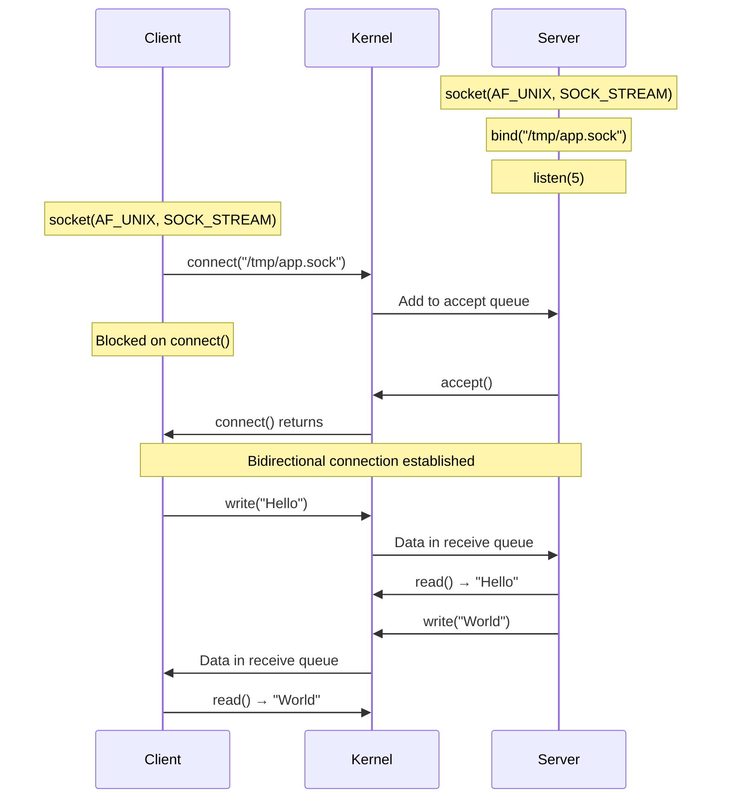

# Chapter 144: Unix Domain Sockets

## Introduction

Unix domain sockets (also called local sockets or UDS) are an inter-process communication (IPC) mechanism that allows processes on the same host to communicate using the socket API. Unlike TCP or UDP sockets that traverse the network stack, Unix domain sockets operate entirely within the kernel, copying data directly between processes without any network protocol overhead. They are the fastest IPC mechanism on Linux for most use cases, often achieving throughputs of several gigabytes per second with latencies measured in microseconds.

Unix domain sockets support all three major socket types: stream (`SOCK_STREAM`), datagram (`SOCK_DGRAM`), and sequenced packet (`SOCK_SEQPACKET`). They use filesystem pathnames as addresses (or abstract namespace addresses), provide automatic credential passing between processes, and support file descriptor passing—a capability unique to Unix domain sockets that enables powerful IPC patterns.

## Intuition: Why Not Just Use TCP?

When two processes on the same machine communicate over TCP (even via `localhost`), the data traverses the entire networking stack: socket buffer copies, TCP segmentation, IP routing, loopback device, then back up the receive path. Unix domain sockets skip all of this. Data is copied directly from the sender's buffer to the receiver's buffer by the kernel—no protocol headers, no checksums, no routing, no retransmission logic.

```
TCP localhost path:
  Process A → socket buf → TCP/IP → loopback → IP/TCP → socket buf → Process B

Unix domain socket path:
  Process A → kernel → Process B
```

This makes Unix domain sockets ideal for:
- Database clients connecting to local servers (PostgreSQL, MySQL, Redis)
- Container runtimes communicating with the Docker daemon
- D-Bus system message bus
- SystemD journal
- Desktop environment IPC (Wayland, X11)
- Any client-server pair on the same host

## Address Structure

### Pathname Addresses

```c
#include <sys/un.h>

struct sockaddr_un {
    sa_family_t sun_family;     /* AF_UNIX */
    char        sun_path[108];  /* Null-terminated pathname */
};
```

The address is a filesystem path (e.g., `/var/run/myapp.sock`). The kernel creates a socket inode in the filesystem.

### Abstract Namespace

Linux supports an abstract namespace where the address is an arbitrary byte string (not a filesystem path). The first byte of `sun_path` is a null byte (`\0`), and the remaining bytes form the abstract name.

```c
struct sockaddr_un addr;
addr.sun_family = AF_UNIX;

/* Abstract namespace: name is "myapp" */
addr.sun_path[0] = '\0';              /* Leading null byte */
strcpy(addr.sun_path + 1, "myapp");   /* Abstract name */

/* The address length includes the leading null + name */
socklen_t len = offsetof(struct sockaddr_un, sun_path) + 1 + strlen("myapp");
```

Abstract namespace advantages:
- No filesystem permissions to manage
- No leftover socket files to clean up
- Survives `chroot()` environments
- Names are automatically cleaned up when the socket closes

## Architecture

### Unix Domain Socket in the Kernel

```mermaid
graph TB
    subgraph "Process A"
        APP_A[Application A]
        SEND_A[send() / write()]
    end

    subgraph "Process B"
        APP_B[Application B]
        RECV_B[recv() / read()]
    end

    subgraph "Kernel"
        SOCK_A"struct sock (A)"]
        SOCK_B"struct sock (B)"]
        UNIX_PROTO["Unix Domain Protocol<br/>af_unix.c"]
        SK_BUFF["sk_buff<br/>Direct transfer"]
        CRED["Credentials<br/>(uid, gid, pid)"]
    end

    subgraph "Filesystem"
        INODE[Socket Inode<br/>sun_path]
    end

    APP_A --> SEND_A --> SOCK_A
    SOCK_A --> UNIX_PROTO
    UNIX_PROTO --> SK_BUFF
    SK_BUFF --> SOCK_B --> RECV_B --> APP_B
    UNIX_PROTO -.-> CRED
    UNIX_PROTO -.-> INODE
```

### Socket Types Comparison

| Feature | `SOCK_STREAM` | `SOCK_DGRAM` | `SOCK_SEQPACKET` |
|---------|---------------|--------------|-------------------|
| Connection | Yes (`connect`/`accept`) | No | Yes (`connect`/`accept`) |
| Ordering | Guaranteed | Not guaranteed | Guaranteed |
| Boundaries | Byte stream | Message boundaries | Message boundaries |
| Reliability | Guaranteed | Delivery errors possible | Guaranteed |
| Typical use | TCP-like | UDP-like | SCTP-like |

## Comprehensive Examples

### Stream Socket (Connection-Oriented)

**Server:**
```c
#include <stdio.h>
#include <stdlib.h>
#include <string.h>
#include <unistd.h>
#include <sys/socket.h>
#include <sys/un.h>
#include <sys/stat.h>
#include <errno.h>

#define SOCKET_PATH "/tmp/udstest.sock"
#define BUF_SIZE 4096

int main(void)
{
    int server_fd, client_fd;
    struct sockaddr_un addr;

    /* Create socket */
    server_fd = socket(AF_UNIX, SOCK_STREAM, 0);
    if (server_fd < 0) {
        perror("socket");
        exit(EXIT_FAILURE);
    }

    /* Remove old socket file if it exists */
    unlink(SOCKET_PATH);

    /* Bind to address */
    memset(&addr, 0, sizeof(addr));
    addr.sun_family = AF_UNIX;
    strncpy(addr.sun_path, SOCKET_PATH, sizeof(addr.sun_path) - 1);

    if (bind(server_fd, (struct sockaddr *)&addr, sizeof(addr)) < 0) {
        perror("bind");
        close(server_fd);
        exit(EXIT_FAILURE);
    }

    /* Set permissions (owner and group can read/write) */
    chmod(SOCKET_PATH, 0660);

    /* Listen for connections */
    if (listen(server_fd, 5) < 0) {
        perror("listen");
        close(server_fd);
        unlink(SOCKET_PATH);
        exit(EXIT_FAILURE);
    }

    printf("Unix domain socket server listening on %s\n", SOCKET_PATH);

    /* Accept and handle clients */
    while (1) {
        client_fd = accept(server_fd, NULL, NULL);
        if (client_fd < 0) {
            perror("accept");
            continue;
        }

        printf("Client connected (fd=%d)\n", client_fd);

        /* Read and echo loop */
        char buf[BUF_SIZE];
        ssize_t n;
        while ((n = read(client_fd, buf, sizeof(buf))) > 0) {
            printf("Received %zd bytes: %.*s\n", (int)n, (int)n, buf);

            /* Echo back */
            if (write(client_fd, buf, n) != n) {
                perror("write");
                break;
            }
        }

        printf("Client disconnected\n");
        close(client_fd);
    }

    close(server_fd);
    unlink(SOCKET_PATH);
    return 0;
}
```

**Client:**
```c
#include <stdio.h>
#include <stdlib.h>
#include <string.h>
#include <unistd.h>
#include <sys/socket.h>
#include <sys/un.h>

#define SOCKET_PATH "/tmp/udstest.sock"

int main(void)
{
    int sockfd;
    struct sockaddr_un addr;

    sockfd = socket(AF_UNIX, SOCK_STREAM, 0);
    if (sockfd < 0) {
        perror("socket");
        exit(EXIT_FAILURE);
    }

    memset(&addr, 0, sizeof(addr));
    addr.sun_family = AF_UNIX;
    strncpy(addr.sun_path, SOCKET_PATH, sizeof(addr.sun_path) - 1);

    if (connect(sockfd, (struct sockaddr *)&addr, sizeof(addr)) < 0) {
        perror("connect");
        close(sockfd);
        exit(EXIT_FAILURE);
    }

    printf("Connected to %s\n", SOCKET_PATH);

    /* Send messages */
    const char *messages[] = {
        "Hello, Unix domain socket!",
        "This is fast IPC.",
        "No network stack overhead.",
        NULL
    };

    char buf[4096];
    for (int i = 0; messages[i]; i++) {
        ssize_t sent = write(sockfd, messages[i], strlen(messages[i]));
        if (sent < 0) {
            perror("write");
            break;
        }
        printf("Sent %zd bytes\n", sent);

        ssize_t n = read(sockfd, buf, sizeof(buf));
        if (n > 0) {
            buf[n] = '\0';
            printf("Received echo: %s\n", buf);
        }
    }

    close(sockfd);
    return 0;
}
```

### Datagram Socket (Connectionless)

**Server:**
```c
#include <stdio.h>
#include <stdlib.h>
#include <string.h>
#include <unistd.h>
#include <sys/socket.h>
#include <sys/un.h>

#define SERVER_PATH "/tmp/uds_dgram_server.sock"
#define CLIENT_PATH "/tmp/uds_dgram_client.sock"
#define BUF_SIZE 4096

int main(void)
{
    int sockfd;
    struct sockaddr_un server_addr, client_addr;
    char buf[BUF_SIZE];

    sockfd = socket(AF_UNIX, SOCK_DGRAM, 0);
    if (sockfd < 0) {
        perror("socket");
        exit(EXIT_FAILURE);
    }

    unlink(SERVER_PATH);
    memset(&server_addr, 0, sizeof(server_addr));
    server_addr.sun_family = AF_UNIX;
    strncpy(server_addr.sun_path, SERVER_PATH,
            sizeof(server_addr.sun_path) - 1);

    if (bind(sockfd, (struct sockaddr *)&server_addr,
             sizeof(server_addr)) < 0) {
        perror("bind");
        close(sockfd);
        exit(EXIT_FAILURE);
    }

    printf("Dgram server on %s\n", SERVER_PATH);

    while (1) {
        socklen_t client_len = sizeof(client_addr);
        ssize_t n = recvfrom(sockfd, buf, sizeof(buf), 0,
                             (struct sockaddr *)&client_addr, &client_len);
        if (n < 0) {
            perror("recvfrom");
            continue;
        }

        buf[n] = '\0';
        printf("Received from %s: %s\n", client_addr.sun_path, buf);

        /* Reply to the client */
        sendto(sockfd, buf, n, 0,
               (struct sockaddr *)&client_addr, client_len);
    }

    close(sockfd);
    unlink(SERVER_PATH);
    return 0;
}
```

### Abstract Namespace Socket

```c
#include <stdio.h>
#include <stdlib.h>
#include <string.h>
#include <unistd.h>
#include <sys/socket.h>
#include <sys/un.h>

int main(void)
{
    int sockfd;
    struct sockaddr_un addr;

    sockfd = socket(AF_UNIX, SOCK_STREAM, 0);
    if (sockfd < 0) {
        perror("socket");
        exit(EXIT_FAILURE);
    }

    /* Abstract namespace: no filesystem path needed */
    memset(&addr, 0, sizeof(addr));
    addr.sun_family = AF_UNIX;
    /* First byte is '\0' → abstract namespace */
    addr.sun_path[0] = '\0';
    strcpy(addr.sun_path + 1, "com.example.myapp");

    socklen_t len = offsetof(struct sockaddr_un, sun_path) +
                    1 + strlen("com.example.myapp");

    if (bind(sockfd, (struct sockaddr *)&addr, len) < 0) {
        perror("bind");
        close(sockfd);
        exit(EXIT_FAILURE);
    }

    listen(sockfd, 5);
    printf("Abstract socket bound: \\0com.example.myapp\n");

    /* Show in /proc */
    printf("Check with: ss -x -a | grep com.example\n");
    printf("Or: cat /proc/net/unix\n");

    int client = accept(sockfd, NULL, NULL);
    if (client >= 0) {
        char buf[256];
        ssize_t n = read(client, buf, sizeof(buf));
        if (n > 0) {
            buf[n] = '\0';
            printf("Received: %s\n", buf);
        }
        close(client);
    }

    close(sockfd);
    return 0;
}
```

## Credential Passing

Unix domain sockets can automatically pass the sender's credentials (PID, UID, GID) to the receiver. This is a secure way to authenticate clients without relying on filesystem permissions.

### Receiving Credentials with `SO_PEERCRED`

```c
#include <stdio.h>
#include <stdlib.h>
#include <string.h>
#include <unistd.h>
#include <sys/socket.h>
#include <sys/un.h>
#include <pwd.h>
#include <grp.h>

#define SOCKET_PATH "/tmp/uds_creds.sock"

int main(void)
{
    int server_fd = socket(AF_UNIX, SOCK_STREAM, 0);
    if (server_fd < 0) {
        perror("socket");
        exit(EXIT_FAILURE);
    }

    unlink(SOCKET_PATH);
    struct sockaddr_un addr;
    memset(&addr, 0, sizeof(addr));
    addr.sun_family = AF_UNIX;
    strncpy(addr.sun_path, SOCKET_PATH, sizeof(addr.sun_path) - 1);

    bind(server_fd, (struct sockaddr *)&addr, sizeof(addr));
    listen(server_fd, 5);

    printf("Waiting for connections...\n");

    int client_fd = accept(server_fd, NULL, NULL);
    if (client_fd < 0) {
        perror("accept");
        close(server_fd);
        exit(EXIT_FAILURE);
    }

    /* Get peer credentials */
    struct ucred cred;
    socklen_t cred_len = sizeof(cred);
    if (getsockopt(client_fd, SOL_SOCKET, SO_PEERCRED,
                   &cred, &cred_len) < 0) {
        perror("getsockopt SO_PEERCRED");
        close(client_fd);
        close(server_fd);
        exit(EXIT_FAILURE);
    }

    /* Look up username */
    struct passwd *pw = getpwuid(cred.uid);
    struct group  *gr = getgrgid(cred.gid);

    printf("Client credentials:\n");
    printf("  PID: %d\n", cred.pid);
    printf("  UID: %d (%s)\n", cred.uid,
           pw ? pw->pw_name : "unknown");
    printf("  GID: %d (%s)\n", cred.gid,
           gr ? gr->gr_name : "unknown");

    /* Read data from client */
    char buf[256];
    ssize_t n = read(client_fd, buf, sizeof(buf));
    if (n > 0) {
        buf[n] = '\0';
        printf("Message from PID %d: %s\n", cred.pid, buf);
    }

    close(client_fd);
    close(server_fd);
    unlink(SOCKET_PATH);
    return 0;
}
```

### Credential Passing with `SCM_CREDENTIALS`

For more control, use `SCM_CREDENTIALS` ancillary messages to send credentials explicitly:

```c
#include <sys/socket.h>
#include <sys/un.h>

/* Sender: send credentials as ancillary data */
int send_with_credentials(int fd, const void *data, size_t len)
{
    struct msghdr msg;
    struct iovec iov;
    char cmsg_buf[CMSG_SPACE(sizeof(struct ucred))];
    struct cmsghdr *cmsg;

    memset(&msg, 0, sizeof(msg));
    iov.iov_base = (void *)data;
    iov.iov_len = len;
    msg.msg_iov = &iov;
    msg.msg_iovlen = 1;

    /* Set up ancillary data */
    msg.msg_control = cmsg_buf;
    msg.msg_controllen = sizeof(cmsg_buf);

    cmsg = CMSG_FIRSTHDR(&msg);
    cmsg->cmsg_level = SOL_SOCKET;
    cmsg->cmsg_type = SCM_CREDENTIALS;
    cmsg->cmsg_len = CMSG_LEN(sizeof(struct ucred));

    struct ucred *cred = (struct ucred *)CMSG_DATA(cmsg);
    cred->pid = getpid();
    cred->uid = getuid();
    cred->gid = getgid();

    return sendmsg(fd, &msg, 0);
}

/* Receiver: extract credentials from ancillary data */
int recv_with_credentials(int fd, void *buf, size_t len,
                          struct ucred *peer_cred)
{
    struct msghdr msg;
    struct iovec iov;
    char cmsg_buf[CMSG_SPACE(sizeof(struct ucred))];
    struct cmsghdr *cmsg;

    memset(&msg, 0, sizeof(msg));
    iov.iov_base = buf;
    iov.iov_len = len;
    msg.msg_iov = &iov;
    msg.msg_iovlen = 1;

    msg.msg_control = cmsg_buf;
    msg.msg_controllen = sizeof(cmsg_buf);

    ssize_t n = recvmsg(fd, &msg, 0);
    if (n < 0)
        return -1;

    /* Extract credentials */
    for (cmsg = CMSG_FIRSTHDR(&msg); cmsg;
         cmsg = CMSG_NXTHDR(&msg, cmsg)) {
        if (cmsg->cmsg_level == SOL_SOCKET &&
            cmsg->cmsg_type == SCM_CREDENTIALS) {
            memcpy(peer_cred, CMSG_DATA(cmsg), sizeof(struct ucred));
            break;
        }
    }

    return n;
}
```

## File Descriptor Passing

One of the most powerful features of Unix domain sockets is the ability to pass open file descriptors between processes. This enables patterns like:
- Privileged processes opening files on behalf of unprivileged ones
- Pre-forked worker processes sharing listening sockets
- Passing network connections between processes

### Passing a File Descriptor

```c
#include <stdio.h>
#include <stdlib.h>
#include <string.h>
#include <unistd.h>
#include <fcntl.h>
#include <sys/socket.h>
#include <sys/un.h>

#define SOCKET_PATH "/tmp/uds_fdpass.sock"

/* Send a file descriptor over a Unix domain socket */
int send_fd(int socket, int fd_to_send)
{
    struct msghdr msg;
    struct iovec iov;
    char buf[1] = { '\0' };  /* Dummy data (required) */
    char cmsg_buf[CMSG_SPACE(sizeof(int))];
    struct cmsghdr *cmsg;

    memset(&msg, 0, sizeof(msg));

    /* Must send at least one byte of data */
    iov.iov_base = buf;
    iov.iov_len = sizeof(buf);
    msg.msg_iov = &iov;
    msg.msg_iovlen = 1;

    /* Ancillary data containing the file descriptor */
    msg.msg_control = cmsg_buf;
    msg.msg_controllen = sizeof(cmsg_buf);

    cmsg = CMSG_FIRSTHDR(&msg);
    cmsg->cmsg_level = SOL_SOCKET;
    cmsg->cmsg_type = SCM_RIGHTS;
    cmsg->cmsg_len = CMSG_LEN(sizeof(int));

    /* Copy the fd number into the ancillary data */
    int *fd_ptr = (int *)CMSG_DATA(cmsg);
    *fd_ptr = fd_to_send;

    if (sendmsg(socket, &msg, 0) < 0) {
        perror("sendmsg");
        return -1;
    }

    return 0;
}

/* Receive a file descriptor from a Unix domain socket */
int recv_fd(int socket)
{
    struct msghdr msg;
    struct iovec iov;
    char buf[1];
    char cmsg_buf[CMSG_SPACE(sizeof(int))];
    struct cmsghdr *cmsg;

    memset(&msg, 0, sizeof(msg));

    iov.iov_base = buf;
    iov.iov_len = sizeof(buf);
    msg.msg_iov = &iov;
    msg.msg_iovlen = 1;

    msg.msg_control = cmsg_buf;
    msg.msg_controllen = sizeof(cmsg_buf);

    if (recvmsg(socket, &msg, 0) < 0) {
        perror("recvmsg");
        return -1;
    }

    /* Extract the file descriptor */
    for (cmsg = CMSG_FIRSTHDR(&msg); cmsg;
         cmsg = CMSG_NXTHDR(&msg, cmsg)) {
        if (cmsg->cmsg_level == SOL_SOCKET &&
            cmsg->cmsg_type == SCM_RIGHTS) {
            int *fd_ptr = (int *)CMSG_DATA(cmsg);
            return *fd_ptr;
        }
    }

    return -1;  /* No fd received */
}
```

### Complete FD Passing Example

```c
/*
 * fd_passing_demo.c
 *
 * Parent opens a file, passes the fd to a child process
 * over a Unix domain socket. Child reads and prints the file.
 */

int main(void)
{
    int sv[2];  /* socket pair */

    /* Create connected Unix domain socket pair */
    if (socketpair(AF_UNIX, SOCK_STREAM, 0, sv) < 0) {
        perror("socketpair");
        exit(EXIT_FAILURE);
    }

    pid_t pid = fork();
    if (pid < 0) {
        perror("fork");
        exit(EXIT_FAILURE);
    }

    if (pid == 0) {
        /* Child: receive file descriptor */
        close(sv[0]);

        int fd = recv_fd(sv[1]);
        if (fd < 0) {
            fprintf(stderr, "Failed to receive fd\n");
            exit(EXIT_FAILURE);
        }

        printf("Child received fd %d\n", fd);

        /* Read from the received fd */
        char buf[256];
        ssize_t n = read(fd, buf, sizeof(buf) - 1);
        if (n > 0) {
            buf[n] = '\0';
            printf("Child read: %s\n", buf);
        }

        close(fd);
        close(sv[1]);
        exit(EXIT_SUCCESS);

    } else {
        /* Parent: open a file and send the fd */
        close(sv[1]);

        int fd = open("/etc/hostname", O_RDONLY);
        if (fd < 0) {
            perror("open");
            close(sv[0]);
            exit(EXIT_FAILURE);
        }

        printf("Parent opening fd %d and sending to child\n", fd);

        if (send_fd(sv[0], fd) < 0) {
            fprintf(stderr, "Failed to send fd\n");
        }

        close(fd);
        close(sv[0]);

        waitpid(pid, NULL, 0);
    }

    return 0;
}
```

## Performance Benchmarks

### Throughput Comparison

```bash
# Benchmark Unix domain socket throughput
# vs TCP localhost

# Using socat for quick testing
# Unix domain socket
socat UNIX-LISTEN:/tmp/bench.sock,fork EXEC:cat &
echo "test" | socat - UNIX-CONNECT:/tmp/bench.sock

# Using iperf3 with Unix domain sockets (requires custom patch)
# Or use a custom benchmark:

# Custom benchmark tool (compile and run)
cat > uds_bench.c << 'EOF'
/* Simplified throughput benchmark */
#include <stdio.h>
#include <stdlib.h>
#include <string.h>
#include <unistd.h>
#include <sys/socket.h>
#include <sys/un.h>
#include <sys/time.h>
#include <pthread.h>

#define SOCKET_PATH "/tmp/bench.sock"
#define BUF_SIZE 65536
#define TOTAL_BYTES (1ULL << 30)  /* 1 GB */

static void *server_thread(void *arg)
{
    int server_fd = socket(AF_UNIX, SOCK_STREAM, 0);
    unlink(SOCKET_PATH);

    struct sockaddr_un addr;
    memset(&addr, 0, sizeof(addr));
    addr.sun_family = AF_UNIX;
    strcpy(addr.sun_path, SOCKET_PATH);
    bind(server_fd, (struct sockaddr *)&addr, sizeof(addr));
    listen(server_fd, 1);

    int client = accept(server_fd, NULL, NULL);

    char buf[BUF_SIZE];
    size_t total = 0;
    ssize_t n;
    while (total < TOTAL_BYTES) {
        n = read(client, buf, BUF_SIZE);
        if (n <= 0) break;
        total += n;
    }

    close(client);
    close(server_fd);
    unlink(SOCKET_PATH);
    return NULL;
}

int main(void)
{
    pthread_t tid;
    pthread_create(&tid, NULL, server_thread, NULL);

    usleep(100000);  /* Wait for server to start */

    int fd = socket(AF_UNIX, SOCK_STREAM, 0);
    struct sockaddr_un addr;
    memset(&addr, 0, sizeof(addr));
    addr.sun_family = AF_UNIX;
    strcpy(addr.sun_path, SOCKET_PATH);
    connect(fd, (struct sockaddr *)&addr, sizeof(addr));

    char buf[BUF_SIZE];
    memset(buf, 'A', BUF_SIZE);

    struct timeval start, end;
    gettimeofday(&start, NULL);

    size_t total = 0;
    while (total < TOTAL_BYTES) {
        ssize_t n = write(fd, buf, BUF_SIZE);
        if (n <= 0) break;
        total += n;
    }

    gettimeofday(&end, NULL);
    double elapsed = (end.tv_sec - start.tv_sec) +
                     (end.tv_usec - start.tv_usec) / 1e6;

    printf("Sent %zu bytes in %.3f seconds\n", total, elapsed);
    printf("Throughput: %.2f MB/s\n", total / elapsed / (1024*1024));

    close(fd);
    pthread_join(tid, NULL);
    return 0;
}
EOF
```

### Typical Performance Numbers

| Metric | Unix Domain Socket | TCP localhost |
|--------|-------------------|---------------|
| Throughput | 5-15 GB/s | 1-5 GB/s |
| Latency | 2-10 μs | 10-50 μs |
| System calls per message | 1-2 | 1-2 |
| Kernel data copies | 1 (with splice) | 2-3 |
| Protocol overhead | None | TCP/IP headers |

## Kernel Implementation

### Key Source Files

| File | Description |
|------|-------------|
| `net/unix/af_unix.c` | Unix domain socket implementation |
| `include/net/af_unix.h` | Unix socket data structures |
| `net/unix/garbage.c` | Garbage collection for file descriptors |

### Unix Socket Data Structure

```c
/* include/net/af_unix.h (simplified) */
struct unix_sock {
    /* Standard sock must be first */
    struct sock         sk;

    /* Socket address */
    struct unix_address *addr;

    /* Connected peer (for stream sockets) */
    struct sock         *peer;

    /* Other sockets that connect to this one */
    struct list_head    link;

    /* File descriptor passing queues */
    atomic_long_t       inflight_fds;

    /* Garbage collection */
    #define UNIX_GC_CANDIDATE   0
    #define UNIX_GC_MAYBE_CYCLE 1
    unsigned long       gc_flags;

    /* Lock for the socket */
    spinlock_t          lock;

    /* Readiness callback */
    void (*recverr)(struct sock *sk, struct sk_buff *skb);
};
```

### Connection Flow



## Socket Pair

The `socketpair()` system call creates two connected Unix domain sockets in a single operation—useful for parent-child IPC:

```c
int sv[2];
if (socketpair(AF_UNIX, SOCK_STREAM, 0, sv) < 0) {
    perror("socketpair");
    exit(EXIT_FAILURE);
}

/* sv[0] and sv[1] are now connected */
/* Write to sv[0], read from sv[1], and vice versa */

pid_t pid = fork();
if (pid == 0) {
    close(sv[0]);
    /* Child uses sv[1] */
    write(sv[1], "hello parent", 12);
    close(sv[1]);
} else {
    close(sv[1]);
    /* Parent uses sv[0] */
    char buf[128];
    ssize_t n = read(sv[0], buf, sizeof(buf));
    buf[n] = '\0';
    printf("Child says: %s\n", buf);
    close(sv[0]);
    waitpid(pid, NULL, 0);
}
```

## Real-World Usage

### PostgreSQL

```bash
# PostgreSQL uses Unix domain sockets by default
# Socket location: /var/run/postgresql/.s.PGSQL.5432
psql -h /var/run/postgresql mydb

# vs TCP:
psql -h localhost -p 5432 mydb
```

### Docker

```bash
# Docker daemon listens on a Unix domain socket
ls -la /var/run/docker.sock
# srw-rw---- 1 root docker 0 ... /var/run/docker.sock

# Communicate with Docker via curl:
curl --unix-socket /var/run/docker.sock http://localhost/containers/json
```

### Wayland

```bash
# Wayland compositor uses a Unix domain socket
echo $WAYLAND_DISPLAY
# wayland-0

ls -la $XDG_RUNTIME_DIR/$WAYLAND_DISPLAY
# srwxrwxrwx 1 user user 0 ... /run/user/1000/wayland-0
```

## Security Considerations

### Filesystem Permissions

```bash
# Socket file permissions control access
chmod 0660 /var/run/myapp.sock
chown root:myapp /var/run/myapp.sock

# Only root and members of 'myapp' group can connect
```

### Credential Verification

```c
/* Always verify peer credentials after accept() */
struct ucred cred;
socklen_t len = sizeof(cred);
getsockopt(client_fd, SOL_SOCKET, SO_PEERCRED, &cred, &len);

/* Reject connections from unexpected users */
if (cred.uid != 0 && cred.uid != expected_uid) {
    close(client_fd);
    return -EACCES;
}
```

### Path Traversal

```c
/* Be careful with user-provided socket paths */
/* Validate that the path doesn't contain symlinks or traversal */

/* Use abstract namespace for dynamic addresses */
/* No filesystem interaction = no symlink attacks */
```

## Common Pitfalls

1. **Stale socket files**: If the server crashes, the socket file remains. Always `unlink()` before `bind()`.
2. **Path length limit**: `sun_path` is 108 bytes. Use abstract namespace for long names.
3. **No remote access**: Unix domain sockets are local only. Use TCP for network communication.
4. **Buffer sizes**: Default socket buffers may be too small for high-throughput applications. Increase with `SO_SNDBUF`/`SO_RCVBUF`.
5. **`connect()` blocks**: For stream sockets, `connect()` blocks until the server calls `accept()`.
6. **Ancillary data size**: File descriptor passing messages are limited in size (typically 256 KB for ancillary data).
7. **Permissions**: The process needs read/write access to the socket *file* (not the directory).

## Best Practices

1. **Use abstract namespace**: Avoids filesystem cleanup and permission issues
2. **Verify credentials**: Always check `SO_PEERCRED` for security-sensitive applications
3. **Set appropriate buffer sizes**: Tune `SO_SNDBUF`/`SO_RCVBUF` for your workload
4. **Use `socketpair()`**: For parent-child IPC, it's simpler than two separate sockets
5. **Consider `SOCK_SEQPACKET`**: When you need message boundaries with reliability
6. **Use `sendmsg()`/`recvmsg()`**: For credential and file descriptor passing
7. **Clean up socket files**: Use `atexit()` or signal handlers to remove socket files on exit

## Exercises

1. **Echo server**: Implement a Unix domain socket echo server using `SOCK_SEQPACKET` and test it with a client that sends variable-length messages.

2. **FD passing**: Write a program where a parent process opens a file and passes the file descriptor to a child process. The child reads and displays the file contents.

3. **Credential-based authentication**: Build a Unix domain socket server that only accepts connections from processes running as a specific user (verified via `SO_PEERCRED`).

4. **Performance comparison**: Benchmark Unix domain sockets vs TCP localhost with different message sizes (64B, 4KB, 64KB, 1MB). Plot throughput vs message size.

5. **Multiplexing server**: Build a Unix domain socket server using `epoll` that handles multiple clients concurrently without threads.

6. **Docker API client**: Write a simple client that communicates with the Docker daemon via its Unix domain socket (`/var/run/docker.sock`) using HTTP to list running containers.

## References

1. Stevens, W. R. *UNIX Network Programming, Volume 1*, Chapter 15: "Unix Domain Protocols"
2. Linux kernel source: `net/unix/af_unix.c`
3. Linux man pages: `unix(7)`, `socket(2)`, `socketpair(2)`, `unix(4)`
4. Kerrisk, M. *The Linux Programming Interface*, Chapter 57: "Sockets: UNIX Domain"
5. Linux kernel documentation: `Documentation/networking/`
6. RFC doesn't exist for Unix domain sockets; they are a BSD-originated kernel feature
