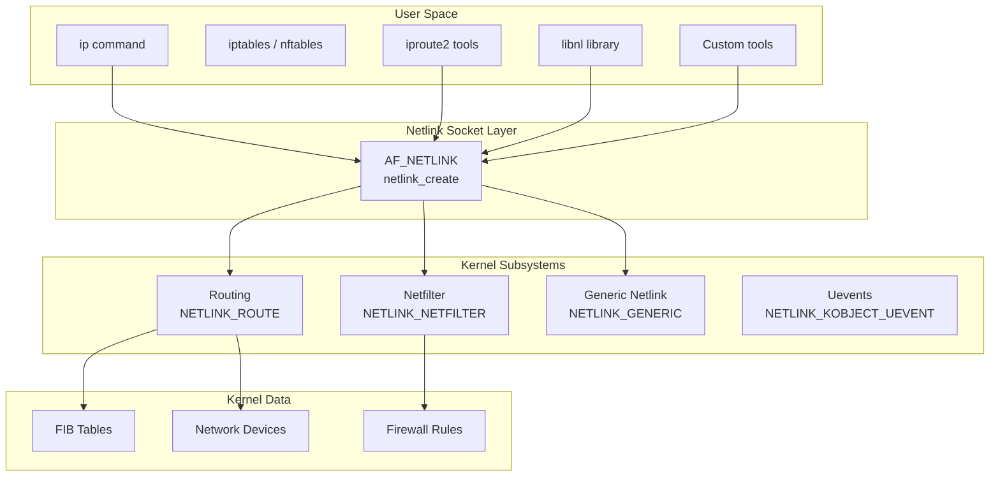
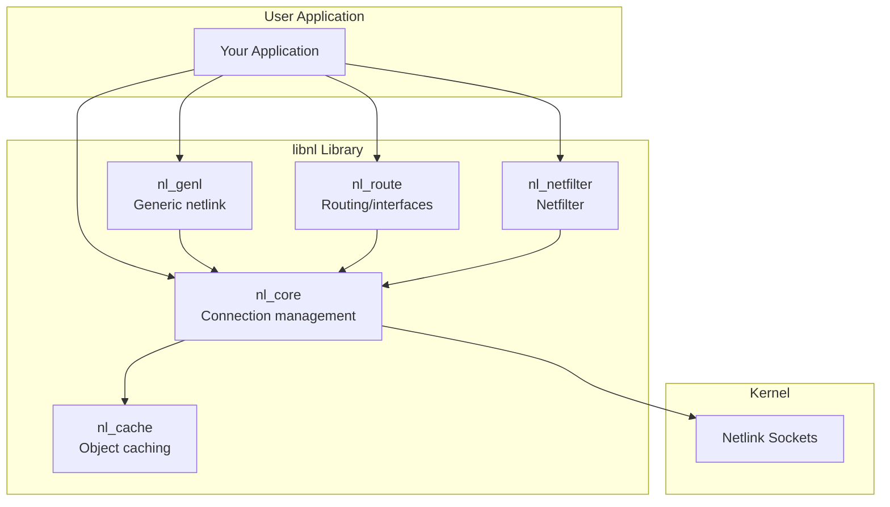
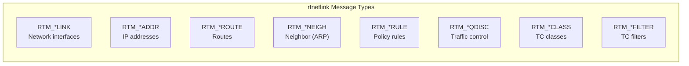

# Chapter 145: Netlink Sockets

## Introduction

Netlink sockets are a Linux-specific inter-process communication (IPC) mechanism that enables communication between user-space processes and the kernel, as well as between user-space processes themselves. They are the primary interface for configuring and monitoring the Linux networking stack—everything from managing network interfaces and routes to configuring firewall rules and querying interface statistics goes through netlink.

Before netlink, Linux relied on `ioctl()` system calls for kernel-user communication about networking. The problem with `ioctl()` is its unstructured nature: each request is a custom command with custom data, making it difficult to extend and maintain. Netlink replaced this with a structured, message-based protocol that is extensible, asynchronous, and supports multicast notifications from the kernel.

If you've ever used the `ip` command to add an IP address, set up a route, or create a network namespace, you've used netlink under the hood. The `iproute2` package communicates with the kernel entirely through netlink sockets.

## Intuition: Why Netlink?

Imagine you need to add an IP address to a network interface. You could:

1. **Use `ioctl()`**: Call `ioctl(fd, SIOCSIFADDR, &ifr)` with a fixed-size structure. Want to add a secondary address? Different ioctl. Want IPv6? Different ioctl. Want to specify a label, scope, or flags? More ioctls with more structures.

2. **Use netlink**: Send a structured message with attributes: "Here's an IP address (192.168.1.1/24), on interface index 3, with scope global, and label eth0:1." One message, self-describing, extensible. The kernel can add new attributes without breaking existing tools.

Netlink is essentially a structured, extensible RPC mechanism between user space and the kernel.

## Socket Types

| Family | Constant | Description |
|--------|----------|-------------|
| `NETLINK_ROUTE` | 0 | Routing, interface config, neighbor tables |
| `NETLINK_GENERIC` | 16 | Generic netlink (multiplexed families) |
| `NETLINK_KOBJECT_UEVENT` | 15 | Kernel uevents (hotplug) |
| `NETLINK_NETFILTER` | 12 | Netfilter subsystem |
| `NETLINK_AUDIT` | 9 | Audit subsystem |
| `NETLINK_SELINUX` | 7 | SELinux events |
| `NETLINK_NFLOG` | 5 | Netfilter logging |
| `NETLINK_CRYPTO` | 21 | Crypto subsystem |
| `NETLINK_SCSITRANSPORT` | 18 | SCSI transport |

## Architecture

### Netlink in the System



### Message Format

```
┌─────────────────────────────────────────────────┐
│                Netlink Message                   │
│  ┌───────────────────────────────────────────┐  │
│  │        struct nlmsghdr (16 bytes)          │  │
│  │  nlmsg_len   (4 bytes) - Total length     │  │
│  │  nlmsg_type  (2 bytes) - Message type     │  │
│  │  nlmsg_flags (2 bytes) - Flags (NLM_F_*)  │  │
│  │  nlmsg_seq   (4 bytes) - Sequence number  │  │
│  │  nlmsg_pid   (4 bytes) - Port ID          │  │
│  └───────────────────────────────────────────┘  │
│  ┌───────────────────────────────────────────┐  │
│  │          Payload (message-specific)        │  │
│  │  e.g., struct ifinfomsg, struct rtmsg      │  │
│  └───────────────────────────────────────────┘  │
│  ┌───────────────────────────────────────────┐  │
│  │    Attribute 1: struct nlattr + data       │  │
│  │    Attribute 2: struct nlattr + data       │  │
│  │    ...                                     │  │
│  └───────────────────────────────────────────┘  │
└─────────────────────────────────────────────────┘
```

### Netlink Header

```c
/* include/uapi/linux/netlink.h */
struct nlmsghdr {
    __u32   nlmsg_len;    /* Length of message including header */
    __u16   nlmsg_type;   /* Message content type */
    __u16   nlmsg_flags;  /* Additional flags */
    __u32   nlmsg_seq;    /* Sequence number */
    __u32   nlmsg_pid;    /* Sending process port ID */
};
```

### Message Types (NETLINK_ROUTE)

| Type | Constant | Description |
|------|----------|-------------|
| 16 | `RTM_NEWLINK` | Create/modify network interface |
| 17 | `RTM_DELLINK` | Delete network interface |
| 18 | `RTM_GETLINK` | Get interface info |
| 20 | `RTM_NEWADDR` | Add IP address |
| 21 | `RTM_DELADDR` | Delete IP address |
| 22 | `RTM_GETADDR` | Get IP addresses |
| 24 | `RTM_NEWROUTE` | Add route |
| 25 | `RTM_DELROUTE` | Delete route |
| 26 | `RTM_GETROUTE` | Get routes |
| 28 | `RTM_NEWNEIGH` | Add neighbor (ARP) entry |
| 29 | `RTM_DELNEIGH` | Delete neighbor entry |
| 30 | `RTM_GETNEIGH` | Get neighbor table |

### Message Flags

| Flag | Value | Description |
|------|-------|-------------|
| `NLM_F_REQUEST` | 1 | Request message (to kernel) |
| `NLM_F_MULTI` | 2 | Multi-part message |
| `NLM_F_ACK` | 4 | Request ACK from kernel |
| `NLM_F_ECHO` | 8 | Echo this request |
| `NLM_F_DUMP` | 0x300 | Dump all entries |
| `NLM_F_ROOT` | 0x100 | Return the root of the tree |
| `NLM_F_MATCH` | 0x200 | Return matching entries |
| `NLM_F_CREATE` | 0x400 | Create if it doesn't exist |
| `NLM_F_EXCL` | 0x200 | Don't create if it exists |
| `NLM_F_REPLACE` | 0x100 | Replace existing entry |
| `NLM_F_APPEND` | 0x800 | Add to end of list |

## Comprehensive Examples

### Raw Netlink: Listing Network Interfaces

```c
/*
 * nl_list_links.c - List network interfaces using raw netlink
 *
 * Demonstrates the raw netlink protocol without libraries.
 */

#include <stdio.h>
#include <stdlib.h>
#include <string.h>
#include <unistd.h>
#include <errno.h>
#include <sys/socket.h>
#include <linux/netlink.h>
#include <linux/rtnetlink.h>
#include <linux/if.h>
#include <arpa/inet.h>

#define BUF_SIZE 8192

/* Parse link attributes */
static void parse_link_attrs(struct rtattr *rta, int len,
                             char *ifname, int *mtu)
{
    while (RTA_OK(rta, len)) {
        switch (rta->rta_type) {
        case IFLA_IFNAME:
            strncpy(ifname, (char *)RTA_DATA(rta), IFNAMSIZ - 1);
            break;
        case IFLA_MTU:
            *mtu = *(int *)RTA_DATA(rta);
            break;
        }
        rta = RTA_NEXT(rta, len);
    }
}

/* Parse address attributes */
static void parse_addr_attrs(struct rtattr *rta, int len,
                             char **label, void **addr, int family)
{
    while (RTA_OK(rta, len)) {
        switch (rta->rta_type) {
        case IFA_LOCAL:
            *addr = RTA_DATA(rta);
            break;
        case IFA_LABEL:
            *label = (char *)RTA_DATA(rta);
            break;
        }
        rta = RTA_NEXT(rta, len);
    }
}

int main(void)
{
    int sockfd;
    struct sockaddr_nl src_addr, dest_addr;
    struct nlmsghdr *nlh;
    struct msghdr msg;
    struct iovec iov;
    char buf[BUF_SIZE];

    /* Create netlink socket */
    sockfd = socket(AF_NETLINK, SOCK_RAW, NETLINK_ROUTE);
    if (sockfd < 0) {
        perror("socket");
        exit(EXIT_FAILURE);
    }

    /* Bind to netlink */
    memset(&src_addr, 0, sizeof(src_addr));
    src_addr.nl_family = AF_NETLINK;
    src_addr.nl_pid = getpid();  /* Unique port ID */
    src_addr.nl_groups = 0;      /* No multicast */

    if (bind(sockfd, (struct sockaddr *)&src_addr, sizeof(src_addr)) < 0) {
        perror("bind");
        close(sockfd);
        exit(EXIT_FAILURE);
    }

    /* Prepare netlink message to dump all links */
    nlh = (struct nlmsghdr *)buf;
    nlh->nlmsg_len = NLMSG_LENGTH(sizeof(struct rtgenmsg));
    nlh->nlmsg_type = RTM_GETLINK;
    nlh->nlmsg_flags = NLM_F_REQUEST | NLM_F_DUMP;
    nlh->nlmsg_seq = 1;
    nlh->nlmsg_pid = getpid();

    struct rtgenmsg *rt_gen = (struct rtgenmsg *)NLMSG_DATA(nlh);
    rt_gen->rtgen_family = AF_UNSPEC;

    /* Send the message */
    memset(&dest_addr, 0, sizeof(dest_addr));
    dest_addr.nl_family = AF_NETLINK;
    dest_addr.nl_pid = 0;  /* Kernel */

    memset(&iov, 0, sizeof(iov));
    iov.iov_base = nlh;
    iov.iov_len = nlh->nlmsg_len;

    memset(&msg, 0, sizeof(msg));
    msg.msg_name = &dest_addr;
    msg.msg_namelen = sizeof(dest_addr);
    msg.msg_iov = &iov;
    msg.msg_iovlen = 1;

    if (sendmsg(sockfd, &msg, 0) < 0) {
        perror("sendmsg");
        close(sockfd);
        exit(EXIT_FAILURE);
    }

    printf("%-5s %-20s %-10s %-6s %s\n",
           "Index", "Name", "State", "MTU", "Flags");
    printf("%-5s %-20s %-10s %-6s %s\n",
           "-----", "--------------------", "----------",
           "------", "-----");

    /* Receive and parse responses (may be multi-part) */
    int done = 0;
    while (!done) {
        ssize_t len = recv(sockfd, buf, BUF_SIZE, 0);
        if (len < 0) {
            perror("recv");
            break;
        }

        struct nlmsghdr *hdr = (struct nlmsghdr *)buf;
        for (; NLMSG_OK(hdr, (unsigned int)len);
             hdr = NLMSG_NEXT(hdr, len)) {

            if (hdr->nlmsg_type == NLMSG_DONE) {
                done = 1;
                break;
            }

            if (hdr->nlmsg_type == NLMSG_ERROR) {
                struct nlmsgerr *err = NLMSG_DATA(hdr);
                fprintf(stderr, "Netlink error: %s\n",
                        strerror(-err->error));
                done = 1;
                break;
            }

            if (hdr->nlmsg_type == RTM_GETLINK ||
                hdr->nlmsg_type == RTM_NEWLINK) {
                struct ifinfomsg *ifi = NLMSG_DATA(hdr);
                int rta_len = hdr->nlmsg_len -
                              NLMSG_LENGTH(sizeof(*ifi));
                struct rtattr *rta = IFLA_RTA(ifi);

                char ifname[IFNAMSIZ] = "unknown";
                int mtu = 0;
                parse_link_attrs(rta, rta_len, ifname, &mtu);

                const char *state;
                switch (ifi->ifi_change) {
                case 0: state = "UP"; break;
                default: state = "DOWN"; break;
                }
                if (ifi->ifi_flags & IFF_UP)
                    state = "UP";

                printf("%-5d %-20s %-10s %-6d 0x%x\n",
                       ifi->ifi_index, ifname, state,
                       mtu, ifi->ifi_flags);
            }
        }
    }

    close(sockfd);
    return 0;
}
```

### Adding an IP Address via Netlink

```c
/*
 * nl_add_addr.c - Add an IP address to an interface using netlink
 */

#include <stdio.h>
#include <stdlib.h>
#include <string.h>
#include <unistd.h>
#include <sys/socket.h>
#include <linux/netlink.h>
#include <linux/rtnetlink.h>
#include <linux/if.h>
#include <arpa/inet.h>

#define BUF_SIZE 4096

/* Align helper */
#define NLMSG_TAIL(nmsg) \
    ((struct rtattr *)(((char *)(nmsg)) + NLMSG_ALIGN((nmsg)->nlmsg_len)))

static int addattr_l(struct nlmsghdr *n, int maxlen, int type,
                     const void *data, int alen)
{
    int len = RTA_LENGTH(alen);
    struct rtattr *rta;

    if (NLMSG_ALIGN(n->nlmsg_len) + RTA_ALIGN(len) > (unsigned)maxlen)
        return -1;

    rta = NLMSG_TAIL(n);
    rta->rta_type = type;
    rta->rta_len = len;
    if (alen)
        memcpy(RTA_DATA(rta), data, alen);
    n->nlmsg_len = NLMSG_ALIGN(n->nlmsg_len) + RTA_ALIGN(len);
    return 0;
}

int main(int argc, char *argv[])
{
    if (argc < 4) {
        fprintf(stderr, "Usage: %s <ifindex> <ip/mask> <label>\n", argv[0]);
        fprintf(stderr, "Example: %s 2 192.168.1.100/24 eth0:1\n", argv[0]);
        exit(EXIT_FAILURE);
    }

    int ifindex = atoi(argv[1]);
    const char *ip_mask = argv[2];
    const char *label = argv[3];

    /* Parse IP and mask */
    char ip_str[64];
    int prefix_len = 24;
    char *slash = strchr(ip_mask, '/');
    if (slash) {
        strncpy(ip_str, ip_mask, slash - ip_mask);
        ip_str[slash - ip_mask] = '\0';
        prefix_len = atoi(slash + 1);
    } else {
        strcpy(ip_str, ip_mask);
    }

    struct in_addr addr;
    inet_pton(AF_INET, ip_str, &addr);

    /* Create netlink socket */
    int sockfd = socket(AF_NETLINK, SOCK_RAW, NETLINK_ROUTE);
    if (sockfd < 0) {
        perror("socket");
        exit(EXIT_FAILURE);
    }

    struct sockaddr_nl sa;
    memset(&sa, 0, sizeof(sa));
    sa.nl_family = AF_NETLINK;
    sa.nl_pid = getpid();
    bind(sockfd, (struct sockaddr *)&sa, sizeof(sa));

    /* Build the netlink message */
    char buf[BUF_SIZE];
    memset(buf, 0, sizeof(buf));

    struct nlmsghdr *nlh = (struct nlmsghdr *)buf;
    nlh->nlmsg_len = NLMSG_LENGTH(sizeof(struct ifaddrmsg));
    nlh->nlmsg_type = RTM_NEWADDR;
    nlh->nlmsg_flags = NLM_F_REQUEST | NLM_F_CREATE | NLM_F_EXCL | NLM_F_ACK;
    nlh->nlmsg_seq = 1;
    nlh->nlmsg_pid = getpid();

    /* Address message header */
    struct ifaddrmsg *ifa = (struct ifaddrmsg *)NLMSG_DATA(nlh);
    ifa->ifa_family = AF_INET;
    ifa->ifa_prefixlen = prefix_len;
    ifa->ifa_flags = IFA_F_PERMANENT;
    ifa->ifa_scope = 0;
    ifa->ifa_index = ifindex;

    /* Add attributes */
    addattr_l(nlh, BUF_SIZE, IFA_LOCAL, &addr, sizeof(addr));
    addattr_l(nlh, BUF_SIZE, IFA_ADDRESS, &addr, sizeof(addr));
    addattr_l(nlh, BUF_SIZE, IFA_LABEL, label, strlen(label) + 1);

    /* Send the message */
    struct sockaddr_nl dest;
    memset(&dest, 0, sizeof(dest));
    dest.nl_family = AF_NETLINK;
    dest.nl_pid = 0;  /* Kernel */

    struct iovec iov = { .iov_base = nlh, .iov_len = nlh->nlmsg_len };
    struct msghdr msg = {
        .msg_name = &dest,
        .msg_namelen = sizeof(dest),
        .msg_iov = &iov,
        .msg_iovlen = 1,
    };

    if (sendmsg(sockfd, &msg, 0) < 0) {
        perror("sendmsg");
        close(sockfd);
        exit(EXIT_FAILURE);
    }

    /* Receive ACK */
    ssize_t n = recv(sockfd, buf, BUF_SIZE, 0);
    if (n > 0) {
        struct nlmsghdr *resp = (struct nlmsghdr *)buf;
        if (resp->nlmsg_type == NLMSG_ERROR) {
            struct nlmsgerr *err = (struct nlmsgerr *)NLMSG_DATA(resp);
            if (err->error == 0) {
                printf("Successfully added %s/%d on interface %d with label %s\n",
                       ip_str, prefix_len, ifindex, label);
            } else {
                fprintf(stderr, "Netlink error: %s\n",
                        strerror(-err->error));
            }
        }
    }

    close(sockfd);
    return 0;
}
```

### Subscribing to Kernel Notifications

```c
/*
 * nl_monitor.c - Monitor network events using netlink multicast groups
 *
 * Listens for link state changes, new addresses, route changes, etc.
 */

#include <stdio.h>
#include <stdlib.h>
#include <string.h>
#include <unistd.h>
#include <sys/socket.h>
#include <linux/netlink.h>
#include <linux/rtnetlink.h>
#include <linux/if.h>
#include <arpa/inet.h>

#define BUF_SIZE 8192

static const char *msg_type_str(__u16 type)
{
    switch (type) {
    case RTM_NEWLINK:   return "NEW_LINK";
    case RTM_DELLINK:   return "DEL_LINK";
    case RTM_NEWADDR:   return "NEW_ADDR";
    case RTM_DELADDR:   return "DEL_ADDR";
    case RTM_NEWROUTE:  return "NEW_ROUTE";
    case RTM_DELROUTE:  return "DEL_ROUTE";
    case RTM_NEWNEIGH:  return "NEW_NEIGH";
    case RTM_DELNEIGH:  return "DEL_NEIGH";
    default:            return "UNKNOWN";
    }
}

static void print_addr(int family, void *addr)
{
    char buf[INET6_ADDRSTRLEN];
    inet_ntop(family, addr, buf, sizeof(buf));
    printf("%s", buf);
}

int main(void)
{
    int sockfd;
    struct sockaddr_nl sa;

    /* Create netlink socket */
    sockfd = socket(AF_NETLINK, SOCK_RAW, NETLINK_ROUTE);
    if (sockfd < 0) {
        perror("socket");
        exit(EXIT_FAILURE);
    }

    /* Subscribe to multicast groups */
    memset(&sa, 0, sizeof(sa));
    sa.nl_family = AF_NETLINK;
    sa.nl_pid = getpid();
    sa.nl_groups = RTMGRP_LINK |        /* Link state changes */
                   RTMGRP_IPV4_IFADDR |  /* IPv4 address changes */
                   RTMGRP_IPV4_ROUTE |   /* IPv4 route changes */
                   RTMGRP_IPV6_IFADDR |  /* IPv6 address changes */
                   RTMGRP_NEIGH;         /* Neighbor (ARP) changes */

    if (bind(sockfd, (struct sockaddr *)&sa, sizeof(sa)) < 0) {
        perror("bind");
        close(sockfd);
        exit(EXIT_FAILURE);
    }

    printf("Monitoring network events (Ctrl+C to stop)...\n\n");

    char buf[BUF_SIZE];
    while (1) {
        ssize_t len = recv(sockfd, buf, BUF_SIZE, 0);
        if (len < 0) {
            perror("recv");
            continue;
        }

        struct nlmsghdr *hdr = (struct nlmsghdr *)buf;
        for (; NLMSG_OK(hdr, (unsigned int)len);
             hdr = NLMSG_NEXT(hdr, len)) {

            printf("[%s] ", msg_type_str(hdr->nlmsg_type));

            switch (hdr->nlmsg_type) {
            case RTM_NEWLINK:
            case RTM_DELLINK: {
                struct ifinfomsg *ifi = NLMSG_DATA(hdr);
                struct rtattr *rta = IFLA_RTA(ifi);
                int rta_len = hdr->nlmsg_len -
                              NLMSG_LENGTH(sizeof(*ifi));

                char ifname[IFNAMSIZ] = "?";
                for (; RTA_OK(rta, rta_len);
                     rta = RTA_NEXT(rta, rta_len)) {
                    if (rta->rta_type == IFLA_IFNAME)
                        strncpy(ifname, RTA_DATA(rta),
                                IFNAMSIZ - 1);
                }
                printf("ifindex=%d name=%s %s\n",
                       ifi->ifi_index, ifname,
                       (ifi->ifi_flags & IFF_UP) ? "UP" : "DOWN");
                break;
            }
            case RTM_NEWADDR:
            case RTM_DELADDR: {
                struct ifaddrmsg *ifa = NLMSG_DATA(hdr);
                struct rtattr *rta = IFA_RTA(ifa);
                int rta_len = hdr->nlmsg_len -
                              NLMSG_LENGTH(sizeof(*ifa));

                for (; RTA_OK(rta, rta_len);
                     rta = RTA_NEXT(rta, rta_len)) {
                    if (rta->rta_type == IFA_LOCAL) {
                        printf("ifindex=%d addr=",
                               ifa->ifa_index);
                        print_addr(ifa->ifa_family,
                                   RTA_DATA(rta));
                        printf("/%d\n", ifa->ifa_prefixlen);
                    }
                }
                break;
            }
            case RTM_NEWROUTE:
            case RTM_DELROUTE: {
                struct rtmsg *rtm = NLMSG_DATA(hdr);
                struct rtattr *rta = RTM_RTA(rtm);
                int rta_len = hdr->nlmsg_len -
                              NLMSG_LENGTH(sizeof(*rtm));

                printf("table=%d ", rtm->rtm_table);
                for (; RTA_OK(rta, rta_len);
                     rta = RTA_NEXT(rta, rta_len)) {
                    if (rta->rta_type == RTA_DST) {
                        printf("dst=");
                        print_addr(rtm->rtm_family,
                                   RTA_DATA(rta));
                        printf("/%d ", rtm->rtm_dst_len);
                    }
                    if (rta->rta_type == RTA_GATEWAY) {
                        printf("gw=");
                        print_addr(rtm->rtm_family,
                                   RTA_DATA(rta));
                    }
                }
                printf("\n");
                break;
            }
            default:
                printf("(unhandled)\n");
                break;
            }
        }
    }

    close(sockfd);
    return 0;
}
```

## Generic Netlink

Generic Netlink extends the netlink framework with a multiplexing mechanism. Since netlink has only 32 message types, generic netlink uses a single `NETLINK_GENERIC` family with dynamically registered families.

### Architecture

```mermaid
graph TB
    subgraph "User Space"
        NLTOOL[nl-util]
        LIBNL3[libnl-3]
        CUSTOM[Custom app]
    end

    subgraph "Generic Netlink"
        GENL[NETLINK_GENERIC<br/>Generic Netlink Controller]
        FAMILY1[Family: nl80211<br/>(WiFi config)]
        FAMILY2[Family: nftables<br/>(Firewall)]
        FAMILY3[Family: taskstats<br/>(Task stats)]
        FAMILY4[Family: nlctrl<br/>(Controller)]
    end

    subgraph "Kernel Subsystems"
        WIFI[WiFi Stack]
        NF[Netfilter]
        PROC[Process Stats]
    end

    NLTOOL & LIBNL3 & CUSTOM --> GENL
    GENL --> FAMILY1 & FAMILY2 & FAMILY3 & FAMILY4
    FAMILY1 --> WIFI
    FAMILY2 --> NF
    FAMILY3 --> PROC
```

### Generic Netlink Message

```c
/* include/uapi/linux/genetlink.h */
struct genlmsghdr {
    __u8    cmd;        /* Command */
    __u8    version;    /* Version */
    __u16   reserved;   /* Reserved */
    /* Followed by attributes */
};
```

### Discovering Generic Netlink Families

```c
/*
 * Discover available generic netlink families
 */

#include <stdio.h>
#include <stdlib.h>
#include <string.h>
#include <unistd.h>
#include <sys/socket.h>
#include <linux/netlink.h>
#include <linux/genetlink.h>
#include <linux/rtnetlink.h>

#define BUF_SIZE 8192

int main(void)
{
    int sockfd = socket(AF_NETLINK, SOCK_RAW, NETLINK_GENERIC);
    if (sockfd < 0) {
        perror("socket");
        exit(EXIT_FAILURE);
    }

    struct sockaddr_nl sa;
    memset(&sa, 0, sizeof(sa));
    sa.nl_family = AF_NETLINK;
    sa.nl_pid = getpid();
    bind(sockfd, (struct sockaddr *)&sa, sizeof(sa));

    /* Build a GETFAMILY request */
    char buf[BUF_SIZE];
    memset(buf, 0, sizeof(buf));

    struct nlmsghdr *nlh = (struct nlmsghdr *)buf;
    nlh->nlmsg_len = NLMSG_LENGTH(GENL_HDRLEN);
    nlh->nlmsg_type = GENL_ID_CTRL;
    nlh->nlmsg_flags = NLM_F_REQUEST | NLM_F_DUMP;
    nlh->nlmsg_seq = 1;
    nlh->nlmsg_pid = getpid();

    struct genlmsghdr *genl = (struct genlmsghdr *)NLMSG_DATA(nlh);
    genl->cmd = CTRL_CMD_GETFAMILY;
    genl->version = 1;

    /* Add CTRL_ATTR_FAMILY_NAME attribute for specific family */
    /* Or omit to dump all families */

    /* Send to kernel */
    struct sockaddr_nl dest;
    memset(&dest, 0, sizeof(dest));
    dest.nl_family = AF_NETLINK;
    dest.nl_pid = 0;

    struct iovec iov = { .iov_base = nlh, .iov_len = nlh->nlmsg_len };
    struct msghdr msg = {
        .msg_name = &dest,
        .msg_namelen = sizeof(dest),
        .msg_iov = &iov,
        .msg_iovlen = 1,
    };

    sendmsg(sockfd, &msg, 0);

    /* Receive family info */
    ssize_t n = recv(sockfd, buf, BUF_SIZE, 0);
    if (n > 0) {
        struct nlmsghdr *hdr = (struct nlmsghdr *)buf;
        /* Parse response attributes */
        /* CTRL_ATTR_FAMILY_ID, CTRL_ATTR_FAMILY_NAME, etc. */
        printf("Generic netlink families available\n");
        printf("(Parse attributes from response)\n");
    }

    close(sockfd);
    return 0;
}
```

## Using libnl

The `libnl` library provides a higher-level API for netlink programming.

### libnl Architecture



### libnl Example: List Interfaces

```c
/*
 * libnl_list_links.c - List interfaces using libnl
 *
 * Compile: gcc -o libnl_list_links libnl_list_links.c \
 *          $(pkg-config --cflags --libs libnl-3.0 libnl-route-3.0)
 */

#include <netlink/netlink.h>
#include <netlink/cache.h>
#include <netlink/route/link.h>
#include <stdio.h>

static void dump_link(struct nl_object *obj, void *arg)
{
    struct rtnl_link *link = (struct rtnl_link *)obj;
    (void)arg;

    printf("Index: %d, Name: %s, State: %s, MTU: %d\n",
           rtnl_link_get_ifindex(link),
           rtnl_link_get_name(link),
           rtnl_link_get_operstate(link) == IF_OPER_UP ? "UP" : "DOWN",
           rtnl_link_get_mtu(link));
}

int main(void)
{
    struct nl_sock *sk;
    struct nl_cache *link_cache;

    /* Allocate and connect netlink socket */
    sk = nl_socket_alloc();
    if (!sk) {
        fprintf(stderr, "Failed to allocate socket\n");
        exit(EXIT_FAILURE);
    }

    if (nl_connect(sk, NETLINK_ROUTE) < 0) {
        fprintf(stderr, "Failed to connect\n");
        nl_socket_free(sk);
        exit(EXIT_FAILURE);
    }

    /* Allocate link cache */
    if (rtnl_link_alloc_cache(sk, AF_UNSPEC, &link_cache) < 0) {
        fprintf(stderr, "Failed to allocate link cache\n");
        nl_close(sk);
        nl_socket_free(sk);
        exit(EXIT_FAILURE);
    }

    /* Iterate and dump all links */
    printf("%-5s %-20s %-10s %-6s\n",
           "Index", "Name", "State", "MTU");
    nl_cache_foreach(link_cache, dump_link, NULL);

    /* Cleanup */
    nl_cache_free(link_cache);
    nl_close(sk);
    nl_socket_free(sk);

    return 0;
}
```

### libnl Example: Add IP Address

```c
/*
 * Add an IP address using libnl
 */

#include <netlink/netlink.h>
#include <netlink/route/addr.h>
#include <netlink/route/link.h>
#include <arpa/inet.h>
#include <stdio.h>

int main(int argc, char *argv[])
{
    if (argc < 3) {
        fprintf(stderr, "Usage: %s <interface> <ip/prefix>\n", argv[0]);
        exit(EXIT_FAILURE);
    }

    struct nl_sock *sk = nl_socket_alloc();
    nl_connect(sk, NETLINK_ROUTE);

    /* Look up interface by name */
    struct nl_cache *link_cache;
    rtnl_link_alloc_cache(sk, AF_UNSPEC, &link_cache);
    int ifindex = rtnl_link_name2i(link_cache, argv[1]);
    if (ifindex == 0) {
        fprintf(stderr, "Interface %s not found\n", argv[1]);
        exit(EXIT_FAILURE);
    }

    /* Create address object */
    struct rtnl_addr *addr = rtnl_addr_alloc();

    /* Parse address */
    struct nl_addr *local;
    nl_addr_parse(argv[2], AF_INET, &local);
    rtnl_addr_set_local(addr, local);
    rtnl_addr_set_ifindex(addr, ifindex);

    /* Add to kernel */
    int err = rtnl_addr_add(sk, addr, 0);
    if (err < 0) {
        fprintf(stderr, "Failed to add address: %s\n",
                nl_geterror(err));
    } else {
        printf("Added %s to %s (index %d)\n",
               argv[2], argv[1], ifindex);
    }

    /* Cleanup */
    nl_addr_put(local);
    rtnl_addr_put(addr);
    nl_cache_free(link_cache);
    nl_close(sk);
    nl_socket_free(sk);

    return 0;
}
```

## rtnetlink: The Most Common Netlink Subsystem

### Message Types



### Route Message Structure

```c
/* Routing message header */
struct rtmsg {
    __u8    rtm_family;     /* Address family (AF_INET, AF_INET6) */
    __u8    rtm_dst_len;    /* Destination prefix length */
    __u8    rtm_src_len;    /* Source prefix length */
    __u8    rtm_tos;        /* TOS filter */
    __u8    rtm_table;      /* Routing table ID */
    __u8    rtm_protocol;   /* Route origin */
    __u8    rtm_scope;      /* Distance to destination */
    __u8    rtm_type;       /* Route type */
    __u32   rtm_flags;      /* Route flags */
};

/* Route attribute types */
#define RTA_DST         1   /* Destination address */
#define RTA_SRC         2   /* Source address */
#define RTA_IIF         3   /* Input interface index */
#define RTA_OIF         4   /* Output interface index */
#define RTA_GATEWAY     5   /* Gateway address */
#define RTA_PRIORITY    6   /* Route priority */
#define RTA_PREFSRC     7   /* Preferred source address */
#define RTA_METRICS     8   /* Route metrics */
#define RTA_MULTIPATH   9   /* Multipath */
#define RTA_FLOW        11  /* Flow classifier */
#define RTA_TABLE       15  /* Routing table ID */
```

## Kernel Implementation

### Key Source Files

| File | Description |
|------|-------------|
| `net/netlink/af_netlink.c` | Netlink socket implementation |
| `net/netlink/af_netlink_diag.c` | Netlink diagnostics |
| `include/linux/netlink.h` | Kernel netlink definitions |
| `include/uapi/linux/netlink.h` | User-space netlink definitions |
| `net/core/rtnetlink.c` | rtnetlink implementation |
| `include/net/rtnetlink.h` | rtnetlink internal headers |
| `lib/nlattr.c` | Netlink attribute parsing |

### Socket Creation

```c
/* net/netlink/af_netlink.c - Simplified */

static int netlink_create(struct net *net, struct socket *sock,
                          int protocol, int kern)
{
    struct netlink_sock *nlk;
    struct sock *sk;

    /* Validate protocol */
    if (protocol < 0 || protocol >= MAX_LINKS)
        return -EPROTONOSUPPORT;

    /* Allocate the socket */
    sk = netlink_alloc_kernel(net, protocol);
    if (!sk)
        return -ENOMEM;

    nlk = nlk_sk(sk);
    nlk->module = NULL;

    /* Set up socket operations */
    sock->ops = &netlink_ops;

    /* Register with the netlink table */
    netlink_insert(sk, nlk->portid);

    return 0;
}
```

### Sending Messages to User Space

```c
/* Kernel sending a netlink message to user space */

int netlink_unicast(struct sock *ssk, struct sk_buff *skb,
                    __u32 portid, int nonblock)
{
    struct sock *sk;
    int err;

    /* Look up destination socket */
    sk = netlink_lookup(sock_net(ssk), ssk->sk_protocol, portid);
    if (!sk) {
        kfree_skb(skb);
        return -ECONNREFUSED;
    }

    /* Deliver the message */
    err = netlink_deliver_skb(sk, skb);
    sock_put(sk);
    return err;
}

/* Multicast to all listeners */
int netlink_broadcast(struct sock *ssk, struct sk_buff *skb,
                      __u32 portid, __u32 group, gfp_t allocation)
{
    /* Iterate through all sockets subscribed to the group */
    /* Deliver to each matching socket */
    return do_one_broadcast(ssk, skb, portid, group, allocation);
}
```

## Security

### Capability Requirements

| Operation | Required |
|-----------|----------|
| `NETLINK_ROUTE` (read) | None (unprivileged) |
| `NETLINK_ROUTE` (modify) | `CAP_NET_ADMIN` |
| `NETLINK_NETFILTER` | `CAP_NET_ADMIN` |
| `NETLINK_AUDIT` | `CAP_AUDIT_*` |
| `NETLINK_GENERIC` | Depends on family |
| `NETLINK_KOBJECT_UEVENT` | None (unprivileged) |

### Netlink Auditing

```c
/* Netlink messages can be audited */
/* Each message includes the PID and UID of the sender */
/* Kernel can reject messages from unprivileged processes */
```

## Common Pitfalls

1. **Buffer overflow**: Always check `nlmsg_len` against the actual buffer size before parsing
2. **Multi-part messages**: `NLM_F_MULTI` responses end with `NLMSG_DONE`; don't stop after the first message
3. **Alignment**: Netlink attributes must be 4-byte aligned; use `RTA_OK()`, `RTA_NEXT()`, `RTA_ALIGN()`
4. **PID uniqueness**: Use `getpid()` or 0 for auto-assignment; conflicts cause `EADDRINUSE`
5. **Blocking I/O**: `recv()` blocks by default; use `select()`/`poll()` for non-blocking operation
6. **Sequence numbers**: Use them to match responses to requests; don't ignore them
7. **Attribute parsing**: Always validate attribute types and lengths before accessing data

## Best Practices

1. **Use libnl**: For production code, libnl handles all the low-level details correctly
2. **Handle multi-part responses**: Always loop until `NLMSG_DONE` or `NLMSG_ERROR`
3. **Subscribe to notifications**: Use multicast groups for real-time monitoring
4. **Set sequence numbers**: Helps match responses to requests
5. **Validate everything**: Check message types, attribute lengths, and alignment
6. **Use `NLMSG_ACK`**: Request acknowledgments for modification operations
7. **Buffer management**: Use large buffers (8-64 KB) to handle bulk responses

## Exercises

1. **Interface lister**: Using raw netlink (no libraries), list all network interfaces with their IP addresses, MAC addresses, and MTU values.

2. **Route monitor**: Write a program that monitors the routing table for changes and logs new/deleted routes with timestamps.

3. **ARP table dump**: Use netlink to dump the ARP/neighbor cache and display it in a formatted table.

4. **libnl interface manager**: Using libnl, write a tool that can add/remove IP addresses, bring interfaces up/down, and display interface statistics.

5. **Generic netlink family**: Write a simple generic netlink family in the kernel that responds to user-space queries with system information.

6. **Event correlation**: Write a monitor that correlates link-down events with route changes to show the impact of interface failures.

## References

1. Linux kernel source: `net/netlink/af_netlink.c`, `net/core/rtnetlink.c`
2. Linux man pages: `netlink(7)`, `netlink(3)`
3. libnl documentation: https://www.infradead.org/~tgr/libnl/
4. Linux kernel documentation: `Documentation/netlink/`
5. RFC 3549: Linux Netlink as an IP Services Protocol
6. Heise, J. "A Tutorial on Netlink Programming"
7. iproute2 source: https://github.com/iproute2/iproute2
