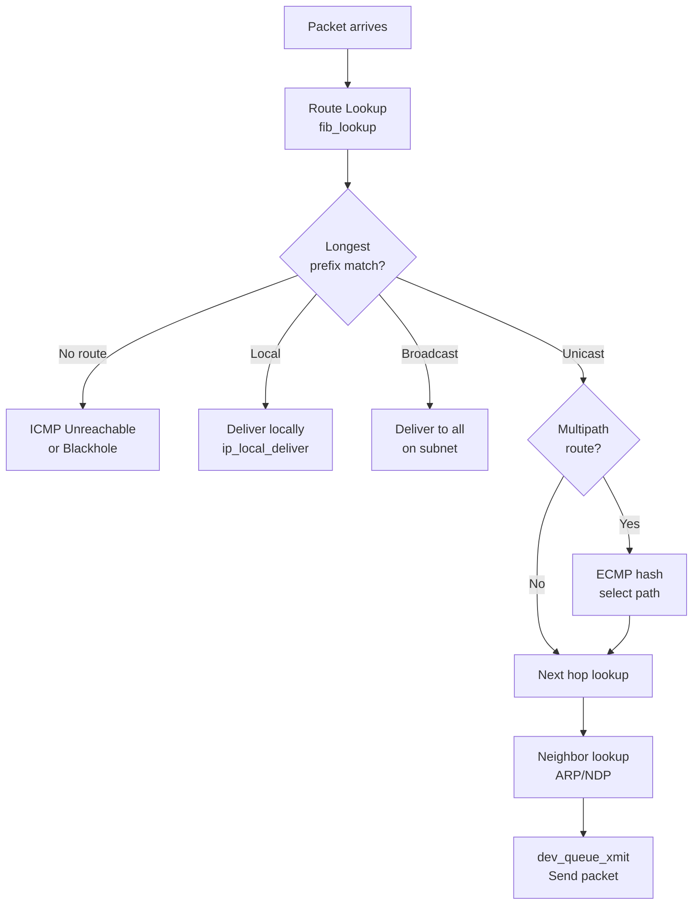
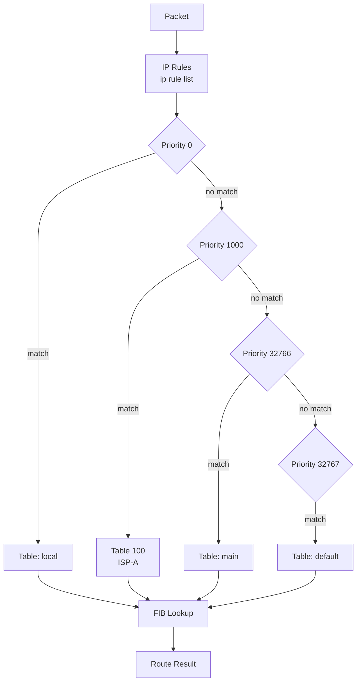
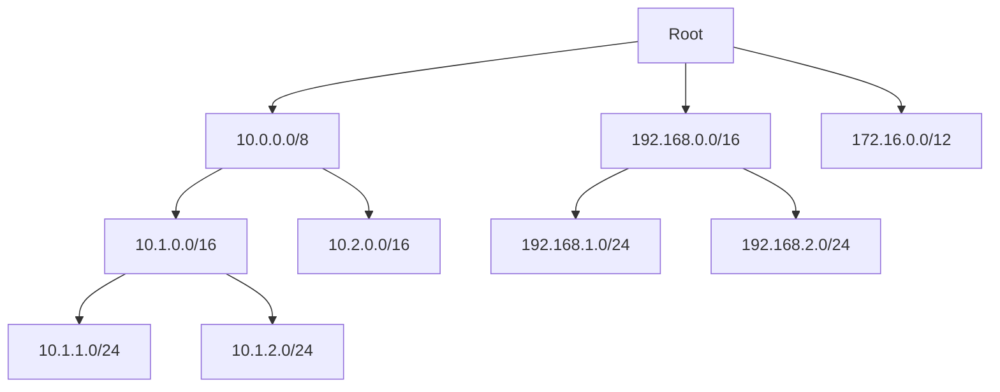
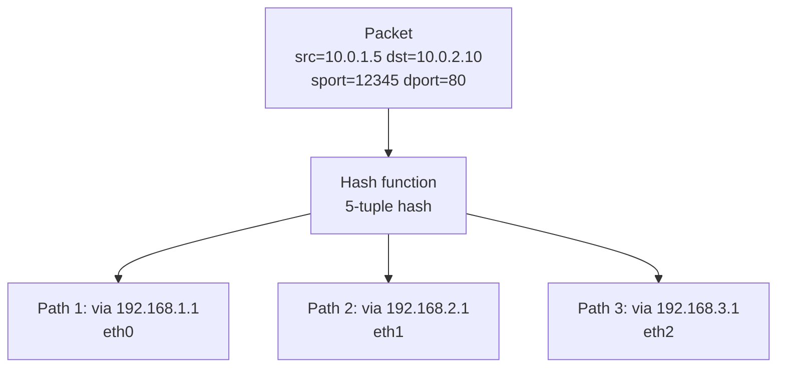

# Chapter 146: Routing

## Introduction

Routing is the process of determining the path that network packets take from source to destination. In Linux, the routing subsystem is one of the most sophisticated in any operating system, supporting multiple routing tables, policy-based routing, multipath routing, Equal-Cost Multi-Path (ECMP), and advanced features like VRF (Virtual Routing and Forwarding) and segment routing. Understanding Linux routing is essential for network engineers, system administrators, and anyone building networked systems.

The Linux routing subsystem has evolved significantly from the simple routing table of early Unix systems. Modern Linux supports the FIB (Forwarding Information Base) trie structure for fast lookups, multiple routing tables for policy routing, and a rich netlink interface for configuration. Whether you're running a home server or a carrier-grade router, the same routing code handles your packets.

## Intuition: The Post Office Analogy

Routing is like a postal sorting office. When a letter arrives:

1. **Look at the destination address**: Where is this going?
2. **Check the sorting table**: Which exit does this mail go through?
3. **Pick the best match**: If the address is "192.168.1.50" and you have entries for "192.168.1.0/24" and "192.168.0.0/16", the /24 is more specific (longest match).
4. **Forward to the next hop**: Put the letter on the right truck.

The routing table is the sorting table. Each route entry says "to reach this destination, send the packet to this next hop (or directly to this interface)."

## Routing Fundamentals

### Key Concepts

| Concept | Description |
|---------|-------------|
| **Destination** | The network or host the packet is going to |
| **Prefix length** | How many bits of the address must match (CIDR notation) |
| **Next hop** | The router to forward the packet to |
| **Interface** | The local network interface to send the packet out |
| **Metric** | Cost of the route (lower is preferred) |
| **Table** | The routing table to use (default: main, table 254) |
| **Scope** | Reachability scope (host, link, global) |
| **Protocol** | How the route was added (static, kernel, boot, zebra, etc.) |

### Route Types

| Type | Constant | Description |
|------|----------|-------------|
| Unicast | `RTN_UNICAST` | Normal route (forward to next hop) |
| Local | `RTN_LOCAL` | Address is assigned to this host |
| Broadcast | `RTN_BROADCAST` | Broadcast address |
| Anycast | `RTN_ANYCAST` | Anycast address |
| Multicast | `RTN_MULTICAST` | Multicast route |
| Blackhole | `RTN_BLACKHOLE` | Silently discard |
| Unreachable | `RTN_UNREACHABLE` | Send ICMP unreachable |
| Prohibit | `RTN_PROHIBIT` | Send ICMP administratively prohibited |
| Throw | `RTN_THROW` | Not in this table, check next table |
| Nat | `RTN_NAT` | NAT route |

## Architecture

### Routing Decision Flow



### Routing Table Structure

```mermaid
graph TB
    subgraph "Routing Decision"
        PKT[Incoming Packet<br/>dst=10.0.1.5]
    end

    subgraph "Policy Routing"
        TOS{Traffic<br/>Class?}
        T1[Table 100<br/>(Custom)]
        T2[Table 200<br/>(Custom)]
        TMAIN[Table main<br/>(254)]
        TDEFAULT[Table default<br/>(253)]
    end

    subgraph "FIB Trie Lookup"
        FIB[fib_table_lookup<br/>Longest prefix match]
    end

    subgraph "Route Entry"
        RE[fib_nh<br/>Next hop info]
        GW[Gateway: 10.0.0.1]
        DEV[Device: eth0]
    end

    PKT --> TOS
    TOS --> T1 & T2 & TMAIN
    T1 & T2 & TMAIN --> FIB
    FIB --> RE
    RE --> GW & DEV
```

## Routing Tables

### Default Tables

| ID | Name | Description |
|----|------|-------------|
| 255 | local | Local and broadcast routes (auto-managed) |
| 254 | main | Main routing table (default for most operations) |
| 253 | default | Default table (usually empty) |
| 0 | unspec | Unspecified |

### Viewing Routing Tables

```bash
# Main routing table
ip route show
ip route show table main

# All tables
ip route show table all

# Specific table
ip route show table 100

# Default route only
ip route show default

# Route for specific destination
ip route get 8.8.8.8

# Verbose output (includes metrics, flags, etc.)
ip -d route show
```

### Basic Route Management

```bash
# Add a route
ip route add 10.0.2.0/24 via 192.168.1.1 dev eth0

# Add a default route
ip route add default via 192.168.1.1

# Add a route with metric
ip route add 10.0.3.0/24 via 192.168.1.1 metric 100

# Delete a route
ip route del 10.0.2.0/24

# Replace a route (add if missing, replace if exists)
ip route replace 10.0.2.0/24 via 192.168.1.2

# Add a blackhole route (silently drop)
ip route add blackhole 10.0.5.0/24

# Add an unreachable route (send ICMP unreachable)
ip route add unreachable 10.0.6.0/24
```

### Route Attributes

```bash
# Route with multiple attributes
ip route add 10.0.2.0/24 \
    via 192.168.1.1 \
    dev eth0 \
    metric 100 \
    mtu 1400 \
    table 100 \
    proto static

# Show route details
ip -d route show 10.0.2.0/24
# 10.0.2.0/24 via 192.168.1.1 dev eth0
#     proto static metric 100 mtu 1400
```

## Policy Routing

Policy routing allows routing decisions based on criteria beyond just the destination address: source address, TOS/DSCP, firewall marks, incoming interface, and more.

### Why Policy Routing?

Consider a server with two ISP connections:
- ISP-A via eth0 (192.168.1.0/24)
- ISP-B via eth1 (192.168.2.0/24)

With policy routing:
- Traffic from 192.168.1.x → always use ISP-A
- Traffic from 192.168.2.x → always use ISP-B
- Traffic marked by firewall → use specific ISP

### Configuration

```bash
# Create custom routing tables
echo "100 isp_a" >> /etc/iproute2/rt_tables
echo "200 isp_b" >> /etc/iproute2/rt_tables

# Add routes to custom tables
ip route add default via 192.168.1.1 table isp_a
ip route add default via 192.168.2.1 table isp_b

# Add rules: source-based routing
ip rule add from 192.168.1.0/24 table isp_a
ip rule add from 192.168.2.0/24 table isp_b

# Add rule: firewall mark-based routing
iptables -t mangle -A PREROUTING -p tcp --dport 80 -j MARK --set-mark 1
ip rule add fwmark 1 table isp_a

# Add rule: incoming interface-based routing
ip rule add iif eth2 table isp_b

# View all rules
ip rule show
```

### Rule Priorities

```bash
# Rules are evaluated in priority order (lowest number first)
ip rule show
# 0:     from all lookup local
# 32766: from all lookup main
# 32767: from all lookup default

# Custom rules are inserted between 0 and 32766
ip rule add from 10.0.0.0/8 table 100 priority 1000
```

### Policy Routing Architecture



## The FIB Trie

### Longest Prefix Match

The kernel uses a LC-trie (Level Compressed trie) for fast IP address lookups. This data structure provides O(W) lookup time where W is the address width (32 for IPv4, 128 for IPv6).



### FIB Data Structures

```c
/* include/net/ip_fib.h (simplified) */

/* A routing table */
struct fib_table {
    struct hlist_node   tb_hlist;
    u32                 tb_id;      /* Table ID (254 = main) */
    int                 tb_default;
    struct rcu_head     rcu;
    unsigned long       tb_data[];
};

/* FIB node in the trie */
struct fib_node {
    struct hlist_node   fn_hash;
    struct fib_info     *fn_info;
    struct fib_alias    fn_alias;
    u8                  fn_tos;
    u8                  fn_type;
    u8                  fn_state;
    u32                 fn_key;     /* Prefix key */
};

/* FIB info: shared information for routes with same next-hop */
struct fib_info {
    struct hlist_node   fib_hash;
    struct hlist_node   fib_lhash;
    struct net          *fib_net;
    int                 fib_treeref;
    atomic_t            fib_clntref;
    unsigned int        fib_flags;
    unsigned char       fib_dead;
    unsigned char       fib_protocol;
    unsigned char       fib_scope;
    unsigned char       fib_type;
    __be32              fib_prefsrc;
    u32                 fib_priority;
    u32                 fib_metrics[RTAX_MAX];
    int                 fib_nhs;    /* Number of next hops */
    struct fib_nh       fib_nh[];   /* Variable-length array */
};

/* Next-hop information */
struct fib_nh {
    struct net_device   *nh_dev;
    struct hlist_node   nh_hash;
    struct fib_info     *nh_parent;
    unsigned int        nh_flags;
    unsigned char       nh_scope;
    int                 nh_oif;
    __be32              nh_gw;      /* Gateway */
    __be32              nh_saddr;   /* Preferred source */
    int                 nh_saddr_genid;
    struct fnhe_hash_bucket *nh_exceptions;
    struct rtable       __rcu *nh_rth_output;
    struct fnhe_hash_bucket __rcu *nh_exceptions;
};
```

### FIB Lookup

```c
/* net/ipv4/fib_trie.c - Simplified FIB lookup */

int fib_table_lookup(struct fib_table *tb, const struct flowi4 *flp,
                     struct fib_result *res, int fib_flags)
{
    struct trie *t = (struct trie *)tb->tb_data;
    struct key_vector *n, *pn;
    t_key key;

    /* Convert destination address to trie key */
    key = ntohl(flp->daddr);

    n = get_child(t->kv[0], t_key_extract_bits(key, 0, t->kv[0].bits));
    if (!n)
        return -ESRCH;

    /* Walk the trie */
    for (;;) {
        /* Check for leaf nodes */
        if (IS_LEAF(n)) {
            /* Found a match - check prefix length */
            if (check_leaf(tb, n, key, flp, res))
                return 0;
            return -ESRCH;
        }

        /* Branch node - follow the child */
        pn = n;
        n = get_child(n, t_key_extract_bits(key, n->pos, n->bits));
        if (!n)
            break;
    }

    return -ESRCH;
}
```

## Multipath Routing

### ECMP (Equal-Cost Multi-Path)

ECMP distributes traffic across multiple paths with equal cost, increasing bandwidth and providing redundancy.

```bash
# Add ECMP route (two equal-cost paths)
ip route add 10.0.0.0/8 \
    nexthop via 192.168.1.1 dev eth0 weight 1 \
    nexthop via 192.168.2.1 dev eth1 weight 1

# Unequal-cost multipath (weighted)
ip route add 10.0.0.0/8 \
    nexthop via 192.168.1.1 dev eth0 weight 3 \
    nexthop via 192.168.2.1 dev eth1 weight 1

# View multipath routes
ip route show 10.0.0.0/8
# 10.0.0.0/8
#     nexthop via 192.168.1.1 dev eth0 weight 1
#     nexthop via 192.168.2.1 dev eth1 weight 1
```

### Multipath Hashing



### Multipath Hash Configuration

```bash
# Configure multipath hash fields
sysctl net.ipv4.fib_multipath_hash_fields=0x0007
# 0x0001 = source IP
# 0x0002 = destination IP
# 0x0004 = IP protocol
# 0x0008 = source port
# 0x0010 = destination port

# Layer 3 only hash (no port info)
sysctl net.ipv4.fib_multipath_hash_policy=0

# Layer 4 hash (includes ports)
sysctl net.ipv4.fib_multipath_hash_policy=1

# Inner header hash (for encapsulated traffic)
sysctl net.ipv4.fib_multipath_hash_policy=2
```

## Advanced Routing Features

### VRF (Virtual Routing and Forwarding)

VRF allows multiple independent routing tables on the same host, each associated with a different network namespace or virtual interface.

```bash
# Create a VRF
ip link add vrf-blue type vrf table 100
ip link set vrf-blue up

# Assign interface to VRF
ip link set eth1 master vrf-blue

# Add routes in VRF context
ip route add 10.0.0.0/8 via 192.168.1.1 dev eth1 table 100

# Run commands in VRF context
ip vrf exec vrf-blue ping 10.0.1.1
```

### Segment Routing

```bash
# Enable segment routing
sysctl -w net.ipv4.conf.all.accept_source_route=1

# SRv6 (Segment Routing over IPv6)
ip -6 route add 2001:db8::/32 \
    encap seg6 mode encap segs 2001:db8:1::1,2001:db8:2::1 \
    dev eth0
```

### Route Metrics and Attributes

```bash
# MTU (Maximum Transmission Unit) for route
ip route add 10.0.2.0/24 via 192.168.1.1 mtu 1400

# Hop limit
ip route add 10.0.3.0/24 via 192.168.1.1 hoplimit 10

# Congestion window (TCP)
ip route add 10.0.4.0/24 via 192.168.1.1 initcwnd 10

# RTT and RTT variance
ip route add 10.0.5.0/24 via 192.168.1.1 rtt 100ms rttvar 20ms
```

## Kernel Implementation

### Key Source Files

| File | Description |
|------|-------------|
| `net/ipv4/fib_frontend.c` | FIB frontend (route lookups from IP layer) |
| `net/ipv4/fib_trie.c` | LC-trie based FIB implementation |
| `net/ipv4/fib_semantics.c` | Route semantics and next-hop resolution |
| `net/ipv4/fib_rules.c` | Policy routing rules |
| `net/ipv4/route.c` | Routing cache and dst_entry management |
| `include/net/ip_fib.h` | FIB data structure definitions |

### Route Lookup Flow

```c
/* net/ipv4/route.c - Simplified route lookup */

struct rtable *__ip_route_output_key_hash(struct net *net,
                                          struct flowi4 *fl4,
                                          int mp_hash)
{
    struct fib_result res;
    struct rtable *rth;
    struct fib_nh *nh;
    u32 hash;

    /* Policy routing: check rules first */
    if (!fib_lookup(net, fl4, &res, 0))
        /* fib_lookup checks rules, then tables */
        ;

    /* Build the dst_entry (cached route) */
    nh = &res.fi->fib_nh[res.nh_sel];

    rth = __mkroute_output(&res, fl4, nh);
    if (IS_ERR(rth))
        return rth;

    /* Cache the route */
    hash = rt_hash(fl4->daddr, fl4->saddr, fl4->flowi4_oif);
    rt_cache_route(hash, rth);

    return rth;
}

/* fib_lookup: check rules, then find matching route */
int fib_lookup(struct net *net, struct flowi4 *flp,
               struct fib_result *res, int flags)
{
    struct fib_lookup_arg arg = {
        .result = res,
    };

    /* Check fib_rules first (policy routing) */
    if (net->ipv4.fib_has_custom_rules)
        return fib_rules_lookup(net->ipv4.rules_ops, flp, &arg);

    /* Direct lookup in main table */
    return fib_table_lookup(fib_get_table(net, RT_TABLE_MAIN),
                           flp, res, flags);
}
```

### Route Caching

```c
/* Route caching with dst_entry */

struct dst_entry {
    struct net_device       *dev;
    struct dst_ops          *ops;
    unsigned long           _metrics;
    unsigned long           expires;
    struct dst_entry        *path;
    struct neighbour        *neighbour;
    struct hh_cache         *hh;
    int                     (*input)(struct sk_buff *);
    int                     (*output)(struct net *, struct sock *,
                                      struct sk_buff *);
    __u16                   flags;
    short                   error;
    short                   obsolete;
    unsigned short          header_len;
    unsigned short          trailer_len;
    rcu_head                rcu_head;
};

/* Route input function (called when packet arrives) */
static int ip_input(struct sk_buff *skb)
{
    /* Route has been resolved, proceed with local delivery */
    return ip_local_deliver(skb);
}

/* Route output function (called when sending) */
static int ip_output(struct net *net, struct sock *sk,
                     struct sk_buff *skb)
{
    skb->dev = skb_dst(skb)->dev;
    return ip_finish_output(net, sk, skb);
}
```

## Source Routing and Loose Source Routing

### Strict Source Routing

```bash
# Enable source routing (disabled by default for security)
sysctl -w net.ipv4.conf.all.accept_source_route=1
sysctl -w net.ipv4.conf.default.accept_source_route=1

# IPv6
sysctl -w net.ipv6.conf.all.accept_source_route=1
```

```c
/* Sending with source route (IP_OPTIONS) */
unsigned char opt[40];
int optlen = 0;

/* Record Route option */
opt[0] = IPOPT_RR;      /* Record Route */
opt[1] = 39;             /* Length */
opt[2] = 4;              /* Pointer */
optlen = 39;

setsockopt(sockfd, IPPROTO_IP, IP_OPTIONS, opt, optlen);
```

## Monitoring and Debugging

### Route Statistics

```bash
# FIB statistics
cat /proc/net/stat/rt_cache

# Route cache statistics
ip -s route show cache

# Multipath statistics
cat /proc/net/stat/rt_cache | head -5

# Fib trie statistics
cat /proc/net/fib_triestat
```

### Common Debugging Commands

```bash
# Show which route a packet would take
ip route get 8.8.8.8
ip route get 8.8.8.8 from 192.168.1.100 oif eth0

# Show all routes with details
ip -d -4 route show

# Monitor route changes
ip monitor route

# Show routing rules
ip rule show
ip -6 rule show

# Test route lookups
ip route get fibmatch 8.8.8.8
```

## Security Considerations

### ICMP Redirects

```bash
# Accept ICMP redirects (usually disabled on routers)
echo 0 > /proc/sys/net/ipv4/conf/all/accept_redirects

# Send ICMP redirects (disable on routers)
echo 0 > /proc/sys/net/ipv4/conf/all/send_redirects
```

### Reverse Path Filtering

```bash
# Enable strict reverse path filtering
# Drop packets if the source address wouldn't route back through
# the same interface
echo 1 > /proc/sys/net/ipv4/conf/all/rp_filter

# Modes:
# 0 = no filtering
# 1 = strict mode
# 2 = loose mode
```

### Route Leaking Prevention

```bash
# Prevent routes from leaking between VRFs
ip rule add not fwmark 0x100 lookup 100
ip rule add not fwmark 0x200 lookup 200
```

## Common Pitfalls

1. **Missing default route**: Without a default route, only directly-connected networks are reachable
2. **Asymmetric routing**: Packets go out one interface but replies come back on another; rp_filter drops them
3. **Route flapping**: Routes that frequently change cause instability; use route dampening
4. **Metric confusion**: Lower metrics are preferred; don't mix metrics from different protocols
5. **Scope mismatch**: Adding a global route when a link-scoped route is needed (or vice versa)
6. **ECMP hashing**: Flows may not distribute evenly; check hash configuration
7. **Stale cache**: Route cache entries may persist after configuration changes; flush with `ip route flush cache`

## Best Practices

1. **Use `ip route get` to verify**: Before deploying changes, verify expected behavior
2. **Document routing policy**: Maintain a network diagram with routing tables
3. **Use metrics for failover**: Set primary routes with lower metrics, backups with higher
4. **Monitor routing table size**: Large tables consume memory and slow lookups
5. **Use route caching**: Enabled by default; monitor cache hit rates
6. **Implement route filtering**: Filter routes from routing protocols to prevent routing loops
7. **Test failover scenarios**: Verify that ECMP and backup routes work as expected

## Exercises

1. **Policy routing lab**: Set up two routing tables with different default gateways. Configure policy routing so traffic from different source addresses uses different tables.

2. **ECMP load balancing**: Configure ECMP with two paths and use `ip route get` to verify that different flows hash to different paths.

3. **FIB trie analysis**: Write a program that reads `/proc/net/fib_triestat` and analyzes the trie depth and node counts.

4. **VRF setup**: Create a VRF, assign interfaces, configure routes, and verify isolation from the default routing table.

5. **Route monitoring**: Write a netlink-based monitor that logs all route changes (additions, deletions, modifications) with timestamps.

6. **Blackhole routing**: Configure blackhole routes for a set of destination networks and verify that no ICMP messages are generated.

## References

1. Linux kernel source: `net/ipv4/fib_trie.c`, `net/ipv4/fib_frontend.c`
2. Linux man pages: `ip-route(8)`, `ip-rule(8)`
3. RFC 1812: Requirements for IP Version 4 Routers
4. Linux kernel documentation: `Documentation/networking/ip-sysctl.rst`
5. iproute2 documentation: `man ip`
6. Perlman, R. *Interconnections: Bridges, Routers, Switches, and Internetworking Protocols*
7. Linux kernel documentation: `Documentation/networking/vrf.rst`
