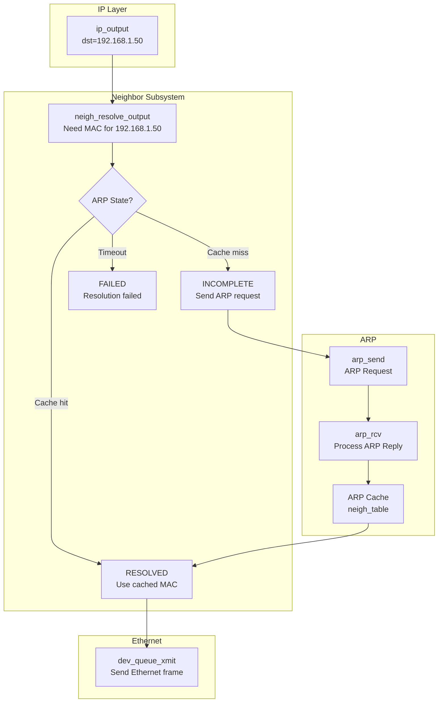
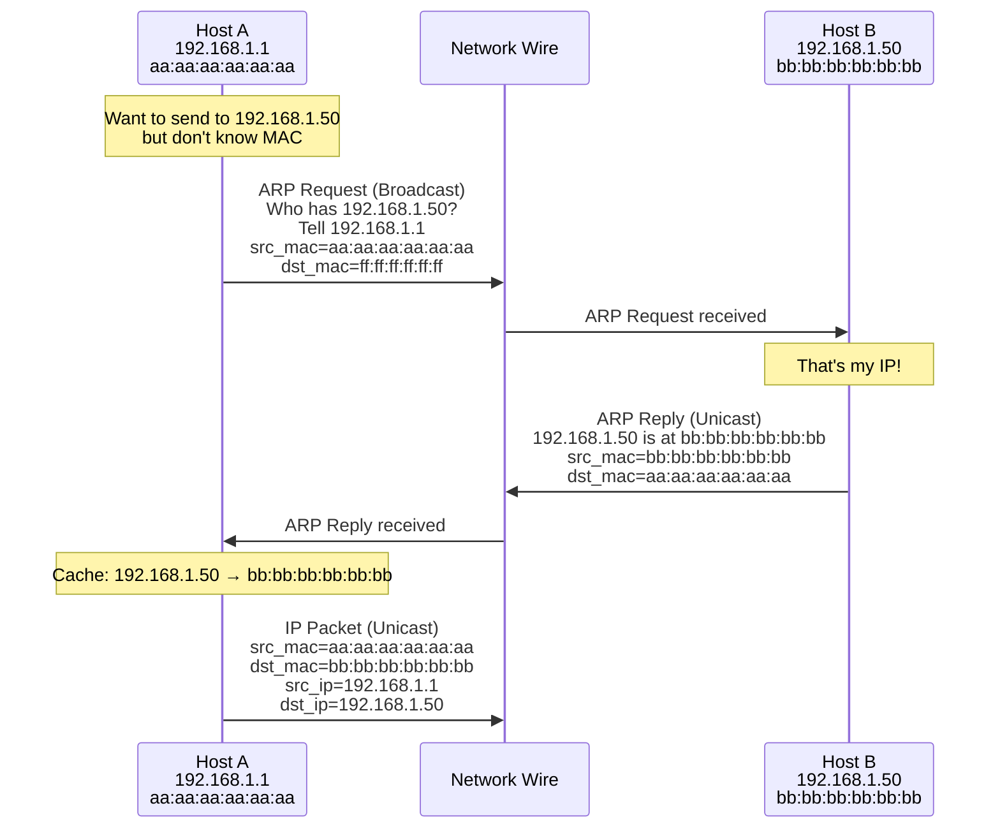
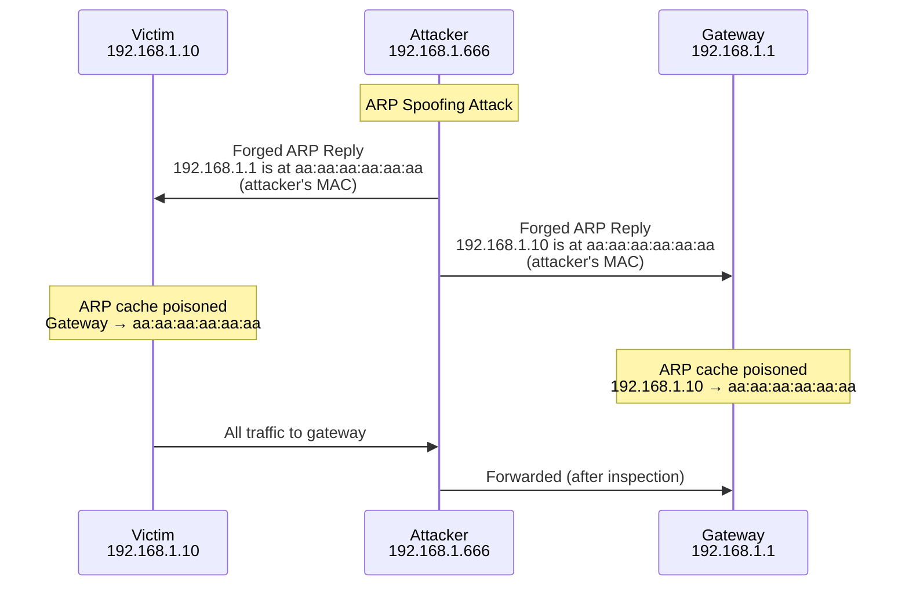
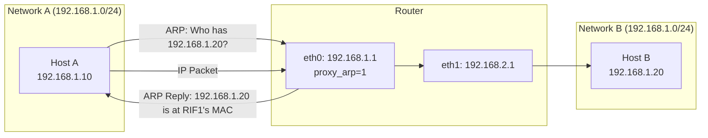

# Chapter 147: ARP — Address Resolution Protocol

## Introduction

The Address Resolution Protocol (ARP) is a fundamental protocol that bridges the gap between Layer 3 (network) and Layer 2 (link) addressing. When a host needs to send an IP packet to another host on the same local network, it knows the destination's IP address but not its MAC (hardware) address. ARP resolves this by mapping IP addresses to MAC addresses, enabling Ethernet frames to be delivered to the correct physical device.

ARP operates only on local network segments—it cannot cross routers. It is defined in RFC 826 and is one of the oldest and most critical protocols in the TCP/IP suite. Without ARP, IP packets would have no way to reach their physical destination on Ethernet-based networks.

In IPv6, ARP is replaced by the Neighbor Discovery Protocol (NDP), which uses ICMPv6 and operates somewhat differently. This chapter focuses on ARP (IPv4), though many concepts apply to NDP as well.

## Intuition: The Classroom Analogy

Imagine a classroom where everyone has a student ID number (IP address) and a name (MAC address). You know someone's student ID (192.168.1.50) but not their name. So you stand up and shout, "Who has student ID 192.168.1.50?" The person with that ID responds, "I do, and my name is aa:bb:cc:dd:ee:ff." Now you can address your notes directly to them by name.

This is exactly what ARP does:
1. **ARP Request**: Broadcast "Who has 192.168.1.50? Tell 192.168.1.1"
2. **ARP Reply**: Unicast "192.168.1.50 is at aa:bb:cc:dd:ee:ff"

The result is cached so you don't have to ask every time.

## ARP Packet Format

```
 0                   1                   2                   3
 0 1 2 3 4 5 6 7 8 9 0 1 2 3 4 5 6 7 8 9 0 1 2 3 4 5 6 7 8 9 0 1
├─┼─┼─┼─┼─┼─┼─┼─┼─┼─┼─┼─┼─┼─┼─┼─┼─┼─┼─┼─┼─┼─┼─┼─┼─┼─┼─┼─┼─┼─┼─┼─┤
│         Hardware Type (HTYPE)        │       Protocol Type (PTYPE)│
├─┼─┼─┼─┼─┼─┼─┼─┼─┼─┼─┼─┼─┼─┼─┼─┼─┼─┼─┼─┼─┼─┼─┼─┼─┼─┼─┼─┼─┼─┼─┼─┤
│  HW Addr Len (HLEN) │ Proto Addr Len│          Operation (OPER)  │
│                     │ (PLEN)        │                            │
├─┼─┼─┼─┼─┼─┼─┼─┼─┼─┼─┼─┼─┼─┼─┼─┼─┼─┼─┼─┼─┼─┼─┼─┼─┼─┼─┼─┼─┼─┼─┼─┤
│                   Sender Hardware Address (SHA)                   │
│                          (6 bytes for Ethernet)                   │
├─┼─┼─┼─┼─┼─┼─┼─┼─┼─┼─┼─┼─┼─┼─┼─┼─┼─┼─┼─┼─┼─┼─┼─┼─┼─┼─┼─┼─┼─┼─┼─┤
│                   Sender Protocol Address (SPA)                   │
│                          (4 bytes for IPv4)                       │
├─┼─┼─┼─┼─┼─┼─┼─┼─┼─┼─┼─┼─┼─┼─┼─┼─┼─┼─┼─┼─┼─┼─┼─┼─┼─┼─┼─┼─┼─┼─┼─┤
│                   Target Hardware Address (THA)                   │
│                          (6 bytes for Ethernet)                   │
├─┼─┼─┼─┼─┼─┼─┼─┼─┼─┼─┼─┼─┼─┼─┼─┼─┼─┼─┼─┼─┼─┼─┼─┼─┼─┼─┼─┼─┼─┼─┼─┤
│                   Target Protocol Address (TPA)                   │
│                          (4 bytes for IPv4)                       │
└─┴─┴─┴─┴─┴─┴─┴─┴─┴─┴─┴─┴─┴─┴─┴─┴─┴─┴─┴─┴─┴─┴─┴─┴─┴─┴─┴─┴─┴─┴─┴─┘
```

### Field Descriptions

| Field | Size | Description |
|-------|------|-------------|
| HTYPE | 16 bits | Hardware type (1 = Ethernet) |
| PTYPE | 16 bits | Protocol type (0x0800 = IPv4) |
| HLEN | 8 bits | Hardware address length (6 for Ethernet) |
| PLEN | 8 bits | Protocol address length (4 for IPv4) |
| OPER | 16 bits | Operation: 1 = Request, 2 = Reply |
| SHA | 48 bits | Sender hardware address |
| SPA | 32 bits | Sender protocol address |
| THA | 48 bits | Target hardware address (0 in requests) |
| TPA | 32 bits | Target protocol address |

## Architecture

### ARP in the Protocol Stack



### ARP Resolution Flow



## ARP Cache

### Viewing the ARP Cache

```bash
# Show ARP cache
ip neigh show
# or
arp -n

# Show entries for specific interface
ip neigh show dev eth0

# Show only reachable entries
ip neigh show nud reachable

# Detailed output
ip -s neigh show
```

### ARP Entry States

| State | Description |
|-------|-------------|
| `NUD_REACHABLE` | Confirmed reachable (recent communication) |
| `NUD_STALE` | Entry exists but not confirmed recently |
| `NUD_DELAY` | Waiting for upper-layer confirmation |
| `NUD_PROBE` | Actively probing (sending unicast ARP) |
| `NUD_FAILED` | Resolution failed |
| `NUD_INCOMPLETE` | ARP request sent, waiting for reply |
| `NUD_PERMANENT` | Static entry (won't expire) |
| `NUD_NOARP` | No ARP needed (e.g., loopback) |

### ARP Cache Management

```bash
# Add static ARP entry
ip neigh add 192.168.1.50 lladdr bb:bb:bb:bb:bb:bb dev eth0 nud permanent

# Delete ARP entry
ip neigh del 192.168.1.50 dev eth0

# Flush ARP cache
ip neigh flush all
ip neigh flush dev eth0

# Replace entry (add if missing)
ip neigh replace 192.168.1.50 lladdr bb:bb:bb:bb:bb:bb dev eth0 nud reachable

# Using arp command
arp -s 192.168.1.50 bb:bb:bb:bb:bb:bb
arp -d 192.168.1.50
```

### ARP Timeout Configuration

```bash
# Base reachable time (milliseconds)
sysctl net.ipv4.neigh.eth0.base_reachable_time
sysctl -w net.ipv4.neigh.eth0.base_reachable_time=30000

# Retransmit time (milliseconds)
sysctl net.ipv4.neigh.eth0.retrans_time
sysctl -w net.ipv4.neigh.eth0.retrans_time=1000

# GC (garbage collection) threshold
sysctl net.ipv4.neigh.eth0.gc_stale_time
sysctl -w net.ipv4.neigh.eth0.gc_stale_time=60

# Maximum number of ARP entries
sysctl net.ipv4.neigh.eth0.gc_thresh1  # Minimum (soft)
sysctl net.ipv4.neigh.eth0.gc_thresh2  # Soft limit
sysctl net.ipv4.neigh.eth0.gc_thresh3  # Hard limit (entries above this are dropped)
```

## Kernel Implementation

### Key Source Files

| File | Description |
|------|-------------|
| `net/core/neighbour.c` | Neighbor subsystem (shared by ARP and NDP) |
| `net/ipv4/arp.c` | ARP protocol implementation |
| `include/net/neighbour.h` | Neighbor data structures |
| `include/linux/if_arp.h` | ARP constants |

### Neighbor Data Structure

```c
/* include/net/neighbour.h (simplified) */

struct neighbour {
    struct hlist_node   hash;           /* Hash table linkage */
    struct net_device   *dev;           /* Associated device */
    struct neigh_table  *tbl;           /* Parent table */
    struct neigh_parms  *parms;         /* Parameters */
    unsigned long       confirmed;      /* Last confirmed time */
    unsigned long       updated;        /* Last updated time */
    rwlock_t            lock;
    refcnt_t            refcnt;
    struct sk_buff_head arp_queue;      /* Queued packets waiting for resolution */
    struct timer_list   timer;          /* ARP resolution timer */
    atomic_t            probes;         /* Number of probes sent */
    __u8                nud_state;      /* NUD state (reachable, stale, etc.) */
    __u8                type;           /* Neighbor type */
    __u8                dead;           /* Entry is being deleted */
    seqlock_t           ha_lock;
    unsigned char       ha[ALIGN(MAX_ADDR_LEN, sizeof(unsigned long))]; /* Hardware address */
    struct hh_cache     *hh;            /* Cached hardware header */
    int                 (*output)(struct neighbour *, struct sk_buff *);
    const struct neigh_ops *ops;
    struct rcu_head     rcu;
    struct list_head    gc_list;        /* GC list */
};

/* ARP-specific neighbor operations */
static const struct neigh_ops arp_hh_ops = {
    .family = AF_INET,
    .solicit = arp_solicit,         /* Send ARP request */
    .error_report = arp_error_report,
    .output = neigh_resolve_output,  /* Resolve and send */
    .connected_output = dev_queue_xmit, /* Fast path (already resolved) */
};
```

### ARP Hash Table

```c
/* ARP cache hash table */

struct neigh_table {
    struct neigh_table  *next;
    int                 family;
    int                 entry_size;
    int                 key_len;
    __u32               (*hash)(const void *pkey,
                                const struct net_device *dev,
                                __u32 *hash_rnd);
    int                 id;
    struct neigh_parms  parms;
    struct list_head    parms_list;
    int                 gc_interval;      /* GC interval (jiffies) */
    int                 gc_thresh1;       /* Soft limit */
    int                 gc_thresh2;       /* Medium limit */
    int                 gc_thresh3;       /* Hard limit */
    unsigned long       last_flush;       /* Last GC run */
    struct delayed_work gc_work;
    struct timer_list   proxy_timer;
    struct sk_buff_head proxy_queue;
    atomic_t            entries;          /* Current number of entries */
    rwlock_t            lock;
    unsigned long       last_rand;
    struct neigh_statistics __percpu *stats;
    struct neigh_hash_table __rcu *nht;   /* Hash table */
};

/* Hash function for ARP */
static u32 arp_hash(const void *pkey, const struct net_device *dev,
                    __u32 *hash_rnd)
{
    u32 key = *(const u32 *)pkey;
    u32 val = key ^ hash_32(dev->ifindex, HASH_BITS_NO_MASK);
    return val & HASH_BITS_NO_MASK;
}
```

### ARP Packet Processing

```c
/* net/ipv4/arp.c - Simplified ARP receive */

static int arp_rcv(struct sk_buff *skb, struct net_device *dev,
                   struct packet_type *pt, struct net_device *orig_dev)
{
    struct arphdr *arp;

    /* Validate minimum size */
    if (!pskb_may_pull(skb, arp_hdr_len(dev)))
        goto freeskb;

    arp = arp_hdr(skb);

    /* Validate ARP header */
    if (arp->ar_hln != dev->addr_len ||
        arp->ar_pro != htons(ETH_P_IP) ||
        arp->ar_pln != 4)
        goto freeskb;

    /* Only process Ethernet + IPv4 ARP */
    if (arp->ar_hrd != htons(ARPHRD_ETHER))
        goto freeskb;

    switch (ntohs(arp->ar_op)) {
    case ARPOP_REQUEST:
        return arp_process(skb);
    case ARPOP_REPLY:
        return arp_process(skb);
    }

freeskb:
    kfree_skb(skb);
    return 0;
}

/* Process an ARP packet */
static int arp_process(struct sk_buff *skb)
{
    struct net_device *dev = skb->dev;
    struct in_device *in_dev = __in_dev_get_rcu(dev);
    struct arphdr *arp = arp_hdr(skb);
    unsigned char *arp_ptr = (unsigned char *)(arp + 1);
    __be32 sip, tip;
    struct neighbour *n;

    /* Extract addresses */
    memcpy(&sip, arp_ptr + dev->addr_len, 4);
    memcpy(&tip, arp_ptr + dev->addr_len + 4 + dev->addr_len, 4);

    /* Update neighbor table with sender's info */
    n = __neigh_lookup(&arp_tbl, &sip, dev, 1);
    if (n) {
        neigh_update(n, arp_ptr, NUD_STALE,
                     NEIGH_UPDATE_F_OVERRIDE);
        neigh_release(n);
    }

    /* Is this ARP request for us? */
    if (arp->ar_op == htons(ARPOP_REQUEST)) {
        if (inet_addr_type_dev_table(dev_net(dev), dev, tip) ==
            RTN_LOCAL) {
            /* Send ARP reply */
            arp_send(ARPOP_REPLY, ETH_P_ARP, sip, dev, tip,
                     arp_ptr, dev->dev_addr, arp_ptr);
            return 0;
        }
    }

    kfree_skb(skb);
    return 0;
}
```

### ARP Solicitation (Sending ARP Requests)

```c
/* net/core/neighbour.c - ARP solicitation */

static void arp_solicit(struct neighbour *neigh, struct sk_buff *skb)
{
    __be32 target = *(__be32 *)neigh->primary_key;
    int probes = atomic_read(&neigh->probes);

    /* Check if we've exceeded max probes */
    if (probes >= neigh->parms->ucast_probes +
        neigh->parms->app_probes)
        return;

    /* Send ARP request */
    arp_send(ARPOP_REQUEST, ETH_P_ARP, target, neigh->dev,
             target,           /* Target IP */
             neigh->dev->dev_addr, /* Source MAC */
             NULL,             /* Target MAC (broadcast) */
             NULL);            /* Destination MAC (broadcast) */

    atomic_inc(&neigh->probes);
}
```

## Gratuitous ARP

A gratuitous ARP is an ARP packet sent without being prompted by an ARP request. It is used for:

1. **IP address conflict detection**: When a host configures an IP, it sends a gratuitous ARP to check if anyone else has the same address
2. **MAC address updates**: Informing other hosts that an IP-to-MAC mapping has changed
3. **Failover scenarios**: When a backup server takes over a virtual IP, it sends gratuitous ARP to update neighbors' caches

### Sending Gratuitous ARP

```bash
# Using arping (send gratuitous ARP)
arping -c 1 -U -I eth0 192.168.1.100
arping -c 1 -A -I eth0 192.168.1.100

# Using ip command
ip neigh add 192.168.1.100 lladdr $(cat /sys/class/net/eth0/address) \
    dev eth0 nud permanent
```

```c
/* Sending gratuitous ARP in C */

#include <stdio.h>
#include <stdlib.h>
#include <string.h>
#include <unistd.h>
#include <sys/socket.h>
#include <sys/ioctl.h>
#include <net/if.h>
#include <net/ethernet.h>
#include <netinet/in.h>
#include <linux/if_packet.h>
#include <linux/if_arp.h>
#include <arpa/inet.h>

struct arp_packet {
    struct arphdr hdr;
    unsigned char sha[ETH_ALEN];  /* Sender hardware address */
    unsigned char spa[4];          /* Sender protocol address */
    unsigned char tha[ETH_ALEN];  /* Target hardware address */
    unsigned char tpa[4];          /* Target protocol address */
};

int main(int argc, char *argv[])
{
    if (argc < 3) {
        fprintf(stderr, "Usage: %s <interface> <ip>\n", argv[0]);
        exit(EXIT_FAILURE);
    }

    const char *ifname = argv[1];
    const char *ip_str = argv[2];

    int sockfd = socket(AF_PACKET, SOCK_RAW, htons(ETH_P_ARP));
    if (sockfd < 0) {
        perror("socket");
        exit(EXIT_FAILURE);
    }

    /* Get interface info */
    struct ifreq ifr;
    strncpy(ifr.ifr_name, ifname, IFNAMSIZ);
    ioctl(sockfd, SIOCGIFHWADDR, &ifr);
    unsigned char *src_mac = (unsigned char *)ifr.ifr_hwaddr.sa_data;

    ioctl(sockfd, SIOCGIFINDEX, &ifr);
    int ifindex = ifr.ifr_ifindex;

    /* Build Ethernet header */
    unsigned char frame[42]; /* 14 ETH + 28 ARP */
    struct ether_header *eth = (struct ether_header *)frame;

    /* Destination: broadcast */
    memset(eth->ether_dhost, 0xFF, ETH_ALEN);
    memcpy(eth->ether_shost, src_mac, ETH_ALEN);
    eth->ether_type = htons(ETH_P_ARP);

    /* Build ARP packet */
    struct arp_packet *arp = (struct arp_packet *)(frame + 14);
    arp->hdr.ar_hrd = htons(ARPHRD_ETHER);
    arp->hdr.ar_pro = htons(ETH_P_IP);
    arp->hdr.ar_hln = ETH_ALEN;
    arp->hdr.ar_pln = 4;
    arp->hdr.ar_op = htons(ARPOP_REQUEST);

    memcpy(arp->sha, src_mac, ETH_ALEN);
    inet_pton(AF_INET, ip_str, arp->spa);
    memset(arp->tha, 0x00, ETH_ALEN);
    inet_pton(AF_INET, ip_str, arp->tpa);

    /* Send */
    struct sockaddr_ll addr;
    memset(&addr, 0, sizeof(addr));
    addr.sll_ifindex = ifindex;
    addr.sll_halen = ETH_ALEN;
    memset(addr.sll_addr, 0xFF, ETH_ALEN);

    ssize_t sent = sendto(sockfd, frame, sizeof(frame), 0,
                          (struct sockaddr *)&addr, sizeof(addr));
    if (sent < 0)
        perror("sendto");
    else
        printf("Sent gratuitous ARP for %s\n", ip_str);

    close(sockfd);
    return 0;
}
```

## ARP Spoofing and Defense

### ARP Spoofing Attack

ARP is inherently insecure—there is no authentication in ARP replies. An attacker can send forged ARP replies to poison the ARP cache of other hosts, redirecting traffic through the attacker's machine (Man-in-the-Middle attack).



### Defense Mechanisms

#### Static ARP Entries

```bash
# Set static ARP entries for critical hosts
ip neigh add 192.168.1.1 lladdr 00:11:22:33:44:55 dev eth0 nud permanent

# Or using arp command
arp -s 192.168.1.1 00:11:22:33:44:55
```

#### ARP Inspection with arptables

```bash
# Install arptables
# apt install arptables

# Allow ARP only from known MAC addresses
arptables -A INPUT --src-mac ! 00:11:22:33:44:55 -j DROP

# Allow ARP only for known IP addresses
arptables -A INPUT --source-ip ! 192.168.1.1 -j DROP
```

#### Dynamic ARP Inspection (DAI)

On managed switches, DAI validates ARP packets against a DHCP snooping database:

```bash
# On Cisco switches (example)
# ip arp inspection vlan 100
# ip arp inspection validate src-mac dst-mac ip
```

#### Kernel ARP Settings

```bash
# Filter ARP from non-routed subnets
echo 1 > /proc/sys/net/ipv4/conf/all/arp_filter

# Ignore ARP for addresses not on the local subnet
echo 1 > /proc/sys/net/ipv4/conf/all/arp_ignore

# Use the best local address for ARP replies
echo 2 > /proc/sys/net/ipv4/conf/all/arp_announce

# Don't reply to ARP for addresses on other interfaces
# 0 = reply for any local address (default)
# 1 = reply only if target IP is on the incoming interface
# 2 = reply only if target IP is on the incoming subnet
sysctl -w net.ipv4.conf.all.arp_ignore=1

# Announce mode
# 0 = use any local address (default)
# 1 = avoid using addresses on other subnets
# 2 = use the best primary address
sysctl -w net.ipv4.conf.all.arp_announce=2
```

## ARP Monitoring

### Monitoring Tools

```bash
# Watch ARP cache changes
ip monitor neigh

# Continuous ARP table display
watch -n 1 'ip neigh show'

# Capture ARP packets
tcpdump -i eth0 arp

# Verbose ARP capture
tcpdump -i eth0 -e arp -n

# Using arping for active probing
arping -c 5 -I eth0 192.168.1.1
```

### ARP Statistics

```bash
# ARP-related /proc entries
cat /proc/net/arp

# Neighbor subsystem statistics
cat /proc/net/stat/arp_cache

# Per-interface ARP settings
cat /proc/sys/net/ipv4/neigh/eth0/base_reachable_time
cat /proc/sys/net/ipv4/neigh/eth0/gc_stale_time
cat /proc/sys/net/ipv4/neigh/eth0/ucast_probes
cat /proc/sys/net/ipv4/neigh/eth0/mcast_solicit
```

## Proxy ARP

Proxy ARP allows a router to answer ARP requests on behalf of another host. This is useful when hosts on different physical networks share the same IP subnet.

```bash
# Enable proxy ARP on an interface
echo 1 > /proc/sys/net/ipv4/conf/eth0/proxy_arp

# Or with ip command
ip link set eth0 arp on
```



## Common Pitfalls

1. **ARP cache overflow**: On large networks, the ARP cache can fill up. Increase `gc_thresh3`.
2. **Duplicate IP detection**: If two hosts have the same IP, ARP behavior is unpredictable.
3. **Firewall blocking ARP**: Some firewall configurations accidentally block ARP, breaking connectivity.
4. **Proxy ARP confusion**: Enabling proxy ARP when not needed can cause unexpected routing behavior.
5. **Static ARP maintenance**: Static entries don't update when MAC addresses change (e.g., NIC replacement).
6. **VLAN and ARP**: ARP broadcasts are confined to the VLAN; hosts on different VLANs can't ARP each other.
7. **ARP and bonding**: Bonding interfaces have special ARP handling; misconfiguration can break failover.

## Best Practices

1. **Use static ARP for critical infrastructure**: Gateways, DNS servers, and important hosts
2. **Monitor ARP cache**: Watch for unexpected entries that might indicate spoofing
3. **Set appropriate timeouts**: Balance between cache freshness and network overhead
4. **Enable `arp_ignore` and `arp_announce`**: On servers with multiple interfaces
5. **Use DAI on managed switches**: For enterprise environments
6. **Log ARP changes**: Monitor for gratuitous ARP from unknown sources
7. **Keep ARP cache sizes reasonable**: Tune `gc_thresh` values for your network size

## Exercises

1. **ARP capture**: Use `tcpdump` to capture ARP traffic on your local network. Identify ARP requests and replies, and map IP addresses to MAC addresses.

2. **ARP table monitor**: Write a program that monitors the ARP table for changes and logs additions, deletions, and modifications.

3. **ARP spoofing detector**: Build a tool that detects ARP spoofing by monitoring for multiple IP addresses claiming the same MAC address.

4. **Gratuitous ARP**: Write a program that sends gratuitous ARP announcements when an interface comes up, and verify that other hosts update their caches.

5. **Proxy ARP lab**: Set up proxy ARP between two networks and verify that hosts on different physical networks can communicate.

6. **ARP stress test**: Write a tool that generates large numbers of ARP requests and measures the kernel's ARP processing performance.

## References

1. RFC 826: An Ethernet Address Resolution Protocol
2. RFC 5227: IPv4 Address Conflict Detection
3. Linux kernel source: `net/ipv4/arp.c`, `net/core/neighbour.c`
4. Linux man pages: `arp(7)`, `ip-neighbour(8)`
5. Stevens, W. R. *TCP/IP Illustrated, Volume 1*, Chapter 4: "ARP"
6. Linux kernel documentation: `Documentation/networking/ip-sysctl.rst`
