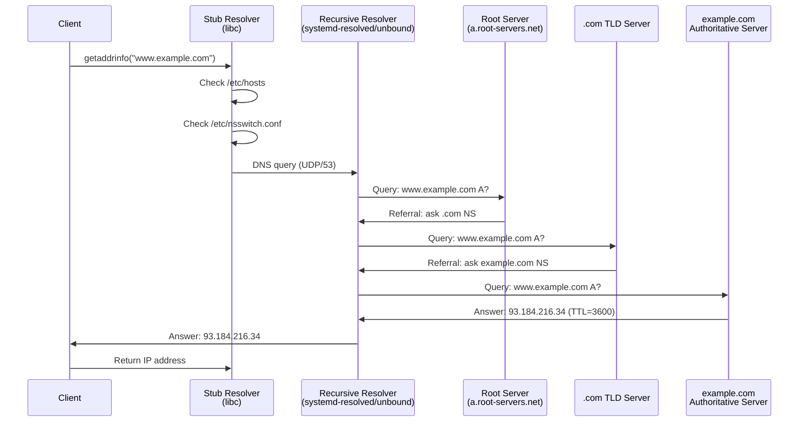
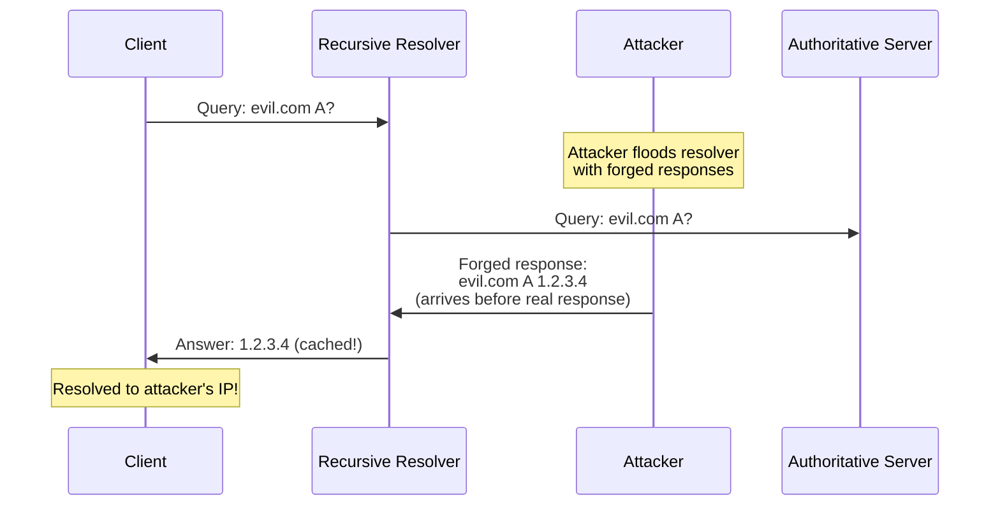

# Chapter 148: DNS — Domain Name System

## Introduction

The Domain Name System (DNS) is the hierarchical, decentralized naming system that translates human-readable domain names (like `www.example.com`) into IP addresses (like `93.184.216.34`). It is one of the most critical infrastructure services on the Internet—without DNS, users would need to memorize IP addresses for every service they access. DNS handles billions of queries daily and is designed for high availability, scalability, and extensibility.

On Linux, DNS resolution involves multiple components working together: the resolver library (part of glibc), configuration files (`/etc/resolv.conf`, `/etc/nsswitch.conf`), caching resolvers (systemd-resolved, dnsmasq, unbound), and authoritative servers (BIND, NSD, Knot). Understanding how these pieces fit together is essential for troubleshooting connectivity issues, optimizing performance, and securing name resolution.

## Intuition: The Phone Book Analogy

DNS is like a distributed phone book:
- **Domain name** = Person's name (e.g., "John Smith")
- **IP address** = Phone number (e.g., "+1-555-123-4567")
- **DNS resolver** = Directory assistance (411 in the US)
- **Authoritative server** = The actual phone book for a specific area
- **Recursive resolver** = A helpful librarian who looks up the answer for you
- **TTL** = How long you can remember the number before looking it up again

When you type `www.example.com` in a browser:
1. Your computer asks the recursive resolver: "What's the IP for www.example.com?"
2. The resolver asks the root servers: "Who handles .com?"
3. The root says: "Ask the .com servers."
4. The resolver asks the .com servers: "Who handles example.com?"
5. The .com servers say: "Ask the example.com servers."
6. The resolver asks the example.com servers: "What's the IP for www.example.com?"
7. The answer comes back: "93.184.216.34"
8. The resolver caches the answer and tells your computer.

## DNS Architecture

### Hierarchical Name Space

```mermaid
graph TB
    ROOT["." (Root)<br/>13 root server clusters<br/>a.root-servers.net ... m.root-servers.net"]

    ROOT --> COM[".com<br/>gTLD"]
    ROOT --> ORG[".org<br/>gTLD"]
    ROOT --> NET[".net<br/>gTLD"]
    ROOT --> UK[".uk<br/>ccTLD"]
    ROOT --> CN[".cn<br/>ccTLD"]

    COM --> EXAMPLE["example.com<br/>Authoritative NS"]
    COM --> GOOGLE["google.com<br/>Authoritative NS"]
    ORG --> WIKIPEDIA["wikipedia.org<br/>Authoritative NS"]

    EXAMPLE --> WWW["www.example.com<br/>A: 93.184.216.34"]
    EXAMPLE --> MAIL["mail.example.com<br/>MX: mail.example.com"]
    EXAMPLE --> NS1["ns1.example.com<br/>NS records"]
```

### Resolution Flow



## DNS Message Format

### Header

```
 0                   1                   2                   3
 0 1 2 3 4 5 6 7 8 9 0 1 2 3 4 5 6 7 8 9 0 1 2 3 4 5 6 7 8 9 0 1
├─┼─┼─┼─┼─┼─┼─┼─┼─┼─┼─┼─┼─┼─┼─┼─┼─┼─┼─┼─┼─┼─┼─┼─┼─┼─┼─┼─┼─┼─┼─┼─┤
│                      Transaction ID (16 bits)                    │
├─┼─┼─┼─┼─┼─┼─┼─┼─┼─┼─┼─┼─┼─┼─┼─┼─┼─┼─┼─┼─┼─┼─┼─┼─┼─┼─┼─┼─┼─┼─┼─┤
│QR│   Opcode  │AA│TC│RD│RA│   Z    │       RCODE                 │
├─┼─┼─┼─┼─┼─┼─┼─┼─┼─┼─┼─┼─┼─┼─┼─┼─┼─┼─┼─┼─┼─┼─┼─┼─┼─┼─┼─┼─┼─┼─┼─┤
│                    QDCOUNT (Questions)                           │
├─┼─┼─┼─┼─┼─┼─┼─┼─┼─┼─┼─┼─┼─┼─┼─┼─┼─┼─┼─┼─┼─┼─┼─┼─┼─┼─┼─┼─┼─┼─┼─┤
│                    ANCOUNT (Answers)                             │
├─┼─┼─┼─┼─┼─┼─┼─┼─┼─┼─┼─┼─┼─┼─┼─┼─┼─┼─┼─┼─┼─┼─┼─┼─┼─┼─┼─┼─┼─┼─┼─┤
│                    NSCOUNT (Authority)                           │
├─┼─┼─┼─┼─┼─┼─┼─┼─┼─┼─┼─┼─┼─┼─┼─┼─┼─┼─┼─┼─┼─┼─┼─┼─┼─┼─┼─┼─┼─┼─┼─┤
│                    ARCOUNT (Additional)                          │
└─┴─┴─┴─┴─┴─┴─┴─┴─┴─┴─┴─┴─┴─┴─┴─┴─┴─┴─┴─┴─┴─┴─┴─┴─┴─┴─┴─┴─┴─┴─┴─┘
```

### Common Record Types

| Type | Code | Description | Example |
|------|------|-------------|---------|
| A | 1 | IPv4 address | `example.com. IN A 93.184.216.34` |
| AAAA | 28 | IPv6 address | `example.com. IN AAAA 2606:2800:220:1:...` |
| CNAME | 5 | Canonical name (alias) | `www.example.com. IN CNAME example.com.` |
| MX | 15 | Mail exchange | `example.com. IN MX 10 mail.example.com.` |
| NS | 2 | Name server | `example.com. IN NS ns1.example.com.` |
| PTR | 12 | Pointer (reverse DNS) | `34.216.184.93.in-addr.arpa. IN PTR example.com.` |
| SOA | 6 | Start of authority | Zone serial, refresh, retry, expire |
| TXT | 16 | Text record | `example.com. IN TXT "v=spf1 include:..."` |
| SRV | 33 | Service locator | `_sip._tcp.example.com. IN SRV 10 60 5060 sip.example.com.` |
| CAA | 257 | Certificate Authority Authorization | `example.com. IN CAA 0 issue "letsencrypt.org"` |

## Linux Resolution Configuration

### /etc/nsswitch.conf

The Name Service Switch (NSS) configuration determines the order and sources for name resolution:

```bash
# /etc/nsswitch.conf
# Typical Linux configuration
hosts: files dns myhostname

# Options:
# files    - /etc/hosts
# dns      - DNS servers from /etc/resolv.conf
# myhostname - systemd hostname resolution
# mdns4    - mDNS (Avahi/Bonjour)
# wins     - WINS (NetBIOS, Samba)
```

### /etc/resolv.conf

```bash
# /etc/resolv.conf
# DNS resolver configuration

# Primary and secondary DNS servers
nameserver 8.8.8.8
nameserver 8.8.4.4

# Search domains (append to short names)
search example.com internal.example.com

# Options
options timeout:2 attempts:3 rotate single-request-reopen
```

### Resolution Order

```mermaid
flowchart TB
    APP[Application calls<br/>getaddrinfo]
    NSS[NSS: hosts: files dns myhostname]

    NSS --> FILES{Check /etc/hosts}
    FILES -->|Found| RETURN1[Return result]
    FILES -->|Not found| DNS{Check DNS}

    DNS --> STUB[Stub resolver<br/>libc getaddrinfo]
    STUB --> RESOLV[/etc/resolv.conf<br/>nameserver 8.8.8.8]
    RESOLV --> QUERY[Send DNS query<br/>UDP/TCP port 53]

    QUERY --> CACHE{Cache hit?}
    CACHE -->|Yes| RETURN2[Return cached result]
    CACHE -->|No| RECURSIVE[Recursive resolution]

    RECURSIVE --> RETURN3[Return result]
    RETURN3 --> CACHE2[Cache result<br/>(TTL)]
```

### systemd-resolved

Modern Linux distributions often use `systemd-resolved` as the caching resolver:

```bash
# Check systemd-resolved status
resolvectl status

# Query DNS
resolvectl query www.example.com
resolvectl query -t MX example.com

# Flush cache
resolvectl flush-caches

# Configuration in /etc/systemd/resolved.conf
[Resolve]
DNS=8.8.8.8 8.8.4.4
FallbackDNS=1.1.1.1
Domains=~.
DNSSEC=allow-downgrade
DNSOverTLS=opportunistic
Cache=yes
```

## DNS Client Programming

### Using getaddrinfo()

```c
#include <stdio.h>
#include <stdlib.h>
#include <string.h>
#include <netdb.h>
#include <arpa/inet.h>
#include <sys/socket.h>

int main(int argc, char *argv[])
{
    if (argc < 2) {
        fprintf(stderr, "Usage: %s <hostname>\n", argv[0]);
        exit(EXIT_FAILURE);
    }

    struct addrinfo hints, *result, *rp;
    int ret;

    memset(&hints, 0, sizeof(hints));
    hints.ai_family = AF_UNSPEC;      /* IPv4 or IPv6 */
    hints.ai_socktype = SOCK_STREAM;  /* TCP */
    hints.ai_flags = AI_ADDRCONFIG;   /* Only return addresses we can use */

    ret = getaddrinfo(argv[1], NULL, &hints, &result);
    if (ret != 0) {
        fprintf(stderr, "getaddrinfo: %s\n", gai_strerror(ret));
        exit(EXIT_FAILURE);
    }

    printf("Addresses for %s:\n", argv[1]);
    for (rp = result; rp != NULL; rp = rp->ai_next) {
        char addr_str[INET6_ADDRSTRLEN];
        void *addr;

        if (rp->ai_family == AF_INET) {
            addr = &((struct sockaddr_in *)rp->ai_addr)->sin_addr;
            printf("  IPv4: %s\n",
                   inet_ntop(AF_INET, addr, addr_str, sizeof(addr_str)));
        } else if (rp->ai_family == AF_INET6) {
            addr = &((struct sockaddr_in6 *)rp->ai_addr)->sin6_addr;
            printf("  IPv6: %s\n",
                   inet_ntop(AF_INET6, addr, addr_str, sizeof(addr_str)));
        }
    }

    freeaddrinfo(result);
    return 0;
}
```

### Reverse DNS Lookup

```c
#include <stdio.h>
#include <stdlib.h>
#include <string.h>
#include <netdb.h>
#include <arpa/inet.h>
#include <sys/socket.h>

int main(int argc, char *argv[])
{
    if (argc < 2) {
        fprintf(stderr, "Usage: %s <ip-address>\n", argv[0]);
        exit(EXIT_FAILURE);
    }

    struct sockaddr_storage addr;
    socklen_t addr_len;

    memset(&addr, 0, sizeof(addr));

    /* Try IPv4 first */
    struct sockaddr_in *sa4 = (struct sockaddr_in *)&addr;
    if (inet_pton(AF_INET, argv[1], &sa4->sin_addr) == 1) {
        sa4->sin_family = AF_INET;
        addr_len = sizeof(struct sockaddr_in);
    } else {
        /* Try IPv6 */
        struct sockaddr_in6 *sa6 = (struct sockaddr_in6 *)&addr;
        if (inet_pton(AF_INET6, argv[1], &sa6->sin6_addr) == 1) {
            sa6->sin6_family = AF_INET6;
            addr_len = sizeof(struct sockaddr_in6);
        } else {
            fprintf(stderr, "Invalid address: %s\n", argv[1]);
            exit(EXIT_FAILURE);
        }
    }

    char host[NI_MAXHOST];
    int ret = getnameinfo((struct sockaddr *)&addr, addr_len,
                          host, sizeof(host), NULL, 0, 0);
    if (ret != 0) {
        fprintf(stderr, "getnameinfo: %s\n", gai_strerror(ret));
        exit(EXIT_FAILURE);
    }

    printf("%s → %s\n", argv[1], host);
    return 0;
}
```

### Raw DNS Query

```c
/*
 * dns_query.c - Send a raw DNS query over UDP
 */

#include <stdio.h>
#include <stdlib.h>
#include <string.h>
#include <unistd.h>
#include <sys/socket.h>
#include <netinet/in.h>
#include <arpa/inet.h>

#define DNS_PORT 53
#define DNS_SERVER "8.8.8.8"
#define BUF_SIZE 512

/* DNS header */
struct dns_header {
    uint16_t id;
    uint16_t flags;
    uint16_t qdcount;
    uint16_t ancount;
    uint16_t nscount;
    uint16_t arcount;
};

/* Encode domain name in DNS format */
static int encode_name(const char *domain, unsigned char *buf)
{
    const char *p = domain;
    unsigned char *len_ptr = buf;
    int total = 0;

    while (*p) {
        const char *dot = strchr(p, '.');
        int label_len = dot ? (int)(dot - p) : (int)strlen(p);

        *len_ptr = label_len;
        memcpy(len_ptr + 1, p, label_len);
        len_ptr += label_len + 1;
        total += label_len + 1;

        p += label_len;
        if (*p == '.')
            p++;
    }
    *len_ptr = 0;  /* Root label */
    total++;

    return total;
}

int main(int argc, char *argv[])
{
    if (argc < 2) {
        fprintf(stderr, "Usage: %s <domain>\n", argv[0]);
        exit(EXIT_FAILURE);
    }

    const char *domain = argv[1];
    unsigned char buf[BUF_SIZE];
    int offset = 0;

    /* Build DNS query */
    struct dns_header *dns = (struct dns_header *)buf;
    dns->id = htons(0x1234);
    dns->flags = htons(0x0100);  /* Standard query, RD=1 */
    dns->qdcount = htons(1);
    dns->ancount = 0;
    dns->nscount = 0;
    dns->arcount = 0;

    offset = sizeof(struct dns_header);

    /* Question section */
    offset += encode_name(domain, buf + offset);

    /* QTYPE: A record */
    buf[offset++] = 0x00;
    buf[offset++] = 0x01;

    /* QCLASS: IN (Internet) */
    buf[offset++] = 0x00;
    buf[offset++] = 0x01;

    /* Send the query */
    int sockfd = socket(AF_INET, SOCK_DGRAM, 0);
    if (sockfd < 0) {
        perror("socket");
        exit(EXIT_FAILURE);
    }

    struct sockaddr_in dest;
    memset(&dest, 0, sizeof(dest));
    dest.sin_family = AF_INET;
    dest.sin_port = htons(DNS_PORT);
    inet_pton(AF_INET, DNS_SERVER, &dest.sin_addr);

    ssize_t sent = sendto(sockfd, buf, offset, 0,
                          (struct sockaddr *)&dest, sizeof(dest));
    if (sent < 0) {
        perror("sendto");
        close(sockfd);
        exit(EXIT_FAILURE);
    }

    printf("Sent DNS query for %s to %s (%zd bytes)\n",
           domain, DNS_SERVER, sent);

    /* Receive response */
    socklen_t dest_len = sizeof(dest);
    ssize_t n = recvfrom(sockfd, buf, BUF_SIZE, 0,
                         (struct sockaddr *)&dest, &dest_len);
    if (n < 0) {
        perror("recvfrom");
        close(sockfd);
        exit(EXIT_FAILURE);
    }

    printf("Received %zd bytes\n", n);

    /* Parse response header */
    dns = (struct dns_header *)buf;
    printf("Response: id=0x%04x flags=0x%04x answers=%d\n",
           ntohs(dns->id), ntohs(dns->flags), ntohs(dns->ancount));

    close(sockfd);
    return 0;
}
```

## DNS Tools

### dig (Domain Information Groper)

```bash
# Basic A record lookup
dig www.example.com

# Query specific record type
dig example.com MX
dig example.com AAAA
dig example.com NS
dig example.com TXT
dig example.com SOA

# Query specific DNS server
dig @8.8.8.8 www.example.com

# Short output (just the answer)
dig +short www.example.com

# Trace the full resolution path
dig +trace www.example.com

# Reverse DNS
dig -x 93.184.216.34

# Check DNSSEC
dig +dnssec example.com

# TCP query (instead of UDP)
dig +tcp www.example.com

# Query with specific source IP
dig -b 192.168.1.100 @8.8.8.8 www.example.com
```

### nslookup

```bash
# Basic lookup
nslookup www.example.com

# Query specific server
nslookup www.example.com 8.8.8.8

# Query specific record type
nslookup -type=MX example.com
nslookup -type=AAAA example.com

# Interactive mode
nslookup
> set type=MX
> example.com
> exit
```

### host

```bash
# Simple lookup
host www.example.com

# Mail servers
host -t MX example.com

# Name servers
host -t NS example.com

# Reverse lookup
host 93.184.216.34

# Verbose output
host -v www.example.com
```

## BIND (Berkeley Internet Name Domain)

BIND is the most widely used DNS server software on Linux.

### Basic BIND Configuration

```bash
# /etc/named.conf (or /etc/bind/named.conf)

options {
    directory "/var/named";
    listen-on { 127.0.0.1; 192.168.1.1; };
    listen-on-v6 { ::1; };
    allow-query { localhost; 192.168.1.0/24; };
    recursion yes;
    allow-recursion { localhost; 192.168.1.0/24; };

    # Forwarders
    forwarders {
        8.8.8.8;
        8.8.4.4;
    };
    forward first;

    # Security
    dnssec-validation auto;
    rate-limit { responses-per-second 10; };
};

# Root hints
zone "." IN {
    type hint;
    file "named.ca";
};

# Forward zone
zone "example.com" IN {
    type master;
    file "example.com.zone";
    allow-transfer { 192.168.1.2; };
};

# Reverse zone
zone "1.168.192.in-addr.arpa" IN {
    type master;
    file "192.168.1.rev";
};
```

### Zone File

```bash
; /var/named/example.com.zone
$TTL 3600
@   IN  SOA ns1.example.com. admin.example.com. (
            2024010101  ; Serial (YYYYMMDDNN)
            3600        ; Refresh (1 hour)
            900         ; Retry (15 minutes)
            604800      ; Expire (1 week)
            86400       ; Minimum TTL (1 day)
        )

; Name servers
@       IN  NS  ns1.example.com.
@       IN  NS  ns2.example.com.

; A records
ns1     IN  A   192.168.1.1
ns2     IN  A   192.168.1.2
@       IN  A   93.184.216.34
www     IN  A   93.184.216.34
mail    IN  A   93.184.216.35

; CNAME records
ftp     IN  CNAME   www.example.com.

; MX records
@       IN  MX  10 mail.example.com.
@       IN  MX  20 mail2.example.com.

; TXT records (SPF, DKIM, etc.)
@       IN  TXT "v=spf1 mx a ip4:93.184.216.0/24 ~all"

; AAAA records
www     IN  AAAA 2606:2800:220:1:248:1893:25c8:1946
```

## DNSSEC

DNSSEC (DNS Security Extensions) adds cryptographic signatures to DNS records, allowing resolvers to verify that responses are authentic and haven't been tampered with.

### DNSSEC Chain of Trust

```mermaid
graph TB
    ROOT_KSK[Root KSK<br/>(Key Signing Key)]
    ROOT_ZSK[Root ZSK<br/>(Zone Signing Key)]
    ROOT_DS[Root DS<br/>(Delegation Signer)]

    COM_KSK[".com KSK"]
    COM_ZSK[".com ZSK"]
    COM_DS[".com DS"]

    EX_KSK["example.com KSK"]
    EX_ZSK["example.com ZSK"]

    ROOT_KSK --> ROOT_ZSK
    ROOT_ZSK --> ROOT_DS
    ROOT_DS --> COM_KSK
    COM_KSK --> COM_ZSK
    COM_ZSK --> COM_DS
    COM_DS --> EX_KSK
    EX_KSK --> EX_ZSK
    EX_ZSK --> RRSIG["RRSIG records<br/>for example.com"]
```

### DNSSEC Validation

```bash
# Check DNSSEC status
dig +dnssec example.com
dig +dnssec +multi example.com DNSKEY

# Verify DS record
dig example.com DS

# Check validation with delv (DNSSEC validator)
delv @8.8.8.8 www.example.com

# systemd-resolved DNSSEC settings
# /etc/systemd/resolved.conf
[Resolve]
DNSSEC=yes          # Enforce DNSSEC validation
DNSSEC=allow-downgrade  # Fallback to insecure if needed
DNSSEC=no           # Disable DNSSEC
```

### DNSSEC Record Types

| Type | Description |
|------|-------------|
| RRSIG | Signature for a record set |
| DNSKEY | Public key for a zone |
| DS | Delegation Signer (hash of child's KSK) |
| NSEC | Next Secure (authenticated denial of existence) |
| NSEC3 | NSEC with hashed names (zone walking prevention) |
| CDNSKEY | Child DNSKEY (for KSK rollover) |
| CDS | Child DS |

## DNS over TLS / DNS over HTTPS

### DNS over TLS (DoT)

```bash
# systemd-resolved DoT configuration
# /etc/systemd/resolved.conf
[Resolve]
DNS=1.1.1.1#cloudflare-dns.com
DNSOverTLS=yes

# Using stubby (DNS Privacy Daemon)
# /etc/stubby/stubby.yml
resolution_type: GETDNS_RESOLUTION_STUB
dns_transport_list:
  - GETDNS_TRANSPORT_TLS
tls_authentication: GETDNS_AUTHENTICATION_REQUIRED
tls_query_padding_blocksize: 256
round_robin_upstreams: 1
listen_addresses:
  - 127.0.0.1@5353
  - 0::1@5353
upstream_recursive_servers:
  - address_data: 1.1.1.1
    tls_auth_name: "cloudflare-dns.com"
  - address_data: 8.8.8.8
    tls_auth_name: "dns.google"
```

### DNS over HTTPS (DoH)

```bash
# Using curl for DoH
curl -s -H 'accept: application/dns-json' \
    'https://cloudflare-dns.com/dns-query?name=www.example.com&type=A'

# Using dog (DNS client with DoH support)
dog example.com --https @https://cloudflare-dns.com/dns-query
```

## Common DNS Configurations

### Split-Horizon DNS

Different responses for internal vs external clients:

```bash
# BIND split-horizon configuration
# /etc/named.conf

acl "internal" {
    192.168.1.0/24;
    10.0.0.0/8;
    localhost;
};

view "internal" {
    match-clients { internal; };
    zone "example.com" {
        type master;
        file "internal.example.com.zone";
    };
};

view "external" {
    match-clients { any; };
    zone "example.com" {
        type master;
        file "external.example.com.zone";
    };
};
```

### Local Caching Resolver

```bash
# Using dnsmasq as a local caching resolver
# /etc/dnsmasq.conf
listen-address=127.0.0.1
server=8.8.8.8
server=8.8.4.4
cache-size=10000
no-negcache
local=/example.com/
address=/internal.example.com/192.168.1.100
```

## Performance Optimization

### DNS Caching

```bash
# Check cache statistics
resolvectl statistics
resolvectl cache-statistics

# Flush cache
resolvectl flush-caches

# dnsmasq cache stats
kill -USR1 $(pidof dnsmasq)  # Dump stats to syslog
```

### DNS Prefetching

```bash
# Configure multiple resolvers for redundancy
nameserver 8.8.8.8
nameserver 8.8.4.4
nameserver 1.1.1.1

# Options for faster resolution
options timeout:1 attempts:2 rotate single-request-reopen edns0
```

### Connection Reuse

```bash
# TCP Fast Open for DNS over TCP
echo 3 > /proc/sys/net/ipv4.tcp_fastopen

# single-request-reopen: use separate sockets for A and AAAA
# (avoids race conditions with some resolvers)
options single-request-reopen
```

## Security Considerations

### DNS Cache Poisoning



### DNS Security Measures

```bash
# Enable DNSSEC validation
# /etc/systemd/resolved.conf
[Resolve]
DNSSEC=yes

# Use DNS over TLS/HTTPS
DNSOverTLS=yes

# Restrict recursive queries in BIND
allow-recursion { trusted-networks; };
allow-query { trusted-networks; };
allow-query-cache { trusted-networks; };

# Response Rate Limiting (RRL)
rate-limit {
    responses-per-second 10;
    window 5;
};

# DNS Response Policy Zones (RPZ)
# Block known malicious domains
zone "malware.example.com" {
    type master;
    file "rpz.malware.db";
};
```

## Common Pitfalls

1. **Missing search domain**: Short hostnames (e.g., `server1`) won't resolve without a search domain
2. **nsswitch order wrong**: If `dns` comes before `files`, `/etc/hosts` won't be checked first
3. **TTL too low**: Very low TTLs cause excessive DNS queries
4. **TTL too high**: High TTLs delay propagation of DNS changes
5. **Forgetting trailing dot**: In zone files, `example.com` without a trailing dot is relative to the zone
6. **DNS and VPN conflicts**: VPN clients may override `/etc/resolv.conf`
7. **AAAA fallback**: Some applications prefer IPv6 (AAAA) over IPv4 (A); ensure AAAA records exist

## Best Practices

1. **Use multiple resolvers**: At least two for redundancy
2. **Enable DNSSEC**: Where supported, validate DNSSEC signatures
3. **Use DoT/DoH**: For privacy, encrypt DNS queries
4. **Monitor DNS performance**: Track resolution times and failure rates
5. **Cache locally**: Use a local caching resolver (systemd-resolved, dnsmasq)
6. **Implement split-horizon**: For internal vs external resolution
7. **Regular zone file backups**: DNS is critical infrastructure

## Exercises

1. **DNS query trace**: Use `dig +trace` to follow the complete resolution path for `www.google.com`. Document each step and the servers involved.

2. **Raw DNS client**: Compile and test the raw DNS query program above. Extend it to parse the response and display A, AAAA, CNAME, and MX records.

3. **BIND zone setup**: Configure a BIND server with forward and reverse zones for a fictional domain. Include A, AAAA, MX, CNAME, and TXT records.

4. **DNSSEC validation**: Set up a local resolver with DNSSEC validation enabled. Test with domains that have valid and invalid DNSSEC signatures.

5. **DNS performance test**: Compare resolution times between different DNS servers (8.8.8.8, 1.1.1.1, local resolver) using `dig` with timing.

6. **Split-horizon DNS**: Configure BIND to return different responses for internal and external clients.

## References

1. RFC 1034: Domain Names - Concepts and Facilities
2. RFC 1035: Domain Names - Implementation and Specification
3. RFC 4033-4035: DNS Security Introduction and Requirements
4. RFC 7858: Specification for DNS over TLS
5. RFC 8484: DNS Queries over HTTPS
6. BIND 9 Administrator Reference Manual: https://bind9.readthedocs.io/
7. Linux man pages: `resolver(5)`, `named.conf(5)`, `dig(1)`
8. Albitz, P., & Liu, C. *DNS and BIND*, 5th Edition. O'Reilly, 2006.
