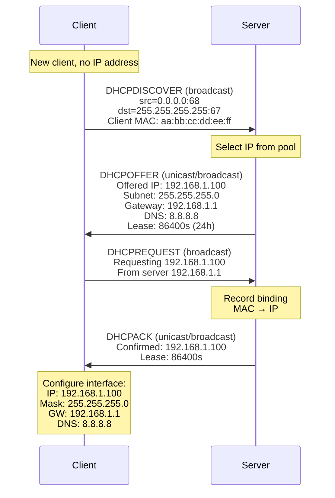
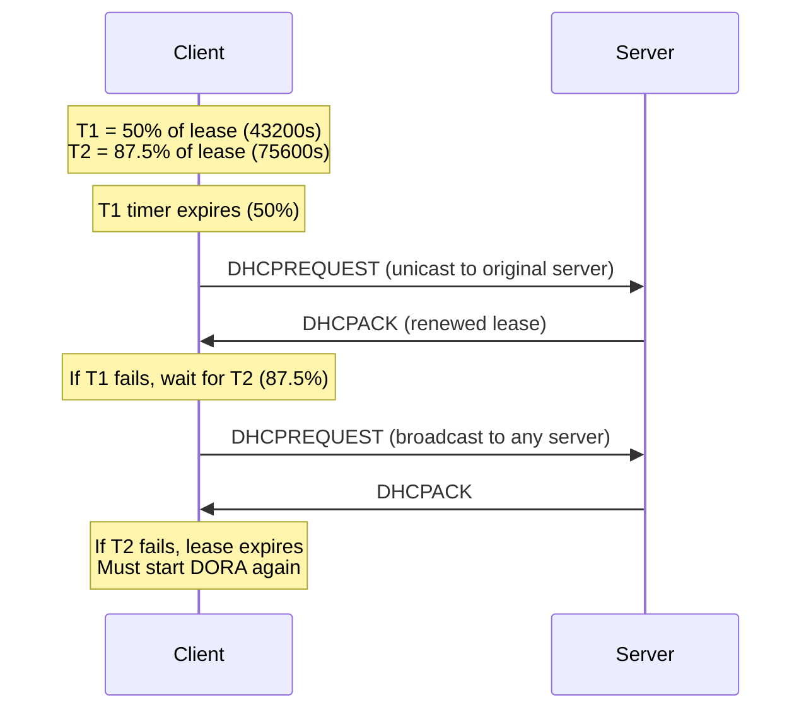
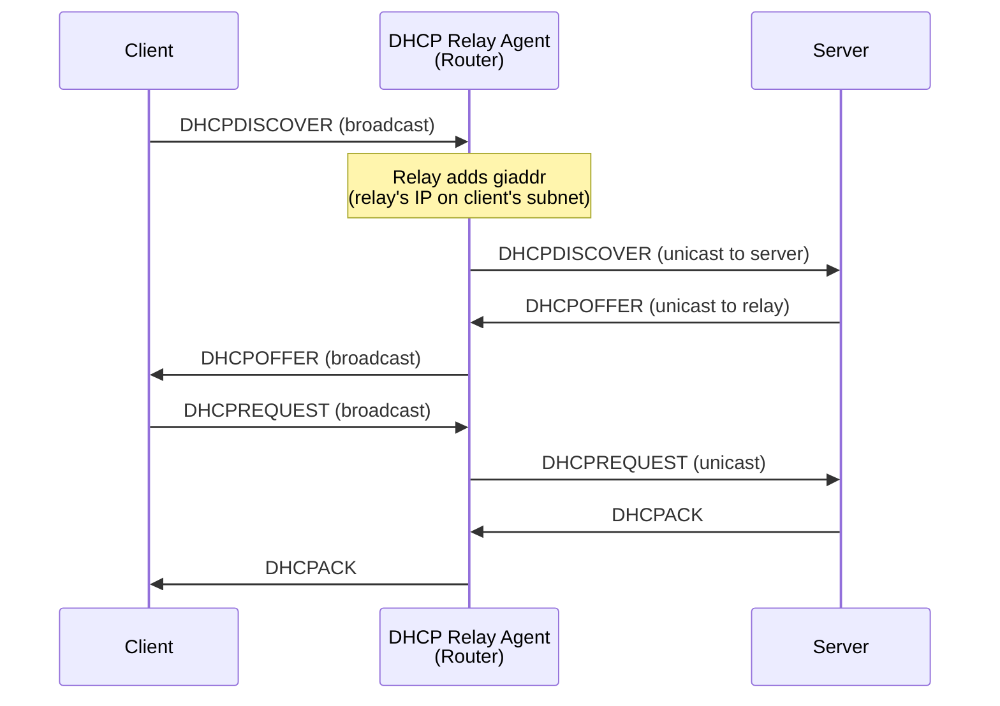
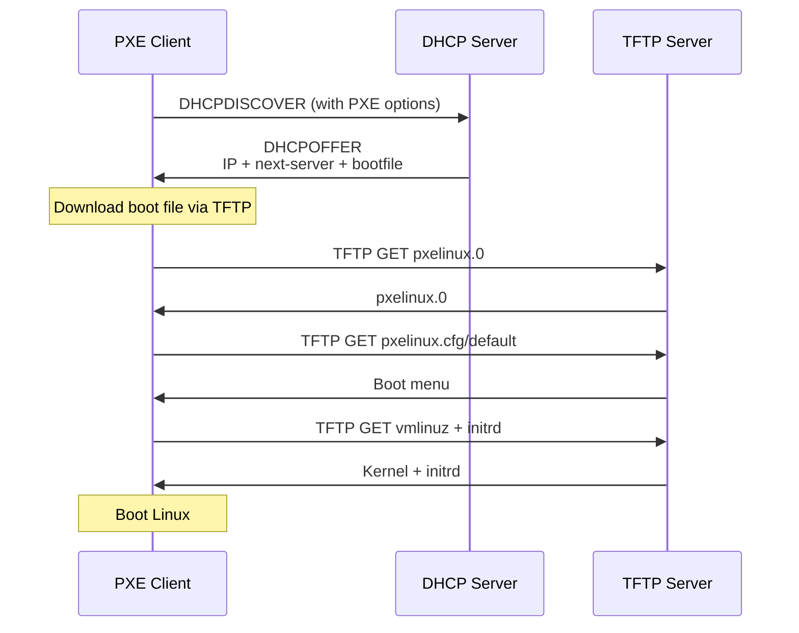

# Chapter 149: DHCP — Dynamic Host Configuration Protocol

## Introduction

The Dynamic Host Configuration Protocol (DHCP) automates the assignment of network configuration parameters to hosts on an IP network. Instead of manually configuring IP addresses, subnet masks, default gateways, and DNS servers on every device, DHCP allows these settings to be distributed automatically from a central server. DHCP is defined in RFC 2131 and is one of the most widely deployed network services—in virtually every network from home Wi-Fi to enterprise data centers, DHCP is running in the background.

On Linux, DHCP is typically handled by client daemons like `dhclient` (ISC), `dhcpcd`, or `NetworkManager` (which uses its own DHCP implementation internally). On the server side, `isc-dhcp-server` (dhcpd) is the traditional choice, though `dnsmasq` and `kea` are also popular.

## Intuition: The Hotel Check-in Analogy

DHCP is like checking into a hotel:
1. **You arrive (DHCPDISCOVER)**: "I need a room!" (broadcast request)
2. **Front desk responds (DHCPOFFER)**: "Here's room 305 with these amenities"
3. **You accept (DHCPREQUEST)**: "I'll take room 305, please"
4. **Confirmation (DHCPACK)**: "Confirmed, room 305 is yours for 24 hours"

You get:
- **Room number** = IP address
- **Floor plan** = Subnet mask
- **Hotel entrance** = Default gateway
- **Concierge number** = DNS servers
- **Checkout time** = Lease expiry

If you want to stay longer, you renew before checkout. If you leave, the room becomes available for the next guest.

## DHCP Message Format

```
 0                   1                   2                   3
 0 1 2 3 4 5 6 7 8 9 0 1 2 3 4 5 6 7 8 9 0 1 2 3 4 5 6 7 8 9 0 1
├─┼─┼─┼─┼─┼─┼─┼─┼─┼─┼─┼─┼─┼─┼─┼─┼─┼─┼─┼─┼─┼─┼─┼─┼─┼─┼─┼─┼─┼─┼─┼─┤
│     op (1)    │   htype (1)   │    hlen (1)   │    hops (1)     │
├─┼─┼─┼─┼─┼─┼─┼─┼─┼─┼─┼─┼─┼─┼─┼─┼─┼─┼─┼─┼─┼─┼─┼─┼─┼─┼─┼─┼─┼─┼─┼─┤
│                       xid (4) - Transaction ID                  │
├─┼─┼─┼─┼─┼─┼─┼─┼─┼─┼─┼─┼─┼─┼─┼─┼─┼─┼─┼─┼─┼─┼─┼─┼─┼─┼─┼─┼─┼─┼─┼─┤
│         secs (2)          │           flags (2)                  │
├─┼─┼─┼─┼─┼─┼─┼─┼─┼─┼─┼─┼─┼─┼─┼─┼─┼─┼─┼─┼─┼─┼─┼─┼─┼─┼─┼─┼─┼─┼─┼─┤
│                       ciaddr (4) - Client IP                     │
├─┼─┼─┼─┼─┼─┼─┼─┼─┼─┼─┼─┼─┼─┼─┼─┼─┼─┼─┼─┼─┼─┼─┼─┼─┼─┼─┼─┼─┼─┼─┼─┤
│                       yiaddr (4) - Your IP (offered)             │
├─┼─┼─┼─┼─┼─┼─┼─┼─┼─┼─┼─┼─┼─┼─┼─┼─┼─┼─┼─┼─┼─┼─┼─┼─┼─┼─┼─┼─┼─┼─┼─┤
│                       siaddr (4) - Server IP                     │
├─┼─┼─┼─┼─┼─┼─┼─┼─┼─┼─┼─┼─┼─┼─┼─┼─┼─┼─┼─┼─┼─┼─┼─┼─┼─┼─┼─┼─┼─┼─┼─┤
│                       giaddr (4) - Gateway IP (relay)            │
├─┼─┼─┼─┼─┼─┼─┼─┼─┼─┼─┼─┼─┼─┼─┼─┼─┼─┼─┼─┼─┼─┼─┼─┼─┼─┼─┼─┼─┼─┼─┼─┤
│                       chaddr (16) - Client Hardware Address      │
├─┼─┼─┼─┼─┼─┼─┼─┼─┼─┼─┼─┼─┼─┼─┼─┼─┼─┼─┼─┼─┼─┼─┼─┼─┼─┼─┼─┼─┼─┼─┼─┤
│                       sname (64) - Server Hostname               │
├─┼─┼─┼─┼─┼─┼─┼─┼─┼─┼─┼─┼─┼─┼─┼─┼─┼─┼─┼─┼─┼─┼─┼─┼─┼─┼─┼─┼─┼─┼─┼─┤
│                       file (128) - Boot File Name                │
├─┼─┼─┼─┼─┼─┼─┼─┼─┼─┼─┼─┼─┼─┼─┼─┼─┼─┼─┼─┼─┼─┼─┼─┼─┼─┼─┼─┼─┼─┼─┼─┤
│                       options (variable)                         │
│                       Magic cookie: 99.130.83.99                 │
└─┴─┴─┴─┴─┴─┴─┴─┴─┴─┴─┴─┴─┴─┴─┴─┴─┴─┴─┴─┴─┴─┴─┴─┴─┴─┴─┴─┴─┴─┴─┴─┘
```

### Message Types

| Type | Value | Description |
|------|-------|-------------|
| DHCPDISCOVER | 1 | Client: "I need an IP address" |
| DHCPOFFER | 2 | Server: "Here's an IP you can use" |
| DHCPREQUEST | 3 | Client: "I'll take that IP" |
| DHCPDECLINE | 4 | Client: "That IP is in use by someone else" |
| DHCPACK | 5 | Server: "Confirmed, IP is yours" |
| DHCPNAK | 6 | Server: "No, you can't have that IP" |
| DHCPRELEASE | 7 | Client: "I'm giving up this IP" |
| DHCPINFORM | 8 | Client: "I already have an IP, just need config" |

## DHCP Process

### DORA (Discover, Offer, Request, Acknowledge)



### Lease Renewal (T1 and T2 Timers)



### DHCP Relay

When the DHCP server is on a different subnet, a DHCP relay agent forwards requests:



## Common DHCP Options

| Option | Code | Description | Example |
|--------|------|-------------|---------|
| Subnet Mask | 1 | Network mask | `255.255.255.0` |
| Router | 3 | Default gateway | `192.168.1.1` |
| DNS Server | 6 | DNS servers | `8.8.8.8, 8.8.4.4` |
| Host Name | 12 | Client hostname | `my-laptop` |
| Domain Name | 15 | Domain name | `example.com` |
| MTU | 26 | Interface MTU | `1500` |
| Broadcast | 28 | Broadcast address | `192.168.1.255` |
| NTP Server | 42 | NTP servers | `192.168.1.1` |
| Lease Time | 51 | IP lease time | `86400` |
| Message Type | 53 | DHCP message type | `DHCPACK` |
| Server ID | 54 | DHCP server IP | `192.168.1.1` |
| TFTP Server | 66 | TFTP server name | `tftp.example.com` |
| Boot File | 67 | Boot file name | `pxelinux.0` |
| Domain Search | 119 | DNS search list | `example.com internal.example.com` |
| Classless Route | 121 | Classless static routes | `10.0.0.0/8 via 192.168.1.1` |

## Linux DHCP Clients

### dhclient (ISC)

```bash
# Request an IP address
dhclient eth0

# Release the lease
dhclient -r eth0

# Request a specific IP
dhclient -s 192.168.1.100 eth0

# Use a specific interface
dhclient -i eth0

# Verbose output
dhclient -v eth0

# Configuration file: /etc/dhcp/dhclient.conf
```

### dhclient.conf

```bash
# /etc/dhcp/dhclient.conf

# Request specific options
request subnet-mask, broadcast-address, time-offset, routers,
        domain-name, domain-name-servers, host-name,
        ntp-servers, interface-mtu;

# Send client identifier
send dhcp-client-identifier "my-laptop";

# Send hostname
send host-name "my-laptop";

# Reject offers from specific servers
reject 192.168.1.100;

# Request a specific IP
request 192.168.1.50;

# Interface-specific settings
interface "eth0" {
    send dhcp-client-identifier "eth0-client";
    request subnet-mask, routers, domain-name-servers;
}

# Alias (secondary IP)
alias {
    interface "eth0";
    fixed-address 192.168.1.200;
    option subnet-mask 255.255.255.0;
}

# Hook scripts in /etc/dhcp/dhclient-enter-hooks.d/
# and /etc/dhcp/dhclient-exit-hooks.d/
```

### dhcpcd

```bash
# Request IP
dhcpcd eth0

# Release
dhcpcd -k eth0

# Static fallback
dhcpcd --static 192.168.1.100/24 eth0

# Configuration: /etc/dhcpcd.conf
```

### dhcpcd.conf

```bash
# /etc/dhcpcd.conf

# Use the hardware address as client-id
clientid

# Rapid commit (skip T2 phase)
option rapid_commit

# Request options
option domain_name_servers, domain_name, domain_search
option classless_static_routes
option interface_mtu
option ntp_servers

# Fallback to static profile on failure
profile static_eth0
static ip_address=192.168.1.100/24
static routers=192.168.1.1
static domain_name_servers=8.8.8.8 8.8.4.4

interface eth0
fallback static_eth0

# No DHCP on certain interfaces
noipv4ll
nohook resolv.conf
```

### NetworkManager DHCP

```bash
# NetworkManager uses internal DHCP by default
# Can be configured to use dhclient or dhcpcd

# Set connection to use DHCP
nmcli connection modify eth0 ipv4.method auto

# View DHCP lease info
nmcli connection show eth0 | grep -i dhcp

# Use dhclient instead of internal
# /etc/NetworkManager/conf.d/dhcp-client.conf
[main]
dhcp=dhclient
```

## DHCP Server Configuration

### ISC DHCP Server (dhcpd)

```bash
# /etc/dhcp/dhcpd.conf

# Global parameters
default-lease-time 86400;      # 24 hours
max-lease-time 172800;         # 48 hours
authoritative;

# DNS update configuration
ddns-updates on;
ddns-update-style interim;
update-static-leases on;

# Log facility
log-facility local7;

# Subnet declaration
subnet 192.168.1.0 netmask 255.255.255.0 {
    # Address range
    range 192.168.1.100 192.168.1.200;

    # Options
    option routers 192.168.1.1;
    option subnet-mask 255.255.255.0;
    option broadcast-address 192.168.1.255;
    option domain-name-servers 8.8.8.8, 8.8.4.4;
    option domain-name "example.com";
    option ntp-servers 192.168.1.1;
    option interface-mtu 1500;

    # Lease times
    default-lease-time 86400;
    max-lease-time 172800;

    # Classless static routes
    option classless-static-routes
        10.0.0.0 255.0.0.0 192.168.1.1,
        172.16.0.0 255.240.0.0 192.168.1.1;
}

# Host reservation (static DHCP)
host server1 {
    hardware ethernet 00:11:22:33:44:55;
    fixed-address 192.168.1.10;
    option host-name "server1";
}

host laptop1 {
    hardware ethernet aa:bb:cc:dd:ee:ff;
    fixed-address 192.168.1.11;
    option host-name "laptop1";
}

# PXE boot configuration
class "pxeclients" {
    match if substring(option vendor-class-identifier, 0, 9) = "PXEClient";
    next-server 192.168.1.1;
    filename "pxelinux.0";
}

# Pool for specific purpose
pool {
    range 192.168.1.210 192.168.1.220;
    allow members of "voip-phones";
    default-lease-time 3600;
}

# Failover (requires partner declaration)
failover peer "dhcp-failover" {
    primary;
    address 192.168.1.1;
    port 647;
    peer address 192.168.1.2;
    peer port 847;
    max-response-delay 60;
    max-unacked-updates 10;
    load balance max seconds 3;
    mclt 3600;
    split 128;
}
```

### dnsmasq as DHCP Server

```bash
# /etc/dnsmasq.conf

# Interface to listen on
interface=eth0

# DHCP range
dhcp-range=192.168.1.100,192.168.1.200,255.255.255.0,86400

# Gateway
dhcp-option=3,192.168.1.1

# DNS servers
dhcp-option=6,8.8.8.8,8.8.4.4

# Domain name
dhcp-option=15,example.com

# NTP server
dhcp-option=42,192.168.1.1

# Static assignments
dhcp-host=00:11:22:33:44:55,192.168.1.10,server1
dhcp-host=aa:bb:cc:dd:ee:ff,192.168.1.11,laptop1

# PXE boot
dhcp-boot=pxelinux.0,pxeserver,192.168.1.1

# Enable TFTP
enable-tftp
tftp-root=/var/lib/tftpboot

# Log DHCP transactions
log-dhcp
```

## DHCP Lease Management

### Viewing Leases

```bash
# ISC dhcpd leases
cat /var/lib/dhcp/dhcpd.leases

# dhclient leases
cat /var/lib/dhcp/dhclient.leases
cat /var/lib/dhclient/dhclient.leases

# dhcpcd leases
cat /var/lib/dhcpcd/*.lease

# NetworkManager leases
ls /var/lib/NetworkManager/*.lease
cat /var/lib/NetworkManager/internal-*.lease
```

### Lease File Format

```bash
# /var/lib/dhcp/dhcpd.leases
lease 192.168.1.100 {
    starts 4 2024/01/01 00:00:00;
    ends 5 2024/01/02 00:00:00;
    tstp 5 2024/01/02 00:00:00;
    cltt 4 2024/01/01 00:00:00;
    binding state active;
    next binding state free;
    rewind binding state free;
    hardware ethernet aa:bb:cc:dd:ee:ff;
    uid "\001\000\000\000\000\000";
    client-hostname "my-laptop";
    set vendor-class-identifier = "dhcpcd-10.0.0";
}
```

### Managing Leases

```bash
# Release current lease
dhclient -r eth0

# Force new lease
dhclient -nw eth0

# Delete lease file and restart
rm /var/lib/dhcp/dhclient.leases
systemctl restart dhclient@eth0

# Server: delete a specific lease
# Edit /var/lib/dhcp/dhcpd.leases and remove the entry
# Then restart dhcpd
```

## DHCP Relay

### Configuring dhcrelay

```bash
# Install relay agent
apt install isc-dhcp-relay

# /etc/default/isc-dhcp-relay
SERVERS="192.168.1.1"
INTERFACES="eth0 eth1"
OPTIONS=""

# Start relay
systemctl start isc-dhcp-relay

# Command line
dhcrelay -i eth0 -i eth1 192.168.1.1

# With multiple servers (failover)
dhcrelay -i eth0 192.168.1.1 192.168.1.2
```

### Router as DHCP Relay

```bash
# Using iptables (for simple relay)
# Or configure the router's DHCP relay feature

# Cisco-style (conceptual)
# ip helper-address 192.168.1.1
```

## DHCPv6

DHCPv6 (RFC 8415) provides similar functionality for IPv6 networks, complementing SLAAC (Stateless Address Autoconfiguration).

### DHCPv6 vs SLAAC

| Feature | SLAAC | DHCPv6 |
|---------|-------|--------|
| Server required | No | Yes |
| DNS info | RDNSS (RFC 8106) | DHCPv6 options |
| Address assignment | Host generates | Server assigns |
| Prefix delegation | No | Yes |
| Information only | No | Yes (stateless DHCPv6) |

### DHCPv6 Configuration

```bash
# dhclient DHCPv6
dhclient -6 eth0

# NetworkManager
nmcli connection modify eth0 ipv6.method auto
nmcli connection modify eth0 ipv6.dhcp-duid "00:01:00:01:..."

# Wide DHCPv6 client (dhcpcd6)
# /etc/wide-dhcpv6/dhcp6c.conf
interface eth0 {
    send ia-na 1;           # Request non-temporary address
    send ia-pd 1;           # Request prefix delegation
    send rapid-commit;
    request domain-name-servers;
    request domain-name;
};

id-assoc na 1 {
    # Non-temporary address association
};

id-assoc pd 1 {
    prefix-interface eth1 {
        sla-len 0;
    };
};
```

## PXE Boot (Network Boot)

DHCP plays a critical role in PXE (Preboot Execution Environment) booting, where a computer boots from the network.

### PXE Boot Flow



## Security Considerations

### DHCP Starvation Attack

An attacker can exhaust the DHCP pool by requesting all available addresses:

```bash
# Defense: Limit DHCP requests per port (on managed switches)
# port-security mac-limit 1

# Rate limiting with iptables
iptables -A INPUT -p udp --dport 67 -m limit --limit 10/s -j ACCEPT
iptables -A INPUT -p udp --dport 67 -j DROP
```

### Rogue DHCP Server

An unauthorized DHCP server can provide incorrect network configuration:

```bash
# Defense: DHCP snooping (managed switches)
# switchport port-security
# ip dhcp snooping
# ip dhcp snooping vlan 100
# ip dhcp snooping trust (on uplink ports only)
```

### DHCP Authentication

```bash
# RFC 3118: DHCP Authentication
# Rarely deployed but available

# Server configuration
key dhcp-key {
    algorithm hmac-md5;
    secret "base64encodedkey";
};

zone example.com {
    primary 192.168.1.1;
    key dhcp-key;
};
```

## Monitoring and Debugging

### DHCP Debugging

```bash
# Enable debug logging for dhclient
dhclient -d eth0

# Watch DHCP traffic
tcpdump -i eth0 port 67 or port 68

# Verbose DHCP capture
tcpdump -i eth0 -e -v 'udp port 67 or udp port 68'

# Check current lease
cat /var/lib/dhcp/dhclient.leases

# Server logs
tail -f /var/log/syslog | grep dhcpd

# Test DHCP from specific interface
dhclient -nw -v eth0
```

### Common Issues

```bash
# No DHCP lease obtained
# 1. Check interface is up
ip link show eth0

# 2. Check for DHCP server
tcpdump -i eth0 port 67

# 3. Check firewall
iptables -L -n | grep -i 67

# 4. Try manual request
dhclient -v eth0

# Lease expired, interface lost IP
# Check lease file for expiry
cat /var/lib/dhcp/dhclient.leases | grep "expire"

# Wrong DNS servers received
# Check /etc/resolv.conf
cat /etc/resolv.conf
# Override in dhclient-enter-hooks.d/
```

## Common Pitfalls

1. **Multiple DHCP servers**: Running more than one DHCP server on the same subnet without coordination causes conflicts
2. **Lease file corruption**: Corrupted lease files can cause the client to request the wrong IP
3. **DNS not updating**: If DHCP doesn't update DNS, hostnames won't resolve
4. **Firewall blocking DHCP**: UDP ports 67/68 must be open
5. **Relay not configured**: Cross-subnet DHCP requires relay agents
6. **Time synchronization**: DHCP lease times depend on accurate clocks
7. **MTU issues**: DHCP option 26 (interface MTU) can cause problems if not set correctly

## Best Practices

1. **Use static reservations**: For servers, printers, and infrastructure devices
2. **Set appropriate lease times**: Short for guest networks, long for office networks
3. **Configure failover**: Primary and secondary DHCP servers
4. **Monitor lease pool**: Alert when pool is >80% utilized
5. **Log DHCP transactions**: For security auditing and troubleshooting
6. **Use DHCP snooping**: On managed switches to prevent rogue servers
7. **Document DHCP scope**: Maintain a spreadsheet of static assignments and ranges

## Exercises

1. **DHCP server setup**: Configure a DHCP server with dnsmasq that provides IP addresses, DNS servers, and gateway information to clients on a virtual network.

2. **Lease monitoring**: Write a script that parses the dhcpd.leases file and displays current lease status, including client hostname and lease expiry.

3. **DHCP relay**: Set up a DHCP relay agent that forwards requests from one subnet to a DHCP server on another subnet.

4. **DHCP traffic analysis**: Use tcpdump/Wireshark to capture and analyze a complete DHCP DORA exchange. Document each message's fields.

5. **PXE boot**: Configure DHCP and TFTP servers to support PXE network booting of a Linux installation.

6. **Static reservations**: Configure DHCP reservations for specific MAC addresses and verify they receive the correct IP.

## References

1. RFC 2131: Dynamic Host Configuration Protocol
2. RFC 8415: Dynamic Host Configuration Protocol for IPv6 (DHCPv6)
3. RFC 3118: Authentication for DHCP Messages
4. RFC 4039: Rapid Commit Option for DHCP
5. ISC DHCP documentation: https://kb.isc.org/
6. dnsmasq documentation: http://www.thekelleys.org.uk/dnsmasq/doc.html
7. Linux man pages: `dhcpd(8)`, `dhclient(8)`, `dhcpcd(8)`, `dhcp-options(5)`
