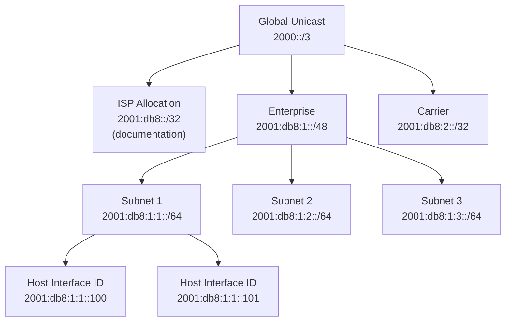
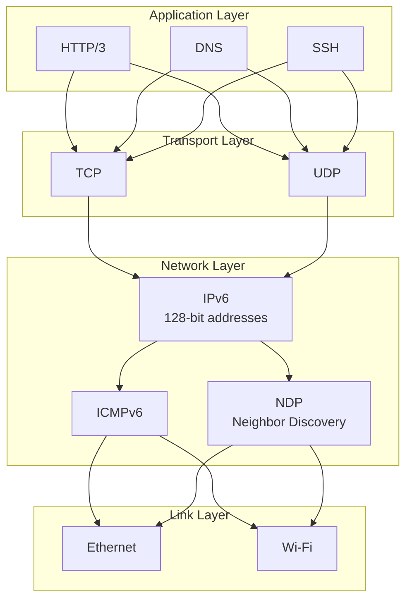
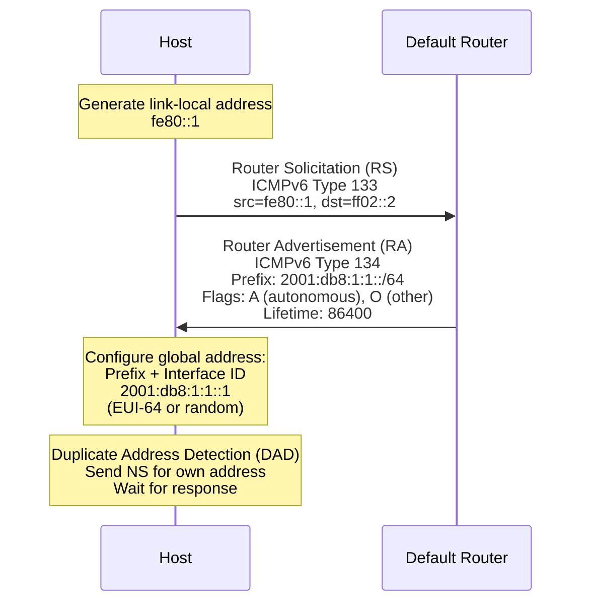
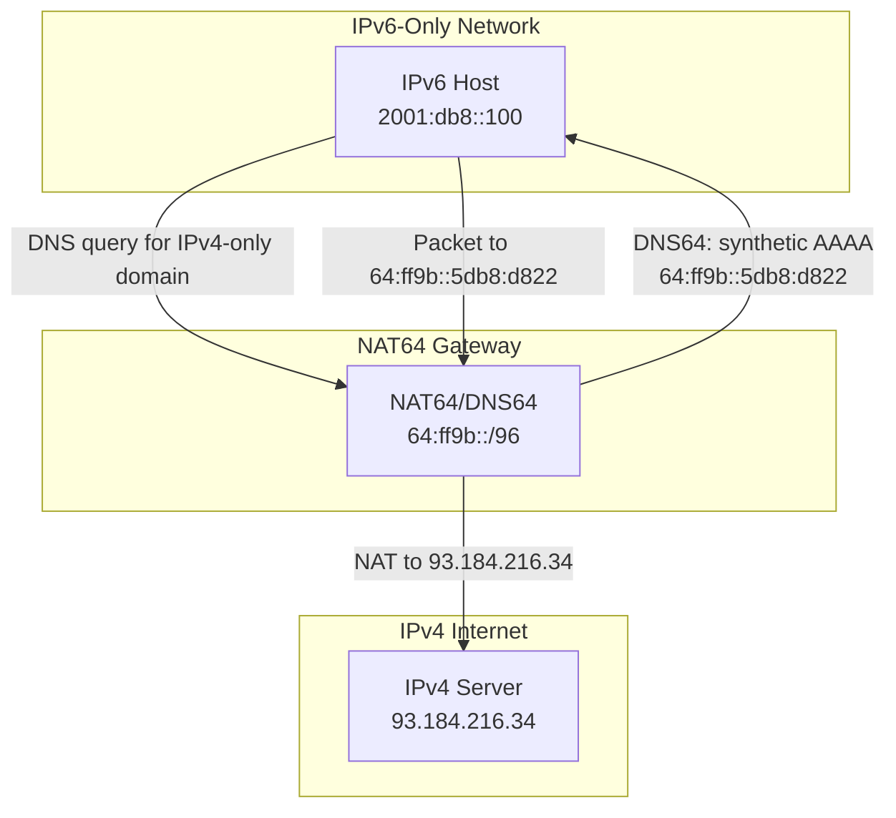

# Chapter 150: IPv6

## Introduction

Internet Protocol version 6 (IPv6) is the successor to IPv4, designed to address the exhaustion of IPv4 addresses and to provide improvements in routing, security, autoconfiguration, and packet handling. With a 128-bit address space (vs IPv4's 32-bit), IPv6 provides approximately 3.4 × 10^38 addresses—enough to assign billions of addresses to every device on Earth and beyond.

IPv6 is no longer optional. Major content providers (Google, Facebook, Netflix) serve significant traffic over IPv6, mobile networks (especially 4G/5G) are IPv6-native, and cloud providers offer IPv6 connectivity by default. Linux has had excellent IPv6 support since kernel 2.6, and most modern distributions enable it by default.

Understanding IPv6 is essential for network engineers, system administrators, and developers. While the fundamental concepts are similar to IPv6, the details—address types, autoconfiguration, neighbor discovery, dual-stack operation, and transition mechanisms—differ significantly.

## Intuition: From Postcards to Galaxy-Sized Address Space

IPv4's 32-bit address space (4.3 billion addresses) was designed in an era when computers filled rooms. Today, with smartphones, IoT devices, and cloud servers, we've run out. IPv6's 128-bit address space is so vast that every atom on Earth could have its own IP address—and there would still be addresses left.

But IPv6 isn't just "bigger IPv4." It's a redesign:
- **No NAT needed**: Enough addresses for every device to have a public address
- **Simplified header**: Faster processing by routers
- **Built-in security**: IPsec was originally mandated (now optional)
- **Autoconfiguration**: Devices can configure themselves without DHCP
- **Better multicast**: Improved multicast and anycast support
- **Flow labels**: Enable quality-of-service and flow-based routing

## IPv6 Address Format

### Address Structure

IPv6 addresses are 128 bits, written as 8 groups of 4 hexadecimal digits separated by colons:

```
2001:0db8:0000:0000:0000:0000:0000:0001
```

### Compression Rules

```bash
# Rule 1: Leading zeros in each group can be omitted
2001:0db8:0000:0000:0000:0000:0000:0001
2001:db8:0:0:0:0:0:1

# Rule 2: One sequence of consecutive all-zero groups replaced with ::
2001:db8::1

# Rule 3: Both rules can be combined
fe80::1
::1          (loopback)
::           (unspecified address)
```

### Address Types

| Type | Prefix | Description | IPv4 Equivalent |
|------|--------|-------------|-----------------|
| Global Unicast | 2000::/3 | Public addresses | Public IPv4 |
| Link-Local | fe80::/10 | Auto-configured, link-only | 169.254.0.0/16 |
| Unique Local | fc00::/7 | Private addresses | 10.0.0.0/8, etc. |
| Multicast | ff00::/8 | Multicast addresses | 224.0.0.0/4 |
| Loopback | ::1 | Loopback address | 127.0.0.1 |
| Unspecified | :: | No address yet | 0.0.0.0 |

### Address Allocation



## Architecture

### IPv6 Protocol Stack



### IPv6 Header

```
 0                   1                   2                   3
 0 1 2 3 4 5 6 7 8 9 0 1 2 3 4 5 6 7 8 9 0 1 2 3 4 5 6 7 8 9 0 1
├─┼─┼─┼─┼─┼─┼─┼─┼─┼─┼─┼─┼─┼─┼─┼─┼─┼─┼─┼─┼─┼─┼─┼─┼─┼─┼─┼─┼─┼─┼─┼─┤
│Version│ Traffic Class │           Flow Label                    │
├─┼─┼─┼─┼─┼─┼─┼─┼─┼─┼─┼─┼─┼─┼─┼─┼─┼─┼─┼─┼─┼─┼─┼─┼─┼─┼─┼─┼─┼─┼─┼─┤
│         Payload Length        │  Next Header  │   Hop Limit     │
├─┼─┼─┼─┼─┼─┼─┼─┼─┼─┼─┼─┼─┼─┼─┼─┼─┼─┼─┼─┼─┼─┼─┼─┼─┼─┼─┼─┼─┼─┼─┼─┤
│                                                               │
│                      Source Address (128 bits)                 │
│                                                               │
├─┼─┼─┼─┼─┼─┼─┼─┼─┼─┼─┼─┼─┼─┼─┼─┼─┼─┼─┼─┼─┼─┼─┼─┼─┼─┼─┼─┼─┼─┼─┼─┤
│                                                               │
│                    Destination Address (128 bits)              │
│                                                               │
└─┴─┴─┴─┴─┴─┴─┴─┴─┴─┴─┴─┴─┴─┴─┴─┴─┴─┴─┴─┴─┴─┴─┴─┴─┴─┴─┴─┴─┴─┴─┴─┘
```

### IPv4 vs IPv6 Header Comparison

| Field | IPv4 | IPv6 | Change |
|-------|------|------|--------|
| Version | 4 bits | 4 bits | Same |
| IHL | 4 bits | Removed | Fixed header size |
| DSCP/ECN | 8 bits (ToS) | 8 bits (Traffic Class) | Renamed |
| Flow Label | N/A | 20 bits | New: flow identification |
| Total Length | 16 bits | Payload Length (16 bits) | Excludes header |
| Identification | 16 bits | Removed | Fragmentation changes |
| Flags | 3 bits | Removed | Fragmentation changes |
| Fragment Offset | 13 bits | Removed | Fragmentation changes |
| TTL | 8 bits | Hop Limit (8 bits) | Renamed |
| Protocol | 8 bits | Next Header (8 bits) | Renamed |
| Header Checksum | 16 bits | Removed | Link-layer checksums |
| Source | 32 bits | 128 bits | 4x larger |
| Destination | 32 bits | 128 bits | 4x larger |

## Stateless Address Autoconfiguration (SLAAC)

SLAAC allows hosts to automatically configure their IPv6 addresses without a DHCP server.

### SLAAC Process



### SLAAC Address Generation

```c
/* EUI-64 address generation from MAC address */

/* MAC address: aa:bb:cc:dd:ee:ff */
/* EUI-64 steps:
 * 1. Split MAC: aa:bb:cc | dd:ee:ff
 * 2. Insert FF:FE: aa:bb:cc:ff:fe:dd:ee:ff
 * 3. Flip 7th bit (U/L bit): a8:bb:cc:ff:fe:dd:ee:ff
 * 4. Prepend prefix: 2001:db8:1:1:a8bb:ccff:fedd:eeff
 */

/* Privacy Extensions (RFC 4941): random interface ID */
/* Generates random addresses that change periodically */
```

### SLAAC Configuration

```bash
# Enable SLAAC (default on most Linux distros)
sysctl -w net.ipv6.conf.eth0.accept_ra=1
# 0 = ignore RAs
# 1 = accept RAs if forwarding is disabled
# 2 = accept RAs even if forwarding is enabled

# Enable privacy extensions
sysctl -w net.ipv6.conf.eth0.use_tempaddr=2
# 0 = disabled
# 1 = enabled (prefer privacy address)
# 2 = enabled (force privacy address)

# Privacy extension settings
sysctl -w net.ipv6.conf.eth0.temp_prefered_lft=86400
sysctl -w net.ipv6.conf.eth0.temp_valid_lft=604800

# Stable privacy address (RFC 7217)
sysctl -w net.ipv6.conf.eth0.addr_gen_mode=1
# 0 = EUI-64
# 1 = stable privacy
```

## Neighbor Discovery Protocol (NDP)

NDP (RFC 4861) replaces ARP for IPv6 and provides additional functionality.

### NDP Messages

| Message | ICMPv6 Type | Description |
|---------|-------------|-------------|
| Router Solicitation (RS) | 133 | Host requests router info |
| Router Advertisement (RA) | 134 | Router announces itself |
| Neighbor Solicitation (NS) | 135 | Resolve IPv6 to MAC |
| Neighbor Advertisement (NA) | 136 | Respond to NS |
| Redirect | 137 | Router redirects host |

### NDP vs ARP

| Feature | ARP (IPv4) | NDP (IPv6) |
|---------|-----------|-----------|
| Protocol | Ethertype 0x0806 | ICMPv6 |
| Address resolution | ARP Request/Reply | NS/NA |
| Router discovery | DHCP or static | RA (built-in) |
| Prefix discovery | DHCP or static | RA (built-in) |
| Duplicate detection | ARP probe (gratuitous) | DAD (NS to solicited-node) |
| Link-layer address | In ARP payload | In ICMPv6 option |
| Security | None | SEND (optional) |

### Neighbor Cache

```bash
# View neighbor cache (IPv6 ARP equivalent)
ip -6 neigh show

# Add static neighbor entry
ip -6 neigh add 2001:db8::1 lladdr 00:11:22:33:44:55 dev eth0 nud permanent

# Delete entry
ip -6 neigh del 2001:db8::1 dev eth0

# Flush cache
ip -6 neigh flush all
```

## Dual Stack

Dual stack means running both IPv4 and IPv6 simultaneously on the same host.

### Dual Stack Configuration

```bash
# Enable IPv6 on an interface
ip -6 addr add 2001:db8::1/64 dev eth0

# Both IPv4 and IPv6 addresses on same interface
ip addr show eth0
# inet 192.168.1.100/24 ...
# inet6 2001:db8::1/64 ...
# inet6 fe80::1/64 ...

# DNS resolution order (prefer IPv6)
# /etc/gai.conf
# Uncomment to prefer IPv6
precedence ::1/128       50
precedence ::/0          40
precedence 2002::/16     30
precedence ::/96         20
precedence ::ffff:0:0/96 10
```

### Dual Stack Application

```c
/* Application supporting both IPv4 and IPv6 */

#include <stdio.h>
#include <stdlib.h>
#include <string.h>
#include <unistd.h>
#include <sys/socket.h>
#include <netdb.h>

int main(int argc, char *argv[])
{
    struct addrinfo hints, *result, *rp;
    int sockfd;

    memset(&hints, 0, sizeof(hints));
    hints.ai_family = AF_UNSPEC;      /* Allow IPv4 or IPv6 */
    hints.ai_socktype = SOCK_STREAM;
    hints.ai_flags = AI_PASSIVE;      /* For wildcard IP */
    hints.ai_flags |= AI_ADDRCONFIG;  /* Only supported families */

    int ret = getaddrinfo(NULL, "8080", &hints, &result);
    if (ret != 0) {
        fprintf(stderr, "getaddrinfo: %s\n", gai_strerror(ret));
        exit(EXIT_FAILURE);
    }

    /* Try each address until we successfully bind */
    for (rp = result; rp != NULL; rp = rp->ai_next) {
        sockfd = socket(rp->ai_family, rp->ai_socktype,
                       rp->ai_protocol);
        if (sockfd < 0)
            continue;

        /* For IPv6, disable IPv4 mapping */
        if (rp->ai_family == AF_INET6) {
            int yes = 1;
            setsockopt(sockfd, IPPROTO_IPV6, IPV6_V6ONLY,
                      &yes, sizeof(yes));
        }

        if (bind(sockfd, rp->ai_addr, rp->ai_addrlen) == 0)
            break;  /* Success */

        close(sockfd);
    }

    freeaddrinfo(result);

    if (rp == NULL) {
        fprintf(stderr, "Could not bind\n");
        exit(EXIT_FAILURE);
    }

    printf("Listening on port 8080\n");
    listen(sockfd, 5);

    /* Accept connections (works for both IPv4 and IPv6) */
    while (1) {
        struct sockaddr_storage client_addr;
        socklen_t client_len = sizeof(client_addr);
        int client_fd = accept(sockfd, (struct sockaddr *)&client_addr,
                              &client_len);

        char addr_str[INET6_ADDRSTRLEN];
        if (client_addr.ss_family == AF_INET) {
            struct sockaddr_in *s = (struct sockaddr_in *)&client_addr;
            inet_ntop(AF_INET, &s->sin_addr, addr_str, sizeof(addr_str));
        } else {
            struct sockaddr_in6 *s = (struct sockaddr_in6 *)&client_addr;
            inet_ntop(AF_INET6, &s->sin6_addr, addr_str, sizeof(addr_str));
        }

        printf("Connection from %s\n", addr_str);
        close(client_fd);
    }

    close(sockfd);
    return 0;
}
```

## IPv6-Only Networks

### IPv6-Only with NAT64/DNS64



### NAT64/DNS64 Configuration

```bash
# Using Tayga for NAT64
apt install tayga

# /etc/tayga.conf
ipv4-addr 192.168.255.1
prefix 64:ff9b::/96
dynamic-pool 192.168.255.0/24
data-dir /var/spool/tayga

# Using Jool for NAT64 (kernel module)
modprobe jool
jool instance add --iptables --pool6 64:ff9b::/96
jool instance add --iptables --pool4 192.168.255.0/24

# DNS64 with systemd-resolved
# /etc/systemd/resolved.conf
[Resolve]
DNS64=yes
DNS64Prefix=64:ff9b::
```

## Tunnelling

### 6in4 (Static Tunnel)

```bash
# Create a 6in4 tunnel (e.g., with Hurricane Electric)
ip tunnel add he-ipv6 mode sit remote 216.66.80.30 local 192.168.1.100 ttl 255
ip link set he-ipv6 up
ip addr add 2001:470:1f06:123::2/64 dev he-ipv6
ip route add ::/0 dev he-ipv6
```

### 6to4

```bash
# 6to4 tunneling (automatic)
ip tunnel add 6to4 mode sit remote any local 192.168.1.100
ip link set 6to4 up
ip addr add 2002:c0a8:164::1/16 dev 6to4
ip route add 2000::/3 via ::192.88.99.1 dev 6to4
```

### WireGuard IPv6

```bash
# WireGuard supports IPv6 natively
[Interface]
PrivateKey = ...
Address = fd00::1/64
ListenPort = 51820

[Peer]
PublicKey = ...
AllowedIPs = fd00::/64, 2001:db8::/32
Endpoint = [2001:db8::1]:51820
```

## IPv6 Security

### IPv6-Specific Security Considerations

```bash
# Disable IPv6 if not needed
echo 1 > /proc/sys/net/ipv6/conf/all/disable_ipv6

# Or per-interface
echo 1 > /proc/sys/net/ipv6/conf/eth0/disable_ipv6

# RA Guard (reject unauthorized Router Advertisements)
# Use nftables or ip6tables
ip6tables -A INPUT -p icmpv6 --icmpv6-type router-advertisement \
    -m mac --mac-source ! 00:11:22:33:44:55 -j DROP

# Disable router advertisements on non-router interfaces
echo 0 > /proc/sys/net/ipv6/conf/eth0/accept_ra

# Disable source routing
echo 0 > /proc/sys/net/ipv6/conf/all/accept_source_route

# Enable IPv6 privacy extensions
echo 2 > /proc/sys/net/ipv6/conf/all/use_tempaddr

# Filter IPv6 extension headers
ip6tables -A INPUT -m ipv6header --header frag -j DROP
```

### IPv6 Firewalling

```bash
# Basic IPv6 firewall with ip6tables
ip6tables -P INPUT DROP
ip6tables -P FORWARD DROP
ip6tables -P OUTPUT ACCEPT

# Allow established connections
ip6tables -A INPUT -m state --state ESTABLISHED,RELATED -j ACCEPT

# Allow ICMPv6 (essential for IPv6 operation)
ip6tables -A INPUT -p icmpv6 -j ACCEPT

# Allow SSH
ip6tables -A INPUT -p tcp --dport 22 -j ACCEPT

# Allow HTTP/HTTPS
ip6tables -A INPUT -p tcp --dport 80 -j ACCEPT
ip6tables -A INPUT -p tcp --dport 443 -j ACCEPT
```

## Monitoring and Debugging

### IPv6 Diagnostic Commands

```bash
# Show IPv6 addresses
ip -6 addr show
ip -6 addr show dev eth0

# Show IPv6 routes
ip -6 route show
ip -6 route get 2001:db8::1

# Show neighbor cache
ip -6 neigh show

# Ping IPv6
ping6 2001:db8::1
ping -6 2001:db8::1
ping6 fe80::1%eth0  # Link-local requires interface

# Traceroute IPv6
traceroute6 2001:db8::1

# DNS AAAA records
dig AAAA www.google.com
host -t AAAA www.google.com

# Check IPv6 connectivity
curl -6 https://ipv6.google.com
wget -6 https://ipv6.google.com
```

### IPv6 Statistics

```bash
# IPv6 protocol statistics
cat /proc/net/snmp6

# ICMPv6 statistics
cat /proc/net/snmp6 | grep Icmp6

# IPv6 socket statistics
ss -6 -a

# Interface statistics
ip -6 -s link show eth0
```

## Common Pitfalls

1. **Link-local addresses need interface**: `ping6 fe80::1` fails without `%eth0`
2. **No NAT**: Unlike IPv4, IPv6 doesn't use NAT; firewalls must filter at the host level
3. **ICMPv6 is essential**: Blocking all ICMPv6 breaks NDP and PMTUD
4. **DNS must have AAAA**: Dual-stack needs both A and AAAA records
5. **Fragmentation differences**: IPv6 only fragments at the source, not by routers
6. **Privacy addresses**: Generated addresses change; applications shouldn't assume stable addresses
7. **IPv4-mapped addresses**: `::ffff:192.168.1.1` is an IPv4 address in IPv6 clothing

## Best Practices

1. **Enable IPv6 everywhere**: Even if you don't use it yet, it prevents surprises
2. **Use privacy extensions**: Protect user privacy with temporary addresses
3. **Filter ICMPv6 carefully**: Allow essential types (neighbor discovery, PMTUD)
4. **Monitor IPv6 traffic**: Don't ignore IPv6 in your monitoring
5. **Plan address allocation**: Use /48 for sites, /64 for subnets
6. **Use SLAAC + RDNSS**: Simpler than DHCPv6 for most networks
7. **Test dual-stack**: Verify both IPv4 and IPv6 connectivity

## Exercises

1. **IPv6 address calculation**: Given the prefix `2001:db8:abcd::/48`, calculate the subnet addresses for 16 subnets and the range of host addresses for each.

2. **SLAAC lab**: Set up a network with a router advertising a prefix. Verify that hosts autoconfigure addresses using both EUI-64 and privacy extensions.

3. **Dual-stack application**: Modify the dual-stack server example to handle both IPv4 and IPv6 clients, displaying the client's address family and address.

4. **IPv6 tunnel**: Set up a 6in4 tunnel with a tunnel broker and verify IPv6 connectivity to the Internet.

5. **NDP analysis**: Capture NDP traffic with `tcpdump -i eth0 icmp6` and identify Router Solicitation, Router Advertisement, Neighbor Solicitation, and Neighbor Advertisement messages.

6. **NAT64/DNS64**: Set up a NAT64 gateway to allow IPv6-only clients to reach IPv4-only servers.

## References

1. RFC 8200: Internet Protocol, Version 6 (IPv6) Specification
2. RFC 4861: Neighbor Discovery for IP version 6 (IPv6)
3. RFC 4862: IPv6 Stateless Address Autoconfiguration
4. RFC 4941: Privacy Extensions for Stateless Address Autoconfiguration
5. RFC 8106: IPv6 Router Advertisement Options for DNS Configuration
6. RFC 6146: Stateful NAT64
7. RFC 6052: IPv6 Addressing of IPv4/IPv6 Translators
8. Linux kernel documentation: `Documentation/networking/ip-sysctl.rst`
9. Linux man pages: `ipv6(7)`, `icmp(7)`, `ip-addr(8)`, `ip-route(8)`
10. IPv6 Bible: https://www.6bone.net/
