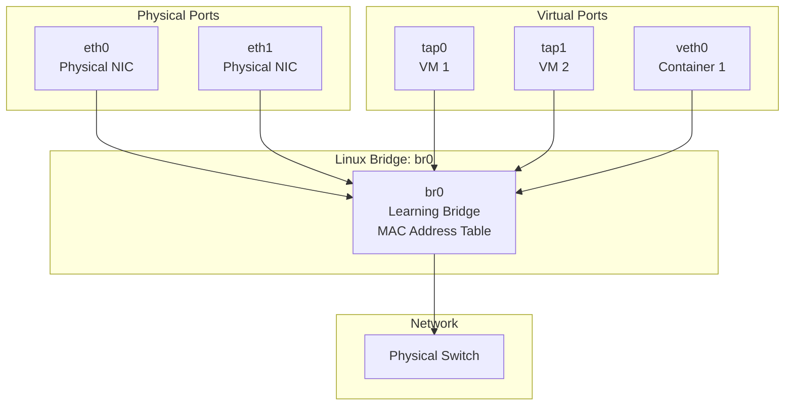
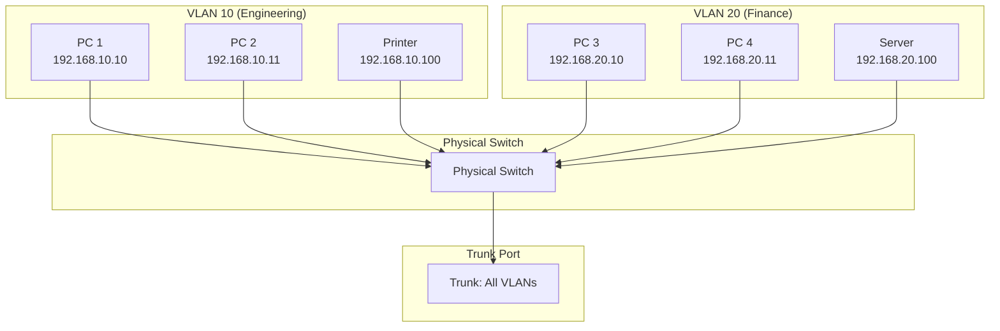
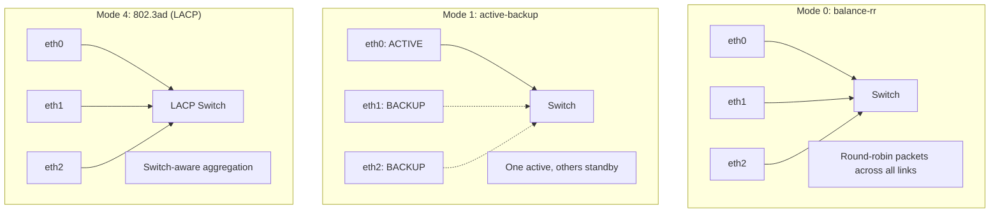
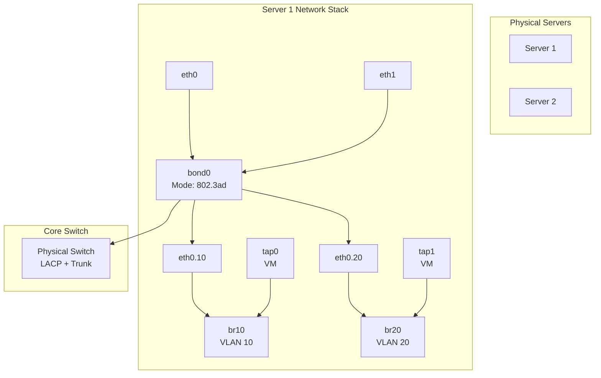

# Chapter 151: Bridging, VLAN, and Bonding

## Introduction

Layer 2 networking features—bridging, VLANs, and bonding—are fundamental building blocks for constructing flexible, resilient, and scalable network topologies on Linux. Bridging connects multiple network segments at the data link layer, VLANs partition a single physical network into isolated logical networks, and bonding aggregates multiple physical links for increased bandwidth and redundancy. These features are essential in data centers, virtualization environments, and enterprise networks.

Understanding these technologies at the Linux kernel level allows administrators to build sophisticated network toppheres: virtual machines connected through bridges, containers on isolated VLANs, and servers with bonded links for high availability. Modern Linux implementations are mature, performant, and widely deployed.

## Intuition: Physical Network Devices

Think of a **bridge** as a physical network switch—it learns which MAC addresses are on which ports and forwards frames only to the appropriate port. A **VLAN** is like having multiple virtual switches inside one physical switch—traffic on VLAN 10 never sees traffic on VLAN 20, even though they share the same physical cables. **Bonding** is like combining multiple lanes on a highway—if one lane is blocked, traffic continues on the others, and overall capacity increases.

## Bridging

### What is a Bridge?

A bridge operates at Layer 2, forwarding Ethernet frames between ports based on MAC addresses. Linux bridges are functionally equivalent to physical network switches and are heavily used in virtualization (KVM, Docker, Kubernetes) to connect virtual machines and containers to the physical network.

### Bridge Architecture



### Bridge Configuration

#### Using ip command (Modern)

```bash
# Create a bridge
ip link add name br0 type bridge

# Add ports to the bridge
ip link set eth0 master br0
ip link set eth1 master br0

# Configure bridge settings
ip link set br0 type bridge stp_state 1      # Enable STP
ip link set br0 type bridge ageing_time 300   # MAC aging time (seconds)
ip link set br0 type bridge priority 32768    # Bridge priority

# Assign IP to bridge
ip addr add 192.168.1.1/24 dev br0

# Bring up interfaces
ip link set eth0 up
ip link set eth1 up
ip link set br0 up

# View bridge info
bridge link show
bridge fdb show
ip -d link show br0
```

#### Using brctl (Legacy)

```bash
# Create bridge
brctl addbr br0

# Add ports
brctl addif br0 eth0
brctl addif br0 eth1

# Configure
brctl setbridgeprio br0 32768
brctl setfd br0 15          # Forward delay
brctl setageing br0 300     # Aging time

# Enable STP
brctl stp br0 on

# Show info
brctl show
brctl showmacs br0

# Delete bridge
brctl delif br0 eth0
brctl delbr br0
```

### Bridge Kernel Data Structures

```c
/* include/linux/if_bridge.h (simplified) */

struct net_bridge {
    spinlock_t              lock;
    struct list_head        port_list;      /* Ports attached to bridge */
    struct net_device       *dev;           /* Bridge net_device */
    struct net_device       *dev_owner;
    unsigned char           priority;       /* Bridge priority */
    unsigned char           group_addr[ETH_ALEN];
    __u16                   root_port;      /* Root port for STP */
    __u16                   stp_version;
    unsigned long           ageing_time;    /* MAC address aging time */
    struct net_bridge_fdb_entry *hash;      /* FDB hash table */
    spinlock_t              hash_lock;
    struct hlist_head       fdb_hash_tbl[BR_HASH_SIZE];
};

struct net_bridge_port {
    struct net_bridge       *br;            /* Parent bridge */
    struct net_device       *dev;           /* Port net_device */
    struct list_head        list;           /* Bridge port list */
    u8                      priority;       /* Port priority */
    u8                      state;          /* STP state */
    u16                     port_no;        /* Port number */
    unsigned char           state;          /* Forwarding state */
    struct timer_list       forward_delay_timer;
};
```

### Bridge FDB (Forwarding Database)

```bash
# View MAC address table
bridge fdb show
bridge fdb show dev br0

# Add static FDB entry
bridge fdb add aa:bb:cc:dd:ee:ff dev eth0 master

# Delete FDB entry
bridge fdb del aa:bb:cc:dd:ee:ff dev eth0

# View bridge statistics
ip -s -d link show br0
```

### Bridge in Containers/KVM

```bash
# Typical Docker bridge setup
docker network create --driver bridge mynet

# KVM/QEMU bridge setup
# /etc/qemu/bridge.conf
allow br0

# Create tap interface for VM
ip tuntap add tap0 mode tap
ip link set tap0 master br0
ip link set tap0 up

# Launch VM with bridged networking
qemu-system-x86_64 -net nic -net bridge,br=br0 ...
```

## VLAN (802.1Q)

### What is a VLAN?

A Virtual LAN (VLAN) partitions a single physical network into multiple isolated broadcast domains. VLANs are defined by IEEE 802.1Q and use a 4-byte tag inserted into the Ethernet frame header to identify the VLAN.

### 802.1Q Frame Format

```
Standard Ethernet Frame:
┌──────────┬──────────┬─────────┬─────────┬─────┐
│ Dst MAC  │ Src MAC  │  Type   │ Payload │ CRC │
└──────────┴──────────┴─────────┴─────────┴─────┘

802.1Q Tagged Frame:
┌──────────┬──────────┬────────┬─────────┬─────────┬─────┐
│ Dst MAC  │ Src MAC  │  VLAN  │  Type   │ Payload │ CRC │
│          │          │  Tag   │         │         │     │
└──────────┴──────────┴────────┴─────────┴─────────┴─────┘

VLAN Tag (4 bytes):
┌────────────────┬───────────┬────────────────────┐
│ TPID (0x8100)  │ Priority  │    VLAN ID (12)    │
│    (16 bits)   │  (3 bits) │   (0-4095)         │
└────────────────┴───────────┴────────────────────┘
```

### VLAN Architecture



### VLAN Configuration

#### Creating VLAN Interfaces

```bash
# Create VLAN interface on eth0
ip link add link eth0 name eth0.10 type vlan id 10
ip link add link eth0 name eth0.20 type vlan id 20

# Assign IP addresses
ip addr add 192.168.10.1/24 dev eth0.10
ip addr add 192.168.20.1/24 dev eth0.20

# Bring up interfaces
ip link set eth0.10 up
ip link set eth0.20 up

# View VLAN info
ip -d link show eth0.10
cat /proc/net/vlan/eth0.10

# Delete VLAN
ip link delete eth0.10
```

#### VLAN on Bridge

```bash
# Create bridge for VLAN 10
ip link add br10 type bridge
ip link add link eth0 name eth0.10 type vlan id 10
ip link set eth0.10 master br10
ip link set eth0.10 up
ip link set br10 up

# Or use VLAN filtering on bridge
ip link add br0 type bridge vlan_filtering 1
ip link set eth0 master br0
bridge vlan add dev eth0 vid 10 pvid untagged
bridge vlan add dev eth0 vid 20
bridge vlan show
```

### VLAN Kernel Data Structure

```c
/* include/linux/if_vlan.h (simplified) */

struct vlan_dev_priv {
    unsigned int                nr_ingress_mappings;
    u32                         ingress_priority_map[8];
    unsigned int                nr_egress_mappings;
    struct vlan_priority_tci_mapping *egress_priority_map[16];

    __be16                      vlan_proto;   /* ETH_P_8021Q */
    u16                         vlan_id;      /* 0-4095 */
    u16                         flags;

    struct net_device           *real_dev;     /* Parent device */
    unsigned char               real_dev_addr[ETH_ALEN];

    struct proc_dir_entry       *dent;
    struct vlan_pcpu_stats __percpu *vlan_pcpu_stats;
};
```

### VLAN Commands Reference

```bash
# Create VLAN (vconfig - legacy)
vconfig add eth0 10

# Bridge VLAN management
bridge vlan add dev eth0 vid 10 pvid untagged
bridge vlan del dev eth0 vid 10
bridge vlan show dev eth0

# VLAN trunk configuration
bridge vlan add dev eth0 vid 10-20
bridge vlan add dev eth1 vid 10-20
```

## Bonding (Link Aggregation)

### What is Bonding?

Bonding (also called NIC teaming or link aggregation) combines multiple physical network interfaces into a single logical interface for increased bandwidth, redundancy, or both. Linux supports several bonding modes, each with different characteristics.

### Bonding Modes

| Mode | Name | Description | Use Case |
|------|------|-------------|----------|
| 0 | balance-rr | Round-robin | Load balancing |
| 1 | active-backup | One active, others standby | High availability |
| 2 | balance-xor | XOR hash of MAC addresses | Load balancing |
| 3 | broadcast | Transmit on all interfaces | Fault tolerance |
| 4 | 802.3ad | LACP (Link Aggregation Control Protocol) | Switch-supported aggregation |
| 5 | balance-tlb | Transmit load balancing | No switch config needed |
| 6 | balance-alb | Adaptive load balancing | No switch config needed |

### Bonding Mode Comparison



### Bonding Configuration

#### Using ip command

```bash
# Create bond interface
ip link add bond0 type bond mode 802.3ad

# Add slave interfaces
ip link set eth0 master bond0
ip link set eth1 master bond0

# Configure bond parameters
ip link set bond0 type bond xmit_hash_policy layer3+4
ip link set bond0 type bond miimon 100
ip link set bond0 type bond lacp_rate fast

# Assign IP
ip addr add 192.168.1.1/24 dev bond0

# Bring up
ip link set eth0 up
ip link set eth1 up
ip link set bond0 up

# View bond info
ip -d link show bond0
cat /proc/net/bonding/bond0
```

#### Using sysfs (Traditional)

```bash
# Load bonding module
modprobe bonding mode=4 miimon=100 xmit_hash_policy=layer3+4

# Create bond
echo "+bond0" > /sys/class/net/bonding_masters

# Configure mode
echo "802.3ad" > /sys/class/net/bond0/bonding/mode
echo "100" > /sys/class/net/bond0/bonding/miimon
echo "layer3+4" > /sys/class/net/bond0/bonding/xmit_hash_policy

# Add slaves
echo "+eth0" > /sys/class/net/bond0/bonding/slaves
echo "+eth1" > /sys/class/net/bond0/bonding/slaves

# View status
cat /sys/class/net/bond0/bonding/mode
cat /sys/class/net/bond0/bonding/slaves
cat /sys/class/net/bond0/bonding/active_slave
```

#### Using nmcli (NetworkManager)

```bash
# Create bond
nmcli connection add type bond ifname bond0 bond.options "mode=802.3ad,miimon=100"

# Add slave connections
nmcli connection add type ethernet ifname eth0 master bond0
nmcli connection add type ethernet ifname eth1 master bond0

# Configure IP
nmcli connection modify bond0 ipv4.addresses 192.168.1.1/24
nmcli connection modify bond0 ipv4.method manual

# Bring up
nmcli connection up bond0
```

### Bonding Kernel Data Structure

```c
/* drivers/net/bonding/bonding.h (simplified) */

struct bonding {
    struct net_device       *dev;           /* Bond net_device */
    spinlock_t              lock;
    struct list_head        bond_list;      /* List of bonds */
    struct list_head        slaves;         /* List of slave devices */

    /* Bonding parameters */
    int                     mode;           /* Bonding mode */
    int                     xmit_hash_policy;
    int                     miimon;         /* Link monitoring interval */
    int                     num_slaves;     /* Number of slaves */
    struct slave            *primary_slave; /* Primary slave */
    struct slave            *current_arp_slave;
    s8                      slave_cnt;
    u32                     ad_actor_key;
    u16                     ad_user_port_key;
};

struct slave {
    struct net_device       *dev;           /* Slave net_device */
    struct bonding          *bond;          /* Parent bond */
    struct list_head        list;           /* Slave list */
    u8                      prio;           /* Slave priority */
    u8                      state;          /* Slave state */
    struct net_device_stats stats;
};
```

### Bonding Failover Testing

```bash
# Simulate link failure
ip link set eth0 down

# Watch failover
watch -n 1 'cat /proc/net/bonding/bond0'

# Restore link
ip link set eth0 up

# Monitor bond status
cat /proc/net/bonding/bond0
# Ethernet Channel Bonding Driver: ...
#
# Bonding Mode: IEEE 802.3ad Dynamic link aggregation
# Transmit Hash Policy: layer3+4 (1)
# MII Status: up
# MII Polling Interval (ms): 100
# Up Delay (ms): 0
# Down Delay (ms): 0
#
# 802.3ad info
# LACP rate: slow
# ...
#
# Slave Interface: eth0
# MII Status: up
# Speed: 1000 Mbps
# Duplex: full
# Link Failure Count: 0
# ...
```

## Combined: Bridge + VLAN + Bonding

### Data Center Network Design



### Configuration Script

```bash
#!/bin/bash
# Configure bond + bridge + VLAN

# Create bond
ip link add bond0 type bond mode 802.3ad
ip link set eth0 master bond0
ip link set eth1 master bond0
ip link set eth0 up
ip link set eth1 up
ip link set bond0 up

# Create VLANs on bond
ip link add link bond0 name bond0.10 type vlan id 10
ip link add link bond0 name bond0.20 type vlan id 20
ip link set bond0.10 up
ip link set bond0.20 up

# Create bridges for each VLAN
ip link add br10 type bridge
ip link add br20 type bridge

# Attach VLAN interfaces to bridges
ip link set bond0.10 master br10
ip link set bond0.20 master br20

# Assign management IP
ip addr add 192.168.10.1/24 dev br10

# Bring up bridges
ip link set br10 up
ip link set br20 up

# Add VMs to bridges (when they start)
# ip link set tap0 master br10
# ip link set tap1 master br20

echo "Bond, VLAN, and bridge configuration complete"
```

## Monitoring

### Bridge Monitoring

```bash
# Bridge status
bridge link show
bridge fdb show
bridge vlan show

# Bridge port states
ip -d link show type bridge_slave

# STP status
bridge -d stp show
cat /proc/net/stp_state
```

### VLAN Monitoring

```bash
# VLAN info
cat /proc/net/vlan/config
ip -d link show type vlan

# VLAN traffic stats
ip -s link show eth0.10
```

### Bonding Monitoring

```bash
# Bond status
cat /proc/net/bonding/bond0

# Detailed slave info
ip -d link show type bond_slave

# Bond statistics
ip -s link show bond0
```

## Common Pitfalls

1. **STP convergence time**: Default STP takes 30-50 seconds to converge; use RSTP for faster failover
2. **Bridge loops**: Connecting bridges in a loop without STP causes broadcast storms
3. **VLAN trunking**: Forgetting to configure trunk ports on physical switches
4. **Bonding mode mismatch**: Bonding mode must match on both ends (server and switch)
5. **MTU issues**: VLAN tagging adds 4 bytes; jumbo frames may be needed
6. **MAC address learning**: Bridge may learn MACs from unexpected ports
7. **ARP on bonds**: Mode 0 (balance-rr) can cause out-of-order ARP responses

## Best Practices

1. **Use RSTP**: Faster convergence than classic STP
2. **Set bridge priority**: Lower priority for root bridge selection
3. **Use VLAN filtering**: On bridges for security
4. **Monitor bond slaves**: Alert on link failures
5. **Use LACP (802.3ad)**: When switches support it, for best performance
6. **Document VLAN assignments**: Maintain a VLAN allocation spreadsheet
7. **Test failover**: Regularly test bonding failover scenarios

## Exercises

1. **Bridge lab**: Create a Linux bridge with three virtual Ethernet interfaces. Connect three network namespaces and verify connectivity.

2. **VLAN setup**: Configure VLANs 10 and 20 on a Linux host. Create VLAN interfaces and verify that traffic is isolated between VLANs.

3. **Bonding failover**: Set up active-backup bonding with two interfaces. Simulate a link failure and measure failover time.

4. **Bridge + VLAN**: Create a bridge with VLAN filtering. Configure access and trunk ports and verify correct VLAN behavior.

5. **Combined topology**: Set up a bond with LACP, VLANs on the bond, and bridges for VMs on each VLAN.

6. **STP analysis**: Enable STP on a bridge, capture BPDUs with tcpdump, and analyze the STP topology.

## References

1. IEEE 802.1Q: Virtual Bridged Local Area Networks
2. IEEE 802.3ad: Link Aggregation
3. Linux kernel source: `net/bridge/`, `drivers/net/bonding/`, `net/8021q/`
4. Linux man pages: `bridge(8)`, `bonding(7)`
5. Linux kernel documentation: `Documentation/networking/bonding.rst`
6. Linux kernel documentation: `Documentation/networking/bridge.rst`
