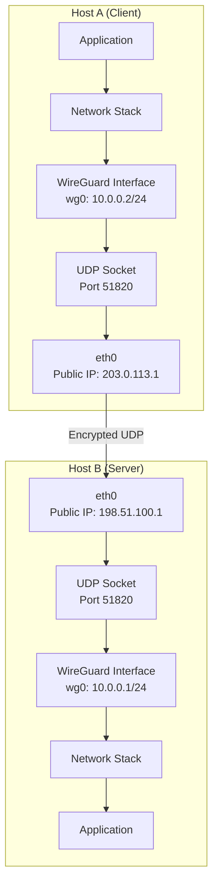

# Chapter 152: WireGuard and OpenVPN

## Introduction

Virtual Private Networks (VPNs) create encrypted tunnels over untrusted networks, enabling secure communication between remote hosts and networks. On Linux, two VPN technologies dominate: WireGuard, the modern, high-performance kernel-based VPN, and OpenVPN, the mature, flexible user-space VPN. Understanding both is essential for building secure network infrastructure.

WireGuard, merged into the Linux kernel in version 5.6 (2020), represents a paradigm shift in VPN design—simple, fast, and cryptographically robust. OpenVPN, in contrast, has been the industry standard for over two decades, offering extensive flexibility through its user-space implementation and OpenSSL integration. Together, they cover the spectrum from maximum performance to maximum compatibility.

## WireGuard

### Intuition: The Secret Tunnel

WireGuard is like a secret tunnel between two buildings. Only people who know the secret handshake (cryptographic keys) can enter. The tunnel is always there (UDP port), but only opens for authorized traffic. It's simple—no complex negotiations, no multiple protocol layers, no certificate authorities. Just public-key cryptography and a shared understanding of who's allowed to talk to whom.

### Architecture



### WireGuard Design Principles

1. **Simplicity**: ~4,000 lines of kernel code (vs ~100,000+ for IPsec)
2. **Static configuration**: No dynamic key exchange protocols (no IKE)
3. **Noise Protocol Framework**: Based on the Noise IKpsk2 handshake
4. **Curve25519**: Key exchange
5. **ChaCha20-Poly1305**: Encryption and authentication
6. **BLAKE2s**: Hashing
7. **SipHash24**: Hashtable keyed hashing
8. **HKDF**: Key derivation

### WireGuard Header

```
 0                   1                   2                   3
 0 1 2 3 4 5 6 7 8 9 0 1 2 3 4 5 6 7 8 9 0 1 2 3 4 5 6 7 8 9 0 1
├─┼─┼─┼─┼─┼─┼─┼─┼─┼─┼─┼─┼─┼─┼─┼─┼─┼─┼─┼─┼─┼─┼─┼─┼─┼─┼─┼─┼─┼─┼─┼─┤
│                     Message Type (1)                            │
├─┼─┼─┼─┼─┼─┼─┼─┼─┼─┼─┼─┼─┼─┼─┼─┼─┼─┼─┼─┼─┼─┼─┼─┼─┼─┼─┼─┼─┼─┼─┼─┤
│                     Reserved (3)                                │
├─┼─┼─┼─┼─┼─┼─┼─┼─┼─┼─┼─┼─┼─┼─┼─┼─┼─┼─┼─┼─┼─┼─┼─┼─┼─┼─┼─┼─┼─┼─┼─┤
│                     Sender Index (4)                            │
├─┼─┼─┼─┼─┼─┼─┼─┼─┼─┼─┼─┼─┼─┼─┼─┼─┼─┼─┼─┼─┼─┼─┼─┼─┼─┼─┼─┼─┼─┼─┼─┤
│                     ... (message-type dependent)               │
└─┴─┴─┴─┴─┴─┴─┴─┴─┴─┴─┴─┴─┴─┴─┴─┴─┴─┴─┴─┴─┴─┴─┴─┴─┴─┴─┴─┴─┴─┴─┴─┘

Message Types:
  1 = Handshake Initiation
  2 = Handshake Response
  3 = Cookie Reply
  4 = Transport Data
```

### WireGuard Configuration

#### Server Setup

```bash
# Install WireGuard
apt install wireguard   # Debian/Ubuntu
dnf install wireguard-tools  # Fedora/RHEL

# Generate keys
wg genkey | tee server_private.key | wg pubkey > server_public.key

# Create configuration
cat > /etc/wireguard/wg0.conf << EOF
[Interface]
# Server private key
PrivateKey = $(cat server_private.key)
# Server's VPN IP
Address = 10.0.0.1/24
# Listen port
ListenPort = 51820
# Save configuration on shutdown
SaveConfig = false

# Optional: NAT traversal
# PostUp = iptables -A FORWARD -i wg0 -j ACCEPT
# PostDown = iptables -D FORWARD -i wg0 -j ACCEPT

# Client 1
[Peer]
PublicKey = CLIENT1_PUBLIC_KEY
AllowedIPs = 10.0.0.2/32

# Client 2
[Peer]
PublicKey = CLIENT2_PUBLIC_KEY
AllowedIPs = 10.0.0.3/32
EOF

# Set permissions
chmod 600 /etc/wireguard/wg0.conf

# Enable and start
systemctl enable wg-quick@wg0
systemctl start wg-quick@wg0
```

#### Client Setup

```bash
# Generate client keys
wg genkey | tee client_private.key | wg pubkey > client_public.key

# Create client configuration
cat > /etc/wireguard/wg0.conf << EOF
[Interface]
PrivateKey = $(cat client_private.key)
Address = 10.0.0.2/24
DNS = 10.0.0.1

[Peer]
PublicKey = SERVER_PUBLIC_KEY
Endpoint = 198.51.100.1:51820
AllowedIPs = 0.0.0.0/0, ::/0  # Route all traffic through VPN
PersistentKeepalive = 25
EOF

# Start VPN
wg-quick up wg0

# Check status
wg show
```

### WireGuard Commands

```bash
# Show interface status
wg show
wg show wg0
wg show wg0 dump  # Machine-readable

# Add peer dynamically
wg set wg0 peer NEW_PUBLIC_KEY allowed-ips 10.0.0.4/32

# Remove peer
wg set wg0 peer OLD_PUBLIC_KEY remove

# Show configuration
wg showconf wg0

# Quick key generation
wg genkey
wg pubkey < private.key

# Pre-shared key (for post-quantum resistance)
wg genpsk
```

### WireGuard Routing and NAT

```bash
# Server: Enable IP forwarding
echo 1 > /proc/sys/net/ipv4/ip_forward

# Server: NAT for VPN clients
iptables -t nat -A POSTROUTING -s 10.0.0.0/24 -o eth0 -j MASQUERADE
iptables -A FORWARD -i wg0 -j ACCEPT
iptables -A FORWARD -o wg0 -m state --state RELATED,ESTABLISHED -j ACCEPT

# Client: Route specific networks through VPN
# In wg0.conf:
# AllowedIPs = 10.0.0.0/24, 192.168.1.0/24

# Client: Route all traffic through VPN (kill switch)
# In wg0.conf:
# AllowedIPs = 0.0.0.0/0, ::/0
# This routes ALL traffic through the VPN
```

### WireGuard Performance

```bash
# Typical WireGuard performance
# CPU-limited, not crypto-limited

# Benchmark with iperf3 through WireGuard
iperf3 -s -B 10.0.0.1                    # Server on VPN IP
iperf3 -c 10.0.0.1 -t 30 -P 4           # Client through VPN

# Expected performance:
# ~1 Gbps on modern x86 with AES-NI
# ~500 Mbps on ARM devices
# ~50-100 Mbps on embedded devices

# CPU usage monitoring
top -p $(pgrep -f "wg0")
```

## OpenVPN

### Intuition: The SSL Tunnel

OpenVPN is like establishing an SSL/TLS connection (like HTTPS) but for all network traffic, not just web browsing. It uses OpenSSL for cryptography, supports both TCP and UDP, and can traverse NATs and firewalls easily because it looks like regular HTTPS traffic. It's the Swiss Army knife of VPNs—flexible, compatible, and well-understood.

### Architecture

```mermaid
graph TB
    subgraph "OpenVPN Client"
        APP_C[Application]
        TUN_C[tun0<br/>VPN Interface]
        OVPN_C[OpenVPN Process<br/>(User Space)]
        NET_C[Network Stack]
        NIC_C[eth0<br/>Public IP]
    end

    subgraph "OpenVPN Server"
        NIC_S[eth0<br/>Public IP]
        NET_S[Network Stack]
        OVPN_S[OpenVPN Process<br/>(User Space)]
        TUN_S[tun0<br/>VPN Interface]
        APP_S[Application]
    end

    APP_C --> TUN_C --> OVPN_C --> NET_C --> NIC_C
    NIC_C -->|"Encrypted TCP/UDP"| NIC_S
    NIC_S --> NET_S --> OVPN_S --> TUN_S --> APP_S
```

### WireGuard vs OpenVPN

| Feature | WireGuard | OpenVPN |
|---------|-----------|---------|
| Implementation | Kernel module | User-space daemon |
| Code size | ~4,000 lines | ~100,000 lines |
| Cryptography | Fixed (Noise Protocol) | Configurable (OpenSSL) |
| Key exchange | Static keys | TLS/SSL certificates |
| Protocol | UDP only | UDP or TCP |
| Performance | Very high | Good |
| NAT traversal | Built-in (UDP) | NAT-T support |
| Roaming | Built-in (endpoint changes) | Reconnection needed |
| Mobile support | Excellent | Good |
| Certificate PKI | Not required | Required (or static keys) |
| Auditability | Easy (small codebase) | Complex (large codebase) |

### OpenVPN Configuration

#### Server Configuration

```bash
# /etc/openvpn/server.conf

# Network
port 1194
proto udp
dev tun

# TLS/SSL
ca /etc/openvpn/ca.crt
cert /etc/openvpn/server.crt
key /etc/openvpn/server.key
dh /etc/openvpn/dh.pem
tls-auth /etc/openvpn/ta.key 0

# Network topology
server 10.8.0.0 255.255.255.0
topology subnet

# Push routes to clients
push "route 192.168.1.0 255.255.255.0"
push "dhcp-option DNS 8.8.8.8"
push "dhcp-option DNS 8.8.4.4"

# Client-to-client communication
client-to-client

# Keep connection alive
keepalive 10 120

# Security
cipher AES-256-GCM
auth SHA256
tls-version-min 1.2

# Compression (use with caution - VORACLE attack)
# compress lz4-v2

# Logging
status /var/log/openvpn/status.log
log-append /var/log/openvpn/server.log
verb 3

# User/Group privileges
user nobody
group nogroup

# Persist settings across restarts
persist-key
persist-tun

# Connection management
management 127.0.0.1 7505
```

#### Client Configuration

```bash
# /etc/openvpn/client.ovpn

client
dev tun
proto udp

remote 198.51.100.1 1194
resolv-retry infinite
nobind

# TLS
ca ca.crt
cert client.crt
key client.key
tls-auth ta.key 1

# Security
cipher AES-256-GCM
auth SHA256
tls-version-min 1.2

# Route all traffic through VPN
redirect-gateway def1 bypass-dhcp

# Keep alive
keepalive 10 120

# Compression
# compress lz4-v2

# Logging
verb 3

# User privileges
user nobody
group nogroup

persist-key
persist-tun
```

### PKI Setup for OpenVPN

```bash
# Initialize PKI
easyrsa init-pki

# Build CA
easyrsa build-ca nopass

# Generate server certificate and key
easyrsa build-server-full server nopass

# Generate client certificate and key
easyrsa build-client-full client1 nopass

# Generate Diffie-Hellman parameters
easyrsa gen-dh

# Generate TLS-Auth key
openvpn --genkey secret ta.key

# Generate CRL (Certificate Revocation List)
easyrsa gen-crl
```

### OpenVPN Commands

```bash
# Start server
openvpn --config /etc/openvpn/server.conf
systemctl start openvpn@server

# Start client
openvpn --config /etc/openvpn/client.ovpn
systemctl start openvpn@client

# Check status
systemctl status openvpn@server
cat /var/log/openvpn/status.log

# Management interface
telnet 127.0.0.1 7505
# Commands: status, kill, quit
```

### OpenVPN Routing

```bash
# Server: Enable forwarding
echo 1 > /proc/sys/net/ipv4/ip_forward

# Server: NAT for VPN clients
iptables -t nat -A POSTROUTING -s 10.8.0.0/24 -o eth0 -j MASQUERADE
iptables -A FORWARD -i tun0 -j ACCEPT
iptables -A FORWARD -o tun0 -m state --state RELATED,ESTABLISHED -j ACCEPT

# Push specific routes to clients
push "route 192.168.1.0 255.255.255.0"

# Route specific client traffic through VPN
# In client config:
# route-nopull
# route 192.168.1.0 255.255.255.0 vpn_gateway
```

## Advanced Configurations

### WireGuard Site-to-Site VPN

```bash
# Site A (192.168.1.0/24) -- Site B (192.168.2.0/24)

# Site A Configuration
cat > /etc/wireguard/wg0.conf << EOF
[Interface]
PrivateKey = SITE_A_PRIVATE_KEY
Address = 10.0.0.1/24
ListenPort = 51820

# Forward traffic between sites
PostUp = iptables -A FORWARD -i wg0 -j ACCEPT
PostDown = iptables -D FORWARD -i wg0 -j ACCEPT

[Peer]
PublicKey = SITE_B_PUBLIC_KEY
AllowedIPs = 10.0.0.2/32, 192.168.2.0/24
Endpoint = site-b.example.com:51820
PersistentKeepalive = 25
EOF

# Site B Configuration
cat > /etc/wireguard/wg0.conf << EOF
[Interface]
PrivateKey = SITE_B_PRIVATE_KEY
Address = 10.0.0.2/24
ListenPort = 51820

PostUp = iptables -A FORWARD -i wg0 -j ACCEPT
PostDown = iptables -D FORWARD -i wg0 -j ACCEPT

[Peer]
PublicKey = SITE_A_PUBLIC_KEY
AllowedIPs = 10.0.0.1/32, 192.168.1.0/24
Endpoint = site-a.example.com:51820
PersistentKeepalive = 25
EOF
```

### OpenVPN with TLS 1.3

```bash
# Server configuration for TLS 1.3
tls-version-min 1.3
tls-ciphersuites TLS_AES_256_GCM_SHA384:TLS_CHACHA20_POLY1305_SHA256
data-ciphers AES-256-GCM:CHACHA20-POLY1305
```

### WireGuard with systemd-networkd

```ini
# /etc/systemd/network/99-wg0.netdev
[NetDev]
Name=wg0
Kind=wireguard

[WireGuard]
PrivateKey=SERVER_PRIVATE_KEY
ListenPort=51820

[WireGuardPeer]
PublicKey=CLIENT_PUBLIC_KEY
AllowedIPs=10.0.0.2/32

# /etc/systemd/network/99-wg0.network
[Match]
Name=wg0

[Network]
Address=10.0.0.1/24
IPForward=yes

[Route]
Destination=192.168.1.0/24
Gateway=10.0.0.2
```

## Security

### WireGuard Security

```bash
# Pre-shared key for post-quantum resistance
# Add to each peer section:
PresharedKey = PRESHARED_KEY

# Firewall rules for WireGuard
iptables -A INPUT -p udp --dport 51820 -j ACCEPT
iptables -A INPUT -i wg0 -j ACCEPT
iptables -A FORWARD -i wg0 -j ACCEPT

# Rate limit connection attempts
iptables -A INPUT -p udp --dport 51820 \
    -m hashlimit --hashlimit-above 10/minute \
    --hashlimit-burst 5 --hashlimit-mode srcip \
    -j DROP
```

### OpenVPN Security

```bash
# Strong cipher configuration
cipher AES-256-GCM
auth SHA256
tls-version-min 1.2
tls-cipher TLS-ECDHE-ECDSA-WITH-AES-256-GCM-SHA384

# Certificate revocation
crl-verify /etc/openvpn/crl.pem

# Two-factor authentication
# /etc/openvpn/server.conf
auth-user-pass-verify /etc/openvpn/check.sh via-env
script-security 2

# Firewall
iptables -A INPUT -p udp --dport 1194 -j ACCEPT
iptables -A INPUT -i tun0 -j ACCEPT
```

## Performance Optimization

### WireGuard Optimization

```bash
# Use multiple queues
ethtool -L eth0 combined 4

# RSS (Receive Side Scaling)
ethtool -X eth0 hkey $(wg show wg0 public-key | sha256sum | head -c 32)

# CPU affinity
taskset -c 0-3 wg-quick up wg0

# Increase socket buffer
sysctl -w net.core.rmem_max=26214400
sysctl -w net.core.wmem_max=26214400
```

### OpenVPN Optimization

```bash
# Use UDP (faster than TCP)
proto udp

# Increase send/receive buffers
sndbuf 524288
rcvbuf 524288

# Use LZ4 compression
compress lz4-v2

# Increase MTU
tun-mtu 9000
link-mtu 9000

# Fast I/O
fast-io

# Multi-threading (OpenVPN 2.5+)
# workers 4
```

## Debugging

### WireGuard Debugging

```bash
# Show interface status
wg show
wg show wg0

# Check kernel module
lsmod | grep wireguard
modinfo wireguard

# Debug logging
echo module wireguard +p > /sys/kernel/debug/dynamic_debug/control
dmesg | grep wireguard

# Monitor handshake
watch -n 1 'wg show wg0 latest-handshakes'

# Check firewall
iptables -L -n -v | grep 51820
```

### OpenVPN Debugging

```bash
# Verbose logging
verb 6

# Status file
cat /var/log/openvpn/status.log

# Management interface
telnet 127.0.0.1 7505
> status
> kill client1

# Check certificates
openssl x509 -in client.crt -text -noout
openssl verify -CAfile ca.crt client.crt

# Test TLS handshake
openssl s_client -connect server:1194 -tls1_2
```

## Common Pitfalls

1. **WireGuard no handshake**: Check firewall rules for UDP port, ensure public keys match
2. **OpenVPN TLS errors**: Certificate chain issues, time synchronization problems
3. **MTU issues**: VPN overhead reduces effective MTU; use `ping -M do -s 1400` to test
4. **DNS leaks**: VPN configured but DNS queries go to ISP; use `push "dhcp-option DNS"`
5. **Routing loops**: All traffic through VPN but VPN traffic goes through default route
6. **Key rotation**: WireGuard static keys don't expire; manage manually
7. **NAT keepalive**: Behind NAT, use `PersistentKeepalive` for WireGuard

## Best Practices

1. **Use WireGuard when possible**: Simpler, faster, more secure
2. **Use TLS 1.3**: For OpenVPN when available
3. **Implement kill switch**: Block traffic if VPN drops
4. **Rotate keys**: Regularly update WireGuard keys
5. **Monitor connections**: Alert on VPN tunnel failures
6. **Use DNS over VPN**: Push DNS configuration to clients
7. **Document configurations**: Maintain configuration management

## Exercises

1. **WireGuard setup**: Configure a WireGuard server and client. Verify encrypted tunnel operation with tcpdump.

2. **Site-to-site VPN**: Set up WireGuard between two sites with different LAN subnets. Verify bidirectional connectivity.

3. **OpenVPN PKI**: Set up a complete OpenVPN PKI with CA, server, and client certificates. Test connection.

4. **Performance comparison**: Benchmark WireGuard and OpenVPN throughput with iperf3. Compare CPU usage.

5. **Roaming test**: Move a WireGuard client between networks and verify seamless reconnection.

6. **Kill switch**: Configure a firewall kill switch that blocks all traffic if the VPN tunnel drops.

## References

1. WireGuard protocol: https://www.wireguard.com/protocol/
2. WireGuard paper: "WireGuard: Next Generation Kernel Network Tunnel"
3. OpenVPN documentation: https://openvpn.net/community-resources/
4. Noise Protocol Framework: https://noiseprotocol.org/
5. Linux kernel source: `drivers/net/wireguard/`
6. Linux man pages: `wg(8)`, `wg-quick(8)`, `openvpn(8)`
7. RFC 7296: Internet Key Exchange Protocol Version 2 (IKEv2) - for comparison
