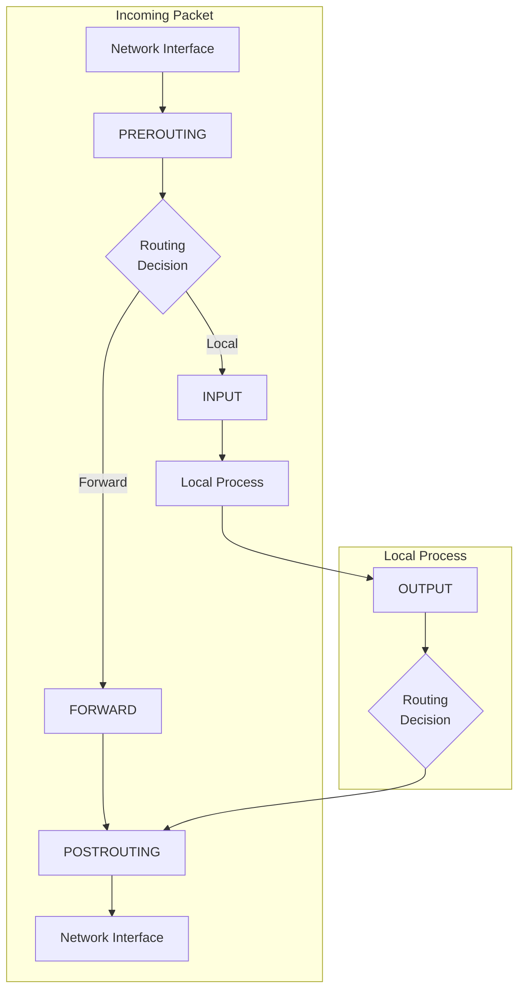

# Chapter 153: Firewalls — conntrack, NAT, Stateful Inspection

## Introduction

The Linux firewall subsystem is one of the most powerful and flexible in any operating system. Built around netfilter—a framework of hooks in the kernel networking stack—and its user-space tools (iptables, nftables), it provides packet filtering, Network Address Translation (NAT), connection tracking (conntrack), and stateful inspection. Understanding these components is essential for securing Linux systems, building network infrastructure, and troubleshooting connectivity issues.

The Linux firewall has evolved significantly over the decades: from ipchains (kernel 2.2) to iptables (kernel 2.4) to nftables (kernel 3.13+). While iptables remains widely deployed, nftables is its successor and is now the default on many distributions. This chapter covers both, with deep focus on the underlying mechanisms they share.

## Intuition: The Security Guard

Think of the firewall as a security guard at a building entrance:
- **Packet filtering**: "Do you have an appointment? No? Denied."
- **Stateful inspection**: "You checked in earlier? Come on through."
- **NAT (SNAT)**: "Your badge says you're from Building A, but I'll mark you as coming from the lobby."
- **NAT (DNAT)**: "You asked for Suite 501, but I'll send you to Suite 301."
- **conntrack**: "I remember you. You're the one who arrived at 9 AM for a meeting in Room 305."

## Netfilter Architecture

### Netfilter Hooks

Netfilter places hooks at five points in the packet path:



### Hook Points and Chains

| Hook | Chain | Description |
|------|-------|-------------|
| `NF_INET_PRE_ROUTING` | PREROUTING | Before routing decision |
| `NF_INET_LOCAL_IN` | INPUT | Packets destined for local process |
| `NF_INET_FORWARD` | FORWARD | Packets being forwarded |
| `NF_INET_LOCAL_OUT` | OUTPUT | Locally-generated packets |
| `NF_INET_POST_ROUTING` | POSTROUTING | After routing decision |

### iptables Tables

| Table | Priority | Purpose | Chains |
|-------|----------|---------|--------|
| `raw` | -300 | Connection tracking bypass | PREROUTING, OUTPUT |
| `mangle` | -150 | Packet modification | All five |
| `nat` | -100 | Network Address Translation | PREROUTING, INPUT, OUTPUT, POSTROUTING |
| `filter` | 0 | Packet filtering (default) | INPUT, FORWARD, OUTPUT |
| `security` | 50 | SELinux/LSM security | INPUT, OUTPUT, FORWARD |

### Processing Order

```mermaid
flowchart LR
    IN[Incoming] --> RAW_PREROUTING["raw:PREROUTING"]
    RAW_PREROUTING --> CONNTRACK["conntrack<br/>(connection tracking)"]
    CONNTRACK --> MANGLE_PREROUTING["mangle:PREROUTING"]
    MANGLE_PREROUTING --> NAT_PREROUTING["nat:PREROUTING<br/>(DNAT)"]
    NAT_PREROUTING --> ROUTING{Routing}
    ROUTING -->|local| MANGLE_INPUT["mangle:INPUT"]
    MANGLE_INPUT --> FILTER_INPUT["filter:INPUT"]
    FILTER_INPUT --> LOCAL[Local Process]
    ROUTING -->|forward| MANGLE_FORWARD["mangle:FORWARD"]
    MANGLE_FORWARD --> FILTER_FORWARD["filter:FORWARD"]
    FILTER_FORWARD --> MANGLE_POSTROUTING["mangle:POSTROUTING"]
    MANGLE_POSTROUTING --> NAT_POSTROUTING["nat:POSTROUTING<br/>(SNAT/MASQUERADE)"]
    NAT_POSTROUTING --> OUT[Outgoing]
```



## Connection Tracking (conntrack)

### What is Connection Tracking?

Connection tracking (conntrack) is the foundation of stateful firewalling in Linux. It maintains a table of all active network connections, allowing the firewall to make decisions based on the state of a connection rather than individual packets.

### Connection States

| State | Description |
|-------|-------------|
| `NEW` | First packet of a connection |
| `ESTABLISHED` | Part of an existing connection (bidirectional traffic seen) |
| `RELATED` | Related to an existing connection (e.g., FTP data connection) |
| `INVALID` | Packet doesn't belong to any known connection |
| `UNTRACKED` | Packet explicitly marked as not tracked |

### Conntrack Table

```bash
# View connection tracking table
conntrack -L
conntrack -L -p tcp
conntrack -L --src 192.168.1.100

# Count connections
conntrack -C

# Monitor new connections
conntrack -E

# Flush table
conntrack -F

# Show specific connection
conntrack -L --dst 10.0.0.1 --dport 80

# Connection tracking statistics
cat /proc/net/stat/nf_conntrack
cat /proc/sys/net/netfilter/nf_conntrack_count
cat /proc/sys/net/netfilter/nf_conntrack_max
```

### Conntrack Data Structure

```c
/* include/net/netfilter/nf_conntrack.h (simplified) */

struct nf_conn {
    struct nf_conntrack      ct_general;    /* Reference count */
    spinlock_t               lock;

    /* Connection tuple (5-tuple) */
    struct nf_conntrack_tuple_hash tuplehash[IP_CT_DIR_MAX];

    /* Connection status */
    unsigned long            status;

    /* Timeout (jiffies) */
    unsigned long            timeout;

    /* Zone */
    u16                      zone;

    /* NAT info */
    struct nf_conn_nat       *nat;

    /* Helper (for protocols like FTP, SIP) */
    struct nf_conn_help      *help;

    /* Extensions */
    struct nf_ct_ext         *ext;
};

/* Connection tuple */
struct nf_conntrack_tuple {
    struct nf_conntrack_man src;   /* Source */
    struct {
        union nf_inet_addr  u3;    /* IP address */
        union {
            __be16          all;   /* Port (TCP/UDP) */
            struct {
                __be16      id;    /* ICMP ID */
                __u8        type;
                __u8        code;
            } icmp;
        } u;
        __u16               protonum; /* Protocol number */
    } dst;                         /* Destination */
};
```

### Conntrack Tuning

```bash
# Increase connection tracking table size
sysctl -w net.netfilter.nf_conntrack_max=262144

# Set timeouts
sysctl -w net.netfilter.nf_conntrack_tcp_timeout_established=86400
sysctl -w net.netfilter.nf_conntrack_tcp_timeout_time_wait=30
sysctl -w net.netfilter.nf_conntrack_tcp_timeout_close_wait=60
sysctl -w net.netfilter.nf_conntrack_udp_timeout=30
sysctl -w net.netfilter.nf_conntrack_udp_timeout_stream=180

# Hash table size (must be set at module load)
# modprobe nf_conntrack hashsize=65536
# Or:
echo 65536 > /sys/module/nf_conntrack/parameters/hashsize

# Helper modules
modprobe nf_conntrack_ftp
modprobe nf_conntrack_sip
modprobe nf_conntrack_tftp
```

## NAT (Network Address Translation)

### SNAT (Source NAT)

SNAT changes the source IP address of outgoing packets. Used when internal hosts need to access the Internet through a gateway.

```bash
# SNAT: Change source to specific IP
iptables -t nat -A POSTROUTING -s 192.168.1.0/24 \
    -o eth0 -j SNAT --to-source 203.0.113.1

# SNAT with port range
iptables -t nat -A POSTROUTING -s 192.168.1.0/24 \
    -o eth0 -j SNAT --to-source 203.0.113.1-203.0.113.10:1024-65535
```

### MASQUERADE

MASQUERADE is a special form of SNAT that automatically uses the outgoing interface's IP address. It's ideal for dynamic IP addresses (DHCP, PPPoE).

```bash
# MASQUERADE: Use outgoing interface IP
iptables -t nat -A POSTROUTING -s 192.168.1.0/24 \
    -o eth0 -j MASQUERADE

# MASQUERADE with specific port range
iptables -t nat -A POSTROUTING -s 192.168.1.0/24 \
    -o eth0 -j MASQUERADE --to-ports 1024-65535
```

### DNAT (Destination NAT)

DNAT changes the destination IP address of incoming packets. Used for port forwarding and load balancing.

```bash
# DNAT: Forward port 80 to internal server
iptables -t nat -A PREROUTING -i eth0 -p tcp --dport 80 \
    -j DNAT --to-destination 192.168.1.100:80

# DNAT: Forward port range
iptables -t nat -A PREROUTING -i eth0 -p tcp --dport 1000:2000 \
    -j DNAT --to-destination 192.168.1.100

# DNAT with load balancing (multiple targets)
iptables -t nat -A PREROUTING -p tcp --dport 80 \
    -m statistic --mode nth --every 3 --packet 0 \
    -j DNAT --to-destination 192.168.1.100:80
iptables -t nat -A PREROUTING -p tcp --dport 80 \
    -m statistic --mode nth --every 2 --packet 0 \
    -j DNAT --to-destination 192.168.1.101:80
iptables -t nat -A PREROUTING -p tcp --dport 80 \
    -j DNAT --to-destination 192.168.1.102:80
```

### NAT Types

```mermaid
graph TB
    subgraph "SNAT (Source NAT)"
        S1[Internal: 192.168.1.100:12345]
        S2[Gateway changes src to: 203.0.113.1:54321]
        S3[External sees: 203.0.113.1:54321]
        S1 --> S2 --> S3
    end

    subgraph "DNAT (Destination NAT)"
        D1[External: 203.0.113.1:80]
        D2[Gateway changes dst to: 192.168.1.100:80]
        D3[Internal server: 192.168.1.100:80]
        D1 --> D2 --> D3
    end

    subgraph "MASQUERADE"
        M1[Internal: 192.168.1.100:12345]
        M2[Gateway uses interface IP: DHCP_IP:54321]
        M3[External sees: DHCP_IP:54321]
        M1 --> M2 --> M3
    end
```



### NAT Hairpinning

```bash
# Allow internal hosts to access internal servers via external IP
# (Hairpin NAT / NAT loopback)

iptables -t nat -A PREROUTING -i eth1 -d 203.0.113.1 -p tcp --dport 80 \
    -j DNAT --to-destination 192.168.1.100:80
iptables -t nat -A POSTROUTING -o eth1 -s 192.168.1.0/24 \
    -d 192.168.1.100 -p tcp --dport 80 -j SNAT --to-source 192.168.1.1
```

## Stateful Inspection with iptables

### Basic iptables Rules

```bash
# Default policies
iptables -P INPUT DROP
iptables -P FORWARD DROP
iptables -P OUTPUT ACCEPT

# Allow loopback
iptables -A INPUT -i lo -j ACCEPT
iptables -A OUTPUT -o lo -j ACCEPT

# Allow established/related connections
iptables -A INPUT -m state --state ESTABLISHED,RELATED -j ACCEPT
iptables -A FORWARD -m state --state ESTABLISHED,RELATED -j ACCEPT

# Allow SSH
iptables -A INPUT -p tcp --dport 22 -m state --state NEW -j ACCEPT

# Allow HTTP/HTTPS
iptables -A INPUT -p tcp -m multiport --dports 80,443 \
    -m state --state NEW -j ACCEPT

# Allow ICMP (ping)
iptables -A INPUT -p icmp --icmp-type echo-request -j ACCEPT

# Drop invalid packets
iptables -A INPUT -m state --state INVALID -j DROP

# Log dropped packets
iptables -A INPUT -j LOG --log-prefix "IPT-DROP: " --log-level 4
iptables -A INPUT -j DROP
```

### Advanced iptables Matching

```bash
# Rate limiting
iptables -A INPUT -p tcp --dport 22 -m state --state NEW \
    -m recent --set --name SSH
iptables -A INPUT -p tcp --dport 22 -m state --state NEW \
    -m recent --update --seconds 60 --hitcount 4 --name SSH -j DROP

# Connection limiting
iptables -A INPUT -p tcp --dport 80 -m connlimit --connlimit-above 50 -j DROP

# Time-based rules
iptables -A INPUT -p tcp --dport 22 -m time \
    --timestart 09:00 --timestop 17:00 --days Mon,Tue,Wed,Thu,Fri -j ACCEPT

# GeoIP blocking (requires xt_geoip module)
iptables -A INPUT -m geoip --src-cc CN,RU -j DROP

# String matching
iptables -A INPUT -p tcp --dport 80 -m string \
    --string "malware" --algo bm -j DROP

# Bandwidth limiting with hashlimit
iptables -A INPUT -p tcp --dport 80 -m hashlimit \
    --hashlimit-above 100/sec --hashlimit-burst 200 \
    --hashlimit-mode srcip --hashlimit-name http -j DROP
```

## nftables

### nftables: The iptables Successor

nftables replaces iptables with a unified, more efficient framework. It uses a single command (`nft`) and a simpler, more expressive syntax.

### nftables vs iptables

| Feature | iptables | nftables |
|---------|----------|----------|
| Kernel framework | xtables | nf_tables |
| Command | iptables, ip6tables, ebtables | nft |
| Syntax | Command-line options | Rule language |
| Tables | Predefined (filter, nat, mangle, raw) | User-defined |
| Sets | Limited | Native sets and maps |
| Performance | Good | Better (less overhead) |
| Atomic ruleset | No | Yes |
| IPv4/IPv6 | Separate tools | Unified |

### nftables Configuration

```bash
# Create a table
nft add table inet filter

# Create chains
nft add chain inet filter input { type filter hook input priority 0 \; policy drop \; }
nft add chain inet filter forward { type filter hook forward priority 0 \; policy drop \; }
nft add chain inet filter output { type filter hook output priority 0 \; policy accept \; }

# Add rules
nft add rule inet filter input iif lo accept
nft add rule inet filter input ct state established,related accept
nft add rule inet filter input ct state invalid drop
nft add rule inet filter input tcp dport 22 accept
nft add rule inet filter input tcp dport { 80, 443 } accept
nft add rule inet filter input icmp type echo-request accept

# List ruleset
nft list ruleset

# Flush ruleset
nft flush ruleset

# Delete specific rule
nft delete rule inet filter input handle 5
```

### nftables Configuration File

```bash
#!/usr/sbin/nft -f

# Flush existing rules
flush ruleset

# Define sets
define LAN_NET = 192.168.1.0/24
define VPN_NET = 10.0.0.0/24

# Create table
table inet firewall {
    # Define sets
    set blacklist {
        type ipv4_addr
        flags timeout
        elements = { 192.168.1.100 timeout 1h }
    }

    set allowed_tcp_ports {
        type inet_service
        elements = { 22, 80, 443, 8080 }
    }

    # Input chain
    chain input {
        type filter hook input priority 0; policy drop;

        # Allow loopback
        iif lo accept

        # Connection tracking
        ct state established,related accept
        ct state invalid drop

        # Blacklist
        ip saddr @blacklist drop

        # ICMP
        icmp type echo-request limit rate 10/second accept
        icmpv6 type { nd-neighbor-solicit, nd-router-advert,
                     nd-neighbor-advert } accept

        # Allowed TCP ports
        tcp dport @allowed_tcp_ports accept

        # Rate limit SSH
        tcp dport 22 ct state new limit rate 3/minute accept

        # Log dropped
        log prefix "nft-drop: " counter drop
    }

    # Forward chain
    chain forward {
        type filter hook forward priority 0; policy drop;

        # Allow established
        ct state established,related accept

        # Allow LAN to Internet
        iifname "eth1" oifname "eth0" accept

        # Allow VPN to LAN
        iifname "wg0" oifname "eth1" accept

        # Allow specific inbound
        iifname "eth0" tcp dport 80 dnat to 192.168.1.100:80
    }

    # NAT
    chain postrouting {
        type nat hook postrouting priority 100;

        # Masquerade LAN traffic
        oifname "eth0" ip saddr $LAN_NET masquerade
        oifname "eth0" ip saddr $VPN_NET masquerade
    }

    chain prerouting {
        type nat hook prerouting priority -100;

        # Port forwarding
        iifname "eth0" tcp dport 8080 dnat to 192.168.1.100:80
        iifname "eth0" tcp dport 2222 dnat to 192.168.1.100:22
    }
}
```

### nftables Sets and Maps

```bash
# Named set
nft add set inet filter blacklist { type ipv4_addr \; }
nft add element inet filter blacklist { 192.168.1.100, 192.168.1.101 }
nft add rule inet filter input ip saddr @blacklist drop

# Map (key-value pairs)
nft add map inet filter portmap { type inet_service : ipv4_addr \; }
nft add element inet filter portmap { 80 : 192.168.1.100, 443 : 192.168.1.101 }
nft add rule inet filter prerouting dnat to tcp dport map @portmap

# Interval set (ranges)
nft add set inet filter privports { type inet_service \; flags interval \; }
nft add element inet filter privports { 0-1023 }
nft add rule inet filter input tcp dport @privports drop

# Timeout set
nft add set inet filter rate_limit {
    type ipv4_addr
    flags dynamic,timeout
    timeout 1m
}
nft add rule inet filter input add @rate_limit { ip saddr limit rate 10/minute }
```

## IP Masquerading

### Complete Gateway Setup

```bash
#!/bin/bash
# Complete Linux gateway with NAT

# Enable IP forwarding
echo 1 > /proc/sys/net/ipv4/ip_forward

# Configure interfaces
ip addr add 203.0.113.1/24 dev eth0    # External
ip addr add 192.168.1.1/24 dev eth1    # Internal

# Flush existing rules
iptables -F
iptables -t nat -F

# Default policies
iptables -P INPUT DROP
iptables -P FORWARD DROP
iptables -P OUTPUT ACCEPT

# Allow loopback
iptables -A INPUT -i lo -j ACCEPT

# Connection tracking
iptables -A INPUT -m state --state ESTABLISHED,RELATED -j ACCEPT
iptables -A FORWARD -m state --state ESTABLISHED,RELATED -j ACCEPT

# Allow management
iptables -A INPUT -i eth1 -p tcp --dport 22 -j ACCEPT

# Allow forwarding from LAN to Internet
iptables -A FORWARD -i eth1 -o eth0 -j ACCEPT

# NAT (masquerade)
iptables -t nat -A POSTROUTING -o eth0 -j MASQUERADE

# Port forwarding (DNAT)
iptables -t nat -A PREROUTING -i eth0 -p tcp --dport 80 \
    -j DNAT --to-destination 192.168.1.100:80
iptables -A FORWARD -i eth0 -o eth1 -p tcp --dport 80 \
    -d 192.168.1.100 -j ACCEPT

# Save rules
iptables-save > /etc/iptables/rules.v4
```

## Firewall Debugging

### Common Debugging Commands

```bash
# List rules with line numbers
iptables -L -n -v --line-numbers
iptables -t nat -L -n -v --line-numbers

# Show rules in iptables-save format
iptables -S

# Watch packets matching rules
watch -n 1 'iptables -L -n -v'

# Trace packets through netfilter
iptables -t raw -A PREROUTING -p tcp --dport 80 -j TRACE
iptables -t raw -A OUTPUT -p tcp --dport 80 -j TRACE
# Watch with:
# dmesg | grep TRACE

# Conntrack debugging
conntrack -L -p tcp --dport 80
conntrack -E

# Monitor dropped packets
dmesg | grep DROP
journalctl -k | grep DROP

# Check for rule conflicts
iptables -L -n -v | grep -c "0     0"
# Rules with 0 matches may be wrong or unreachable
```

### Common Issues

```bash
# Problem: Can't access Internet from internal network
# Solution: Enable IP forwarding and NAT
echo 1 > /proc/sys/net/ipv4/ip_forward
iptables -t nat -A POSTROUTING -o eth0 -j MASQUERADE

# Problem: Port forwarding not working
# Solution: Check DNAT + FORWARD rules
iptables -t nat -L PREROUTING -n -v
iptables -L FORWARD -n -v

# Problem: Connection tracking table full
# Solution: Increase table size
sysctl -w net.netfilter.nf_conntrack_max=262144

# Problem: FTP not working through NAT
# Solution: Load FTP helper module
modprobe nf_conntrack_ftp
iptables -A INPUT -m helper --helper ftp -j ACCEPT

# Problem: Dropped packets after rule change
# Solution: Flush conntrack table
conntrack -F
```

## Performance Tuning

### Conntrack Optimization

```bash
# Increase hash table size (set at boot)
# /etc/modprobe.d/nf_conntrack.conf
options nf_conntrack hashsize=131072

# Increase max connections
sysctl -w net.netfilter.nf_conntrack_max=1048576

# Reduce timeouts for busy servers
sysctl -w net.netfilter.nf_conntrack_tcp_timeout_established=3600
sysctl -w net.netfilter.nf_conntrack_tcp_timeout_time_wait=15
sysctl -w net.netfilter.nf_conntrack_tcp_timeout_close_wait=30

# Disable conntrack for specific traffic
iptables -t raw -A PREROUTING -p tcp --dport 80 -j NOTRACK
iptables -t raw -A OUTPUT -p tcp --sport 80 -j NOTRACK
```

### Rule Ordering

```bash
# Place most-matching rules first
# Bad:
iptables -A INPUT -p tcp --dport 80 -j ACCEPT  # #1 (rarely matched)
iptables -A INPUT -p tcp --dport 22 -j ACCEPT  # #2 (frequently matched)

# Good:
iptables -A INPUT -p tcp --dport 22 -j ACCEPT  # #1 (frequently matched)
iptables -A INPUT -p tcp --dport 80 -j ACCEPT  # #2 (rarely matched)

# Use -I to insert at top
iptables -I INPUT 1 -p tcp --dport 443 -j ACCEPT
```

## Security Best Practices

### Hardened Firewall Template

```bash
#!/bin/bash
# Hardened Linux firewall

# Flush
iptables -F
iptables -X
iptables -t nat -F
iptables -t raw -F

# Default deny
iptables -P INPUT DROP
iptables -P FORWARD DROP
iptables -P OUTPUT DROP

# Loopback
iptables -A INPUT -i lo -j ACCEPT
iptables -A OUTPUT -o lo -j ACCEPT

# Stateful rules
iptables -A INPUT -m state --state ESTABLISHED,RELATED -j ACCEPT
iptables -A OUTPUT -m state --state ESTABLISHED,RELATED -j ACCEPT
iptables -A INPUT -m state --state INVALID -j DROP
iptables -A OUTPUT -m state --state INVALID -j DROP

# Anti-spoofing
iptables -A INPUT -s 10.0.0.0/8 -i eth0 -j DROP
iptables -A INPUT -s 172.16.0.0/12 -i eth0 -j DROP
iptables -A INPUT -s 192.168.0.0/16 -i eth0 -j DROP

# Rate limiting
iptables -A INPUT -p tcp --dport 22 -m state --state NEW \
    -m recent --set --name SSH
iptables -A INPUT -p tcp --dport 22 -m state --state NEW \
    -m recent --update --seconds 60 --hitcount 4 --name SSH -j DROP

# Allowed services
iptables -A INPUT -p tcp --dport 22 -j ACCEPT
iptables -A OUTPUT -p tcp --dport 53 -j ACCEPT
iptables -A OUTPUT -p udp --dport 53 -j ACCEPT
iptables -A OUTPUT -p tcp --dport 80 -j ACCEPT
iptables -A OUTPUT -p tcp --dport 443 -j ACCEPT
iptables -A OUTPUT -p udp --dport 123 -j ACCEPT

# Logging
iptables -A INPUT -j LOG --log-prefix "FW-INPUT-DROP: "
iptables -A FORWARD -j LOG --log-prefix "FW-FORWARD-DROP: "
iptables -A OUTPUT -j LOG --log-prefix "FW-OUTPUT-DROP: "

# Drop everything else (redundant with default policy, but explicit)
iptables -A INPUT -j DROP
iptables -A FORWARD -j DROP
iptables -A OUTPUT -j DROP
```

## Common Pitfalls

1. **Locking yourself out**: Always allow SSH before setting default DROP policy
2. **Forgetting conntrack**: Without `ESTABLISHED,RELATED`, return traffic is dropped
3. **NAT before filter**: DNAT happens in PREROUTING, so FORWARD rules must allow the translated traffic
4. **Conntrack table full**: `dmesg` shows "nf_conntrack: table full, dropping packet"
5. **FTP passive mode**: Requires conntrack_ftp module and specific port ranges
6. **Rule ordering matters**: First match wins; place specific rules before general ones
7. **Flushing vs deleting**: `-F` flushes all rules; be careful with automation

## Best Practices

1. **Default deny**: Always set default policy to DROP
2. **Stateful rules**: Use conntrack for all TCP/UDP rules
3. **Log dropped packets**: For debugging and security auditing
4. **Rate limit**: Prevent DoS on sensitive ports
5. **Use nftables**: For new deployments; it's more efficient and flexible
6. **Version control**: Store firewall rules in git
7. **Test before deploying**: Always test on a non-production system first

## Exercises

1. **Basic firewall**: Configure a firewall that allows SSH, HTTP, and HTTPS, blocks everything else, and logs dropped packets.

2. **NAT gateway**: Set up a Linux gateway with MASQUERADE for internal hosts and DNAT for a web server.

3. **conntrack analysis**: Monitor the conntrack table while making various connections. Identify connection states and timeouts.

4. **nftables migration**: Convert a set of iptables rules to nftables. Compare syntax and rule count.

5. **Rate limiting**: Implement rate limiting for SSH connections that blocks IPs after 4 failed attempts in 60 seconds.

6. **Debugging exercise**: A port forwarding rule isn't working. Use tracing, conntrack, and logging to diagnose the issue.

## References

1. Linux kernel source: `net/netfilter/`, `net/ipv4/netfilter/`
2. nftables wiki: https://wiki.nftables.org/
3. Netfilter documentation: https://www.netfilter.org/documentation/
4. Linux man pages: `iptables(8)`, `nft(8)`, `conntrack(8)`
5. RFC 2663: IP Network Address Translator (NAT) Terminology and Considerations
6. Linux kernel documentation: `Documentation/networking/nf_conntrack.rst`
