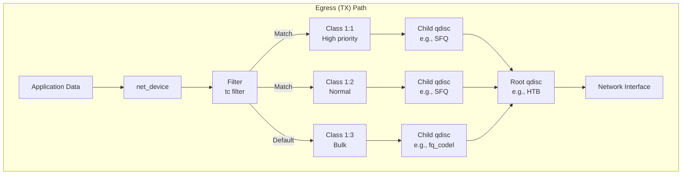
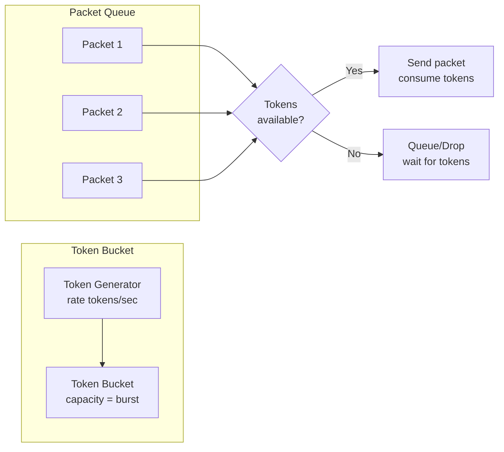
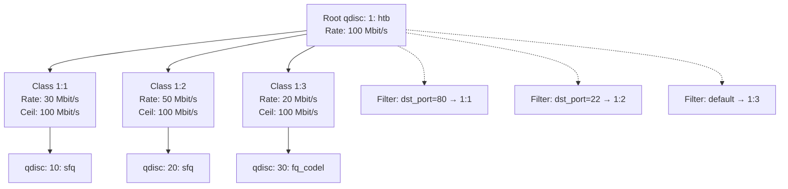
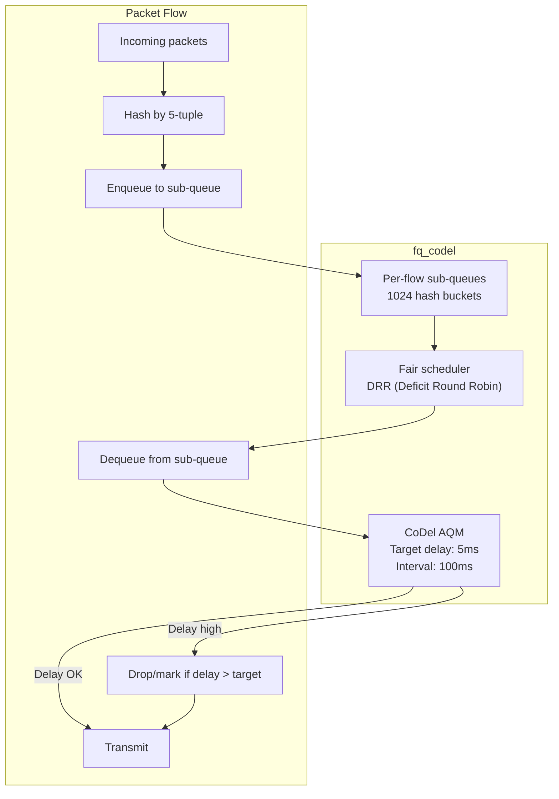

# Chapter 154: Traffic Control

## Introduction

Traffic control (tc) is the Linux kernel's framework for managing network traffic scheduling, shaping, policing, and classification. It operates at the egress (output) path of network interfaces, allowing administrators to control bandwidth allocation, prioritize traffic, reduce latency for critical applications, and enforce service level agreements. The tc subsystem implements the queueing discipline (qdisc) framework, which is the foundation of Quality of Service (QoS) on Linux.

Understanding tc is essential for anyone managing network infrastructure—whether you're running a web server that needs to prioritize HTTP traffic over background transfers, a VoIP system that requires low latency, or a multi-tenant environment that needs bandwidth guarantees.

## Intuition: The Highway Toll Booth

Think of tc as managing a highway toll booth:
- **Queueing discipline (qdisc)**: The toll booth policy—how cars are organized and processed
- **Classes**: Different lanes (fast lane, regular lane, truck lane)
- **Filters**: The signs that direct cars to the right lane based on their type
- **Shaping**: Slowing down traffic to a target rate (like a speed limit)
- **Policing**: Dropping traffic that exceeds a rate (like a checkpoint that turns away excess cars)

## Architecture

### Traffic Control Components



### Key Concepts

| Concept | Description |
|---------|-------------|
| **qdisc** | Queueing discipline—how packets are queued and scheduled |
| **class** | A subdivision of bandwidth within a qdisc |
| **filter** | Rules that classify packets into classes |
| **shaper** | Limits traffic to a specific rate |
| **policer** | Drops traffic exceeding a rate |
| **TBF** | Token Bucket Filter—simple shaper |
| **HTB** | Hierarchical Token Bucket—advanced shaping |
| **SFQ** | Stochastic Fairness Queueing—fair per-flow queueing |
| **fq_codel** | Fair Queueing Controlled Delay—modern AQM |
| **CAKE** | Common Applications Kept Enhanced—modern comprehensive qdisc |

## Qdisc Types

### Classless Qdiscs

| Qdisc | Description | Use Case |
|-------|-------------|----------|
| `pfifo_fast` | Default, 3-band priority | Simple priority queueing |
| `fifo` | Simple FIFO | Basic queueing |
| `red` | Random Early Detection | Congestion avoidance |
| `sfq` | Stochastic Fairness Queueing | Fair per-flow scheduling |
| `fq` | Fair Queueing | Per-flow pacing |
| `fq_codel` | Fair Queueing + CoDel | Modern AQM for bufferbloat |
| `cake` | CAKE | Comprehensive modern qdisc |
| `tbf` | Token Bucket Filter | Simple rate limiting |
| `netem` | Network Emulator | Delay, loss, jitter simulation |
| `ingress` | Ingress policing | Policing incoming traffic |

### Classful Qdiscs

| Qdisc | Description | Use Case |
|-------|-------------|----------|
| `htb` | Hierarchical Token Bucket | Hierarchical bandwidth sharing |
| `hfsc` | Hierarchical Fair-Service Curve | Latency + bandwidth guarantees |
| `cbq` | Class-Based Queueing | Legacy, complex |
| `prio` | Priority | Simple priority bands |

## Token Bucket Filter (TBF)

### How TBF Works



### TBF Configuration

```bash
# Simple rate limiting: 10 Mbit/s with 10KB burst
tc qdisc add dev eth0 root tbf rate 10mbit burst 10kb latency 50ms

# Show current qdisc
tc qdisc show dev eth0

# Delete qdisc
tc qdisc del dev eth0 root

# Replace existing qdisc
tc qdisc replace dev eth0 root tbf rate 10mbit burst 10kb latency 50ms
```

## Hierarchical Token Bucket (HTB)

### HTB Architecture

HTB is the most commonly used classful qdisc. It allows hierarchical bandwidth sharing with borrowing between classes.



### HTB Parameters

| Parameter | Description |
|-----------|-------------|
| `rate` | Guaranteed minimum bandwidth |
| `ceil` | Maximum bandwidth (can borrow from parent) |
| `burst` | Bytes that can be sent before rate limiting |
| `cburst` | Bytes that can be sent at ceil rate |
| `prio` | Priority (lower = higher priority for borrowing) |
| `quantum` | Bytes to dequeue at once |

### HTB Configuration

```bash
# Create root HTB qdisc
tc qdisc add dev eth0 root handle 1: htb default 30

# Create classes
# High priority (web traffic): 30 Mbit/s guaranteed, up to 100 Mbit/s
tc class add dev eth0 parent 1: classid 1:1 htb \
    rate 30mbit ceil 100mbit burst 15k prio 1

# Normal priority (SSH): 50 Mbit/s guaranteed, up to 100 Mbit/s
tc class add dev eth0 parent 1: classid 1:2 htb \
    rate 50mbit ceil 100mbit burst 15k prio 2

# Bulk traffic: 20 Mbit/s guaranteed, up to 100 Mbit/s
tc class add dev eth0 parent 1: classid 1:3 htb \
    rate 20mbit ceil 100mbit burst 15k prio 3

# Add child qdiscs (fair queueing within each class)
tc qdisc add dev eth0 parent 1:1 handle 10: sfq perturb 10
tc qdisc add dev eth0 parent 1:2 handle 20: sfq perturb 10
tc qdisc add dev eth0 parent 1:3 handle 30: fq_codel

# Add filters to classify traffic
# HTTP/HTTPS → class 1:1
tc filter add dev eth0 parent 1: protocol ip prio 1 u32 \
    match ip dport 80 0xffff flowid 1:1
tc filter add dev eth0 parent 1: protocol ip prio 1 u32 \
    match ip dport 443 0xffff flowid 1:1

# SSH → class 1:2
tc filter add dev eth0 parent 1: protocol ip prio 2 u32 \
    match ip dport 22 0xffff flowid 1:2

# Default → class 1:3 (set by default 30 in root qdisc)
```

## fq_codel

### What is fq_codel?

fq_codel (Fair Queueing Controlled Delay) is a modern qdisc that combines fair queueing with an Active Queue Management (AQM) algorithm called CoDel (Controlled Delay). It is the default qdisc on many modern Linux distributions and is the recommended qdisc for most use cases.

### How fq_codel Works



### fq_codel Configuration

```bash
# Set fq_codel as root qdisc (default on many distros)
tc qdisc replace dev eth0 root fq_codel

# Configure parameters
tc qdisc replace dev eth0 root fq_codel \
    limit 10240 \
    target 5ms \
    interval 100ms \
    quantum 1514 \
    ecn

# Parameters:
# limit:     Maximum number of packets in all sub-queues
# target:    Target per-packet delay (default: 5ms)
# interval:  CoDel interval (default: 100ms)
# quantum:   Bytes to dequeue per round (default: MTU)
# ecn:       Enable ECN marking instead of dropping
# flows:     Number of sub-queues (default: 1024)
# drop_batch: Packets to drop at once (default: 64)
```

## CAKE (Common Applications Kept Enhanced)

### CAKE Features

CAKE is a comprehensive qdisc that addresses bufferbloat, fairness, and prioritization in a single qdisc. It combines:
- **Shaping**: Rate limiting with deficit-based scheduling
- **Fair queueing**: Per-flow and per-host fairness
- **AQM**: COBALT (CoDel + BLUE) for congestion control
- **Prioritization**: DiffServ-based traffic classes
- **Overhead compensation**: Accounts for link-layer overhead

### CAKE Configuration

```bash
# Simple CAKE setup
tc qdisc replace dev eth0 root cake bandwidth 100mbit

# With DiffServ prioritization
tc qdisc replace dev eth0 root cake \
    bandwidth 100mbit \
    diffserv4 \
    wash \
    nat

# Parameters:
# bandwidth:   Shaped rate
# diffserv4:   4-class DiffServ mode
# diffserv8:   8-class DiffServ mode
# besteffort:  Single class mode
# nat:         Account for NAT in host fairness
# wash:        Clear DSCP marks after classification
# ack-filter:  Filter excessive ACK packets
# split-gso:   Handle GSO (Generic Segmentation Offload)
# rtt:         Round-trip time estimate (default: 100ms)
# memlimit:    Memory limit for all queues
```

## SFQ (Stochastic Fairness Queueing)

```bash
# SFQ: Fair per-flow queueing
tc qdisc add dev eth0 root sfq perturb 10

# Parameters:
# perturb: Rehash interval in seconds (0 = never rehash)
# quantum: Bytes per round (default: MTU)
# depth:   Maximum queue depth per flow
```

## Network Emulator (netem)

### Simulating Network Conditions

```bash
# Add delay
tc qdisc add dev eth0 root netem delay 100ms

# Add jitter (random delay)
tc qdisc add dev eth0 root netem delay 100ms 20ms

# Add packet loss
tc qdisc add dev eth0 root netem loss 10%

# Add packet duplication
tc qdisc add dev eth0 root netem duplicate 1%

# Add packet corruption
tc qdisc add dev eth0 root netem corrupt 0.1%

# Add packet reordering
tc qdisc add dev eth0 root netem delay 100ms reorder 25% 50%

# Add bandwidth limitation
tc qdisc add dev eth0 root netem rate 1mbit

# Combine effects
tc qdisc add dev eth0 root netem \
    delay 50ms 10ms \
    loss 1% \
    duplicate 0.1%

# Corrupt and reorder
tc qdisc add dev eth0 root netem \
    delay 100ms 20ms 25% \
    loss 5% \
    corrupt 1%
```

## Filters

### Filter Types

```bash
# u32 filter (most common)
tc filter add dev eth0 parent 1: protocol ip prio 1 u32 \
    match ip dport 80 0xffff flowid 1:1

# Match source IP
tc filter add dev eth0 parent 1: protocol ip prio 1 u32 \
    match ip src 192.168.1.0/24 flowid 1:1

# Match DSCP/ToS
tc filter add dev eth0 parent 1: protocol ip prio 1 u32 \
    match ip dport 0 0x00ff flowid 1:1

# bpf filter
tc filter add dev eth0 parent 1: protocol ip prio 1 bpf \
    object-file filter.o flowid 1:1

# fw filter (match iptables marks)
iptables -t mangle -A PREROUTING -p tcp --dport 80 -j MARK --set-mark 1
tc filter add dev eth0 parent 1: protocol ip prio 1 handle 1 fw flowid 1:1
```

### Flower Filter (Modern)

```bash
# Flower classifier (modern, recommended)
tc filter add dev eth0 parent 1: protocol ip prio 1 flower \
    dst_port 80 flowid 1:1

tc filter add dev eth0 parent 1: protocol ip prio 1 flower \
    src_ip 192.168.1.100 dst_port 443 flowid 1:1

tc filter add dev eth0 parent 1: protocol all prio 1 flower \
    ip_proto tcp dst_port 22 flowid 1:2
```

## Ingress Policing

```bash
# Create ingress qdisc
tc qdisc add dev eth0 ingress

# Add policing rule: limit incoming traffic to 100 Mbit/s
tc filter add dev eth0 parent ffff: protocol ip prio 1 u32 \
    match ip src 0.0.0.0/0 police rate 100mbit burst 10k \
    drop flowid :1

# Using police with iptables
tc filter add dev eth0 parent ffff: protocol ip prio 1 handle 1 fw \
    police rate 100mbit burst 10k drop

# Show ingress qdisc
tc qdisc show dev eth0 ingress
```

## Complete QoS Example

```bash
#!/bin/bash
# Complete QoS configuration for a server

IFACE="eth0"
UPLINK="100mbit"
DOWNLINK="100mbit"

# Clear existing rules
tc qdisc del dev $IFACE root 2>/dev/null
tc qdisc del dev $IFACE ingress 2>/dev/null

# Create root HTB qdisc
tc qdisc add dev $IFACE root handle 1: htb default 40

# Root class: total bandwidth
tc class add dev $IFACE parent 1: classid 1:1 htb \
    rate $UPLINK ceil $UPLINK

# High priority (VoIP, DNS): 10% guaranteed, borrow up to 100%
tc class add dev $IFACE parent 1:1 classid 1:10 htb \
    rate 10mbit ceil 100mbit prio 1 burst 15k

# Medium priority (Web): 50% guaranteed
tc class add dev $IFACE parent 1:1 classid 1:20 htb \
    rate 50mbit ceil 100mbit prio 2 burst 15k

# Low priority (Bulk): 30% guaranteed
tc class add dev $IFACE parent 1:1 classid 1:30 htb \
    rate 30mbit ceil 100mbit prio 3 burst 15k

# Default: 10%
tc class add dev $IFACE parent 1:1 classid 1:40 htb \
    rate 10mbit ceil 100mbit prio 4 burst 15k

# Child qdiscs
tc qdisc add dev $IFACE parent 1:10 handle 10: fq_codel
tc qdisc add dev $IFACE parent 1:20 handle 20: fq_codel
tc qdisc add dev $IFACE parent 1:30 handle 30: fq_codel
tc qdisc add dev $IFACE parent 1:40 handle 40: fq_codel

# Filters
# DNS → high priority
tc filter add dev $IFACE parent 1: protocol ip prio 1 u32 \
    match ip dport 53 0xffff flowid 1:10
tc filter add dev $IFACE parent 1: protocol ip prio 1 u32 \
    match ip sport 53 0xffff flowid 1:10

# SSH → high priority
tc filter add dev $IFACE parent 1: protocol ip prio 1 u32 \
    match ip dport 22 0xffff flowid 1:10

# HTTP/HTTPS → medium priority
tc filter add dev $IFACE parent 1: protocol ip prio 2 u32 \
    match ip dport 80 0xffff flowid 1:20
tc filter add dev $IFACE parent 1: protocol ip prio 2 u32 \
    match ip dport 443 0xffff flowid 1:20

# Bulk (FTP, rsync) → low priority
tc filter add dev $IFACE parent 1: protocol ip prio 3 u32 \
    match ip dport 20 0xffff flowid 1:30
tc filter add dev $IFACE parent 1: protocol ip prio 3 u32 \
    match ip dport 21 0xffff flowid 1:30
tc filter add dev $IFACE parent 1: protocol ip prio 3 u32 \
    match ip dport 873 0xffff flowid 1:30

echo "QoS configuration applied on $IFACE"
```

## Monitoring

### tc Monitoring Commands

```bash
# Show all qdiscs
tc -s qdisc show dev eth0

# Show classes
tc -s class show dev eth0

# Show filters
tc -s filter show dev eth0

# Show class hierarchy
tc -s class show dev eth0
# Look for:
# Sent XXXX bytes YYYY pkt
# dropped ZZZZ, overlimits WWWW
# backlog PPPPb QQQp

# Real-time monitoring
watch -n 1 'tc -s qdisc show dev eth0'
watch -n 1 'tc -s class show dev eth0'

# Monitoring with tc-monitor
tc monitor
```

## Common Pitfalls

1. **Egress only**: tc controls outbound traffic; ingress policing is limited
2. **Default qdisc**: If no qdisc is configured, the default `pfifo_fast` is used
3. **Class IDs**: Use `major:minor` format (e.g., `1:1`, `1:10`)
4. **Filter order**: Filters are evaluated in priority order (lower = first)
5. **Rate units**: `kbit`, `mbit`, `kbit`, `bit`—be precise
6. **Burst size**: Too small = drops, too large = latency spikes
7. **Clear before applying**: Always delete existing rules before adding new ones

## Best Practices

1. **Use fq_codel**: As the default qdisc for most servers
2. **Use CAKE**: For edge routers and home gateways
3. **Use HTB**: For complex hierarchical bandwidth management
4. **Monitor regularly**: Watch for drops and overlimits
5. **Test with netem**: Simulate network conditions before deploying
6. **Document your QoS policy**: Maintain documentation of traffic classes and priorities
7. **Use flower filters**: Modern, efficient classification

## Exercises

1. **Rate limiting**: Configure a TBF qdisc to limit outbound traffic to 10 Mbit/s. Verify with iperf3.

2. **HTB hierarchy**: Set up an HTB qdisc with three classes (high, normal, bulk) and test that bandwidth borrowing works correctly.

3. **fq_codel bufferbloat test**: Compare latency with pfifo_fast vs fq_codel under load using `ping` and `flent`.

4. **netem simulation**: Use netem to simulate a 100ms delay with 10% packet loss. Test application behavior.

5. **Complete QoS**: Implement the complete QoS example above and verify traffic prioritization with multiple concurrent transfers.

6. **Ingress policing**: Configure ingress policing to limit incoming traffic from a specific IP address.

## References

1. Linux kernel source: `net/sched/`
2. Linux Advanced Routing & Traffic Control: http://lartc.org/
3. tc man page: `tc(8)`
4. Linux kernel documentation: `Documentation/networking/`
5. bufferbloat.net: https://www.bufferbloat.net/
6. CAKE paper: "CAKE: Comprehensive Queue Management for the Internet"
7. CoDel paper: "Controlled Delay Active Queue Management"
