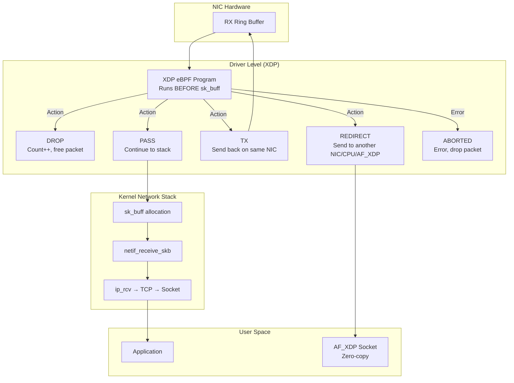
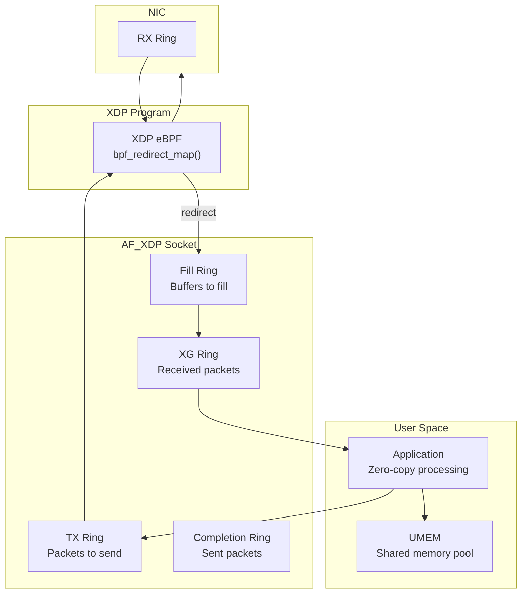

# Chapter 155: XDP — Express Data Path

## Introduction

Express Data Path (XDP) is a high-performance, programmable networking framework in the Linux kernel that processes packets at the earliest possible point—directly in the network interface card (NIC) driver, before the kernel allocates an `sk_buff`. This enables packet processing at millions of packets per second with latencies measured in nanoseconds, making it ideal for DDoS mitigation, load balancing, firewalling, and network monitoring at wire speed.

XDP represents a paradigm shift in Linux networking. Traditional packet processing traverses the entire kernel networking stack (driver → sk_buff → IP → TCP → socket), incurring significant per-packet overhead. XDP short-circuits this by running eBPF programs at the driver level, where they can make immediate decisions: drop, pass, redirect, or transmit packets with minimal overhead.

## Intuition: The Security Checkpoint

Imagine an airport security checkpoint:
- **Traditional networking**: Every passenger goes through the full screening process (check-in, security, passport control, boarding) even if they're obviously not allowed to fly.
- **XDP**: A guard at the entrance checks passengers before they even enter the airport. Known troublemakers are immediately turned away (DROP), normal passengers proceed (PASS), and some are redirected to a different terminal (REDIRECT/TX).

This early filtering saves enormous resources because most processing never happens for dropped packets.

## Architecture

### XDP in the Packet Path



### XDP Actions

| Action | Return Code | Description |
|--------|------------|-------------|
| `XDP_ABORTED` | 0 | Packet aborted (error); triggers tracepoint |
| `XDP_DROP` | 1 | Drop packet immediately (no tracepoint) |
| `XDP_PASS` | 2 | Pass to normal kernel network stack |
| `XDP_TX` | 3 | Transmit packet back out the same NIC |
| `XDP_REDIRECT` | 4 | Redirect to another NIC, CPU map, or AF_XDP socket |

### XDP Operating Modes

| Mode | Description | Performance |
|------|-------------|-------------|
| **Native** | XDP program runs in NIC driver | Highest (~24 Mpps) |
| **Generic** | XDP program runs in generic hook | Lower (~3-5 Mpps) |
| **Offloaded** | XDP program runs on NIC hardware | Wire speed (hardware dependent) |

```bash
# Check if NIC supports native XDP
ethtool -i eth0 | grep driver
# Drivers with native XDP support:
# mlx5, mlx4, i40e, ixgbe, igb, bnxt_en, nfp, virtio_net, etc.

# Load XDP program in native mode (default)
ip link set dev eth0 xdp obj xdp_prog.o sec xdp

# Load in generic mode (for drivers without native support)
ip link set dev eth0 xdp generic obj xdp_prog.o sec xdp

# Load in offloaded mode (requires NIC support)
ip link set dev eth0 xdp offload obj xdp_prog.o sec xdp

# Detach XDP program
ip link set dev eth0 xdp off
```

## XDP Programming

### Simple XDP Program: Packet Counter

```c
/* xdp_counter.c - Count packets per protocol */

#include <linux/bpf.h>
#include <linux/if_ether.h>
#include <linux/ip.h>
#include <linux/in.h>
#include <bpf/bpf_helpers.h>
#include <bpf/bpf_endian.h>

/* BPF map to store packet counts */
struct {
    __uint(type, BPF_MAP_TYPE_ARRAY);
    __uint(max_entries, 256);
    __type(key, __u32);
    __type(value, __u64);
} pkt_count SEC(".maps");

SEC("xdp")
int xdp_counter(struct xdp_md *ctx)
{
    void *data = (void *)(long)ctx->data;
    void *data_end = (void *)(long)ctx->data_end;

    /* Parse Ethernet header */
    struct ethhdr *eth = data;
    if ((void *)(eth + 1) > data_end)
        return XDP_DROP;

    /* Only process IP packets */
    if (eth->h_proto != bpf_htons(ETH_P_IP))
        return XDP_PASS;

    /* Parse IP header */
    struct iphdr *ip = (void *)(eth + 1);
    if ((void *)(ip + 1) > data_end)
        return XDP_DROP;

    /* Count packets by protocol */
    __u32 proto = ip->protocol;
    __u64 *count = bpf_map_lookup_elem(&pkt_count, &proto);
    if (count)
        __sync_fetch_and_add(count, 1);

    return XDP_PASS;
}

char _license[] SEC("license") = "GPL";
```

### XDP Firewall: Drop by IP

```c
/* xdp_firewall.c - Drop packets from blocked IPs */

#include <linux/bpf.h>
#include <linux/if_ether.h>
#include <linux/ip.h>
#include <bpf/bpf_helpers.h>
#include <bpf/bpf_endian.h>

/* Map of blocked IPs */
struct {
    __uint(type, BPF_MAP_TYPE_HASH);
    __uint(max_entries, 1024);
    __type(key, __u32);       /* IP address */
    __type(value, __u64);     /* Drop count */
} blocked_ips SEC(".maps");

SEC("xdp")
int xdp_firewall(struct xdp_md *ctx)
{
    void *data = (void *)(long)ctx->data;
    void *data_end = (void *)(long)ctx->data_end;

    struct ethhdr *eth = data;
    if ((void *)(eth + 1) > data_end)
        return XDP_DROP;

    if (eth->h_proto != bpf_htons(ETH_P_IP))
        return XDP_PASS;

    struct iphdr *ip = (void *)(eth + 1);
    if ((void *)(ip + 1) > data_end)
        return XDP_DROP;

    /* Check if source IP is blocked */
    __u32 src_ip = ip->saddr;
    __u64 *count = bpf_map_lookup_elem(&blocked_ips, &src_ip);
    if (count) {
        __sync_fetch_and_add(count, 1);
        return XDP_DROP;
    }

    return XDP_PASS;
}

char _license[] SEC("license") = "GPL";
```

### XDP Load Balancer

```c
/* xdp_lb.c - Simple L4 load balancer */

#include <linux/bpf.h>
#include <linux/if_ether.h>
#include <linux/ip.h>
#include <linux/tcp.h>
#include <linux/in.h>
#include <bpf/bpf_helpers.h>
#include <bpf/bpf_endian.h>

/* Backend server */
struct backend {
    __u32 ip;
    __u16 port;
    __u8  mac[6];
};

/* Map of backend servers */
struct {
    __uint(type, BPF_MAP_TYPE_ARRAY);
    __uint(max_entries, 16);
    __type(key, __u32);
    __type(value, struct backend);
} backends SEC(".maps");

/* Round-robin counter */
struct {
    __uint(type, BPF_MAP_TYPE_PERCPU_ARRAY);
    __uint(max_entries, 1);
    __type(key, __u32);
    __type(value, __u32);
} rr_counter SEC(".maps");

SEC("xdp")
int xdp_loadbalancer(struct xdp_md *ctx)
{
    void *data = (void *)(long)ctx->data;
    void *data_end = (void *)(long)ctx->data_end;

    struct ethhdr *eth = data;
    if ((void *)(eth + 1) > data_end)
        return XDP_PASS;

    if (eth->h_proto != bpf_htons(ETH_P_IP))
        return XDP_PASS;

    struct iphdr *ip = (void *)(eth + 1);
    if ((void *)(ip + 1) > data_end)
        return XDP_PASS;

    /* Only handle TCP traffic to VIP */
    if (ip->protocol != IPPROTO_TCP)
        return XDP_PASS;

    /* Check destination (VIP) */
    __u32 vip = bpf_htonl(0xC0A80164);  /* 192.168.1.100 */
    if (ip->daddr != vip)
        return XDP_PASS;

    /* Select backend (round-robin) */
    __u32 key = 0;
    __u32 *counter = bpf_map_lookup_elem(&rr_counter, &key);
    if (!counter)
        return XDP_PASS;

    __u32 idx = __sync_fetch_and_add(counter, 1) % 16;
    struct backend *backend = bpf_map_lookup_elem(&backends, &idx);
    if (!backend)
        return XDP_PASS;

    /* Modify packet: change destination */
    ip->daddr = backend->ip;

    /* Update checksums */
    ip->check = 0;  /* Recalculate in software if needed */

    /* Redirect to backend */
    return bpf_redirect(ctx->ingress_ifindex, 0);
}

char _license[] SEC("license") = "GPL";
```

## XDP Helpers and Maps

### Key XDP Helpers

```c
/* Packet data access */
void *data = (void *)(long)ctx->data;
void *data_end = (void *)(long)ctx->data_end;

/* Map operations */
void *bpf_map_lookup_elem(struct bpf_map *map, const void *key);
long bpf_map_update_elem(struct bpf_map *map, const void *key,
                         const void *value, __u64 flags);
long bpf_map_delete_elem(struct bpf_map *map, const void *key);

/* Packet modification */
long bpf_xdp_adjust_head(struct xdp_md *ctx, int delta);
long bpf_xdp_adjust_tail(struct xdp_md *ctx, int delta);

/* Redirect */
long bpf_redirect(int ifindex, __u32 flags);
long bpf_redirect_map(struct bpf_map *map, __u32 key, __u32 flags);

/* Checksum */
static __always_inline __u16 csum_fold(__u32 csum);

/* Time */
__u64 bpf_ktime_get_ns(void);
```

### XDP Maps

```c
/* Array map - fixed size, O(1) lookup */
struct {
    __uint(type, BPF_MAP_TYPE_ARRAY);
    __uint(max_entries, 256);
    __type(key, __u32);
    __type(value, __u64);
} array_map SEC(".maps");

/* Hash map - dynamic size, O(1) amortized lookup */
struct {
    __uint(type, BPF_MAP_TYPE_HASH);
    __uint(max_entries, 65536);
    __type(key, __u32);
    __type(value, __u64);
} hash_map SEC(".maps");

/* LRU hash map - evicts least recently used entries */
struct {
    __uint(type, BPF_MAP_TYPE_LRU_HASH);
    __uint(max_entries, 1000000);
    __type(key, __u32);
    __type(value, __u64);
} lru_map SEC(".maps");

/* Per-CPU array - one counter per CPU */
struct {
    __uint(type, BPF_MAP_TYPE_PERCPU_ARRAY);
    __uint(max_entries, 256);
    __type(key, __u32);
    __type(value, __u64);
} percpu_map SEC(".maps");

/* DEVMAP - for packet redirection between interfaces */
struct {
    __uint(type, BPF_MAP_TYPE_DEVMAP);
    __uint(max_entries, 64);
    __type(key, __u32);
    __type(value, __u32);
} tx_port SEC(".maps");

/* CPUMAP - for redirecting packets to other CPUs */
struct {
    __uint(type, BPF_MAP_TYPE_CPUMAP);
    __uint(max_entries, 64);
    __type(key, __u32);
    __type(value, __u32);
} cpu_map SEC(".maps");
```

## AF_XDP

### What is AF_XDP?

AF_XDP (Address Family XDP) is a new socket type that allows user-space applications to receive and send packets at high speed by bypassing the kernel network stack entirely. Combined with XDP, it provides zero-copy packet processing.

### AF_XDP Architecture



### AF_XDP Example

```c
/* af_xdp_echo.c - Echo packets using AF_XDP */

#include <stdio.h>
#include <stdlib.h>
#include <string.h>
#include <unistd.h>
#include <sys/socket.h>
#include <linux/if_xdp.h>
#include <linux/if_link.h>
#include <bpf/bpf.h>
#include <bpf/xsk.h>
#include <net/if.h>

#define NUM_FRAMES 4096
#define FRAME_SIZE 2048

int main(int argc, char *argv[])
{
    if (argc < 3) {
        fprintf(stderr, "Usage: %s <ifname> <queue_id>\n", argv[0]);
        exit(EXIT_FAILURE);
    }

    const char *ifname = argv[1];
    int queue_id = atoi(argv[2]);
    int ifindex = if_nametoindex(ifname);

    /* Configure XSK (XDP socket) */
    struct xsk_config cfg = {
        .ifindex = ifindex,
        .queue_id = queue_id,
        .xsk_flags = XDP_FLAGS_SKB_MODE,
        .bind_flags = XDP_USE_NEED_WAKEUP,
    };

    /* Create UMEM (shared memory region) */
    struct xsk_umem_config umem_cfg = {
        .fill_size = XSK_RING_PROD__DEFAULT_NUM_DESCS,
        .comp_size = XSK_RING_CONS__DEFAULT_NUM_DESCS,
        .frame_size = FRAME_SIZE,
        .frame_headroom = 0,
        .flags = 0,
    };

    /* Allocate UMEM buffer */
    void *buffer;
    posix_memalign(&buffer, getpagesize(), NUM_FRAMES * FRAME_SIZE);

    /* Create XSK */
    struct xsk_socket *xsk;
    int ret = xsk_socket__create(&xsk, ifname, queue_id, buffer,
                                  NUM_FRAMES * FRAME_SIZE,
                                  &umem_cfg, &cfg);
    if (ret) {
        fprintf(stderr, "xsk_socket__create failed: %d\n", ret);
        exit(EXIT_FAILURE);
    }

    printf("AF_XDP socket created on %s queue %d\n", ifname, queue_id);

    /* Main loop: receive and echo packets */
    while (1) {
        /* Receive packets */
        unsigned int rcvd = xsk_ring_cons__rx_desc(&xsk->rx, &desc);
        if (rcvd) {
            /* Process packets */
            for (unsigned int i = 0; i < rcvd; i++) {
                /* Echo: swap src/dst MAC */
                __u8 *pkt = buffer + desc[i].addr;
                /* ... swap MAC addresses ... */

                /* Queue for TX */
                struct xsk_tx_desc *tx_desc;
                unsigned int idx;
                xsk_ring_prod__tx_desc(&xsk->tx, &idx, &tx_desc);
                tx_desc->addr = desc[i].addr;
                tx_desc->len = desc[i].len;
            }

            /* Submit TX */
            xsk_ring_prod__submit(&xsk->tx, rcvd);

            /* Release RX */
            xsk_ring_cons__release(&xsk->rx, rcvd);
        }

        /* Check for completions */
        unsigned int comp = xsk_ring_cons__comp_desc(&xsk->comp);
        if (comp)
            xsk_ring_cons__release(&xsk->comp, comp);
    }

    xsk_socket__delete(xsk);
    free(buffer);
    return 0;
}
```

## Compiling and Loading XDP Programs

### Compilation

```bash
# Install dependencies
apt install clang llvm libbpf-dev linux-headers-$(uname -r)

# Compile XDP program
clang -O2 -target bpf -c xdp_counter.c -o xdp_counter.o

# With BTF (BPF Type Format)
clang -O2 -target bpf -g -c xdp_counter.c -o xdp_counter.o

# Verify
llvm-objdump -S xdp_counter.o
```

### Loading with ip

```bash
# Load XDP program
ip link set dev eth0 xdp obj xdp_counter.o sec xdp

# Load with pin path (for map access)
ip link set dev eth0 xdp obj xdp_counter.o sec xdp pinned /sys/fs/bpf/counter

# Show XDP program
ip link show dev eth0

# Detach XDP program
ip link set dev eth0 xdp off
```

### Loading with bpftool

```bash
# Load XDP program
bpftool prog load xdp_counter.o /sys/fs/bpf/counter type xdp

# Show loaded programs
bpftool prog show

# Attach to interface
bpftool net attach xdp id PROG_ID dev eth0

# Show maps
bpftool map show

# Dump map contents
bpftool map dump id MAP_ID

# Update map from userspace
bpftool map update id MAP_ID key 0 0 0 0 value 1 0 0 0 0 0 0 0
```

## Performance

### XDP Performance Characteristics

```bash
# Benchmark XDP packet processing
# Using xdp-bench from xdp-tools

# Install xdp-tools
apt install xdp-tools

# Run benchmark
xdp-bench drop eth0
xdp-bench pass eth0
xdp-bench tx eth0

# Typical performance (modern NIC, single core):
# XDP_DROP:    ~24 million packets/sec
# XDP_PASS:    ~12 million packets/sec
# XDP_TX:      ~20 million packets/sec
# Traditional:  ~2-3 million packets/sec
```

### Performance Comparison

| Operation | Packets/sec | Latency |
|-----------|------------|---------|
| XDP_DROP | 24 Mpps | ~50 ns |
| XDP_TX | 20 Mpps | ~80 ns |
| XDP_REDIRECT | 18 Mpps | ~100 ns |
| XDP_PASS | 12 Mpps | ~200 ns |
| iptables DROP | 2-3 Mpps | ~1 μs |
| nftables DROP | 3-5 Mpps | ~0.8 μs |

## XDP in Production

### DDoS Mitigation with XDP

```c
/* xdp_ddos_mitig.c - SYN flood mitigation */

SEC("xdp")
int xdp_syn_flood(struct xdp_md *ctx)
{
    /* Parse headers */
    struct ethhdr *eth = (void *)(long)ctx->data;
    struct iphdr *ip = (void *)(eth + 1);
    struct tcphdr *tcp = (void *)(ip + 1);

    /* Check for SYN flood */
    if (tcp->syn && !tcp->ack) {
        /* Rate limit SYN packets per source IP */
        __u32 src = ip->saddr;
        __u64 *count = bpf_map_lookup_elem(&syn_count, &src);
        if (count && *count > SYN_THRESHOLD) {
            /* Drop SYN flood */
            return XDP_DROP;
        }
        if (count)
            __sync_fetch_and_add(count, 1);
    }

    return XDP_PASS;
}
```

### XDP with Kubernetes/Cilium

```bash
# Cilium uses XDP for:
# - High-performance load balancing
# - DDoS protection
# - Network policy enforcement

# Enable XDP in Cilium
cilium install --set xdp.enabled=true

# Check XDP programs
bpftool prog show type xdp
```

## Common Pitfalls

1. **No map access**: XDP programs can't access all map types (no `BPF_MAP_TYPE_HASH` in some implementations)
2. **Packet bounds checking**: Every memory access must be bounds-checked; verifier rejects programs without
3. **Stack limit**: eBPF stack is limited to 512 bytes
4. **Loop limit**: eBPF programs can't have unbounded loops (use `bpf_loop()` helper)
5. **Program size**: Maximum 1 million instructions (Linux 5.2+)
6. **Generic vs native**: Generic mode is much slower; always use native if possible
7. **Co-relocation**: BPF programs compiled for one kernel version may not load on another

## Best Practices

1. **Use native XDP**: Always prefer native mode over generic
2. **Use libbpf**: For loading and managing XDP programs
3. **Use CO-RE**: Compile Once, Run Everywhere for portability
4. **Test with generic first**: Debug with generic mode, deploy in native
5. **Monitor program performance**: Use `bpftool prog profile` for profiling
6. **Use AF_XDP**: For user-space packet processing at high speed
7. **Combine with TC**: XDP for ingress, TC for egress processing

## Exercises

1. **Packet counter**: Compile and load the XDP counter program. Use bpftool to read the map and display protocol statistics.

2. **IP firewall**: Write an XDP program that drops packets from specific source IPs. Load it and verify with ping.

3. **Packet redirect**: Write an XDP program that redirects packets from one interface to another using a DEVMAP.

4. **AF_XDP echo**: Set up an AF_XDP socket that receives and echoes packets back.

5. **Performance benchmark**: Compare XDP_DROP performance with iptables DROP using pktgen or xdp-bench.

6. **DDoS mitigation**: Write an XDP program that rate-limits SYN packets and drops traffic exceeding a threshold.

## References

1. XDP paper: "The eXpress Data Path: Fast Programmable Packet Processing in the Operating System Kernel"
2. XDP tutorial: https://github.com/xdp-project/xdp-tutorial
3. Linux kernel source: `net/core/xdp.c`, `include/linux/netdevice.h`
4. xdp-tools: https://github.com/xdp-project/xdp-tools
5. libbpf documentation: https://libbpf.readthedocs.io/
6. AF_XDP documentation: `Documentation/networking/af_xdp.rst`
7. Cilium BPF documentation: https://docs.cilium.io/en/latest/bpf/
