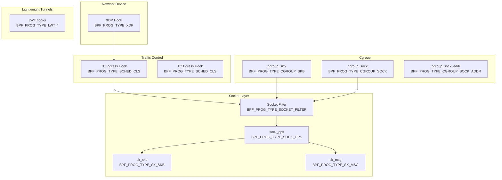

# Chapter 156: eBPF Networking

## Introduction

Extended Berkeley Packet Filter (eBPF) is a revolutionary technology that enables safe, high-performance programmability in the Linux kernel. While the original BPF was designed for packet filtering (tcpdump), eBPF extends this to a general-purpose execution engine that can attach to various kernel hooks—networking, tracing, security, and more. In the networking domain, eBPF enables programmable packet processing, socket-level operations, and traffic control without modifying kernel code or loading kernel modules.

eBPF programs are verified for safety before execution—they cannot crash the kernel, access arbitrary memory, or run indefinitely. This makes eBPF ideal for networking, where untrusted code must process packets at high speed. Combined with XDP, TC, and socket-level hooks, eBPF provides a complete programmable networking stack.

## Intuition: The Smart Bouncer

Think of eBPF as a smart bouncer at a nightclub:
- **Traditional firewall**: A bouncer with a fixed list of allowed names
- **eBPF**: A bouncer with a programmable rule engine—can check IDs, verify dress codes, count capacity, track patterns, and make dynamic decisions, all while being verified for safety (won't let in dangerous people, won't cause chaos)

The key insight: eBPF programs are small, fast, and verified. They run inside the kernel but are loaded from user space, enabling kernel-level performance with user-space flexibility.

## eBPF Architecture

### eBPF Program Types (Networking)

| Program Type | Hook Point | Description |
|-------------|-----------|-------------|
| `BPF_PROG_TYPE_SOCKET_FILTER` | Socket receive | Filter packets at socket level |
| `BPF_PROG_TYPE_XDP` | NIC driver | Process packets before sk_buff |
| `BPF_PROG_TYPE_SCHED_CLS` | TC classifier | Classify/schedule egress packets |
| `BPF_PROG_TYPE_SCHED_ACT` | TC action | Process packets in TC |
| `BPF_PROG_TYPE_CGROUP_SKB` | Cgroup | Filter packets for cgroup |
| `BPF_PROG_TYPE_CGROUP_SOCK` | Cgroup socket | Control socket creation |
| `BPF_PROG_TYPE_SOCK_OPS` | Socket operations | Modify socket behavior |
| `BPF_PROG_TYPE_SK_SKB` | Socket buffer | Redirect between sockets |
| `BPF_PROG_TYPE_SK_MSG` | Socket message | Redirect socket messages |
| `BPF_PROG_TYPE_LWT_IN` | Lightweight tunnel | Ingress tunnel processing |
| `BPF_PROG_TYPE_LWT_OUT` | Lightweight tunnel | Egress tunnel processing |
| `BPF_PROG_TYPE_LWT_XMIT` | Lightweight tunnel | Tunnel transmit |
| `BPF_PROG_TYPE_FLOW_DISSECTOR` | Flow dissector | Parse packet headers |

### eBPF Hook Points



### eBPF Maps

Maps are the primary data-sharing mechanism between eBPF programs and user space, and between different eBPF programs.

| Map Type | Description | Use Case |
|----------|-------------|----------|
| `BPF_MAP_TYPE_HASH` | Hash table | Flow tables, ACLs |
| `BPF_MAP_TYPE_ARRAY` | Fixed-size array | Counters, config |
| `BPF_MAP_TYPE_LRU_HASH` | LRU hash | Connection tracking |
| `BPF_MAP_TYPE_PERCPU_HASH` | Per-CPU hash | High-perf counters |
| `BPF_MAP_TYPE_PERCPU_ARRAY` | Per-CPU array | Statistics |
| `BPF_MAP_TYPE_DEVMAP` | Device map | XDP redirect targets |
| `BPF_MAP_TYPE_CPUMAP` | CPU map | XDP CPU redirect |
| `BPF_MAP_TYPE_SOCKMAP` | Socket map | Socket redirection |
| `BPF_MAP_TYPE_RINGBUF` | Ring buffer | Event streaming |
| `BPF_MAP_TYPE_PROG_ARRAY` | Program array | Tail calls |

## Socket Filter

### Classic BPF Socket Filtering

```c
/* tcpdump captures using socket filters */

#include <stdio.h>
#include <stdlib.h>
#include <string.h>
#include <unistd.h>
#include <sys/socket.h>
#include <netinet/in.h>
#include <linux/if_ether.h>
#include <linux/filter.h>

/* BPF filter: only capture TCP packets */
struct sock_filter tcp_filter[] = {
    /* Load IP protocol field */
    BPF_STMT(BPF_LD + BPF_B + BPF_ABS, 9),     /* IP protocol offset */
    /* Check if TCP (6) */
    BPF_JUMP(BPF_JMP + BPF_JEQ + BPF_K, 6, 0, 1),
    /* Accept: return entire packet */
    BPF_STMT(BPF_RET + BPF_K, 65535),
    /* Reject: return 0 */
    BPF_STMT(BPF_RET + BPF_K, 0),
};

struct sock_fprog prog = {
    .len = sizeof(tcp_filter) / sizeof(tcp_filter[0]),
    .filter = tcp_filter,
};

int main(void)
{
    int sockfd = socket(AF_PACKET, SOCK_RAW, htons(ETH_P_ALL));
    if (sockfd < 0) {
        perror("socket");
        exit(EXIT_FAILURE);
    }

    /* Attach BPF filter */
    if (setsockopt(sockfd, SOL_SOCKET, SO_ATTACH_FILTER,
                   &prog, sizeof(prog)) < 0) {
        perror("setsockopt SO_ATTACH_FILTER");
        close(sockfd);
        exit(EXIT_FAILURE);
    }

    printf("Capturing TCP packets only...\n");

    unsigned char buf[65535];
    while (1) {
        ssize_t n = recv(sockfd, buf, sizeof(buf), 0);
        if (n > 0)
            printf("Captured %zd bytes\n", n);
    }

    close(sockfd);
    return 0;
}
```

### eBPF Socket Filter (Modern)

```c
/* ebpfilter_sock.c - eBPF socket filter */

#include <linux/bpf.h>
#include <linux/if_ether.h>
#include <linux/ip.h>
#include <linux/tcp.h>
#include <bpf/bpf_helpers.h>
#include <bpf/bpf_endian.h>

/* Filter: only accept packets to port 80 */
SEC("socket")
int socket_filter(struct __sk_buff *skb)
{
    void *data = (void *)(long)skb->data;
    void *data_end = (void *)(long)skb->data_end;

    struct ethhdr *eth = data;
    if ((void *)(eth + 1) > data_end)
        return 0;

    if (eth->h_proto != bpf_htons(ETH_P_IP))
        return 0;

    struct iphdr *ip = (void *)(eth + 1);
    if ((void *)(ip + 1) > data_end)
        return 0;

    if (ip->protocol != IPPROTO_TCP)
        return 0;

    struct tcphdr *tcp = (void *)ip + (ip->ihl * 4);
    if ((void *)(tcp + 1) > data_end)
        return 0;

    /* Only accept HTTP traffic */
    if (bpf_ntohs(tcp->dest) == 80)
        return 1;  /* Accept */

    return 0;  /* Drop */
}

char _license[] SEC("license") = "GPL";
```

### Attaching Socket Filter

```c
/* Attach eBPF socket filter to a socket */

#include <stdio.h>
#include <stdlib.h>
#include <unistd.h>
#include <sys/socket.h>
#include <netinet/in.h>
#include <bpf/libbpf.h>
#include <bpf/bpf.h>

int main(void)
{
    /* Load BPF object */
    struct bpf_object *obj = bpf_object__open("socket_filter.o");
    if (libbpf_get_error(obj)) {
        fprintf(stderr, "Failed to open BPF object\n");
        exit(EXIT_FAILURE);
    }

    /* Load program into kernel */
    if (bpf_object__load(obj)) {
        fprintf(stderr, "Failed to load BPF object\n");
        exit(EXIT_FAILURE);
    }

    /* Find the program */
    struct bpf_program *prog = bpf_object__find_program_by_name(
        obj, "socket_filter");
    if (!prog) {
        fprintf(stderr, "Program not found\n");
        exit(EXIT_FAILURE);
    }

    /* Create socket */
    int sock = socket(AF_PACKET, SOCK_RAW, htons(ETH_P_ALL));
    if (sock < 0) {
        perror("socket");
        exit(EXIT_FAILURE);
    }

    /* Attach program */
    int prog_fd = bpf_program__fd(prog);
    if (setsockopt(sock, SOL_SOCKET, SO_ATTACH_BPF,
                   &prog_fd, sizeof(prog_fd)) < 0) {
        perror("setsockopt SO_ATTACH_BPF");
        close(sock);
        exit(EXIT_FAILURE);
    }

    printf("eBPF socket filter attached\n");

    /* Receive filtered packets */
    unsigned char buf[65535];
    while (1) {
        ssize_t n = recv(sock, buf, sizeof(buf), 0);
        if (n > 0)
            printf("Received %zd bytes\n", n);
    }

    close(sock);
    bpf_object__close(obj);
    return 0;
}
```

## TC BPF

### TC Classifier eBPF

```c
/* tc_filter.c - TC eBPF classifier */

#include <linux/bpf.h>
#include <linux/pkt_cls.h>
#include <linux/if_ether.h>
#include <linux/ip.h>
#include <bpf/bpf_helpers.h>
#include <bpf/bpf_endian.h>

/* Classify packets: set TC classid */
SEC("tc")
int tc_classifier(struct __sk_buff *skb)
{
    void *data = (void *)(long)skb->data;
    void *data_end = (void *)(long)skb->data_end;

    struct ethhdr *eth = data;
    if ((void *)(eth + 1) > data_end)
        return TC_ACT_OK;

    if (eth->h_proto != bpf_htons(ETH_P_IP))
        return TC_ACT_OK;

    struct iphdr *ip = (void *)(eth + 1);
    if ((void *)(ip + 1) > data_end)
        return TC_ACT_OK;

    /* HTTP traffic → high priority class */
    if (ip->protocol == IPPROTO_TCP) {
        struct tcphdr *tcp = (void *)ip + (ip->ihl * 4);
        if ((void *)(tcp + 1) > data_end)
            return TC_ACT_OK;

        if (bpf_ntohs(tcp->dest) == 80 || bpf_ntohs(tcp->dest) == 443) {
            /* Set class ID to 1:1 (high priority) */
            skb->tc_classid = bpf_htonl(0x10001);
            return TC_ACT_OK;
        }
    }

    /* Default class */
    skb->tc_classid = bpf_htonl(0x10002);
    return TC_ACT_OK;
}

char _license[] SEC("license") = "GPL";
```

### Loading TC eBPF

```bash
# Compile
clang -O2 -target bpf -c tc_filter.c -o tc_filter.o

# Load with tc
tc qdisc add dev eth0 clsact
tc filter add dev eth0 ingress bpf da obj tc_filter.o sec tc
tc filter add dev eth0 egress bpf da obj tc_filter.o sec tc

# Show filters
tc filter show dev eth0 ingress
tc filter show dev eth0 egress

# Remove filter
tc filter del dev eth0 ingress
```

## sock_ops

### Socket Operations Hook

```c
/* sock_ops.c - Monitor TCP connection events */

#include <linux/bpf.h>
#include <linux/bpf_common.h>
#include <bpf/bpf_helpers.h>
#include <bpf/bpf_endian.h>
#include <linux/tcp.h>

/* Connection event */
struct tcp_event {
    __u32 saddr;
    __u32 daddr;
    __u16 sport;
    __u16 dport;
    __u32 event;  /* 0=connect, 1=accept, 2=close */
};

/* Ring buffer for events */
struct {
    __uint(type, BPF_MAP_TYPE_RINGBUF);
    __uint(max_entries, 256 * 1024);
} events SEC(".maps");

SEC("sockops")
int tcp_monitor(struct bpf_sock_ops *skops)
{
    /* Only handle TCP events */
    if (skops->family != AF_INET)
        return 1;

    /* Connection established */
    if (skops->op == BPF_SOCK_OPS_ACTIVE_ESTABLISHED_CB ||
        skops->op == BPF_SOCK_OPS_PASSIVE_ESTABLISHED_CB) {

        struct tcp_event *evt;
        evt = bpf_ringbuf_reserve(&events, sizeof(*evt), 0);
        if (!evt)
            return 1;

        evt->saddr = skops->local_ip4;
        evt->daddr = skops->remote_ip4;
        evt->sport = skops->local_port;
        evt->dport = bpf_ntohl(skops->remote_port);
        evt->event = (skops->op == BPF_SOCK_OPS_ACTIVE_ESTABLISHED_CB)
                     ? 0 : 1;

        bpf_ringbuf_submit(evt, 0);
    }

    return 1;
}

char _license[] SEC("license") = "GPL";
```

### Attaching sock_ops

```bash
# Load sock_ops program
bpftool prog load sock_ops.o /sys/fs/bpf/tcp_monitor type sockops

# Attach to cgroup
bpftool cgroup attach /sys/fs/cgroup sock_ops id PROG_ID
```

## cgroup/connect4

### Cgroup Socket Filter

```c
/* cgroup_connect.c - Control socket connections per cgroup */

#include <linux/bpf.h>
#include <bpf/bpf_helpers.h>

/* Map of allowed ports */
struct {
    __uint(type, BPF_MAP_TYPE_HASH);
    __uint(max_entries, 64);
    __type(key, __u16);       /* Port number */
    __type(value, __u8);      /* Allowed flag */
} allowed_ports SEC(".maps");

SEC("cgroup/connect4")
int cgroup_connect4(struct bpf_sock_addr *ctx)
{
    /* Check if destination port is allowed */
    __u16 port = ctx->user_port;

    __u8 *allowed = bpf_map_lookup_elem(&allowed_ports, &port);
    if (allowed)
        return 1;  /* Allow */

    /* Block connection */
    return 0;
}

SEC("cgroup/sendmsg4")
int cgroup_sendmsg4(struct bpf_sock_addr *ctx)
{
    /* Check UDP destination port */
    __u16 port = ctx->user_port;

    __u8 *allowed = bpf_map_lookup_elem(&allowed_ports, &port);
    if (allowed)
        return 1;

    return 0;
}

char _license[] SEC("license") = "GPL";
```

## sk_skb (Socket Buffer Redirection)

### Socket-to-Socket Redirection

```c
/* sk_redir.c - Redirect packets between sockets */

#include <linux/bpf.h>
#include <bpf/bpf_helpers.h>

/* Socket map */
struct {
    __uint(type, BPF_MAP_TYPE_SOCKMAP);
    __uint(max_entries, 64);
    __type(key, __u32);
    __type(value, __u64);
} sock_map SEC(".maps");

SEC("sk_skb/stream_parser")
int stream_parser(struct __sk_buff *skb)
{
    /* Return packet length for parsing */
    return skb->len;
}

SEC("sk_skb/stream_verdict")
int stream_verdict(struct __sk_buff *skb)
{
    /* Redirect to socket at index 1 */
    __u32 key = 1;
    return bpf_sk_redirect_map(skb, &sock_map, key, 0);
}

char _license[] SEC("license") = "GPL";
```

## Tail Calls

### Program Chaining with Tail Calls

```c
/* tail_call.c - Chain eBPF programs */

#include <linux/bpf.h>
#include <bpf/bpf_helpers.h>

/* Program array for tail calls */
struct {
    __uint(type, BPF_MAP_TYPE_PROG_ARRAY);
    __uint(max_entries, 4);
    __type(key, __u32);
    __type(value, __u32);
} prog_array SEC(".maps");

/* Main program: classify and dispatch */
SEC("xdp")
int xdp_main(struct xdp_md *ctx)
{
    /* Parse packet to determine protocol */
    void *data = (void *)(long)ctx->data;
    void *data_end = (void *)(long)ctx->data_end;

    struct ethhdr *eth = data;
    if ((void *)(eth + 1) > data_end)
        return XDP_DROP;

    /* Dispatch to protocol-specific program */
    if (eth->h_proto == htons(ETH_P_IP)) {
        bpf_tail_call(ctx, &prog_array, 0);  /* IPv4 handler */
    } else if (eth->h_proto == htons(ETH_P_IPV6)) {
        bpf_tail_call(ctx, &prog_array, 1);  /* IPv6 handler */
    } else if (eth->h_proto == htons(ETH_P_ARP)) {
        bpf_tail_call(ctx, &prog_array, 2);  /* ARP handler */
    }

    /* Default: pass to stack */
    return XDP_PASS;
}

/* IPv4 handler (loaded separately) */
SEC("xdp")
int xdp_ipv4(struct xdp_md *ctx)
{
    /* Process IPv4 packets */
    return XDP_PASS;
}

/* IPv6 handler */
SEC("xdp")
int xdp_ipv6(struct xdp_md *ctx)
{
    return XDP_PASS;
}

/* ARP handler */
SEC("xdp")
int xdp_arp(struct xdp_md *ctx)
{
    return XDP_PASS;
}

char _license[] SEC("license") = "GPL";
```

## BPF CO-RE (Compile Once, Run Everywhere)

### Portable eBPF Programs

```c
/* co_re_example.c - Portable eBPF program */

#include <linux/bpf.h>
#include <bpf/bpf_helpers.h>
#include <bpf/bpf_tracing.h>
#include <bpf/bpf_core_read.h>

/* CO-RE: uses BTF to access kernel structures portably */

SEC("tracepoint/syscalls/sys_enter_connect")
int trace_connect(struct trace_event_raw_sys_enter *ctx)
{
    /* Access socket address portably */
    /* CO-RE adjusts offsets based on kernel BTF */
    __u32 pid = bpf_get_current_pid_tgid() >> 32;

    /* ... */

    return 0;
}

char _license[] SEC("license") = "GPL";
```

### Compiling with CO-RE

```bash
# Compile with BTF
clang -O2 -target bpf -g -c prog.c -o prog.o

# Generate vmlinux.h (contains all kernel struct definitions)
bpftool btf dump file /sys/kernel/btf/vmlinux format c > vmlinux.h

# Compile using vmlinux.h
clang -O2 -target bpf -g \
    -I/usr/include/$(uname -m)-linux-gnu \
    -D__TARGET_ARCH_x86 \
    -c prog.c -o prog.o
```

## eBPF Networking Tools

### bpftool

```bash
# Show all BPF programs
bpftool prog show

# Show all maps
bpftool map show

# Dump map contents
bpftool map dump id MAP_ID

# Update map entry
bpftool map update id MAP_ID key hex 01 00 00 00 value hex 0a 00 00 01

# Show program source
bpftool prog dump xlated id PROG_ID
bpftool prog dump jited id PROG_ID

# Pin program to filesystem
bpftool prog pin id PROG_ID /sys/fs/bpf/myprog

# Profile program
bpftool prog profile id PROG_ID
```

### cilium/ebpf (Go library)

```go
// Load and attach eBPF program from Go
package main

import (
    "github.com/cilium/ebpf"
    "github.com/cilium/ebpf/link"
    "github.com/cilium/ebpf/rlimit"
)

func main() {
    // Remove memory limit for eBPF
    rlimit.RemoveMemlock()

    // Load BPF object
    objs := bpfObjects{}
    if err := loadBpfObjects(&objs, nil); err != nil {
        log.Fatalf("loading objects: %s", err)
    }
    defer objs.Close()

    // Attach XDP program
    l, err := link.AttachXDP(link.XDPOptions{
        Program:   objs.XdpProg,
        Interface: ifaceIndex,
    })
    if err != nil {
        log.Fatalf("attach XDP: %s", err)
    }
    defer l.Close()
}
```

## Performance

### eBPF Performance Characteristics

| Operation | Latency | Throughput |
|-----------|---------|-----------|
| XDP + eBPF | ~50 ns/packet | 24 Mpps |
| TC eBPF | ~200 ns/packet | 10 Mpps |
| Socket filter | ~500 ns/packet | 5 Mpps |
| iptables (equivalent) | ~1 μs/packet | 2-3 Mpps |

### Performance Tips

```c
/* Use per-CPU maps for high-frequency updates */
struct {
    __uint(type, BPF_MAP_TYPE_PERCPU_ARRAY);
    __uint(max_entries, 256);
    __type(key, __u32);
    __type(value, __u64);
} counters SEC(".maps");

/* Use ring buffers instead of perf events */
struct {
    __uint(type, BPF_MAP_TYPE_RINGBUF);
    __uint(max_entries, 256 * 1024);
} rb SEC(".maps");

/* Minimize map lookups */
__u32 key = 0;
__u64 *val = bpf_map_lookup_elem(&counters, &key);
if (val)
    __sync_fetch_and_add(val, 1);  /* Atomic increment */
```

## Common Pitfalls

1. **Verifier rejection**: Complex programs may be rejected; simplify logic
2. **Map size limits**: Large maps consume kernel memory
3. **Program size limits**: Maximum 1 million instructions (Linux 5.2+)
4. **No loops**: Use `bpf_loop()` helper for bounded loops
5. **Stack limit**: 512 bytes per program; use maps for large data
6. **Kernel version compatibility**: Use CO-RE for portability
7. **Debugging difficulty**: Use `bpftool prog tracelog` for debugging

## Best Practices

1. **Use libbpf**: For loading and managing eBPF programs
2. **Use CO-RE**: For kernel portability
3. **Use ring buffers**: For efficient event streaming
4. **Use per-CPU maps**: For high-frequency counters
5. **Test with generic mode first**: Debug before deploying native
6. **Monitor verifier logs**: Check for rejection reasons
7. **Profile eBPF programs**: Use `bpftool prog profile`

## Exercises

1. **Socket filter**: Write an eBPF socket filter that captures only DNS packets. Attach it to a socket and verify with tcpdump.

2. **TC classifier**: Write a TC eBPF classifier that marks HTTP traffic with a specific TC class ID.

3. **sock_ops monitor**: Write an eBPF program that monitors TCP connection events using sock_ops.

4. **cgroup firewall**: Write a cgroup/connect4 program that restricts a cgroup to only connect to specific ports.

5. **Tail calls**: Implement a packet classifier using tail calls to dispatch to different handlers for TCP, UDP, and ICMP.

6. **Performance comparison**: Compare the performance of an eBPF XDP program vs iptables for packet dropping.

## References

1. eBPF documentation: https://ebpf.io/
2. BPF and XDP Reference Guide: https://docs.cilium.io/en/latest/bpf/
3. Linux kernel source: `kernel/bpf/`, `net/core/filter.c`
4. libbpf documentation: https://libbpf.readthedocs.io/
5. cilium/ebpf: https://github.com/cilium/ebpf
6. BPF CO-RE: https://nakryiko.com/posts/bpf-core-reference-guide/
7. Linux kernel documentation: `Documentation/bpf/`
8. Brendan Gregg's BPF Performance Tools: https://www.brendangregg.com/bpf-performance-tools-book.html
