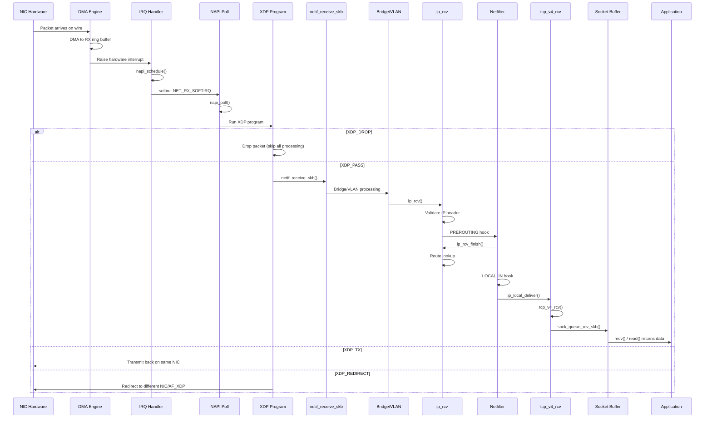
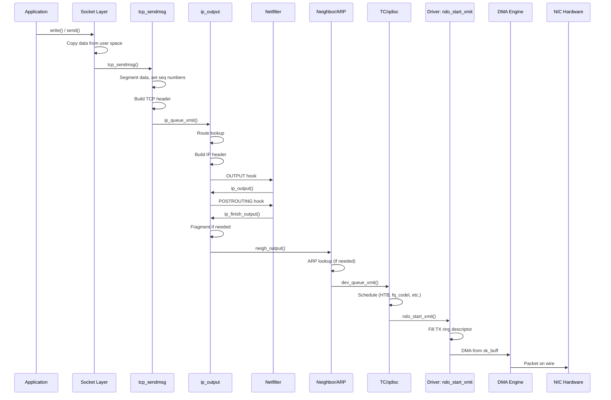
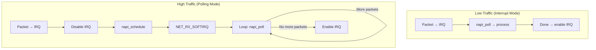

# Chapter 157: Kernel Networking Stack

## Introduction

The Linux kernel networking stack is one of the most complex, capable, and widely deployed networking implementations in the world. It supports hundreds of protocols, runs on everything from embedded IoT devices to the world's largest supercomputers, and processes billions of packets per second on modern hardware. Understanding the kernel networking stack at the deepest level—how packets flow, how data structures are organized, how the kernel makes routing and protocol decisions—is essential for network engineers, kernel developers, and anyone who needs to optimize, debug, or extend Linux networking.

This chapter provides a comprehensive exploration of the kernel networking internals: the `sk_buff` structure that represents every packet, the `net_device` that represents every interface, the complete packet flow from NIC to application and back, and the softirq processing model that drives it all.

## Intuition: The Assembly Line

Think of the kernel networking stack as an assembly line in a factory:

1. **Raw materials arrive** (packet hits the NIC)
2. **Receiving department** (driver puts packet in ring buffer)
3. **Quality inspection** (XDP/eBPF checks)
4. **sk_buff creation** (packet gets a tracking envelope)
5. **Sorting** (bridge/VLAN processing)
6. **Address verification** (IP validation)
7. **Routing decision** (where does this go?)
8. **Security check** (netfilter firewall)
9. **Delivery** (to the right protocol handler)
10. **Final processing** (TCP reassembly, socket delivery)

Each step adds or removes headers, makes decisions, and passes the packet along. The `sk_buff` is the envelope that travels the entire line, carrying metadata about where it's been and where it's going.

## sk_buff: The Packet Representation

### What is sk_buff?

The `sk_buff` (socket buffer) is the fundamental data structure in the Linux networking stack. Every packet—whether received from the network, being transmitted by an application, or being forwarded through the kernel—is represented by an `sk_buff`. It contains both the packet data and extensive metadata about the packet.

### sk_buff Structure (Detailed)

```c
/* include/linux/skbuff.h (comprehensive, simplified) */

struct sk_buff {
    /* ===== Linked List Management ===== */
    union {
        struct {
            struct sk_buff  *next;
            struct sk_buff  *prev;
        };
        struct rb_node      rbnode;     /* For TCP reassembly tree */
        struct list_head    list;
    };
    union {
        struct sock         *sk;        /* Owning socket */
        int                 ip_defrag_offset;
    };
    struct net_device       *dev;       /* Associated device (RX or TX) */

    /* ===== Timing ===== */
    unsigned long           _skb_refdst; /* Destination cache */
    void                    (*destructor)(struct sk_buff *skb);
    ktime_t                 tstamp;     /* Timestamp */

    /* ===== Data Pointers ===== */
    /*
     * Layout: [head] [... headroom ...] [data] [... payload ...] [tail] [... tailroom ...] [end]
     *
     * head: start of allocated buffer (never moves)
     * data: start of actual packet data (moves as headers are added/removed)
     * tail: end of packet data (moves as data is added)
     * end: end of allocated buffer (never moves)
     */
    unsigned char           *head;      /* Start of allocated buffer */
    unsigned char           *data;      /* Start of packet data */
    unsigned int            __unused_padding; /* Avoids cache line sharing */
    sk_buff_data_t          tail;       /* End of packet data */
    sk_buff_data_t          end;        /* End of allocated buffer */

    /* ===== Packet Info ===== */
    unsigned int            len;        /* Total data length (linear + paged) */
    unsigned int            data_len;   /* Length of paged data (non-linear) */
    __u16                   mac_len;    /* Length of MAC header */
    __u16                   hdr_len;    /* Length of skb->data (cloned skbs) */

    /* ===== Protocol Fields ===== */
    __u16                   queue_mapping; /* TX queue mapping */
    __u8                    cloned:1,   /* Cloned flag */
                            ip_summed:2,/* Checksum state */
                            nohdr:1,    /* No header */
                            pkt_type:3, /* Packet type (HOST, BROADCAST, etc.) */
                            fclone:2,   /* Clone state */
                            ipvs_property:1,
                            peeked:1,
                            nf_trace:1;

    /* ===== Checksum ===== */
    __u8                    encapsulation:1;
    __u8                    csum_valid:1;
    __u8                    csum_complete_sw:1;
    __u16                   csum_start;  /* Checksum start offset */
    __u16                   csum_offset; /* Checksum offset */

    /* ===== VLAN ===== */
    __u16                   vlan_tci;    /* VLAN tag control info */

    /* ===== Priority ===== */
    __u16                   priority;    /* Packet queueing priority */
    __u32                   mark;        /* Netfilter mark */
    __u32                   hash;        /* Packet hash */

    /* ===== Protocol Headers (offsets) ===== */
    __be16                  protocol;    /* Packet protocol (ETH_P_IP, etc.) */
    __u16                   inner_protocol;
    __u16                   inner_transport_header;
    __u16                   inner_network_header;
    __u16                   transport_header; /* TCP/UDP header offset */
    __u16                   network_header;   /* IP header offset */
    __u16                   mac_header;       /* Ethernet header offset */

    /* ===== Security ===== */
    struct sec_path         *sp;

    /* ===== Control Block ===== */
    char                    cb[48];     /* Control block for protocol private data */
    /* TCP uses this for tcp_skb_cb, etc. */

    /* ===== Network Namespace ===== */
    struct net              *dev_net;

    /* ===== Extensions ===== */
    unsigned int            truesize;   /* Total buffer size (including skb) */
    atomic_t                users;      /* Reference count */
};
```

### sk_buff Memory Layout

```
 head                                              end
  │                                                  │
  ▼                                                  ▼
  ┌────────┬─────────────────┬────────────┬──────────┐
  │headroom│  MAC + IP + TCP │  Payload   │ tailroom │
  │        │   headers       │  (data)    │          │
  └────────┴─────────────────┴────────────┴──────────┘
  ↑         ↑                                  ↑     ↑
  head     data                              tail   end

  headroom: Space for prepending headers (encapsulation)
            Typical: 128-256 bytes
  tailroom: Space for appending data (trailers, padding)
            Typical: 128-256 bytes

  len = (data → tail) total length of packet data
  data_len = length of non-linear (paged) data
  truesize = sizeof(sk_buff) + len + sizeof(struct skb_shared_info)
```

### sk_buff Operations

```c
/* Allocate a new sk_buff */
struct sk_buff *skb = alloc_skb(size, GFP_ATOMIC);
struct sk_buff *skb = netdev_alloc_skb(dev, size);

/* Reserve headroom (push protocol headers) */
skb_reserve(skb, header_size);

/* Add data to the tail */
unsigned char *ptr = skb_put(skb, len);  /* Returns pointer, advances tail */

/* Remove data from the tail */
skb_trim(skb, new_len);

/* Push data to the front (prepend) */
unsigned char *ptr = skb_push(skb, len);  /* Returns pointer, moves data back */

/* Remove data from the front */
skb_pull(skb, len);  /* Moves data pointer forward */

/* Clone (share data, copy metadata) */
struct sk_buff *clone = skb_clone(skb, GFP_ATOMIC);

/* Deep copy (copy everything) */
struct sk_buff *copy = skb_copy(skb, GFP_ATOMIC);

/* Free */
kfree_skb(skb);       /* Decrement refcount, free if zero */
dev_kfree_skb(skb);   /* Same, for driver context */

/* Header access helpers */
struct ethhdr *eth = eth_hdr(skb);
struct iphdr *ip = ip_hdr(skb);
struct tcphdr *tcp = tcp_hdr(skb);
struct udphdr *udp = udp_hdr(skb);

/* Protocol header offset manipulation */
skb_reset_mac_header(skb);      /* Set mac_header to current data */
skb_reset_network_header(skb);  /* Set network_header */
skb_reset_transport_header(skb);/* Set transport_header */
```

## net_device: Network Device Representation

### net_device Structure

```c
/* include/linux/netdevice.h (simplified, key fields) */

struct net_device {
    /* ===== Identity ===== */
    char                    name[IFNAMSIZ];   /* "eth0", "wlan0", etc. */
    unsigned int            ifindex;          /* Unique interface index */
    unsigned int            iflink;           /* Parent interface index */

    /* ===== Addresses ===== */
    unsigned char           addr_len;         /* Hardware address length */
    unsigned char           perm_addr[MAX_ADDR_LEN]; /* Permanent hardware address */
    unsigned char           dev_addr[MAX_ADDR_LEN];  /* Current hardware address */

    /* ===== Device Properties ===== */
    unsigned int            mtu;              /* Maximum Transfer Unit */
    unsigned int            type;             /* ARP hardware type */
    unsigned short          hard_header_len;  /* Hardware header length */
    unsigned char           min_header_len;   /* Minimum header length */

    /* ===== Features ===== */
    unsigned long           features;         /* Feature flags */
    unsigned long           hw_features;      /* Hardware features */
    unsigned long           wanted_features;  /* Requested features */

    /* ===== Queue Management ===== */
    unsigned int            num_tx_queues;    /* Number of TX queues */
    unsigned int            real_num_tx_queues; /* Active TX queues */
    struct netdev_queue     *_tx;             /* TX queue array */

    unsigned int            num_rx_queues;    /* Number of RX queues */
    struct netdev_rx_queue  *_rx;             /* RX queue array */

    /* ===== Statistics ===== */
    struct net_device_stats stats;            /* Device statistics */
    struct rtnl_link_stats64 *net_stats;      /* 64-bit stats */

    /* ===== State ===== */
    unsigned long           state;            /* Device state bits */
    unsigned int            flags;            /* Interface flags (IFF_*) */
    unsigned int            priv_flags;       /* Private flags */

    /* ===== Traffic Control ===== */
    struct Qdisc            *qdisc;           /* Root qdisc */
    struct Qdisc            *qdisc_sleeping;
    struct Qdisc            *qdisc_ingress;
    struct list_head        qdisc_list;

    /* ===== Network Namespace ===== */
    struct net              *nd_net;          /* Network namespace */

    /* ===== Device Operations (Driver Callbacks) ===== */
    const struct net_device_ops *netdev_ops;  /* Network operations */
    const struct ethtool_ops    *ethtool_ops; /* Ethtool operations */

    /* ===== Physical Properties ===== */
    unsigned char           oper_state;       /* Operational state */
    unsigned char           link_mode;        /* Link mode */

    /* ===== Wireless ===== */
    const struct iw_handler_def *wireless_handlers;

    /* ===== GSO/GRO ===== */
    unsigned int            gso_max_size;     /* Max GSO segment size */
    unsigned int            gso_max_segs;     /* Max GSO segments */
    unsigned int            gro_max_size;     /* Max GRO aggregate size */

    /* ===== RPS/RFS ===== */
    struct netdev_rx_queue  *_rx;
    struct netdev_queue     *_tx;

    /* ===== Hardware Timestamping ===== */
    struct skb_shared_hwtstamps *hw_timestamp;

    /* ===== Reference Counting ===== */
    refcount_t              dev_refcnt;
    struct rcu_head         rcu;
};

/* Device operations (what the driver implements) */
struct net_device_ops {
    int                     (*ndo_init)(struct net_device *dev);
    void                    (*ndo_uninit)(struct net_device *dev);
    int                     (*ndo_open)(struct net_device *dev);
    int                     (*ndo_stop)(struct net_device *dev);
    netdev_tx_t             (*ndo_start_xmit)(struct sk_buff *skb,
                                              struct net_device *dev);
    int                     (*ndo_set_rx_mode)(struct net_device *dev);
    int                     (*ndo_set_mac_address)(struct net_device *dev,
                                                   void *addr);
    int                     (*ndo_do_ioctl)(struct net_device *dev,
                                           struct ifreq *ifr, int cmd);
    int                     (*ndo_change_mtu)(struct net_device *dev,
                                              int new_mtu);
    u16                     (*ndo_select_queue)(struct net_device *dev,
                                               struct sk_buff *skb,
                                               struct net_device *sb_dev);
    void                    (*ndo_tx_timeout)(struct net_device *dev,
                                             unsigned int txqueue);
    int                     (*ndo_get_stats64)(struct net_device *dev,
                                               struct rtnl_link_stats64 *storage);
    int                     (*ndo_set_features)(struct net_device *dev,
                                               netdev_features_t features);
    int                     (*ndo_bpf)(struct net_device *dev,
                                      struct netdev_bpf *bpf);
    int                     (*ndo_xdp_xmit)(struct net_device *dev,
                                            int n, struct sk_buff **skb,
                                            u32 flags);
};
```

## Packet Flow: Complete Path

### Packet Reception (RX)



### Packet Transmission (TX)



## Softirq Processing

### Network Softirqs

The kernel uses softirqs (software interrupts) for deferred network processing. There are two main network softirqs:

| Softirq | Function | Purpose |
|---------|----------|---------|
| `NET_RX_SOFTIRQ` | `net_rx_action()` | Process received packets |
| `NET_TX_SOFTIRQ` | `net_tx_action()` | Process transmitted packets |

### NAPI (New API)

NAPI is the kernel's interrupt mitigation mechanism. Under high packet rates, it switches from interrupt-driven to polling mode, dramatically improving throughput.



### NAPI Implementation

```c
/* net/core/dev.c - Simplified NAPI processing */

static int napi_poll(struct napi_struct *n, struct list_head *repoll)
{
    int work, weight = n->weight;

    /* Call the driver's poll function */
    work = n->poll(n, weight);

    if (work < weight)
        /* Driver processed all packets, re-enable interrupts */
        napi_complete(n);

    return work;
}

static void net_rx_action(struct softirq_action *h)
{
    struct list_head list;
    int budget = netdev_budget;  /* Default: 300 */

    INIT_LIST_HEAD(&list);

    /* Process all NAPI instances with pending work */
    while (!list_empty(&list) && budget > 0) {
        struct napi_struct *n = list_first_entry(&list,
                                                 struct napi_struct,
                                                 poll_list);
        int work = napi_poll(n, &list);
        budget -= work;
    }
}
```

### Softnet Statistics

```bash
# Per-CPU softirq statistics
cat /proc/net/softnet_stat
# Format: processed dropped time_squeeze backlog avg_poll
# 00001234 00000000 00000001 00000000 00000000 00000000 ...

# Interpretation:
# Column 1: Packets processed
# Column 2: Packets dropped (backlog full)
# Column 3: Times softirq ran out of time (time_squeeze)
# Column 4: Current backlog length

# Softirq timing
cat /proc/net/softnet_stat

# Watch for drops
watch -n 1 'cat /proc/net/softnet_stat | awk "{print \"processed:\", strtonum(\"0x\"$1), \"drops:\", strtonum(\"0x\"$2)}"'
```

## Protocol Handler Registration

### How Protocols Register

```c
/* include/net/protocol.h */

struct net_protocol {
    int             (*handler)(struct sk_buff *skb);  /* Packet handler */
    int             (*err_handler)(struct sk_buff *skb, u32 info); /* Error handler */
    unsigned int    no_policy:1,
                    netns_ok:1,
                    icmp_strict_tag_validation:1;
};

/* Registration (in net/ipv4/af_inet.c) */
static const struct net_protocol tcp_protocol = {
    .handler =      tcp_v4_rcv,
    .err_handler =  tcp_v4_err,
    .no_policy =    1,
};

static const struct net_protocol udp_protocol = {
    .handler =      udp_rcv,
    .err_handler =  udp_err,
    .no_policy =    1,
};

static const struct net_protocol icmp_protocol = {
    .handler =      icmp_rcv,
    .err_handler =  icmp_err,
    .no_policy =    1,
};
```

### Protocol Dispatch

```c
/* net/ipv4/ip_input.c - IP protocol dispatch */

int ip_local_deliver(struct sk_buff *skb)
{
    /* Reassemble if fragmented */
    if (ip_is_fragment(ip_hdr(skb))) {
        if (ip_defrag(skb, IP_DEFRAG_LOCAL_DELIVER))
            return 0;
    }

    /* Deliver to protocol handler */
    return ip_local_deliver_finish(skb);
}

static int ip_local_deliver_finish(struct sk_buff *skb)
{
    struct net *net = dev_net(skb->dev);
    int protocol = ip_hdr(skb)->protocol;
    const struct net_protocol *ipprot;

    /* Look up protocol handler */
    ipprot = rcu_dereference(inet_protos[protocol]);
    if (ipprot) {
        /* Call the protocol handler */
        if (!ipprot->no_policy) {
            if (!xfrm4_policy_check(NULL, XFRM_POLICY_IN, skb)) {
                kfree_skb(skb);
                return 0;
            }
            nf_reset_ct(skb);
        }
        return ipprot->handler(skb);
    }

    /* No handler: send ICMP protocol unreachable */
    icmp_send(skb, ICMP_DEST_UNREACH, ICMP_PROT_UNREACH, 0);
    kfree_skb(skb);
    return 0;
}
```

## Key Kernel Source Files

### Networking Source Tree

```
net/
├── core/
│   ├── dev.c              # Core device handling, NAPI, packet dispatch
│   ├── skbuff.c           # sk_buff allocation and management
│   ├── filter.c           # BPF/eBPF socket filters
│   ├── neighbour.c        # Neighbor discovery (ARP/NDP)
│   ├── flow_dissector.c   # Flow dissection
│   └── dst.c              # Destination cache
├── ipv4/
│   ├── af_inet.c          # IPv4 protocol family
│   ├── ip_input.c         # IP receive path
│   ├── ip_output.c        # IP transmit path
│   ├── ip_forward.c       # IP forwarding
│   ├── route.c            # Routing cache
│   ├── fib_trie.c         # FIB trie (routing table)
│   ├── fib_frontend.c     # FIB frontend
│   ├── tcp.c              # TCP main
│   ├── tcp_input.c        # TCP receive
│   ├── tcp_output.c       # TCP transmit
│   ├── tcp_timer.c        # TCP timers
│   ├── udp.c              # UDP
│   ├── raw.c              # Raw sockets
│   ├── icmp.c             # ICMP
│   ├── arp.c              # ARP
│   ├── igmp.c             # IGMP (multicast)
│   ├── sysctl_net_ipv4.c  # sysctl parameters
│   └── proc.c             # /proc/net entries
├── ipv6/
│   ├── af_inet6.c         # IPv6 protocol family
│   ├── ip6_input.c        # IPv6 receive
│   ├── ip6_output.c       # IPv6 transmit
│   ├── addrconf.c         # Address configuration
│   ├── ndisc.c            # Neighbor Discovery
│   ├── icmpv6.c           # ICMPv6
│   └── route.c            # IPv6 routing
├── netfilter/
│   ├── core.c             # Netfilter core
│   ├── nf_sockopt.c       # Socket options
│   └── nf_queue.c         # Queueing to user space
├── bridge/
│   ├── br_device.c        # Bridge device
│   ├── br_input.c         # Bridge receive
│   ├── br_forward.c       # Bridge forwarding
│   └── br_stp_stp.c       # STP
├── sched/
│   ├── sch_generic.c      # Generic qdisc
│   ├── sch_htb.c          # HTB
│   ├── sch_fq_codel.c     # fq_codel
│   ├── sch_cake.c         # CAKE
│   ├── sch_sfq.c          # SFQ
│   └── cls_api.c          # Classifier API
├── unix/
│   └── af_unix.c          # Unix domain sockets
├── netlink/
│   └── af_netlink.c       # Netlink sockets
└── packet/
    └── af_packet.c        # Packet sockets

include/
├── linux/
│   ├── skbuff.h           # sk_buff definitions
│   ├── netdevice.h        # net_device definitions
│   ├── if_ether.h         # Ethernet definitions
│   ├── ip.h               # IP definitions
│   ├── tcp.h              # TCP definitions
│   └── netfilter.h        # Netfilter definitions
└── net/
    ├── sock.h             # Socket definitions
    ├── ip_fib.h           # FIB definitions
    ├── neighbour.h        # Neighbor definitions
    └── protocol.h         # Protocol handler definitions
```

## Performance Optimization

### Per-CPU Data Structures

```c
/* Per-CPU softnet data */
struct softnet_data {
    struct list_head    poll_list;      /* NAPI poll list */
    struct sk_buff_head process_queue;  /* Process queue */
    unsigned int        processed;      /* Packets processed */
    unsigned int        time_squeeze;   /* Softirq time exceeded */
    struct sk_buff_head input_pkt_queue; /* Input queue */
    struct napi_struct  backlog;        /* Backlog NAPI */
};

/* Per-CPU routing cache */
DEFINE_PER_CPU(struct rt_cache_stat, rt_cache_stat);
```

### Optimization Techniques

```bash
# 1. CPU affinity for IRQs
echo 0 > /proc/irq/24/smp_affinity  # Pin IRQ 24 to CPU 0

# 2. RPS (Receive Packet Steering)
echo "f" > /sys/class/net/eth0/queues/rx-0/rps_cpus

# 3. RFS (Receive Flow Steering)
echo 32768 > /sys/class/net/eth0/queues/rx-0/rps_flow_cnt
echo 32768 > /proc/sys/net/core/rps_sock_flow_entries

# 4. Busy polling
sysctl -w net.core.busy_read=50
sysctl -w net.core.busy_poll=50

# 5. Increase backlog
sysctl -w net.core.netdev_budget=600
sysctl -w net.core.netdev_budget_usecs=8000

# 6. Ring buffer sizes
ethtool -G eth0 rx 4096 tx 4096

# 7. Interrupt coalescing
ethtool -C eth0 rx-usecs 50 tx-usecs 50

# 8. Multi-queue NIC
ethtool -l eth0  # Show queue counts
ethtool -L eth0 combined 8  # Set 8 queues
```

## Common Pitfalls

1. **sk_buff headroom exhaustion**: Not enough headroom for encapsulation; causes `pskb_expand_head()` calls
2. **Softirq contention**: Too many softirqs on one CPU; distribute with IRQ affinity
3. **Lock contention**: `sk_buff` operations on receive path must be fast
4. **Memory pressure**: Too many sk_buffs in backlog; tune `netdev_budget`
5. **GRO aggregation**: Large GRO packets can cause latency; tune or disable for low-latency applications
6. **NAPI weight**: Default 300; increase for throughput, decrease for latency
7. **Protocol handler ordering**: Wrong order causes packets to be misrouted

## Best Practices

1. **Monitor `/proc/net/softnet_stat`**: Watch for drops and time_squeeze
2. **Use NAPI**: All modern drivers use NAPI; ensure it's enabled
3. **Distribute interrupts**: Spread IRQs across CPUs for multi-queue NICs
4. **Tune ring buffers**: Match to traffic pattern (low latency vs high throughput)
5. **Profile with perf**: Use `perf top` to find hotspots in the networking stack
6. **Use tracepoints**: `trace-cmd` and `bpftrace` for dynamic tracing
7. **Keep kernel updated**: Networking performance improvements land in every release

## Exercises

1. **Packet flow trace**: Use `bpftrace` to trace a packet from NIC to application, instrumenting each major function in the path.

2. **sk_buff inspection**: Write a kernel module that hooks into the receive path and prints sk_buff fields for each packet.

3. **NAPI analysis**: Monitor `/proc/net/softnet_stat` under load and analyze the relationship between packet rate, drops, and time_squeeze.

4. **Ring buffer tuning**: Experiment with different ring buffer sizes and measure the impact on throughput and latency.

5. **Protocol handler tracing**: Use tracepoints to measure the time spent in each protocol handler (IP, TCP, UDP).

6. **Performance profiling**: Use `perf record` and `perf report` on a network-intensive workload to identify the hottest functions in the networking stack.

## References

1. Linux kernel source: `net/core/dev.c`, `net/core/skbuff.c`, `net/ipv4/`
2. Love, R. *Linux Kernel Development*, 3rd Edition. Chapter 13: "The Networking Stack"
3. Wehrle, K. *The Linux Networking Architecture*
4. Herbert, T. *The Linux TCP/IP Stack: Networking for Embedded Systems*
5. Linux kernel documentation: `Documentation/networking/`
6. Brendan Gregg's Linux Performance Tools: https://www.brendangregg.com/linuxperf.html
7. Linux kernel networking mailing list: netdev@vger.kernel.org
8. Linux Weekly News: https://lwn.net/ (Kernel networking coverage)
