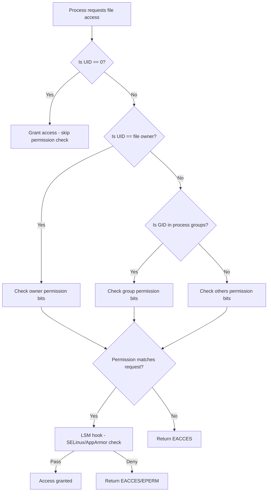
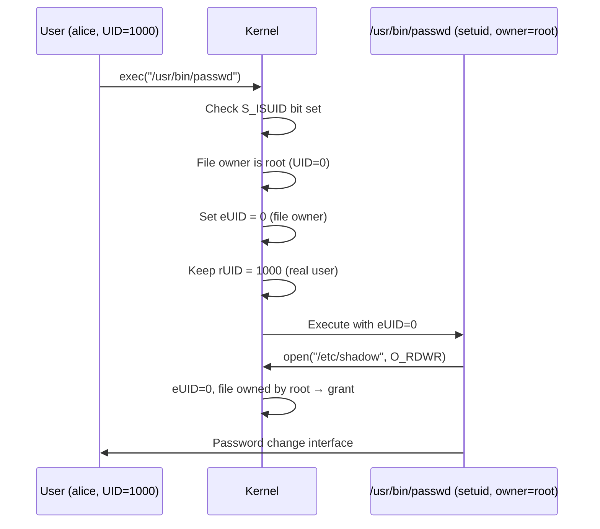

# Chapter 158: File Permissions and Ownership

## 1. Intuition

File permissions are the foundation of Unix/Linux security. Every file and directory has an owner, a group, and a set of permission bits that control who can read, write, and execute it. Think of it as a locked building: the owner has the master key, group members have a shared key, and everyone else may or may not have access at all.

The Unix permission model dates back to the earliest versions of AT&T Unix in the 1970s. Despite its simplicity, it remains the first line of defense on every Linux system. Understanding permissions deeply—beyond just `chmod 755`—is essential for system administration, security hardening, and debugging access problems.

The traditional model has three permission classes (owner, group, others) and three permission types (read, write, execute), augmented by special bits: setuid, setgid, and sticky bit. These nine regular bits plus three special bits form the complete traditional permission space.

## 2. Architecture

### 2.1 Permission Model Overview

```
┌─────────────────────────────────────────────────────────┐
│                    File Metadata (inode)                 │
├─────────────────────────────────────────────────────────┤
│  st_mode  │  st_uid  │  st_gid  │  st_nlink  │  ...    │
├───────────┴──────────┴──────────┴────────────┴─────────┤
│                                                         │
│  Permission Bits (st_mode & 07777):                     │
│                                                         │
│  ┌──────────┬──────────┬──────────┐                     │
│  │  Owner   │  Group   │  Others  │                     │
│  │  r w x   │  r w x   │  r w x   │                     │
│  │ 4 2 1   │ 4 2 1   │ 4 2 1   │                     │
│  └──────────┴──────────┴──────────┘                     │
│                                                         │
│  Special Bits:                                          │
│  ┌──────────┬──────────┬──────────┐                     │
│  │  setuid  │  setgid  │  sticky  │                     │
│  │   4000   │   2000   │   1000   │                     │
│  └──────────┴──────────┴──────────┘                     │
└─────────────────────────────────────────────────────────┘
```

### 2.2 Access Check Algorithm

When a process attempts to access a file, the kernel follows this algorithm:

1. If the process's effective UID is 0 (root), access is granted (unless capabilities restrict it).
2. If the process's effective UID matches the file's owner, use owner permission bits.
3. If the process's effective GID (or any supplementary GID) matches the file's group, use group permission bits.
4. Otherwise, use "others" permission bits.

The kernel checks only the first matching class—short-circuit evaluation means group permissions never apply if you're the owner.

### 2.3 Permission Semantics by File Type

| Permission | Regular File | Directory |
|-----------|-------------|-----------|
| Read (r) | View contents | List entries (`ls`) |
| Write (w) | Modify contents | Create/delete entries |
| Execute (x) | Run as program | Traverse (`cd` into it) |

For directories, execute permission is critical: without it, you cannot access any file inside regardless of its permissions. Read permission on a directory only lets you list names; you need execute to actually open files.

## 3. Kernel Implementation

### 3.1 The `inode` Structure

In the Linux kernel, file metadata lives in `struct inode` (defined in `include/linux/fs.h`):

```c
struct inode {
    umode_t             i_mode;     /* File type + permissions */
    kuid_t              i_uid;      /* Owner UID */
    kgid_t              i_gid;      /* Owner GID */
    unsigned int        i_flags;
    const struct inode_operations *i_op;
    /* ... many more fields ... */
};
```

The `i_mode` field encodes both the file type (regular, directory, symlink, etc.) and the permission bits. The file type occupies the upper bits, and permissions occupy the lower 12 bits.

### 3.2 Access Check: `inode_permission()`

The core access check function is `inode_permission()` in `fs/namei.c`:

```c
int inode_permission(struct inode *inode, int mask)
{
    int retval;

    if (mask & MAY_WRITE) {
        /* Check immutable flag */
        if (IS_IMMUTABLE(inode))
            return -EPERM;
        /* Check append-only flag */
        if (IS_APPEND(inode) && (mask & ~MAY_APPEND))
            return -EPERM;
    }

    /* Call filesystem-specific permission check if available */
    if (inode->i_op->permission)
        retval = inode->i_op->permission(inode, mask);
    else
        retval = generic_permission(inode, mask);

    /* LSM hook - this is where SELinux/AppArmor intercept */
    if (retval == 0)
        retval = security_inode_permission(inode, mask);

    return retval;
}
```

### 3.3 Generic Permission Check: `generic_permission()`

The `generic_permission()` function in `fs/namei.c` implements the standard Unix permission algorithm:

```c
int generic_permission(struct inode *inode, int mask)
{
    /* If we're the owner, use owner bits */
    if (uid_eq(current_fsuid(), inode->i_uid)) {
        mode = inode->i_mode >> 6;
        goto check_mode;
    }

    /* Check group membership */
    if (in_group_p(inode->i_gid)) {
        mode = inode->i_mode >> 3;
        goto check_mode;
    }

    /* Fall back to "other" bits */
    mode = inode->i_mode;

check_mode:
    /* Map requested access to permission bits */
    if ((mask & ~mode & (MAY_READ | MAY_WRITE | MAY_EXEC)) == 0)
        return 0;

    return -EACCES;
}
```

### 3.4 Setuid/Setgid Execution

When the kernel executes a binary with the setuid bit set (`S_ISUID` in `i_mode`), it changes the effective UID of the new process to the file's owner. This happens in `do_execve()` → `exec_binprm()` → the specific binary format handler (e.g., `load_elf_binary()` in `fs/binfmt_elf.c`).

The relevant code in `fs/exec.c`:

```c
void set_dumpable(struct mm_struct *mm, int value)
{
    /* ... controls core dump generation for setuid processes */
}

static int check_unsafe_exec(struct linux_binprm *bprm)
{
    /* Prevent ptrace of setuid processes if YAMA is active */
    if (bprm->unsafe & LSM_UNSAFE_PTRACE)
        return -EPERM;
    return 0;
}
```

Modern kernels restrict setuid behavior significantly:
- Core dumps are disabled for setuid binaries
- `LD_PRELOAD` and `LD_LIBRARY_PATH` are ignored
- `/proc/pid/mem` is restricted
- `ptrace` is blocked unless explicitly allowed

### 3.5 Sticky Bit Implementation

For directories, the sticky bit (`S_ISVTX`, octal 1000) prevents users from deleting or renaming files they don't own, even if they have write permission on the directory. The check happens in `may_delete()` in `fs/namei.c`:

```c
static int may_delete(struct inode *dir, struct inode *victim, int isdir)
{
    /* ... other checks ... */

    /* Sticky bit check */
    if (check_sticky(dir, victim))
        return -EPERM;

    return 0;
}
```

The `check_sticky()` function checks if the victim's UID matches the caller's UID or the directory's UID.

## 4. Source Code References

| Component | File | Function/Macro |
|-----------|------|----------------|
| Permission check entry | `fs/namei.c` | `inode_permission()` |
| Generic permission | `fs/namei.c` | `generic_permission()` |
| Sticky bit check | `fs/namei.c` | `check_sticky()` |
| Setuid execution | `fs/exec.c` | `do_execve()`, `setup_new_exec()` |
| ELF loader | `fs/binfmt_elf.c` | `load_elf_binary()` |
| Mode bit definitions | `include/uapi/linux/stat.h` | `S_ISUID`, `S_ISGID`, `S_ISVTX` |
| VFS inode | `include/linux/fs.h` | `struct inode` |
| Access flags | `include/linux/fs.h` | `MAY_READ`, `MAY_WRITE`, `MAY_EXEC` |

## 5. Configuration Examples

### 5.1 Basic Permission Management

```bash
# View permissions
ls -la /etc/passwd
# -rw-r--r-- 1 root root 2847 Jun 15 10:00 /etc/passwd

# Numeric (octal) mode
# 644 = rw-r--r--
# 755 = rwxr-xr-x
# 600 = rw-------

# Symbolic mode
chmod u+x script.sh          # Add execute for owner
chmod g-w file.txt           # Remove write for group
chmod o= file.txt            # Remove all permissions for others
chmod a+r file.txt           # Add read for everyone

# Recursive
chmod -R 755 /var/www/html/
```

### 5.2 Ownership Management

```bash
# Change owner
chown alice:developers project.c

# Change only group
chgrp developers project.c

# Recursive ownership
chown -R www-data:www-data /var/www/

# Reference file
chown --reference=file1 file2
```

### 5.3 Special Bits

```bash
# Setuid - runs with owner's privileges
chmod u+s /usr/bin/passwd
# -rwsr-xr-x 1 root root ... /usr/bin/passwd

# Setgid - files created in directory inherit group
chmod g+s /shared/project/
# drwxrwsr-x 2 root developers ... /shared/project/

# Sticky bit - only owner can delete their files
chmod +t /tmp
# drwxrwxrwt 15 root root ... /tmp

# Combined: setgid + sticky for shared directory
chmod 2775 /shared/project/
chmod +t /shared/project/
```

### 5.4 Finding Permission Problems

```bash
# Find setuid binaries (security audit)
find / -perm -4000 -type f 2>/dev/null

# Find world-writable files
find / -perm -0002 -type f 2>/dev/null

# Find files with no owner (orphaned files)
find / -nouser -o -nogroup 2>/dev/null

# Find recently modified files
find /etc -mtime -1 -type f
```

### 5.5 Default Permissions with umask

```bash
# View current umask
umask
# 0022

# Set umask (subtract from 666 for files, 777 for dirs)
umask 027
# New files: 640 (rw-r-----)
# New dirs:  750 (rwxr-x---)

# Persistent umask in /etc/login.defs
UMASK 027

# Per-user in ~/.bashrc or ~/.profile
umask 077  # Private by default
```

### 5.6 File Attribute System (ext4/xfs)

```bash
# View attributes
lsattr /etc/passwd

# Immutable - cannot modify, delete, or rename
chattr +i /etc/resolv.conf

# Append-only - can only append, not truncate
chattr +a /var/log/syslog

# No dump
chattr +d /tmp/largefile

# Secure deletion (overwrite on delete)
chattr +s /secrets/file

# Remove attribute
chattr -i /etc/resolv.conf
```

## 6. Diagrams

### 6.1 Access Check Flow



### 6.2 Permission Bit Layout


### 6.3 Setuid Execution Flow



## 7. Common Pitfalls

### 7.1 Confusing Read and Execute on Directories

A common mistake is giving read permission on a directory but not execute:

```bash
chmod 744 /project/secret/
# rwxr--r-- - others can list files but cannot access them
# Correct for most cases: chmod 750
```

Without execute permission on a directory, `ls` may show filenames but `stat`, `open`, and all other operations fail.

### 7.2 Setuid on Shell Scripts

The kernel ignores the setuid bit on interpreted scripts (those with `#!` shebang). This is a security measure because the interpreter itself would need to be setuid, creating a race condition. Instead:

```bash
# Won't work on scripts:
chmod u+s myscript.sh  # Ignored by kernel

# Use sudo instead:
echo "alice ALL=(root) NOPASSWD: /usr/local/bin/myscript.sh" >> /etc/sudoers
```

### 7.3 umask Confusion

umask subtracts from the maximum permissions, not adds:

```bash
# Common mistake: thinking umask 022 means "add group/other write"
# Actually: umask 022 REMOVES group/other write
# Default file creation: 0666 & ~0022 = 0644 (rw-r--r--)
# Default dir creation: 0777 & ~0022 = 0755 (rwxr-xr-x)
```

### 7.4 Forgetting About Parent Directory Permissions

Even if a file has 777 permissions, you need execute permission on every parent directory to reach it:

```bash
chmod 777 /home/alice/public/secret.txt
chmod 700 /home/alice/  # alice's home is private
# Other users CANNOT access secret.txt despite 777
# They can't traverse /home/alice/
```

### 7.5 Sticky Bit on /tmp Without Setting It

If `/tmp` loses its sticky bit:

```bash
# Dangerous! Anyone can delete anyone's files
chmod o-t /tmp
# Fix immediately:
chmod +t /tmp
```

### 7.6 setgid on Directories and File Creation

When a directory has the setgid bit, new files inherit the directory's group, not the creating user's primary group. This is often intentional for shared directories but can surprise administrators:

```bash
mkdir /shared
chgrp developers /shared
chmod g+s /shared
# Now all new files in /shared have group "developers"
# regardless of who creates them
```

### 7.7 Numeric vs Symbolic Permission Errors

```bash
# Common mistake: forgetting leading zero
chmod 755 file   # Works, treated as 0755
chmod -R 755 /project/  # Works

# But:
chmod 7777 file  # setuid + setgid + sticky + rwxrwxrwx
# vs
chmod +s file    # Only sets setuid and setgid
```

## 8. Best Practices

### 8.1 Principle of Least Privilege

```bash
# Web server files: readable by www-data, not executable
find /var/www -type f -exec chmod 644 {} \;
find /var/www -type d -exec chmod 755 {} \;

# Configuration files: owner-only read
chmod 600 /etc/myapp/config.ini
chown myapp:myapp /etc/myapp/config.ini

# Log files: append-only
chmod 640 /var/log/myapp/*.log
chown myapp:adm /var/log/myapp/*.log
```

### 8.2 Audit for setuid/setgid Binaries

```bash
# Baseline known setuid binaries
find / -perm -4000 -type f -exec sha256sum {} \; > /root/setuid-baseline.txt

# Periodic check for new/modified setuid binaries
find / -perm -4000 -type f -exec sha256sum {} \; | \
    diff /root/setuid-baseline.txt -
```

### 8.3 Secure Shared Directories

```bash
# Create a shared project directory
mkdir /srv/project
groupadd project-team
chown root:project-team /srv/project
chmod 2775 /srv/project  # setgid ensures group inheritance
# Users in project-team can collaborate

# For more restricted sharing:
chmod 2770 /srv/project  # Only group members
```

### 8.4 Remove Unnecessary setuid

```bash
# Many setuid binaries can use capabilities instead
# ping traditionally needed setuid for raw sockets
# Modern systems use:
#   setcap cap_net_raw+ep /usr/bin/ping
# Then remove setuid:
chmod u-s /usr/bin/ping
```

### 8.5 Use File Attributes for Critical Files

```bash
# Protect system configuration
chattr +i /etc/passwd
chattr +i /etc/shadow
chattr +i /etc/group

# Protect boot files
chattr +i /boot/grub/grub.cfg
```

## 9. Exercises

### Exercise 1: Permission Analysis

Given this listing, explain each permission and identify any security concerns:

```
-rwsr-xr-x 1 root   root    63K Jun 15 10:00 /usr/bin/passwd
-rwxr-sr-x 1 root   mail    72K Jun 15 10:00 /usr/bin/dotlockfile
-rwxrwxrwt 1 root   root   4.0K Jun 15 10:00 /tmp
-rw-rw---- 1 root   shadow 1.2K Jun 15 10:00 /etc/shadow
-rwx------ 1 alice  alice  8.1K Jun 15 10:00 /home/alice/.ssh/id_rsa
drwxr-x--- 2 alice  alice  4.0K Jun 15 10:00 /home/alice/.ssh
```

### Exercise 2: Secure a Web Application

You have a web application at `/var/www/myapp/`:
- Configuration in `config/` (database passwords)
- Uploads directory `uploads/` (user content)
- Static files `public/` (HTML, CSS, JS)
- Executables in `bin/` (PHP scripts)
- Log files in `logs/`

Design the complete permission structure.

### Exercise 3: Find and Fix Security Issues

Write a script that:
1. Finds all world-writable files in `/etc` and `/usr`
2. Finds all setuid/setgid binaries not in a whitelist
3. Finds files with no valid owner/group
4. Reports findings and optionally fixes them

### Exercise 4: umask Experiment

1. Set umask to 077, create a file and directory. Record permissions.
2. Set umask to 027, create a file and directory. Record permissions.
3. Set umask to 002, create a file and directory. Record permissions.
4. Explain the difference between each case.

### Exercise 5: Implement a Permission Checker

Write a Python script that, given a file path:
- Reports all permission bits (regular + special)
- Shows owner and group
- Determines if a given user (by UID/GID) can read/write/execute
- Checks the full directory traversal path

## 10. References

1. **Linux man pages**: `chmod(1)`, `chown(1)`, `chgrp(1)`, `stat(1)`, `umask(2)`, `access(2)`, `chmod(2)`, `chown(2)`
2. **Linux kernel source**: `fs/namei.c` — VFS path lookup and permission checking
3. **Linux kernel source**: `fs/exec.c` — Executable loading and setuid handling
4. **Linux kernel source**: `include/linux/fs.h` — `struct inode` definition
5. **The Linux Programming Interface** by Michael Kerrisk — Chapter 15: File Attributes
6. **Understanding the Linux Kernel** by Daniel P. Bovet & Marco Cesati — Chapter 12: The Virtual Filesystem
7. **POSIX.1-2017**: Base Definitions, Section 3.151 "File Permission Bits"
8. **IEEE Std 1003.1-2017**: System Interfaces, `chmod()`, `fchmod()`, `fchmodat()`
9. **Linux kernel documentation**: `Documentation/filesystems/` — Various filesystem-specific permission handling
10. **NIST SP 800-53**: AC-3 Access Enforcement — Federal standards for access control
