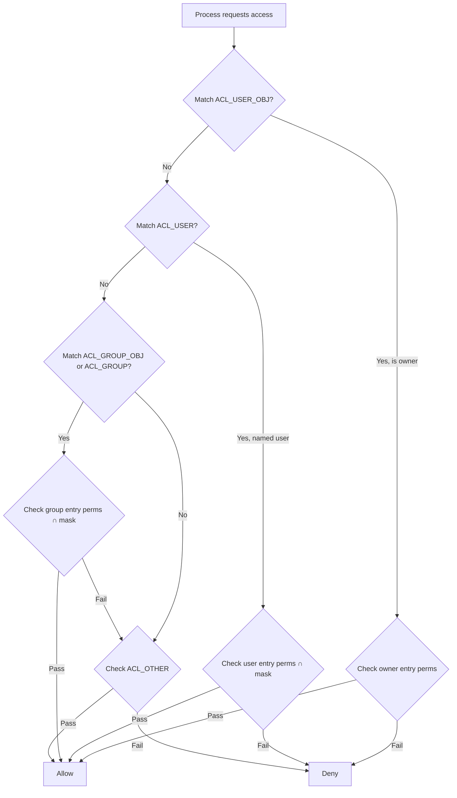
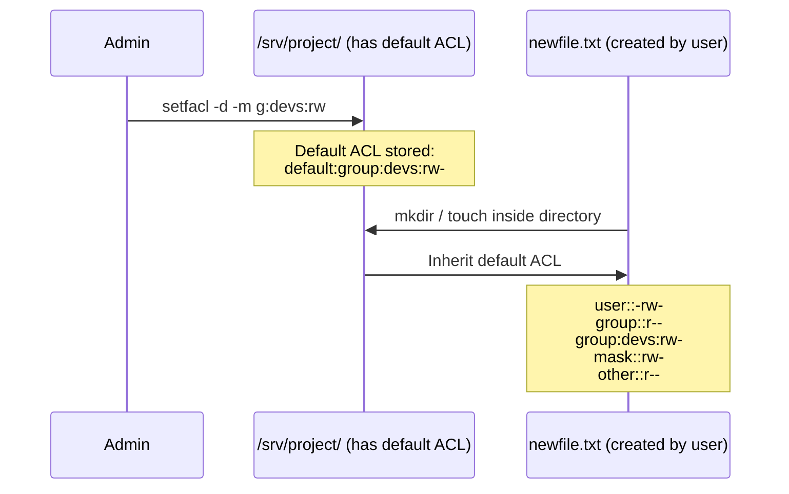
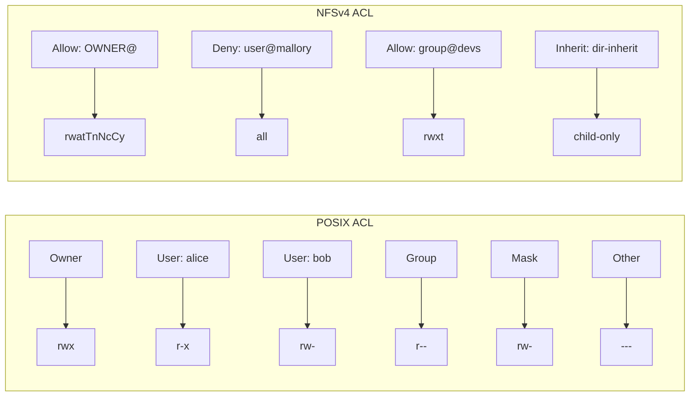

# Chapter 159: Access Control Lists (ACLs)

## 1. Intuition

Traditional Unix permissions give you three classes—owner, group, and others—with three permission types each. This works well for simple scenarios, but what happens when you need to grant access to three specific users who aren't in the same group, without opening access to everyone else? With traditional permissions, you'd need to create a group for every such combination, leading to group proliferation.

Access Control Lists (ACLs) solve this by allowing you to define per-user and per-group permissions on any file or directory. Think of traditional permissions as a three-key system (master key, group key, guest key), while ACLs are a full access card system where each person can have their own card with precisely the permissions they need.

ACLs were standardized in POSIX.1e (draft 17, withdrawn before final ratification) and are supported by all major Linux filesystems (ext4, XFS, Btrfs). NFSv4 introduced its own ACL model based on Windows NTFS ACLs, which is more expressive but incompatible with POSIX ACLs.

## 2. Architecture

### 2.1 ACL Structure

Every file can have an ACL containing multiple entries:

```
┌──────────────────────────────────────────────────────────────┐
│                         File ACL                             │
├──────────────────────────────────────────────────────────────┤
│  Entry Type          │  Qualifier    │  Permissions          │
├──────────────────────┼───────────────┼──────────────────────┤
│  ACL_USER_OBJ        │  (owner)      │  rwx                  │
│  ACL_USER            │  alice        │  r-x                  │
│  ACL_USER            │  bob          │  rw-                  │
│  ACL_GROUP_OBJ       │  (owning grp) │  r--                  │
│  ACL_GROUP           │  developers   │  rwx                  │
│  ACL_GROUP           │  auditors     │  r--                  │
│  ACL_MASK             │  (computed)   │  rwx                  │
│  ACL_OTHER           │  (others)     │  ---                  │
└──────────────────────────────────────────────────────────────┘
```

### 2.2 POSIX ACL Entry Types

| Entry Type | Description | Count |
|-----------|-------------|-------|
| `ACL_USER_OBJ` | Permissions for the file owner | Exactly 1 |
| `ACL_USER` | Permissions for a specific user | 0 or more |
| `ACL_GROUP_OBJ` | Permissions for the owning group | Exactly 1 |
| `ACL_GROUP` | Permissions for a specific named group | 0 or more |
| `ACL_MASK` | Maximum permissions for all group entries | 0 or 1 |
| `ACL_OTHER` | Permissions for everyone else | Exactly 1 |

### 2.3 The Mask Entry

The mask entry is critical and often misunderstood. It represents the **union** of all permissions granted to the named user entries, named group entries, and the owning group entry. When the kernel checks access for any of these entries, it intersects the entry's permissions with the mask.

This means: even if you grant `rwx` to a named user, if the mask is `r--`, the effective permission is `r--`. The mask is automatically computed and updated by `setfacl` and also by `chmod` (which modifies the mask, not the group entry).

### 2.4 POSIX ACL vs NFSv4 ACL Comparison

| Feature | POSIX ACL | NFSv4 ACL |
|---------|-----------|-----------|
| Standard | POSIX.1e draft 17 | RFC 3530 / NFSv4 |
| Permission model | rwx (3 bits) | Allow/Deny with 13+ flags |
| Deny entries | Not supported | Supported |
| Inheritance | Only default ACLs on dirs | ACE flags (file-inherit, etc.) |
| Granularity | Coarse | Fine-grained (append, delete-child, etc.) |
| Tools | `getfacl`, `setfacl` | `nfs4_getfacl`, `nfs4_setfacl` |
| Linux support | All major FS | NFSv4 exports, some local FS |

## 3. Kernel Implementation

### 3.1 ACL Data Structures

ACLs are represented in the kernel by `struct posix_acl` (defined in `include/linux/posix_acl.h`):

```c
struct posix_acl {
    union {
        atomic_t        a_refcount;
        struct rcu_head a_rcu;
    };
    unsigned int        a_count;
    struct posix_acl_entry a_entries[];  /* Flexible array */
};

struct posix_acl_entry {
    short               e_tag;      /* ACL_USER, ACL_GROUP, etc. */
    unsigned short      e_perm;     /* rwx bits */
    union {
        kuid_t          e_uid;      /* For ACL_USER */
        kgid_t          e_gid;      /* ACL_GROUP */
    };
};
```

### 3.2 ACL Check Algorithm

The ACL permission check is in `posix_acl_permission()` in `fs/posix_acl.c`:

```c
int posix_acl_permission(struct inode *inode, const struct posix_acl *acl,
                         int want)
{
    const struct posix_acl_entry *pa, *pe, *mask_obj = NULL;
    int found = 0;

    FOREACH_ACL_ENTRY(pa, acl, pe) {
        switch(pa->e_tag) {
            case ACL_USER_OBJ:
                /* Owner check */
                if (uid_eq(inode->i_uid, current_fsuid()))
                    goto check_perm;
                break;
            case ACL_USER:
                if (uid_eq(pa->e_uid, current_fsuid())) {
                    mask_obj = NULL;  /* Named user, check against mask later */
                    goto check_perm;
                }
                break;
            case ACL_GROUP_OBJ:
                if (in_group_p(inode->i_gid)) {
                    found = 1;
                    if ((pa->e_perm & want) == want)
                        goto check_mask;
                }
                break;
            case ACL_GROUP:
                if (in_group_p(pa->e_gid)) {
                    found = 1;
                    if ((pa->e_perm & want) == want)
                        goto check_mask;
                }
                break;
            case ACL_MASK:
                mask_obj = pa;
                break;
            case ACL_OTHER:
                goto check_perm;
        }
    }
    return -EACCES;

check_perm:
    /* Direct permission check (owner or named user or other) */
    if ((pa->e_perm & want) == want)
        return 0;
    return -EACCES;

check_mask:
    /* Group-class check: intersect with mask */
    if (mask_obj && (mask_obj->e_perm & want) != want)
        return -EACCES;
    return 0;
}
```

### 3.3 Default ACLs

Directories can have "default ACLs" that are inherited by new files and subdirectories created within them. The inheritance happens in `posix_acl_create()` in `fs/posix_acl.c`:

```c
int posix_acl_create(struct inode *dir, umode_t *mode,
                     struct posix_acl **default_acl,
                     struct posix_acl **acl)
{
    struct posix_acl *p;

    /* Get directory's default ACL */
    p = get_acl(dir, ACL_TYPE_DEFAULT);
    if (!p) {
        *default_acl = NULL;
        *acl = NULL;
        return 0;
    }

    /* Clone and mask for new file */
    *acl = posix_acl_clone(p, GFP_KERNEL);
    posix_acl_masq_nmode(*acl, mode);

    /* For directories, inherit the default ACL */
    if (S_ISDIR(*mode)) {
        *default_acl = posix_acl_clone(p, GFP_KERNEL);
    }

    posix_acl_release(p);
    return 0;
}
```

### 3.4 Filesystem ACL Storage

Different filesystems store ACLs differently:

- **ext4**: ACLs are stored as extended attributes (xattrs) with prefix `system.posix_acl_access` and `system.posix_acl_default`
- **XFS**: Uses its own internal format in attribute forks, converted to/from POSIX format at the VFS layer
- **NFS**: ACLs are part of the NFSv4 protocol, stored on the server

The VFS layer provides `get_acl()` and `set_acl()` inode operations that filesystems implement.

### 3.5 Extended Attribute Interface

ACLs are exposed to userspace through the xattr interface:

```c
/* In fs/xattr.c */
ssize_t
vfs_getxattr(struct mnt_idmap *idmap, struct dentry *dentry,
             const char *name, void *value, size_t size)
{
    struct inode *inode = dentry->d_inode;
    int error;

    /* Security hook */
    error = security_inode_getxattr(dentry, name);
    if (error)
        return error;

    if (!inode->i_op->getxattr)
        return -EOPNOTSUPP;

    return inode->i_op->getxattr(dentry, name, value, size);
}
```

## 4. Source Code References

| Component | File | Function/Structure |
|-----------|------|-------------------|
| ACL structure | `include/linux/posix_acl.h` | `struct posix_acl` |
| ACL permission check | `fs/posix_acl.c` | `posix_acl_permission()` |
| ACL creation/inheritance | `fs/posix_acl.c` | `posix_acl_create()` |
| ACL cloning | `fs/posix_acl.c` | `posix_acl_clone()` |
| Mask computation | `fs/posix_acl.c` | `posix_acl_equiv_mode()` |
| ext4 ACL support | `fs/ext4/acl.c` | `ext4_get_acl()`, `ext4_set_acl()` |
| XFS ACL support | `fs/xfs/xfs_acl.c` | `xfs_get_acl()`, `xfs_set_acl()` |
| VFS xattr interface | `fs/xattr.c` | `vfs_getxattr()`, `vfs_setxattr()` |
| NFSv4 ACL | `fs/nfs_common/nfsacl.c` | NFS ACL helpers |

## 5. Configuration Examples

### 5.1 Installing ACL Tools

```bash
# Debian/Ubuntu
sudo apt install acl

# RHEL/CentOS/Fedora
sudo dnf install acl

# Verify filesystem ACL support (should be enabled by default)
mount | grep acl
# /dev/sda1 on / type ext4 (rw,relatime,errors=remount-ro)
# No explicit "acl" means it's the default

# Some older systems or NFS mounts may need explicit acl option:
# /dev/sda1 /data ext4 defaults,acl 0 2
```

### 5.2 Viewing ACLs

```bash
# View ACL of a file
getfacl /etc/shadow
# # file: etc/shadow
# # owner: root
# # group: shadow
# user::rw-
# user:backup:r--
# group::---
# mask::r--
# other::---

# View ACL with numeric IDs (useful for NFS)
getfacl -n /etc/shadow
# user::rw-
# user:34:r--
# group::---
# mask::r--
# other::---

# Recursive
getfacl -R /srv/project/

# View only ACLs that differ from owner/group/other
getfacl -c /srv/project/
```

### 5.3 Setting POSIX ACLs

```bash
# Grant read to a specific user
setfacl -m u:alice:r /srv/project/README.md

# Grant read+write to a group
setfacl -m g:developers:rw /srv/project/code.c

# Grant execute (for directory traversal)
setfacl -m u:bob:x /srv/project/

# Remove an ACL entry
setfacl -x u:alice /srv/project/README.md

# Remove all ACLs
setfacl -b /srv/project/README.md

# Set multiple entries at once
setfacl -m u:alice:rwx,u:bob:rx,g:developers:rw /srv/project/
```

### 5.4 Default ACLs on Directories

```bash
# Set default ACL on directory (inherited by new files)
setfacl -d -m g:developers:rw /srv/project/

# Verify
getfacl /srv/project/
# # file: srv/project/
# # owner: root
# # group: root
# user::rwx
# group::r-x
# other::r-x
# default:user::rwx
# default:group::r-x
# default:group:developers:rw-
# default:mask::rwx
# default:other::r-x

# Create a file inside and check inherited ACL
touch /srv/project/newfile.txt
getfacl /srv/project/newfile.txt
# Will show inherited ACL entries
```

### 5.5 ACL Mask Management

```bash
# The mask is automatically set to the union of group-class permissions
setfacl -m u:alice:rwx /srv/project/
# mask becomes rwx

# Explicitly restrict the mask
setfacl -m m::rx /srv/project/
# Now alice's effective permissions are r-x (masked)

# NOTE: chmod changes the mask, not the group entry!
chmod g-w /srv/project/
# This reduces the mask, affecting all group-class entries
```

### 5.6 Copying ACLs Between Files

```bash
# Copy ACL from one file to another
getfacl file1 | setfacl --set - file2

# --set replaces the entire ACL
# -M - reads from stdin

# Copy ACLs recursively
getfacl -R /srv/project/ | setfacl --set -R -M - /srv/backup/
```

### 5.7 NFSv4 ACLs

```bash
# Install NFSv4 ACL tools
sudo apt install nfs4-acl-tools

# View NFSv4 ACL
nfs4_getfacl /nfs4share/file.txt
# A::OWNER@:rwatTnNcCy
# A::GROUP@:rtncy
# A::EVERYONE@:rtncy

# Set NFSv4 ACL
nfs4_setfacl -a "A::alice@domain.com:rw" /nfs4share/file.txt

# NFSv4 ACL flags
# A - Allow
# D - Deny (POSIX ACLs can't do this!)
# U - Audit (log access attempts)
# L - Alarm (alert on access)

# Permission flags
# r - Read data
# w - Write data
# a - Append data
# d - Delete
# D - Delete child
# t - Read attributes
# T - Write attributes
# n - Read named attributes
# N - Write named attributes
# c - Read ACL
# C - Write ACL
# y - Synchronize
# x - Execute
```

### 5.8 Backup and Restore ACLs

```bash
# Backup ACLs for an entire filesystem
getfacl -R /srv/ > /backup/acls-backup.txt

# Restore ACLs
setfacl --restore=/backup/acls-backup.txt

# Include ACLs in tar backup (GNU tar supports --acls)
tar --acls -czf backup.tar.gz /srv/

# Restore with ACLs
tar --acls -xzf backup.tar.gz
```

## 6. Diagrams

### 6.1 POSIX ACL Evaluation Flow



### 6.2 Default ACL Inheritance



### 6.3 POSIX ACL vs NFSv4 ACL Structure



## 7. Common Pitfalls

### 7.1 chmod Modifies the Mask, Not the Group Entry

This is the most common ACL confusion:

```bash
# Set ACL
setfacl -m g:developers:rwx file.txt
getfacl file.txt
# group::r--
# group:developers:rwx
# mask::rwx

# Now run chmod
chmod g-w file.txt
getfacl file.txt
# group::r--           ← unchanged
# group:developers:rwx  ← unchanged
# mask::r-             ← CHANGED! Effective devs perms now r-x
```

`chmod` modifies the mask entry, which constrains all group-class entries.

### 7.2 No Deny Entries in POSIX ACLs

POSIX ACLs are purely additive—you can grant permissions but not explicitly deny:

```bash
# This is NOT possible with POSIX ACLs:
# setfacl -m u:mallory:--- file.txt  ← Doesn't work as deny

# Workaround: rely on ordering and mask
# Grant everyone, then restrict specific users via mask
```

NFSv4 ACLs support explicit deny entries.

### 7.3 ACL Limits

Most filesystems limit the number of ACL entries:
- ext4: 32 entries (configurable)
- XFS: 25 entries by default

```bash
# Check current ACL count
getfacl file.txt | grep -c "^"

# ext4 can be configured with larger ACL support
# mkfs.ext4 -O acl /dev/sdb1
```

### 7.4 Backup Tools May Not Preserve ACLs

```bash
# cp doesn't preserve ACLs by default
cp file1 file2  # ACLs lost

# Use -p or --preserve=all
cp -p file1 file2  # ACLs preserved

# rsync needs -A flag
rsync -aA /src/ /dst/  # -A preserves ACLs

# tar needs --acls
tar --acls -cf backup.tar /srv/  # ACLs in archive

# Some tools silently drop ACLs - always verify!
```

### 7.5 ACLs and NFS

When exporting NFS shares:
```bash
# /etc/exports must enable ACL support
/srv/share client(rw,acl)

# NFSv4 has its own ACL model (not POSIX)
# Use nfs4_getfacl/nfs4_setfacl on NFSv4 mounts
```

### 7.6 Default ACLs Don't Apply to Existing Files

Default ACLs only affect newly created files, not files that already exist:

```bash
setfacl -d -m g:developers:rw /srv/project/
# Existing files in /srv/project/ are NOT affected
# Only new files created after this point inherit the ACL

# To apply to existing files:
setfacl -R -m g:developers:rw /srv/project/
```

### 7.7 Mixing POSIX ACLs and Traditional Permissions

Changing traditional permissions affects ACLs and vice versa:

```bash
# Set ACL
setfacl -m u:alice:rwx file.txt

# Traditional chmod affects the mask
chmod 700 file.txt
# mask becomes ---, alice's effective perms become ---

# This can silently revoke access!
```

## 8. Best Practices

### 8.1 Use ACLs When Traditional Permissions Aren't Sufficient

```bash
# Scenario: Three users need different access levels
setfacl -m u:alice:rwx /srv/project/     # Full access
setfacl -m u:bob:rx /srv/project/        # Read + traverse
setfacl -m u:charlie:r /srv/project/     # Read only

# Set default ACL for new files
setfacl -d -m u:alice:rwx /srv/project/
setfacl -d -m u:bob:rx /srv/project/
```

### 8.2 Document ACL Policies

```bash
# Create a policy file
cat > /srv/project/.acl-policy << 'EOF'
ACL Policy for /srv/project
============================
developers group: rwx (all files)
alice (lead): rwx + can modify ACLs
bob (reviewer): rx only
auditors group: r on logs/ only
EOF

# Store ACL backups as part of regular backup
getfacl -R /srv/project/ > /backup/acls-$(date +%Y%m%d).txt
```

### 8.3 Audit ACL Changes

```bash
# Monitor ACL changes via auditd
auditctl -w /srv/project/ -p a -k acl_changes
# -p a = attribute changes (ACLs are xattrs)

# Search ACL change events
ausearch -k acl_changes -i
```

### 8.4 Use ACLs for Service Accounts

```bash
# Allow backup service to read everything without root
setfacl -R -m u:backup:r /etc/
setfacl -R -d -m u:backup:r /etc/

# Allow monitoring to read logs
setfacl -m u:monitoring:r /var/log/syslog
setfacl -m u:monitoring:rx /var/log/
```

### 8.5 Test ACL Changes Before Applying

```bash
# Dry run: show what would change
setfacl --test -m u:alice:rwx /srv/project/

# Apply to a test file first
cp file.txt file.txt.test
setfacl -m u:alice:rwx file.txt.test
getfacl file.txt.test
# Verify, then apply to production
```

## 9. Exercises

### Exercise 1: Basic ACL Operations

Create a scenario where three users (alice, bob, charlie) need different access to `/srv/shared/`:
- alice: full read/write/execute
- bob: read and execute only
- charlie: read only
- No one else should have any access

Implement this using POSIX ACLs.

### Exercise 2: Default ACL Inheritance

1. Create a directory `/srv/project/` with default ACLs
2. Set default ACLs so that `g:developers` gets `rw` on all new files
3. Create several files and verify ACL inheritance
4. Explain what happens when a file is moved from another directory

### Exercise 3: ACL Mask Experiment

1. Create a file with ACLs granting `rwx` to two named users
2. Observe the mask
3. Use `chmod` to change group permissions
4. Show how the mask changes and affects effective permissions
5. Restore the mask and verify

### Exercise 4: NFSv4 ACL Comparison

1. Create a file and set POSIX ACLs
2. Export the same directory via NFSv4
3. Use `nfs4_getfacl` to view the ACL
4. Implement a deny rule (impossible with POSIX ACLs) using NFSv4 ACLs
5. Compare the expressiveness of both models

### Exercise 5: ACL Backup and Restore

1. Set up a complex ACL configuration on a directory tree
2. Back up all ACLs using `getfacl -R`
3. Simulate ACL loss (remove all ACLs)
4. Restore from backup
5. Verify everything is correct

### Exercise 6: Write an ACL Audit Script

Write a script that:
1. Scans a directory tree for files with ACLs
2. Reports all non-trivial ACL entries
3. Identifies potential security issues (e.g., overly permissive ACLs)
4. Generates a compliance report

## 10. References

1. **Linux man pages**: `getfacl(1)`, `setfacl(1)`, `acl(5)`, `posix_acl(7)`
2. **POSIX.1e Draft 17**: Access Control Lists (withdrawn standard, but widely implemented)
3. **RFC 3530**: Network File System (NFS) version 4 Protocol — ACL definitions
4. **Linux kernel source**: `fs/posix_acl.c` — Core POSIX ACL implementation
5. **Linux kernel source**: `include/linux/posix_acl.h` — ACL data structures
6. **Linux kernel source**: `fs/ext4/acl.c` — ext4 ACL support
7. **Linux kernel source**: `fs/xfs/xfs_acl.c` — XFS ACL support
8. **NFSv4 ACL Tools**: `nfs4_getfacl(1)`, `nfs4_setfacl(1)`
9. **The Linux Programming Interface** by Michael Kerrisk — Chapter 17: Access Control Lists
10. **SUSE Linux Enterprise Documentation**: "POSIX ACLs in Linux"
