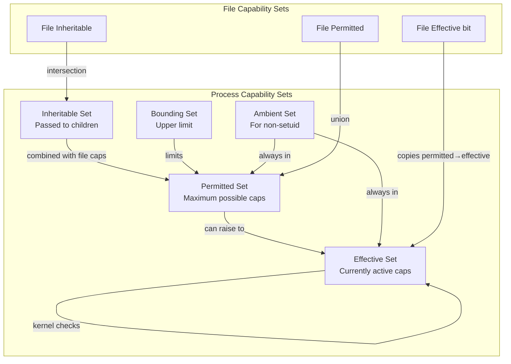
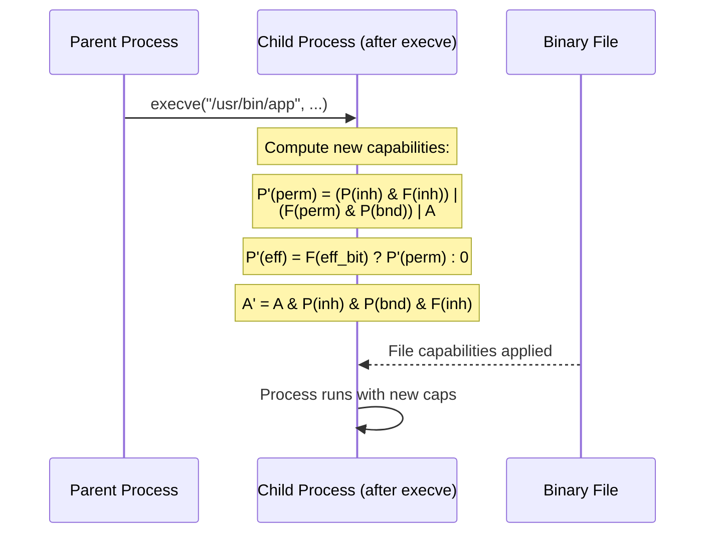
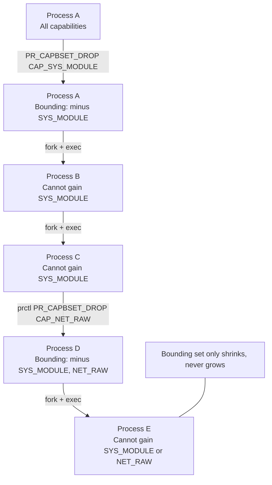

# Chapter 160: Linux Capabilities

## 1. Intuition

In traditional Unix, root (UID 0) is all-powerful. A process running as root can do anything: bind to low ports, load kernel modules, change file ownership, bypass permission checks, and more. This all-or-nothing model is a security nightmare—a single bug in a root process can compromise the entire system.

Linux capabilities break root's power into ~40 distinct, independently grantable privileges. Instead of giving a web server full root access just so it can bind to port 80, you grant only `CAP_NET_BIND_SERVICE`. Instead of making `ping` setuid root, you give it `CAP_NET_RAW`. This is the principle of least privilege applied to the superuser problem.

Think of root as a master key that opens every door in a building. Capabilities are individual keys—each door gets its own key, and you only carry the ones you need.

## 2. Architecture

### 2.1 Capability Sets

Each process has five capability sets:

```
┌─────────────────────────────────────────────────────────────────┐
│                    Process Capability Sets                      │
├─────────────────────────────────────────────────────────────────┤
│                                                                 │
│  ┌──────────┐  ┌──────────┐  ┌──────────┐                     │
│  │ Permitted │  │ Effective│  │Inheritable│                     │
│  │   (P)    │  │   (E)    │  │    (I)    │                     │
│  └────┬─────┘  └────┬─────┘  └────┬─────┘                     │
│       │              │              │                           │
│       │    ┌─────────┴─────────┐    │                           │
│       │    │  Capabilities in  │    │                           │
│       │    │  P can be raised  │    │                           │
│       │    │  to E via prctl() │    │                           │
│       │    └───────────────────┘    │                           │
│       │                             │                           │
│  ┌────┴─────────────────────────────┴────┐                     │
│  │         File Capability Sets          │                     │
│  │  ┌──────────┐  ┌──────────┐          │                     │
│  │  │ Effective│  │Inheritable│          │                     │
│  │  │   (fE)   │  │   (fI)   │          │                     │
│  │  └──────────┘  └──────────┘          │                     │
│  └──────────────────────────────────────┘                     │
│                                                                 │
│  ┌──────────────────────────────────────┐                     │
│  │         Bounding Set (B)             │                     │
│  │  Upper limit on capabilities         │                     │
│  │  Can only shrink, never grow         │                     │
│  └──────────────────────────────────────┘                     │
│                                                                 │
│  ┌──────────────────────────────────────┐                     │
│  │         Ambient Set (A)              │                     │
│  │  Caps preserved across execve()      │                     │
│  │  for non-setuid binaries             │                     │
│  └──────────────────────────────────────┘                     │
└─────────────────────────────────────────────────────────────────┘
```

### 2.2 Capability Set Semantics

| Set | Purpose | Survives execve()? |
|-----|---------|-------------------|
| **Permitted (P)** | Caps the process *may* have | Yes (with file caps) |
| **Effective (E)** | Caps the kernel actually checks | Yes (if file effective bit set) |
| **Inheritable (I)** | Caps passed to child processes | Yes (combined with file inheritable) |
| **Bounding (B)** | Upper limit on permitted | Shrinks on exec (if not in file inheritable) |
| **Ambient (A)** | Caps for non-setuid programs | Yes (if in permitted and bounding) |

### 2.3 Capability Inheritance Rules

When a process calls `execve()`, the new capabilities are computed:

```
P'(permitted)   = (P(inheritable) & F(inheritable)) |
                  (F(permitted) & P(bounding)) | P'(ambient)

P'(effective)   = F(effective) ? P'(permitted) : 0

P'(inheritable) = P(inheritable)   (unchanged)

P'(ambient)     = P(inheritable) & P(bounding) & F(inheritable) &
                  ~(P(permitted) & ~P'(permitted))

P'(bounding)    = P(bounding)      (unchanged, possibly shrinks)
```

Where:
- `P` = old process capabilities
- `F` = file capabilities
- `P'` = new process capabilities

### 2.4 Key Capabilities

| Capability | Purpose | Example Use |
|-----------|---------|-------------|
| `CAP_NET_BIND_SERVICE` | Bind to ports < 1024 | Web servers, DNS |
| `CAP_NET_RAW` | Raw sockets, packet filters | ping, tcpdump |
| `CAP_NET_ADMIN` | Network config changes | ifconfig, iptables |
| `CAP_SYS_ADMIN` | Catch-all "admin" operations | mount, umount, swapon |
| `CAP_SYS_PTRACE` | Trace/debug processes | strace, gdb |
| `CAP_DAC_OVERRIDE` | Bypass file permission checks | Backup tools |
| `CAP_CHOWN` | Change file ownership | chown |
| `CAP_SETUID`/`CAP_SETGID` | Change process UID/GID | su, sudo |
| `CAP_KILL` | Send signals to any process | kill |
| `CAP_SYS_MODULE` | Load/unload kernel modules | modprobe |
| `CAP_SYS_RAWIO` | Raw I/O access | Direct hardware access |
| `CAP_FOWNER` | Bypass owner permission checks | File operations |
| `CAP_DAC_READ_SEARCH` | Bypass read/search permission checks | find, locate |
| `CAP_AUDIT_WRITE` | Write to audit log | auditd plugins |
| `CAP_SYS_CHROOT` | Use chroot() | chroot environments |
| `CAP_MKNOD` | Create device files | mknod |
| `CAP_SYS_TIME` | Modify system clock | ntpd, chronyd |
| `CAP_LINUX_IMMUTABLE` | Set/clear immutable flags | chattr |

## 3. Kernel Implementation

### 3.1 Data Structures

Capabilities are stored as bitmaps. In the kernel (from `include/uapi/linux/capability.h`):

```c
#define _LINUX_CAPABILITY_VERSION_3  0x20080522
#define _LINUX_CAPABILITY_U32S_3     2  /* 64-bit capability space */

typedef struct kernel_cap_struct {
    __u32 cap[_KERNEL_CAPABILITY_U32S];  /* 2 × 32 = 64 bits */
} kernel_cap_t;

/* Process credentials structure */
struct cred {
    /* ... */
    kernel_cap_t    cap_inheritable;
    kernel_cap_t    cap_permitted;
    kernel_cap_t    cap_effective;
    kernel_cap_t    cap_bset;     /* Bounding set */
    kernel_cap_t    cap_ambient;
    /* ... */
};
```

### 3.2 Capability Check

The primary check function is `cap_capable()` in `security/commoncap.c`:

```c
int cap_capable(const struct cred *cred, struct user_namespace *targ_ns,
                int cap, unsigned int opts)
{
    struct user_namespace *ns = targ_ns;

    /* Walk up the user namespace hierarchy */
    for (;;) {
        /* If in the target namespace, check the capability */
        if (ns == cred->user_ns)
            return cap_raised(cred->cap_permitted, cap) ? 0 : -EPERM;

        /* If we're the creator of this namespace, we have all caps */
        if (ns->owner == cred->user_ns)
            return 0;

        /* Try parent namespace */
        ns = ns->parent;
    }
}
```

### 3.3 Capability Computation on execve()

The capability transformation during `execve()` is in `get_file_caps()` and `cap_bprm_set_creds()` in `security/commoncap.c`:

```c
static int get_file_caps(struct linux_binprm *bprm, bool *effective, bool *has_cap)
{
    /* ... load file capabilities from xattr ... */

    /* Compute new permitted set */
    new_permitted = cap_intersect(
        cap_combine(
            cap_intersect(current->cap_inheritable, fcaps.inheritable),
            cap_combine(fcaps.permitted,
                        cap_intersect(current->cap_bset, fcaps.permitted))
        ),
        current->cap_bset
    );

    /* If file effective bit is set, effective = permitted */
    if (fcaps.effective)
        new_effective = new_permitted;
    else
        new_effective = 0;

    /* Apply to bprm */
    bprm->cred->cap_permitted = new_permitted;
    bprm->cred->cap_effective = new_effective;

    return 0;
}
```

### 3.4 Ambient Capability Handling

Ambient capabilities were added to solve the problem of running unprivileged programs that need specific capabilities without file capability support:

```c
/* In security/commoncap.c */
static inline bool is_vfsuid_eq_kuid(struct user_namespace *mnt_userns,
                                     vfsuid_t vfsuid, kuid_t kuid)

int cap_task_fix_setuid(struct cred *new, const struct cred *old, int flags)
{
    /* ... handle setuid transitions ... */

    /* If dropping from root to user, clear ambient caps */
    if (issecure(SECURE_NOROOT) && uid_eq(old->euid, GLOBAL_ROOT_UID)) {
        /* Clear ambient set on uid change */
        cap_clear(new->cap_ambient);
    }
    return 0;
}
```

### 3.5 Bounding Set

The bounding set limits what capabilities a process can ever gain. It can only be shrunk:

```c
/* prctl handler for PR_CAPBSET_DROP */
SYSCALL_DEFINE2(prctl, int, option, unsigned long, arg2)
{
    /* ... */
    case PR_CAPBSET_DROP:
        /* Can only drop, never add */
        return cap_drop_fs(arg2);
    /* ... */
}
```

Once a capability is removed from the bounding set, it cannot be regained by any descendant process.

### 3.6 File Capabilities Storage

File capabilities are stored as extended attributes:

- `security.capability` — Contains the capability struct with effective bit, permitted, inheritable, and rootid

The format (version 2/3) includes a rootid field for namespace support:

```c
struct vfs_ns_cap_data {
    __le32 magic_etc;
    struct {
        __le32 permitted;
        __le32 inheritable;
    } data[VFS_CAP_U32_3];  /* 2 entries for 64-bit */
    __le32 rootid;           /* UID of namespace root */
};
```

## 4. Source Code References

| Component | File | Function/Macro |
|-----------|------|----------------|
| Capability definitions | `include/uapi/linux/capability.h` | `CAP_*` constants |
| Capability type | `include/linux/capability.h` | `kernel_cap_t` |
| Capability check | `security/commoncap.c` | `cap_capable()` |
| execve() capability calc | `security/commoncap.c` | `get_file_caps()`, `cap_bprm_set_creds()` |
| Bounding set | `security/commoncap.c` | `cap_drop_fs()` |
| Ambient caps | `security/commoncap.c` | `cap_task_fix_setuid()` |
| File cap xattr | `security/commoncap.c` | `get_vfs_caps_from_disk()` |
| Process credentials | `include/linux/cred.h` | `struct cred` |
| Credential commit | `kernel/cred.c` | `commit_creds()` |

## 5. Configuration Examples

### 5.1 Viewing Capabilities

```bash
# View current process capabilities
cat /proc/self/status | grep Cap
# CapInh: 0000000000000000
# CapPrm: 0000003fffffffff
# CapEff: 0000003fffffffff
# CapBnd: 0000003fffffffff
# CapAmb: 0000000000000000

# Decode capabilities
capsh --print
# Current: =
# Bounding set =cap_chown,cap_dac_override,...,cap_sys_admin,...
# Securebits: 0/0x0/0'b0

# View capabilities of a running process
getpcaps <PID>

# View file capabilities
getcap /usr/bin/ping
# /usr/bin/ping = cap_net_raw+ep
```

### 5.2 Setting File Capabilities

```bash
# Grant capability to a file
setcap cap_net_raw+ep /usr/bin/ping
# e = effective bit (capability is in effective set immediately)
# p = permitted set

# Multiple capabilities
setcap cap_net_bind_service,cap_net_raw+ep /usr/bin/myapp

# Inheritable capability (passed to child processes)
setcap cap_net_admin+ei /usr/sbin/iptables

# Remove file capabilities
setcap -r /usr/bin/ping

# Verify
getcap /usr/bin/ping
# (no output = no capabilities)
```

### 5.3 Capability-Aware Service Configuration

```bash
# For systemd services, use AmbientCapabilities=
# /etc/systemd/system/myweb.service
[Unit]
Description=My Web Server

[Service]
ExecStart=/usr/bin/myweb
User=www-data
AmbientCapabilities=CAP_NET_BIND_SERVICE
CapabilityBoundingSet=CAP_NET_BIND_SERVICE
NoNewPrivileges=true

[Install]
WantedBy=multi-user.target
```

### 5.4 Using capsh for Capability Testing

```bash
# Run a command with specific capabilities
capsh --caps="cap_net_raw+eip" -- -c "ping -c1 127.0.0.1"

# Drop all capabilities except specific ones
capsh --drop="cap_sys_admin,cap_sys_module" -- -c "whoami"

# Keep capabilities across UID change
capsh --keep=1 --uid=1000 -- -c "getpcaps $$"

# Add to ambient set
capsh --addamb="cap_net_bind_service" -- -c "python3 -m http.server 80"

# Print capability state
capsh --print
```

### 5.5 Capability Management with capsh

```bash
# Secure a program by restricting capabilities
# Before: running as root with all capabilities
# After: drop unnecessary capabilities

capsh \
    --caps="cap_net_bind_service,cap_chown+eip" \
    --secbits="noroot" \
    -- -c "/usr/sbin/myserver"

# noroot securebit means UID 0 gets no special treatment
```

### 5.6 Capability-Aware Programming

```c
/* Drop capabilities in C */
#include <sys/prctl.h>
#include <linux/capability.h>
#include <sys/capability.h>

int main(void) {
    cap_t caps;

    /* Get current capabilities */
    caps = cap_get_proc();

    /* Clear all capabilities */
    cap_clear(caps);

    /* Set only what we need */
    cap_value_t cap_list[] = { CAP_NET_BIND_SERVICE };
    cap_set_flag(caps, CAP_EFFECTIVE, 1, cap_list, CAP_SET);
    cap_set_flag(caps, CAP_PERMITTED, 1, cap_list, CAP_SET);
    cap_set_proc(caps);
    cap_free(caps);

    /* Now we can bind to port 80 but do nothing else */
    int fd = socket(AF_INET, SOCK_STREAM, 0);
    struct sockaddr_in addr = {
        .sin_family = AF_INET,
        .sin_port = htons(80),
        .sin_addr.s_addr = INADDR_ANY
    };
    bind(fd, (struct sockaddr*)&addr, sizeof(addr));
    listen(fd, 5);

    /* ... */
    return 0;
}
```

### 5.7 Prctl-Based Capability Management

```c
#include <sys/prctl.h>
#include <linux/capability.h>

/* Drop a capability from the bounding set */
prctl(PR_CAPBSET_DROP, CAP_SYS_MODULE, 0, 0, 0);

/* Read ambient capabilities */
unsigned long ambient = prctl(PR_CAP_AMBIENT, PR_CAP_AMBIENT_IS_SET,
                              CAP_NET_BIND_SERVICE, 0, 0);

/* Add to ambient set */
prctl(PR_CAP_AMBIENT, PR_CAP_AMBIENT_RAISE,
      CAP_NET_BIND_SERVICE, 0, 0);

/* Clear all ambient caps */
prctl(PR_CAP_AMBIENT, PR_CAP_AMBIENT_CLEAR_ALL, 0, 0, 0);
```

### 5.8 Systemd Capability Options

```ini
# /etc/systemd/system/secure-service.service
[Unit]
Description=Secure Service

[Service]
ExecStart=/usr/bin/secure-app

# Limit capabilities to only what's needed
CapabilityBoundingSet=CAP_NET_BIND_SERVICE CAP_DAC_READ_SEARCH
AmbientCapabilities=CAP_NET_BIND_SERVICE

# Drop privileges after binding
SecureBits=keep-caps
NoNewPrivileges=true

# Combine with other security
ProtectSystem=strict
ProtectHome=true
PrivateTmp=true
```

## 6. Diagrams

### 6.1 Capability Sets Interaction



### 6.2 Capability Inheritance on execve()



### 6.3 Bounding Set Enforcement



## 7. Common Pitfalls

### 7.1 Confusing Permitted and Effective

```bash
# Setting only permitted (not effective) doesn't immediately grant the capability
setcap cap_net_raw+p /usr/bin/myapp
# The process must explicitly raise it to effective
# This requires code: prctl(PR_CAP_AMBIENT, PR_CAP_AMBIENT_RAISE, CAP_NET_RAW, 0, 0)

# Usually you want +ep (both effective and permitted)
setcap cap_net_raw+ep /usr/bin/myapp
```

### 7.2 Capabilities Lost on setuid

When a setuid binary is executed, file capabilities are ignored. The process gets the capabilities of the new effective UID:

```bash
# This has no effect:
setcap cap_net_raw+ep /usr/bin/sudo

# sudo inherits the target user's capabilities
# Configure in /etc/sudoers instead
```

### 7.3 CAP_SYS_ADMIN is Too Broad

`CAP_SYS_ADMIN` is often called "the new root" because it grants ~50 different privileges. Avoid using it:

```bash
# Bad: gives too much power
setcap cap_sys_admin+ep /usr/bin/myapp

# Good: use specific capabilities
setcap cap_net_admin+ep /usr/bin/myapp  # Only network admin
```

### 7.4 Capabilities Don't Survive Package Updates

When a package is updated, the binary is replaced and file capabilities are lost:

```bash
# After apt upgrade, re-apply:
setcap cap_net_raw+ep /usr/bin/ping

# Solution: use a post-install hook
# /etc/apt/apt.conf.d/99capabilities
DPkg::Post-Invoke { "setcap cap_net_raw+ep /usr/bin/ping || true"; };
```

### 7.5 Securebits and UID 0

By default, UID 0 (root) automatically gets all permitted capabilities. The `SECBIT_NOROOT` securebit changes this:

```bash
# With noroot, UID 0 is treated like any other user
capsh --secbits="noroot" -- -c "capsh --print"

# This is critical for containers and capability-aware apps
```

### 7.6 Capability Bounding Set and Containers

In containers, the bounding set is often restricted:

```bash
# Docker drops many capabilities by default
docker run --cap-drop=ALL --cap-add=NET_BIND_SERVICE nginx

# Check what's available
docker run --rm alpine cat /proc/1/status | grep Cap
```

### 7.7 File Capabilities vs setuid

```bash
# Old way: setuid ping
chmod u+s /usr/bin/ping  # Gives ALL root capabilities

# New way: specific capabilities
setcap cap_net_raw+ep /usr/bin/ping  # Only raw socket access

# Much more secure!
```

## 8. Best Practices

### 8.1 Grant Minimum Capabilities

```bash
# Instead of running as root:
# Bad
sudo /usr/bin/mywebserver

# Good: run as non-root with specific capabilities
setcap cap_net_bind_service+ep /usr/bin/mywebserver
# Then run as www-data:
sudo -u www-data /usr/bin/mywebserver
```

### 8.2 Use Bounding Set to Limit Children

```bash
# In a service, drop capabilities from bounding set
# This prevents child processes from ever gaining them
prctl(PR_CAPBSET_DROP, CAP_SYS_MODULE, 0, 0, 0);
prctl(PR_CAPBSET_DROP, CAP_SYS_RAWIO, 0, 0, 0);
prctl(PR_CAPBSET_DROP, CAP_SYS_ADMIN, 0, 0, 0);
```

### 8.3 Combine with Other Security Measures

```bash
# Systemd service with comprehensive security
[Service]
ExecStart=/usr/bin/myapp
User=myapp
CapabilityBoundingSet=CAP_NET_BIND_SERVICE
AmbientCapabilities=CAP_NET_BIND_SERVICE
NoNewPrivileges=true
ProtectSystem=strict
ProtectHome=true
PrivateTmp=true
PrivateDevices=true
SystemCallFilter=@system-service
```

### 8.4 Audit Capability Usage

```bash
# Find all files with capabilities
getcap -r / 2>/dev/null

# Monitor capability changes
auditctl -w /usr/bin/ -p x -k capability_audit

# Review capability assignments
ausearch -k capability_audit
```

### 8.5 Migrate from setuid to Capabilities

```bash
#!/bin/bash
# Script to convert setuid binaries to capabilities
for binary in $(find /usr/bin /usr/sbin -perm -4000 -type f); do
    name=$(basename $binary)
    case $name in
        ping|ping6)
            setcap cap_net_raw+ep "$binary"
            chmod u-s "$binary"
            echo "Converted: $binary → cap_net_raw"
            ;;
        mount|umount)
            setcap cap_sys_admin+ep "$binary"
            chmod u-s "$binary"
            echo "Converted: $binary → cap_sys_admin"
            ;;
        passwd)
            setcap cap_chown,cap_dac_override,cap_fowner+ep "$binary"
            chmod u-s "$binary"
            echo "Converted: $binary → cap_chown,dac_override,fowner"
            ;;
    esac
done
```

## 9. Exercises

### Exercise 1: Basic Capability Operations

1. Create a simple C program that binds to port 80
2. Try running it as non-root (should fail)
3. Use `setcap` to grant `CAP_NET_BIND_SERVICE`
4. Verify it works as non-root
5. Compare with the setuid approach

### Exercise 2: Capability Inheritance

1. Write a parent process that:
   - Drops all capabilities except `CAP_NET_RAW`
   - Sets `CAP_NET_RAW` in the inheritable set
   - Execs a child process
2. Verify the child's capabilities
3. Experiment with the ambient set

### Exercise 3: Bounding Set Manipulation

1. Write a program that:
   - Removes `CAP_SYS_MODULE` from the bounding set
   - Forks a child
   - The child tries to load a kernel module
2. Verify the child cannot gain `CAP_SYS_MODULE`

### Exercise 4: Container Capability Analysis

1. Run a Docker container with `--cap-drop=ALL --cap-add=NET_BIND_SERVICE`
2. List the container's capabilities
3. Try operations that require other capabilities
4. Explain why each succeeds or fails

### Exercise 5: Capability Audit

1. Scan the system for all files with capabilities
2. For each, explain why the capability is needed
3. Identify any excessive capabilities
4. Write a report recommending changes

### Exercise 6: Secure Service with Capabilities

Design a systemd service that:
1. Runs as a non-root user
2. Binds to port 443 (HTTPS)
3. Can read files in `/etc/ssl/private/`
4. Cannot load modules, modify network config, or access raw IO
5. Uses ambient capabilities and bounding set restrictions

## 10. References

1. **Linux man pages**: `capabilities(7)`, `capsh(1)`, `getcap(1)`, `setcap(1)`, `cap_get_proc(3)`
2. **Linux kernel source**: `security/commoncap.c` — Core capability implementation
3. **Linux kernel source**: `include/uapi/linux/capability.h` — Capability definitions
4. **Linux kernel source**: `include/linux/capability.h` — Kernel capability types
5. **Linux kernel source**: `kernel/cred.c` — Credential management
6. **POSIX 1003.1e Draft 17**: Capabilities (withdrawn)
7. **Linux man pages**: `prctl(2)` — `PR_CAPBSET_DROP`, `PR_CAP_AMBIENT`
8. **The Linux Programming Interface** by Michael Kerrisk — Chapter 39: Capabilities
9. **Linux kernel documentation**: `Documentation/security/credentials.rst`
10. **LWN.net**: "Capabilities and the security module API" — Jonathan Corbet
11. **Docker documentation**: "--cap-add and --cap-drop" — Container capability management
