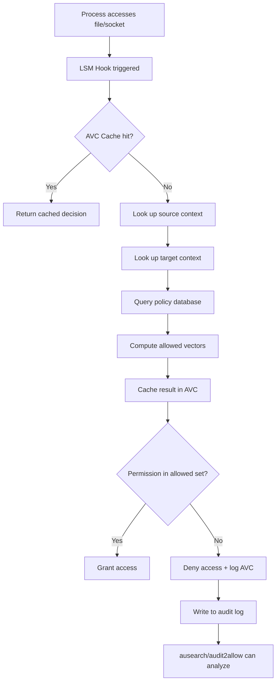
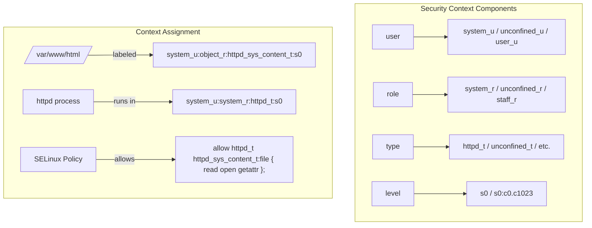
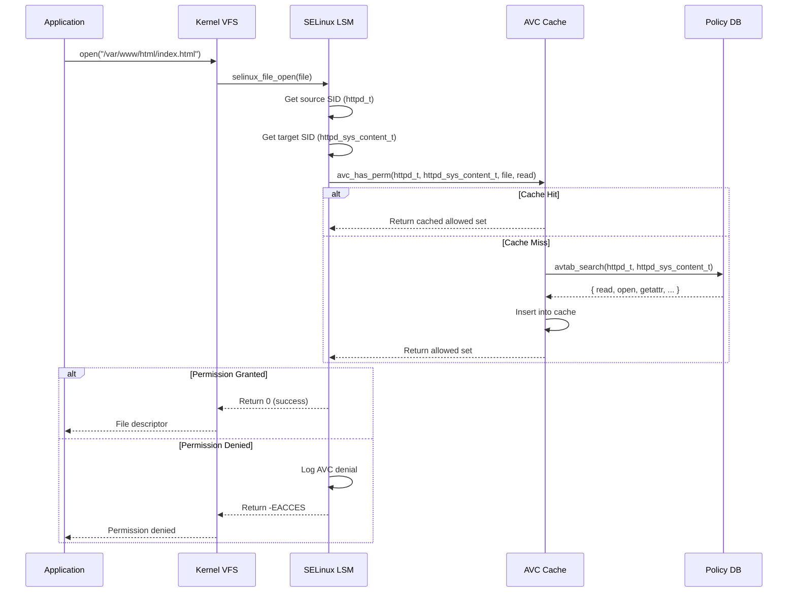

# Chapter 161: SELinux

## 1. Intuition

Imagine you have a web server running as the `httpd` process. In traditional Unix, if an attacker compromises the web server, they can access anything the `httpd` user can access—every file owned by that user, every network socket, every process. The damage radius is defined by the user account.

SELinux (Security-Enhanced Linux) adds a second layer of access control that's independent of Unix permissions. Instead of asking "does this user have permission?", SELinux asks "is this *type* of process allowed to access this *type* of file?" A compromised web server, even running as root, can only access files labeled as `httpd_sys_content_t`, only bind to ports labeled `httpd_port_t`, and only connect to processes labeled `mysqld_t`. The damage radius is defined by policy, not user accounts.

SELinux was originally developed by the NSA and released as open source. It implements Mandatory Access Control (MAC), where the security policy is enforced by the kernel and cannot be overridden by users or applications. This is fundamentally different from Discretionary Access Control (DAC), where file owners control access.

## 2. Architecture

### 2.1 SELinux Models

SELinux supports three policy models:

```
┌─────────────────────────────────────────────────────────────────┐
│                    SELinux Policy Models                        │
├─────────────────────────────────────────────────────────────────┤
│                                                                 │
│  ┌─────────────────┐  ┌─────────────────┐  ┌───────────────┐  │
│  │   Type          │  │   Role-Based    │  │   Multi-      │  │
│  │   Enforcement   │  │   Access        │  │   Level       │  │
│  │   (TE)          │  │   Control       │  │   Security    │  │
│  │                 │  │   (RBAC)        │  │   (MLS/MCS)   │  │
│  ├─────────────────┤  ├─────────────────┤  ├───────────────┤  │
│  │ Processes have  │  │ Users assume    │  │ Sensitivity   │  │
│  │ types. Files    │  │ roles. Roles    │  │ levels and    │  │
│  │ have types.     │  │ can access      │  │ categories    │  │
│  │ Policy says     │  │ domains.        │  │ control info  │  │
│  │ which types     │  │                 │  │ flow.         │  │
│  │ can access      │  │                 │  │               │  │
│  │ which types.    │  │                 │  │               │  │
│  └─────────────────┘  └─────────────────┘  └───────────────┘  │
│                                                                 │
│  Primary model for              Used in                Used in  │
│  RHEL/CentOS/Fedora             targeted policy        MLS      │
│                                 for process            policy   │
│                                 confinement            (gov/mil)│
└─────────────────────────────────────────────────────────────────┘
```

### 2.2 Security Context

Every process and file has a security context (label) with up to four components:

```
user:role:type:level

Examples:
  system_u:system_r:httpd_t:s0           ← httpd process
  system_u:object_r:httpd_sys_content_t:s0  ← web content file
  unconfined_u:unconfined_r:unconfined_t:s0  ← unconfined user process

Components:
  user   - SELinux user identity (mapped from Unix UID)
  role   - Role in RBAC (process roles end in _r)
  type   - Domain (for processes) or type (for files) ← most important
  level  - MLS/MCS sensitivity level (e.g., s0, s0-s0:c0.c1023)
```

### 2.3 Access Vector Cache (AVC)

SELinux uses a cache to avoid recomputing policy decisions:

```
┌─────────────────────────────────────────────────────────────────┐
│                    SELinux Access Check                         │
├─────────────────────────────────────────────────────────────────┤
│                                                                 │
│  Process (source context)                                       │
│  httpd_t                                                        │
│      │                                                          │
│      ▼                                                          │
│  ┌──────────────┐     ┌──────────────────┐                     │
│  │   Access     │────▶│   Policy         │                     │
│  │   Vector     │     │   Database       │                     │
│  │   Cache      │◀────│   (allow rules)  │                     │
│  │   (AVC)      │     └──────────────────┘                     │
│  └──────┬───────┘                                               │
│         │                                                       │
│         ▼                                                       │
│  File (target context)                                          │
│  httpd_sys_content_t                                            │
│                                                                 │
│  Result: allow httpd_t httpd_sys_content_t : file { read open } │
│          → PERMITTED                                            │
└─────────────────────────────────────────────────────────────────┘
```

## 3. Kernel Implementation

### 3.1 LSM Hooks

SELinux is implemented as a Linux Security Module (LSM). It registers hooks at every security-relevant kernel operation:

```c
/* In security/selinux/hooks.c */
static struct security_hook_list selinux_hooks[] = {
    LSM_HOOK_INIT(binder_set_context_mgr, selinux_binder_set_context_mgr),
    LSM_HOOK_INIT(binder_transaction, selinux_binder_transaction),
    LSM_HOOK_INIT(ptrace_access_check, selinux_ptrace_access_check),
    LSM_HOOK_INIT(capget, selinux_capget),
    LSM_HOOK_INIT(capset, selinux_capset),
    LSM_HOOK_INIT(inode_permission, selinux_inode_permission),
    LSM_HOOK_INIT(file_permission, selinux_file_permission),
    LSM_HOOK_INIT(open, selinux_file_open),
    LSM_HOOK_INIT(task_create, selinux_task_create),
    LSM_HOOK_INIT(task_kill, selinux_task_kill),
    LSM_HOOK_INIT(socket_create, selinux_socket_create),
    LSM_HOOK_INIT(socket_connect, selinux_socket_connect),
    /* ... hundreds more hooks ... */
};
```

### 3.2 Permission Check Flow

The core permission check is in `security/selinux/avc.c`:

```c
int avc_has_perm(u32 ssid, u32 tsid, u16 tclass, u32 requested,
                 struct avc_node *node)
{
    struct avc_node *node;
    int rc = 0;

    /* Check the AVC cache first */
    node = avc_lookup(ssid, tsid, tclass, requested);
    if (!node) {
        /* Cache miss - compute from policy */
        rc = avc_compute_av(ssid, tsid, tclass, requested, &avd);
        if (rc)
            return rc;
        /* Cache the result */
        avc_insert(ssid, tsid, tclass, &avd);
    }

    /* Check if the requested permission is allowed */
    if (requested & ~avd.allowed) {
        /* Permission denied */
        avc_audit(ssid, tsid, tclass, requested, &avd, rc, ad);
        return -EACCES;
    }

    return 0;
}
```

### 3.3 Policy Database

The policy database is loaded from userspace into kernel memory:

```c
/* In security/selinux/ss/ */
struct policydb {
    /* Type enforcement tables */
    struct ebitmap *te_attr;      /* Type attribute bitmaps */
    struct avtab *te_avtab;       /* Allow/dontaudit rules */

    /* Role-based access */
    struct role_datum **role_val_to_struct;

    /* Users */
    struct user_datum **user_val_to_struct;

    /* MLS/MCS */
    struct mls_range_list *range_tr;

    /* ... */
};
```

The `avtab` (access vector table) is the core data structure storing all allow/deny rules, indexed by source type, target type, and target class.

### 3.4 SELinux Filesystem Interface

SELinux exposes several interfaces through `/sys/fs/selinux/`:

```c
/* Policy load */
static ssize_t sel_write_load(struct file *file, const char __user *buf,
                              size_t count, loff_t *ppos)
{
    /* Parse and load binary policy */
    policy = kmalloc(count, GFP_KERNEL);
    copy_from_user(policy, buf, count);
    security_load_policy(policy, count);
    /* ... */
}

/* Enforcing mode toggle */
static ssize_t sel_write_enforce(struct file *file, const char __user *buf,
                                 size_t count, loff_t *ppos)
{
    /* ... */
    enforcing_enabled(value);
    /* ... */
}
```

### 3.5 SELinux Hooks for Key Operations

```c
/* File open check */
static int selinux_file_open(struct file *file)
{
    struct file_security_struct *fsec = file->f_security;
    struct inode_security_struct *isec = file_inode(file)->i_security;

    return avc_has_perm(current_sid(), isec->sid, isec->sclass,
                        file_to_av(file), &file->f_security);
}

/* Process kill check */
static int selinux_task_kill(struct task_struct *p, struct kernel_siginfo *info,
                             int sig, const struct cred *cred)
{
    u32 secid;
    secid = task_sid(p);
    return avc_has_perm(current_sid(), secid, SECCLASS_PROCESS,
                        PROCESS__SIGPERM, NULL);
}
```

## 4. Source Code References

| Component | File | Function |
|-----------|------|----------|
| LSM hooks registration | `security/selinux/hooks.c` | `selinux_hooks[]` |
| AVC permission check | `security/selinux/avc.c` | `avc_has_perm()` |
| Policy database | `security/selinux/ss/policydb.c` | `policydb_read()` |
| Access vector computation | `security/selinux/ss/avtab.c` | `avtab_search()` |
| File permission hook | `security/selinux/hooks.c` | `selinux_inode_permission()` |
| File open hook | `security/selinux/hooks.c` | `selinux_file_open()` |
| Context management | `security/selinux/ss/context.c` | `context_*()` |
| Policy load | `security/selinux/ss/services.c` | `security_load_policy()` |
| SELinuxFS interface | `security/selinux/selinuxfs.c` | Various `sel_write_*()` |

## 5. Configuration Examples

### 5.1 SELinux Status and Management

```bash
# Check SELinux status
getenforce
# Enforcing | Permissive | Disabled

sestatus
# SELinux status:                 enabled
# SELinuxfs mount:                /sys/fs/selinux
# SELinux root directory:         /etc/selinux
# Loaded policy name:             targeted
# Current mode:                   enforcing
# Mode from config file:          enforcing
# Policy MLS status:              enabled
# Policy deny_unknown status:     allowed

# Temporarily set mode (survives reboot if in config)
sudo setenforce 0   # Permissive (logs but doesn't block)
sudo setenforce 1   # Enforcing (blocks and logs)

# Persistent configuration: /etc/selinux/config
# SELINUX=enforcing
# SELINUXTYPE=targeted
```

### 5.2 File Context Management

```bash
# View file context
ls -Z /var/www/html/
# system_u:object_r:httpd_sys_content_t:s0 index.html

# View process context
ps auxZ | grep httpd
# system_u:system_r:httpd_t:s0    root  1234  ... /usr/sbin/httpd

# Restore default file contexts
restorecon -Rv /var/www/html/
# Relabeled /var/www/html/index.html from unconfined_u:... to system_u:...

# Set file context permanently
semanage fcontext -a -t httpd_sys_content_t "/srv/web(/.*)?"
restorecon -Rv /srv/web/

# Set temporary context (lost on restorecon)
chcon -t httpd_sys_content_t /tmp/test.html
```

### 5.3 Port Management

```bash
# View port contexts
semanage port -l | grep http
# http_port_t    tcp    80, 443, 8080, ...

# Add a custom port for httpd
semanage port -a -t http_port_t -p tcp 8443

# Remove a port mapping
semanage port -d -t http_port_t -p tcp 8443

# Modify existing port mapping
semanage port -m -t http_port_t -p tcp 8443
```

### 5.4 Boolean Management

```bash
# List all booleans
getsebool -a
# httpd_can_network_connect --> off
# httpd_can_sendmail --> off
# httpd_enable_homedirs --> off
# ...

# Set a boolean temporarily
setsebool httpd_can_network_connect on

# Set permanently (survives reboot)
setsebool -P httpd_can_network_connect on

# View boolean details
semanage boolean -l
# httpd_can_network_connect  (off, off)  Allow httpd to make network connections
```

### 5.5 SELinux Troubleshooting

```bash
# View SELinux denials
ausearch -m AVC -ts recent
# type=AVC msg=audit(1623456789.012:345): avc:  denied  { read } for
#   pid=1234 comm="httpd" name="data.txt" dev="sda1" ino=56789
#   scontext=system_u:system_r:httpd_t:s0
#   tcontext=system_u:object_r:default_t:s0
#   tclass=file permissive=0

# Generate policy from denials
audit2allow -M mypolicy < /var/log/audit/audit.log
# Creates mypolicy.pp (compiled policy module)

# View what the rule would allow
audit2allow -i /var/log/audit/audit.log
# #============= httpd_t ==============
# allow httpd_t default_t:file { getattr open read };

# Install the generated module
semodule -i mypolicy.pp

# Better: use proper context instead of audit2allow
# audit2allow is a last resort, not a best practice
```

### 5.6 SELinux Module Management

```bash
# List loaded modules
semodule -l

# Install a module
semodule -i mymodule.pp

# Remove a module
semodule -r mymodule

# Enable/disable a module (RHEL 8+)
semodule -e mymodule
semodule -d mymodule

# Compile a module from .te file
checkmodule -M -m -o mymodule.mod mymodule.te
semodule_package -o mymodule.pp -m mymodule.mod
semodule -i mymodule.pp
```

### 5.7 Custom Policy Module

```te
# myapp.te - Custom policy for myapp

# Define the domain
type myapp_t;
type myapp_exec_t;
init_daemon_domain(myapp_t, myapp_exec_t)

# Allow myapp to read its content
allow myapp_t myapp_content_t:dir { search_dir_perms };
allow myapp_t myapp_content_t:file { read_file_perms };

# Allow network access
corenet_tcp_bind_generic_node(myapp_t)
corenet_tcp_bind_http_port(myapp_t)

# Allow connecting to database
allow myapp_t mysqld_t:tcp_socket { name_connect };

# Type enforcement for files
type myapp_content_t;
files_type(myapp_content_t)
```

### 5.8 User and Role Management

```bash
# Map Linux user to SELinux user
semanage login -a -s user_u alice

# View mappings
semanage login -l
# Login Name    SELinux User    MLS/MCS Range    Service
# __default__   unconfined_u    s0-s0:c0.c1023   *
# root          unconfined_u    s0-s0:c0.c1023   *
# alice         user_u          s0                *

# Create a custom SELinux user
semanage user -a -R "staff_r sysadm_r" myuser_u

# Change SELinux user mapping
semanage login -m -s myuser_u alice
```

## 6. Diagrams

### 6.1 SELinux Access Check Flow



### 6.2 SELinux Context Labels



### 6.3 SELinux Policy Decision Flow



## 7. Common Pitfalls

### 7.1 Using setenforce 0 as a Permanent Fix

```bash
# NEVER do this in production:
sudo setenforce 0
# This disables SELinux enforcement, defeating the purpose

# Instead, fix the actual issue:
# 1. Check logs: ausearch -m AVC -ts recent
# 2. Fix context: restorecon -Rv /path/
# 3. Or allow with policy: audit2allow
```

### 7.2 Using audit2allow Blindly

```bash
# BAD: blindly allow everything that was denied
audit2allow -M fixall < /var/log/audit/audit.log
semodule -i fixall.pp
# This may create overly permissive rules

# GOOD: analyze each denial and fix properly
ausearch -m AVC -ts recent | audit2allow -w
# Shows what each denial means

# Then either:
# 1. Fix the file context: restorecon -Rv /path/
# 2. Enable the right boolean: setsebool -P httpd_can_network_connect on
# 3. Write a minimal custom policy
```

### 7.3 Confusing Permissive Domains with Permissive Mode

```bash
# Permissive mode: ALL domains are permissive (dangerous!)
sudo setenforce 0

# Permissive domain: only ONE domain is permissive (safe)
semanage permissive -a httpd_t
# httpd_t processes won't be blocked, but everything else is

# View permissive domains
semanage permissive -l

# Remove permissive domain
semanage permissive -d httpd_t
```

### 7.4 File Context Lost After Restore

File contexts can be lost after:
- Moving files (cp -a preserves, mv preserves, but extracting tar may not)
- Package updates
- Manual `restorecon` runs

```bash
# After deploying web content:
restorecon -Rv /var/www/html/

# After package update:
restorecon -Rv /usr/sbin/

# For custom paths, use persistent fcontext:
semanage fcontext -a -t httpd_sys_content_t "/srv/myapp(/.*)?"
```

### 7.5 SELinux and Containers

Container runtimes need proper SELinux labels:

```bash
# Docker uses :z and :Z volume mount flags
docker run -v /host/data:/container/data:z nginx  # Shared label
docker run -v /host/data:/container/data:Z nginx  # Private label

# podman handles SELinux better by default
podman run -v /host/data:/container/data nginx
```

### 7.6 SELinux Disabled Then Re-enabled

If SELinux was disabled and then re-enabled, files created while disabled have no labels:

```bash
# After enabling SELinux, relabel the entire filesystem:
touch /.autorelabel
reboot

# Or:
fixfiles -F onboot
```

## 8. Best Practices

### 8.1 Always Run in Enforcing Mode

```bash
# /etc/selinux/config
SELINUX=enforcing
SELINUXTYPE=targeted

# Verify after boot:
getenforce
# Enforcing
```

### 8.2 Fix Context Before Writing Policy

```bash
# Step 1: Identify the denial
ausearch -m AVC -ts recent

# Step 2: Check if it's a context problem
# If the denial involves mislabeled files:
restorecon -Rv /path/to/files

# Step 3: If no boolean exists, write minimal policy
audit2allow -a -M myfix
# Review myfix.te carefully before installing
```

### 8.3 Use Booleans When Available

```bash
# Check if a boolean exists for your scenario
getsebool -a | grep httpd
# httpd_can_network_connect --> off
# httpd_can_sendmail --> off

# Enable the boolean instead of writing policy
setsebool -P httpd_can_network_connect on
```

### 8.4 Use setroubleshoot for Analysis

```bash
# Install setroubleshoot
dnf install setroubleshoot-server setools-console

# View SELinux alerts with explanations
sealert -a /var/log/audit/audit.log
# Shows human-readable analysis of each denial
# Suggests proper fixes
```

### 8.5 Label Custom Application Paths

```bash
# Create a custom context for your application
semanage fcontext -a -t httpd_sys_content_t "/srv/myapp(/.*)?"
semanage fcontext -a -t httpd_sys_rw_content_t "/srv/myapp/uploads(/.*)?"
restorecon -Rv /srv/myapp/

# For custom executables:
semanage fcontext -a -t bin_t "/usr/local/bin/myapp"
```

### 8.6 Monitor SELinux Denials

```bash
# Set up email alerts for SELinux denials
# /etc/audit/auditd.conf
# action_mail_acct = root

# Use aureport for summary
aureport -a

# Monitor in real-time
tail -f /var/log/audit/audit.log | grep AVC
```

## 9. Exercises

### Exercise 1: SELinux Context Investigation

1. Check the SELinux context of `/var/www/html/`
2. Check the context of the httpd process
3. Verify that the policy allows httpd to read web content
4. Change the context of a file and observe the denial

### Exercise 2: SELinux Troubleshooting

1. Create a web content file in `/tmp/` (wrong context)
2. Try to serve it with httpd
3. Find the AVC denial in logs
4. Fix using `restorecon` (not `audit2allow`)
5. Verify it works

### Exercise 3: Boolean Management

1. List all httpd-related booleans
2. Enable `httpd_enable_homedirs`
3. Test that httpd can now serve content from user home directories
4. Disable and verify it stops working

### Exercise 4: Custom Policy Module

1. Write a custom .te policy for a simple daemon
2. Compile and install the module
3. Test that the daemon can access its resources
4. Verify that it cannot access unauthorized resources

### Exercise 5: Port and Network SELinux

1. Configure a service to listen on port 9090
2. Observe the SELinux denial
3. Add the port to the correct type using `semanage port`
4. Verify the service starts

### Exercise 6: SELinux Audit Analysis

```bash
# Given this AVC denial, identify the problem and solution:
# type=AVC msg=audit(...): avc:  denied  { write } for
#   pid=1234 comm="myapp" name="data.sock" dev="tmpfs" ino=56789
#   scontext=system_u:system_r:myapp_t:s0
#   tcontext=system_u:object_r:tmp_t:s0
#   tclass=sock_file permissive=0
```

## 10. References

1. **SELinux Project Wiki**: https://selinuxproject.org/
2. **Red Hat SELinux Documentation**: https://access.redhat.com/documentation/en-us/red_hat_enterprise_linux/9/html/using_selinux/
3. **Fedora SELinux Guide**: https://docs.fedoraproject.org/en-US/Fedora/22/html/SELinux_Users_and_Administrators_Guide/
4. **Linux kernel source**: `security/selinux/` — Full SELinux implementation
5. **SELinux Notebook**: https://github.com/SELinuxProject/selinux-notebook
6. **The SELinux Coloring Book**: https://github.com/mairin/selinux-coloring-book
7. **man pages**: `selinux(8)`, `semanage(8)`, `restorecon(8)`, `setsebool(8)`, `getsebool(8)`, `audit2allow(8)`, `sealert(8)`
8. **NSA SELinux Original Paper**: "Security-Enhanced Linux" by Peter Loscocco & Stephen Smalley
9. **Linux Security Modules**: `Documentation/security/lsm.rst` in kernel source
10. **SELinux policy source**: `https://github.com/SELinuxProject/refpolicy`
