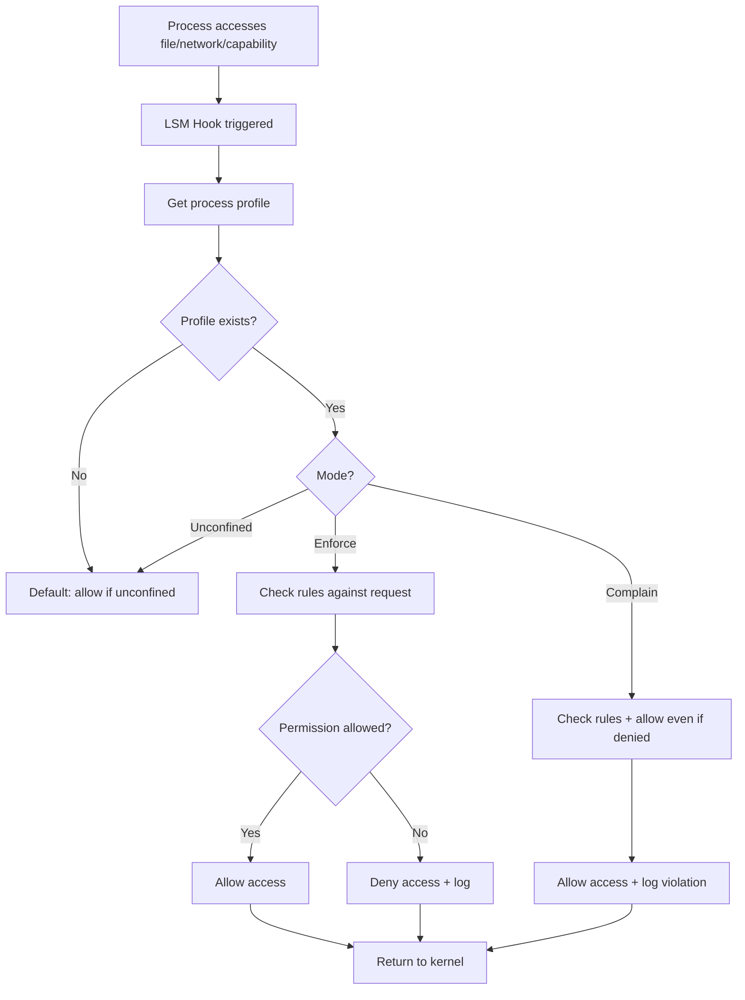
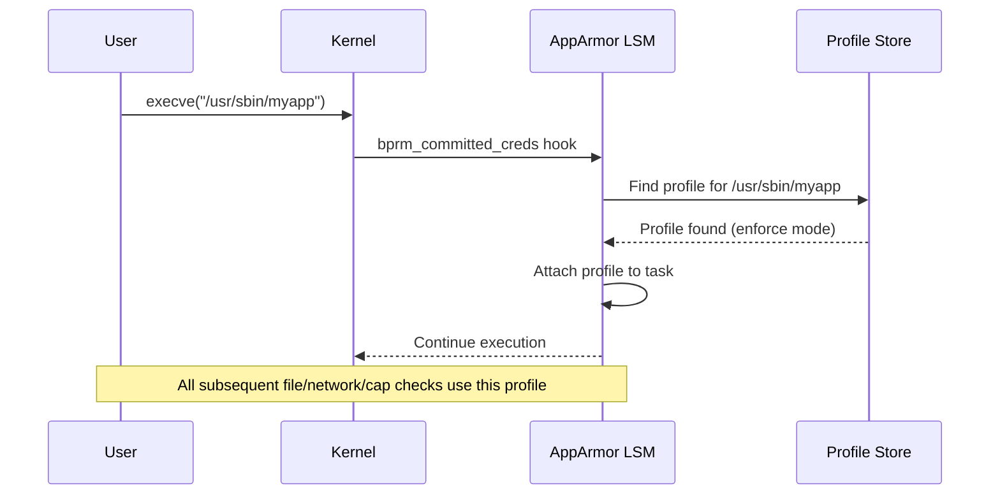
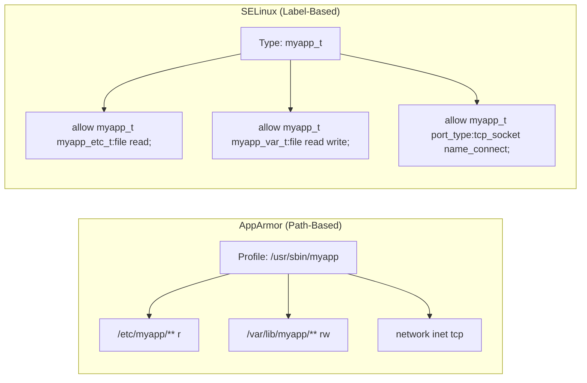

# Chapter 162: AppArmor

## 1. Intuition

AppArmor is Linux's other major Mandatory Access Control system, developed as an alternative to SELinux's complexity. Where SELinux labels every object with a security context and makes decisions based on type enforcement, AppArmor takes a simpler approach: it confines programs based on their **path** rather than their label.

Think of it this way: SELinux is like a building where every room has a security clearance level, and you need the right badge for each room. AppArmor is like a GPS fence—it defines where each person is allowed to walk, and if they try to go outside that path, they're stopped.

AppArmor is the default MAC system on Ubuntu, SUSE, and Debian. It's particularly popular for container security (Docker uses it on Ubuntu) and for confining individual services without needing to label the entire filesystem.

## 2. Architecture

### 2.1 Profile-Based Security

AppArmor uses **profiles** to confine programs. Each profile defines what files, capabilities, and network access a program is allowed:

```
┌─────────────────────────────────────────────────────────────────┐
│                    AppArmor Profile                             │
├─────────────────────────────────────────────────────────────────┤
│                                                                 │
│  Profile: /usr/sbin/myapp                                       │
│                                                                 │
│  File Access:                                                   │
│    /etc/myapp/**        r    ← read config                      │
│    /var/lib/myapp/**    rw   ← read/write data                  │
│    /var/log/myapp.log   w    ← write log                        │
│    /tmp/myapp.*         rw   ← temp files                       │
│                                                                 │
│  Network:                                                       │
│    network inet tcp     ← can use TCP/IPv4                      │
│                                                                 │
│  Capabilities:                                                  │
│    capability net_bind_service  ← bind to ports < 1024          │
│                                                                 │
│  Deny:                                                          │
│    deny /etc/shadow r   ← explicitly deny reading shadow        │
│    deny /home/** w      ← never write to home dirs              │
│                                                                 │
└─────────────────────────────────────────────────────────────────┘
```

### 2.2 Profile Modes

Each profile operates in one of three modes:

| Mode | Behavior | Use |
|------|----------|-----|
| **Enforce** | Blocks violations, logs | Production |
| **Complain** | Allows violations, logs | Testing/development |
| **Unconfined** | No restrictions | Legacy/bypass |

### 2.3 Path-Based vs Label-Based

```
┌─────────────────────────────┬─────────────────────────────┐
│       AppArmor              │        SELinux              │
├─────────────────────────────┼─────────────────────────────┤
│ Path-based access control   │ Label-based access control  │
│ Confinement per program     │ System-wide policy          │
│ Simpler to write profiles   │ More expressive policy      │
│ File paths in profiles      │ Security contexts           │
│ Good for single-service     │ Good for system-wide MAC    │
│ Default on Ubuntu/SUSE      │ Default on RHEL/Fedora      │
└─────────────────────────────┴─────────────────────────────┘
```

### 2.4 AppArmor Kernel Components

```
┌─────────────────────────────────────────────────────────────────┐
│                    AppArmor Architecture                        │
├─────────────────────────────────────────────────────────────────┤
│                                                                 │
│  Userspace:                                                     │
│  ┌──────────────┐  ┌──────────────┐  ┌──────────────┐         │
│  │ apparmor_    │  │ aa-enforce   │  │ aa-logprof   │         │
│  │ parser       │  │ aa-complain  │  │ (profile     │         │
│  │ (loads       │  │ (mode        │  │  generation  │         │
│  │  profiles)   │  │  management) │  │  from logs)  │         │
│  └──────┬───────┘  └──────────────┘  └──────────────┘         │
│         │                                                       │
│         ▼                                                       │
│  Kernel (LSM):                                                  │
│  ┌──────────────────────────────────────────────────────┐      │
│  │  AppArmor LSM Module                                 │      │
│  │  ┌──────────────┐  ┌──────────────┐  ┌───────────┐  │      │
│  │  │ Profile      │  │ Rule         │  │ Hat/       │  │      │
│  │  │ Management   │  │ Matching     │  │ Attachment │  │      │
│  │  │              │  │ (path-based) │  │            │  │      │
│  │  └──────────────┘  └──────────────┘  └───────────┘  │      │
│  └──────────────────────────────────────────────────────┘      │
│                                                                 │
│  /sys/kernel/security/apparmor/                                 │
│  ┌──────────────┐  ┌──────────────┐  ┌──────────────┐         │
│  │ profiles     │  │ interfaces   │  │ revision     │         │
│  └──────────────┘  └──────────────┘  └──────────────┘         │
└─────────────────────────────────────────────────────────────────┘
```

## 3. Kernel Implementation

### 3.1 LSM Hooks

AppArmor registers LSM hooks in `security/apparmor/lsm.c`:

```c
static struct security_hook_list apparmor_hooks[] = {
    LSM_HOOK_INIT(ptrace_access_check, apparmor_ptrace_access_check),
    LSM_HOOK_INIT(capget, apparmor_capget),
    LSM_HOOK_INIT(capable, apparmor_capable),
    LSM_HOOK_INIT(inode_permission, apparmor_inode_permission),
    LSM_HOOK_INIT(file_open, apparmor_file_open),
    LSM_HOOK_INIT(file_receive, apparmor_file_receive),
    LSM_HOOK_INIT(sk_alloc_security, apparmor_sk_alloc_security),
    LSM_HOOK_INIT(socket_create, apparmor_socket_create),
    LSM_HOOK_INIT(socket_connect, apparmor_socket_connect),
    LSM_HOOK_INIT(task_kill, apparmor_task_kill),
    LSM_HOOK_INIT(bprm_committing_creds, apparmor_bprm_committing_creds),
    LSM_HOOK_INIT(bprm_committed_creds, apparmor_bprm_committed_creds),
    /* ... */
};
```

### 3.2 Profile Structure

Profiles are the core data structure in the kernel (`security/apparmor/policy.h`):

```c
struct aa_profile {
    struct aa_policy base;
    struct aa_profile *parent;
    struct aa_namespace *ns;

    /* Attachment specifications */
    char *attach;
    char *xmatch;          /* Extended match regex */
    unsigned int xmatch_len;

    /* Mode */
    enum aa_mode mode;

    /* File rules */
    struct aa_file_rules file;

    /* Network rules */
    struct aa_net_rules net;

    /* Capability rules */
    struct aa_caps caps;

    /* Signal rules */
    struct aa_signal_rules signal;

    /* Rlimit rules */
    struct aa_rlimit_rules rlimits;

    /* ... */
};
```

### 3.3 Path-Based Permission Check

The file permission check uses path-based matching:

```c
/* security/apparmor/file.c */
int aa_path_perm(const struct cred *subj_cred,
                 struct aa_profile *profile,
                 const struct path *path, int flags, u32 request,
                 struct path_cond *cond)
{
    struct aa_perms perms = { };
    const char *name;

    /* Get the path name */
    name = aa_get_path_name(path, &buffer);

    /* Match against profile rules */
    aa_str_perms(profile->file.trans, profile->file.start,
                 name, cond, &perms);

    /* Check if requested permissions are allowed */
    if (request & ~perms.allow) {
        /* Denied */
        return aa_audit_file(profile, name, request, &perms);
    }

    return 0;
}
```

### 3.4 Profile Attachment

Profiles are attached to processes through several mechanisms:

1. **Path-based attachment**: Profile names match executable paths (e.g., `/usr/sbin/myapp`)
2. **Hat attachment**: Sub-profiles (hats) for specific code paths
3. **Namespace attachment**: Profiles in specific AppArmor namespaces

```c
/* security/apparmor/domain.c */
static int apparmor_bprm_committed_creds(struct linux_binprm *bprm)
{
    /* On exec, determine which profile to apply */
    struct aa_profile *profile;
    const char *name = bprm->filename;

    /* Find matching profile */
    profile = aa_get_newest_profile(ns, name);

    if (profile) {
        /* Attach profile to process */
        aa_change_task_domain(current, profile);
    }
    return 0;
}
```

### 3.5 Profile Loading

Profiles are loaded from userspace through `/sys/kernel/security/apparmor/profiles`:

```c
/* security/apparmor/policy.c */
static ssize_t profile_store(struct file *file, const char __user *buf,
                             size_t size, loff_t *ppos)
{
    /* Parse and load profile from userspace */
    /* apparmor_parser compiles .conf files into binary format */
    /* and writes them to this interface */
    return aa_replace_profiles(buf, size);
}
```

## 4. Source Code References

| Component | File | Function |
|-----------|------|----------|
| LSM hooks | `security/apparmor/lsm.c` | `apparmor_hooks[]` |
| Profile structure | `security/apparmor/policy.h` | `struct aa_profile` |
| Path permission check | `security/apparmor/file.c` | `aa_path_perm()` |
| Domain transition | `security/apparmor/domain.c` | `apparmor_bprm_committed_creds()` |
| Profile loading | `security/apparmor/policy.c` | `aa_replace_profiles()` |
| Network access check | `security/apparmor/net.c` | `aa_capable()` |
| Capability check | `security/apparmor/capability.c` | `aa_capable()` |
| Audit/logging | `security/apparmor/audit.c` | `aa_audit_*()` |
| Path resolution | `security/apparmor/match.c` | Path matching functions |

## 5. Configuration Examples

### 5.1 AppArmor Status and Management

```bash
# Check AppArmor status
aa-status
# apparmor module is loaded.
# 42 profiles are loaded.
# 35 profiles are in enforce mode.
# 7 profiles are in complain mode.

# Install AppArmor (if not present)
sudo apt install apparmor apparmor-utils apparmor-profiles

# Enable/disable AppArmor (via kernel parameter)
# GRUB: apparmor=1 security=apparmor   (enable)
# GRUB: apparmor=0                      (disable)
```

### 5.2 Profile Management

```bash
# List all profiles
aa-status

# Set profile to enforce mode
sudo aa-enforce /usr/sbin/myapp

# Set profile to complain mode
sudo aa-complain /usr/sbin/myapp

# Disable a profile entirely
sudo ln -s /etc/apparmor.d/usr.sbin.myapp /etc/apparmor.d/disable/
sudo apparmor_parser -R /etc/apparmor.d/usr.sbin.myapp

# Reload all profiles
sudo systemctl reload apparmor

# Reload specific profile
sudo apparmor_parser -r /etc/apparmor.d/usr.sbin.myapp
```

### 5.3 Writing a Basic Profile

```bash
# /etc/apparmor.d/usr.sbin.myapp
#include <tunables/global>

profile myapp /usr/sbin/myapp flags=(complain) {
  #include <abstractions/base>
  #include <abstractions/nameservice>

  # File access
  /etc/myapp/**          r,
  /etc/myapp/config.ini  r,
  /var/lib/myapp/**      rw,
  /var/log/myapp.log     w,
  /var/run/myapp.pid     rw,
  /tmp/myapp.*           rw,

  # Network access
  network inet tcp,
  network inet udp,

  # Capabilities
  capability net_bind_service,
  capability setuid,
  capability setgid,

  # Signal handling
  signal receive set=(term, kill) peer=unconfined,

  # Deny dangerous access
  deny /etc/shadow      r,
  deny /root/**         rwx,
  deny /home/**/.ssh/** r,

  # Allow executing specific programs
  /usr/bin/kill          Px,
  /usr/bin/killall       Px,
}
```

### 5.4 Profile from Log (aa-logprof)

```bash
# Run the program in complain mode first
sudo aa-complain /usr/sbin/myapp

# Generate some activity
sudo systemctl start myapp
# ... use the application ...

# Generate profile from AppArmor logs
sudo aa-logprof
# Interactive tool that asks about each logged access:
# [1] /etc/myapp/config.ini
#   (A)llow / (D)eny / (G)lob / (I)gnore / (N)ew / (A)udit
#   > A
# [2] /var/lib/myapp/data.db
#   (A)llow / (D)eny / ...
#   > A

# The generated profile is saved to /etc/apparmor.d/
```

### 5.5 Using aa-genprof for New Profiles

```bash
# Start profile generation for a new program
sudo aa-genprof /usr/sbin/myapp

# In another terminal, use the application
# Back in the genprof terminal, it asks about each access

# Switch between scanning log and learning mode
# (S)can system log for AppArmor events
# (F)inish and save profile
```

### 5.6 Abstractions (Shared Rules)

```bash
# Include common abstractions
#include <abstractions/base>          # Basic system access
#include <abstractions/nameservice>   # DNS, NSS
#include <abstractions/apache2-common> # Apache-specific
#include <abstractions/mysql>         # MySQL client access
#include <abstractions/ssl_certs>     # SSL certificate reading

# List available abstractions
ls /etc/apparmor.d/abstractions/
```

### 5.7 Hats (Child Profiles)

```bash
profile myapp /usr/sbin/myapp {
  # Main profile rules
  /etc/myapp/** r,

  # Define a hat for privileged operations
  ^privileged_ops {
    capability sys_admin,
    /dev/sda r,
  }

  # Define a hat for network operations
  ^network_ops {
    network inet tcp,
    network inet udp,
  }
}
```

### 5.8 AppArmor for Containers

```bash
# Docker uses AppArmor on Ubuntu
# Default profile: /etc/apparmor.d/docker-default

# Load the Docker profile
sudo apparmor_parser -r /etc/apparmor.d/docker-default

# Run container with specific profile
docker run --security-opt apparmor=docker-default nginx

# Run without AppArmor (not recommended)
docker run --security-opt apparmor=unconfined nginx

# Custom container profile
# /etc/apparmor.d/containers/my-container
#include <tunables/global>

profile my-container flags=(attach_disconnected,mediate_deleted) {
  #include <abstractions/base>

  # Allow reading from container root
  /** r,

  # Allow writing to specific paths
  /var/log/** w,
  /tmp/** rw,

  # Network
  network inet tcp,
  network inet6 tcp,

  # Deny dangerous operations
  deny /proc/sys/** w,
  deny /sys/** w,
  deny mount,
  deny umount,
  deny pivot_root,
}
```

## 6. Diagrams

### 6.1 AppArmor Access Check Flow



### 6.2 Profile Attachment



### 6.3 Path-Based vs Label-Based Comparison



## 7. Common Pitfalls

### 7.1 AppArmor Not Enabled

```bash
# Check if AppArmor is the active LSM
cat /sys/kernel/security/lsm
# Should include "apparmor"

# If not, check kernel parameters
cat /proc/cmdline | grep apparmor
# apparmor=1 security=apparmor

# Check if the module is loaded
lsmod | grep apparmor
# apparmor               450560  1
```

### 7.2 Profile in Wrong Mode

```bash
# A profile in complain mode doesn't block anything!
aa-status | grep myapp
# /usr/sbin/myapp (complain)

# Switch to enforce:
sudo aa-enforce /usr/sbin/myapp

# Verify:
aa-status | grep myapp
# /usr/sbin/myapp (enforce)
```

### 7.3 Forgetting to Reload After Edit

```bash
# Edit a profile
sudo vim /etc/apparmor.d/usr.sbin.myapp

# MUST reload for changes to take effect:
sudo apparmor_parser -r /etc/apparmor.d/usr.sbin.myapp

# Or reload all:
sudo systemctl reload apparmor
```

### 7.4 Path Globbing Misunderstanding

```bash
# In AppArmor profiles:
/etc/myapp/*      # Matches ONE level: /etc/myapp/config but NOT /etc/myapp/sub/config
/etc/myapp/**     # Matches any depth: /etc/myapp/sub/deep/config
/etc/myapp/*.conf # Matches .conf files at one level only

# Common mistake:
/etc/myapp/* r     # Misses /etc/myapp/subdir/file
# Fix:
/etc/myapp/** r    # Matches everything under /etc/myapp/
```

### 7.5 Missing Exec Mode Transitions

```bash
# Without exec mode, child processes inherit the parent's profile
# This can be too restrictive or too permissive

# In profile:
/usr/bin/helper Px,  # Run in helper's own profile (if it exists)
/usr/bin/helper Cx,  # Run in child profile (defined inline)
/usr/bin/helper Ux,  # Run unconfined (dangerous!)
/usr/bin/helper ix,  # Inherit parent profile (default)

# Px is usually best for system binaries
# ix is usually best for helper scripts
```

### 7.6 AppArmor and Filesystem Path Issues

```bash
# AppArmor uses paths, so bind mounts and symlinks can confuse it

# If files are bind-mounted:
# Profile must match the path the process sees, not the actual location

# If using symlinks:
# /etc/myapp/config → /var/lib/myapp/config
# Profile needs rules for both paths, or use the actual path
```

## 8. Best Practices

### 8.1 Start with Complain Mode

```bash
# Always test new profiles in complain mode first
sudo aa-complain /usr/sbin/myapp

# Use aa-logprof to refine
sudo aa-logprof

# Only switch to enforce after thorough testing
sudo aa-enforce /usr/sbin/myapp
```

### 8.2 Use Abstractions

```bash
# Don't reinvent the wheel
#include <abstractions/base>
#include <abstractions/nameservice>

# Instead of:
# /etc/resolv.conf r,
# /etc/hosts r,
# /etc/nsswitch.conf r,
# Use:
#include <abstractions/nameservice>
```

### 8.3 Deny Dangerous Operations Explicitly

```bash
profile myapp /usr/sbin/myapp {
  # ... allow rules ...

  # Explicitly deny dangerous paths
  deny /etc/shadow     r,
  deny /etc/gshadow    r,
  deny /root/**        rwx,
  deny /home/**/.ssh/** r,

  # Deny dangerous capabilities
  deny capability sys_module,
  deny capability sys_rawio,
}
```

### 8.4 Combine with Other Security

```bash
# AppArmor + systemd sandboxing
# /etc/systemd/system/myapp.service
[Service]
ExecStart=/usr/sbin/myapp
AppArmorProfile=myapp
ProtectSystem=strict
ProtectHome=true
PrivateTmp=true
```

### 8.5 Monitor AppArmor Logs

```bash
# AppArmor logs to the kernel audit subsystem
# View recent denials:
sudo dmesg | grep apparmor="DENIED"
sudo journalctl -k | grep apparmor

# Set up logprof for regular review
sudo aa-logprof
```

### 8.6 Profile for Development

```bash
# /etc/apparmor.d/usr.local.bin.myapp
#include <tunables/global>

profile myapp /usr/local/bin/myapp flags=(complain) {
  #include <abstractions/base>

  # Be permissive in development
  /** rw,
  network,
  capability,

  # Tighten before production!
}
```

## 9. Exercises

### Exercise 1: Basic Profile Writing

1. Write an AppArmor profile for a simple web server
2. Allow it to read configuration from `/etc/myserver/`
3. Allow it to write logs to `/var/log/myserver.log`
4. Allow network access on TCP port 8080
5. Test in complain mode, then enforce

### Exercise 2: Profile from Logs

1. Run a program in complain mode
2. Generate various types of activity
3. Use `aa-logprof` to create a profile
4. Review and refine the generated profile
5. Switch to enforce mode and verify

### Exercise 3: AppArmor for Containers

1. Create a custom AppArmor profile for a Docker container
2. Allow reading from `/etc/` but deny writing
3. Allow writing to `/var/log/` and `/tmp/`
4. Deny mount and network raw operations
5. Test the container with the profile

### Exercise 4: Abstraction Investigation

1. Examine the `base` abstraction in `/etc/apparmor.d/abstractions/`
2. What does it allow?
3. Create a profile that uses multiple abstractions
4. Compare with a profile that specifies all rules manually

### Exercise 5: AppArmor Troubleshooting

Given this log message, create a profile rule to fix the denial:

```
kernel: [12345.678] audit: type=1400 audit(1623456789.012:345):
  apparmor="DENIED" operation="open" profile="/usr/sbin/myapp"
  name="/var/lib/myapp/data.db" pid=1234 comm="myapp"
  requested_mask="r" denied_mask="r" fsuid=1000 ouid=1000
```

### Exercise 6: Hat/Child Profile

1. Create a profile with a hat for privileged operations
2. The main profile runs with minimal permissions
3. The hat allows specific elevated operations
4. Show how the program transitions between the main profile and the hat

## 10. References

1. **AppArmor Wiki**: https://gitlab.com/apparmor/apparmor/-/wikis/home
2. **AppArmor Documentation**: https://apparmor.net/
3. **Ubuntu AppArmor Guide**: https://ubuntu.com/server/docs/security-apparmor
4. **Linux kernel source**: `security/apparmor/` — Full AppArmor implementation
5. **man pages**: `apparmor(7)`, `apparmor_parser(8)`, `aa-enforce(8)`, `aa-complain(8)`, `aa-logprof(8)`, `aa-genprof(8)`, `aa-status(8)`
6. **AppArmor Profile Language**: https://apparmor.net/wiki/DocLanguage3.0
7. **AppArmor abstractions**: `/etc/apparmor.d/abstractions/`
8. **SUSE AppArmor Documentation**: https://documentation.suse.com/sles/15-SP3/html/SLES-all/cha-apparmor.html
9. **Linux Security Modules**: `Documentation/security/lsm.rst` in kernel source
10. **Docker AppArmor**: https://docs.docker.com/engine/security/apparmor/
