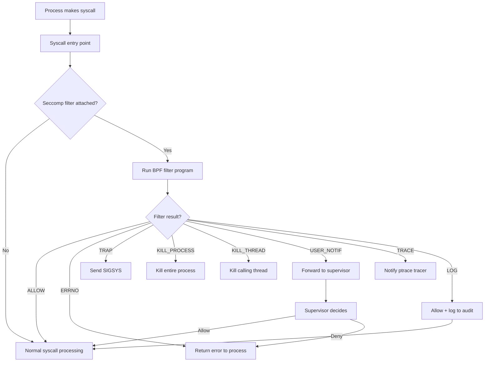
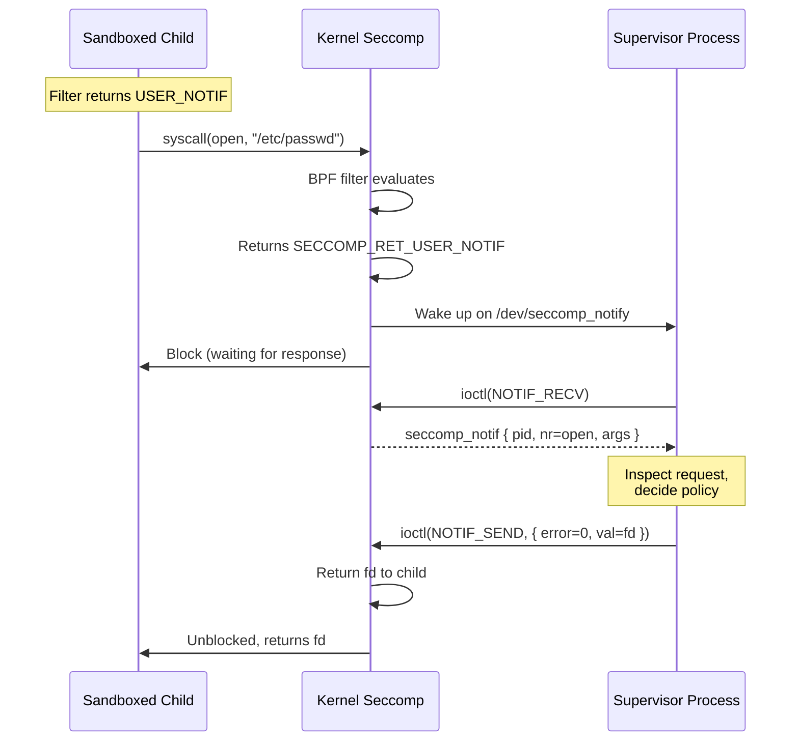

# Chapter 163: Seccomp

## 1. Intuition

Every Linux program communicates with the kernel through **system calls**—open files, send network data, allocate memory, create processes. If an attacker compromises a program, they can use its system call access to attack the rest of the system. Seccomp (Secure Computing Mode) restricts which system calls a program can make, shrinking the kernel's attack surface.

Think of it as a firewall for system calls. Just as a network firewall blocks unwanted traffic, seccomp blocks unwanted syscalls. A web server needs `read()`, `write()`, `open()`, and `socket()`—it doesn't need `mount()`, `reboot()`, or `ptrace()`. By blocking the unnecessary syscalls, even a compromised web server can't mount filesystems or reboot the machine.

Seccomp was originally created to safely run untrusted code (like the Chromium sandbox). The seccomp-bpf extension, added in Linux 3.5, allows flexible filtering using BPF (Berkeley Packet Filter) programs, making it practical for real-world applications.

## 2. Architecture

### 2.1 Seccomp Modes

```
┌─────────────────────────────────────────────────────────────────┐
│                    Seccomp Modes                                │
├─────────────────────────────────────────────────────────────────┤
│                                                                 │
│  ┌───────────────────────────────────────────────────────┐     │
│  │  Mode 1: Strict (SECCOMP_MODE_STRICT)                 │     │
│  │  Only read(), write(), exit(), sigreturn() allowed    │     │
│  │  Everything else → SIGKILL                            │     │
│  │  Added in Linux 2.6.12                                │     │
│  └───────────────────────────────────────────────────────┘     │
│                                                                 │
│  ┌───────────────────────────────────────────────────────┐     │
│  │  Mode 2: Filter (SECCOMP_MODE_FILTER)                 │     │
│  │  BPF programs decide per-syscall                      │     │
│  │  Can allow, deny, log, trace, or kill                 │     │
│  │  Added in Linux 3.5                                   │     │
│  └───────────────────────────────────────────────────────┘     │
│                                                                 │
│  ┌───────────────────────────────────────────────────────┐     │
│  │  Mode 3: User Notification (SECCOMP_MODE_NOTIFY)      │     │
│  │  Syscalls forwarded to userspace supervisor           │     │
│  │  Supervisor can inspect, modify, or reject            │     │
│  │  Added in Linux 5.0                                   │     │
│  └───────────────────────────────────────────────────────┘     │
│                                                                 │
└─────────────────────────────────────────────────────────────────┘
```

### 2.2 Filter Mode Actions

When a BPF filter is attached, each syscall evaluation returns an action:

| Action | Value | Behavior |
|--------|-------|----------|
| `SECCOMP_RET_KILL_PROCESS` | 0x80000000 | Kill the entire process (immediate) |
| `SECCOMP_RET_KILL_THREAD` | 0x00000000 | Kill the calling thread (immediate) |
| `SECCOMP_RET_TRAP` | 0x00030000 | Send `SIGSYS` to the process |
| `SECCOMP_RET_ERRNO` | 0x00050000 | Return errno to caller |
| `SECCOMP_RET_USER_NOTIF` | 0x7FC00000 | Forward to userspace supervisor |
| `SECCOMP_RET_TRACE` | 0x7FF00000 | Notify ptrace tracer |
| `SECCOMP_RET_LOG` | 0x7FFC0000 | Allow but log the syscall |
| `SECCOMP_RET_ALLOW` | 0x7FFF0000 | Allow the syscall |

### 2.3 Seccomp Notify Architecture

```
┌─────────────────────────────────────────────────────────────────┐
│              Seccomp User Notification (seccomp_unotify)        │
├─────────────────────────────────────────────────────────────────┤
│                                                                 │
│  ┌──────────────┐     ┌──────────────┐     ┌──────────────┐   │
│  │  Sandboxed   │     │  Seccomp     │     │  Supervisor  │   │
│  │  Process     │────▶│  Filter      │────▶│  Process     │   │
│  │              │     │  (BPF)       │     │              │   │
│  │  syscall()   │     │              │     │  Reads       │   │
│  │  blocks...   │     │  Returns     │     │  notification│   │
│  │              │     │  USER_NOTIF  │     │  Decides     │   │
│  │  continues   │◀────│              │◀────│  (allow/     │   │
│  │  or gets     │     │  Returns     │     │   deny/      │   │
│  │  error       │     │  result      │     │   proxy)     │   │
│  └──────────────┘     └──────────────┘     └──────────────┘   │
│                                                                 │
│  Communication: /dev/seccomp_notify (via ioctl)                │
│                                                                 │
└─────────────────────────────────────────────────────────────────┘
```

## 3. Kernel Implementation

### 3.1 Seccomp Data Structures

In `include/linux/seccomp.h`:

```c
struct seccomp_filter {
    refcount_t refs;
    refcount_t users;
    bool log;
    struct seccomp_filter *prev;
    struct bpf_prog *prog;
    struct notification *notif;
    struct mutex notify_lock;
    wait_queue_head_t wqh;
};

struct task_struct {
    /* ... */
    struct seccomp seccomp;
    /* ... */
};

struct seccomp {
    int mode;
    struct seccomp_filter *filter;
    /* ... */
};
```

### 3.2 Syscall Interception

The seccomp check happens in the syscall entry path, in `kernel/seccomp.c`:

```c
int __seccomp_filter(int this_syscall, const struct seccomp_data *sd,
                     const bool recheck_after_trace)
{
    int data;
    struct seccomp_data sd_local;

    /* Run the BPF filter */
    data = seccomp_run_filters(sd);

    switch (data & SECCOMP_RET_ACTION_FULL) {
    case SECCOMP_RET_KILL_PROCESS:
        do_exit(SIGSYS);
        break;

    case SECCOMP_RET_TRAP:
        send_sig_info(SIGSYS, SEND_SIG_PRIV, current);
        break;

    case SECCOMP_RET_ERRNO:
        return -((data & SECCOMP_RET_DATA) ?: ENOSYS);

    case SECCOMP_RET_USER_NOTIF:
        return seccomp_do_user_notification(data, sd);

    case SECCOMP_RET_TRACE:
        return seccomp_do_trace(data, sd);

    case SECCOMP_RET_LOG:
        seccomp_log(this_syscall, SIGSYS, SECCOMP_RET_LOG, true);
        return 0;  /* Allow */

    case SECCOMP_RET_ALLOW:
        return 0;  /* Allow */

    default:
        do_exit(SIGSYS);
    }
    return -EPERM;
}
```

### 3.3 BPF Filter Execution

The filter programs are executed by the BPF virtual machine:

```c
/* kernel/seccomp.c */
static int seccomp_run_filters(const struct seccomp_data *sd)
{
    struct seccomp_filter *f = current->seccomp.filter;
    int ret = SECCOMP_RET_KILL_PROCESS;

    /* Run all chained filters (most recently added first) */
    for (; f; f = f->prev) {
        int cur_ret = BPF_PROG_RUN(f->prog, sd);
        /* The most restrictive result wins */
        if (SECCOMP_RET_ACTION(cur_ret) < SECCOMP_RET_ACTION(ret))
            ret = cur_ret;
    }

    return ret;
}
```

### 3.4 User Notification

The notification mechanism in `kernel/seccomp.c`:

```c
static int seccomp_do_user_notification(int this_syscall,
                                        const struct seccomp_data *sd)
{
    struct seccomp_filter *filter = current->seccomp.filter;
    struct seccomp_notif *req;
    struct seccomp_notif_resp *resp;

    /* Create notification request */
    req = kzalloc(sizeof(*req), GFP_KERNEL);
    req->pid = current->pid;
    req->data = *sd;

    /* Add to notification queue */
    list_add(&req->list, &filter->notif->list);
    wake_up_all(&filter->wqh);

    /* Wait for supervisor response */
    wait_event_interruptible(filter->wqh, req->state != SECCOMP_NOTIFY_INIT);

    /* Return the supervisor's decision */
    resp = req->response;
    switch (resp->error ? SECCOMP_RET_ERRNO : SECCOMP_RET_ALLOW) {
    case SECCOMP_RET_ERRNO:
        return -resp->error;
    default:
        return 0;
    }
}
```

### 3.5 Seccomp Sync

The `prctl(PR_SET_NO_NEW_PRIVS, 1)` requirement prevents privilege escalation:

```c
/* kernel/seccomp.c */
static long seccomp_attach_filter(unsigned int flags,
                                  struct seccomp_filter *filter)
{
    /* Require no_new_privs or CAP_SYS_ADMIN */
    if (!task_no_new_privs(current) &&
        !capable(CAP_SYS_ADMIN))
        return -EACCES;

    /* ... attach filter ... */
}
```

## 4. Source Code References

| Component | File | Function |
|-----------|------|----------|
| Seccomp core | `kernel/seccomp.c` | `__seccomp_filter()` |
| Filter execution | `kernel/seccomp.c` | `seccomp_run_filters()` |
| User notification | `kernel/seccomp.c` | `seccomp_do_user_notification()` |
| Filter attachment | `kernel/seccomp.c` | `seccomp_attach_filter()` |
| Syscall entry | `arch/x86/entry/common.c` | `do_syscall_64()` → seccomp check |
| Data structures | `include/linux/seccomp.h` | `struct seccomp_filter` |
| UAPI headers | `include/uapi/linux/seccomp.h` | `SECCOMP_RET_*` constants |
| BPF core | `kernel/bpf/core.c` | `BPF_PROG_RUN()` |

## 5. Configuration Examples

### 5.1 Strict Mode (Simplest)

```c
#include <linux/seccomp.h>
#include <sys/prctl.h>

int main(void) {
    /* Enable strict seccomp mode */
    prctl(PR_SET_SECCOMP, SECCOMP_MODE_STRICT);

    /* Only read(), write(), exit(), sigreturn() are allowed */
    write(1, "Hello\n", 6);  /* Works */
    open("/etc/passwd", 0);   /* SIGKILL! */

    return 0;
}
```

### 5.2 BPF Filter with libseccomp

```c
#include <seccomp.h>
#include <stdio.h>
#include <unistd.h>
#include <fcntl.h>

int main(void) {
    scmp_filter_ctx ctx;

    /* Create a filter context, default action is KILL */
    ctx = seccomp_init(SCMP_ACT_KILL_PROCESS);

    /* Allow basic I/O */
    seccomp_rule_add(ctx, SCMP_ACT_ALLOW, SCMP_SYS(read), 0);
    seccomp_rule_add(ctx, SCMP_ACT_ALLOW, SCMP_SYS(write), 0);
    seccomp_rule_add(ctx, SCMP_ACT_ALLOW, SCMP_SYS(exit), 0);
    seccomp_rule_add(ctx, SCMP_ACT_ALLOW, SCMP_SYS(exit_group), 0);
    seccomp_rule_add(ctx, SCMP_ACT_ALLOW, SCMP_SYS(brk), 0);
    seccomp_rule_add(ctx, SCMP_ACT_ALLOW, SCMP_SYS(mmap), 0);
    seccomp_rule_add(ctx, SCMP_ACT_ALLOW, SCMP_SYS(munmap), 0);
    seccomp_rule_add(ctx, SCMP_ACT_ALLOW, SCMP_SYS(mprotect), 0);
    seccomp_rule_add(ctx, SCMP_ACT_ALLOW, SCMP_SYS(rt_sigaction), 0);
    seccomp_rule_add(ctx, SCMP_ACT_ALLOW, SCMP_SYS(rt_sigprocmask), 0);
    seccomp_rule_add(ctx, SCMP_ACT_ALLOW, SCMP_SYS(close), 0);
    seccomp_rule_add(ctx, SCMP_ACT_ALLOW, SCMP_SYS(access), 0);
    seccomp_rule_add(ctx, SCMP_ACT_ALLOW, SCMP_SYS(stat), 0);
    seccomp_rule_add(ctx, SCMP_ACT_ALLOW, SCMP_SYS(fstat), 0);

    /* Allow open only for reading */
    seccomp_rule_add(ctx, SCMP_ACT_ALLOW, SCMP_SYS(open), 1,
                     SCMP_CMP(1, SCMP_CMP_MASKED_EQ, O_WRONLY | O_RDWR, 0));

    /* Allow socket only for specific families */
    seccomp_rule_add(ctx, SCMP_ACT_ALLOW, SCMP_SYS(socket), 1,
                     SCMP_CMP(0, SCMP_CMP_EQ, AF_INET));

    /* Deny with error instead of kill for some syscalls */
    seccomp_rule_add(ctx, SCMP_RET_ERRNO(EPERM), SCMP_SYS(mount), 0);
    seccomp_rule_add(ctx, SCMP_RET_ERRNO(EPERM), SCMP_SYS(reboot), 0);

    /* Load the filter */
    seccomp_load(ctx);

    /* Release the context (filter is now in kernel) */
    seccomp_release(ctx);

    /* From here, only allowed syscalls work */
    printf("Hello, sandboxed world!\n");

    /* This will be killed (SIGSYS) */
    /* mount("/dev/sda", "/mnt", "ext4", 0, NULL); */

    return 0;
}
```

Compile:
```bash
gcc -o sandbox sandbox.c -lseccomp
```

### 5.3 BPF Filter (Raw)

```c
#include <linux/seccomp.h>
#include <linux/filter.h>
#include <linux/audit.h>
#include <sys/prctl.h>
#include <stddef.h>

/* BPF filter program */
struct sock_filter filter[] = {
    /* Load syscall number */
    BPF_STMT(BPF_LD | BPF_W | BPF_ABS,
             offsetof(struct seccomp_data, nr)),

    /* Allow read (0) */
    BPF_JUMP(BPF_JMP | BPF_JEQ | BPF_K, __NR_read, 0, 1),
    BPF_STMT(BPF_RET | BPF_K, SECCOMP_RET_ALLOW),

    /* Allow write (1) */
    BPF_JUMP(BPF_JMP | BPF_JEQ | BPF_K, __NR_write, 0, 1),
    BPF_STMT(BPF_RET | BPF_K, SECCOMP_RET_ALLOW),

    /* Allow exit (60) */
    BPF_JUMP(BPF_JMP | BPF_JEQ | BPF_K, __NR_exit, 0, 1),
    BPF_STMT(BPF_RET | BPF_K, SECCOMP_RET_ALLOW),

    /* Allow exit_group (231) */
    BPF_JUMP(BPF_JMP | BPF_JEQ | BPF_K, __NR_exit_group, 0, 1),
    BPF_STMT(BPF_RET | BPF_K, SECCOMP_RET_ALLOW),

    /* Kill everything else */
    BPF_STMT(BPF_RET | BPF_K, SECCOMP_RET_KILL_PROCESS),
};

struct sock_fprog prog = {
    .len = sizeof(filter) / sizeof(filter[0]),
    .filter = filter,
};

int main(void) {
    prctl(PR_SET_NO_NEW_PRIVS, 1, 0, 0, 0);
    prctl(PR_SET_SECCOMP, SECCOMP_MODE_FILTER, &prog);

    /* Only read/write/exit work now */
    const char msg[] = "Sandboxed!\n";
    write(1, msg, sizeof(msg) - 1);

    return 0;
}
```

### 5.4 Seccomp Notify (Supervisor)

```c
#include <linux/seccomp.h>
#include <sys/ioctl.h>
#include <sys/prctl.h>
#include <fcntl.h>
#include <stdio.h>
#include <stdlib.h>
#include <unistd.h>
#include <wait.h>

int main(void) {
    int notify_fd;

    /* Create seccomp notify fd */
    notify_fd = seccomp(SECCOMP_GET_NOTIF_SIZES, 0, NULL);

    /* Set up filter that returns USER_NOTIF for certain syscalls */
    /* ... (use libseccomp with SCMP_ACT_USER_NOTIF) ... */

    /* Fork sandboxed child */
    pid_t child = fork();
    if (child == 0) {
        /* Child: apply filter and exec */
        prctl(PR_SET_NO_NEW_PRIVS, 1, 0, 0, 0);
        /* ... apply filter ... */
        execvp(argv[1], argv + 1);
    }

    /* Parent: supervisor loop */
    while (1) {
        struct seccomp_notif *req = NULL;
        struct seccomp_notif_resp resp = {};

        /* Wait for notification */
        ioctl(notify_fd, SECCOMP_IOCTL_NOTIF_RECV, &req);

        printf("Syscall %d from pid %d\n", req->data.nr, req->pid);

        /* Decide: allow or deny */
        if (req->data.nr == __NR_open) {
            /* Inspect arguments and decide */
            resp.id = req->id;
            resp.error = 0;  /* Allow */
            resp.val = 0;
        } else {
            resp.id = req->id;
            resp.error = -EPERM;  /* Deny */
        }

        ioctl(notify_fd, SECCOMP_IOCTL_NOTIF_SEND, &resp);
        ioctl(notify_fd, SECCOMP_IOCTL_NOTIF_ID_VALID, &req->id);
    }

    return 0;
}
```

### 5.5 Seccomp in systemd Services

```ini
# /etc/systemd/system/sandboxed.service
[Unit]
Description=Sandboxed Service

[Service]
ExecStart=/usr/bin/myapp
# Restrict syscalls to a predefined set
SystemCallFilter=@system-service
# Deny specific syscalls
SystemCallFilter=~mount umount pivot_root
SystemCallArchitectures=native
# Kill process on syscall violation
SystemCallErrorNumber=EPERM
```

### 5.6 Docker/Container Seccomp

```json
{
  "defaultAction": "SCMP_ACT_ERRNO",
  "defaultErrnoRet": 1,
  "architectures": ["SCMP_ARCH_X86_64"],
  "syscalls": [
    {
      "names": ["read", "write", "open", "close", "stat", "fstat",
                "mmap", "mprotect", "munmap", "brk",
                "exit", "exit_group", "futex"],
      "action": "SCMP_ACT_ALLOW"
    }
  ]
}
```

```bash
# Use custom seccomp profile with Docker
docker run --security-opt seccomp=profile.json nginx

# Disable seccomp (not recommended)
docker run --security-opt seccomp=unconfined nginx
```

### 5.7 strace-style Seccomp Filtering

```c
/* Return EPERM for mount() instead of killing */
seccomp_rule_add(ctx, SCMP_ACT_ERRNO(EPERM), SCMP_SYS(mount), 0);

/* Log but allow certain syscalls */
seccomp_rule_add(ctx, SCMP_ACT_LOG, SCMP_SYS(open), 0);

/* Allow open but deny specific flags */
seccomp_rule_add(ctx, SCMP_ACT_ALLOW, SCMP_SYS(open), 1,
    SCMP_CMP(1, SCMP_CMP_MASKED_EQ, O_CREAT, 0));  /* Deny O_CREAT */
```

## 6. Diagrams

### 6.1 Seccomp Filter Evaluation



### 6.2 Seccomp Notify Flow



### 6.3 Seccomp Architecture Layers

```mermaid
graph TB
    subgraph "Userspace"
        App[Application]
        lib[libseccomp]
        BPF[BPF Program]
        Supervisor[Notification Supervisor]
    end

    subgraph "Kernel"
        Entry[Syscall Entry]
        Seccomp[Seccomp Filter]
        AVC[AVC/LSM Hooks]
        Syscall[Syscall Handler]
    end

    App -->|prctl / seccomp()| Entry
    lib -->|Generate BPF| BPF
    BPF -->|Load filter| Entry
    Entry --> Seccomp
    Seccomp -->|ALLOW| Syscall
    Seccomp -->|KILL/TRAP/ERRNO| App
    Seccomp -->|USER_NOTIF| Supervisor
    Supervisor -->|Response| Seccomp
    Seccomp -->|TRACE| App
    Syscall --> AVC
```

## 7. Common Pitfalls

### 7.1 Missing no_new_privs

```c
/* FAILS without no_new_privs (unless you have CAP_SYS_ADMIN) */
prctl(PR_SET_SECCOMP, SECCOMP_MODE_FILTER, &prog);
/* EACCES! */

/* Fix: set no_new_privs first */
prctl(PR_SET_NO_NEW_PRIVS, 1, 0, 0, 0);
prctl(PR_SET_SECCOMP, SECCOMP_MODE_FILTER, &prog);
/* Works */
```

### 7.2 Architecture Mismatch

```c
/* On x86_64, x32 syscalls have bit 30 set */
/* Must handle both native and compat syscalls */

/* libseccomp handles this automatically: */
seccomp_attr_set(ctx, SCMP_FLTATR_CTL_TSYNC, 1);
```

### 7.3 Forgetting Essential Syscalls

A common mistake is forgetting syscalls needed for basic operation:

```c
/* Without mmap/munmap/mprotect, dynamic linking fails */
/* Without brk, malloc fails */
/* Without rt_sigaction, signal handling fails */

/* Use libseccomp's @system-service group: */
seccomp_attr_set(ctx, SCMP_FLTATR_ACT_BADARCH, SCMP_ACT_ALLOW);
```

### 7.4 Syscall Number Differences

```c
/* Syscall numbers differ between architectures! */
/* __NR_open is 2 on x86_64 but 5 on ARM */

/* Use libseccomp which handles this: */
seccomp_rule_add(ctx, SCMP_ACT_ALLOW, SCMP_SYS(open), 0);
/* NOT: seccomp_rule_add(ctx, SCMP_ACT_ALLOW, 2, 0); */
```

### 7.5 Denying Exit

```c
/* NEVER deny exit/exit_group */
/* The process will hang forever */

/* Always allow: */
seccomp_rule_add(ctx, SCMP_ACT_ALLOW, SCMP_SYS(exit), 0);
seccomp_rule_add(ctx, SCMP_ACT_ALLOW, SCMP_SYS(exit_group), 0);
```

### 7.6 Seccomp and Threads

```c
/* Filters are per-thread by default */
/* Use PR_SET_SECCOMP to affect current thread only */

/* To sync across all threads: */
seccomp_attr_set(ctx, SCMP_FLTATR_CTL_TSYNC, 1);
/* This tries to sync the filter to all threads in the process */
```

### 7.7 User Notification Race Conditions

```c
/* Between notification recv and send, the target process may exit */
/* The notification ID becomes invalid */

/* Always check validity before sending response: */
ioctl(notify_fd, SECCOMP_IOCTL_NOTIF_ID_VALID, &req->id);
/* If this returns -1, the process exited */
```

## 8. Best Practices

### 8.1 Use libseccomp Instead of Raw BPF

```c
/* Raw BPF is error-prone */
/* libseccomp provides a clean API */

#include <seccomp.h>

scmp_filter_ctx ctx = seccomp_init(SCMP_ACT_KILL_PROCESS);
/* Add rules */
seccomp_rule_add(ctx, SCMP_ACT_ALLOW, SCMP_SYS(read), 0);
seccomp_load(ctx);
seccomp_release(ctx);
```

### 8.2 Default-Deny with Specific Allows

```c
/* Best: deny everything, allow only what's needed */
scmp_filter_ctx ctx = seccomp_init(SCMP_ACT_KILL_PROCESS);

/* Explicitly allow each syscall */
seccomp_rule_add(ctx, SCMP_ACT_ALLOW, SCMP_SYS(read), 0);
seccomp_rule_add(ctx, SCMP_ACT_ALLOW, SCMP_SYS(write), 0);
/* ... */
```

### 8.3 Use Retainable Filters for Testing

```c
/* Use SECCOMP_RET_LOG for testing */
seccomp_rule_add(ctx, SCMP_ACT_LOG, SCMP_SYS(open), 0);
/* Syscall is allowed but logged to audit */

/* Check audit log for what's being called */
/* Then refine the filter */
```

### 8.4 Combine with Other Security

```bash
# Docker example: seccomp + AppArmor + capabilities
docker run \
    --security-opt seccomp=custom.json \
    --security-opt apparmor=docker-default \
    --cap-drop=ALL \
    --cap-add=NET_BIND_SERVICE \
    nginx
```

### 8.5 Systemd SystemCallFilter

```ini
# Systemd makes seccomp easy
[Service]
# Allow common service syscalls
SystemCallFilter=@system-service
# Deny dangerous ones
SystemCallFilter=~@mount @reboot @swap @debug
# Architecture restriction
SystemCallArchitectures=native
# Error number for denied syscalls
SystemCallErrorNumber=EPERM
```

### 8.6 Profile Docker Containers

```json
{
  "defaultAction": "SCMP_ACT_ERRNO",
  "defaultErrnoRet": 1,
  "syscalls": [
    {
      "names": [
        "read", "write", "open", "close", "stat", "fstat", "lstat",
        "poll", "lseek", "mmap", "mprotect", "munmap", "brk",
        "rt_sigaction", "rt_sigprocmask", "ioctl", "access",
        "pipe", "select", "sched_yield", "mremap", "msync",
        "mincore", "madvise", "dup", "dup2", "nanosleep",
        "getpid", "clone", "fork", "execve", "exit", "exit_group",
        "wait4", "kill", "uname", "fcntl", "flock", "fsync",
        "fdatasync", "ftruncate", "getdents", "getcwd",
        "chdir", "rename", "mkdir", "rmdir", "link", "unlink",
        "readlink", "chmod", "chown", "umask", "gettimeofday",
        "getuid", "getgid", "geteuid", "getegid", "getppid",
        "getpgrp", "set_tid_address", "futex", "epoll_create",
        "epoll_wait", "epoll_ctl", "clock_gettime", "openat"
      ],
      "action": "SCMP_ACT_ALLOW"
    }
  ]
}
```

## 9. Exercises

### Exercise 1: Strict Mode

1. Write a C program that enters strict seccomp mode
2. Try various syscalls and observe what happens
3. Explain why only 4 syscalls are allowed

### Exercise 2: libseccomp Filter

1. Create a filter that allows only file I/O (no network)
2. Test with a program that tries to create a socket
3. Verify that file operations still work
4. Observe the SIGSYS signal

### Exercise 3: Syscall Argument Filtering

1. Use libseccomp to allow `open()` only for reading (not writing)
2. Test with `open("/tmp/test", O_RDONLY)` — should work
3. Test with `open("/tmp/test", O_WRONLY)` — should be killed
4. Explain how `SCMP_CMP` works

### Exercise 4: User Notification

1. Write a supervisor process that uses seccomp notify
2. Intercept all `open()` calls
3. Log each call with the filename
4. Allow or deny based on the filename

### Exercise 5: Systemd Seccomp

1. Create a systemd service with `SystemCallFilter=@system-service`
2. Try to call `mount()` from the service
3. Observe the denial
4. Add `SystemCallFilter=~@mount` and verify it's denied even for root

### Exercise 6: Container Seccomp Profile

1. Create a custom seccomp profile for a Docker container
2. Allow only necessary syscalls
3. Test the container
4. Compare with Docker's default profile

## 10. References

1. **Linux man pages**: `seccomp(2)`, `seccomp_unotify(2)`, `seccomp_rule_add(3)`, `prctl(2)`
2. **Linux kernel source**: `kernel/seccomp.c` — Core seccomp implementation
3. **Linux kernel source**: `include/linux/seccomp.h` — Internal data structures
4. **Linux kernel source**: `include/uapi/linux/seccomp.h` — UAPI constants
5. **libseccomp**: https://github.com/seccomp/libseccomp
6. **seccomp-tools**: https://github.com/david942j/seccomp-tools
7. **Docker seccomp**: https://docs.docker.com/engine/security/seccomp/
8. **Chromium seccomp sandbox**: https://chromium.googlesource.com/chromium/src/+/HEAD/docs/linux/sandboxing.md
9. **The Linux Programming Interface** by Michael Kerrisk — Chapter 34: Process Credentials
10. **LWN.net**: "A seccomp overview" — https://lwn.net/Articles/656307/
11. **systemd.exec(5)**: `SystemCallFilter=` documentation
