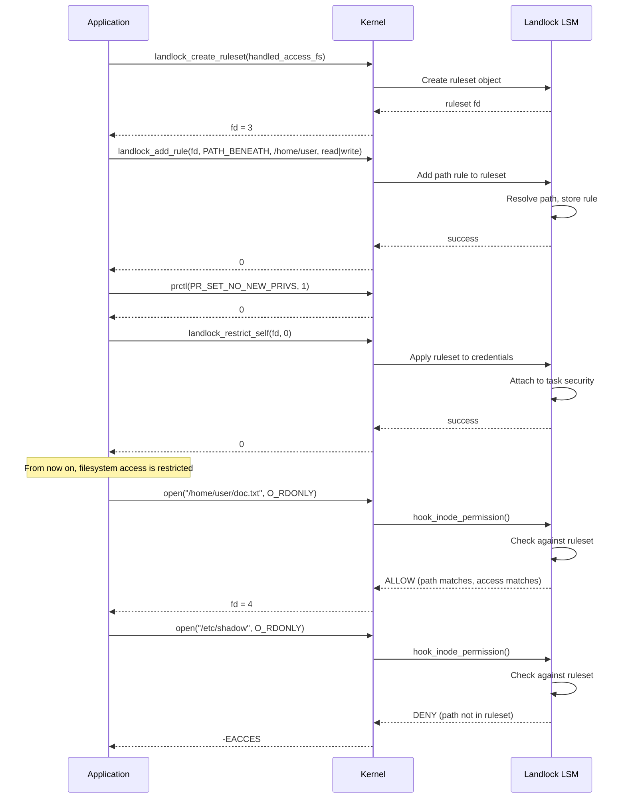
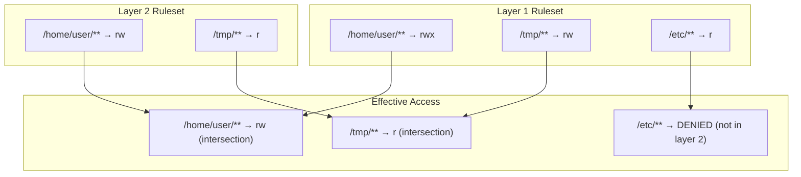
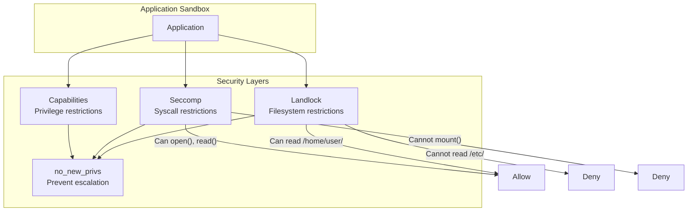

# Chapter 164: Landlock LSM

## 1. Intuition

Imagine you have a document editor that needs to read files from `~/Documents/` and write to `~/Downloads/`, but shouldn't access `~/Pictures/`, `/etc/`, or the network. Traditional security mechanisms can partially achieve this—seccomp restricts syscalls, AppArmor confines by path, SELinux by label—but each has limitations for unprivileged users.

Landlock is a Linux security module designed specifically for **unprivileged sandboxing**. Unlike SELinux or AppArmor (which require root to configure), Landlock lets any user restrict their own process's access to the filesystem. Think of it as a voluntary prison: the process builds its own walls and locks itself in.

Landlock was merged in Linux 5.13 and focuses on filesystem access restrictions. It's complementary to seccomp (which restricts syscalls) and capabilities (which restricts privileges). Together, they form a layered sandboxing approach.

## 2. Architecture

### 2.1 Layered Sandboxing

```
┌─────────────────────────────────────────────────────────────────┐
│                    Landlock Architecture                        │
├─────────────────────────────────────────────────────────────────┤
│                                                                 │
│  Userspace:                                                     │
│  ┌──────────────────────────────────────────────────────┐      │
│  │  Application                                          │      │
│  │  1. landlock_create_ruleset() → fd                   │      │
│  │  2. landlock_add_rule(fd, path, permissions)          │      │
│  │  3. landlock_add_rule(fd, path, permissions)          │      │
│  │  4. prctl(PR_SET_NO_NEW_PRIVS, 1)                    │      │
│  │  5. landlock_restrict_self(fd, 0)                     │      │
│  └──────────────────────────┬───────────────────────────┘      │
│                              │                                  │
│                              ▼                                  │
│  Kernel:                                                        │
│  ┌──────────────────────────────────────────────────────┐      │
│  │  Landlock LSM                                         │      │
│  │  ┌──────────────┐  ┌──────────────┐  ┌───────────┐  │      │
│  │  │  Ruleset     │  │  Rules       │  │  Access    │  │      │
│  │  │  Management  │  │  (filesystem │  │  Check     │  │      │
│  │  │              │  │   paths +    │  │  (inode_   │  │      │
│  │  │              │  │   access     │  │   perm)    │  │      │
│  │  │              │  │   rights)    │  │            │  │      │
│  │  └──────────────┘  └──────────────┘  └───────────┘  │      │
│  └──────────────────────────────────────────────────────┘      │
│                                                                 │
│  Key Properties:                                                │
│  • Unprivileged: any user can restrict themselves               │
│  • Stackable: multiple rulesets can layer                        │
│  • Irreversible: restrictions cannot be removed once applied     │
│  • Filesystem-only: no network/capability restrictions           │
│                                                                 │
└─────────────────────────────────────────────────────────────────┘
```

### 2.2 Ruleset Concept

A ruleset is a collection of rules that define allowed access. Rulesets are layered—each new ruleset further restricts access (intersection model):

```
┌─────────────────────────────────────────────────────────────────┐
│                    Ruleset Stacking                             │
├─────────────────────────────────────────────────────────────────┤
│                                                                 │
│  Layer 1 (first applied):                                       │
│  /home/user/   → read, write, execute                           │
│  /tmp/         → read, write                                    │
│  /etc/         → read                                           │
│                                                                 │
│  Layer 2 (second applied):                                      │
│  /home/user/   → read, write                                    │
│  /tmp/         → write                                          │
│                                                                 │
│  Effective access (intersection):                               │
│  /home/user/   → read, write                                    │
│  /tmp/         → write                                          │
│  /etc/         → DENIED (not in layer 2)                        │
│                                                                 │
│  Each layer can only RESTRICT, never EXPAND access.             │
│                                                                 │
└─────────────────────────────────────────────────────────────────┘
```

### 2.3 Access Rights

Landlock defines filesystem access rights:

| Right | Value | Description |
|-------|-------|-------------|
| `LANDLOCK_ACCESS_FS_EXECUTE` | 1<<0 | Execute files |
| `LANDLOCK_ACCESS_FS_WRITE_FILE` | 1<<1 | Write to files |
| `LANDLOCK_ACCESS_FS_READ_FILE` | 1<<2 | Read files |
| `LANDLOCK_ACCESS_FS_READ_DIR` | 1<<3 | List directory contents |
| `LANDLOCK_ACCESS_FS_REMOVE_DIR` | 1<<4 | Remove directories |
| `LANDLOCK_ACCESS_FS_REMOVE_FILE` | 1<<5 | Remove files |
| `LANDLOCK_ACCESS_FS_MAKE_CHAR` | 1<<6 | Create char devices |
| `LANDLOCK_ACCESS_FS_MAKE_DIR` | 1<<7 | Create directories |
| `LANDLOCK_ACCESS_FS_MAKE_REG` | 1<<8 | Create regular files |
| `LANDLOCK_ACCESS_FS_MAKE_SOCK` | 1<<9 | Create sockets |
| `LANDLOCK_ACCESS_FS_MAKE_FIFO` | 1<<10 | Create FIFOs |
| `LANDLOCK_ACCESS_FS_MAKE_BLOCK` | 1<<11 | Create block devices |
| `LANDLOCK_ACCESS_FS_MAKE_SYM` | 1<<12 | Create symlinks |
| `LANDLOCK_ACCESS_FS_REFER` | 1<<13 | Link/rename across directories |
| `LANDLOCK_ACCESS_FS_TRUNCATE` | 1<<14 | Truncate files |

## 3. Kernel Implementation

### 3.1 Data Structures

In `security/landlock/`:

```c
/* security/landlock/ruleset.h */
struct landlock_ruleset {
    refcount_t usage;
    u32 num_layers;
    enum landlock_ruleset_status status;
    struct landlock_access_mask fs_access_masks[LANDLOCK_MAX_NUM_LAYERS];
    struct rb_root root;
    struct landlock_layer *layers;
};

struct landlock_rule {
    struct rb_node node;
    struct landlock_object *object;
    u32 num_layers;
    struct landlock_layer layers[];
};

struct landlock_layer {
    u64 access;      /* Allowed access rights */
    u16 level;       /* Layer level */
    u16 hier;        /* Hierarchy level */
};
```

### 3.2 Syscall Implementations

Landlock provides three syscalls (defined in `security/landlock/syscalls.c`):

```c
/* Create a new ruleset */
SYSCALL_DEFINE3(landlock_create_ruleset,
                const struct landlock_ruleset_attr __user *, attr,
                size_t, size, __u32, flags)
{
    struct landlock_ruleset *ruleset;

    /* Validate parameters */
    if (flags)
        return -EINVAL;

    /* Copy attributes from userspace */
    if (copy_from_user(&ruleset_attr, attr, sizeof(ruleset_attr)))
        return -EFAULT;

    /* Create ruleset */
    ruleset = landlock_create_ruleset(ruleset_attr.handled_access_fs);

    /* Return fd to the ruleset */
    return anon_inode_getfd("landlock-ruleset", &ruleset_fops,
                            ruleset, O_RDONLY | O_CLOEXEC);
}

/* Add a rule to a ruleset */
SYSCALL_DEFINE4(landlock_add_rule,
                int, ruleset_fd, enum landlock_rule_type, rule_type,
                const void __user *, rule_attr, __u32, flags)
{
    struct landlock_ruleset *ruleset;
    struct landlock_path_beneath_attr path_beneath_attr;
    struct path path;

    /* Get the ruleset from fd */
    ruleset = get_ruleset_from_fd(ruleset_fd);

    /* Copy rule attributes */
    if (copy_from_user(&path_beneath_attr, rule_attr,
                       sizeof(path_beneath_attr)))
        return -EFAULT;

    /* Get the path */
    user_path_at(AT_FDCWD, path_beneath_attr.parent_fd, &path);

    /* Add the rule to the ruleset */
    return landlock_add_rule(ruleset, &path,
                             path_beneath_attr.allowed_access);
}

/* Apply ruleset to current process */
SYSCALL_DEFINE2(landlock_restrict_self,
                int, ruleset_fd, __u32, flags)
{
    struct landlock_ruleset *ruleset;
    struct cred *new_cred;

    /* Get the ruleset */
    ruleset = get_ruleset_from_fd(ruleset_fd);

    /* Must have no_new_privs set */
    if (!task_no_new_privs(current))
        return -EPERM;

    /* Apply to current process credentials */
    new_cred = prepare_creds();
    landlock_add_cred(new_cred, ruleset);
    return commit_creds(new_cred);
}
```

### 3.3 Access Check

The permission check hooks into `inode_permission()`:

```c
/* security/landlock/fs.c */
static int hook_inode_permission(struct inode *inode, int mask)
{
    const struct landlock_cred_security *cred_sec;
    struct landlock_ruleset *dom;
    u64 access;

    /* Get the process's Landlock domain */
    cred_sec = current_cred()->security;
    if (!cred_sec || !cred_sec->domain)
        return 0;  /* No restrictions */

    dom = cred_sec->domain;

    /* Map mask to Landlock access rights */
    access = 0;
    if (mask & MAY_READ)
        access |= LANDLOCK_ACCESS_FS_READ_FILE |
                  LANDLOCK_ACCESS_FS_READ_DIR;
    if (mask & MAY_WRITE)
        access |= LANDLOCK_ACCESS_FS_WRITE_FILE |
                  LANDLOCK_ACCESS_FS_TRUNCATE;
    if (mask & MAY_EXEC)
        access |= LANDLOCK_ACCESS_FS_EXECUTE;

    /* Check against domain rules */
    return landlock_check_access_path(dom, inode, access);
}
```

### 3.4 Path-Based Rule Matching

Landlock uses `struct path` and inode-based matching:

```c
/* security/landlock/fs.c */
static int landlock_check_access_path(
    const struct landlock_ruleset *dom,
    const struct inode *inode,
    u64 access_request)
{
    const struct landlock_rule *rule;
    u64 layer_access;
    u32 i;

    /* Walk the inode hierarchy (parent directories) */
    /* For each layer in the domain, check if access is allowed */
    for (i = 0; i < dom->num_layers; i++) {
        rule = find_rule(dom, inode, i);
        if (!rule)
            return -EACCES;  /* No rule = denied */

        layer_access = rule->layers[i].access;
        if ((access_request & layer_access) != access_request)
            return -EACCES;  /* Missing access right */
    }

    return 0;  /* All layers allow */
}
```

### 3.5 Object Lifecycle

Landlock tracks objects (inodes) and handles filesystem changes:

```c
/* security/landlock/object.c */
struct landlock_object {
    refcount_t usage;
    spinlock_t lock;
    struct inode *inode;
    struct hlist_node list_node;
};
```

When a file is deleted or moved, the associated rule becomes invalid, and Landlock handles this gracefully.

## 4. Source Code References

| Component | File | Function |
|-----------|------|----------|
| Syscalls | `security/landlock/syscalls.c` | `landlock_create_ruleset()`, `landlock_add_rule()`, `landlock_restrict_self()` |
| Filesystem checks | `security/landlock/fs.c` | `hook_inode_permission()`, `landlock_check_access_path()` |
| Ruleset management | `security/landlock/ruleset.c` | `landlock_create_ruleset()` |
| Object tracking | `security/landlock/object.c` | Object lifecycle |
| Credential handling | `security/landlock/cred.c` | Credential integration |
| UAPI headers | `include/uapi/linux/landlock.h` | Access rights, syscall structs |
| LSM hooks | `security/landlock/lsm.c` | `landlock_hooks[]` |

## 5. Configuration Examples

### 5.1 Basic Landlock Program

```c
#include <linux/landlock.h>
#include <sys/prctl.h>
#include <sys/syscall.h>
#include <fcntl.h>
#include <stdio.h>
#include <unistd.h>

/* Syscall wrappers (if not in libc) */
static inline int landlock_create_ruleset(
    const struct landlock_ruleset_attr *attr, size_t size, __u32 flags)
{
    return syscall(__NR_landlock_create_ruleset, attr, size, flags);
}

static inline int landlock_add_rule(
    int ruleset_fd, enum landlock_rule_type type,
    const void *attr, __u32 flags)
{
    return syscall(__NR_landlock_add_rule, ruleset_fd, type, attr, flags);
}

static inline int landlock_restrict_self(int ruleset_fd, __u32 flags)
{
    return syscall(__NR_landlock_restrict_self, ruleset_fd, flags);
}

int main(void) {
    int ruleset_fd;
    struct landlock_ruleset_attr ruleset_attr = {
        .handled_access_fs = LANDLOCK_ACCESS_FS_READ_FILE |
                            LANDLOCK_ACCESS_FS_READ_DIR |
                            LANDLOCK_ACCESS_FS_WRITE_FILE |
                            LANDLOCK_ACCESS_FS_EXECUTE |
                            LANDLOCK_ACCESS_FS_MAKE_REG |
                            LANDLOCK_ACCESS_FS_MAKE_DIR,
    };

    /* Create a ruleset */
    ruleset_fd = landlock_create_ruleset(&ruleset_attr,
                                         sizeof(ruleset_attr), 0);
    if (ruleset_fd < 0) {
        perror("landlock_create_ruleset");
        return 1;
    }

    /* Allow reading /etc/ */
    struct landlock_path_beneath_attr etc_rule = {
        .allowed_access = LANDLOCK_ACCESS_FS_READ_FILE |
                          LANDLOCK_ACCESS_FS_READ_DIR,
    };
    etc_rule.parent_fd = open("/etc", O_RDONLY | O_CLOEXEC);
    landlock_add_rule(ruleset_fd, LANDLOCK_RULE_PATH_BENEATH,
                      &etc_rule, 0);

    /* Allow read/write to /home/user/ */
    struct landlock_path_beneath_attr home_rule = {
        .allowed_access = LANDLOCK_ACCESS_FS_READ_FILE |
                          LANDLOCK_ACCESS_FS_READ_DIR |
                          LANDLOCK_ACCESS_FS_WRITE_FILE |
                          LANDLOCK_ACCESS_FS_MAKE_REG |
                          LANDLOCK_ACCESS_FS_MAKE_DIR,
    };
    home_rule.parent_fd = open("/home/user", O_RDONLY | O_CLOEXEC);
    landlock_add_rule(ruleset_fd, LANDLOCK_RULE_PATH_BENEATH,
                      &home_rule, 0);

    /* Enable no_new_privs */
    prctl(PR_SET_NO_NEW_PRIVS, 1, 0, 0, 0);

    /* Apply the ruleset */
    if (landlock_restrict_self(ruleset_fd, 0)) {
        perror("landlock_restrict_self");
        return 1;
    }
    close(ruleset_fd);

    /* Now we can only access /etc/ (read) and /home/user/ (read/write) */
    FILE *f = fopen("/etc/hostname", "r");    /* Works */
    if (f) { printf("hostname: "); char buf[256]; fgets(buf, 256, f); printf("%s", buf); fclose(f); }

    f = fopen("/etc/shadow", "r");           /* Fails - not in allowed set */
    if (!f) perror("/etc/shadow denied");

    f = fopen("/home/user/test.txt", "w");   /* Works */
    if (f) { fprintf(f, "hello\n"); fclose(f); }

    f = fopen("/tmp/evil.txt", "w");         /* Fails - /tmp not allowed */
    if (!f) perror("/tmp denied");

    return 0;
}
```

### 5.2 Layered Rulesets

```c
/* Layer 1: base access */
int layer1_fd = landlock_create_ruleset(&base_attr, sizeof(base_attr), 0);
/* Add rules for layer 1 */
/* ... */
landlock_restrict_self(layer1_fd, 0);

/* Layer 2: further restriction */
int layer2_fd = landlock_create_ruleset(&restrictive_attr, sizeof(restrictive_attr), 0);
/* Add fewer rules */
/* ... */
landlock_restrict_self(layer2_fd, 0);

/* Result: intersection of both layers */
/* Access allowed in BOTH layers is permitted */
```

### 5.3 Version Detection

```c
#include <linux/landlock.h>

/* Check Landlock ABI version */
int detect_landlock_version(void) {
    struct landlock_ruleset_attr attr = {
        .handled_access_fs = LANDLOCK_ACCESS_FS_READ_FILE,
    };

    int fd = landlock_create_ruleset(&attr, sizeof(attr), 0);
    if (fd >= 0) {
        close(fd);
        return 1;  /* At least ABI v1 */
    }

    /* Try newer features to detect version */
    attr.handled_access_fs |= LANDLOCK_ACCESS_FS_REFER;
    fd = landlock_create_ruleset(&attr, sizeof(attr), 0);
    if (fd >= 0) {
        close(fd);
        return 2;  /* ABI v2 */
    }

    return 0;  /* Landlock not supported */
}
```

### 5.4 Sandboxing a Shell

```c
/* sandbox-shell.c */
#include <linux/landlock.h>
#include <sys/prctl.h>
#include <sys/syscall.h>
#include <fcntl.h>
#include <unistd.h>

int main(int argc, char *argv[]) {
    /* Create restrictive ruleset */
    struct landlock_ruleset_attr attr = {
        .handled_access_fs = ~0ULL,  /* Handle all filesystem access */
    };
    int fd = landlock_create_ruleset(&attr, sizeof(attr), 0);

    /* Allow reading the entire filesystem */
    struct landlock_path_beneath_attr read_rule = {
        .allowed_access = LANDLOCK_ACCESS_FS_READ_FILE |
                          LANDLOCK_ACCESS_FS_READ_DIR,
    };
    read_rule.parent_fd = open("/", O_RDONLY | O_CLOEXEC);
    landlock_add_rule(fd, LANDLOCK_RULE_PATH_BENEATH, &read_rule, 0);

    /* Allow writing only to /tmp and $HOME */
    struct landlock_path_beneath_attr tmp_rule = {
        .allowed_access = LANDLOCK_ACCESS_FS_WRITE_FILE |
                          LANDLOCK_ACCESS_FS_READ_FILE |
                          LANDLOCK_ACCESS_FS_READ_DIR |
                          LANDLOCK_ACCESS_FS_MAKE_REG |
                          LANDLOCK_ACCESS_FS_REMOVE_FILE,
    };
    tmp_rule.parent_fd = open("/tmp", O_RDONLY | O_CLOEXEC);
    landlock_add_rule(fd, LANDLOCK_RULE_PATH_BENEATH, &tmp_rule, 0);

    /* Apply */
    prctl(PR_SET_NO_NEW_PRIVS, 1, 0, 0, 0);
    landlock_restrict_self(fd, 0);
    close(fd);

    /* Exec a shell */
    execlp("/bin/bash", "bash", NULL);
    return 1;
}
```

### 5.5 Integration with seccomp

```c
/* Combine Landlock (filesystem) + seccomp (syscalls) */

/* 1. Set up seccomp filter (restrict syscalls) */
scmp_filter_ctx seccomp_ctx = seccomp_init(SCMP_ACT_KILL_PROCESS);
seccomp_rule_add(seccomp_ctx, SCMP_ACT_ALLOW, SCMP_SYS(read), 0);
seccomp_rule_add(seccomp_ctx, SCMP_ACT_ALLOW, SCMP_SYS(write), 0);
seccomp_rule_add(seccomp_ctx, SCMP_ACT_ALLOW, SCMP_SYS(open), 0);
seccomp_rule_add(seccomp_ctx, SCMP_ACT_ALLOW, SCMP_SYS(close), 0);
seccomp_rule_add(seccomp_ctx, SCMP_ACT_ALLOW, SCMP_SYS(exit), 0);
seccomp_rule_add(seccomp_ctx, SCMP_ACT_ALLOW, SCMP_SYS(exit_group), 0);

/* 2. Set up Landlock (filesystem restrictions) */
int landlock_fd = landlock_create_ruleset(&attr, sizeof(attr), 0);
/* ... add rules ... */

/* 3. Apply both */
prctl(PR_SET_NO_NEW_PRIVS, 1, 0, 0, 0);
seccomp_load(seccomp_ctx);
landlock_restrict_self(landlock_fd, 0);

/* Now: restricted syscalls AND restricted filesystem access */
```

## 6. Diagrams

### 6.1 Landlock Ruleset Application



### 6.2 Ruleset Stacking



### 6.3 Sandboxing Stack



## 7. Common Pitfalls

### 7.1 Forgetting no_new_privs

```c
/* FAILS without no_new_privs */
landlock_restrict_self(fd, 0);
/* EPERM! */

/* Fix: */
prctl(PR_SET_NO_NEW_PRIVS, 1, 0, 0, 0);
landlock_restrict_self(fd, 0);
```

### 7.2 Not Handling All Access Rights

```c
/* If you don't handle an access right in the ruleset, */
/* it's not restricted (the ruleset only controls what you listed) */

/* Bad: only handle read */
.handled_access_fs = LANDLOCK_ACCESS_FS_READ_FILE

/* Process can still write, execute, etc. (not controlled by this ruleset) */

/* Good: handle everything you want to restrict */
.handled_access_fs = LANDLOCK_ACCESS_FS_READ_FILE |
                     LANDLOCK_ACCESS_FS_WRITE_FILE |
                     LANDLOCK_ACCESS_FS_EXECUTE |
                     /* ... all rights ... */
```

### 7.3 Ruleset Cannot Be Modified After Restriction

```c
/* Once applied, ruleset is frozen */
landlock_restrict_self(fd, 0);
/* Cannot add or remove rules after this point */

/* Design your ruleset carefully before applying */
```

### 7.4 Directory Rules Don't Apply Recursively Automatically

```c
/* This only allows access to /home/user/ itself, not subdirectories */
struct landlock_path_beneath_attr rule = {
    .allowed_access = LANDLOCK_ACCESS_FS_READ_DIR,
    .parent_fd = open("/home/user", O_RDONLY),
};

/* For recursive access, you need to set the right access bits */
/* READ_DIR on /home/user/ allows listing that directory */
/* Access to files within requires READ_FILE on the parent */
```

### 7.5 Landlock vs SELinux/AppArmor Scope

Landlock is filesystem-only. It cannot restrict:
- Network access (use seccomp or iptables)
- Capability usage (use capability bounding set)
- Inter-process communication (use pid/network namespaces)

Combine with other mechanisms for full sandboxing.

### 7.6 Kernel Version Requirements

```bash
# Landlock requires Linux 5.13+
uname -r
# Check: 5.13.0 or higher

# ABI v2 (with FS_REFER) requires 5.19+
# ABI v3 (with FS_TRUNCATE) requires 6.2+

# Check runtime support:
cat /sys/kernel/security/landlock/abi_version
```

## 8. Best Practices

### 8.1 Handle All Relevant Access Rights

```c
/* Comprehensive ruleset */
.handled_access_fs = LANDLOCK_ACCESS_FS_READ_FILE |
                     LANDLOCK_ACCESS_FS_WRITE_FILE |
                     LANDLOCK_ACCESS_FS_READ_DIR |
                     LANDLOCK_ACCESS_FS_MAKE_REG |
                     LANDLOCK_ACCESS_FS_MAKE_DIR |
                     LANDLOCK_ACCESS_FS_REMOVE_FILE |
                     LANDLOCK_ACCESS_FS_REMOVE_DIR |
                     LANDLOCK_ACCESS_FS_EXECUTE |
                     LANDLOCK_ACCESS_FS_TRUNCATE |
                     LANDLOCK_ACCESS_FS_REFER,
```

### 8.2 Combine with seccomp

```c
/* Landlock for filesystem, seccomp for syscalls */
prctl(PR_SET_NO_NEW_PRIVS, 1, 0, 0, 0);
seccomp_load(seccomp_filter);
landlock_restrict_self(landlock_fd, 0);
/* Both are now active */
```

### 8.3 Test in Development

```c
/* Detect Landlock support at runtime */
int version = detect_landlock_version();
if (version == 0) {
    fprintf(stderr, "Landlock not supported\n");
    /* Fall back to other sandboxing or exit */
    return 1;
}
```

### 8.4 Layer for Defense in Depth

```c
/* Apply multiple restrictive layers */
/* Layer 1: broad restrictions */
landlock_restrict_self(layer1_fd, 0);

/* Layer 2: specific restrictions */
landlock_restrict_self(layer2_fd, 0);

/* Result: intersection (most restrictive wins) */
```

### 8.5 Use with Container Runtimes

```bash
# Landlock is ideal for container sandboxing
# Containers can restrict themselves without root

# Example: restrict a container to only its volume mounts
# Container code applies Landlock rules before untrusted code runs
```

## 9. Exercises

### Exercise 1: Basic Landlock Sandbox

1. Write a C program that:
   - Creates a Landlock ruleset
   - Allows reading from `/etc/` only
   - Allows writing to `/tmp/` only
   - Restricts itself
2. Test reading `/etc/hostname` (should work)
3. Test writing to `/tmp/test` (should work)
4. Test reading `/etc/shadow` (should fail or succeed based on your rules)
5. Test writing to `/home/` (should fail)

### Exercise 2: Layered Rulesets

1. Create two rulesets with different permissions
2. Apply both to the same process
3. Verify that only the intersection is allowed
4. Explain why you can't expand permissions

### Exercise 3: Landlock + seccomp

1. Create a sandboxed program using both Landlock and seccomp
2. Landlock restricts filesystem access
3. seccomp restricts available syscalls
4. Test various operations and verify both layers work

### Exercise 4: ABI Version Detection

1. Write a program that detects the Landlock ABI version
2. Use the appropriate features based on the version
3. Handle graceful degradation if Landlock is unavailable

### Exercise 5: Sandbox a Real Application

1. Choose a simple application (e.g., a file processor)
2. Identify minimum filesystem access required
3. Create a Landlock sandbox for it
4. Verify the application works correctly in the sandbox

## 10. References

1. **Landlock documentation**: `Documentation/security/landlock.rst` in kernel source
2. **Linux kernel source**: `security/landlock/` — Full Landlock implementation
3. **man pages**: `landlock(2)`, `landlock_create_ruleset(2)`, `landlock_add_rule(2)`, `landlock_restrict_self(2)`
4. **UAPI headers**: `include/uapi/linux/landlock.h`
5. **LWN.net**: "Landlock: sandboxing for Linux" — https://lwn.net/Articles/712431/
6. **Landlock RFC**: https://lore.kernel.org/lkml/
7. **Linux kernel commits**: Landlock merge in 5.13, ABI v2 in 5.19, ABI v3 in 6.2
8. **Sandboxing comparison**: Landlock vs SELinux vs AppArmor vs seccomp
