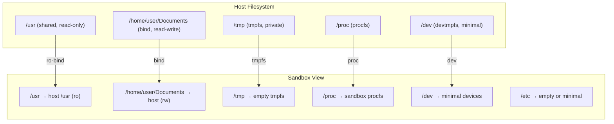
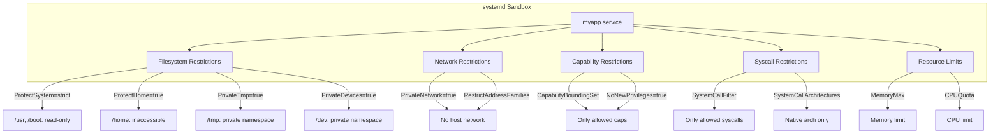
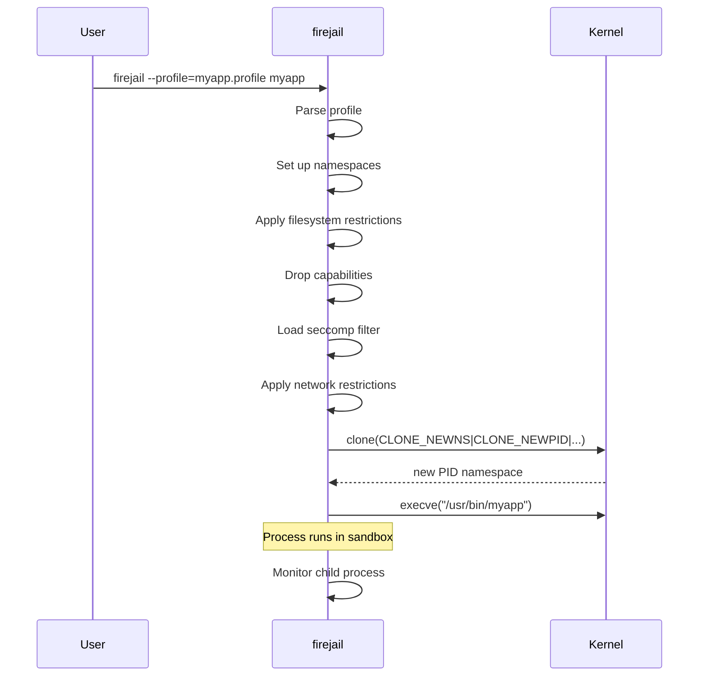

# Chapter 165: Sandboxing

## 1. Intuition

A sandbox is a confined execution environment that limits what a program can do. Even if the program is compromised or malicious, it can only affect what the sandbox allows. Think of it as a child's play area: the child can play freely within the fenced area but cannot reach the kitchen knives or the street.

Linux offers multiple sandboxing mechanisms, each with different trade-offs. Some create virtual filesystem views (bubblewrap), some use seccomp and namespaces (firejail), and some leverage systemd's built-in sandboxing features. The choice depends on your threat model: are you sandboxing a web browser, a server process, or untrusted code?

This chapter covers three practical sandboxing approaches:
- **bubblewrap (bwrap)**: Lightweight, creates virtual filesystem layouts
- **firejail**: SUID sandbox with profiles for common applications
- **systemd sandboxing**: Native service isolation through unit file directives

## 2. Architecture

### 2.1 Sandboxing Stack

```
┌─────────────────────────────────────────────────────────────────┐
│                    Linux Sandboxing Stack                       │
├─────────────────────────────────────────────────────────────────┤
│                                                                 │
│  ┌──────────────────────────────────────────────────────────┐  │
│  │  Layer 7: Application Sandbox                            │  │
│  │  bubblewrap, firejail, systemd                           │  │
│  │  Combines lower layers into usable profiles              │  │
│  └──────────────────────────────────────────────────────────┘  │
│                                                                 │
│  ┌──────────────────────────────────────────────────────────┐  │
│  │  Layer 6: Mandatory Access Control                       │  │
│  │  SELinux, AppArmor, Landlock                             │  │
│  │  Restricts what the process can access                   │  │
│  └──────────────────────────────────────────────────────────┘  │
│                                                                 │
│  ┌──────────────────────────────────────────────────────────┐  │
│  │  Layer 5: Syscall Filtering                              │  │
│  │  seccomp-bpf                                             │  │
│  │  Restricts which syscalls are available                  │  │
│  └──────────────────────────────────────────────────────────┘  │
│                                                                 │
│  ┌──────────────────────────────────────────────────────────┐  │
│  │  Layer 4: Capabilities                                   │  │
│  │  Drop unnecessary Linux capabilities                     │  │
│  └──────────────────────────────────────────────────────────┘  │
│                                                                 │
│  ┌──────────────────────────────────────────────────────────┐  │
│  │  Layer 3: Namespaces                                     │  │
│  │  PID, mount, network, user, UTS, IPC, cgroup             │  │
│  │  Isolate the process's view of the system                │  │
│  └──────────────────────────────────────────────────────────┘  │
│                                                                 │
│  ┌──────────────────────────────────────────────────────────┐  │
│  │  Layer 2: Cgroups                                        │  │
│  │  Limit CPU, memory, I/O, PIDs                            │  │
│  └──────────────────────────────────────────────────────────┘  │
│                                                                 │
│  ┌──────────────────────────────────────────────────────────┐  │
│  │  Layer 1: Filesystem Isolation                           │  │
│  │  Read-only mounts, tmpfs, bind mounts                    │  │
│  └──────────────────────────────────────────────────────────┘  │
│                                                                 │
└─────────────────────────────────────────────────────────────────┘
```

### 2.2 Tool Comparison

| Feature | bubblewrap | firejail | systemd |
|---------|-----------|---------|---------|
| Approach | Minimalist wrapper | SUID sandbox | Service manager |
| SUID required | No (if user namespaces) | Yes | No |
| Profiles | Manual | Pre-built for many apps | Per-service |
| Filesystem | Full bind mount control | Predefined overlays | ProtectSystem, PrivateTmp |
| Network | Via namespaces | Built-in | PrivateNetwork |
| seccomp | Via wrapper | Built-in | SystemCallFilter |
| Ease of use | Low (manual) | High (profiles) | Medium |
| Use case | Custom sandboxes | Desktop apps | Services/daemons |

## 3. Kernel Implementation

### 3.1 Namespaces (Foundation of Sandboxing)

All sandboxing tools use Linux namespaces. The key namespace types:

```c
/* include/uapi/linux/sched.h */
#define CLONE_NEWNS     0x00020000  /* Mount namespace */
#define CLONE_NEWUTS    0x04000000  /* UTS (hostname) namespace */
#define CLONE_NEWIPC    0x08000000  /* IPC namespace */
#define CLONE_NEWUSER   0x10000000  /* User namespace */
#define CLONE_NEWPID    0x20000000  /* PID namespace */
#define CLONE_NEWNET    0x40000000  /* Network namespace */
#define CLONE_NEWCGROUP 0x02000000  /* Cgroup namespace */
```

### 3.2 Mount Namespace

The mount namespace is critical for filesystem isolation:

```c
/* fs/namespace.c */
static struct mnt_namespace *create_mnt_ns(struct vfsmount *mnt)
{
    struct mnt_namespace *new_ns;

    new_ns = alloc_mnt_ns(current->nsproxy->mnt_ns->user_ns);
    new_ns->root = mnt;
    list_add(&mnt->mnt_list, &new_ns->list);

    return new_ns;
}
```

### 3.3 User Namespace for Unprivileged Sandboxing

User namespaces allow unprivileged users to create sandboxes:

```c
/* kernel/user_namespace.c */
static struct user_namespace *create_user_ns(struct cred *new_cred)
{
    struct user_namespace *ns;

    ns = kmem_cache_zalloc(user_ns_cachep, GFP_KERNEL);

    /* The creator becomes root inside the namespace */
    ns->owner = new_cred->euid;
    ns->group = new_cred->egid;

    /* Map the user to UID 0 inside the namespace */
    /* ... */

    return ns;
}
```

## 4. Source Code References

| Component | File |
|-----------|------|
| Namespace creation | `kernel/nsproxy.c` |
| Mount namespace | `fs/namespace.c` |
| User namespace | `kernel/user_namespace.c` |
| PID namespace | `kernel/pid_namespace.c` |
| Network namespace | `net/core/net_namespace.c` |
| Cgroup namespace | `kernel/cgroup/namespace.c` |
| seccomp | `kernel/seccomp.c` |
| Capabilities | `security/commoncap.c` |

## 5. Configuration Examples

### 5.1 bubblewrap (bwrap)

```bash
# Install
sudo apt install bubblewrap   # Debian/Ubuntu
sudo dnf install bubblewrap   # Fedora

# Basic sandbox: run bash with limited filesystem
bwrap \
    --ro-bind /usr /usr \
    --symlink usr/lib /lib \
    --symlink usr/lib64 /lib64 \
    --symlink usr/bin /bin \
    --symlink usr/sbin /sbin \
    --proc /proc \
    --dev /dev \
    --tmpfs /tmp \
    --unshare-all \
    --die-with-parent \
    -- /bin/bash

# Sandboxed application with specific access
bwrap \
    --ro-bind /usr /usr \
    --ro-bind /lib /lib \
    --ro-bind /lib64 /lib64 \
    --bind /home/user/Documents /home/user/Documents \
    --tmpfs /home/user \
    --proc /proc \
    --dev /dev \
    --tmpfs /tmp \
    --unshare-pid \
    --unshare-net \
    --unshare-user \
    --uid 1000 \
    --gid 1000 \
    -- /usr/bin/firefox

# Minimal sandbox for untrusted code
bwrap \
    --ro-bind /usr /usr \
    --symlink usr/lib /lib \
    --symlink usr/bin /bin \
    --proc /proc \
    --dev /dev \
    --tmpfs /tmp \
    --unshare-all \
    --cap-drop ALL \
    --new-session \
    --die-with-parent \
    -- /tmp/untrusted_program
```

### 5.2 bubblewrap Advanced Configuration

```bash
# Create a sandbox script
cat > ~/bin/sandbox.sh << 'EOF'
#!/bin/bash
# Sandbox for running untrusted applications

set -euo pipefail

APP="${1:?Usage: sandbox.sh <program> [args...]}"
shift

exec bwrap \
    --ro-bind /usr /usr \
    --ro-bind /etc/ld.so.cache /etc/ld.so.cache \
    --ro-bind /etc/ld.so.conf /etc/ld.so.conf \
    --ro-bind /etc/fonts /etc/fonts \
    --symlink usr/lib /lib \
    --symlink usr/lib64 /lib64 \
    --symlink usr/bin /bin \
    --symlink usr/sbin /sbin \
    --proc /proc \
    --dev /dev \
    --tmpfs /tmp \
    --tmpfs /var \
    --tmpfs /run \
    --dir /tmp/.X11-unix \
    --bind /tmp/.X11-unix /tmp/.X11-unix \
    --setenv DISPLAY "${DISPLAY:-}" \
    --unshare-pid \
    --unshare-user \
    --uid 1000 \
    --gid 1000 \
    --die-with-parent \
    --new-session \
    --cap-drop ALL \
    -- "$APP" "$@"
EOF
chmod +x ~/bin/sandbox.sh

# Usage:
~/bin/sandbox.sh firefox
~/bin/sandbox.sh libreoffice document.odt
```

### 5.3 firejail

```bash
# Install
sudo apt install firejail   # Debian/Ubuntu
sudo dnf install firejail   # Fedora

# Run application with default profile
firejail firefox

# Run with specific profile
firejail --profile=/etc/firejail/firefox.profile firefox

# List available profiles
ls /etc/firejail/*.profile | wc -l
# Shows number of available profiles

# Create custom profile
cat > ~/.config/firejail/myapp.profile << 'EOF'
# Include common settings
include /etc/firejail/disable-common.inc
include /etc/firejail/disable-programs.inc

# Filesystem access
whitelist ~/Documents
whitelist ~/Downloads
read-only /etc
noexec /tmp

# Network
net none

# Capabilities
caps.drop all

# seccomp
seccomp

# Other
nonewprivs
noroot
nosound
notv
nou2f
EOF

# Run with custom profile
firejail --profile=myapp.profile myapp
```

### 5.4 firejail Common Options

```bash
# Network isolation
firejail --net=none firefox        # No network
firejail --net=br0 firefox         # Bridge network

# Filesystem
firejail --private firefox         # Private home directory
firejail --private=/tmp/sandbox firefox  # Private home in /tmp/sandbox
firejail --private-tmp firefox     # Private /tmp
firejail --private-dev firefox     # Private /dev
firejail --private-etc=passwd,group firefox  # Private /etc

# Read-only
firejail --read-only=/etc firefox  # Read-only /etc
firejail --read-write=/tmp firefox # Read-write /tmp (default)

# Whitelist
firejail --whitelist=~/Documents firefox
firejail --whitelist=~/Downloads firefox

# Security
firejail --caps.drop=all firefox   # Drop all capabilities
firejail --seccomp firefox         # Enable seccomp filter
firejail --nonewprivs firefox      # No new privileges
firejail --noroot firefox          # No root inside sandbox

# Combine
firejail \
    --private \
    --net=none \
    --caps.drop=all \
    --seccomp \
    --nonewprivs \
    --noroot \
    --private-tmp \
    --private-dev \
    --whitelist=~/Documents \
    firefox
```

### 5.5 systemd Sandboxing

```ini
# /etc/systemd/system/myapp.service
[Unit]
Description=Sandboxed Application
After=network.target

[Service]
ExecStart=/usr/bin/myapp
User=myapp
Group=myapp

# === Filesystem Protection ===
ProtectSystem=strict          # Make /usr, /boot, /efi read-only
# ProtectSystem=full          # Make /usr, /boot, /efi read-only (less strict)
ProtectHome=true              # Make /home, /root, /run/user inaccessible
PrivateTmp=true               # Private /tmp namespace
PrivateDevices=true           # Private /dev namespace
PrivateUsers=true             # Private user namespace
ProtectKernelTunables=true    # Make /proc, /sys read-only
ProtectKernelModules=true     # Deny module loading
ProtectKernelLogs=true        # Deny access to kernel log
ProtectControlGroups=true     # Make cgroup fs read-only
ProtectClock=true             # Deny clock changes
ProtectHostname=true          # Deny hostname changes

# === Network Restrictions ===
# PrivateNetwork=true          # Private network namespace
RestrictAddressFamilies=AF_INET AF_INET6 AF_UNIX
IPAddressDeny=any             # Deny all IP addresses
IPAddressAllow=10.0.0.0/8    # Allow specific subnet

# === Capability Restrictions ===
CapabilityBoundingSet=CAP_NET_BIND_SERVICE
AmbientCapabilities=CAP_NET_BIND_SERVICE
NoNewPrivileges=true

# === Syscall Restrictions ===
SystemCallFilter=@system-service
SystemCallFilter=~@mount @reboot @swap @debug @reboot @clock
SystemCallArchitectures=native
SystemCallErrorNumber=EPERM

# === Resource Limits ===
MemoryMax=512M
CPUQuota=50%
TasksMax=64
LimitNOFILE=1024

# === Other Restrictions ===
LockPersonality=true          # Prevent personality(2) changes
RestrictRealtime=true         # Prevent SCHED_FIFO/RR
RestrictSUIDSGID=true         # Prevent SUID/SGID file creation
RemoveIPC=true                # Clean up IPC on exit
RestrictNamespaces=true       # Prevent namespace creation
ProtectProc=invisible         # Hide other users' processes
ProcSubset=pid                # Only expose /proc/pid

[Install]
WantedBy=multi-user.target
```

### 5.6 systemd Sandboxing Verification

```bash
# Analyze security settings of a service
systemd-analyze security myapp.service
# Shows a security score from 0 (best) to 10 (worst)
# Lists each setting and its contribution to the score

# Detailed analysis
systemd-analyze security myapp.service --offline=false

# Check specific setting
systemctl show myapp.service -p ProtectSystem
# ProtectSystem=strict
```

### 5.7 Combining Sandboxing Tools

```bash
# bubblewrap + seccomp + capabilities
bwrap \
    --ro-bind /usr /usr \
    --proc /proc \
    --dev /dev \
    --tmpfs /tmp \
    --unshare-all \
    --cap-drop ALL \
    --die-with-parent \
    -- seccomp-tool exec -- /usr/bin/myapp

# firejail + AppArmor
firejail --apparmor myapp

# systemd + AppArmor
[Service]
AppArmorProfile=myapp
```

## 6. Diagrams

### 6.1 bubblewrap Sandbox Layout



### 6.2 systemd Service Sandboxing



### 6.3 firejail Profile Processing



## 7. Common Pitfalls

### 7.1 bubblewrap Without User Namespaces

```bash
# If user namespaces are disabled:
bwrap --unshare-user ...
# bwrap: Creating new namespace failed: EPERM

# Fix: enable user namespaces
echo 1 > /proc/sys/kernel/unprivileged_userns_clone
# Or set kernel parameter: namespace.unpriv_enable=1
```

### 7.2 firejail SUID Security

```bash
# firejail uses SUID by default
# This means a firejail vulnerability = root exploit

# Mitigations:
# 1. Keep firejail updated
# 2. Use --noroot in profiles
# 3. Consider bubblewrap (no SUID needed)
```

### 7.3 systemd PrivateTmp Doesn't Clean Up

```bash
# With PrivateTmp=true, /tmp is a private mount
# Files in it are cleaned up when the service stops
# But if the service crashes, cleanup may be delayed

# Check for leftover mounts:
mount | grep PrivateTmp
```

### 7.4 Too Restrictive Sandboxing

```bash
# Overly restrictive sandbox can break applications
# Example: Firefox needs access to GPU, audio, display

# Start with a minimal sandbox and add permissions as needed
# Use audit logs to identify what's being denied
```

### 7.5 Display Server Access

```bash
# X11 is fundamentally insecure (any client can read all others)
# Wayland is much better for sandboxing

# For X11, you need to share the X11 socket:
bwrap \
    --bind /tmp/.X11-unix /tmp/.X11-unix \
    --setenv DISPLAY "$DISPLAY" \
    ...

# Consider using Xpra or nested Xephyr for better isolation
```

### 7.6 Sandbox Escape via Kernel Vulnerabilities

```bash
# Sandboxes rely on kernel security
# A kernel vulnerability can escape any sandbox

# Defense in depth:
# 1. Keep kernel updated
# 2. Use multiple sandbox layers
# 3. Minimize attack surface in each layer
```

## 8. Best Practices

### 8.1 Defense in Depth

```bash
# Combine multiple sandboxing layers
bwrap \
    --unshare-all \                    # Namespace isolation
    --cap-drop ALL \                   # Capability restriction
    --ro-bind /usr /usr \              # Read-only filesystem
    --tmpfs /tmp \                     # Private tmp
    --die-with-parent \                # Clean exit
    -- seccomp-tool exec -- /bin/app   # Syscall filtering
```

### 8.2 Start Minimal, Add as Needed

```bash
# Start with maximum restriction
bwrap --unshare-all --cap-drop ALL --ro-bind / / -- /bin/app

# Add permissions one by one as errors indicate:
# Need network? → remove --unshare-net
# Need write to /tmp? → add --tmpfs /tmp
# Need specific files? → add --bind /path /path
```

### 8.3 Use systemd for Services

```ini
# Best practice for services
[Service]
# Always include these basics
NoNewPrivileges=true
ProtectSystem=strict
ProtectHome=true
PrivateTmp=true
PrivateDevices=true
ProtectKernelTunables=true
ProtectKernelModules=true
ProtectKernelLogs=true
ProtectControlGroups=true
LockPersonality=true
RestrictRealtime=true
RestrictSUIDSGID=true
RestrictNamespaces=true
RemoveIPC=true

# Add service-specific permissions as needed
```

### 8.4 Regular Security Audits

```bash
# Audit systemd service security
systemd-analyze security myapp.service

# Check for overly permissive services
systemctl list-units --type=service | while read name rest; do
    score=$(systemd-analyze security "$name" 2>/dev/null | grep -oP '\d+\.\d+' | head -1)
    if [ -n "$score" ] && [ "$(echo "$score > 7" | bc)" -eq 1 ]; then
        echo "WARNING: $name has security score $score"
    fi
done
```

### 8.5 Profile-Based Sandboxing

```bash
# Create profiles for common applications
# /etc/firejail/custom/myapp.profile
include /etc/firejail/disable-common.inc
include /etc/firejail/disable-programs.inc
whitelist ~/myapp-data
net none
caps.drop all
seccomp
nonewprivs
noroot
```

### 8.6 Monitor Sandbox Violations

```bash
# Monitor for sandbox escapes
auditctl -a always,exit -F arch=b64 -S clone -S unshare -k sandbox

# Monitor capability violations
auditctl -a always,exit -F arch=b64 -S capset -k capability_change

# Review audit logs
ausearch -k sandbox -i
```

## 9. Exercises

### Exercise 1: bubblewrap Basics

1. Create a bubblewrap sandbox that:
   - Mounts `/usr` read-only
   - Creates an empty `/tmp`
   - Unshares PID namespace
   - Drops all capabilities
2. Run `bash` inside the sandbox
3. Verify you can't write to `/usr`
4. Verify `/tmp` is empty
5. Verify you're PID 1

### Exercise 2: firejail for Desktop Apps

1. Install firejail
2. Run Firefox with firejail
3. Examine the default profile
4. Create a custom profile that:
   - Restricts network to localhost only
   - Allows access only to ~/Downloads
   - Drops all capabilities
5. Test the profile

### Exercise 3: systemd Service Sandboxing

1. Create a systemd service with comprehensive sandboxing
2. Use `systemd-analyze security` to evaluate
3. Achieve a security score below 3.0
4. Verify the service still functions correctly

### Exercise 4: Combining Tools

1. Create a sandbox using bubblewrap + seccomp + capabilities
2. The sandboxed process should:
   - Only access specific files
   - Only use specific syscalls
   - Have no capabilities
3. Test with a simple application

### Exercise 5: Audit Sandbox Security

1. Set up a sandboxed service
2. Enable audit logging for namespace and capability changes
3. Try to escape the sandbox (as an exercise)
4. Document what the sandbox prevents and what it doesn't

## 10. References

1. **bubblewrap**: https://github.com/containers/bubblewrap
2. **firejail**: https://github.com/netblue30/firejail
3. **systemd.exec(5)**: Sandboxing directives documentation
4. **Linux man pages**: `namespaces(7)`, `user_namespaces(7)`, `mount_namespaces(7)`, `pid_namespaces(7)`, `net_namespaces(7)`
5. **Linux kernel source**: `kernel/nsproxy.c` — Namespace management
6. **Linux kernel source**: `fs/namespace.c` — Mount namespace implementation
7. **systemd security**: `systemd-analyze security` documentation
8. **LWN.net**: "A seccomp overview" — Sandboxing techniques
9. **Sandworm**: Linux sandboxing comparison
10. **Linux Containers**: https://linuxcontainers.org/
