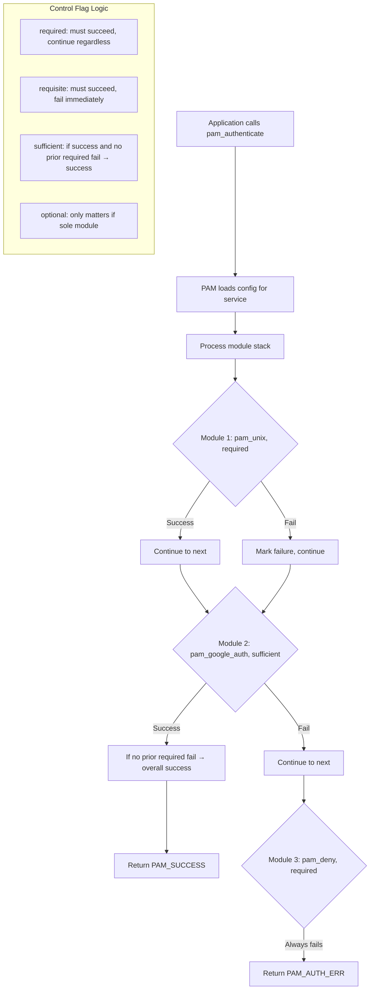
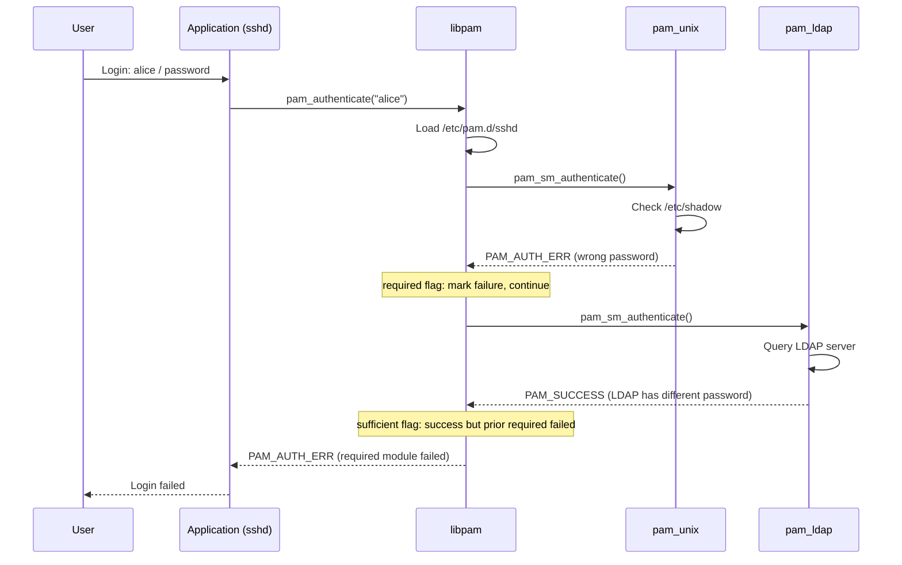
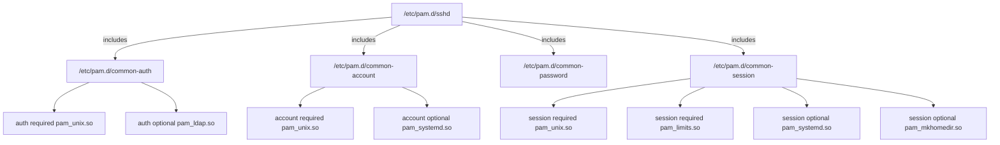

# Chapter 166: PAM (Pluggable Authentication Modules)

## 1. Intuition

When you type your password to log in, where does that password get checked? Against `/etc/passwd`? An LDAP server? A smartcard? A fingerprint scanner? The answer could be any of these, depending on how PAM is configured.

PAM (Pluggable Authentication Modules) is Linux's authentication framework. Instead of hard-coding authentication logic into every program (login, sudo, sshd, etc.), PAM provides a library that applications link against. Authentication behavior is then configured through module files in `/etc/pam.d/`, without changing any application code.

Think of PAM as a universal adapter: the application plugs into PAM, and PAM plugs into whatever authentication backend you configure. Want to switch from local passwords to LDAP? Change the PAM config. Want to add two-factor authentication? Add a PAM module. The applications don't need to know or care.

## 2. Architecture

### 2.1 PAM Stack

```
┌─────────────────────────────────────────────────────────────────┐
│                    PAM Architecture                             │
├─────────────────────────────────────────────────────────────────┤
│                                                                 │
│  Applications:                                                  │
│  ┌────────┐ ┌────────┐ ┌────────┐ ┌────────┐ ┌────────┐      │
│  │ login  │ │  sshd  │ │  sudo  │ │ passwd │ │ screensaver│   │
│  └───┬────┘ └───┬────┘ └───┬────┘ └───┬────┘ └───┬────┘      │
│      │          │          │          │          │              │
│      ▼          ▼          ▼          ▼          ▼              │
│  ┌─────────────────────────────────────────────────────────┐   │
│  │                    libpam (PAM Library)                  │   │
│  │  pam_authenticate()  pam_acct_mgmt()  pam_setcred()     │   │
│  │  pam_open_session()  pam_close_session()                │   │
│  └──────────────────────────┬──────────────────────────────┘   │
│                              │                                  │
│                              ▼                                  │
│  ┌─────────────────────────────────────────────────────────┐   │
│  │              /etc/pam.d/<service>                        │   │
│  │  Defines which modules to call, in what order,          │   │
│  │  with what control flags                                │   │
│  └──────────────────────────┬──────────────────────────────┘   │
│                              │                                  │
│                              ▼                                  │
│  PAM Modules:                                                   │
│  ┌──────────┐ ┌──────────┐ ┌──────────┐ ┌──────────┐         │
│  │pam_unix  │ │pam_ldap  │ │pam_sss   │ │pam_google│         │
│  │(local    │ │(LDAP     │ │(SSSD     │ │(2FA TOTP)│         │
│  │ passwords)│ │ backend) │ │ backend) │ │          │         │
│  └──────────┘ └──────────┘ └──────────┘ └──────────┘         │
│                                                                 │
└─────────────────────────────────────────────────────────────────┘
```

### 2.2 PAM Module Types

Each PAM configuration line specifies a module type, which determines when the module is called:

| Module Type | Purpose | When Called |
|------------|---------|-------------|
| `auth` | Verify user identity (password, biometric) | During login |
| `account` | Check if account is valid (not expired, allowed) | After auth |
| `password` | Change authentication tokens | During password change |
| `session` | Set up/tear down user session | Before/after session |

### 2.3 Control Flags

Control flags determine what happens when a module succeeds or fails:

| Flag | Meaning |
|------|---------|
| `required` | Must succeed; continue checking others, but overall fails |
| `requisite` | Must succeed; fail immediately if this fails |
| `sufficient` | If succeeds and no prior required failure, overall succeeds |
| `optional` | Success/failure only matters if this is the only module |
| `include` | Include another config file |
| `substack` | Include as substack (failure doesn't propagate up) |

### 2.4 PAM Management Functions

Applications call these PAM functions:

| Function | Purpose |
|----------|---------|
| `pam_authenticate()` | Verify user identity |
| `pam_acct_mgmt()` | Check account validity |
| `pam_setcred()` | Manage credentials (Kerberos tickets, etc.) |
| `pam_open_session()` | Begin session (mount home, start audit) |
| `pam_close_session()` | End session (unmount, cleanup) |
| `pam_chauthtok()` | Change authentication token (password) |

## 3. Kernel Interaction

### 3.1 PAM is Userspace

PAM is entirely a userspace framework. It doesn't interact with the kernel directly. However, some PAM modules use kernel interfaces:

- `pam_unix`: Reads `/etc/shadow` (requires appropriate permissions)
- `pam_systemd`: Creates systemd user sessions, cgroups
- `pam_loginuid`: Sets `/proc/self/loginuid` (kernel audit)
- `pam_keyinit`: Creates kernel keyring sessions
- `pam_limits`: Sets resource limits via `setrlimit()`
- `pam_namespace`: Creates mount namespaces
- `pam_selinux`: Sets SELinux security contexts
- `pam_apparmor`: Changes AppArmor profile

### 3.2 PAM and NSS

PAM works alongside NSS (Name Service Switch). NSS resolves names (usernames, hostnames) while PAM handles authentication. They're configured separately:

- PAM: `/etc/pam.d/` — Authentication
- NSS: `/etc/nsswitch.conf` — Name resolution

### 3.3 Conversation Function

PAM modules communicate with users through a "conversation" function provided by the application:

```c
/* Application provides this to PAM */
int my_conversation(int num_msg, const struct pam_message **msg,
                    struct pam_response **resp, void *appdata_ptr)
{
    struct pam_response *reply;

    reply = calloc(num_msg, sizeof(struct pam_response));

    for (int i = 0; i < num_msg; i++) {
        switch (msg[i]->msg_style) {
        case PAM_PROMPT_ECHO_OFF:
            /* Password prompt - don't echo */
            reply[i].resp = get_password();
            break;
        case PAM_PROMPT_ECHO_ON:
            /* Username prompt - echo */
            reply[i].resp = get_input();
            break;
        case PAM_TEXT_INFO:
            /* Informational message */
            printf("%s\n", msg[i]->msg);
            break;
        case PAM_ERROR_MSG:
            /* Error message */
            fprintf(stderr, "%s\n", msg[i]->msg);
            break;
        }
    }

    *resp = reply;
    return PAM_SUCCESS;
}
```

## 4. Source Code References

| Component | File |
|-----------|------|
| PAM library | `libpam/` in Linux-PAM source |
| Module interface | `libpam/include/security/pam_modules.h` |
| Configuration parsing | `libpam/pam_handlers.c` |
| Module loading | `libpam/pam_dynamic.c` |
| pam_unix module | `modules/pam_unix/` |
| pam_systemd module | `src/login/systemd-user` (systemd source) |
| PAM applications | `modules/pam_loginuid/`, `modules/pam_limits/` |

## 5. Configuration Examples

### 5.1 PAM Configuration Files

```bash
# PAM configs are in /etc/pam.d/
ls /etc/pam.d/
# atd, chfn, chpasswd, chsh, common-account, common-auth,
# common-password, common-session, cron, login, passwd, sshd, sudo, ...

# Each file corresponds to a service (application)
# Format: type control module [arguments]
```

### 5.2 Common PAM Configuration (Debian/Ubuntu)

```bash
# /etc/pam.d/common-auth
# Authentication modules
auth    [success=1 default=ignore]      pam_unix.so nullok try_first_pass
auth    requisite                       pam_deny.so
auth    required                        pam_permit.so

# /etc/pam.d/common-account
# Account validity modules
account [success=1 new_authtok_reqd=done default=ignore] pam_unix.so
account requisite                       pam_deny.so
account required                        pam_permit.so

# /etc/pam.d/common-password
# Password change modules
password [success=1 default=ignore]     pam_unix.so obscure use_authtok try_first_pass sha512
password requisite                      pam_deny.so
password required                       pam_permit.so

# /etc/pam.d/common-session
# Session modules
session [default=1]                     pam_permit.so
session requisite                       pam_deny.so
session required                        pam_permit.so
session required                        pam_unix.so
session optional                        pam_systemd.so
```

### 5.3 Service-Specific PAM

```bash
# /etc/pam.d/sshd
# SSH daemon PAM configuration
@include common-auth

# Account checks
account    required     pam_nologin.so
@include common-account

# Password change
@include common-password

# Session setup
session    required     pam_loginuid.so
session    optional     pam_keyinit.so force revoke
session    required     pam_limits.so
session    required     pam_env.so
session    optional     pam_motd.so
@include common-session
```

### 5.4 PAM Module: pam_unix

```bash
# pam_unix - Traditional Unix authentication
# Uses /etc/passwd and /etc/shadow

# Options:
# nullok        - Allow empty passwords
# try_first_pass - Use password from previous module
# use_authtok   - Use password from pam_get_authtok()
# shadow        - Use shadow passwords
# md5/sha256/sha512 - Hash algorithm
# remember=N    - Remember last N passwords (pam_unix.so)
# minlen=N      - Minimum password length
# rounds=N      - Number of hash rounds

auth     required  pam_unix.so try_first_pass nullok
password required  pam_unix.so sha512 shadow remember=5 minlen=12
session  required  pam_unix.so
```

### 5.5 PAM Module: pam_limits

```bash
# pam_limits - Set resource limits per user/group

# In /etc/pam.d/common-session or service-specific:
session  required  pam_limits.so

# Configuration: /etc/security/limits.conf
# Format: <domain> <type> <item> <value>

# User limits
alice    hard    nproc     200      # Max 200 processes
alice    soft    nproc     150      # Default 150 processes
bob      hard    nofile    10000    # Max 10000 open files
bob      hard    maxlogins 2        # Max 2 simultaneous logins

# Group limits
@developers hard nproc     400
@developers soft core      0        # No core dumps

# Wildcard
*        hard    core      0        # No core dumps for anyone
*        soft    nproc     100
@students hard   maxlogins 1
```

### 5.6 PAM Module: pam_wheel

```bash
# pam_wheel - Restrict su to wheel group members

# In /etc/pam.d/su:
auth     required  pam_wheel.so use_uid group=wheel

# Only users in the wheel group can use su
# This is the standard RHEL/CentOS configuration

# Add user to wheel group:
usermod -aG wheel alice
```

### 5.7 PAM Module: pam_google_authenticator (2FA)

```bash
# Install
sudo apt install libpam-google-authenticator

# User setup (run as each user)
google-authenticator
# Follow prompts to set up TOTP

# In /etc/pam.d/sshd (add before common-auth):
auth required pam_google_authenticator.so

# Or for all logins:
# In /etc/pam.d/common-auth:
auth required pam_google_authenticator.so nullok
```

### 5.8 PAM Module: pam_faillock (Account Lockout)

```bash
# pam_faillock - Lock accounts after failed attempts

# In /etc/pam.d/common-auth (RHEL/CentOS):
auth        required      pam_faillock.so preauth silent deny=5 unlock_time=900
auth        [default=die] pam_faillock.so authfail deny=5 unlock_time=900
auth        sufficient    pam_unix.so

# Check locked accounts
faillock --user alice

# Unlock an account
faillock --user alice --reset
```

### 5.9 PAM Module: pam_mkhomedir

```bash
# Automatically create home directory on first login

# In /etc/pam.d/common-session:
session required pam_mkhomedir.so skel=/etc/skel umask=0077

# Useful for LDAP/SSSD users who don't have local home dirs
```

### 5.10 PAM Module: pam_selinux

```bash
# Set SELinux context on login

# In /etc/pam.d/login:
session required pam_selinux.so close
session required pam_selinux.so open

# Maps PAM user to SELinux user context
```

### 5.11 PAM Module: pam_systemd

```bash
# Creates systemd user session

# In /etc/pam.d/common-session:
session optional pam_systemd.so

# Creates:
# - User cgroup slice
# - D-Bus session
# - Logind session
# - XDG_RUNTIME_DIR
```

### 5.12 PAM Module: pam_namespace

```bash
# Create per-user mount namespaces

# In /etc/pam.d/common-session:
session required pam_namespace.so

# Configuration: /etc/security/namespace.conf
# Format: <polydir> <instance_prefix> <method> <uid_range>

# Per-user /tmp:
/tmp     /tmp-inst/    user      root,0-1000,10000-65535
/var/tmp /var/tmp-inst/ user     root,0-1000,10000-65535

# Creates separate mount namespace for each user
# Prevents /tmp symlink attacks
```

### 5.13 PAM Module: pam_access

```bash
# Control login access by user/host/tty

# In /etc/pam.d/login:
account required pam_access.so

# Configuration: /etc/security/access.conf
# Format: <permission> : <users> : <origins>

# Allow only alice and bob from specific hosts
+ : alice bob : 192.168.1.0/24
+ : alice bob : .example.com

# Deny everyone else
- : ALL : ALL

# Allow only wheel group from console
+ : (wheel) : LOCAL

# Deny remote root login
- : root : ALL EXCEPT LOCAL
```

### 5.14 Writing a Custom PAM Module

```c
/* simple_pam_module.c */
#include <security/pam_modules.h>
#include <security/pam_ext.h>
#include <syslog.h>
#include <string.h>

PAM_EXTERN int pam_sm_authenticate(pam_handle_t *pamh, int flags,
                                   int argc, const char **argv)
{
    const char *user;
    int retval;

    /* Get the username */
    retval = pam_get_user(pamh, &user, NULL);
    if (retval != PAM_SUCCESS)
        return retval;

    /* Custom authentication logic */
    if (strcmp(user, "blocked_user") == 0) {
        pam_syslog(pamh, LOG_AUTH | LOG_NOTICE,
                   "Blocked user %s attempted login", user);
        return PAM_AUTH_ERR;
    }

    /* Log successful auth attempt */
    pam_syslog(pamh, LOG_AUTH | LOG_INFO,
               "User %s authenticated", user);

    return PAM_SUCCESS;
}

PAM_EXTERN int pam_sm_setcred(pam_handle_t *pamh, int flags,
                              int argc, const char **argv)
{
    return PAM_SUCCESS;
}

PAM_EXTERN int pam_sm_acct_mgmt(pam_handle_t *pamh, int flags,
                                int argc, const char **argv)
{
    return PAM_SUCCESS;
}
```

Compile:
```bash
gcc -shared -fPIC -o pam_custom.so simple_pam_module.c -lpam
sudo cp pam_custom.so /lib/security/
```

## 6. Diagrams

### 6.1 PAM Module Stack Evaluation



### 6.2 PAM Authentication Flow



### 6.3 PAM Configuration Processing



## 7. Common Pitfalls

### 7.1 Locking Yourself Out

```bash
# CRITICAL: Always keep a root session open when modifying PAM
# A misconfigured PAM can lock everyone out

# Common mistake:
# Changing common-auth and testing with su
# If it fails, you're locked out!

# Safe practice:
# 1. Keep a root terminal open
# 2. Test with a separate terminal
# 3. Have a recovery plan (boot from live CD)
```

### 7.2 Order Matters

```bash
# PAM processes modules top-to-bottom
# required modules run even after failure
# sufficient stops early on success

# Bad: pam_deny before pam_permit
auth required pam_deny.so     # Always denies
auth required pam_permit.so   # Never reached (well, reached but doesn't matter)

# Bad: sufficient before required
auth sufficient pam_permit.so # Always succeeds → returns immediately
auth required pam_unix.so     # Never reached!
```

### 7.3 Missing include Files

```bash
# If common-* files are missing or broken, ALL services fail

# Symptom: every login fails with "Authentication error"
# Check: ls -la /etc/pam.d/common-*
# Fix: reinstall libpam-modules
```

### 7.4 SUID and PAM

```bash
# SUID applications that use PAM must be carefully written
# The PAM conversation function runs with elevated privileges

# Common vulnerability: PAM modules that write to user-controlled paths
# Always use absolute paths in PAM configs
```

### 7.5 PAM and Containers

```bash
# In containers, PAM may not be needed
# Most container runtimes skip PAM

# If you need PAM in containers:
# - Mount /etc/pam.d from the container image
# - Ensure required modules are available
# - Consider minimal PAM config
```

### 7.6 Module Ordering for Password Changes

```bash
# For password changes (pam_chauthtok):
# pam_unix must come after modules that set the new password

# Bad:
password required pam_unix.so use_authtok  # Uses old token
password required pam_ldap.so              # Sets new token

# Good:
password required pam_ldap.so              # Sets new token
password required pam_unix.so use_authtok  # Uses token from ldap
```

## 8. Best Practices

### 8.1 Use include/substack for Shared Config

```bash
# Use @include for shared configurations
@include common-auth
@include common-account

# Use substack for isolation (failures don't propagate)
auth substack custom-auth
```

### 8.2 Implement Account Lockout

```bash
# /etc/pam.d/common-auth
auth    required    pam_faillock.so preauth silent deny=5 unlock_time=900
auth    [default=die] pam_faillock.so authfail deny=5 unlock_time=900
auth    required    pam_unix.so try_first_pass
```

### 8.3 Set Resource Limits

```bash
# /etc/security/limits.conf
*        hard    nproc      256
*        hard    nofile     4096
*        hard    core       0
@wheel   hard    nproc      512
root     hard    nproc      unlimited
```

### 8.4 Log PAM Activity

```bash
# pam_tally2 / pam_faillock logs failed attempts
# /var/log/auth.log (Debian) or /var/log/secure (RHEL)

# Monitor for brute force:
grep "authentication failure" /var/log/auth.log
journalctl -u sshd | grep "Failed password"
```

### 8.5 Test Changes Before Deployment

```bash
# Test PAM changes in a separate session
# Keep root session open
sudo -u testuser su - testuser  # Test as non-root
ssh testuser@localhost           # Test SSH

# Use pamtester for automated testing
sudo apt install pamtester
pamtester login alice authenticate
```

### 8.6 Minimal PAM for Services

```bash
# For services that don't need complex auth:
# /etc/systemd/system/myservice.service
# Use User= directive instead of PAM

# Or use minimal PAM:
auth     required  pam_permit.so
account  required  pam_permit.so
session  required  pam_permit.so
```

## 9. Exercises

### Exercise 1: PAM Configuration Analysis

1. Examine `/etc/pam.d/sshd` on your system
2. Identify each module and its purpose
3. Trace the authentication flow for a login attempt
4. Explain what happens at each step

### Exercise 2: Account Lockout

1. Configure `pam_faillock` to lock after 3 failed attempts
2. Lock out a test user
3. Verify the lockout
4. Unlock the account
5. Set the lockout time to 60 seconds

### Exercise 3: Resource Limits

1. Configure PAM limits for a test user
2. Set maximum processes to 10
3. Set maximum open files to 100
4. Test by trying to exceed the limits
5. Verify the limits are enforced

### Exercise 4: Two-Factor Authentication

1. Install `pam_google_authenticator`
2. Configure PAM for SSH to require 2FA
3. Set up the authenticator for a test user
4. Test login with password + TOTP
5. Verify that password-only login is denied

### Exercise 5: Custom PAM Module

1. Write a simple PAM module that logs all authentication attempts
2. Compile and install it
3. Configure it in a PAM service
4. Test and verify logging

### Exercise 6: PAM Recovery

1. Intentionally misconfigure PAM (in a VM!)
2. Lock yourself out
3. Recover using single-user mode or live CD
4. Document the recovery process

## 10. References

1. **Linux man pages**: `pam(7)`, `pam.conf(5)`, `pam_unix(8)`, `pam_limits(8)`, `pam_wheel(8)`, `pam_faillock(8)`
2. **Linux-PAM documentation**: http://www.linux-pam.org/
3. **Linux-PAM Module Writers Guide**: http://www.linux-pam.org/Linux-PAM-html/Linux-PAM_MWG.html
4. **Linux-PAM Application Developers Guide**: http://www.linux-pam.org/Linux-PAM-html/adg.html
5. **Red Hat PAM Guide**: https://access.redhat.com/documentation/en-us/red_hat_enterprise_linux/9/html/managing_configuring_and_implementing_identity_management/
6. **Debian PAM documentation**: `/usr/share/doc/libpam-doc/`
7. **pam_google_authenticator**: https://github.com/google/google-authenticator-libpam
8. **pam_ssh_agent_auth**: SSH agent authentication via PAM
9. **The Linux Programming Interface** by Michael Kerrisk — PAM chapter
10. **POSIX PAM specification**: X/Open CAE Specification
