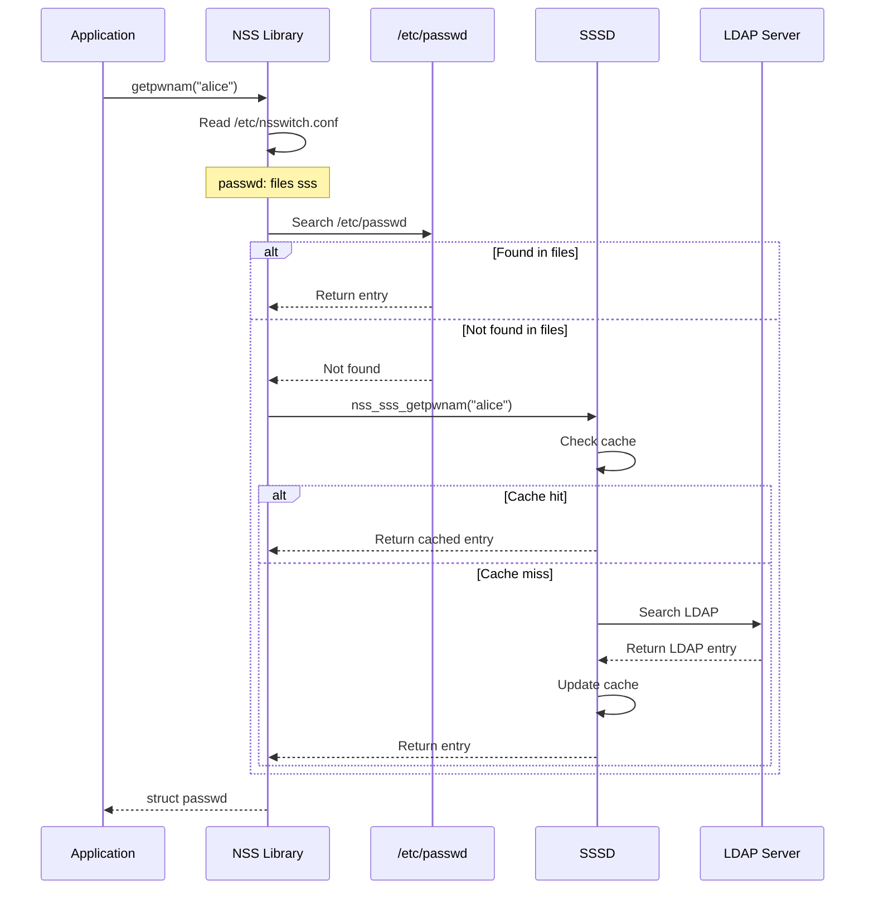
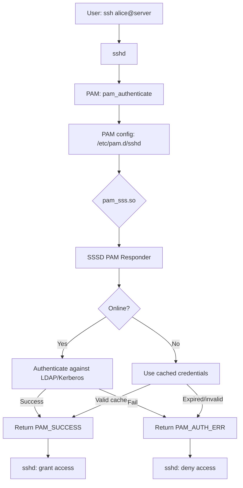
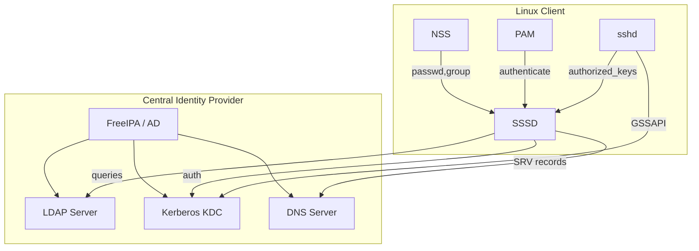

# Chapter 167: Authentication and Identity

## 1. Intuition

When you type `ls -l` and see `alice` as the file owner, or when `ssh alice@server` asks for a password, the system needs to resolve names to numbers (UIDs, GIDs) and verify identities. This is the domain of authentication and identity management.

Linux's identity stack has two main components:
- **NSS (Name Service Switch)**: Resolves names to numbers and vice versa (who is `alice`? what UID is 1000?)
- **PAM**: Handles authentication (is this really alice?)

Beyond local `/etc/passwd` and `/etc/shadow`, enterprise environments use LDAP, Kerberos, and SSSD for centralized identity management. Understanding this stack is essential for managing users across hundreds of machines.

## 2. Architecture

### 2.1 Identity Resolution Stack

```
┌─────────────────────────────────────────────────────────────────┐
│                    Identity Resolution Stack                    │
├─────────────────────────────────────────────────────────────────┤
│                                                                 │
│  Application:                                                   │
│  ls -l → needs to resolve UID 1000 → "alice"                  │
│  ssh alice@host → needs to resolve "alice" → verify identity   │
│                                                                 │
│  ┌──────────────────────────────────────────────────────────┐  │
│  │  NSS (Name Service Switch)                               │  │
│  │  Resolves: users, groups, hosts, services, etc.          │  │
│  │  Config: /etc/nsswitch.conf                              │  │
│  │  Library: libnss_*.so                                    │  │
│  └──────────────────────────┬───────────────────────────────┘  │
│                              │                                  │
│                              ▼                                  │
│  ┌──────────────────────────────────────────────────────────┐  │
│  │  Backends                                                │  │
│  │  ┌────────┐ ┌────────┐ ┌────────┐ ┌────────┐            │  │
│  │  │ files  │ │  ldap  │ │  sss   │ │  dns   │            │  │
│  │  │(local) │ │(LDAP)  │ │(SSSD)  │ │(hosts) │            │  │
│  │  └────────┘ └────────┘ └────────┘ └────────┘            │  │
│  └──────────────────────────────────────────────────────────┘  │
│                                                                 │
│  ┌──────────────────────────────────────────────────────────┐  │
│  │  PAM (Pluggable Authentication Modules)                  │  │
│  │  Handles: authentication, authorization, sessions        │  │
│  │  Config: /etc/pam.d/                                     │  │
│  │  Library: pam_*.so                                       │  │
│  └──────────────────────────┬───────────────────────────────┘  │
│                              │                                  │
│                              ▼                                  │
│  ┌──────────────────────────────────────────────────────────┐  │
│  │  Authentication Backends                                 │  │
│  │  ┌────────┐ ┌────────┐ ┌────────┐ ┌────────┐            │  │
│  │  │pam_unix│ │pam_ldap│ │pam_sss │ │pam_krb5│            │  │
│  │  │/etc/   │ │LDAP    │ │SSSD    │ │Kerberos│            │  │
│  │  │shadow  │ │server  │ │cached  │ │KDC     │            │  │
│  │  └────────┘ └────────┘ └────────┘ └────────┘            │  │
│  └──────────────────────────────────────────────────────────┘  │
│                                                                 │
└─────────────────────────────────────────────────────────────────┘
```

### 2.2 NSS Database Types

NSS can resolve many types of information:

| Database | Purpose | Examples |
|----------|---------|---------|
| `passwd` | User accounts | alice → UID 1000, GID 1000 |
| `group` | Groups | developers → GID 1001, members |
| `shadow` | Password hashes | alice → $6$... (hashed password) |
| `hosts` | Hostname resolution | server1 → 192.168.1.10 |
| `services` | Network services | ssh → 22/tcp |
| `netgroup` | Network groups | (host, user, domain) tuples |
| `automount` | NFS automounts | /home → NFS server |

### 2.3 Enterprise Identity Stack

```
┌─────────────────────────────────────────────────────────────────┐
│              Enterprise Identity Management                     │
├─────────────────────────────────────────────────────────────────┤
│                                                                 │
│  ┌──────────────────────────────────────────────────────────┐  │
│  │  FreeIPA / Active Directory                              │  │
│  │  Centralized: users, groups, policies, HBAC              │  │
│  │  Protocols: LDAP, Kerberos, DNS                          │  │
│  └──────────────────────────┬───────────────────────────────┘  │
│                              │                                  │
│            ┌─────────────────┼─────────────────┐                │
│            ▼                 ▼                  ▼                │
│  ┌──────────────┐  ┌──────────────┐  ┌──────────────┐         │
│  │    LDAP      │  │   Kerberos   │  │    DNS       │         │
│  │  (identity   │  │  (authenti-  │  │  (name       │         │
│  │   store)     │  │   cation)    │  │   resolution)│         │
│  └──────┬───────┘  └──────┬───────┘  └──────┬───────┘         │
│         │                 │                  │                  │
│         ▼                 ▼                  ▼                  │
│  ┌──────────────────────────────────────────────────────────┐  │
│  │                    SSSD                                   │  │
│  │  Caching daemon that sits between NSS/PAM and backends   │  │
│  │  Provides: offline auth, caching, failover               │  │
│  └──────────────────────────┬───────────────────────────────┘  │
│                              │                                  │
│                              ▼                                  │
│  ┌──────────────────────────────────────────────────────────┐  │
│  │  Linux Client                                            │  │
│  │  NSS: passwd_compat → sss                                │  │
│  │  PAM: pam_sss.so                                         │  │
│  └──────────────────────────────────────────────────────────┘  │
│                                                                 │
└─────────────────────────────────────────────────────────────────┘
```

## 3. Implementation Details

### 3.1 NSS Configuration

```c
/* NSS library interface */
/* Each NSS backend implements these functions: */

/* For passwd database */
enum nss_status _nss_files_getpwnam_r(const char *name,
                                       struct passwd *result,
                                       char *buffer, size_t buflen,
                                       int *errnop);

enum nss_status _nss_ldap_getpwnam_r(const char *name,
                                      struct passwd *result,
                                      char *buffer, size_t buflen,
                                      int *errnop);

enum nss_status _nss_sss_getpwnam_r(const char *name,
                                     struct passwd *result,
                                     char *buffer, size_t buflen,
                                     int *errnop);
```

### 3.2 NSS Lookup Flow

```c
/* glibc NSS implementation */
int getpwnam_r(const char *name, struct passwd *pwd,
               char *buf, size_t buflen, struct passwd **result)
{
    /* Read /etc/nsswitch.conf */
    /* For each source listed under "passwd:" */
    /* Try the backend library */

    for (source = nss_passwd_sources; source; source = source->next) {
        status = source->getpwnam_r(name, pwd, buf, buflen, &errno);
        if (status == NSS_STATUS_SUCCESS) {
            *result = pwd;
            return 0;
        }
        if (status == NSS_STATUS_NOTFOUND)
            continue;  /* Try next source */
        if (status == NSS_STATUS_UNAVAIL)
            continue;  /* Source unavailable, try next */
    }

    *result = NULL;
    return ENOENT;
}
```

### 3.3 SSSD Architecture

SSSD (System Security Services Daemon) is the modern way to integrate Linux with enterprise directories:

```
┌─────────────────────────────────────────────────────────────────┐
│                    SSSD Architecture                           │
├─────────────────────────────────────────────────────────────────┤
│                                                                 │
│  ┌──────────────┐     ┌──────────────┐     ┌──────────────┐   │
│  │  NSS Responder│     │  PAM Responder│     │  IFP (InfoPipe)│   │
│  │  (name lookup)│     │  (auth)       │     │  (D-Bus API)  │   │
│  └──────┬───────┘     └──────┬───────┘     └──────┬───────┘   │
│         │                    │                     │            │
│         ▼                    ▼                     ▼            │
│  ┌──────────────────────────────────────────────────────────┐  │
│  │                    SSSD Monitor                          │  │
│  │  Process management, configuration                       │  │
│  └──────────────────────────┬───────────────────────────────┘  │
│                              │                                  │
│                              ▼                                  │
│  ┌──────────────────────────────────────────────────────────┐  │
│  │                    SSSD Backend (Data Provider)           │  │
│  │  ┌──────────────┐  ┌──────────────┐  ┌──────────────┐  │  │
│  │  │  LDAP Backend │  │  AD Backend  │  │  IPA Backend │  │  │
│  │  │              │  │              │  │              │  │  │
│  │  └──────────────┘  └──────────────┘  └──────────────┘  │  │
│  └──────────────────────────────────────────────────────────┘  │
│                                                                 │
│  ┌──────────────────────────────────────────────────────────┐  │
│  │                    Cache Layer                            │  │
│  │  Memcache (fast) + LDB database (persistent)             │  │
│  │  Enables offline authentication                          │  │
│  └──────────────────────────────────────────────────────────┘  │
│                                                                 │
└─────────────────────────────────────────────────────────────────┘
```

## 4. Source Code References

| Component | File |
|-----------|------|
| glibc NSS | `nss/` in glibc source |
| NSS configuration parsing | `nss/nsswitch.c` in glibc |
| files backend | `nss/nss_files/` in glibc |
| SSSD source | https://github.com/SSSD/sssd |
| LDAP backend | OpenLDAP or SSSD |
| Kerberos libraries | MIT Kerberos or Heimdal |
| nsswitch.conf parsing | `nss/XXX-lookup.c` in glibc |

## 5. Configuration Examples

### 5.1 nsswitch.conf

```bash
# /etc/nsswitch.conf
# Name Service Switch configuration

# Database: sources (in order of lookup)
passwd:         files sss
shadow:         files sss
group:          files sss

# Host resolution
hosts:          files mdns4_minimal [NOTFOUND=return] dns myhostname

# Services
services:       files sss

# Netgroups
netgroup:       nis sss

# Automount
automount:      files sss

# sudo rules
sudoers:        files sss

# SSH public keys
publickey:      files
```

### 5.2 Local User Management

```bash
# Add user
useradd -m -s /bin/bash -G sudo,docker alice
passwd alice

# Modify user
usermod -aG developers alice
usermod -s /bin/zsh alice

# Delete user
userdel -r alice  # -r removes home directory

# View user information
id alice
# uid=1000(alice) gid=1000(alice) groups=1000(alice),27(sudo),998(docker)

getent passwd alice
# alice:x:1000:1000:Alice User:/home/alice:/bin/bash

# NSS resolves through configured backends
getent passwd  # Lists all users from all sources
getent group developers  # Group lookup
```

### 5.3 SSSD Configuration

```ini
# /etc/sssd/sssd.conf

[sssd]
config_file_version = 2
services = nss, pam, ssh, sudo
domains = example.com

[nss]
filter_groups = root
filter_users = root
entry_negative_timeout = 15
entry_cache_nowait_percentage = 75

[pam]
offline_credentials_expiration = 7
offline_failed_login_attempts = 5
offline_failed_login_delay = 60

[domain/example.com]
# LDAP backend
id_provider = ldap
auth_provider = ldap
access_provider = ldap
chpass_provider = ldap

# LDAP server
ldap_uri = ldap://ldap.example.com
ldap_backup_uri = ldap://ldap-backup.example.com
ldap_search_base = dc=example,dc=com
ldap_user_search_base = ou=people,dc=example,dc=com
ldap_group_search_base = ou=groups,dc=example,dc=com

# LDAP connection security
ldap_tls_reqcert = demand
ldap_tls_cacert = /etc/ssl/certs/ca-certificates.crt

# LDAP schema (RFC2307bis or AD)
ldap_schema = rfc2307bis
ldap_user_object_class = inetOrgPerson
ldap_group_object_class = groupOfNames

# Caching
cache_credentials = True
cache_credentials_minimal_first_factor = True
entry_cache_timeout = 300
refresh_expired_interval = 60

# Access control
ldap_access_order = expire
ldap_account_expire_policy = shadow
access_provider = ldap

# Performance
ldap_connection_expire_timeout = 900
ldap_opt_timeout = 15
ldap_search_timeout = 15
```

### 5.4 SSSD with Active Directory

```ini
# /etc/sssd/sssd.conf for AD integration

[sssd]
services = nss, pam, ssh, sudo
domains = ad.example.com

[domain/ad.example.com]
id_provider = ad
auth_provider = ad
access_provider = ad
chpass_provider = ad

# AD specific
ad_domain = ad.example.com
ad_server = dc01.ad.example.com, dc02.ad.example.com
ad_backup_server = dc03.ad.example.com
ad_site = Default-First-Site-Name

# ID mapping (map AD SIDs to Linux UIDs)
ldap_id_mapping = True
ldap_schema = ad
fallback_homedir = /home/%u
default_shell = /bin/bash

# Kerberos
krb5_server = dc01.ad.example.com
krb5_realm = AD.EXAMPLE.COM

# Caching
cache_credentials = True
entry_cache_timeout = 300

# Access control
ad_access_filter = memberOf=cn=LinuxUsers,ou=Groups,dc=ad,dc=example,dc=com
```

### 5.5 LDAP Client Configuration

```bash
# /etc/ldap.conf (or /etc/openldap/ldap.conf)

# LDAP server
URI ldap://ldap.example.com
BASE dc=example,dc=com

# TLS
TLS_CACERT /etc/ssl/certs/ca-certificates.crt
TLS_REQCERT demand

# Search settings
TIMELIMIT 15
NETWORK_TIMEOUT 20

# /etc/ldap.conf for NSS/PAM
base dc=example,dc=com
uri ldap://ldap.example.com
ldap_version 3
binddn cn=readonly,dc=example,dc=com
bindpw secret
pam_password md5
nss_initgroups_ignoreusers root,ldap
nss_schema rfc2307bis
```

### 5.6 Kerberos Client Configuration

```ini
# /etc/krb5.conf

[libdefaults]
    default_realm = EXAMPLE.COM
    dns_lookup_realm = true
    dns_lookup_kdc = true
    ticket_lifetime = 24h
    renew_lifetime = 7d
    forwardable = true
    rdns = false
    default_ccache_name = KEYRING:persistent:%{uid}

[realms]
    EXAMPLE.COM = {
        kdc = kdc01.example.com
        kdc = kdc02.example.com
        admin_server = kdc01.example.com
    }

[domain_realm]
    .example.com = EXAMPLE.COM
    example.com = EXAMPLE.COM
```

### 5.7 Kerberos Authentication

```bash
# Get a ticket (authenticate)
kinit alice@EXAMPLE.COM
Password for alice@EXAMPLE.COM: ********

# View ticket
klist
# Ticket cache: KEYRING:persistent:1000:1000
# Default principal: alice@EXAMPLE.COM
# Valid starting       Expires              Service principal
# 06/29/2026 14:00:00  06/30/2026 14:00:00  krbtgt/EXAMPLE.COM@EXAMPLE.COM

# Destroy ticket
kdestroy

# Keytab-based authentication (for services)
kinit -k -t /etc/krb5.keytab host/server.example.com@EXAMPLE.COM
```

### 5.8 FreeIPA Client Setup

```bash
# Install IPA client
sudo apt install freeipa-client   # Debian/Ubuntu
sudo dnf install ipa-client       # Fedora/RHEL

# Join the domain
sudo ipa-client-install \
    --server=ipa.example.com \
    --domain=example.com \
    --realm=EXAMPLE.COM \
    --principal=admin \
    --password=secret

# After joining:
# - SSSD is configured automatically
# - NSS uses SSSD for user/group resolution
# - PAM uses SSSD for authentication
# - Kerberos tickets are obtained automatically
# - HBAC (Host-Based Access Control) is enforced
```

### 5.9 SSSD Offline Authentication

```bash
# SSSD caches credentials for offline use
# Configuration:
[domain/example.com]
cache_credentials = True
offline_credentials_expiration = 7   # Days
offline_failed_login_attempts = 5
offline_failed_login_delay = 60      # Seconds

# When the LDAP server is unreachable:
# 1. SSSD enters offline mode
# 2. Uses cached credentials for authentication
# 3. Cached passwords have expiration time
# 4. Failed attempts are tracked offline

# Check SSSD status
sudo sssctl domain-status example.com
```

### 5.10 SSH with Kerberos/SSSD

```bash
# /etc/ssh/sshd_config
# Enable GSSAPI (Kerberos) authentication
GSSAPIAuthentication yes
GSSAPICleanupCredentials yes

# Use SSSD for authorized keys
AuthorizedKeysCommand /usr/bin/sss_ssh_authorizedkeys
AuthorizedKeysCommandUser nobody

# Host-based authentication
HostbasedAuthentication yes

# Client-side: /etc/ssh/ssh_config
GSSAPIAuthentication yes
GSSAPIDelegateCredentials yes
```

## 6. Diagrams

### 6.1 Name Resolution Flow



### 6.2 Authentication Flow with PAM + SSSD



### 6.3 Enterprise Identity Stack



## 7. Common Pitfalls

### 7.1 nsswitch.conf Order Matters

```bash
# Bad: LDAP before files
passwd: ldap files
# Every ls -la queries LDAP first (slow!)
# If LDAP is down, even local users can't be resolved

# Good: files before LDAP/SSSD
passwd: files sss
# Local users resolved from /etc/passwd (fast)
# LDAP users resolved from SSSD (cached)
```

### 7.2 SSSD Cache Staleness

```bash
# If user is deleted from LDAP but SSSD cache still has them:
getent passwd alice  # Still shows alice!

# Clear SSSD cache:
sudo sss_cache -E     # Expire all entries
sudo systemctl restart sssd

# Or delete cache database:
sudo rm -f /var/lib/sss/db/*
sudo systemctl restart sssd
```

### 7.3 Kerberos Time Synchronization

```bash
# Kerberos is extremely time-sensitive (default: 5 minute skew)
# If clocks are off, authentication fails silently

# Ensure NTP is running:
sudo timedatectl set-ntp true
sudo systemctl status chronyd

# Check time skew:
kinit alice@EXAMPLE.COM
# If you get "Clock skew too great", sync time
```

### 7.4 LDAP TLS Certificate Issues

```bash
# Common error: "Can't contact LDAP server"
# Usually a TLS certificate issue

# Check:
openssl s_client -connect ldap.example.com:636
# Verify certificate chain

# /etc/ldap.conf
TLS_CACERT /etc/ssl/certs/ca-certificates.crt
TLS_REQCERT demand  # or "allow" for testing only!
```

### 7.5 SSSD and Local Users

```bash
# Don't create local users with the same name as LDAP users
# NSS will find the local user first (files before sss)

# If you need a local override:
# Create the user in LDAP, not locally
# Or change nsswitch.conf order (not recommended)
```

### 7.6 Password Policy Conflicts

```bash
# Multiple password policies can conflict:
# 1. Local /etc/shadow policy
# 2. LDAP password policy
# 3. Kerberos password policy
# 4. SSSD configuration

# Use one authoritative source:
# For AD: Kerberos policy
# For FreeIPA: IPA password policy
# For local: pam_unix configuration
```

## 8. Best Practices

### 8.1 Use SSSD Over Direct LDAP

```bash
# SSSD provides:
# - Caching (faster lookups, offline auth)
# - Connection pooling
# - Automatic failover
# - Better security (TLS, Kerberos)

# Direct LDAP NSS/PAM is deprecated
# Always use SSSD for enterprise integration
```

### 8.2 Configure Offline Authentication

```ini
# /etc/sssd/sssd.conf
[domain/example.com]
cache_credentials = True
offline_credentials_expiration = 7
offline_failed_login_attempts = 5
offline_failed_login_delay = 60
```

### 8.3 Use Kerberos for SSO

```bash
# Kerberos provides Single Sign-On
# Users authenticate once, get tickets for all services

# Client config:
[libdefaults]
    default_ccache_name = KEYRING:persistent:%{uid}
    forwardable = true

# SSH with Kerberos:
GSSAPIAuthentication yes
GSSAPIDelegateCredentials yes
```

### 8.4 Implement HBAC (Host-Based Access Control)

```bash
# FreeIPA HBAC: control which users can access which hosts
# Much better than managing /etc/security/access.conf

# Create HBAC rule:
ipa hbacrule-add --hostcat=all --servicecat=all allow-dev-access
ipa hbacrule-add-user --users=developers allow-dev-access
ipa hbacrule-add-host --hosts=dev-server allow-dev-access

# Test:
ipa hbactest --user=alice --host=dev-server --service=sshd
```

### 8.5 Monitor Identity Services

```bash
# Monitor SSSD health
sudo sssctl domain-status example.com

# Check for authentication failures
journalctl -u sssd | grep -i fail
grep "authentication failure" /var/log/auth.log

# Monitor LDAP connection
ldapsearch -x -H ldap://ldap.example.com -b "" -s base namingContexts
```

### 8.6 Secure LDAP Connections

```bash
# Always use TLS for LDAP
# /etc/sssd/sssd.conf
ldap_uri = ldaps://ldap.example.com:636
ldap_tls_reqcert = demand
ldap_tls_cacert = /etc/ssl/certs/ca-certificates.crt

# Or StartTLS
ldap_uri = ldap://ldap.example.com
ldap_tls_reqcert = demand
```

## 9. Exercises

### Exercise 1: NSS Configuration

1. Examine `/etc/nsswitch.conf` on your system
2. Add the `sss` source for passwd and group
3. Use `getent` to verify name resolution
4. Explain what happens at each lookup step

### Exercise 2: SSSD with LDAP

1. Set up an OpenLDAP server (in a VM)
2. Configure SSSD on a client to use LDAP
3. Create users in LDAP
4. Verify they can log in to the client
5. Test offline authentication

### Exercise 3: Kerberos Setup

1. Set up a Kerberos KDC (MIT Kerberos)
2. Configure a client to use Kerberos
3. Create principals and keytabs
4. Test `kinit`, `klist`, `kdestroy`
5. Configure SSH to use Kerberos

### Exercise 4: SSSD Troubleshooting

Given this error, diagnose and fix:
```
[sssd[be[example.com]]] [sdap_id_op_connect_done] (0x0020):
  Failed to connect, going offline (5, [Input/output error])
```

### Exercise 5: FreeIPA Integration

1. Install FreeIPA server (in a VM)
2. Join a client to the domain
3. Create users and groups
4. Configure HBAC rules
5. Test SSH login with Kerberos

## 10. References

1. **Linux man pages**: `nsswitch.conf(5)`, `pam(7)`, `sssd.conf(5)`, `krb5.conf(5)`, `ldap.conf(5)`
2. **SSSD documentation**: https://sssd.io/
3. **FreeIPA documentation**: https://www.freeipa.org/page/Documentation
4. **MIT Kerberos documentation**: https://web.mit.edu/kerberos/
5. **OpenLDAP documentation**: https://www.openldap.org/doc/
6. **Red Hat Identity Management**: https://access.redhat.com/documentation/en-us/red_hat_enterprise_linux/9/html/managing_configuring_and_implementing_identity_management/
7. **glibc NSS source**: `nss/` in glibc
8. **RFC 2307**: An Approach for Using LDAP as a Network Information Service
9. **RFC 4120**: The Kerberos Network Authentication Service (V5)
10. **The Linux Programming Interface** by Michael Kerrisk — User/Group Database chapters
