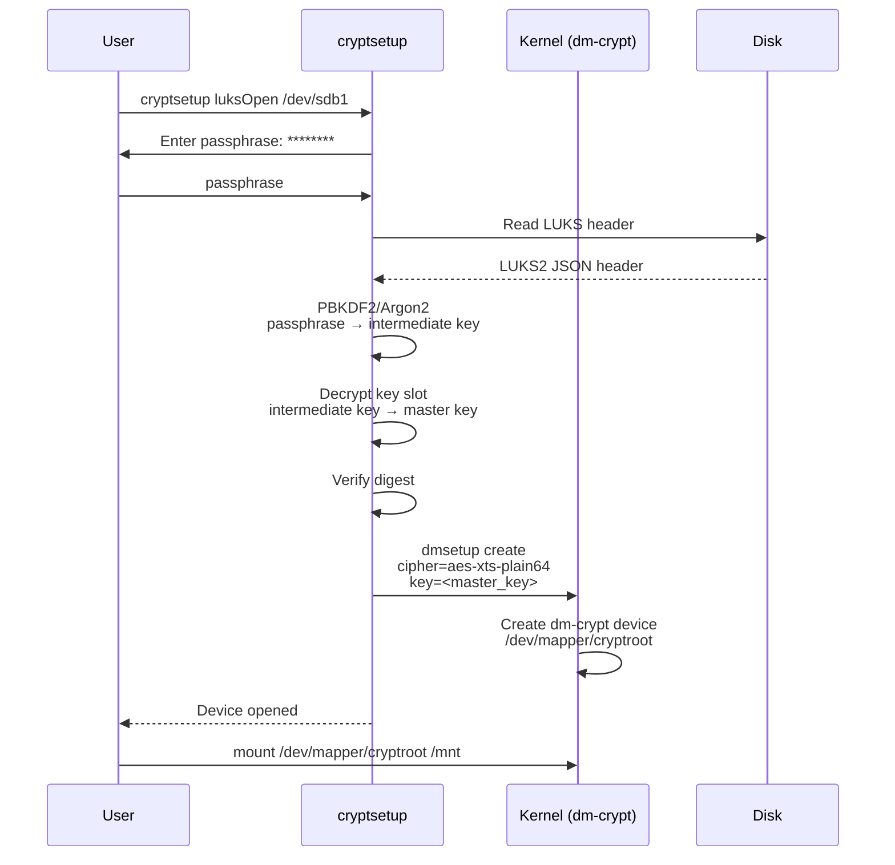
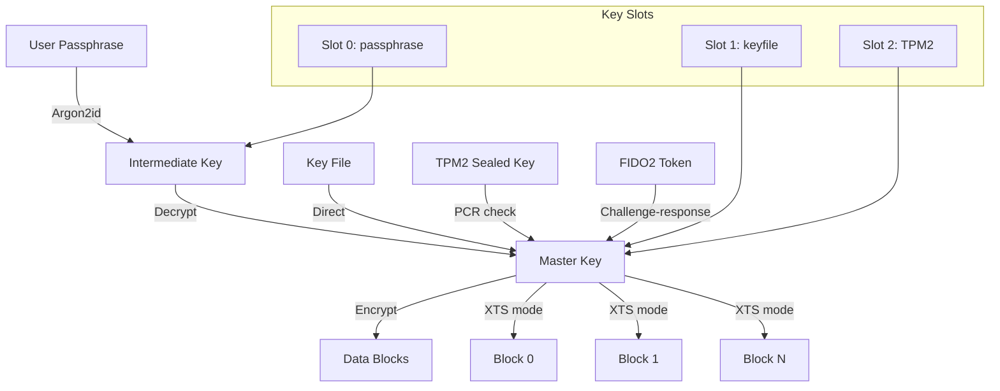

# Chapter 168: Encryption

## 1. Intuition

If someone steals your laptop or hard drive, can they read your data? Without encryption, the answer is yes—simply mount the disk on another system and read everything. Full-disk encryption ensures that without the passphrase or key, the data is just random noise.

Linux provides multiple encryption layers:
- **dm-crypt/LUKS**: Block device encryption (full disk, partitions)
- **eCryptfs**: Filesystem-level encryption (home directories)
- **fscrypt**: Per-directory encryption (ext4, F2FS)
- **Kernel keyring**: Secure key storage

Think of dm-crypt as a safe deposit box (encrypts everything inside), eCryptfs as individual locked drawers (encrypts per-user), and fscrypt as individual file envelopes (encrypts per-directory).

## 2. Architecture

### 2.1 Encryption Stack

```
┌─────────────────────────────────────────────────────────────────┐
│                    Linux Encryption Stack                       │
├─────────────────────────────────────────────────────────────────┤
│                                                                 │
│  ┌──────────────────────────────────────────────────────────┐  │
│  │  Layer 4: Applications                                   │  │
│  │  OpenSSL, GnuPG, filesystem tools                        │  │
│  └──────────────────────────┬───────────────────────────────┘  │
│                              │                                  │
│  ┌──────────────────────────────────────────────────────────┐  │
│  │  Layer 3: Filesystem Encryption                          │  │
│  │  eCryptfs (per-file), fscrypt (per-directory)            │  │
│  └──────────────────────────┬───────────────────────────────┘  │
│                              │                                  │
│  ┌──────────────────────────────────────────────────────────┐  │
│  │  Layer 2: Block Device Encryption                        │  │
│  │  dm-crypt, LUKS1, LUKS2                                  │  │
│  └──────────────────────────┬───────────────────────────────┘  │
│                              │                                  │
│  ┌──────────────────────────────────────────────────────────┐  │
│  │  Layer 1: Device Mapper                                  │  │
│  │  Maps encrypted blocks to physical blocks                │  │
│  └──────────────────────────┬───────────────────────────────┘  │
│                              │                                  │
│  ┌──────────────────────────────────────────────────────────┐  │
│  │  Layer 0: Hardware                                       │  │
│  │  Physical disk, SSD, NVMe                                │  │
│  │  Optional: SED (Self-Encrypting Drive)                   │  │
│  └──────────────────────────────────────────────────────────┘  │
│                                                                 │
│  Key Management:                                                │
│  ┌──────────────────────────────────────────────────────────┐  │
│  │  Kernel Keyring                                          │  │
│  │  Stores encryption keys in kernel memory                 │  │
│  │  Keys tied to user sessions                              │  │
│  └──────────────────────────────────────────────────────────┘  │
│                                                                 │
└─────────────────────────────────────────────────────────────────┘
```

### 2.2 LUKS Architecture

```
┌─────────────────────────────────────────────────────────────────┐
│                    LUKS2 Disk Layout                           │
├─────────────────────────────────────────────────────────────────┤
│                                                                 │
│  ┌──────────────────────────────────────────────────────────┐  │
│  │  LUKS2 Header (JSON)                                     │  │
│  │  ├── Key slots (up to 32)                                │  │
│  │  │   ├── Slot 0: passphrase → key (PBKDF2/Argon2)       │  │
│  │  │   ├── Slot 1: passphrase → key                        │  │
│  │  │   └── Slot N: ...                                      │  │
│  │  ├── Digests                                             │  │
│  │  │   └── Hash of master key (verify key correctness)     │  │
│  │  ├── Segments                                           │  │
│  │  │   └── Encryption algorithm, key, offset               │  │
│  │  └── Tokens                                             │  │
│  │      └── TPM, smartcard, or external key references      │  │
│  └──────────────────────────────────────────────────────────┘  │
│                                                                 │
│  ┌──────────────────────────────────────────────────────────┐  │
│  │  Encrypted Data Area                                     │  │
│  │  (encrypted with master key)                             │  │
│  └──────────────────────────────────────────────────────────┘  │
│                                                                 │
│  Flow:                                                         │
│  passphrase → key slot → PBKDF2/Argon2 → decrypted key →      │
│  → master key → decrypt data blocks                            │
│                                                                 │
└─────────────────────────────────────────────────────────────────┘
```

### 2.3 dm-crypt Operation

```
┌─────────────────────────────────────────────────────────────────┐
│                    dm-crypt Operation                           │
├─────────────────────────────────────────────────────────────────┤
│                                                                 │
│  Application                                                   │
│      │                                                          │
│      ▼                                                          │
│  ┌──────────────┐                                              │
│  │ Filesystem   │ (ext4, XFS, etc.)                            │
│  └──────┬───────┘                                              │
│         │                                                       │
│         ▼                                                       │
│  ┌──────────────┐                                              │
│  │ Device Mapper│ (/dev/mapper/cryptroot)                      │
│  │ ┌──────────┐ │                                              │
│  │ │ dm-crypt │ │                                              │
│  │ │ Encrypt/ │ │                                              │
│  │ │ Decrypt  │ │                                              │
│  │ └──────────┘ │                                              │
│  └──────┬───────┘                                              │
│         │                                                       │
│         ▼                                                       │
│  ┌──────────────┐                                              │
│  │ Block Device │ (/dev/sda2)                                  │
│  └──────────────┘                                              │
│                                                                 │
│  Read path:  physical → decrypt → filesystem → application     │
│  Write path: application → filesystem → encrypt → physical     │
│                                                                 │
└─────────────────────────────────────────────────────────────────┘
```

## 3. Kernel Implementation

### 3.1 Device Mapper Crypt Target

In `drivers/md/dm-crypt.c`:

```c
struct crypt_config {
    struct dm_dev *dev;
    sector_t start;

    /* Cipher information */
    struct crypto_skcipher *tfm;
    unsigned int cipher;
    unsigned int key_size;
    unsigned int key_parts;

    /* Encryption key */
    u8 *key;

    /* IV (Initialization Vector) generation */
    iv_generator *iv_gen;
    void *iv_gen_private;

    /* Sector size */
    unsigned int sector_size;

    /* Flags */
    unsigned long flags;

    /* ... */
};

/* Process a read request */
static int crypt_read(struct crypt_config *cc, struct bio *bio)
{
    /* Allocate clone bio for decryption */
    clone = bio_clone_fast(bio, GFP_NOIO, &crypt_io_pool);

    /* Set up encryption context */
    ctx->cc = cc;
    ctx->bio = bio;
    ctx->sector = bio->bi_iter.bi_sector;

    /* Submit to underlying device */
    clone->bi_end_io = crypt_endio;
    generic_make_request(clone);

    return 0;
}

/* Decrypt completion callback */
static void crypt_endio(struct bio *clone)
{
    struct crypt_config *cc = ctx->cc;

    /* Decrypt the data */
    crypt_convert(cc, ctx);

    /* Complete the original bio */
    bio_endio(ctx->bio);
}
```

### 3.2 Crypto API

dm-crypt uses the kernel's crypto API:

```c
/* Allocate cipher */
tfm = crypto_alloc_skcipher("cbc(aes)", 0, 0);

/* Set key */
crypto_skcipher_setkey(tfm, key, key_size);

/* Encrypt/decrypt */
skcipher_request_set_crypt(req, src, dst, len, iv);
crypto_skcipher_encrypt(req);  /* or _decrypt */
```

### 3.3 LUKS Header Processing

LUKS headers are processed in userspace (cryptsetup), but the kernel sees the dm-crypt table:

```c
/* dm-crypt table format (from dmsetup table):
 * 0 <size> crypt <cipher> <key> <iv_offset> <device> <offset>
 */

/* Example:
 * 0 2097152 crypt aes-xts-plain64 <hex_key> 0 /dev/sda2 4096
 */
```

### 3.4 Kernel Keyring Integration

LUKS2 can use kernel keyring for key management:

```c
/* include/linux/key.h */
struct key {
    refcount_t usage;
    key_serial_t serial;
    union {
        /* ... */
        struct {
            unsigned long datalen;
            char *data;
        } payload;
    };
    /* ... */
};

/* Key types used by encryption */
/* keyctl() syscall for userspace key management */
```

## 4. Source Code References

| Component | File |
|-----------|------|
| dm-crypt | `drivers/md/dm-crypt.c` |
| Device mapper core | `drivers/md/dm.c` |
| Crypto API | `crypto/` (e.g., `crypto/cbc.c`, `crypto/aes.c`) |
| Kernel keyring | `security/keys/` |
| Key type | `include/linux/key.h` |
| eCryptfs | `fs/ecryptfs/` |
| fscrypt | `fs/crypto/` |

## 5. Configuration Examples

### 5.1 LUKS2 Full Disk Encryption

```bash
# Encrypt a partition
sudo cryptsetup luksFormat /dev/sdb1
# WARNING: This will overwrite data on /dev/sdb1
# Enter passphrase: ********
# Verify passphrase: ********

# Open (unlock) the encrypted partition
sudo cryptsetup luksOpen /dev/sdb1 encrypted_data
# Enter passphrase: ********

# Create filesystem on the encrypted device
sudo mkfs.ext4 /dev/mapper/encrypted_data

# Mount
sudo mkdir /mnt/encrypted
sudo mount /dev/mapper/encrypted_data /mnt/encrypted

# Use the encrypted storage
echo "Secret data" > /mnt/encrypted/secret.txt

# Unmount and close
sudo umount /mnt/encrypted
sudo cryptsetup luksClose encrypted_data
```

### 5.2 LUKS2 Advanced Configuration

```bash
# Create LUKS2 with specific parameters
sudo cryptsetup luksFormat \
    --type luks2 \
    --cipher aes-xts-plain64 \
    --key-size 512 \
    --hash sha256 \
    --pbkdf argon2id \
    --pbkdf-memory 1048576 \
    --pbkdf-parallel 4 \
    --iter-time 5000 \
    --label encrypted_vol \
    /dev/sdb1

# Add additional passphrase
sudo cryptsetup luksAddKey /dev/sdb1

# Add key file (for automated unlock)
sudo dd if=/dev/urandom of=/root/keyfile bs=4096 count=1
sudo chmod 600 /root/keyfile
sudo cryptsetup luksAddKey /dev/sdb1 /root/keyfile

# Remove a passphrase
sudo cryptsetup luksRemoveKey /dev/sdb1

# Backup LUKS header (CRITICAL!)
sudo cryptsetup luksHeaderBackup /dev/sdb1 \
    --header-backup-file /root/luks-header-backup.img

# Restore LUKS header
sudo cryptsetup luksHeaderRestore /dev/sdb1 \
    --header-backup-file /root/luks-header-backup.img

# View LUKS information
sudo cryptsetup luksDump /dev/sdb1
```

### 5.3 LUKS with TPM (Sealed Key)

```bash
# Bind LUKS key to TPM2 (auto-unlock if boot chain is trusted)
sudo systemd-cryptenroll --tpm2-device=auto /dev/sdb1

# Or using clevis
sudo clevis luks bind -d /dev/sdb1 tpm2 '{}'

# The key is sealed to PCR values
# If boot chain changes (e.g., new kernel), key won't release

# Manual unlock (fallback)
sudo cryptsetup luksOpen /dev/sdb1 encrypted_data
```

### 5.4 /etc/crypttab for Auto-Unlock

```bash
# /etc/crypttab
# <name> <device> <keyfile> <options>

# Unlock with passphrase at boot
encrypted_data  /dev/sdb1  none  luks

# Unlock with key file
encrypted_data  /dev/sdb1  /root/keyfile  luks

# Unlock with TPM
encrypted_data  /dev/sdb1  none  luks,tpm2-device=auto

# Unlock with remote key (network boot)
encrypted_data  /dev/sdb1  none  luks,keyscript=/usr/lib/cryptsetup/scripts/decrypt_derived

# Generate crypttab entry
sudo cryptsetup luksDump /dev/sdb1 | grep UUID
# UUID: 12345678-1234-1234-1234-123456789abc
# /etc/crypttab:
# encrypted_data  UUID=12345678-1234-1234-1234-123456789abc  none  luks
```

### 5.5 Plain dm-crypt (No LUKS Header)

```bash
# Plain dm-crypt: no header, no key slots, simpler but less flexible
sudo cryptsetup open --type plain \
    --cipher aes-xts-plain64 \
    --key-size 512 \
    --hash sha256 \
    /dev/sdb1 encrypted_data

# Every bit of the device is encrypted (no header)
# No way to recover if you forget the passphrase!
```

### 5.6 eCryptfs (Home Directory Encryption)

```bash
# Install eCryptfs
sudo apt install ecryptfs-utils

# Set up encrypted home directory
sudo ecryptfs-setup-private --wrapping

# Or encrypt an existing home:
# 1. Login as root
# 2. Move user's home
mv /home/alice /home/alice.old
mkdir /home/alice
chown alice:alice /home/alice

# 3. Setup eCryptfs
ecryptfs-setup-private -u alice -l

# 4. Migrate data
# Login as alice, copy files from alice.old

# Mount encrypted directory manually
mount -t ecryptfs /home/alice/.Private /home/alice/Private

# eCryptfs wraps the passphrase with the login password
# When user logs in, home is automatically decrypted
```

### 5.7 fscrypt (Per-Directory Encryption)

```bash
# fscrypt: ext4/F2FS native encryption
# Requires kernel support (4.1+) and filesystem options

# Enable on filesystem
sudo tune2fs -O encrypt /dev/sda1
# Or during creation:
sudo mkfs.ext4 -O encrypt /dev/sda1

# Set up fscrypt
sudo fscrypt setup

# Create encrypted directory
mkdir ~/Private
fscrypt encrypt ~/Private
# Enter passphrase: ********
# Confirm: ********

# Use encrypted directory
echo "secret" > ~/Private/secret.txt
# Data is encrypted on disk, transparent to applications

# Lock directory (remove key from memory)
fscrypt lock ~/Private

# Unlock directory
fscrypt unlock ~/Private
```

### 5.8 fscrypt Policy Configuration

```bash
# /etc/fscrypt.conf
{
    "source": "custom_passphrase",
    "hash_costs": {
        "time": "1000ms",
        "memory": "32MiB",
        "parallelism": "4"
    },
    "filesystems": {
        "/dev/sda1": {
            "mountpoint": "/"
        }
    },
    "options": {
        "padding": "32",
        "contents": "AES_256_XTS",
        "filenames": "AES_256_CTS",
        "policy_version": "2"
    }
}

# Per-directory policy
fscrypt encrypt ~/Private --source=policy --protector=/:login
```

### 5.9 Kernel Keyring

```bash
# View current keyring
keyctl show

# Add a key
keyctl add user mykey "secret data" @u

# Read a key
keyctl read <key_id>

# Link key to session keyring
keyctl link <key_id> @s

# Clear session keyring
keyctl clear @s

# Use keyring with dm-crypt
sudo cryptsetup luksOpen --keyring-key @u:mykey /dev/sdb1 encrypted_data
```

### 5.10 LUKS2 Tokens (External Key Management)

```bash
# LUKS2 supports tokens for external key management

# Add a systemd-tpm2 token
sudo systemd-cryptenroll --tpm2-device=auto /dev/sdb1

# Add a PKCS#11 token (smartcard)
sudo systemd-cryptenroll --pkcs11-token-uri=auto /dev/sdb1

# Add a FIDO2 token
sudo systemd-cryptenroll --fido2-device=auto /dev/sdb1

# View tokens
sudo cryptsetup token list /dev/sdb1
```

## 6. Diagrams

### 6.1 LUKS Unlock Flow



### 6.2 Encryption Layer Stack

```mermaid
graph TB
    subgraph "Application Layer"
        APP[Application reads/writes files]
    end

    subgraph "Filesystem Layer"
        FS[ext4 / XFS / Btrfs]
        EC[eCryptfs - per-file]
        FC[fscrypt - per-directory]
    end

    subgraph "Block Device Layer"
        DM[Device Mapper]
        DC[dm-crypt]
        LUKS[LUKS2 header]
    end

    subgraph "Physical Layer"
        DISK[Physical Disk / SSD]
        HW[Hardware Encryption (SED)]
    end

    APP --> FS
    FS --> EC
    FS --> FC
    EC --> DM
    FC --> DM
    DM --> DC
    DC --> LUKS
    LUKS --> DISK
    DISK --> HW
```

### 6.3 Key Hierarchy



## 7. Common Pitfalls

### 7.1 LOST LUKS HEADER = LOST DATA

```bash
# THE LUKS HEADER CONTAINS THE ENCRYPTED MASTER KEY
# If the header is damaged, data is UNRECOVERABLE

# ALWAYS backup the header:
sudo cryptsetup luksHeaderBackup /dev/sdb1 \
    --header-backup-file /root/luks-header-backup.img

# Store the backup separately from the encrypted device!
```

### 7.2 Weak Passphrase

```bash
# LUKS security depends on passphrase strength
# A weak passphrase can be brute-forced

# Use a strong passphrase (20+ characters, random)
# Or use a keyfile

# Argon2id helps against brute force:
sudo cryptsetup luksFormat --pbkdf argon2id \
    --pbkdf-memory 1048576 \
    --pbkdf-parallel 4 \
    --iter-time 5000 \
    /dev/sdb1
```

### 7.3 Forgetting Passphrase

```bash
# If you forget the LUKS passphrase and have no keyfile:
# DATA IS LOST (by design)

# Prevention:
# 1. Add multiple key slots
sudo cryptsetup luksAddKey /dev/sdb1
# 2. Backup keyfile securely
# 3. Store recovery passphrase in a safe
```

### 7.4 TRIM and Encryption

```bash
# SSD TRIM leaks information about encrypted data (which blocks are used)
# Some security models require disabling TRIM

# Allow TRIM (default, better performance):
sudo cryptsetup open --allow-discards /dev/sdb1 encrypted_data

# /etc/crypttab:
encrypted_data  /dev/sdb1  none  luks,discard

# Disable TRIM (more secure):
# Don't use the discard option
```

### 7.5 Swap Encryption

```bash
# Unencrypted swap can leak sensitive data!

# Encrypt swap:
# /etc/crypttab
swap  /dev/sda2  /dev/urandom  swap,cipher=aes-xts-plain64,size=256

# Or use random key (re-encrypted each boot):
# swap  /dev/sda2  /dev/urandom  swap
```

### 7.6 Performance Impact

```bash
# Encryption adds CPU overhead
# AES-NI hardware acceleration helps significantly

# Check if AES-NI is available:
grep aes /proc/cpuinfo

# Benchmark:
cryptsetup benchmark
# Tests various ciphers and shows speed

# For most workloads, AES-XTS with AES-NI is fast enough
```

### 7.7 LUKS1 vs LUKS2

```bash
# LUKS1: original format, widely compatible
# LUKS2: newer, more flexible (Argon2, tokens, JSON header)

# Use LUKS2 for new setups:
sudo cryptsetup luksFormat --type luks2 /dev/sdb1

# Convert LUKS1 to LUKS2:
sudo cryptsetup convert /dev/sdb1 --type luks2

# Cannot convert back to LUKS1!
```

## 8. Best Practices

### 8.1 Always Backup LUKS Headers

```bash
# After creating LUKS partition, immediately backup header:
sudo cryptsetup luksHeaderBackup /dev/sdb1 \
    --header-backup-file /root/luks-$(blkid -s UUID -o value /dev/sdb1)-header.img

# Store on separate device, encrypted if possible
# Without the header, data is UNRECOVERABLE
```

### 8.2 Use Argon2id for Key Derivation

```bash
sudo cryptsetup luksFormat --type luks2 \
    --pbkdf argon2id \
    --pbkdf-memory 1048576 \
    --pbkdf-parallel 4 \
    --iter-time 5000 \
    /dev/sdb1
```

### 8.3 Multiple Authentication Methods

```bash
# Add multiple key slots for different scenarios:
# Slot 0: Passphrase (human)
sudo cryptsetup luksAddKey /dev/sdb1

# Slot 1: Key file (automated unlock)
sudo dd if=/dev/urandom of=/root/keyfile bs=4096 count=1
sudo chmod 600 /root/keyfile
sudo cryptsetup luksAddKey /dev/sdb1 /root/keyfile

# Slot 2: TPM2 sealed key (auto-unlock on trusted boot)
sudo systemd-cryptenroll --tpm2-device=auto /dev/sdb1
```

### 8.4 Encrypt Swap

```bash
# /etc/crypttab
cryptswap  /dev/sda2  /dev/urandom  swap,cipher=aes-xts-plain64,size=256

# /etc/fstab
/dev/mapper/cryptswap  none  swap  sw  0  0
```

### 8.5 Combine Encryption Layers

```bash
# Full disk encryption (LUKS) + home directory encryption (fscrypt)
# Provides defense in depth

# LUKS protects against physical theft
# fscrypt provides per-user isolation even when disk is unlocked
```

### 8.6 Monitor Encryption Status

```bash
# Check LUKS status
sudo cryptsetup status encrypted_data
# /dev/mapper/encrypted_data is active and is in use.
#   type:    LUKS2
#   cipher:  aes-xts-plain64
#   keysize: 512 bits
#   ...

# Verify encryption is working
sudo dmsetup table --showkeys encrypted_data
```

## 9. Exercises

### Exercise 1: LUKS Setup

1. Create a LUKS2 encrypted partition
2. Add two passphrases
3. Backup the LUKS header
4. Open, format, mount, and write data
5. Close and verify data is inaccessible

### Exercise 2: Key Management

1. Create a key file
2. Add it to a LUKS partition
3. Configure /etc/crypttab for auto-unlock
4. Test automated unlock at boot
5. Remove the key file and verify it no longer works

### Exercise 3: fscrypt

1. Enable fscrypt on an ext4 filesystem
2. Create an encrypted directory
3. Write files and verify they're encrypted on disk
4. Lock and unlock the directory
5. Compare performance with and without encryption

### Exercise 4: TPM2 Integration

1. Configure LUKS with TPM2 sealed key
2. Test auto-unlock on boot
3. Modify boot chain and verify auto-unlock fails
4. Use recovery passphrase as fallback

### Exercise 5: Performance Benchmarking

1. Run `cryptsetup benchmark` and record results
2. Compare AES-XTS-plain64 with different key sizes
3. Test real-world I/O with and without encryption
4. Verify AES-NI hardware acceleration is active

## 10. References

1. **cryptsetup man page**: `cryptsetup(8)`
2. **dm-crypt documentation**: `Documentation/admin-guide/device-mapper/dm-crypt.rst`
3. **LUKS specification**: https://gitlab.com/cryptsetup/cryptsetup/-/wikis/LUKS-standard
4. **fscrypt documentation**: `Documentation/filesystems/fscrypt.rst`
5. **eCryptfs**: https://ecryptfs.org/
6. **kernel source**: `drivers/md/dm-crypt.c`, `fs/crypto/`, `fs/ecryptfs/`
7. **cryptsetup source**: https://gitlab.com/cryptsetup/cryptsetup
8. **systemd-cryptenroll**: `systemd-cryptenroll(1)`
9. **ArchWiki dm-crypt**: https://wiki.archlinux.org/title/Dm-crypt
10. **NIST SP 800-132**: Recommendation for Password-Based Key Derivation
