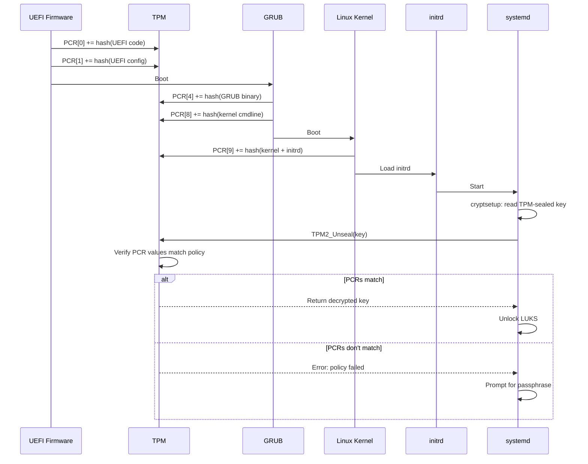
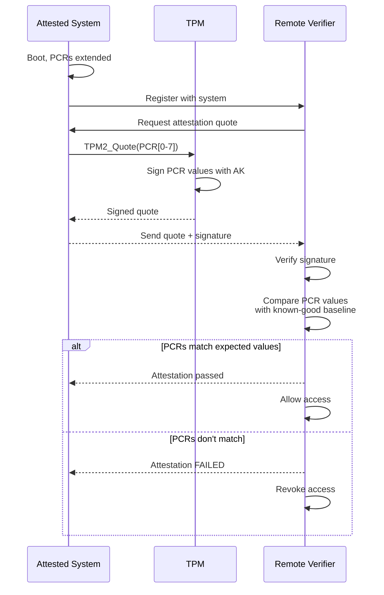

# Chapter 169: TPM (Trusted Platform Module)

## 1. Intuition

Imagine a small, tamper-resistant chip on your motherboard that can generate cryptographic keys, encrypt data, and verify that your system hasn't been tampered with. That's a TPM (Trusted Platform Module). It's a hardware root of trust—a secure co-processor that even a fully compromised operating system can't fully subvert.

TPMs are used for:
- **Sealed storage**: Encrypting keys that are only released when the system is in a known good state
- **Measured boot**: Recording cryptographic measurements of every component that runs during boot
- **Remote attestation**: Proving to a remote server that your system is trustworthy
- **Disk encryption**: Sealing LUKS keys to the TPM so they're released only on trusted boots

Think of a TPM as a safe inside your computer. You can put keys in the safe, and the safe only opens when the computer is in a specific state. If someone tampers with the computer, the safe stays locked.

## 2. Architecture

### 2.1 TPM Components

```
┌─────────────────────────────────────────────────────────────────┐
│                    TPM Architecture                             │
├─────────────────────────────────────────────────────────────────┤
│                                                                 │
│  ┌──────────────────────────────────────────────────────────┐  │
│  │                    TPM 2.0 Chip                          │  │
│  │                                                          │  │
│  │  ┌──────────────────────────────────────────────────┐   │  │
│  │  │  Cryptographic Engine                              │   │  │
│  │  │  RSA, ECC, SHA-256, HMAC, AES                     │   │  │
│  │  │  True Random Number Generator (TRNG)              │   │  │
│  │  └──────────────────────────────────────────────────┘   │  │
│  │                                                          │  │
│  │  ┌──────────────────────────────────────────────────┐   │  │
│  │  │  Platform Configuration Registers (PCRs)          │   │  │
│  │  │  PCR[0]: UEFI firmware                           │   │  │
│  │  │  PCR[1]: UEFI configuration                      │   │  │
│  │  │  PCR[2]: Option ROMs                             │   │  │
│  │  │  PCR[3]: Option ROM configuration                │   │  │
│  │  │  PCR[4]: Boot loader (grub/systemd-boot)         │   │  │
│  │  │  PCR[5]: GPT partition table                     │   │  │
│  │  │  PCR[6]: Resume from hibernation                 │   │  │
│  │  │  PCR[7]: Secure Boot state                       │   │  │
│  │  │  PCR[8]: Boot loader commands                    │   │  │
│  │  │  PCR[9]: Kernel & initrd                         │   │  │
│  │  └──────────────────────────────────────────────────┘   │  │
│  │                                                          │  │
│  │  ┌──────────────────────────────────────────────────┐   │  │
│  │  │  Key Hierarchy                                    │   │  │
│  │  │  Storage Root Key (SRK)                          │   │  │
│  │  │    └── Key 1 → Key 2 → ...                       │   │  │
│  │  │  Keys never leave the TPM (wrapped/encrypted)    │   │  │
│  │  └──────────────────────────────────────────────────┘   │  │
│  │                                                          │  │
│  │  ┌──────────────────────────────────────────────────┐   │  │
│  │  │  Endorsement Key (EK)                            │   │  │
│  │  │  Unique per TPM, burned in at manufacturing      │   │  │
│  │  │  Used for attestation                            │   │  │
│  │  └──────────────────────────────────────────────────┘   │  │
│  │                                                          │  │
│  └──────────────────────────────────────────────────────────┘  │
│                                                                 │
│  Communication: TPM Interface (TIS) over LPC/SPI/I2C/CRB      │
│                                                                 │
└─────────────────────────────────────────────────────────────────┘
```

### 2.2 Measured Boot Chain

```
┌─────────────────────────────────────────────────────────────────┐
│                    Measured Boot Chain                          │
├─────────────────────────────────────────────────────────────────┤
│                                                                 │
│  ┌──────────────┐                                              │
│  │  UEFI       │→ PCR[0,1] += hash(firmware)                  │
│  │  Firmware    │                                              │
│  └──────┬───────┘                                              │
│         │                                                       │
│         ▼                                                       │
│  ┌──────────────┐                                              │
│  │  Boot Loader │→ PCR[4] += hash(bootloader)                 │
│  │  (grub)      │→ PCR[8] += hash(kernel command line)        │
│  └──────┬───────┘                                              │
│         │                                                       │
│         ▼                                                       │
│  ┌──────────────┐                                              │
│  │  Kernel      │→ PCR[9] += hash(kernel + initrd)            │
│  │  + initrd    │                                              │
│  └──────┬───────┘                                              │
│         │                                                       │
│         ▼                                                       │
│  ┌──────────────┐                                              │
│  │  Userspace   │                                              │
│  │  (systemd)   │                                              │
│  └──────────────┘                                              │
│                                                                 │
│  At any point, the PCR values can be read to verify the boot   │
│  chain hasn't been tampered with.                              │
│                                                                 │
└─────────────────────────────────────────────────────────────────┘
```

### 2.3 Sealed Key Release

```
┌─────────────────────────────────────────────────────────────────┐
│                    Sealed Key Release                           │
├─────────────────────────────────────────────────────────────────┤
│                                                                 │
│  Normal Boot:                                                   │
│  ┌─────────┐    ┌─────────┐    ┌─────────┐    ┌──────────┐   │
│  │ UEFI    │───▶│ GRUB    │───▶│ Kernel  │───▶│ systemd- │   │
│  │         │    │         │    │         │    │ cryptsetup│   │
│  └─────────┘    └─────────┘    └─────────┘    └────┬─────┘   │
│                                                      │         │
│  PCR values: [expected]                              │         │
│  TPM releases sealed key ───────────────────────────▶│         │
│  LUKS key decrypted, disk unlocked                   │         │
│                                                                 │
│  Tampered Boot:                                                 │
│  ┌─────────┐    ┌─────────┐    ┌─────────┐    ┌──────────┐   │
│  │ UEFI    │───▶│ GRUB    │───▶│ Kernel  │───▶│ systemd- │   │
│  │ (mod)   │    │ (mod)   │    │ (mod)   │    │ cryptsetup│   │
│  └─────────┘    └─────────┘    └─────────┘    └────┬─────┘   │
│                                                      │         │
│  PCR values: [different]                             │         │
│  TPM refuses to release key ────────────────────────▶│         │
│  Disk remains encrypted, system cannot boot           │         │
│                                                                 │
└─────────────────────────────────────────────────────────────────┘
```

## 3. Kernel Implementation

### 3.1 TPM Driver

The TPM driver is in `drivers/char/tpm/`:

```c
/* drivers/char/tpm/tpm-chip.c */
struct tpm_chip {
    struct device dev;
    struct device devs;
    struct cdev cdev;
    struct cdev cdevs;

    /* TPM version */
    enum tpm_chip_flags flags;
    u32 nr_commands;
    u32 *cc_attrs_tbl;

    /* TPM operations */
    const struct tpm_class_ops *ops;

    /* State */
    struct tpm_space space;
    struct tpm_bios_log log;

    /* Power management */
    bool suspended;
};

/* TPM 2.0 operations */
static const struct tpm_class_ops tpm2_ops = {
    .flags = TPM_OPS_AUTO_STARTUP,
    .recv = tpm2_recv,
    .send = tpm2_send,
    .cancel = tpm2_cancel,
    .req_canceled = tpm2_req_catched,
    .request_locality = tpm2_request_locality,
    .relinquish_locality = tpm2_relinquish_locality,
    .clk_enable = tpm2_clk_enable,
    .req_complete_mask = TPM2_STS_SE,
    .req_complete_val = TPM2_STS_SE,
};
```

### 3.2 PCR Operations

```c
/* drivers/char/tpm/tpm2-cmd.c */
int tpm2_pcr_read(struct tpm_chip *chip, u32 pcr_idx, u8 *digest)
{
    struct tpm2_cmd cmd = {
        .header.in = tpm2_header(TPM2_ST_NO_SESSIONS, 0, TPM2_CC_PCR_READ),
    };

    /* Build PCR read command */
    cmd.params.pcrread_in.pcr_select_in.count = cpu_to_be32(1);
    cmd.params.pcrread_in.pcr_select_in.pcr_selects[0].sizeof_select = 3;
    cmd.params.pcrread_in.pcr_select_in.pcr_selects[0].pcr_select[pcr_idx / 8] =
        1 << (pcr_idx % 8);

    /* Send to TPM */
    rc = tpm_transmit_cmd(chip, &cmd, sizeof(cmd), "read PCR");

    /* Copy result */
    memcpy(digest, cmd.params.pcrread_out.digest, TPM2_DIGEST_SIZE);

    return 0;
}

int tpm2_pcr_extend(struct tpm_chip *chip, u32 pcr_idx,
                    struct tpm2_digest *digest)
{
    struct tpm2_cmd cmd = {
        .header.in = tpm2_header(TPM2_ST_SESSIONS, 0, TPM2_CC_PCR_EXTEND),
    };

    /* Build PCR extend command */
    cmd.params.pcrextend_in.pcr_idx = cpu_to_be32(pcr_idx);
    memcpy(&cmd.params.pcrextend_in.digest, digest, sizeof(*digest));

    /* Send to TPM */
    return tpm_transmit_cmd(chip, &cmd, sizeof(cmd), "extend PCR");
}
```

### 3.3 Key Sealing/Unsealing

```c
/* TPM2_Seal: Encrypt data with PCR policy */
int tpm2_seal(struct tpm_chip *chip, u8 *data, size_t data_len,
              u8 *sealed_blob, size_t *sealed_len,
              u32 pcr_mask)
{
    /* Create policy that requires specific PCR values */
    /* Create sealed object with policy */
    /* Return sealed blob */
}

/* TPM2_Unseal: Decrypt data if PCR policy is satisfied */
int tpm2_unseal(struct tpm_chip *chip, u8 *sealed_blob, size_t sealed_len,
                u8 *data, size_t *data_len)
{
    /* TPM verifies current PCR values match policy */
    /* If match: decrypt and return data */
    /* If no match: return error */
}
```

### 3.4 IMA (Integrity Measurement Architecture)

IMA extends PCR[10] with measurements of executed files:

```c
/* security/integrity/ima/ima_main.c */
int ima_file_check(struct file *file, int mask)
{
    /* Measure the file */
    ima_measure_and_collect(file);

    /* Check against policy */
    return ima_appraise(file);
}
```

## 4. Source Code References

| Component | File |
|-----------|------|
| TPM core | `drivers/char/tpm/tpm-chip.c` |
| TPM 2.0 commands | `drivers/char/tpm/tpm2-cmd.c` |
| TPM interface | `drivers/char/tpm/tpm_tis_core.c` |
| TPM CRB | `drivers/char/tpm/tpm_crb.c` |
| IMA | `security/integrity/ima/` |
| EVM | `security/integrity/evm/` |
| Keyring | `security/keys/` |
| UEFI stub | `arch/x86/boot/compressed/` |

## 5. Configuration Examples

### 5.1 TPM2 Tools Installation

```bash
# Install tpm2-tools
sudo apt install tpm2-tools   # Debian/Ubuntu
sudo dnf install tpm2-tools   # Fedora/RHEL

# Check TPM presence
sudo tpm2_getcap properties-fixed
# TPM2_FAMILY: 2.0
# TPM2_MANUFACTURER: ...
# TPM2_FIRMWARE_VERSION: ...

# View TPM capabilities
sudo tpm2_getcap algorithms
sudo tpm2_getcap pcrs
sudo tpm2_getcap commands
```

### 5.2 PCR Operations

```bash
# Read PCR values
sudo tpm2_pcrread sha256
# sha256:
#   0 : 0x1234... (UEFI firmware)
#   1 : 0x5678... (UEFI config)
#   4 : 0x9abc... (bootloader)
#   7 : 0xdef0... (Secure Boot state)

# Read specific PCR
sudo tpm2_pcrread sha256:4,7

# Extend PCR (add measurement)
echo -n "measurement data" | sudo tpm2_pcrextend 10 -i -
# PCR[10] now includes hash of "measurement data"
```

### 5.3 Seal Data to TPM

```bash
# Create a primary key
sudo tpm2_createprimary -C o -c primary.ctx

# Create a policy that requires specific PCR values
sudo tpm2_startauthsession -S session.ctx
sudo tpm2_policypcr -S session.ctx -l sha256:0,2,4,7 -L policy.dat
sudo tpm2_flushcontext session.ctx

# Seal data with PCR policy
echo "secret key" > secret.txt
sudo tpm2_create -C primary.ctx -u seal.pub -r seal.priv \
    -i secret.txt -L policy.dat

# Load the sealed object
sudo tpm2_load -C primary.ctx -u seal.pub -r seal.priv -c seal.ctx

# Unseal (only works if PCR values match policy)
sudo tpm2_unseal -c seal.ctx -p session:session.ctx
# If PCRs have changed (tampered boot), this FAILS
```

### 5.4 systemd-cryptenroll (TPM2)

```bash
# Bind LUKS key to TPM2
sudo systemd-cryptenroll --tpm2-device=auto /dev/sda2

# Bind with specific PCR policy
sudo systemd-cryptenroll \
    --tpm2-device=auto \
    --tpm2-pcrs=0+2+4+7 \
    /dev/sda2

# View enrollment
sudo systemd-cryptenroll /dev/sda2

# Remove TPM2 enrollment
sudo systemd-cryptenroll --wipe-slot=tpm2 /dev/sda2
```

### 5.5 Clevis (TPM2 Binding)

```bash
# Install clevis
sudo apt install clevis clevis-luks clevis-tpm2

# Bind LUKS to TPM2
sudo clevis luks bind -d /dev/sda2 tpm2 '{}'

# Or with specific PCR policy
sudo clevis luks bind -d /dev/sda2 tpm2 '{"pcr_bank":"sha256","pcr_ids":"0,2,4,7"}'

# Test unlock
sudo clevis luks unlock -d /dev/sda2 -n encrypted

# Unbind
sudo clevis luks unbind -d /dev/sda2 -s 1 tpm2
```

### 5.6 Keylime (Remote Attestation)

```bash
# Install Keylime agent (on attested system)
sudo apt install keylime-agent

# Configure agent
# /etc/keylime/agent.conf
[agent]
uuid = <unique-uuid>
tpm_hash_alg = sha256
tpm_encryption_alg = rsa

# Register with verifier
sudo keylime_tenant -c add \
    -t <agent-ip> \
    -v <verifier-ip> \
    --cert /etc/keylime/ssl \
    --include payload

# Keylime continuously verifies TPM quotes
# If PCR values change, it can revoke access
```

### 5.7 Measured Boot with systemd-boot

```bash
# systemd-boot automatically extends PCRs during boot
# PCR[4]: sd-stub + kernel
# PCR[9]: kernel command line + initrd

# Verify measurements
sudo tpm2_pcrread sha256:4,9

# Check boot log
sudo journalctl -b | grep -i tpm
# Shows which measurements were extended

# systemd-pcrlock (newer):
# Generates expected PCR values from boot log
sudo systemd-pcrlock make-policy
```

### 5.8 TPM2 Device Files

```bash
# TPM device files
ls -la /dev/tpm*
# crw-rw---- 1 tss tss 10, 224 ... /dev/tpm0
# crw-rw---- 1 tss tss 10, 225 ... /dev/tpmrm0

# /dev/tpm0: Direct TPM access (not recommended)
# /dev/tpmrm0: Resource manager (recommended, handles concurrent access)

# Permissions: typically owned by tss group
sudo usermod -aG tss $USER  # Add user to tss group
```

### 5.9 TPM2 Software Emulator

```bash
# For testing without hardware TPM:
sudo apt install swtpm swtpm-tools tpm2-abrmd

# Start TPM simulator
swtpm socket --tpmstate dir=/tmp/tpm \
    --ctrl type=tcp,port=2322 \
    --server type=tcp,port=2321 \
    --flags not-need-init --tpm2

# Start resource manager
sudo tpm2-abrmd --tcti=swtpm:host=localhost,port=2321 &

# Use with tpm2-tools
export TPM2TOOLS_TCTI="tabrmd:bus_type=system"
sudo tpm2_getcap properties-fixed
```

## 6. Diagrams

### 6.1 TPM Key Hierarchy

```mermaid
graph TD
    EK[Endorsement Key EK<br/>Burned into TPM] -->|wraps| SRK[Storage Root Key SRK]
    SRK -->|wraps| K1[Key 1: Disk Encryption]
    SRK -->|wraps| K2[Key 2: Application Key]
    SRK -->|wraps| K3[Key 3: Attestation Key]
    K1 -->|seals| D1[LUKS Master Key]
    K2 -->|seals| D2[Application Secret]
    K3 -->|signs| Q[TPM Quote]

    PCR[PCR Policy<br/>PCR[0,2,4,7]] -.->|required to unseal| D1
    PCR -.->|required to unseal| D2
```

### 6.2 Measured Boot Chain



### 6.3 Remote Attestation Flow



## 7. Common Pitfalls

### 7.1 PCR Changes After Kernel Update

```bash
# After kernel update, PCR[9] changes (different kernel hash)
# TPM-sealed keys won't unseal!

# Solutions:
# 1. Re-seal after each kernel update
sudo systemd-cryptenroll --tpm2-device=auto /dev/sda2

# 2. Use PCR policy that excludes PCR[9]
sudo systemd-cryptenroll --tpm2-pcrs=0+2+4+7 /dev/sda2

# 3. Use TPM2 policy with authorized PCR values
```

### 7.2 TPM2 vs TPM 1.2

```bash
# TPM 2.0 and TPM 1.2 are NOT compatible
# Different commands, different APIs, different tools

# Check which version you have:
cat /sys/class/tpm/tpm0/tpm_version_major
# 2 (TPM 2.0) or 1 (TPM 1.2)

# Use tpm2-tools for TPM 2.0
# Use tpm-tools for TPM 1.2
```

### 7.3 TPM State Across Reboots

```bash
# PCRs are reset on reboot and re-extended during boot
# Sealed keys are only available after a clean boot

# If someone modifies the bootloader and boots a different kernel:
# PCRs will be different
# Sealed keys won't release

# This is BY DESIGN - it's the security guarantee
```

### 7.4 TPM and Virtual Machines

```bash
# vTPM (virtual TPM) for VMs
# QEMU/KVM: swtpm (software TPM emulator)

# Start VM with vTPM:
qemu-system-x86_64 \
    -chardev socket,id=chrtpm,path=/tmp/tpm.sock \
    -tpmdev emulator,id=tpm0,chardev=chrtpm \
    -device tpm-tis,tpmdev=tpm0 \
    ...
```

### 7.5 TPM Ownership

```bash
# A new TPM must be "taken ownership" before use
# This creates the Storage Root Key (SRK)

# Modern tools handle this automatically:
sudo tpm2_createprimary -C o -c primary.ctx

# Clearing TPM (factory reset):
sudo tpm2_clear
# WARNING: This destroys all sealed keys!
```

### 7.6 TPM and BIOS Settings

```bash
# Some BIOS settings affect PCR values:
# - Secure Boot on/off → PCR[7]
# - Boot order → PCR[4,5]
# - BIOS password → PCR[1]

# If you change BIOS settings after sealing, unseal may fail
# Document the expected PCR values for your system
```

## 8. Best Practices

### 8.1 Use TPM2 for Disk Encryption

```bash
# Seal LUKS key to TPM with PCR policy
sudo systemd-cryptenroll \
    --tpm2-device=auto \
    --tpm2-pcrs=0+2+4+7 \
    /dev/sda2

# Keep a recovery passphrase!
sudo cryptsetup luksAddKey /dev/sda2
```

### 8.2 Implement Measured Boot

```bash
# Use systemd-boot (measures automatically)
# Use Secure Boot (PCR[7] reflects state)
# Use IMA for runtime measurements

# Verify measurements:
sudo tpm2_pcrread sha256:0,2,4,7
```

### 8.3 Remote Attestation

```bash
# For servers, use Keylime for continuous attestation
# Verifies system integrity on every connection

# For clients, use TPM2 quotes during authentication
```

### 8.4 Protect TPM Access

```bash
# Restrict TPM device access
# /etc/udev/rules.d/99-tpm.rules
KERNEL=="tpm[0-9]*", GROUP="tss", MODE="0660"
KERNEL=="tpmrm[0-9]*", GROUP="tss", MODE="0660"

# Only authorized users/services should access TPM
sudo usermod -aG tss <service-user>
```

### 8.5 Document PCR Policies

```bash
# Record expected PCR values for your system
sudo tpm2_pcrread sha256 > /root/pcr-baseline.txt

# Use for verification:
# - After firmware updates
# - Before sealing keys
# - During incident response
```

### 8.6 Backup Sealed Keys

```bash
# LUKS header backup includes sealed key metadata
sudo cryptsetup luksHeaderBackup /dev/sda2 \
    --header-backup-file /root/luks-header-backup.img

# Keep recovery passphrase separate from TPM-sealed key
```

## 9. Exercises

### Exercise 1: TPM Discovery

1. Check if your system has a TPM
2. Determine the TPM version
3. List all PCR banks and current values
4. Identify which boot components extend which PCRs

### Exercise 2: Seal and Unseal

1. Create a primary key in the TPM
2. Seal a secret message to the TPM with PCR policy
3. Verify unsealing works when PCRs match
4. Extend a PCR and verify unsealing fails

### Exercise 3: LUKS + TPM2

1. Set up LUKS encryption on a test partition
2. Bind the key to TPM2 using systemd-cryptenroll
3. Test automatic unlock
4. Modify boot chain and verify auto-unlock fails
5. Use recovery passphrase as fallback

### Exercise 4: Measured Boot Verification

1. Read PCR values at different boot stages
2. Record the expected values
3. Compare with current values
4. Identify any changes

### Exercise 5: TPM2 Emulation

1. Set up swtpm (software TPM emulator)
2. Run tpm2-tools against the emulator
3. Test seal/unseal operations
4. Compare with hardware TPM behavior

## 10. References

1. **TPM 2.0 Specification**: https://trustedcomputinggroup.org/resource/tpm-library-specification/
2. **tpm2-tools**: https://github.com/tpm2-software/tpm2-tools
3. **tpm2-tss**: https://github.com/tpm2-software/tpm2-tss
4. **systemd-cryptenroll**: `systemd-cryptenroll(1)`
5. **Linux kernel source**: `drivers/char/tpm/` — TPM drivers
6. **IMA/EVM**: `Documentation/security/IMA.rst`
7. **Keylime**: https://keylime.dev/
8. **swtpm**: https://github.com/stefanberger/swtpm
9. **ArchWiki TPM**: https://wiki.archlinux.org/title/Trusted_Platform_Module
10. **NIST SP 800-155**: BIOS Integrity Measurement Guidelines
