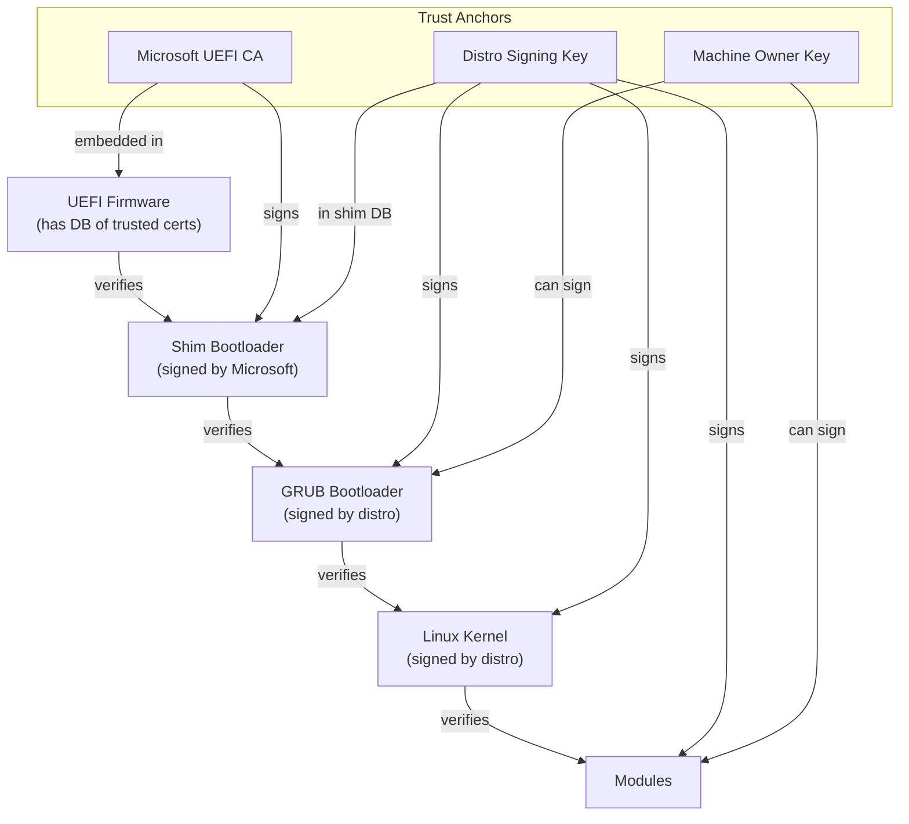
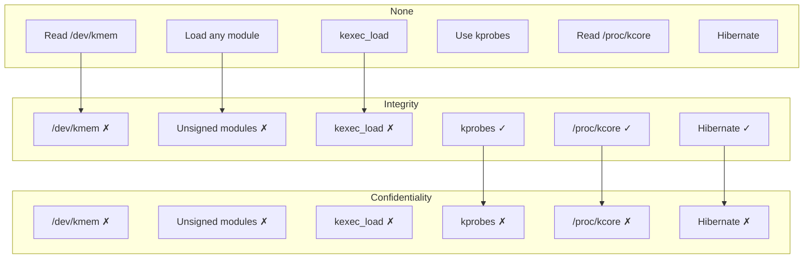
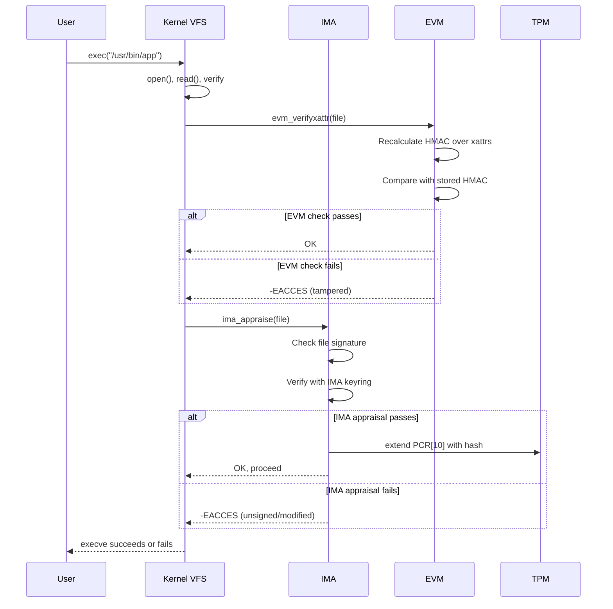

# Chapter 170: Kernel Lockdown and Secure Boot

## 1. Intuition

Even with all the security measures we've discussed—SELinux, seccomp, capabilities, TPM—there's a fundamental problem: the kernel itself is all-powerful. A kernel-level exploit can bypass any security mechanism because the kernel IS the security mechanism. Kernel lockdown and Secure Boot address this by establishing a chain of trust from hardware to userspace.

**Secure Boot** verifies that every piece of code that runs during boot is signed by a trusted authority. It starts from the UEFI firmware and extends through the bootloader to the kernel.

**Kernel Lockdown** is a security mode that restricts what even root can do with the kernel. In lockdown mode, root cannot load unsigned modules, read kernel memory, or modify kernel parameters. It's the final step: after verifying the boot chain, lock down the kernel so even a compromised root account can't subvert it.

Together with IMA/EVM (Integrity Measurement Architecture / Extended Verification Module), they form Linux's integrity subsystem—ensuring that the system runs only trusted code, from the first instruction to the last.

## 2. Architecture

### 2.1 Secure Boot Chain

```
┌─────────────────────────────────────────────────────────────────┐
│                    Secure Boot Chain                            │
├─────────────────────────────────────────────────────────────────┤
│                                                                 │
│  ┌──────────────┐                                              │
│  │  UEFI       │ Has built-in DB of trusted certificates      │
│  │  Firmware    │ Microsoft UEFI CA (for Linux distros)        │
│  └──────┬───────┘                                              │
│         │ Verifies signature                                   │
│         ▼                                                       │
│  ┌──────────────┐                                              │
│  │  Shim        │ First-stage bootloader                       │
│  │  (signed by  │ Signed by Microsoft                         │
│  │   Microsoft) │ Contains distro's certificate                │
│  └──────┬───────┘                                              │
│         │ Verifies signature                                   │
│         ▼                                                       │
│  ┌──────────────┐                                              │
│  │  GRUB        │ Second-stage bootloader                      │
│  │  (signed by  │ Signed by distro                            │
│  │   distro)    │                                              │
│  └──────┬───────┘                                              │
│         │ Verifies signature                                   │
│         ▼                                                       │
│  ┌──────────────┐                                              │
│  │  Linux       │ Kernel + initrd                              │
│  │  Kernel      │ Signed by distro                            │
│  │  (signed)    │ Verifies module signatures                  │
│  └──────┬───────┘                                              │
│         │                                                       │
│         ▼                                                       │
│  ┌──────────────┐                                              │
│  │  Kernel      │ Lockdown mode active                        │
│  │  Lockdown    │ Restricts root access to kernel internals   │
│  └──────────────┘                                              │
│                                                                 │
└─────────────────────────────────────────────────────────────────┘
```

### 2.2 Lockdown Modes

```
┌─────────────────────────────────────────────────────────────────┐
│                    Kernel Lockdown Modes                        │
├─────────────────────────────────────────────────────────────────┤
│                                                                 │
│  ┌──────────────────────────────────────────────────────────┐  │
│  │  None (disabled)                                         │  │
│  │  Root has full access to kernel internals                │  │
│  │  Can read /dev/kmem, load any module, use kexec          │  │
│  └──────────────────────────────────────────────────────────┘  │
│                                                                 │
│  ┌──────────────────────────────────────────────────────────┐  │
│  │  Integrity                                              │  │
│  │  Prevents modification of running kernel                 │  │
│  │  Blocks: /dev/kmem, /dev/mem, kexec, unsigned modules   │  │
│  │  Allows: hibernation, some debug features                │  │
│  └──────────────────────────────────────────────────────────┘  │
│                                                                 │
│  ┌──────────────────────────────────────────────────────────┐  │
│  │  Confidentiality (strictest)                             │  │
│  │  Prevents reading kernel memory                          │  │
│  │  Blocks everything from Integrity mode PLUS:             │  │
│  │  - /proc/kcore, /proc/kallsyms                          │  │
│  │  - Hibernation (may expose keys in swap)                 │  │
│  │  - kprobes on kernel symbols                             │  │
│  │  - Debugfs access to sensitive data                      │  │
│  └──────────────────────────────────────────────────────────┘  │
│                                                                 │
└─────────────────────────────────────────────────────────────────┘
```

### 2.3 Integrity Subsystem

```
┌─────────────────────────────────────────────────────────────────┐
│                    Integrity Subsystem                          │
├─────────────────────────────────────────────────────────────────┤
│                                                                 │
│  ┌──────────────────────────────────────────────────────────┐  │
│  │  IMA (Integrity Measurement Architecture)                │  │
│  │  Measures and appraises file integrity                   │  │
│  │  - Measures: hash files on execution/read/mmap           │  │
│  │  - Appraises: verify signatures before allowing access   │  │
│  │  - Logs: extend TPM PCR[10] with measurements           │  │
│  └──────────────────────────────────────────────────────────┘  │
│                                                                 │
│  ┌──────────────────────────────────────────────────────────┐  │
│  │  EVM (Extended Verification Module)                      │  │
│  │  Protects file metadata (xattrs, inode)                  │  │
│  │  - HMAC over security xattrs                             │  │
│  │  - Prevents tampering with IMA signatures                │  │
│  │  - Digital signature mode (RSA)                          │  │
│  └──────────────────────────────────────────────────────────┘  │
│                                                                 │
│  ┌──────────────────────────────────────────────────────────┐  │
│  │  dm-verity                                               │  │
│  │  Block-level integrity for read-only partitions          │  │
│  │  - Merkle tree hash verification                         │  │
│  │  - Used by Android, containers                           │  │
│  └──────────────────────────────────────────────────────────┘  │
│                                                                 │
│  ┌──────────────────────────────────────────────────────────┐  │
│  │  IMA/EVM Keyrings                                        │  │
│  │  .ima: IMA appraisal keys                                │  │
│  │  .evm: EVM signing keys                                  │  │
│  │  .module: Module signing keys                            │  │
│  │  .platform: Platform keys (from firmware)                │  │
│  └──────────────────────────────────────────────────────────┘  │
│                                                                 │
└─────────────────────────────────────────────────────────────────┘
```

## 3. Kernel Implementation

### 3.1 Lockdown LSM

Lockdown is implemented as an LSM in `security/lockdown/lockdown.c`:

```c
static enum lockdown_state kernel_locked_down;

static int lockdown_is_locked_down(enum lockdown_reason what)
{
    if (kernel_locked_down == LOCKDOWN_NONE)
        return 0;

    /* Check if the reason is allowed in current lockdown mode */
    switch (what) {
    case LOCKDOWN_NONE:
        return 0;

    case LOCKDOWN_MODULE_SIGNATURE:
    case LOCKDOWN_KCORE:
    case LOCKDOWN_KPROBES:
    case LOCKDOWN_BPF_READ:
    case LOCKDOWN_HIBERNATION:
        /* These are blocked in both modes */
        if (kernel_locked_down >= LOCKDOWN_INTEGRITY)
            return -EPERM;
        break;

    case LOCKDOWN_IOPORT:
    case LOCKDOWN_MSR:
    case LOCKDOWN_ACPI_TABLES:
        /* These are blocked in confidentiality mode */
        if (kernel_locked_down >= LOCKDOWN_CONFIDENTIALITY)
            return -EPERM;
        break;
    }

    return 0;
}
```

### 3.2 Module Signature Verification

When lockdown is active, only signed modules can be loaded:

```c
/* kernel/module/signing.c */
int module_sig_check(struct load_info *info, int flags)
{
    int err = -ENODATA;
    const struct module_signature *sig;
    struct public_key *pk;

    /* Check if module has a signature */
    sig = mod_find_sig(info, &sig_len);
    if (!sig) {
        /* No signature */
        if (kernel_is_locked_down())
            return -EPERM;  /* Reject in lockdown mode */
        return 0;  /* Allow in non-lockdown mode */
    }

    /* Verify signature */
    pk = get_public_key_for_sig(sig, sig_len);
    err = verify_signature(pk, info->hdr, info->len, sig, sig_len);

    return err;
}
```

### 3.3 Secure Boot Detection

The kernel detects Secure Boot from the UEFI stub:

```c
/* arch/x86/boot/compressed/eboot.c */
static efi_status_t setup_efi_vars(struct boot_params *params)
{
    /* Read Secure Boot variable from UEFI */
    efi_get_variable(L"SecureBoot", &EFI_GLOBAL_VARIABLE_GUID,
                     &size, &sb);

    /* Read SetupMode variable */
    efi_get_variable(L"SetupMode", &EFI_GLOBAL_VARIABLE_GUID,
                     &size, &sm);

    /* If Secure Boot is enabled and not in Setup Mode */
    if (sb == 1 && sm == 0)
        params->secure_boot = 1;

    return EFI_SUCCESS;
}
```

### 3.4 IMA Policy

IMA policy is defined in `security/integrity/ima/ima_policy.c`:

```c
/* Example IMA policy entries */
static struct ima_rule_entry default_rules[] = {
    /* Measure all executed files */
    { .action = MEASURE, .fsmagic = PROC_SUPER_MAGIC,
      .flags = IMA_FUNC },
    /* Appraise all executed files */
    { .action = APPRAISE, .fsmagic = EXT4_SUPER_MAGIC,
      .flags = IMA_FUNC | IMA_FSMAGIC },
};
```

### 3.5 EVM Implementation

EVM protects file metadata in `security/integrity/evm/evm_main.c`:

```c
int evm_protect_xattr(struct dentry *dentry, const char *xattr_name,
                      const void *xattr_value, size_t xattr_value_len)
{
    /* Calculate HMAC over security xattrs */
    evm_calc_hmac(dentry, xattr_name, xattr_value,
                  xattr_value_len, &hmac);

    /* Store HMAC as security.evm xattr */
    __vfs_setxattr_noperm(dentry, XATTR_NAME_EVM,
                          hmac.digest, hmac.digest_size, 0);

    return 0;
}

int evm_verifyxattr(struct dentry *dentry, const char *xattr_name,
                    void *xattr_value, size_t xattr_value_len)
{
    /* Recalculate HMAC and compare with stored */
    evm_calc_hmac(dentry, xattr_name, xattr_value,
                  xattr_value_len, &calc_hmac);

    /* Compare with stored HMAC */
    if (memcmp(calc_hmac.digest, stored_hmac.digest, digest_size))
        return -EACCES;  /* Tampered! */

    return 0;
}
```

## 4. Source Code References

| Component | File |
|-----------|------|
| Lockdown LSM | `security/lockdown/lockdown.c` |
| Module signing | `kernel/module/signing.c` |
| Secure Boot detection | `arch/x86/boot/compressed/eboot.c` |
| IMA core | `security/integrity/ima/ima_main.c` |
| IMA policy | `security/integrity/ima/ima_policy.c` |
| IMA appraisal | `security/integrity/ima/ima_appraise.c` |
| EVM core | `security/integrity/evm/evm_main.c` |
| dm-verity | `drivers/md/dm-verity.c` |
| Keyring management | `security/keys/` |
| UEFI stub | `arch/x86/boot/compressed/efi_stub_64.S` |

## 5. Configuration Examples

### 5.1 Secure Boot Status

```bash
# Check Secure Boot status
mokutil --sb-state
# SecureBoot enabled

# Or from kernel:
cat /sys/firmware/efi/efivars/SecureBoot-*
# Binary, but last byte is 1 if enabled

# Check if booted in UEFI mode
[ -d /sys/firmware/efi ] && echo "UEFI" || echo "Legacy BIOS"
```

### 5.2 Kernel Lockdown Status

```bash
# Check lockdown status
cat /sys/kernel/security/lockdown
# [none] integrity confidentiality

# Set lockdown mode (kernel parameter)
# GRUB_CMDLINE_LINUX="lockdown=integrity"
# Or:
# GRUB_CMDLINE_LINUX="lockdown=confidentiality"

# Enable lockdown at runtime (if supported)
echo integrity | sudo tee /sys/kernel/security/lockdown
```

### 5.3 Module Signing

```bash
# Check if module signing is enabled
cat /proc/config.gz | gunzip | grep MODULE_SIG
# CONFIG_MODULE_SIG=y
# CONFIG_MODULE_SIG_FORCE=y
# CONFIG_MODULE_SIG_SHA256=y

# Sign a module
/usr/src/linux/scripts/sign-file sha256 \
    /path/to/signing_key.pem \
    /path/to/signing_key.x509 \
    /path/to/module.ko

# Verify module signature
modinfo module.ko | grep sig
# sig_type:    sha256
# sig_key:     ...
# sig_hashalgo: sha256

# View kernel module signature info
dmesg | grep -i "module verification"
```

### 5.4 MOK (Machine Owner Key) Management

```bash
# For systems with Secure Boot, you can add your own keys

# Generate a MOK
openssl req -new -x509 -newkey rsa:2048 \
    -keyout MOK.key -outform DER -out MOK.der \
    -nodes -days 36500 -subj "/CN=My Machine Owner Key/"

# Enroll MOK
sudo mokutil --import MOK.der
# Enter a one-time password (for UEFI enrollment)
# Reboot and enroll in MOK manager

# List enrolled MOKs
sudo mokutil --list-enrolled

# Sign kernel module with MOK
sudo /usr/src/linux/scripts/sign-file sha256 \
    MOK.key MOK.der /lib/modules/$(uname -r)/extra/my-module.ko

# Sign bootloader with MOK
sudo sbsign --key MOK.key --cert MOK.der \
    --output /boot/vmlinuz-signed /boot/vmlinuz
```

### 5.5 IMA Configuration

```bash
# IMA policy is set at boot via kernel parameter
# GRUB_CMDLINE_LINUX="ima_policy=tcb ima_appraise=enforce"

# Or via /etc/ima/ima-policy (if supported)

# Check IMA status
cat /sys/kernel/security/ima/policy
# Shows active IMA policy rules

# View IMA measurements (TPM PCR[10])
sudo tpm2_pcrread sha256:10

# IMA log
sudo cat /sys/kernel/security/ima/ascii_runtime_measurements
# Shows hash of every measured file

# IMA policy examples:
# Measure all executed files:
# measure func=BPRM_CHECK
# Appraise all executed files:
# appraise func=BPRM_CHECK fmask=0777
```

### 5.6 EVM Configuration

```bash
# EVM must be initialized with a key
# Generate EVM key
sudo evmctl import /path/to/evm-key.pem /etc/keys/evm-key.pem

# Initialize EVM
sudo keyctl add encrypted evm-key "load $(cat /etc/keys/evm-key.pem)" @u

# Sign file metadata with EVM
sudo evmctl ima_sign --key /etc/keys/ima-key.pem /path/to/file
sudo evmctl evm_hmac --key /etc/keys/evm-key.pem /path/to/file

# Verify EVM signature
sudo evmctl verify /path/to/file
```

### 5.7 dm-verity

```bash
# Create a dm-verity protected partition
# Build hash tree
sudo veritysetup format /dev/sdb1 /dev/sdb2
# /dev/sdb1: data partition
# /dev/sdb2: hash partition

# Output: Root hash
# Store this hash in kernel command line or bootloader

# Activate dm-verity
sudo veritysetup open /dev/sdb1 verity_vol /dev/sdb2 <root_hash>
# /dev/mapper/verity_vol is now verified on every read

# Mount (read-only)
sudo mount -o ro /dev/mapper/verity_vol /mnt/verity
```

### 5.8 Secure Boot with GRUB

```bash
# Install signed GRUB (most distros include this)
sudo apt install grub-efi-amd64-signed shim-signed

# Sign custom GRUB config (if needed)
sudo sbsign --key /path/to/MOK.key --cert /path/to/MOK.der \
    --output /boot/efi/EFI/ubuntu/grubx64.efi \
    /boot/efi/EFI/ubuntu/grubx64.efi

# Sign kernel
sudo sbsign --key /path/to/MOK.key --cert /path/to/MOK.der \
    --output /boot/vmlinuz-$(uname -r) \
    /boot/vmlinuz-$(uname -r)

# GRUB configuration for Secure Boot
# /etc/default/grub
GRUB_CMDLINE_LINUX_DEFAULT="quiet splash"
GRUB_CMDLINE_LINUX="lockdown=integrity"
GRUB_ENABLE_CRYPTODISK=y
```

### 5.9 Signing Kernel Modules for DKMS

```bash
# DKMS modules need to be signed for Secure Boot

# /etc/dkms/sign.conf
# Sign modules with MOK
mok_signing_key="/path/to/MOK.key"
mok_certificate="/path/to/MOK.der"

# Or use the kernel's signing key (if available)
# /etc/dkms/framework.conf
sign_tool="/etc/dkms/sign_helper.sh"

# Create sign helper
cat > /etc/dkms/sign_helper.sh << 'EOF'
#!/bin/bash
/usr/src/linux/scripts/sign-file sha256 /path/to/MOK.key /path/to/MOK.der "$1"
EOF
chmod +x /etc/dkms/sign_helper.sh
```

## 6. Diagrams

### 6.1 Secure Boot Trust Chain



### 6.2 Lockdown Mode Restrictions



### 6.3 IMA/EVM Flow



## 7. Common Pitfalls

### 7.1 Lockdown vs Root

```bash
# Even root cannot bypass lockdown!

# These all fail in lockdown mode:
sudo dd if=/dev/mem of=/tmp/mem bs=1 count=100  # /dev/mem blocked
sudo insmod unsigned-module.ko                    # Unsigned module blocked
sudo kexec -l /boot/vmlinuz                       # kexec blocked
sudo cat /proc/kcore                               # kcore blocked

# This is BY DESIGN - lockdown protects against compromised root
```

### 7.2 Module Loading Failures

```bash
# After enabling lockdown or Secure Boot:
# ERROR: could not insert module: Required key not available

# Solutions:
# 1. Sign the module with a trusted key
# 2. Enroll your MOK
# 3. Use DKMS with signing configured
```

### 7.3 IMA Policy Too Restrictive

```bash
# Aggressive IMA policy can prevent execution of unsigned binaries
# If you lock yourself out:

# Boot with ima_policy=appraise_tcb
# Or disable IMA temporarily:
# GRUB: ima_appraise=off

# Then fix the IMA policy
```

### 7.4 Hibernation in Confidentiality Mode

```bash
# Confidentiality lockdown disables hibernation
# Because swap may contain kernel keys

# If you need hibernation:
# Use integrity mode instead
# GRUB: lockdown=integrity
```

### 7.5 Secure Boot and Dual Boot

```bash
# Dual boot with Windows: Secure Boot usually works out of the box
# Both Microsoft and Linux distros are signed by the Microsoft UEFI CA

# Custom kernels: must sign with MOK
# GRUB must also be signed
```

### 7.6 IMA Performance Impact

```bash
# IMA measurement (hashing every file) has performance impact
# IMA appraisal (signature verification) is more expensive

# Mitigations:
# - Use IMA policy to measure only critical files
# - Use fsverity for read-only files
# - Cache verification results
```

## 8. Best Practices

### 8.1 Enable Secure Boot

```bash
# 1. Enable Secure Boot in BIOS
# 2. Install signed bootloader and kernel
sudo apt install grub-efi-amd64-signed shim-signed linux-signed

# 3. Verify after boot
mokutil --sb-state
```

### 8.2 Use Kernel Lockdown

```bash
# Enable lockdown at boot
# /etc/default/grub
GRUB_CMDLINE_LINUX="lockdown=integrity"
sudo update-grub

# Or for strictest mode:
GRUB_CMDLINE_LINUX="lockdown=confidentiality"
```

### 8.3 Sign Custom Modules

```bash
# For any custom or DKMS modules:
# 1. Generate MOK
openssl req -new -x509 -newkey rsa:2048 -keyout MOK.key -outform DER -out MOK.der -nodes -days 36500 -subj "/CN=My MOK/"
# 2. Enroll MOK
sudo mokutil --import MOK.der
# 3. Reboot and enroll in MOK manager
# 4. Sign modules
/usr/src/linux/scripts/sign-file sha256 MOK.key MOK.der module.ko
```

### 8.4 Implement IMA Policy

```bash
# Start with measurement-only policy
GRUB_CMDLINE_LINUX="ima_policy=tcb"

# Graduate to appraisal when ready
GRUB_CMDLINE_LINUX="ima_policy=tcb ima_appraise=enforce"

# Sign critical files
evmctl ima_sign --key /etc/keys/ima-key.pem /usr/bin/sudo
```

### 8.5 Use dm-verity for Read-Only Partitions

```bash
# For containers, embedded systems, or immutable infrastructure
# Use dm-verity to protect root filesystem

veritysetup format /dev/sda2 /dev/sda3
veritysetup open /dev/sda2 verity /dev/sda3 <root_hash>
mount -o ro /dev/mapper/verity /
```

### 8.6 Monitor Integrity Violations

```bash
# Check IMA log for integrity events
cat /sys/kernel/security/ima/ascii_runtime_measurements

# Monitor for appraisal failures
dmesg | grep -i "ima-appraise"

# Use auditd for detailed logging
auditctl -w /usr/bin -p x -k ima_exec
ausearch -k ima_exec
```

## 9. Exercises

### Exercise 1: Secure Boot Verification

1. Check if Secure Boot is enabled on your system
2. Verify the signing certificates
3. Check if the kernel and bootloader are signed
4. Test module loading with and without signatures

### Exercise 2: Kernel Lockdown

1. Check current lockdown status
2. Enable lockdown=integrity mode
3. Test various operations that should be blocked
4. Verify that normal operations still work

### Exercise 3: MOK Enrollment

1. Generate a Machine Owner Key
2. Enroll it using mokutil
3. Sign a test kernel module
4. Verify the module loads with Secure Boot enabled

### Exercise 4: IMA Policy

1. Enable IMA with measurement policy
2. Execute various programs
3. View the IMA measurement log
4. Verify measurements against expected hashes

### Exercise 5: dm-verity

1. Create a dm-verity protected partition
2. Mount and use it
3. Tamper with the data partition
4. Verify that reads fail after tampering

## 10. References

1. **Linux kernel source**: `security/lockdown/` — Lockdown LSM
2. **Linux kernel source**: `security/integrity/` — IMA/EVM
3. **Linux kernel source**: `drivers/md/dm-verity.c` — dm-verity
4. **Kernel documentation**: `Documentation/security/lockdown/`
5. **Kernel documentation**: `Documentation/ABI/testing/sysfs-kernel-security-lockdown`
6. **Secure Boot**: UEFI Specification, Chapter 32
7. **Shim bootloader**: https://github.com/rhboot/shim
8. **mokutil**: https://github.com/lcp/mokutil
9. **IMA documentation**: `Documentation/IMA.rst`
10. **ArchWiki Secure Boot**: https://wiki.archlinux.org/title/Unified_Extensible_Firmware_Interface/Secure_Boot
11. **NIST SP 800-147**: BIOS Protection Guidelines
12. **NIST SP 800-155**: BIOS Integrity Measurement Guidelines
