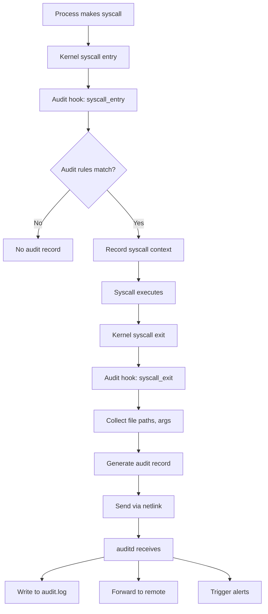
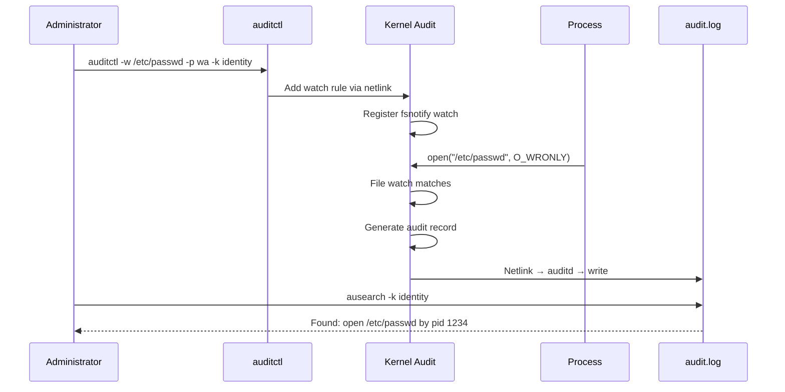
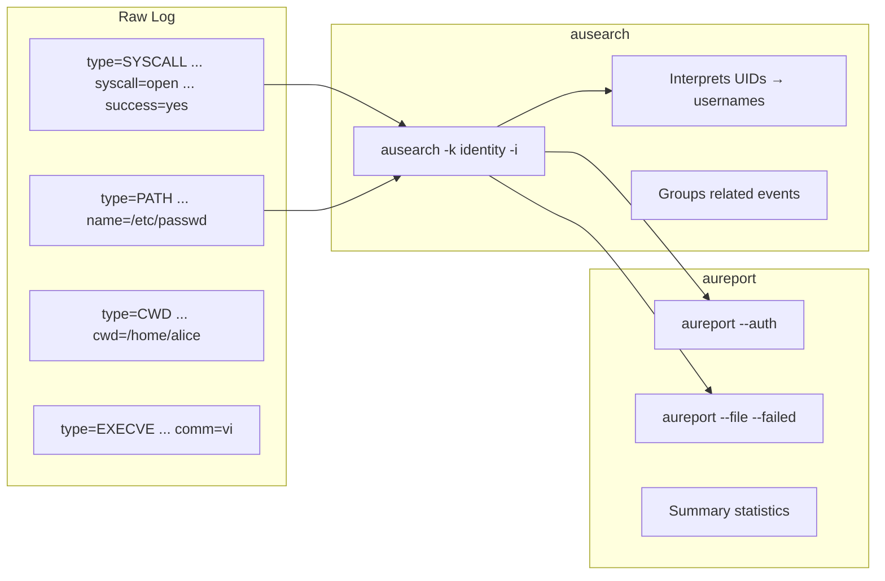

# Chapter 171: Audit Framework

## 1. Intuition

Who opened that file? When was that process started? Did someone try to modify `/etc/passwd`? The Linux Audit Framework answers these questions by recording security-relevant events in a tamper-resistant log. It's the system's black box recorder.

Without audit, you're flying blind. If an attacker compromises your system, you need audit logs to understand what happened, when, and how. For compliance (PCI-DSS, HIPAA, SOX), audit logging isn't optional—it's mandatory.

The audit framework consists of:
- **auditd**: The audit daemon that collects and stores events
- **audit rules**: Define what to monitor (syscalls, files, network, etc.)
- **audit log**: The tamper-resistant record of events
- **Analysis tools**: ausearch, aureport for querying the log

Think of audit as a security camera system for your kernel: it records everything that happens and lets you review the footage later.

## 2. Architecture

### 2.1 Audit System Components

```
┌─────────────────────────────────────────────────────────────────┐
│                    Linux Audit Architecture                     │
├─────────────────────────────────────────────────────────────────┤
│                                                                 │
│  ┌──────────────────────────────────────────────────────────┐  │
│  │  Userspace                                                │  │
│  │  ┌──────────┐  ┌──────────┐  ┌──────────┐  ┌──────────┐│  │
│  │  │ auditd   │  │ausearch  │  │aureport  │  │auditctl  ││  │
│  │  │(daemon)  │  │(search)  │  │(reports) │  │(control) ││  │
│  │  └─────┬────┘  └──────────┘  └──────────┘  └──────────┘│  │
│  │        │                                                  │  │
│  │        ▼                                                  │  │
│  │  ┌──────────────────────────────────────────────────────┐│  │
│  │  │  libaudit (audit library)                            ││  │
│  │  └──────────────────────────────────────────────────────┘│  │
│  └──────────────────────────┬───────────────────────────────┘  │
│                              │ Netlink (AUDIT_NETLINK)         │
│                              ▼                                  │
│  ┌──────────────────────────────────────────────────────────┐  │
│  │  Kernel Audit Subsystem                                   │  │
│  │  ┌──────────────────────────────────────────────────────┐│  │
│  │  │  Kernel Audit Core (kernel/audit.c)                  ││  │
│  │  │  ├── Audit filter (kernel/auditfilter.c)             ││  │
│  │  │  ├── Audit watch (kernel/audit_watch.c)              ││  │
│  │  │  ├── Audit tree (kernel/audit_tree.c)                ││  │
│  │  │  └── Audit FS notify (kernel/audit_fsnotify.c)       ││  │
│  │  └──────────────────────────────────────────────────────┘│  │
│  │                                                          │  │
│  │  ┌──────────────────────────────────────────────────────┐│  │
│  │  │  Audit Hooks (security_audit hooks)                  ││  │
│  │  │  ├── Syscall entry/exit                              ││  │
│  │  │  ├── File operations                                 ││  │
│  │  │  ├── IPC operations                                  ││  │
│  │  │  ├── Network operations                              ││  │
│  │  │  └── User/group changes                              ││  │
│  │  └──────────────────────────────────────────────────────┘│  │
│  └──────────────────────────────────────────────────────────┘  │
│                                                                 │
│  Log Output:                                                    │
│  /var/log/audit/audit.log  (binary + text format)               │
│                                                                 │
└─────────────────────────────────────────────────────────────────┘
```

### 2.2 Audit Event Types

| Event Type | ID | Description |
|-----------|-----|-------------|
| SYSCALL | 1300 | Syscall entry (arguments, success/failure) |
| PATH | 1302 | File path information |
| CWD | 1307 | Current working directory |
| EXECVE | 1309 | Command arguments |
| SOCKADDR | 1306 | Socket address |
| USER_ACCT | 1112 | User account access |
| USER_AUTH | 1110 | User authentication |
| USER_CMD | 1112 | User command |
| AVC | 1400 | SELinux AVC denial |
| CONFIG_CHANGE | 1306 | Audit configuration change |
| DAEMON_START | 1305 | auditd start |
| DAEMON_END | 1306 | auditd end |
| ANOM_ABEND | 1701 | Process abnormal end |
| ANOM_EXEC | 1702 | Abnormal execution |

### 2.3 Audit Rule Categories

```
┌─────────────────────────────────────────────────────────────────┐
│                    Audit Rule Categories                        │
├─────────────────────────────────────────────────────────────────┤
│                                                                 │
│  ┌──────────────────────────────────────────────────────────┐  │
│  │  Syscall Rules (-a)                                      │  │
│  │  Monitor specific system calls                            │  │
│  │  -a always,exit -F arch=b64 -S open -S openat            │  │
│  │  Can filter by UID, GID, success/failure, etc.           │  │
│  └──────────────────────────────────────────────────────────┘  │
│                                                                 │
│  ┌──────────────────────────────────────────────────────────┐  │
│  │  File Watch Rules (-w)                                   │  │
│  │  Monitor specific files/directories                      │  │
│  │  -w /etc/passwd -p wa -k identity                        │  │
│  │  -p = permissions: r, w, x, a (attribute)                │  │
│  └──────────────────────────────────────────────────────────┘  │
│                                                                 │
│  ┌──────────────────────────────────────────────────────────┐  │
│  │  Exit Filter Rules (-a always,exit -F ...)               │  │
│  │  Filter by syscall arguments, return values              │  │
│  │  -a always,exit -F arch=b64 -S mount -F uid!=0           │  │
│  └──────────────────────────────────────────────────────────┘  │
│                                                                 │
│  ┌──────────────────────────────────────────────────────────┐  │
│  │  User Rules (-w /etc/passwd -k identity)                 │  │
│  │  Key-based grouping of events                            │  │
│  │  Useful for searching related events                     │  │
│  └──────────────────────────────────────────────────────────┘  │
│                                                                 │
└─────────────────────────────────────────────────────────────────┘
```

## 3. Kernel Implementation

### 3.1 Audit Core

The audit subsystem is in `kernel/audit.c`:

```c
/* kernel/audit.c */
struct audit_buffer {
    struct sk_buff skb;      /* Netlink message buffer */
    struct context ctx;       /* Audit context */
    gfp_t gfp_mask;
};

/* Initialize audit subsystem */
static int __init audit_init(void)
{
    /* Register netlink socket */
    audit_sock = netlink_kernel_create(&init_net, NETLINK_AUDIT,
                                       &cfg);

    /* Register syscall hooks */
    audit_register_syscalls();

    return 0;
}

/* Log an audit event */
void audit_log(struct audit_context *ctx, gfp_t gfp_mask,
               int type, const char *fmt, ...)
{
    struct audit_buffer *ab;

    ab = audit_log_start(ctx, gfp_mask, type);
    if (!ab)
        return;

    va_start(args, fmt);
    audit_log_vformat(ab, fmt, args);
    va_end(args);

    audit_log_end(ab);
}
```

### 3.2 Syscall Auditing

```c
/* kernel/auditsc.c */
void __audit_syscall_entry(int major, unsigned long a0, unsigned long a1,
                           unsigned long a2, unsigned long a3)
{
    struct audit_context *context = current->audit_context;

    context->arch = syscall_get_arch(current);
    context->major = major;
    context->argv[0] = a0;
    context->argv[1] = a1;
    context->argv[2] = a2;
    context->argv[3] = a3;
}

void __audit_syscall_exit(int success, long return_code)
{
    struct audit_context *context = current->audit_context;

    /* Check if this syscall matches any audit rules */
    if (audit_filter_syscall(current, context))
        return;  /* Filtered out */

    /* Generate audit record */
    audit_log_syscall(context, success, return_code);
}
```

### 3.3 File Watch

```c
/* kernel/audit_watch.c */
struct audit_watch {
    refcount_t count;
    dev_t dev;
    char *path;
    unsigned len;
    struct list_head rules;
};

/* Add a file watch */
int audit_add_watch(struct audit_watch *watch)
{
    /* Register inotify/fsnotify on the path */
    /* When the file is accessed, generate audit event */
    audit_put_watch(watch);
    return 0;
}
```

### 3.4 Audit Filter

```c
/* kernel/auditfilter.c */
static struct audit_entry *audit_rule_to_entry(struct audit_rule_data *rule)
{
    /* Parse rule from userspace */
    /* Build filter tree for efficient matching */

    entry = kmalloc(sizeof(*entry), GFP_KERNEL);

    for (i = 0; i < rule->field_count; i++) {
        /* Parse each field filter */
        f->type = rule->fields[i];
        f->val = rule->values[i];
        /* ... */
    }

    return entry;
}
```

## 4. Source Code References

| Component | File |
|-----------|------|
| Audit core | `kernel/audit.c` |
| Syscall auditing | `kernel/auditsc.c` |
| File watch | `kernel/audit_watch.c` |
| Audit tree | `kernel/audit_tree.c` |
| Audit filter | `kernel/auditfilter.c` |
| Audit FS notify | `kernel/audit_fsnotify.c` |
| Audit header | `include/linux/audit.h` |
| UAPI | `include/uapi/linux/audit.h` |
| auditd source | https://github.com/linux-audit/audit-userspace |

## 5. Configuration Examples

### 5.1 Install and Configure auditd

```bash
# Install
sudo apt install auditd audispd-plugins   # Debian/Ubuntu
sudo dnf install audit                    # Fedora/RHEL

# Start and enable
sudo systemctl start auditd
sudo systemctl enable auditd

# Check status
sudo systemctl status auditd
sudo auditctl -s  # Show audit system status
# enabled 1
# failure 1
# pid 1234
# rate_limit 0
# backlog_limit 8192
# lost 0
# backlog 0
```

### 5.2 auditd.conf Configuration

```bash
# /etc/audit/auditd.conf

# Log file location
log_file = /var/log/audit/audit.log

# Log format: RAW or NOLOG
log_format = RAW

# Log rotation
max_log_file = 50          # MB per file
max_log_file_action = ROTATE  # ROTATE, IGNORE, SYSLOG, SUSPEND, ROTATE
num_logs = 10              # Keep 10 rotated files

# Failure handling
failure_mode = 1           # 0=silent, 1=printk, 2=panic
action_mail_acct = root    # Email for alerts
space_left_action = SYSLOG # What to do when disk low
admin_space_left_action = SUSPEND
disk_full_action = SUSPEND
disk_error_action = SUSPEND

# Performance
priority_boost = 4
disp_qos = lossy           # lossy or lossless
end_of_event_timeout = 2   # seconds to wait for multi-part events

# Name resolution
name_format = HOSTNAME     # HOSTNAME, FQD, NUMERIC, NONE
```

### 5.3 Syscall Audit Rules

```bash
# Monitor all file access syscalls
auditctl -a always,exit -F arch=b64 -S open,openat,creat -k file_access
auditctl -a always,exit -F arch=b64 -S unlink,unlinkat,rename,renameat -k file_delete

# Monitor process execution
auditctl -a always,exit -F arch=b64 -S execve -k process_exec

# Monitor mount operations
auditctl -a always,exit -F arch=b64 -S mount,umount,umount2 -k mount_ops

# Monitor network connections
auditctl -a always,exit -F arch=b64 -S connect -k network_connect
auditctl -a always,exit -F arch=b64 -S accept,bind,listen -k network_bind

# Monitor privilege changes
auditctl -a always,exit -F arch=b64 -S setuid,setgid,setreuid,setregid -k priv_change

# Monitor by user (non-root)
auditctl -a always,exit -F arch=b64 -S open -F uid>=1000 -F auid!=4294967295 -k user_file_access

# Monitor failed operations
auditctl -a always,exit -F arch=b64 -S open -F success=0 -k file_fail

# Monitor specific architecture
auditctl -a always,exit -F arch=b32 -S open -k open32
auditctl -a always,exit -F arch=b64 -S open -k open64
```

### 5.4 File Watch Rules

```bash
# Monitor /etc/passwd for changes
auditctl -w /etc/passwd -p wa -k identity

# Monitor /etc/shadow
auditctl -w /etc/shadow -p wa -k identity

# Monitor /etc/sudoers
auditctl -w /etc/sudoers -p wa -k sudoers

# Monitor SSH configuration
auditctl -w /etc/ssh/sshd_config -p wa -k sshd_config

# Monitor /etc/group
auditctl -w /etc/group -p wa -k group

# Monitor sudo usage
auditctl -w /usr/bin/sudo -p x -k sudo_usage

# Monitor su
auditctl -w /usr/bin/su -p x -k su_usage

# Monitor crontab changes
auditctl -w /etc/crontab -p wa -k cron
auditctl -w /etc/cron.d/ -p wa -k cron
auditctl -w /var/spool/cron/ -p wa -k cron

# Monitor kernel modules
auditctl -w /sbin/insmod -p x -k modules
auditctl -w /sbin/modprobe -p x -k modules
auditctl -w /sbin/rmmod -p x -k modules

# Monitor directory for all changes
auditctl -w /var/www/ -p wa -k web_content
```

### 5.5 Persistent Rules

```bash
# Rules in /etc/audit/rules.d/ are loaded at boot
# Format: same as auditctl command, one per line

# /etc/audit/rules.d/audit.rules

# Delete all existing rules
-D

# Set buffer size
-b 8192

# Failure mode (1=printk, 2=panic)
-f 1

# === Identity monitoring ===
-w /etc/passwd -p wa -k identity
-w /etc/shadow -p wa -k identity
-w /etc/group -p wa -k identity
-w /etc/gshadow -p wa -k identity
-w /etc/security/opasswd -p wa -k identity

# === Syscall monitoring ===
-a always,exit -F arch=b64 -S open,openat -F success=0 -k access
-a always,exit -F arch=b64 -S execve -k exec
-a always,exit -F arch=b64 -S mount -F uid!=0 -k mount
-a always,exit -F arch=b64 -S unlink,unlinkat -k delete
-a always,exit -F arch=b64 -S setuid,setgid,setreuid,setregid -k priv_escalation
-a always,exit -F arch=b64 -S kill -k signals

# === Privileged commands ===
-w /usr/bin/sudo -p x -k privileged
-w /usr/bin/su -p x -k privileged
-w /usr/bin/passwd -p x -k privileged
-w /usr/bin/chsh -p x -k privileged
-w /usr/bin/chfn -p x -k privileged

# === Network ===
-a always,exit -F arch=b64 -S connect -k network
-a always,exit -F arch=b64 -S accept -k network
-a always,exit -F arch=b64 -S bind -k network

# === Time ===
-a always,exit -F arch=b64 -S adjtimex,settimeofday -k time
-a always,exit -F arch=b64 -S clock_settime -k time
-w /etc/localtime -p wa -k time

# === Kernel modules ===
-w /sbin/insmod -p x -k modules
-w /sbin/modprobe -p x -k modules
-w /sbin/rmmod -p x -k modules

# === Make rules immutable (must be last, requires reboot to change) ===
-e 2
```

### 5.6 ausearch (Searching Audit Logs)

```bash
# Search by key
ausearch -k identity -i
# Shows all events tagged with "identity" key

# Search by time
ausearch -ts today
ausearch -ts '12/25/2024 00:00:00' -te '12/25/2024 23:59:59'
ausearch -ts recent  # Last 10 minutes

# Search by user
ausearch -ua alice -i
ausearch -ui 1000 -i

# Search by syscall
ausearch -sc open -i
ausearch -sc execve -i

# Search by file
ausearch -f /etc/passwd -i

# Search by event type
ausearch -m AVC -i          # SELinux denials
ausearch -m USER_AUTH -i    # Authentication events
ausearch -m SYSCALL -i      # Syscall events

# Search by exit code (failure)
ausearch -sv no -i          # Failed events
ausearch -sv no -sv 1 -i   # Events with specific exit code

# Combine filters
ausearch -k identity -ua alice -ts today -i

# Interpret (human-readable) output
ausearch -k identity --interpret
```

### 5.7 aureport (Audit Reports)

```bash
# Summary report
aureport

# Authentication report
aureport --auth
# Shows login attempts, successes, failures

# Login report
aureport --login
# Shows all login sessions

# File access report
aureport --file
# Shows all file access events

# Failed operations report
aureport --failed
# Shows all failed operations

# Anomaly report
aureport --anomaly
# Shows unusual events

# Executable report
aureport --executable
# Shows all executables that were run

# Syscall report
aureport --syscall
# Shows syscall usage statistics

# Network report
aureport --net
# Shows network-related events

# Combined reports
aureport --auth --summary
aureport --login --summary -i
aureport --file --failed -ts today

# Key-based report
aureport --key --summary
# Shows summary of events by audit key
```

### 5.8 auditctl (Audit Control)

```bash
# Show current status
auditctl -s

# Show current rules
auditctl -l

# Add rule
auditctl -a always,exit -F arch=b64 -S open -k file_access

# Delete rule
auditctl -d always,exit -F arch=b64 -S open -k file_access

# Delete all rules
auditctl -D

# Make rules immutable (requires reboot to change)
auditctl -e 2

# Set failure mode
auditctl -f 1  # 0=silent, 1=printk, 2=panic

# Set backlog limit
auditctl -b 8192

# Enable/disable
auditctl -e 1  # Enable
auditctl -e 0  # Disable
```

### 5.9 Remote Audit Logging

```bash
# Configure remote logging with audispd

# /etc/audisp/plugins.d/remote.conf
active = yes
direction = out
path = /sbin/audisp-remote
type = always
args = /etc/audisp/audisp-remote.conf
format = string

# /etc/audisp/audisp-remote.conf
remote_server = audit-server.example.com
port = 60
mode = immediate
transport = tcp

# Or use syslog forwarding
# /etc/audisp/plugins.d/syslog.conf
active = yes
direction = out
path = /builtin/syslog
type = always
args = LOG_INFO
format = string
```

### 5.10 Audit with systemd

```bash
# systemd generates audit events for service operations
# Check service-related audit events:
ausearch -m SERVICE_START -i
ausearch -m SERVICE_STOP -i

# Monitor systemd unit file changes:
ausearch -f /etc/systemd/system -k systemd_config
```

### 5.11 Audit Logging for Compliance

```bash
# PCI-DSS requirements:
# - Monitor all access to cardholder data
# - Track all access to system components
# - Log all administrative actions

# /etc/audit/rules.d/pci-dss.rules
# Monitor access to sensitive files
-w /var/lib/mysql/ -p rwxa -k pci_data
-w /var/lib/postgresql/ -p rwxa -k pci_data

# Monitor all commands by privileged users
-a always,exit -F arch=b64 -S execve -F uid=0 -k admin_commands

# Monitor all authentication
-w /etc/pam.d/ -p wa -k pam_config

# Monitor all network connections
-a always,exit -F arch=b64 -S connect,accept -k network

# HIPAA requirements:
# - Access to ePHI must be logged
-w /var/lib/health-records/ -p rwxa -k ephi_access
-a always,exit -F arch=b64 -S open -F path=/var/lib/health-records -k ephi_open
```

## 6. Diagrams

### 6.1 Audit Event Flow



### 6.2 Audit Rule Processing



### 6.3 Audit Log Analysis



## 7. Common Pitfalls

### 7.1 Audit Performance Impact

```bash
# Monitoring too many syscalls impacts performance
# Each monitored syscall generates a netlink message

# Bad: monitor ALL syscalls
# -a always,exit -F arch=b64 -S all

# Good: monitor only security-relevant syscalls
-a always,exit -F arch=b64 -S open,openat,execve,connect

# Tune buffer size:
auditctl -b 8192  # Default is often too small
```

### 7.2 Log Rotation

```bash
# Audit logs grow fast!
# Configure rotation in auditd.conf:
max_log_file = 50      # 50 MB per file
num_logs = 10          # Keep 10 files
max_log_file_action = rotate

# Use logrotate for additional management:
# /etc/logrotate.d/audit
/var/log/audit/*.log {
    rotate 30
    daily
    compress
    delaycompress
    missingok
    notifempty
    create 0600 root root
    postrotate
        /sbin/service auditd restart
    endscript
}
```

### 7.3 Immutable Rules

```bash
# -e 2 makes rules immutable (can only be changed by reboot)
# Very secure, but inflexible

# If you need to change rules:
# 1. Reboot the system
# 2. Or: don't use -e 2 in development/testing
```

### 7.4 auid vs uid

```bash
# uid = real UID at time of event
# auid = audit UID (login UID, set at login, never changes)

# auid is more useful for tracking user actions:
ausearch -ua 1000 -i  # Events by UID 1000 (may include su/sudo)
ausearch -au 1000 -i  # Events by audit UID 1000 (original login user)

# Always use auid for tracking actual users:
-a always,exit -F arch=b64 -S open -F auid>=1000 -F auid!=4294967295 -k user_access
```

### 7.5 Missing auid in Some Events

```bash
# Some events don't have auid (e.g., kernel threads)
# Filter them out:
-F auid!=4294967295   # 4294967295 = -1 = unset

# Or use -F auid>=0
```

### 7.6 Audit Log Tampering

```bash
# An attacker who gains root can:
# 1. Stop auditd: systemctl stop auditd
# 2. Modify /var/log/audit/audit.log
# 3. Clear audit rules: auditctl -D

# Mitigations:
# 1. Forward logs to remote server
# 2. Make rules immutable: auditctl -e 2
# 3. Use log signing (auditd-signing plugin)
# 4. Monitor audit daemon status
```

### 7.7 Too Many Events

```bash
# Overly broad rules generate millions of events
# This fills disk and makes searching slow

# Bad: watch entire filesystem
# -w / -p rwxa

# Good: watch specific critical files
# -w /etc/passwd -p wa -k identity
# -w /etc/shadow -p wa -k identity

# Use keys to categorize events:
# -k identity    (user/group changes)
# -k privileged  (privilege escalation)
# -k file_access (sensitive file access)
# -k network     (network operations)
```

## 8. Best Practices

### 8.1 Start with a Baseline Policy

```bash
# Use STIG or CIS benchmark rules as starting point
# Most distros provide packages:
sudo apt install auditd-hardened   # Debian
sudo dnf install scap-security-guide  # RHEL

# Or download from:
# https://github.com/linux-audit/audit-userspace/tree/master/rules
```

### 8.2 Forward Logs to Remote Server

```bash
# Never rely on local-only audit logs!
# An attacker can delete local logs

# Configure remote forwarding:
# /etc/audisp/plugins.d/remote.conf
active = yes
direction = out
path = /sbin/audisp-remote
type = always

# Or use rsyslog:
# /etc/rsyslog.d/audit.conf
:programname, isequal, "audispd" @log-server:514
```

### 8.3 Use Meaningful Keys

```bash
# Categorize events with descriptive keys:
-w /etc/passwd -p wa -k identity_changes
-w /etc/shadow -p wa -k password_changes
-w /etc/sudoers -p wa -k sudoers_changes
-a always,exit -S mount -F uid!=0 -k unauthorized_mount
-a always,exit -S execve -F uid=0 -k root_commands

# Keys make searching easy:
ausearch -k identity_changes -i
ausearch -k unauthorized_mount -i
```

### 8.4 Monitor Privilege Escalation

```bash
# Monitor sudo and su usage
-w /usr/bin/sudo -p x -k sudo_usage
-w /usr/bin/su -p x -k su_usage

# Monitor setuid/setgid execution
-a always,exit -F arch=b64 -S setuid,setgid -F a0=0 -k priv_escalation

# Monitor capability changes
-a always,exit -F arch=b64 -S capset -k capability_change

# Monitor user/group management
-w /usr/sbin/useradd -p x -k user_mgmt
-w /usr/sbin/userdel -p x -k user_mgmt
-w /usr/sbin/usermod -p x -k user_mgmt
-w /usr/sbin/groupadd -p x -k group_mgmt
```

### 8.5 Regular Audit Log Review

```bash
#!/bin/bash
# /etc/cron.daily/audit-review

# Generate daily reports
aureport --auth --summary > /var/log/audit/daily-auth-$(date +%Y%m%d).txt
aureport --failed > /var/log/audit/daily-failed-$(date +%Y%m%d).txt
aureport --anomaly > /var/log/audit/daily-anomaly-$(date +%Y%m%d).txt

# Check for suspicious activity
FAILED_LOGINS=$(aureport --auth --failed --summary | tail -1)
if [ "$FAILED_LOGINS" -gt 10 ]; then
    echo "ALERT: $FAILED_LOGINS failed login attempts" | \
        mail -s "Audit Alert" admin@example.com
fi
```

### 8.6 Combine with SELinux

```bash
# Audit SELinux denials
ausearch -m AVC -i

# Monitor SELinux policy changes
ausearch -m MAC_POLICY_LOAD -i

# Monitor context changes
ausearch -m MAC_CONFIG_CHANGE -i
```

## 9. Exercises

### Exercise 1: Basic Audit Setup

1. Install and configure auditd
2. Add rules to monitor `/etc/passwd` and `/etc/shadow`
3. Modify those files
4. Search the audit log for the events
5. Generate a report

### Exercise 2: Syscall Auditing

1. Configure audit rules for process execution (execve)
2. Run several commands as different users
3. Search the audit log for all executions
4. Filter by user and time

### Exercise 3: Privilege Escalation Monitoring

1. Add rules to monitor sudo, su, and privilege changes
2. Perform various privilege escalation operations
3. Search and analyze the audit log
4. Identify any unauthorized privilege changes

### Exercise 4: Audit Report Generation

1. Generate an authentication report for the last week
2. Generate a file access report
3. Generate a failed operations report
4. Create a summary of security-relevant events

### Exercise 5: Compliance Audit Rules

1. Create a set of audit rules for PCI-DSS compliance
2. Monitor access to sensitive data directories
3. Monitor all administrative actions
4. Test the rules and verify they capture required events

### Exercise 6: Remote Audit Logging

1. Configure auditd to forward logs to a remote server
2. Verify logs arrive at the remote destination
3. Simulate a local log tampering scenario
4. Verify that remote logs are still intact

## 10. References

1. **Linux man pages**: `auditd(8)`, `auditctl(8)`, `ausearch(8)`, `aureport(8)`, `audispd(8)`, `audit.rules(7)`
2. **Linux audit project**: https://github.com/linux-audit/audit-userspace
3. **Kernel documentation**: `Documentation/admin-guide/LSM/audit.rst`
4. **Linux kernel source**: `kernel/audit.c`, `kernel/auditsc.c`, `kernel/auditfilter.c`
5. **Red Hat audit guide**: https://access.redhat.com/documentation/en-us/red_hat_enterprise_linux/9/html/security_hardening/auditing-the-system_security-hardening
6. **CIS Benchmarks**: https://www.cisecurity.org/cis-benchmarks
7. **STIG**: https://public.cyber.mil/stigs/
8. **NIST SP 800-92**: Guide to Computer Security Log Management
9. **PCI-DSS**: Requirement 10: Track and monitor all access
10. **auditd-signing**: Log signing plugin for tamper detection
