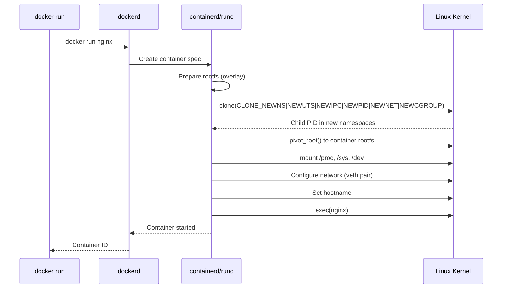
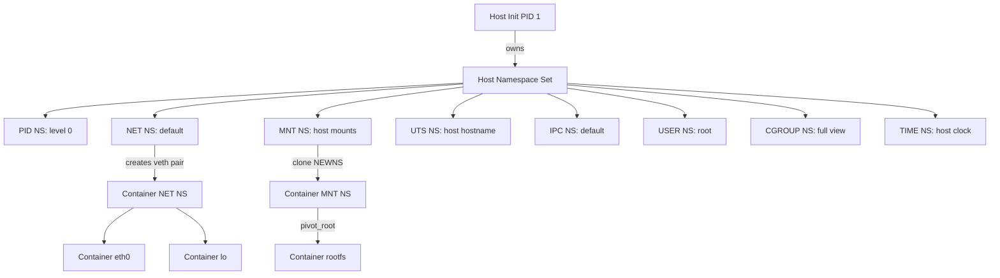

# Chapter 172: Namespaces Revisited — Container Perspective

## 1. Introduction

Namespaces are the foundational isolation mechanism that makes containers possible on Linux. While earlier chapters introduced namespaces conceptually, this chapter examines all eight namespace types from the perspective of container runtimes — how Docker, Podman, LXC, and Kubernetes actually use them to create the illusion of a fully isolated system.

A container is, at its core, a process (or group of processes) that believes it has its own private instance of the operating system. It sees its own hostname, its own network stack, its own mount tree, its own PID numbering, and its own view of users. None of this is virtualization in the traditional sense — the container process runs directly on the host kernel. The kernel simply restricts what the process can "see" through namespace boundaries.

Understanding namespaces at this level is essential for debugging container failures, designing secure multi-tenant systems, and building custom container runtimes.

## 2. Architecture Overview

### 2.1 The Namespace Abstraction

Every process on Linux belongs to one instance of each namespace type. When a process creates a child, the child inherits the parent's namespaces by default. The key system calls are:

- **`clone()`** — Creates a new process in new namespaces (flags like `CLONE_NEWNS`, `CLONE_NEWNET`, etc.)
- **`unshare()`** — Moves the calling process into new namespaces without creating a child
- **`setns()`** — Joins an existing namespace via a file descriptor

Container runtimes use `clone()` with multiple `CLONE_NEW*` flags simultaneously to create a fully isolated environment.

```
┌─────────────────────────────────────────────────────────────┐
│                      Host Kernel                            │
│                                                             │
│  ┌───────────────────────────────────────────────────────┐  │
│  │              Container Process                        │  │
│  │                                                       │  │
│  │  PID NS: sees PID 1 (host sees PID 3847)             │  │
│  │  NET NS: own veth, loopback, iptables                 │  │
│  │  MNT NS: own mount tree (rootfs via pivot_root)       │  │
│  │  UTS NS: hostname = "web-server-1"                    │  │
│  │  IPC NS: own shared memory, semaphores                │  │
│  │  USER NS: UID 0 inside = UID 100000 outside          │  │
│  │  CGROUP NS: private cgroup view                       │  │
│  │  TIME NS: monotonic/boot time offsets                 │  │
│  │                                                       │  │
│  └───────────────────────────────────────────────────────┘  │
│                                                             │
│  Host PID 1 (systemd)                                      │
│  Host PID 2 (kthreadd)                                     │
│  Host PID 3847 ──── maps to container's PID 1              │
└─────────────────────────────────────────────────────────────┘
```

### 2.2 How Containers Combine Namespaces

A typical Docker container creates the following namespace combination:

| Namespace | Flag | What's Isolated |
|-----------|------|-----------------|
| Mount | `CLONE_NEWNS` | Filesystem mount points |
| UTS | `CLONE_NEWUTS` | Hostname and domain name |
| IPC | `CLONE_NEWIPC` | System V IPC, POSIX message queues |
| PID | `CLONE_NEWPID` | Process ID number space |
| Network | `CLONE_NEWNET` | Network devices, stacks, routing |
| User | `CLONE_NEWUSER` | UID/GID mappings |
| Cgroup | `CLONE_NEWCGROUP` | Cgroup root directory view |
| Time | `CLONE_NEWTIME` | CLOCK_MONOTONIC, CLOCK_BOOTTIME |

Not all container runtimes enable all namespaces. For example, Docker does not use user namespaces by default (it maps container root to host root), while rootless Podman always uses user namespaces.

## 3. The Eight Namespace Types in Depth

### 3.1 Mount Namespace (`CLONE_NEWNS`)

**Intuition:** The mount namespace gives each container its own view of the filesystem hierarchy. This is the oldest namespace type (introduced in Linux 2.4.19, 2002), hence the generic name `NEWNS`.

**How containers use it:**

1. The container runtime prepares a root filesystem (rootfs) — typically extracted from a container image.
2. It calls `clone()` with `CLONE_NEWNS` to create the child in a new mount namespace.
3. Inside the new namespace, the child calls `pivot_root()` (or `chroot()` in simpler implementations) to make the container's rootfs the `/` of the new namespace.
4. The container then mounts `/proc`, `/sys`, `/dev`, and other virtual filesystems as needed.

**`pivot_root()` vs `chroot()`:**

`pivot_root()` is preferred because:
- It actually changes the root mount point, making the old rootfs unreachable
- `chroot()` can be escaped by a sufficiently privileged process (one with `CAP_SYS_CHROOT`)
- After `pivot_root()`, the old root can be unmounted entirely

**Propagation flags matter:**

Mount propagation (shared, slave, private, unbindable) controls how mount events propagate between namespaces. Container runtimes must carefully set propagation to prevent:

- Container mounts leaking to the host
- Host mounts appearing inside containers
- Mount storms from recursive propagation

```
Host Mount Namespace                    Container Mount Namespace
─────────────────────                   ─────────────────────────
/ (shared)                              / (private)
├── /sys                                ├── /proc (procfs)
├── /proc                               ├── /sys (sysfs, read-only)
├── /dev                                ├── /dev (tmpfs + devices)
├── /var/lib/docker                     ├── /etc
│   └── overlay2/                       ├── /bin, /usr, ...
│       └── <layer-id>/rootfs ◄─────────┘
└── ...
```

**Kernel implementation:** `fs/namespace.c` — The `struct mnt_namespace` tracks all mounts belonging to a namespace. Each mount has a `struct mount` with a `mnt_namespace` pointer. `clone(CLONE_NEWNS)` creates a deep copy of the mount tree via `copy_tree()`.

**Source code references:**
- `kernel/nsproxy.c` — `create_new_namespaces()`, `copy_namespaces()`
- `fs/namespace.c` — `do_pivot_root()`, `ksys_mount()`
- `fs/pnode.c` — Mount propagation logic

**Configuration example — mount namespace in a container:**

```bash
# Create a simple container-like environment
unshare --mount -- /bin/bash

# Inside the new mount namespace
mount -t tmpfs tmpfs /tmp
mount -t proc proc /proc
# These mounts are invisible to the host
```

### 3.2 UTS Namespace (`CLONE_NEWUTS`)

**Intuition:** UTS (Unix Timesharing System) namespace isolates the hostname and NIS domain name. This is one of the simplest namespaces — it has a single purpose: let each container have its own hostname.

**How containers use it:**

When you run `docker run --hostname my-container`, Docker sets the UTS namespace so that `hostname` inside the container returns `my-container` without affecting the host.

**Kernel implementation:**

```c
// include/linux/utsname.h
struct uts_namespace {
    struct kref kref;
    struct new_utsname name;  // hostname, domainname, etc.
    struct user_namespace *user_ns;
    struct ucounts *ucounts;
    struct ns_common ns;
};
```

The `new_utsname` structure holds six strings: `sysname`, `nodename`, `release`, `version`, `machine`, and `domainname`.

**Source code references:**
- `kernel/utsname.c` — `copy_utsname()`, `clone_uts_ns()`
- `include/uapi/linux/utsname.h` — `struct new_utsname`

**Practical note:** Changing the hostname inside a container requires `CAP_SYS_ADMIN` in the UTS namespace (or root in the user namespace). Most container runtimes grant this capability.

### 3.3 IPC Namespace (`CLONE_NEWIPC`)

**Intuition:** The IPC namespace isolates System V inter-process communication objects and POSIX message queues. Without it, a container process could read shared memory segments or semaphore sets created by another container or the host.

**What's isolated:**
- System V shared memory (`shmget`, `shmat`)
- System V semaphore arrays (`semget`)
- System V message queues (`msgget`)
- POSIX message queues (`mq_open`, `mq_receive`)

**How containers use it:**

Containers that run databases (PostgreSQL, MySQL) often use shared memory for buffer pools. Each container needs its own IPC namespace to prevent interference.

```bash
# Docker creates an IPC namespace by default
docker run --ipc=private postgres

# Share IPC namespace between containers (useful for some sidecar patterns)
docker run --ipc=container:web-app logger-sidecar
```

**Kernel implementation:**

```c
// ipc/namespace.c
struct ipc_namespace {
    struct kref kref;
    struct ns_common ns;
    
    // System V IPC limits
    int shmmax, shmall, shmmin, shmmni;
    int msgmni, msgmax, msgmnb;
    int semmni, semmsl, semmns, semopm;
    
    // IPC object lists
    struct ipc_ids ids[3];  // sem, msg, shm
    
    // ...
};
```

**Security implication:** Sharing IPC namespaces between containers breaks isolation. If two containers share an IPC namespace, one can read/write the other's shared memory. Only use `--ipc=container:` when the containers are tightly coupled and trusted.

### 3.4 PID Namespace (`CLONE_NEWPID`)

**Intuition:** The PID namespace gives each container its own process ID numbering. The first process in a container gets PID 1, which has special significance (init process, signal handling, zombie reaping).

**How containers use it:**

```
Host PID Space                    Container PID Space
──────────────                    ───────────────────
PID 1: systemd                    PID 1: entrypoint (nginx)
PID 2: kthreadd                   PID 2: worker
PID 500: dockerd                  PID 3: worker
PID 3847: nginx (container PID 1) PID 4: logger
PID 3848: nginx worker (cPID 2)
PID 3849: nginx worker (cPID 3)
```

**The PID 1 problem:**

PID 1 in Linux has special properties:
- It receives orphaned signals (signals that no other process handles)
- If PID 1 dies, the entire namespace is killed
- PID 1 does not get default signal handlers — `SIGTERM` and `SIGKILL` are not delivered unless the process explicitly handles them

This means if your container's entrypoint is a shell script that doesn't handle `SIGTERM`, `docker stop` will hang for 10 seconds before resorting to `SIGKILL`.

**Zombie processes:**

PID namespaces require a reaper for zombie processes. If PID 1 in the container exits, zombies accumulate because there's no init to `wait()` on them. Container runtimes solve this differently:

- Docker: Uses `tini` or the container's own init
- Podman: Uses `conmon` as a supervisor outside the container
- Kubernetes: Depends on the container runtime

```c
// kernel/pid_namespace.c
struct pid_namespace {
    struct kref kref;
    struct pid_level {
        struct hlist_head chain;  // PID hash chain
    } *pid_cachep;
    unsigned int level;           // nesting depth
    struct pid_namespace *parent;
    struct user_namespace *user_ns;
    struct ucounts *ucounts;
    struct ns_common ns;
    // ...
};
```

**Nested PID namespaces:** PID namespaces can be nested. The host has level 0, containers have level 1. A process at level N sees all PIDs at level N but not processes at other levels (except ancestors visible via `NS_GET_PARENT` ioctl).

**Source code references:**
- `kernel/pid_namespace.c` — `create_pid_namespace()`, `copy_pid_ns()`
- `kernel/pid.c` — PID allocation within namespaces
- `init/main.c` — PID 1 behavior

### 3.5 Network Namespace (`CLONE_NEWNET`)

**Intuition:** The network namespace is arguably the most complex. It gives each container its own network stack: loopback device, routing tables, iptables rules, `/proc/net`, and socket allocation.

**What's isolated:**
- Network devices (eth0, lo, etc.)
- IP addresses and routing tables
- Firewall rules (iptables/nftables)
- `/proc/net` and `/sys/class/net`
- Port number space
- Unix domain sockets (abstract sockets are per-network-namespace)

**How containers use networking:**

```
┌─────────────────────────────────────────────────────┐
│ Host                                                │
│                                                     │
│  docker0 (bridge: 172.17.0.1/16)                   │
│    ├── veth3a7f (container 1) ───┐                 │
│    └── veth8c2e (container 2) ───┤                 │
│                                  │                  │
│  ┌─────────────────────────────┐ │                  │
│  │ Container Network NS        │ │                  │
│  │   eth0: 172.17.0.2/16  ◄───┘ │                  │
│  │   lo: 127.0.0.1/8           │                   │
│  │   default via 172.17.0.1    │                   │
│  └─────────────────────────────┘                   │
└─────────────────────────────────────────────────────┘
```

**Creating a container network namespace:**

```bash
# Create a new network namespace
ip netns add container-1

# Create a veth pair
ip link add veth-host type veth peer name veth-container

# Move one end into the container namespace
ip link set veth-container netns container-1

# Configure addresses
ip addr add 10.0.0.1/24 dev veth-host
ip link set veth-host up

ip netns exec container-1 ip addr add 10.0.0.2/24 dev veth-container
ip netns exec container-1 ip link set veth-container up
ip netns exec container-1 ip link set lo up

# Add default route in container
ip netns exec container-1 ip route add default via 10.0.0.1

# Enable forwarding and NAT on host
echo 1 > /proc/sys/net/ipv4/ip_forward
iptables -t nat -A POSTROUTING -s 10.0.0.0/24 ! -o veth-host -j MASQUERADE
```

**Kernel implementation:**

```c
// include/net/net_namespace.h
struct net {
    struct {
        struct hlist_head   *dev_name_head;
        struct hlist_head   *dev_index_head;
    } dev_base_head;
    
    struct list_head    rules_ops;
    struct list_head    namespace_list;
    struct list_head    exit_list;
    
    struct net_device   *loopback_dev;
    struct user_namespace   *user_ns;
    struct ns_common        ns;
    
    // Each protocol family has its own per-net data
    // IPv4, IPv6, netfilter, etc.
    // ...
};
```

**Source code references:**
- `net/core/net_namespace.c` — `setup_net()`, `copy_net_ns()`
- `net/core/dev.c` — Device operations within namespaces
- `include/net/net_namespace.h` — `struct net` definition

### 3.6 User Namespace (`CLONE_NEWUSER`)

**Intuition:** The user namespace is the key to rootless containers. It maps UIDs and GIDs inside the namespace to different UIDs/GIDs outside. A process can be UID 0 (root) inside a user namespace while being UID 1000 on the host.

**UID/GID Mapping:**

```
Container User NS                    Host
───────────────                      ────
UID 0  (root)       ──────────────►  UID 100000
UID 1  (daemon)     ──────────────►  UID 100001
UID 65534 (nobody)  ──────────────►  UID 165534
```

The mapping is defined in `/proc/<pid>/uid_map`:

```
# Format: ns_id  host_id  count
         0        100000   65536
```

**How rootless Podman uses user namespaces:**

Rootless containers create a user namespace where the host UID is mapped to container UID 0. The process runs as root inside the container but has no host privileges.

```bash
# The mapping file for a rootless container
cat /proc/$$/uid_map
         0       1000          1
         1     100000      65535

# This means:
# Container UID 0  → Host UID 1000 (the user)
# Container UID 1  → Host UID 100000
# Container UID 2  → Host UID 100001
# ...and so on
```

**Security implications:**

User namespaces dramatically increase the attack surface. A process inside a user namespace with `CAP_SYS_ADMIN` can do things that would normally require real root. This is why some distributions disable unprivileged user namespaces:

```bash
# Check if unprivileged user namespaces are enabled
cat /proc/sys/kernel/unprivileged_userns_clone

# 0 = disabled (e.g., Debian default)
# 1 = enabled
```

**Kernel implementation:**

```c
// kernel/user_namespace.c
struct user_namespace {
    struct uid_gid_map  uid_map;    // UID mapping
    struct uid_gid_map  gid_map;    // GID mapping
    struct uid_gid_map  projid_map; // Project ID mapping
    struct kref         kref;
    struct user_namespace *parent;
    int                 level;
    // ...
    kgid_t              gid;        // owner GID of the namespace
    struct ns_common    ns;
    unsigned int        proc_inum;
};
```

**Capabilities in user namespaces:**

A process has full capabilities within its user namespace but none outside. The kernel checks capabilities against the user namespace hierarchy.

**Source code references:**
- `kernel/user_namespace.c` — `create_user_ns()`, `map_write()`
- `include/linux/user_namespace.h` — `struct user_namespace`

### 3.7 Cgroup Namespace (`CLONE_NEWCGROUP`)

**Intuition:** The cgroup namespace hides the cgroup hierarchy above the container's cgroup. A container sees its own cgroup as the root of the hierarchy, preventing it from discovering or influencing the host's cgroup structure.

**Without cgroup namespace:**
```
# Inside container (no cgroup namespace)
cat /proc/self/cgroup
12:devices:/docker/a1b2c3d4e5f6...
11:memory:/docker/a1b2c3d4e5f6...
```

**With cgroup namespace:**
```
# Inside container (with cgroup namespace)
cat /proc/self/cgroup
12:devices:/
11:memory:/
```

**How Docker uses it:**

Docker enables cgroup namespaces by default since version 20.10. This means:
- Containers see their cgroup as `/` instead of `/docker/<container-id>`
- `/sys/fs/cgroup` inside the container shows only the container's subtree
- `/proc/self/cgroup` shows relative paths

```bash
# Docker creates a cgroup namespace by default
docker run --rm alpine cat /proc/self/cgroup
# Output shows: 0::/    (cgroup v2, namespace-relative)

# Without cgroup namespace (legacy):
# Output shows: 0::/docker/abc123...
```

**Kernel implementation:**

```c
// kernel/cgroup/namespace.c
struct cgroup_namespace {
    struct ns_common    ns;
    struct user_namespace   *user_ns;
    struct ucounts      *ucounts;
    struct cgroup_root  *root;  // The visible cgroup root
    struct list_head    ...;
};
```

When a cgroup namespace is created, the kernel sets `ns->root` to the cgroup root of the process's current cgroup. All `/proc` and `/sys/fs/cgroup` views are then relative to this root.

**Source code references:**
- `kernel/cgroup/namespace.c` — `copy_cgroup_ns()`, `create_cgroup_ns()`

### 3.8 Time Namespace (`CLONE_NEWTIME`)

**Intuition:** The time namespace (Linux 5.6) allows offsetting `CLOCK_MONOTONIC` and `CLOCK_BOOTTIME` per namespace. This was introduced primarily for container migration (CRIU) — when migrating a container between hosts, the monotonic clock values can be adjusted to match the checkpoint time.

**How it works:**

The time namespace maintains offsets for two clocks:
- `CLOCK_MONOTONIC` — Time since some arbitrary point (typically boot)
- `CLOCK_BOOTTIME` — Like monotonic, but includes suspend time

```
Host                              Container
─────                             ─────────
CLOCK_MONOTONIC = 5000s           CLOCK_MONOTONIC = 5000s + offset
CLOCK_BOOTTIME = 8000s            CLOCK_BOOTTIME = 8000s + offset

# If offset = 1000s:
# Container sees CLOCK_MONOTONIC = 6000s
```

**Use case — CRIU migration:**

When a container is checkpointed at time T on host A and restored on host B:
1. Host B's monotonic clock might be at T+500s
2. The container expects time T
3. Time namespace offset = T - host_B_time = -500s
4. Container processes see the correct monotonic time

**Kernel implementation:**

```c
// include/linux/time_namespace.h
struct timens_offsets {
    struct timespec64 monotonic;
    struct timespec64 boottime;
};

struct time_namespace {
    struct kref         kref;
    struct user_namespace   *user_ns;
    struct ucounts      *ucounts;
    struct ns_common    ns;
    struct timens_offsets    offsets;
    struct page         *vvar_page;
    bool            frozen_offsets;
};
```

**Source code references:**
- `kernel/time/namespace.c` — `copy_time_ns()`, `timens_on_fork()`
- `include/linux/time_namespace.h` — `struct time_namespace`

**Practical example:**

```bash
# Create a time namespace with a monotonic offset
unshare --time --monotonic 100000 --boottime 100000 -- /bin/bash

# Inside, verify the offset
cat /proc/self/timens_offsets
monotonic 100000.000000000
boottime 100000.000000000
```

## 4. How Container Runtimes Use Namespaces

### 4.1 Docker's Approach

Docker (via containerd/runc) creates containers with these namespace defaults:

```
Namespaces:  NEWNS, NEWUTS, NEWIPC, NEWPID, NEWNET, NEWCGROUP
User NS:     NOT used by default (container root = host root)
Time NS:     NOT used by default
```

The sequence during `docker run`:

1. `runc` creates a new process with `clone()` using multiple `CLONE_NEW*` flags
2. The child process enters all new namespaces simultaneously
3. Inside the child, `pivot_root()` changes the filesystem root
4. Network devices are configured (veth pair created, one end moved into the container's network namespace)
5. The container's entrypoint exec's the requested command

### 4.2 Podman's Rootless Approach

Rootless Podman always uses user namespaces:

```
Namespaces:  NEWUSER, NEWNS, NEWUTS, NEWIPC, NEWPID, NEWNET, NEWCGROUP
User NS:     ALWAYS used (maps host UID to container root)
Time NS:     NOT used by default
```

This means rootless Podman has a different set of constraints:
- Cannot bind to ports below 1024 (unless using `sysctl net.ipv4.ip_unprivileged_port_start=0`)
- Cannot use certain network modes
- File ownership requires UID mapping via `newuidmap`/`newgidmap`

### 4.3 LXC/LXD's Approach

LXC creates containers that are closer to full OS containers:

```
Namespaces:  NEWUSER, NEWNS, NEWUTS, NEWIPC, NEWPID, NEWNET, NEWCGROUP
User NS:     Optional (but recommended for security)
Time NS:     NOT used
Additional:  Seccomp, AppArmor, capabilities dropping
```

### 4.4 Kubernetes

Kubernetes itself doesn't create namespaces — it delegates to the container runtime (containerd, CRI-O). However, Kubernetes pods define the namespace sharing:

- **All containers in a pod share:** Network namespace, UTS namespace, IPC namespace
- **Each container gets its own:** PID namespace (configurable), mount namespace, user namespace
- **The pod sandbox** (pause container) holds the shared namespaces

## 5. Inspecting Namespaces

### 5.1 From the Host

```bash
# List namespaces of a process
ls -la /proc/$PID/ns/
# Output:
# cgroup -> cgroup:[4026532510]
# ipc -> ipc:[4026532499]
# mnt -> mnt:[4026532498]
# net -> net:[4026532503]
# pid -> pid:[4026532501]
# pid_for_children -> pid:[4026532501]
# time -> time:[4026531834]
# time_for_children -> time:[4026531834]
# user -> user:[4026532500]
# uts -> uts:[4026532497]

# Compare two processes — are they in the same namespace?
readlink /proc/PID1/ns/net
readlink /proc/PID2/ns/net
# If the inode numbers match, they share the namespace

# Use nsenter to enter a container's namespace
nsenter -t $PID --mount --net --pid -- /bin/bash
```

### 5.2 From Inside a Container

```bash
# See which namespaces this process belongs to
cat /proc/1/uid_map
cat /proc/1/gid_map

# See cgroup namespace
cat /proc/self/cgroup

# Check hostname (UTS namespace)
hostname
```

### 5.3 Using `lsns`

The `lsns` command (from util-linux) lists all namespaces:

```bash
lsns
# NS         TYPE   NPROCS   PID USER    COMMAND
# 4026531834 time     200     1 root    /sbin/init
# 4026532497 uts        3  3847 100000  nginx: master
# 4026532498 mnt        3  3847 100000  nginx: master
# 4026532499 ipc        3  3847 100000  nginx: master
# 4026532500 user       3  3847 100000  nginx: master
# 4026532501 pid        3  3847 100000  nginx: master
# 4026532503 net        3  3847 100000  nginx: master
# 4026532510 cgroup     3  3847 100000  nginx: master
```

## 6. Mermaid Diagrams

### 6.1 Namespace Creation Flow



### 6.2 Namespace Hierarchy



## 7. Common Pitfalls

### 7.1 PID 1 Signal Handling

**Problem:** Container won't stop gracefully. `docker stop` sends SIGTERM to PID 1, but shell scripts don't handle it.

**Solution:** Use `exec` in your entrypoint script so the main process becomes PID 1:

```dockerfile
# Bad: shell is PID 1, doesn't forward signals
CMD /app/start.sh

# Good: app is PID 1
CMD ["exec", "/app/server"]
# Or use tini
RUN apk add tini
ENTRYPOINT ["/sbin/tini", "--"]
CMD ["/app/server"]
```

### 7.2 Shared Network Namespace in Pods

**Problem:** Containers in a Kubernetes pod can bind to the same ports.

**Solution:** This is by design. Containers in a pod share the network namespace and must coordinate port usage. Use different ports or the loopback interface for inter-container communication.

### 7.3 User Namespace Permission Issues

**Problem:** Files owned by root in a container appear as nobody on the host.

**Solution:** Ensure proper UID mapping. With rootless containers, check `/etc/subuid` and `/etc/subgid`:

```bash
# /etc/subuid
username:100000:65536

# /etc/subgid
username:100000:65536
```

### 7.4 Mount Namespace Propagation

**Problem:** Mounts inside a container leak to the host (or vice versa).

**Solution:** Ensure mount propagation is set to `private` for container mounts:

```bash
# Make mounts private to prevent propagation
mount --make-rprivate /
```

### 7.5 Abstract Unix Sockets

**Problem:** Abstract Unix sockets (those starting with `\0` in the name) are visible across containers sharing a network namespace.

**Solution:** Be aware that Kubernetes pods share network namespaces. Abstract sockets from one container are accessible by another in the same pod.

## 8. Best Practices

1. **Always use PID namespaces for containers** — Without them, container processes are visible on the host and can signal host processes.

2. **Use user namespaces for rootless containers** — This is the single most impactful security improvement for container isolation.

3. **Don't share namespaces unnecessarily** — Only share what's required. Each shared namespace is a potential attack vector.

4. **Set mount propagation to private** — Prevent mount storms and information leakage between host and container.

5. **Use an init process in containers** — Either `tini`, `dumb-init`, or a proper init like `s6-overlay` to handle zombie reaping and signal forwarding.

6. **Consider cgroup namespaces** — They hide the host's cgroup hierarchy from containers, reducing information leakage.

7. **Audit namespace usage with `lsns`** — Regularly check which namespaces exist and which processes belong to them.

## 9. Exercises

### Exercise 1: Build a Minimal Container with Namespaces

Write a C program that creates a container-like environment using `clone()`:

```c
#define _GNU_SOURCE
#include <sched.h>
#include <stdio.h>
#include <stdlib.h>
#include <sys/wait.h>
#include <unistd.h>

#define STACK_SIZE (1024 * 1024)

static char child_stack[STACK_SIZE];

static int child_fn(void *arg) {
    sethostname("container", 9);
    // TODO: mount proc, set hostname, etc.
    printf("Container PID: %d\n", getpid());
    execl("/bin/bash", "/bin/bash", NULL);
    return 0;
}

int main() {
    int flags = CLONE_NEWNS | CLONE_NEWUTS | CLONE_NEWIPC | 
                CLONE_NEWPID | CLONE_NEWNET | CLONE_NEWCGROUP;
    
    pid_t pid = clone(child_fn, child_stack + STACK_SIZE, 
                      flags | SIGCHLD, NULL);
    if (pid == -1) { perror("clone"); exit(1); }
    
    waitpid(pid, NULL, 0);
    return 0;
}
```

Compile and run, then verify namespaces with `ls -la /proc/self/ns/` inside and outside.

### Exercise 2: Network Namespace Lab

Create two network namespaces connected by a bridge:

```bash
# Create namespaces
ip netns add ns1
ip netns add ns2

# Create bridge
ip link add br0 type bridge
ip link set br0 up

# Create veth pairs and connect
ip link add veth1 type veth peer name veth1-br
ip link add veth2 type veth peer name veth2-br
ip link set veth1 netns ns1
ip link set veth2 netns ns2
ip link set veth1-br master br0
ip link set veth2-br master br0
ip link set veth1-br up
ip link set veth2-br up

# Configure IPs
ip netns exec ns1 ip addr add 10.0.1.1/24 dev veth1
ip netns exec ns1 ip link set veth1 up
ip netns exec ns1 ip link set lo up

ip netns exec ns2 ip addr add 10.0.1.2/24 dev veth2
ip netns exec ns2 ip link set veth2 up
ip netns exec ns2 ip link set lo up

# Test connectivity
ip netns exec ns1 ping 10.0.1.2
```

### Exercise 3: UID Mapping Investigation

Investigate how user namespace mapping works:

```bash
# Create a user namespace
unshare --user --map-root-user -- /bin/bash

# Check the mapping
cat /proc/$$/uid_map
cat /proc/$$/gid_map

# Try to access files
ls -la /root/
touch /root/test
ls -la /root/test

# On the host, check what UID the file actually has
```

## 10. References

1. Linux kernel source: `kernel/nsproxy.c`, `kernel/pid_namespace.c`, `kernel/user_namespace.c`, `fs/namespace.c`
2. `man 7 namespaces` — Comprehensive namespace overview
3. `man 7 user_namespaces` — User namespace details
4. `man 7 pid_namespaces` — PID namespace specifics
5. `man 7 network_namespaces` — Network namespace details
6. `man 2 clone` — Clone system call and CLONE_NEW* flags
7. `man 2 unshare` — Unshare system call
8. `man 2 setns` — Join existing namespaces
9. "Namespaces in operation" series on LWN.net — Michael Kerrisk
10. Docker documentation: "Isolate containers with a user namespace"
11. Podman documentation: "Rootless containers"
12. CRIU project: "Time namespace" — https://criu.org/Time_namespace
13. `man 1 lsns` — List namespaces utility
14. `man 1 nsenter` — Enter namespaces utility
