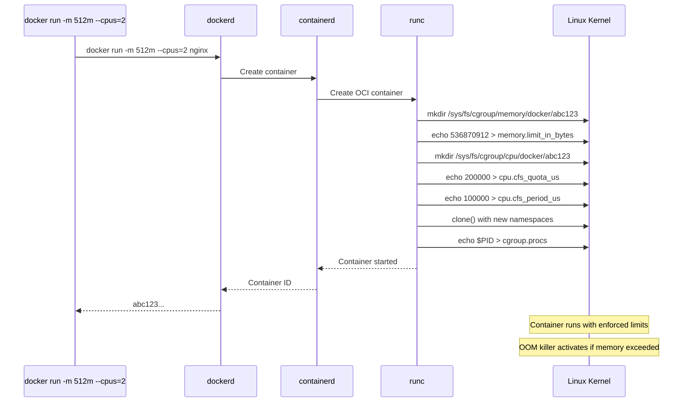
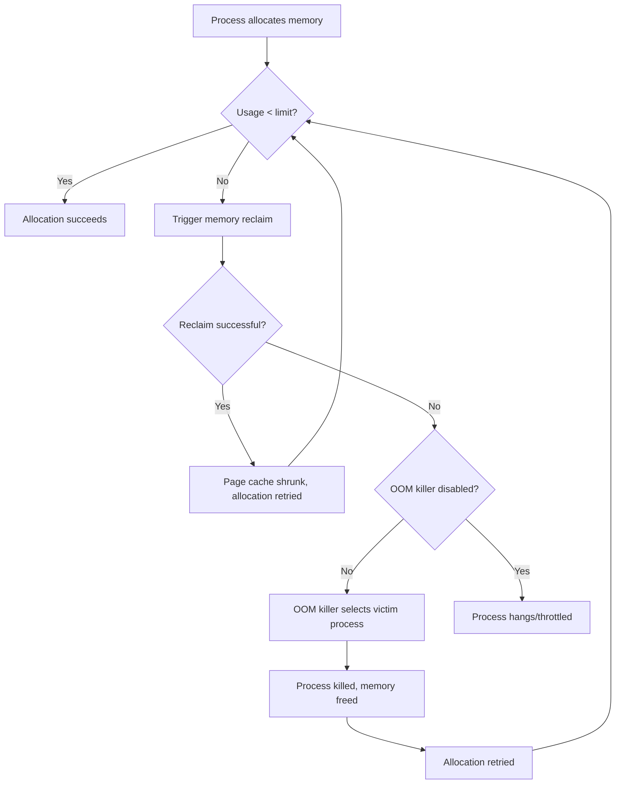

# Chapter 173: cgroups v1 — Hierarchy, Controllers, and Resource Management

## 1. Introduction

Control groups (cgroups) v1 is the Linux kernel's primary mechanism for organizing processes into hierarchical groups and applying resource limits, accounting, and control. While cgroups v2 is the successor, v1 remains widely deployed and is essential knowledge for anyone working with containers, as most production systems still use it (or a hybrid of v1 and v2).

Cgroups v1 was merged into Linux 2.6.24 (January 2008) and has been the backbone of container resource management for over a decade. Docker, Kubernetes, and virtually every container runtime relies on cgroups to enforce memory limits, CPU quotas, I/O throttling, and device access control.

The fundamental idea is simple: **group processes, then apply rules to the group.** Every process in a cgroup shares the same resource limits. The hierarchy (tree structure) means limits cascade — a child cgroup cannot exceed its parent's limits.

## 2. Architecture

### 2.1 The Multi-Hierarchy Design

The defining characteristic of cgroups v1 (and its most criticized design decision) is **multiple independent hierarchies**. Each controller (resource type) can be mounted on a different hierarchy, or multiple controllers can share a hierarchy.

```
/sys/fs/cgroup/
├── cpu,cpuacct/          # CPU and CPU accounting (shared hierarchy)
│   ├── docker/
│   │   ├── container-1/
│   │   └── container-2/
│   └── system.slice/
├── memory/               # Memory controller (separate hierarchy)
│   ├── docker/
│   │   ├── container-1/
│   │   └── container-2/
│   └── system.slice/
├── blkio/                # Block I/O controller (separate hierarchy)
│   ├── docker/
│   │   ├── container-1/
│   │   └── container-2/
│   └── system.slice/
├── devices/              # Device access controller
│   ├── docker/
│   └── system.slice/
├── net_cls,net_prio/     # Network classification (shared)
├── cpuset/               # CPU and memory node affinity
├── freezer/              # Process freezing
├── pids/                 # PID limiting
└── hugetlb/              # Huge page limiting
```

**The problem with multiple hierarchies:**

Consider a process in cgroup `/docker/container-1` in the memory hierarchy and `/docker/container-2` in the CPU hierarchy. These are **completely unrelated paths** — there's no requirement for the cgroup paths to match across hierarchies. This makes it impossible to atomically move a process between cgroups across all controllers.

```
Memory Hierarchy          CPU Hierarchy
──────────────            ─────────────
/                         /
├── docker/               ├── docker/
│   ├── container-1 ◄────│─── container-2   ← Different path!
│   └── container-2       └── container-1
```

This limitation is the primary motivation for cgroups v2's unified hierarchy.

### 2.2 The Kernel's View

From the kernel's perspective, each cgroup is represented by `struct cgroup`:

```c
// include/linux/cgroup-defs.h
struct cgroup {
    struct cgroup_subsys_state self;
    unsigned long flags;
    int id;
    
    // The hierarchy this cgroup belongs to
    struct cgroup_root *root;
    
    // Parent cgroup
    struct cgroup *parent;
    
    // Children list
    struct list_head children;
    struct list_head sibling;
    
    // Set of subsystem (controller) states
    struct cgroup_subsys_state *subsys[CGROUP_SUBSYS_COUNT];
    
    // ...
};
```

Each controller has a `cgroup_subsys_state` (CSS) attached to each cgroup:

```c
struct cgroup_subsys_state {
    struct cgroup *cgroup;
    struct cgroup_subsys *ss;
    struct percpu_ref refcnt;
    struct list_head sibling;
    struct list_head children;
    // ...
};
```

### 2.3 Mounting cgroups v1

```bash
# Typical mount setup (handled by systemd or cgmanager)
mount -t tmpfs cgroup_root /sys/fs/cgroup
mkdir /sys/fs/cgroup/cpu
mount -t cgroup -o cpu,cpuacct cgroup_cpu /sys/fs/cgroup/cpu
mkdir /sys/fs/cgroup/memory
mount -t cgroup -o memory cgroup_memory /sys/fs/cgroup/memory

# Verify mount options show which controllers are attached
mount | grep cgroup
# cgroup on /sys/fs/cgroup/cpu type cgroup (rw,nosuid,nodev,noexec,relatime,cpu,cpuacct)
# cgroup on /sys/fs/cgroup/memory type cgroup (rw,nosuid,nodev,noexec,relatime,memory)
```

**systemd's cgroup management:**

systemd creates and manages cgroups automatically. Each systemd unit (service, slice, scope) gets its own cgroup:

```
/sys/fs/cgroup/memory/
├── system.slice/              # System services
│   ├── sshd.service/
│   ├── docker.service/
│   └── nginx.service/
├── user.slice/                # User sessions
│   └── user-1000.slice/
│       └── session-1.scope/
└── machine.slice/             # VMs and containers
    └── docker-abc123.scope/
```

## 3. Controllers in Depth

### 3.1 CPU Controller

**Files and parameters:**

```
/sys/fs/cgroup/cpu/docker/<container-id>/
├── cpu.cfs_period_us       # Period length in microseconds (default: 100000 = 100ms)
├── cpu.cfs_quota_us        # CPU time allowed per period (-1 = unlimited)
├── cpu.shares              # Relative weight (default: 1024)
├── cpu.stat                # Statistics (nr_periods, nr_throttled, throttled_time)
├── cpuacct.usage           # Total CPU time consumed (nanoseconds)
├── cpuacct.usage_percpu    # Per-CPU usage
├── cpuacct.stat            # User/system time in USER_HZ
├── tasks                   # List of PIDs in this cgroup
└── cgroup.procs            # List of thread group leaders
```

**CFS Bandwidth Control (`cfs_quota_us` / `cfs_period_us`):**

The Completely Fair Scheduler (CFS) bandwidth controller enforces hard CPU limits:

```bash
# Limit to 2 CPU cores (200ms per 100ms period)
echo 200000 > /sys/fs/cgroup/cpu/docker/abc123/cpu.cfs_quota_us
echo 100000 > /sys/fs/cgroup/cpu/docker/abc123/cpu.cfs_period_us

# Limit to 0.5 CPU cores (50ms per 100ms period)
echo 50000 > /sys/fs/cgroup/cpu/docker/abc123/cpu.cfs_quota_us

# Unlimited (default)
echo -1 > /sys/fs/cgroup/cpu/docker/abc123/cpu.cfs_quota_us
```

**How Docker translates CPU limits:**

```bash
# docker run --cpus=2
# → cpu.cfs_quota_us = 200000, cpu.cfs_period_us = 100000

# docker run --cpus=0.5
# → cpu.cfs_quota_us = 50000, cpu.cfs_period_us = 100000

# docker run --cpu-shares=512
# → cpu.shares = 512
```

**CPU shares (weight-based scheduling):**

`cpu.shares` provides a **relative** weight, not a hard limit. If two cgroups have shares of 1024 and 2048, they get 1/3 and 2/3 of CPU time **when there's contention**. When there's no contention, a cgroup can use all available CPU.

**Kernel implementation:**

```c
// kernel/sched/fair.c — CFS bandwidth control
struct cfs_bandwidth {
    raw_spinlock_t lock;
    ktime_t period;
    u64 quota, runtime;
    s64 hierarchical_quota;
    // ...
};
```

**Source code references:**
- `kernel/sched/fair.c` — `sched_cfs_period_timer()`, `sched_cfs_quota_timer()`
- `kernel/sched/core.c` — `tg_set_cfs_bandwidth()`
- `kernel/cgroup/cpuset.c` — cpuset controller

### 3.2 Memory Controller

**Files and parameters:**

```
/sys/fs/cgroup/memory/docker/<container-id>/
├── memory.limit_in_bytes           # Hard memory limit
├── memory.soft_limit_in_bytes      # Soft limit (best-effort reclaim)
├── memory.usage_in_bytes           # Current usage
├── memory.max_usage_in_bytes       # Peak usage
├── memory.memsw.limit_in_bytes     # Memory + swap limit
├── memory.memsw.usage_in_bytes     # Memory + swap usage
├── memory.failcnt                  # Number of times limit was hit
├── memory.oom_control              # OOM killer configuration
├── memory.stat                     # Detailed memory statistics
├── memory.kmem.limit_in_bytes      # Kernel memory limit
├── memory.swappiness               # Swappiness override
├── memory.under_oom                # Currently under OOM pressure
├── memory.numa_stat                # Per-NUMA memory statistics
├── tasks                           # PIDs in this cgroup
└── cgroup.procs                    # Thread group leaders
```

**Setting memory limits:**

```bash
# Set 512MB limit
echo 536870912 > /sys/fs/cgroup/memory/docker/abc123/memory.limit_in_bytes

# Set using human-readable format (if supported)
echo "512M" > /sys/fs/cgroup/memory/docker/abc123/memory.limit_in_bytes

# Check current usage
cat /sys/fs/cgroup/memory/docker/abc123/memory.usage_in_bytes

# Check if OOM killer has been invoked
cat /sys/fs/cgroup/memory/docker/abc123/memory.failcnt
```

**How Docker translates memory limits:**

```bash
# docker run -m 512m
# → memory.limit_in_bytes = 536870912

# docker run -m 512m --memory-swap 1g
# → memory.limit_in_bytes = 536870912
# → memory.memsw.limit_in_bytes = 1073741824

# docker run -m 512m --memory-swap -1
# → memory.limit_in_bytes = 536870912
# → memory.memsw.limit_in_bytes = unlimited (kernel max)
```

**The OOM killer:**

When a cgroup hits its memory limit, the kernel's OOM killer selects a process within the cgroup to kill:

```
memory.oom_control:
  oom_kill_disable 0    # 1 = disable OOM killer (processes hang instead)
  under_oom 0           # 1 = currently under OOM pressure
```

Docker's `--oom-kill-disable` flag sets `oom_kill_disable = 1`. This is dangerous — the container's processes will hang (be throttled) rather than being killed, potentially requiring manual intervention.

**Memory statistics (`memory.stat`):**

```
cache 1234567              # Page cache
rss 2345678                # Anonymous memory
mapped_file 345678         # Memory-mapped files
pgpgin 4567890             # Pages paged in
pgpgout 5678901            # Pages paged out
pgfault 6789012            # Page faults
pgmajfault 789012          # Major page faults (disk I/O)
inactive_anon 890123       # Inactive anonymous pages
active_anon 901234         # Active anonymous pages
inactive_file 012345       # Inactive file cache
active_file 123456         # Active file cache
unevictable 234567         # Unevictable pages (mlocked)
hierarchical_memory_limit 536870912  # The limit
total_cache 1234567        # Including children
total_rss 2345678          # Including children
total_oom_kill_count 0     # OOM kills including children
```

**Kernel memory accounting:**

The `memory.kmem.limit_in_bytes` controls kernel memory (slab, stack, socket buffers). This was added to prevent containers from consuming unbounded kernel memory:

```bash
# Check kernel memory usage
cat /sys/fs/cgroup/memory/docker/abc123/memory.kmem.usage_in_bytes

# Set kernel memory limit (careful — too low causes hangs)
echo 268435456 > /sys/fs/cgroup/memory/docker/abc123/memory.kmem.limit_in_bytes
```

**Kernel implementation:**

```c
// mm/memcontrol.c
struct mem_cgroup {
    struct cgroup_subsys_state css;
    
    // Memory limits
    unsigned long memory_limit;
    unsigned long memsw_limit;
    unsigned long soft_limit;
    
    // Usage tracking
    struct page_counter memory;
    struct page_counter swap;
    struct page_counter kmem;
    struct page_counter tcpmem;
    
    // Statistics
    struct mem_cgroup_stat_cpu __percpu *stat;
    
    // OOM
    struct mem_cgroup_reclaim_iter iter;
    // ...
};
```

**Source code references:**
- `mm/memcontrol.c` — Main memory cgroup implementation
- `mm/vmscan.c` — Memory reclaim under cgroup pressure
- `mm/oom_kill.c` — OOM killer selection

### 3.3 Block I/O (blkio) Controller

**Files and parameters:**

```
/sys/fs/cgroup/blkio/docker/<container-id>/
├── blkio.throttle.read_bps_device     # Read bytes/sec limit per device
├── blkio.throttle.write_bps_device    # Write bytes/sec limit per device
├── blkio.throttle.read_iops_device    # Read IOPS limit per device
├── blkio.throttle.write_iops_device   # Write IOPS limit per device
├── blkio.weight                       # Default weight (10-1000, default 500)
├── blkio.weight_device                # Per-device weight
├── blkio.io_merged                   # I/O merges
├── blkio.io_queued                   # I/O operations queued
├── blkio.io_service_bytes            # Bytes transferred
├── blkio.io_serviced                 # Operations completed
├── blkio.io_service_time             # Time spent on I/O
├── blkio.io_wait_time                # Time waiting for I/O
├── blkio.io_time                     # Disk time
├── blkio.sectors                     # Sectors transferred
└── blkio.throttle.io_service_bytes   # Throttle controller statistics
```

**Setting I/O limits:**

```bash
# Get device major:minor numbers
ls -la /dev/sda
# brw-rw---- 1 root disk 8, 0 Jun 29 12:00 /dev/sda

# Limit read to 10MB/s on /dev/sda (8:0)
echo "8:0 10485760" > /sys/fs/cgroup/blkio/docker/abc123/blkio.throttle.read_bps_device

# Limit write to 5MB/s
echo "8:0 5242880" > /sys/fs/cgroup/blkio/docker/abc123/blkio.throttle.write_bps_device

# Limit read IOPS to 1000
echo "8:0 1000" > /sys/fs/cgroup/blkio/docker/abc123/blkio.throttle.read_iops_device

# Set weight (relative I/O priority)
echo 500 > /sys/fs/cgroup/blkio/docker/abc123/blkio.weight
```

**How Docker translates I/O limits:**

```bash
# docker run --device-read-bps /dev/sda:10mb
# → blkio.throttle.read_bps_device = "8:0 10485760"

# docker run --device-write-iops /dev/sda:1000
# → blkio.throttle.write_iops_device = "8:0 1000"

# docker run --blkio-weight 300
# → blkio.weight = 300
```

**CFQ vs BFQ:**

The blkio controller works with different I/O schedulers:
- **CFQ** (Completely Fair Queuing): Supports both weights and throttling
- **BFQ** (Budget Fair Queuing): Better for SSDs, supports weights
- **mq-deadline**: Only supports throttling, not weights
- **none**: No scheduling, blkio throttling still works

**Source code references:**
- `block/blk-cgroup.c` — blkio cgroup implementation
- `block/blk-throttle.c` — Throttle logic
- `block/cfq-iosched.c` — CFQ integration

### 3.4 Devices Controller

**Files and parameters:**

```
/sys/fs/cgroup/devices/docker/<container-id>/
├── devices.list           # Currently allowed devices
├── devices.deny           # Add device to deny list
├── devices.allow          # Add device to allow list
└── tasks                  # PIDs in this cgroup
```

**Device access format:**

```
type major:minor access
```

Where:
- `type`: `a` (all), `c` (character), `b` (block)
- `major:minor`: Device numbers, or `*` for all
- `access`: `r` (read), `w` (write), `m` (mknod)

**Configuring device access:**

```bash
# Default devices.list in a Docker container
cat /sys/fs/cgroup/devices/docker/abc123/devices.list
# a *:* rwm     # All devices allowed (Docker adds its own seccomp/apparmor)

# Deny all devices
echo "a *:* rwm" > /sys/fs/cgroup/devices/docker/abc123/devices.deny

# Allow only /dev/null (1:3) and /dev/zero (1:5)
echo "c 1:3 rwm" > /sys/fs/cgroup/devices/docker/abc123/devices.allow
echo "c 1:5 rwm" > /sys/fs/cgroup/devices/docker/abc123/devices.allow

# Allow /dev/sda (8:0) read-only
echo "b 8:0 r" > /sys/fs/cgroup/devices/docker/abc123/devices.allow
```

**How Docker uses device cgroups:**

```bash
# docker run --device /dev/fuse
# → devices.allow: "c 10:229 rwm" (fuse device)

# docker run --device /dev/sda:/dev/xvda:r
# → devices.allow: "b 8:0 r" (read-only access)
```

**Source code references:**
- `security/device_cgroup.c` — Device cgroup implementation

### 3.5 cpuset Controller

**Files and parameters:**

```
/sys/fs/cgroup/cpuset/docker/<container-id>/
├── cpuset.cpus              # Allowed CPUs
├── cpuset.mems              # Allowed NUMA memory nodes
├── cpuset.memory_migrate    # Migrate memory on node change
├── cpuset.cpu_exclusive     # Exclusive CPU access
├── cpuset.mem_exclusive     # Exclusive memory node access
├── cpuset.mem_hardwall      # Hardwall for memory allocation
├── cpuset.sched_load_balance # Load balancing
└── cpuset.sched_relax_domain_level # Scheduling domain level
```

**Configuration:**

```bash
# Pin container to CPUs 0, 1, 2
echo "0-2" > /sys/fs/cgroup/cpuset/docker/abc123/cpuset.cpus

# Pin to NUMA node 0
echo "0" > /sys/fs/cgroup/cpuset/docker/abc123/cpuset.mems

# Docker equivalent:
# docker run --cpuset-cpus="0-2" --cpuset-mems="0"
```

**Source code references:**
- `kernel/cgroup/cpuset.c` — cpuset controller

### 3.6 Other Controllers

**Freezer:**

```bash
# Freeze all processes in a container
echo FROZEN > /sys/fs/cgroup/freezer/docker/abc123/freezer.state

# Check status
cat /sys/fs/cgroup/freezer/docker/abc123/freezer.state
# FROZEN or THAWED

# Unfreeze
echo THAWED > /sys/fs/cgroup/freezer/docker/abc123/freezer.state
```

**PID controller:**

```bash
# Limit number of processes
echo 100 > /sys/fs/cgroup/pids/docker/abc123/pids.max

# Check current count
cat /sys/fs/cgroup/pids/docker/abc123/pids.current

# Docker equivalent:
# docker run --pids-limit 100
```

**net_cls controller:**

```bash
# Tag packets from this cgroup with a classid
echo 0x10001 > /sys/fs/cgroup/net_cls/docker/abc123/net_cls.classid

# Use with tc (traffic control) to shape traffic
tc filter add dev eth0 parent 1: protocol ip cgroup classid 1:1
```

**hugetlb controller:**

```bash
# Limit huge page usage (2MB pages)
echo 268435456 > /sys/fs/cgroup/hugetlb/docker/abc123/hugetlb.2MB.limit_in_bytes

# Check usage
cat /sys/fs/cgroup/hugetlb/docker/abc123/hugetlb.2MB.usage_in_bytes
```

## 4. The `/sys/fs/cgroup` Filesystem

### 4.1 Structure

The cgroup filesystem is a virtual filesystem (like `/proc` or `/sys`). It's mounted by systemd during boot:

```bash
# View all cgroup mounts
mount -t cgroup
# cgroup on /sys/fs/cgroup/systemd type cgroup (rw,...,none,name=systemd)
# cgroup on /sys/fs/cgroup/cpu,cpuacct type cgroup (rw,...,cpu,cpuacct)
# cgroup on /sys/fs/cgroup/memory type cgroup (rw,...,memory)
# cgroup on /sys/fs/cgroup/blkio type cgroup (rw,...,blkio)
# cgroup on /sys/fs/cgroup/devices type cgroup (rw,...,devices)
# cgroup on /sys/fs/cgroup/cpuset type cgroup (rw,...,cpuset)
# cgroup on /sys/fs/cgroup/net_cls,net_prio type cgroup (rw,...,net_cls,net_prio)
# cgroup on /sys/fs/cgroup/pids type cgroup (rw,...,pids)
# cgroup on /sys/fs/cgroup/freezer type cgroup (rw,...,freezer)
# cgroup on /sys/fs/cgroup/hugetlb type cgroup (rw,...,hugetlb)
# cgroup on /sys/fs/cgroup/perf_event type cgroup (rw,...,perf_event)
```

### 4.2 Creating and Managing cgroups

```bash
# Create a new cgroup (mkdir)
mkdir /sys/fs/cgroup/memory/my-container

# A new directory is automatically populated with control files
ls /sys/fs/cgroup/memory/my-container/
# cgroup.clone_children  memory.usage_in_bytes
# cgroup.procs            memory.max_usage_in_bytes
# ...

# Add a process to the cgroup
echo $PID > /sys/fs/cgroup/memory/my-container/cgroup.procs

# Remove a cgroup (rmdir — only if no processes remain)
rmdir /sys/fs/cgroup/memory/my-container
```

### 4.3 Notification on Limits

cgroups v1 supports event notification via `eventfd`:

```bash
# memory.oom_control allows notification when OOM occurs
# Applications can use cgroup.event_control to register for events
# Docker/containerd watches these to handle OOM events
```

### 4.4 The `cgroup.clone_children` File

When set to 1, new child cgroups inherit the parent's configuration:

```bash
echo 1 > /sys/fs/cgroup/cpuset/cpuset.clone_children
# Now new child cgroups inherit cpuset.cpus and cpuset.mems
```

## 5. Mermaid Diagrams

### 5.1 cgroups v1 Multi-Hierarchy Architecture

```mermaid
graph TD
    subgraph "CPU Hierarchy (/sys/fs/cgroup/cpu)"
        ROOT_CPU[/] --> SYSTEM_CPU[system.slice]
        ROOT_CPU --> DOCKER_CPU[docker/]
        DOCKER_CPU --> C1_CPU[container-1<br/>shares=1024]
        DOCKER_CPU --> C2_CPU[container-2<br/>shares=512]
    end
    
    subgraph "Memory Hierarchy (/sys/fs/cgroup/memory)"
        ROOT_MEM[/] --> SYSTEM_MEM[system.slice]
        ROOT_MEM --> DOCKER_MEM[docker/]
        DOCKER_MEM --> C1_MEM[container-1<br/>limit=512M]
        DOCKER_MEM --> C2_MEM[container-2<br/>limit=256M]
    end
    
    subgraph "Block I/O Hierarchy (/sys/fs/cgroup/blkio)"
        ROOT_BLK[/] --> SYSTEM_BLK[system.slice]
        ROOT_BLK --> DOCKER_BLK[docker/]
        DOCKER_BLK --> C1_BLK[container-1<br/>weight=500]
        DOCKER_BLK --> C2_BLK[container-2<br/>weight=300]
    end
    
    P1[Process A<br/>PID 42] -.-> C1_CPU
    P1 -.-> C1_MEM
    P1 -.-> C1_BLK
    
    P2[Process B<br/>PID 84] -.-> C2_CPU
    P2 -.-> C2_MEM
    P2 -.-> C2_BLK
```

### 5.2 Container Resource Limit Flow



### 5.3 Memory Limit Enforcement



## 6. Common Pitfalls

### 6.1 Memory Limit Too Low

Setting a memory limit below the minimum required causes immediate OOM kills:

```bash
# This will likely OOM immediately
docker run -m 4m alpine echo hello
# Error: container killed by OOM
```

**Rule of thumb:** Minimum ~10MB for a simple container, 50-100MB for a typical application.

### 6.2 CPU Shares vs CPU Quota Confusion

```bash
# Shares are RELATIVE weights — no hard limit
docker run --cpu-shares=512 nginx
# This container gets 512/(512+1024) = 1/3 of CPU during contention
# But can use 100% of CPU when idle

# Quota is a HARD limit
docker run --cpus=0.5 nginx
# This container gets at most 50% of one CPU, always
```

### 6.3 Swap Accounting

By default, Docker limits memory but not swap. A container with `-m 512m` can actually use 1GB (512MB memory + 512MB swap):

```bash
# To limit total memory+swap:
docker run -m 512m --memory-swap 768m nginx
# Memory: 512MB, Swap: 256MB (total: 768MB)

# To disable swap entirely:
docker run -m 512m --memory-swap 512m nginx
# Memory: 512MB, Swap: 0
```

### 6.4 cgroup v1 Path Mismatch

When different controllers are on different hierarchies, the cgroup paths may not match. Docker handles this internally, but custom scripts may break:

```bash
# Memory path
/sys/fs/cgroup/memory/docker/abc123/

# CPU path might be different if hierarchies diverge
/sys/fs/cgroup/cpu,cpuacct/docker/abc123/
```

### 6.5 The blkio Weight Caveat

The `blkio.weight` only works with the CFQ I/O scheduler. Modern kernels use `mq-deadline` or `none` by default, where only throttle limits work:

```bash
# Check current scheduler
cat /sys/block/sda/queue/scheduler
# [mq-deadline] none

# Weight won't work with mq-deadline
# Use throttle limits instead:
echo "8:0 10485760" > blkio.throttle.read_bps_device
```

## 7. Best Practices

1. **Set both memory and swap limits** — Don't rely on default swap behavior. Use `--memory-swap` explicitly.

2. **Monitor `memory.stat` regularly** — Track `pgmajfault` (major page faults) to detect memory pressure before OOM.

3. **Use CPU quota for predictable performance** — Shares only help during contention. Use `--cpus` for guaranteed limits.

4. **Set pids-limit** — Prevent fork bombs: `--pids-limit=100` is a reasonable default.

5. **Use cpuset for latency-sensitive workloads** — Pin to specific CPUs and NUMA nodes to avoid scheduling jitter.

6. **Don't disable the OOM killer** — `--oom-kill-disable` should only be used when you have external monitoring.

7. **Check I/O scheduler before using blkio weights** — If using mq-deadline, use throttle limits instead.

8. **Account for kernel memory** — In cgroups v1, kernel memory (kmem) accounting may need separate limits.

## 8. Exercises

### Exercise 1: Manual cgroup Creation

Create a cgroup that limits a process to 100MB memory and 50% of one CPU:

```bash
# Create memory cgroup
mkdir /sys/fs/cgroup/memory/test-group
echo 104857600 > /sys/fs/cgroup/memory/test-group/memory.limit_in_bytes

# Create CPU cgroup
mkdir /sys/fs/cgroup/cpu/test-group
echo 50000 > /sys/fs/cgroup/cpu/test-group/cpu.cfs_quota_us
echo 100000 > /sys/fs/cgroup/cpu/test-group/cpu.cfs_period_us

# Run a process in the cgroup
bash -c 'echo $$ > /sys/fs/cgroup/memory/test-group/cgroup.procs; echo $$ > /sys/fs/cgroup/cpu/test-group/cgroup.procs; stress --vm 1 --vm-bytes 200M --vm-keep'

# Watch it get OOM killed
# Then clean up
rmdir /sys/fs/cgroup/memory/test-group
rmdir /sys/fs/cgroup/cpu/test-group
```

### Exercise 2: Monitor Container Resources

Write a script that monitors a Docker container's cgroup statistics:

```bash
#!/bin/bash
CONTAINER=$1
CGROUP_PATH=$(find /sys/fs/cgroup/memory/docker/ -name "${CONTAINER}*" -type d | head -1)

if [ -z "$CGROUP_PATH" ]; then
    echo "Container not found"
    exit 1
fi

while true; do
    MEM=$(cat "$CGROUP_PATH/memory.usage_in_bytes")
    MEM_MB=$((MEM / 1024 / 1024))
    FAILS=$(cat "$CGROUP_PATH/memory.failcnt")
    CPU=$(cat "${CGROUP_PATH/memory/cpu}/cpuacct.usage")
    
    echo "$(date): Memory=${MEM_MB}MB, Failures=${FAILS}, CPU_ns=${CPU}"
    sleep 1
done
```

### Exercise 3: Compare CPU Shares vs Quota

Run two containers and observe the difference:

```bash
# Test 1: Shares (relative)
docker run -d --name c1 --cpu-shares=1024 stress --cpu 1
docker run -d --name c2 --cpu-shares=512 stress --cpu 1
# Monitor: c1 gets ~2/3, c2 gets ~1/3 of CPU

# Test 2: Quota (absolute)
docker run -d --name c3 --cpus=1 stress --cpu 1
docker run -d --name c4 --cpus=0.5 stress --cpu 1
# Monitor: c3 gets exactly 1 CPU, c4 gets exactly 0.5 CPU
```

## 9. References

1. Linux kernel source: `kernel/cgroup/` — cgroup core
2. `mm/memcontrol.c` — Memory cgroup controller
3. `kernel/sched/fair.c` — CFS bandwidth control
4. `block/blk-cgroup.c` — Block I/O cgroup
5. `security/device_cgroup.c` — Device cgroup
6. `man 7 cgroups` — cgroups overview
7. Documentation/cgroup-v1/ in Linux kernel source
8. "cgroups v1" — Red Hat Enterprise Linux Resource Management Guide
9. Google's cgroup documentation (original design)
10. systemd cgroup hierarchy documentation
11. Docker resource constraints documentation
