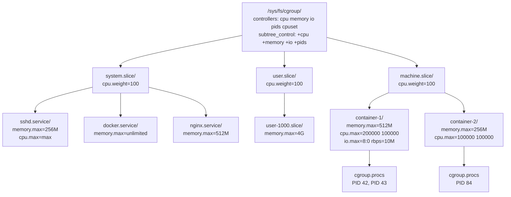
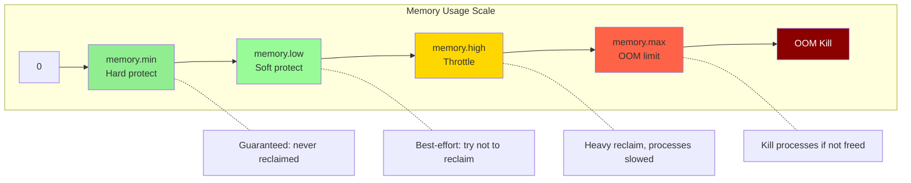
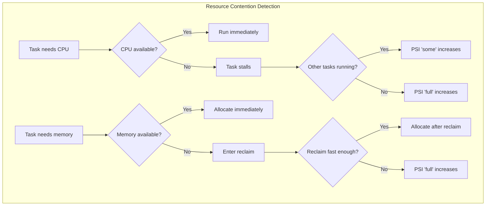

# Chapter 174: cgroups v2 — Unified Hierarchy, Delegation, and PSI

## 1. Introduction

cgroups v2 (Linux 4.5+, February 2016) is the successor to cgroups v1, designed to fix the fundamental architectural problems of the v1 multi-hierarchy model. Its core innovation is a **single unified hierarchy** where all controllers operate on the same tree, enabling consistent resource management and solving the path-mismatch problems that plagued v1.

cgroups v2 is now the default on most modern distributions (Ubuntu 22.04+, Fedora 31+, Debian 11+, RHEL 9+) and is required for many advanced container features including rootless containers with proper resource limits, and Pressure Stall Information (PSI).

## 2. Architecture: The Unified Hierarchy

### 2.1 Single Tree, All Controllers

In v2, there is exactly **one cgroup hierarchy**, mounted at `/sys/fs/cgroup`. All controllers operate on this single tree:

```
/sys/fs/cgroup/                    # v2 mount point
├── cgroup.controllers             # Available controllers
├── cgroup.subtree_control         # Controllers enabled for children
├── cgroup.procs                   # Processes in root cgroup
├── system.slice/
│   ├── cgroup.controllers         # Inherited from parent
│   ├── cgroup.subtree_control     # What's enabled below
│   ├── sshd.service/
│   │   ├── cgroup.controllers
│   │   ├── memory.max
│   │   ├── cpu.max
│   │   └── cgroup.procs
│   └── docker.service/
│       ├── cgroup.subtree_control
│       └── abc123.../
│           ├── memory.max
│           ├── cpu.max
│           ├── io.max
│           └── cgroup.procs
└── user.slice/
    └── user-1000.slice/
        └── session-1.scope/
```

**Key difference from v1:** In v1, you could mount `memory` on one tree and `cpu` on another. In v2, everything is in one tree. A process belongs to exactly one cgroup, and that cgroup's position in the tree determines all its resource limits.

### 2.2 The Subtree Control Model

cgroups v2 introduces a two-level control model:

- **`cgroup.controllers`** — Lists controllers available at this cgroup (read-only, inherited from parent)
- **`cgroup.subtree_control`** — Lists controllers that are active for child cgroups (read-write)

This means you must **explicitly enable** controllers for child cgroups:

```bash
# See what's available
cat /sys/fs/cgroup/cgroup.controllers
# cpuset cpu io memory hugetlb pids rdma misc

# Enable cpu and memory for children
echo "+cpu +memory" > /sys/fs/cgroup/cgroup.subtree_control

# Now child cgroups can use cpu.max and memory.max
```

**Why this matters:** Controllers have overhead. Enabling a controller means the kernel tracks that resource for every process in the subtree. The subtree control model lets you enable controllers only where needed.

### 2.3 Internal vs Leaf Nodes

A critical constraint: **a cgroup that has processes cannot also have child cgroups with enabled controllers.** This prevents the situation where a parent cgroup directly contains processes while also managing resource distribution to children.

```bash
# This is OK: processes in a leaf cgroup
/sys/fs/cgroup/my-app/
├── cgroup.procs      ← processes here
├── memory.max
└── cpu.max

# This is NOT OK (in strict mode): processes in a cgroup that also has
# children with subtree_control enabled
/sys/fs/cgroup/system.slice/
├── cgroup.procs      ← processes here (violates "no internal process" constraint)
├── cgroup.subtree_control = "+cpu +memory"  ← controllers active for children
└── sshd.service/
    └── ...
```

The kernel enforces this with the "no internal process" constraint: if `cgroup.subtree_control` has any controllers enabled, `cgroup.procs` cannot contain processes (they must be in leaf cgroups).

**Exception:** The "domain" controllers (cpu, memory, io) enforce this. Some controllers (like pids) may work differently.

## 3. Controllers in cgroups v2

### 3.1 Memory Controller

**Files:**

```
memory.current           # Current memory usage (read-only)
memory.min               # Hard minimum (protected memory)
memory.low               # Best-effort minimum (soft protected)
memory.high              # Memory throttle point (OOM-safety valve)
memory.max               # Hard limit (OOM kill if exceeded)
memory.oom.group         # Kill entire group on OOM (not just one process)
memory.swap.current      # Current swap usage
memory.swap.max          # Swap limit
memory.swap.high         # Swap throttle point
memory.swap.events       # Swap-related events
memory.stat              # Detailed statistics
memory.events            # OOM, OOM_kill, high, low, max events
memory.events.local      # Same, but only for this cgroup (not children)
memory.pressure          # PSI memory pressure (see section 5)
memory.numa_stat         # Per-NUMA statistics
memory.reclaim           # Trigger proactive reclaim
memory.peak              # Historical peak usage
memory.zswap.current     # Zswap usage
memory.zswap.max         # Zswap limit
```

**The four-level memory protection model:**

```
┌─────────────────────────────────────────────────────────────┐
│  memory.max    ══════════════════════  Hard limit (OOM kill)│
│  memory.high   ═══════════════════    Throttle (heavy reclaim)
│  memory.low    ═══════════════        Soft protect (best-effort)
│  memory.min    ═══════════            Hard protect (guaranteed)
│                                                             │
│  Below min:     Protected, won't be reclaimed               │
│  Between min-low: Protected if possible                     │
│  Between low-high: Normal reclaim                           │
│  Above high:     Heavy reclaim, processes throttled         │
│  Above max:      OOM killer invoked                         │
└─────────────────────────────────────────────────────────────┘
```

**Configuration example:**

```bash
# Enable memory controller for children
echo "+memory" > /sys/fs/cgroup/cgroup.subtree_control

# Create a container cgroup
mkdir /sys/fs/cgroup/my-container

# Set limits
echo "536870912" > /sys/fs/cgroup/my-container/memory.max      # 512MB hard limit
echo "268435456" > /sys/fs/cgroup/my-container/memory.high     # 256MB throttle point
echo "134217728" > /sys/fs/cgroup/my-container/memory.low      # 128MB soft protection
echo "67108864"  > /sys/fs/cgroup/my-container/memory.min      # 64MB guaranteed

# Set swap limit (total memory+swap = 768MB)
echo "268435456" > /sys/fs/cgroup/my-container/memory.swap.max  # 256MB swap

# Kill entire cgroup on OOM (not just one process)
echo "1" > /sys/fs/cgroup/my-container/memory.oom.group

# Check current usage
cat /sys/fs/cgroup/my-container/memory.current

# Check events
cat /sys/fs/cgroup/my-container/memory.events
# low 0
# high 5
# max 1
# oom 0
# oom_kill 0
# oom_group_kill 0
```

**`memory.high` throttle behavior:**

When a cgroup exceeds `memory.high`, the kernel:
1. Marks processes in the cgroup for heavy reclaim
2. Processes are throttled (slowed down) as they enter kernel memory allocation paths
3. This is **not** an OOM kill — it's a pressure-based throttle
4. The cgroup can still allocate memory, but much more slowly

This makes `memory.high` the ideal "safety valve" — set it below `memory.max` so the system has time to reclaim before hitting the hard limit.

**`memory.min` and `memory.low` protection:**

```bash
# Guarantee database gets at least 1GB
echo "1073741824" > /sys/fs/cgroup/system.slice/postgresql.service/memory.min

# Best-effort protection of 2GB
echo "2147483648" > /sys/fs/cgroup/system.slice/postgresql.service/memory.low
```

When the system is under memory pressure:
- `memory.min`: The kernel will **never** reclaim from this cgroup below this amount. It will OOM-kill other processes first.
- `memory.low`: The kernel will **try** not to reclaim below this amount, but will if absolutely necessary.

**Kernel implementation:**

```c
// mm/memcontrol.c (v2)
struct mem_cgroup {
    struct cgroup_subsys_state css;
    
    // v2 counters
    struct page_counter memory;      // Main memory counter
    struct page_counter swap;        // Swap counter
    struct page_counter memsw;       // Memory + swap
    struct page_counter kmem;        // Kernel memory
    
    // Protection values
    unsigned long memory_min;        // Hard protection
    unsigned long memory_low;        // Soft protection
    unsigned long memory_high;       // Throttle point
    unsigned long memory_max;        // Hard limit
    unsigned long swap_max;          // Swap limit
    unsigned long swap_high;         // Swap throttle
    
    // OOM group kill
    bool oom_group;
    
    // Events
    struct memory_events memory_events;
    struct memory_events memory_events_local;
    
    // ...
};
```

### 3.2 CPU Controller

**Files:**

```
cpu.max              # "quota period" — hard bandwidth limit
cpu.max.burst        # Burst allowance
cpu.weight           # Relative weight (1-10000, default 100)
cpu.weight.nice      # Weight mapped from nice value
cpu.stat             # Usage statistics
cpu.pressure         # PSI CPU pressure
cpu.uclamp.min       # Minimum utilization clamp
cpu.uclamp.max       # Maximum utilization clamp
```

**`cpu.max` — Bandwidth control:**

```bash
# Format: "$MAX $PERIOD" or "max $PERIOD"
# Limit to 2 CPUs (200ms per 100ms period)
echo "200000 100000" > /sys/fs/cgroup/my-container/cpu.max

# Limit to 0.5 CPU
echo "50000 100000" > /sys/fs/cgroup/my-container/cpu.max

# Unlimited (default)
echo "max 100000" > /sys/fs/cgroup/my-container/cpu.max
```

**`cpu.weight` — Relative weight:**

```bash
# Range: 1-10000, default 100
# Doubling the weight roughly doubles the CPU share
echo "200" > /sys/fs/cgroup/my-container/cpu.weight

# Two cgroups with weights 100 and 200:
# First gets 1/3, second gets 2/3 of CPU during contention
```

**Difference from v1:**
- v1: `cpu.shares` (range 2-262144, default 1024)
- v2: `cpu.weight` (range 1-10000, default 100)

**`cpu.max.burst` — Burst allowance:**

```bash
# Allow burst up to 400ms of CPU time
echo "400000 100000" > /sys/fs/cgroup/my-container/cpu.max.burst
```

This allows a cgroup to "bank" unused CPU time from previous periods and use it later. Useful for bursty workloads.

**`cpu.uclamp` — Utilization clamping:**

```bash
# Minimum utilization hint (affects frequency scaling)
echo "50.0" > /sys/fs/cgroup/my-container/cpu.uclamp.min

# Maximum utilization hint
echo "80.0" > /sys/fs/cgroup/my-container/cpu.uclamp.max
```

These are hints to the scheduler and frequency governor, not hard limits. They influence CPU frequency scaling decisions.

**Source code references:**
- `kernel/sched/fair.c` — CFS v2 bandwidth control
- `kernel/cgroup/cpuset-v2.c` — cpuset v2

### 3.3 I/O Controller

**Files:**

```
io.max                # Per-device I/O limits (bps and iops)
io.latency            # Target latency
io.cost               # Cost model-based control
io.cost.qos            # QoS parameters
io.cost.model          # Cost model parameters
io.stat               # Per-device statistics
io.pressure           # PSI I/O pressure
io.weight             # Per-device weight (v2 style)
io.prio.class         # Priority class
```

**`io.max` — Hard I/O limits:**

```bash
# Format: "MAJOR:MINOR rbps=BYTES wbps=BYTES riops=COUNT wiops=COUNT"
# Limit /dev/sda (8:0) to 10MB/s read, 5MB/s write, 1000 read IOPS
echo "8:0 rbps=10485760 wbps=5242880 riops=1000 wiops=500" > /sys/fs/cgroup/my-container/io.max

# Remove limits on a device
echo "8:0 rbps=max wbps=max riops=max wiops=max" > /sys/fs/cgroup/my-container/io.max
```

**`io.latency` — Latency-based control:**

```bash
# Target latency of 5ms for /dev/sda
echo "8:0 target=5000" > /sys/fs/cgroup/my-container/io.latency
```

The I/O controller will throttle other cgroups to maintain this target latency. This is more adaptive than fixed bps/iops limits.

**`io.cost` — Cost model control:**

```bash
# Define cost model for the device
echo "8:0 ctrl=auto" > /sys/fs/cgroup/io.cost.model

# Set QoS parameters
echo "8:0 enable=1 rpct=95.00 rlat=10000 wpct=95.00 wlat=10000 min=50.00 max=150.00" > /sys/fs/cgroup/io.cost.qos

# Set weight per device
echo "8:0 100" > /sys/fs/cgroup/my-container/io.weight
```

The cost model converts I/O operations into a unified "cost" that accounts for device characteristics (latency, throughput), enabling fair sharing across different types of I/O.

**Source code references:**
- `block/blk-cgroup.c` — I/O cgroup core
- `block/blk-iolatency.c` — Latency controller
- `block/blk-iocost.c` — Cost model controller

### 3.4 PID Controller

**Files:**

```
pids.max          # Maximum number of PIDs
pids.current      # Current number of PIDs
pids.peak         # Historical peak PID count
pids.events       # Events (max hit)
```

```bash
echo "100" > /sys/fs/cgroup/my-container/pids.max
cat /sys/fs/cgroup/my-container/pids.current
```

### 3.5 IO Priority (io.prio.class)

```bash
# Set I/O scheduling class
# idle, best-effort, realtime
echo "best-effort" > /sys/fs/cgroup/my-container/io.prio.class
```

### 3.6 cpuset Controller (v2)

**Files:**

```
cpuset.cpus           # Allowed CPUs
cpuset.cpus.partition  # Partition type (root, member, isolated)
cpuset.mems           # Allowed memory nodes
cpuset.cpus.effective  # Actually available CPUs
cpuset.mems.effective  # Actually available memory nodes
```

```bash
echo "+cpuset" > /sys/fs/cgroup/cgroup.subtree_control
mkdir /sys/fs/cgroup/pinned

# Pin to CPUs 0-3
echo "0-3" > /sys/fs/cgroup/pinned/cpuset.cpus
echo "0" > /sys/fs/cgroup/pinned/cpuset.mems

# Create an isolated partition (exclusive CPUs)
echo "root" > /sys/fs/cgroup/pinned/cpuset.cpus.partition
```

**Partition types:**
- `root`: This cgroup is the root of a partition
- `member`: This cgroup is a member of a parent's partition
- `isolated`: CPUs are isolated from the kernel scheduler

## 4. Delegation

### 4.1 What is Delegation?

Delegation is cgroups v2's mechanism for **unprivileged resource management**. A privileged process can delegate a subtree of the cgroup hierarchy to an unprivileged user, who can then create child cgroups and manage resources within that subtree.

This is essential for:
- Rootless containers (Podman, Docker rootless)
- systemd user instances
- Multi-tenant systems

### 4.2 How Delegation Works

**Step 1: Create a delegated subtree:**

```bash
# As root, create the delegation cgroup
mkdir /sys/fs/cgroup/my-user

# Change ownership to the target user
chown myuser:myuser /sys/fs/cgroup/my-user

# Also change key files
chown myuser:myuser /sys/fs/cgroup/my-user/cgroup.procs
chown myuser:myuser /sys/fs/cgroup/my-user/cgroup.subtree_control
chown myuser:myuser /sys/fs/cgroup/my-user/cgroup.threads
chown myuser:myuser /sys/fs/cgroup/my-user/memory.max
chown myuser:myuser /sys/fs/cgroup/my-user/cpu.max
# ... etc for all controller files
```

**Step 2: Enable controllers for the subtree:**

```bash
# Enable controllers at the delegation point
echo "+cpu +memory +io +pids" > /sys/fs/cgroup/my-user/cgroup.subtree_control
```

**Step 3: The delegated user manages their subtree:**

```bash
# As myuser, create child cgroups
mkdir /sys/fs/cgroup/my-user/container-1
echo "536870912" > /sys/fs/cgroup/my-user/container-1/memory.max
echo "200000 100000" > /sys/fs/cgroup/my-user/container-1/cpu.max
echo $PID > /sys/fs/cgroup/my-user/container-1/cgroup.procs
```

### 4.3 systemd's Delegation

systemd automatically delegates cgroup subtrees for user sessions and containers:

```ini
# /etc/systemd/system/my-container.service
[Service]
Delegate=yes
# Or specify specific controllers:
# Delegate=cpu memory pids

# This means the service manager (containerd, etc.) can create
# child cgroups within this service's cgroup
```

### 4.4 Rootless Container Delegation

For rootless Docker/Podman, the delegation chain is:

```
systemd (PID 1, root)
└── user@1000.service (systemd user instance)
    └── user.slice (delegated to user)
        └── podman-abc123.scope (created by Podman)
            └── container-1/
                ├── memory.max
                ├── cpu.max
                └── cgroup.procs
```

## 5. Pressure Stall Information (PSI)

### 5.1 What is PSI?

PSI (Linux 4.20+, December 2018) measures **resource pressure** — how much time tasks spend waiting for resources. Unlike raw utilization metrics (which show how busy a resource is), PSI shows the **impact** of resource contention on task performance.

PSI provides three metrics per resource:
- **some** — At least one task is stalled
- **full** — All tasks are stalled (no useful work possible)
- Both reported as: avg10 (10-second average), avg60, avg300, total (microseconds)

### 5.2 Per-Cgroup PSI

cgroups v2 exposes PSI per-cgroup:

```bash
# Memory pressure for a container
cat /sys/fs/cgroup/my-container/memory.pressure
# some avg10=0.50 avg60=1.20 avg300=0.80 total=123456789
# full avg10=0.10 avg60=0.30 avg300=0.20 total=45678901

# CPU pressure
cat /sys/fs/cgroup/my-container/cpu.pressure
# some avg10=2.30 avg60=1.80 avg300=1.50 total=987654321
# full avg10=0.00 avg60=0.00 avg300=0.00 total=0

# I/O pressure
cat /sys/fs/cgroup/my-container/io.pressure
# some avg10=0.05 avg60=0.02 avg300=0.01 total=12345678
# full avg10=0.01 avg60=0.00 avg300=0.00 total=1234567
```

**Interpreting PSI:**

- `some avg10=5.00` — In the last 10 seconds, 5% of the time at least one task was stalled on this resource
- `full avg10=2.00` — 2% of the time, all tasks were completely stalled
- `total=123456789` — Cumulative stall time in microseconds

**When `full > 0` for memory:** Tasks are actively blocked waiting for memory reclaim. This is a strong signal that the cgroup needs more memory.

### 5.3 Using PSI for Auto-Scaling

```bash
#!/bin/bash
# Simple PSI-based scaling trigger
THRESHOLD=10.0

while true; do
    PRESSURE=$(cat /sys/fs/cgroup/my-app/cpu.pressure | grep some | awk '{print $2}' | cut -d= -f2)
    if (( $(echo "$PRESSURE > $THRESHOLD" | bc -l) )); then
        echo "CPU pressure high ($PRESSURE%), scaling up..."
        # Trigger scaling action
    fi
    sleep 5
done
```

### 5.4 PSI Polling Interface

Applications can poll for PSI events using `poll()` on the pressure files:

```c
#include <fcntl.h>
#include <poll.h>
#include <stdio.h>
#include <stdlib.h>
#include <string.h>
#include <unistd.h>

int main() {
    int fd = open("/sys/fs/cgroup/my-container/memory.pressure", O_RDWR);
    
    // Register for events: trigger when "some" pressure exceeds 50% over 1 second
    const char *trigger = "some 500000 1000000";  // 50% over 1s (microseconds)
    write(fd, trigger, strlen(trigger));
    
    struct pollfd fds = { .fd = fd, .events = POLLPRI };
    
    while (1) {
        int ret = poll(&fds, 1, -1);
        if (ret > 0 && (fds.revents & POLLPRI)) {
            printf("Memory pressure event triggered!\n");
            // Re-register (edge-triggered)
            lseek(fd, 0, SEEK_SET);
            write(fd, trigger, strlen(trigger));
        }
    }
    
    close(fd);
    return 0;
}
```

## 6. Mermaid Diagrams

### 6.1 cgroups v2 Unified Hierarchy



### 6.2 Memory Protection Levels



### 6.3 PSI Pressure Model



## 7. Common Pitfalls

### 7.1 Forgetting `cgroup.subtree_control`

```bash
# This does nothing — cpu controller not enabled for children
mkdir /sys/fs/cgroup/my-app
echo "200000 100000" > /sys/fs/cgroup/my-app/cpu.max
# Error: No such file or directory (cpu.max doesn't exist)

# Fix: Enable the controller first
echo "+cpu" > /sys/fs/cgroup/cgroup.subtree_control
mkdir /sys/fs/cgroup/my-app
echo "200000 100000" > /sys/fs/cgroup/my-app/cpu.max
```

### 7.2 Internal Process Constraint

```bash
# This fails in cgroups v2:
echo $PID > /sys/fs/cgroup/system.slice/cgroup.procs
# Error: Device or resource busy
# (because system.slice has subtree_control enabled)

# Processes must go in leaf cgroups
echo $PID > /sys/fs/cgroup/system.slice/my-service/cgroup.procs
```

### 7.3 v1 vs v2 File Name Differences

| v1 | v2 | Notes |
|----|-----|-------|
| `memory.limit_in_bytes` | `memory.max` | Simpler name |
| `cpu.cfs_quota_us` + `cpu.cfs_period_us` | `cpu.max` | Combined: "quota period" |
| `cpu.shares` | `cpu.weight` | Different range |
| `blkio.throttle.read_bps_device` | `io.max` | Combined file |
| `memory.oom_control` | `memory.oom.group` | Group kill option |
| `memory.soft_limit_in_bytes` | `memory.low` | New semantics |
| (none) | `memory.min` | New: hard protection |
| (none) | `memory.high` | New: throttle point |

### 7.4 Hybrid Mode Confusion

Some systems run in hybrid mode (v1 + v2):

```bash
# Check which version is in use
stat -fc %T /sys/fs/cgroup/
# cgroup2fs = v2
# tmpfs = v1

# Check systemd's cgroup mode
cat /proc/filesystems | grep cgroup
# nodev cgroup
# nodev cgroup2
```

If both are present, systemd may use v2 for its own hierarchy but v1 for some controllers. This is transitional and will be deprecated.

## 8. Best Practices

1. **Use `memory.high` as the primary memory control** — It throttles before OOM, giving the system time to react. Set `memory.max` higher as a safety net.

2. **Set `memory.oom.group=1` for containers** — Kill the entire container on OOM rather than random processes.

3. **Enable only needed controllers** — Don't enable `io` if the container doesn't do I/O. Controller overhead is small but non-zero.

4. **Use PSI for monitoring** — PSI gives better signal than raw utilization. A process at 100% CPU utilization might be fine; a process with high PSI `full` is definitely stalled.

5. **Delegate properly for rootless** — Ensure the cgroup subtree is owned by the user and controllers are enabled at the delegation point.

6. **Use `memory.min` for critical services** — Guarantee minimum memory for databases and essential services.

7. **Combine `cpu.weight` with `cpu.max`** — Use `cpu.max` for hard limits and `cpu.weight` for fair sharing within those limits.

8. **Monitor `memory.events`** — Track `oom_kill` counts to detect containers that are being OOM-killed.

## 9. Exercises

### Exercise 1: Migrate from v1 to v2 Commands

Convert these v1 commands to v2:

```bash
# v1: echo 536870912 > /sys/fs/cgroup/memory/docker/abc/memory.limit_in_bytes
# v2: ???

# v1: echo 200000 > /sys/fs/cgroup/cpu/docker/abc/cpu.cfs_quota_us
# v1: echo 100000 > /sys/fs/cgroup/cpu/docker/abc/cpu.cfs_period_us
# v2: ???

# v1: echo 1024 > /sys/fs/cgroup/cpu/docker/abc/cpu.shares
# v2: ???

# v1: echo "8:0 10485760" > /sys/fs/cgroup/blkio/docker/abc/blkio.throttle.read_bps_device
# v2: ???
```

**Answers:**
```bash
echo "536870912" > /sys/fs/cgroup/my-container/memory.max
echo "200000 100000" > /sys/fs/cgroup/my-container/cpu.max
echo "100" > /sys/fs/cgroup/my-container/cpu.weight
echo "8:0 rbps=10485760" > /sys/fs/cgroup/my-container/io.max
```

### Exercise 2: PSI Monitoring Application

Write a program that monitors PSI and triggers alerts:

```bash
#!/bin/bash
CONTAINER_CGROUP="/sys/fs/cgroup/my-container"

check_pressure() {
    local resource=$1
    local threshold=$2
    local pressure=$(cat "$CONTAINER_CGROUP/${resource}.pressure" | grep full | awk '{print $2}' | cut -d= -f2)
    
    if (( $(echo "$pressure > $threshold" | bc -l) )); then
        echo "ALERT: $resource full pressure at $pressure% (threshold: $threshold%)"
    fi
}

while true; do
    check_pressure "cpu" 5.0
    check_pressure "memory" 2.0
    check_pressure "io" 10.0
    sleep 5
done
```

### Exercise 3: Delegation Setup

Set up a delegated cgroup subtree for a non-root user and verify they can create child cgroups:

```bash
# As root
DELEGATE_USER="testuser"
DELEGATE_CGROUP="/sys/fs/cgroup/delegated"

# Create and configure
mkdir "$DELEGATE_CGROUP"
echo "+cpu +memory +pids" > /sys/fs/cgroup/cgroup.subtree_control
chown -R "$DELEGATE_USER:$DELEGATE_USER" "$DELEGATE_CGROUP"

# As testuser
mkdir "$DELEGATE_CGROUP/my-workload"
echo "268435456" > "$DELEGATE_CGROUP/my-workload/memory.max"
echo "100000 100000" > "$DELEGATE_CGROUP/my-workload/cpu.max"
echo $$ > "$DELEGATE_CGROUP/my-workload/cgroup.procs"
cat /proc/self/cgroup
```

## 10. References

1. Linux kernel source: `kernel/cgroup/` — cgroup v2 core
2. `mm/memcontrol.c` — Memory controller v2
3. `kernel/sched/fair.c` — CPU controller v2
4. `block/blk-cgroup.c` — I/O controller v2
5. `Documentation/admin-guide/cgroup-v2.rst` — Official kernel documentation
6. `man 7 cgroups` — cgroups overview (covers v2)
7. "cgroup v2" — kernel.org documentation
8. systemd delegation documentation
9. "Understanding and Using the PSI Monitoring Interface" — Facebook engineering blog
10. PSI documentation: `Documentation/accounting/psi.rst`
11. Podman rootless cgroup v2 documentation
