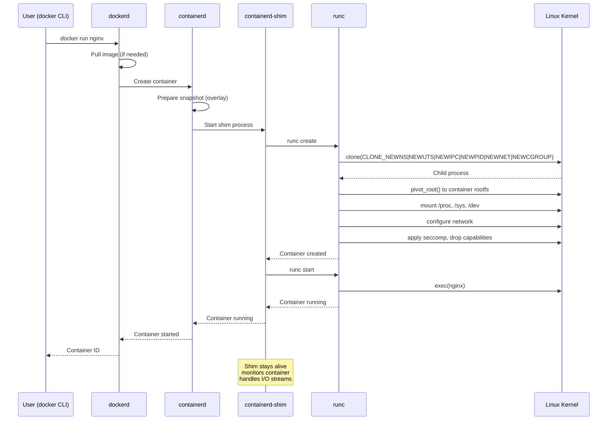
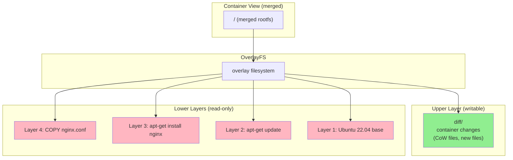
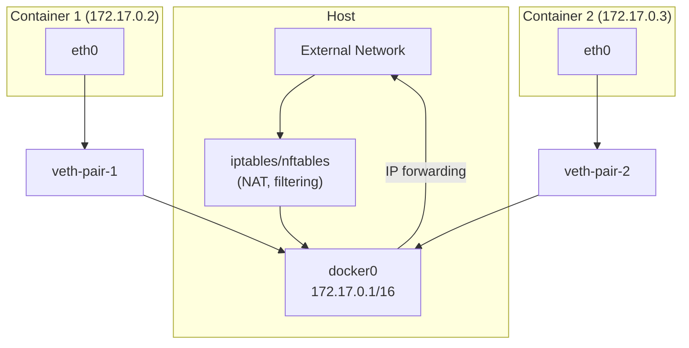
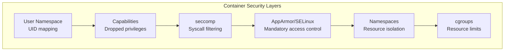
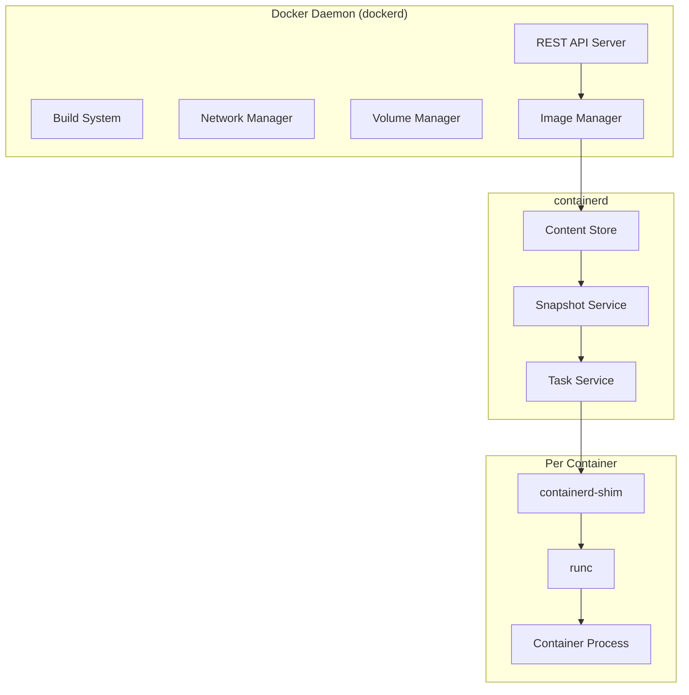

# Chapter 175: Docker Internals — Layers, Union Filesystem, and Container Lifecycle

## 1. Introduction

Docker revolutionized software deployment by packaging applications into portable, self-contained images. But what happens when you type `docker run`? Behind the simple CLI lies a sophisticated architecture involving union filesystems, image layers, network namespaces, cgroups, and a carefully orchestrated container lifecycle.

This chapter peels back the Docker abstraction to examine the internal mechanics: how images are built from layers, how the union filesystem merges those layers into a coherent rootfs, how libnetwork creates isolated network environments, and how the container lifecycle (create → start → run → stop → destroy) is managed.

## 2. Architecture Overview

### 2.1 Docker's Component Stack

```
┌─────────────────────────────────────────────────┐
│                  docker CLI                      │
└─────────────────┬───────────────────────────────┘
                  │ (REST API over unix socket)
┌─────────────────▼───────────────────────────────┐
│                 dockerd (daemon)                  │
│  ┌─────────────────────────────────────────────┐│
│  │         Docker Engine API                    ││
│  └─────────────────────────────────────────────┘│
│  ┌──────────┐ ┌──────────┐ ┌──────────────────┐│
│  │ Builder  │ │ Volumes  │ │     Networks      ││
│  │ (build)  │ │          │ │    (libnetwork)   ││
│  └──────────┘ └──────────┘ └──────────────────┘│
└─────────────────┬───────────────────────────────┘
                  │ (containerd API)
┌─────────────────▼───────────────────────────────┐
│              containerd                          │
│  ┌──────────┐ ┌──────────┐ ┌──────────────────┐│
│  │ Content  │ │ Snapshot │ │    Containers     ││
│  │ Store    │ │ Driver   │ │    / Tasks        ││
│  └──────────┘ └──────────┘ └──────────────────┘│
└─────────────────┬───────────────────────────────┘
                  │ (OCI runtime spec)
┌─────────────────▼───────────────────────────────┐
│                 runc (OCI runtime)               │
│  clone() + namespaces + cgroups + pivot_root    │
└─────────────────┬───────────────────────────────┘
                  │
┌─────────────────▼───────────────────────────────┐
│              Linux Kernel                        │
│  namespaces, cgroups, seccomp, capabilities,     │
│  overlayfs, netfilter, veth                      │
└─────────────────────────────────────────────────┘
```

### 2.2 The Layer Model

A Docker image is a stack of **read-only layers**, each representing a set of filesystem changes. When a container runs, a **writable layer** is added on top:

```
┌─────────────────────────────────────────────┐
│         Container Writable Layer            │  ← Container writes go here
│         (thin, CoW-based)                   │
├─────────────────────────────────────────────┤
│  Layer 4: COPY nginx.conf /etc/nginx/       │  ← Image layer (read-only)
├─────────────────────────────────────────────┤
│  Layer 3: RUN apt-get install nginx         │  ← Image layer (read-only)
├─────────────────────────────────────────────┤
│  Layer 2: RUN apt-get update                │  ← Image layer (read-only)
├─────────────────────────────────────────────┤
│  Layer 1: Ubuntu 22.04 base                 │  ← Image layer (read-only)
└─────────────────────────────────────────────┘
```

Each layer is a **tar archive** containing files that were added, modified, or deleted relative to the layer below. When the union filesystem merges all layers, the result appears as a single coherent filesystem.

## 3. Union Filesystem and OverlayFS

### 3.1 What is a Union Filesystem?

A union filesystem (unionfs) overlays multiple directory trees (called "branches") so they appear as one. The key operations are:

- **Whiteout files**: Mark a file as "deleted" without modifying the lower layer
- **Opaque directories**: Mark a directory as replaced (all contents hidden)
- **Copy-on-Write (CoW)**: When a file in a read-only layer is modified, it's copied to the writable layer first

### 3.2 OverlayFS (Overlay2 Driver)

Docker's default and recommended storage driver is `overlay2`, which uses Linux's OverlayFS:

```
┌─────────────────────────────────────────┐
│              Merged View                 │  ← What the container sees
│  /etc/nginx/nginx.conf (from layer 4)   │
│  /usr/sbin/nginx (from layer 3)         │
│  /etc/apt/sources.list (from layer 2)   │
│  /bin/bash (from layer 1)               │
│  /tmp/new-file (from writable layer)    │
└─────────────────────────────────────────┘
                    ▲
                    │ overlay mount
        ┌───────────┴───────────┐
        │     overlayfs         │
        └───────────┬───────────┘
                    │
    ┌───────────────┼───────────────┐
    │               │               │
┌───▼───┐     ┌────▼────┐    ┌────▼────┐
│ upper │     │ lowerdir│    │ lowerdir│  ...
│(work/ │     │ layer 4 │    │ layer 3 │
│ diff) │     └─────────┘    └─────────┘
└───────┘
```

**OverlayFS mount options:**

```bash
mount -t overlay overlay \
  -o lowerdir=/var/lib/docker/overlay2/l1:/var/lib/docker/overlay2/l2:/var/lib/docker/overlay2/l3,upperdir=/var/lib/docker/overlay2/abc123/diff,workdir=/var/lib/docker/overlay2/abc123/work \
  /var/lib/docker/overlay2/abc123/merged
```

- **lowerdir**: Read-only layers (ordered, first has highest priority)
- **upperdir**: Read-write layer (container's changes go here)
- **workdir**: OverlayFS internal working directory (must be on same filesystem as upperdir)
- **merged**: The combined view

### 3.3 Docker's Overlay2 Directory Structure

```bash
# Docker's storage location
ls /var/lib/docker/overlay2/

# Each image/container has a directory
/var/lib/docker/overlay2/
├── l/                           # Symlinks for shortened mount paths
│   ├── ABC123 -> ../abc123.../diff
│   └── DEF456 -> ../def456.../diff
├── abc123def456.../             # Image layer
│   ├── diff/                    # Actual layer contents
│   │   ├── bin/
│   │   ├── etc/
│   │   └── usr/
│   ├── link                     # Short symlink name
│   ├── lower                     # Parent layer reference
│   └── work/                    # OverlayFS workdir
└── def456abc789.../             # Container layer
    ├── diff/                    # Container's writable changes
    ├── link
    ├── lower                     # References image layers
    ├── merged/                   # The overlay mount point
    │   ├── bin/                  # Merged view of all layers
    │   ├── etc/
    │   └── usr/
    └── work/
```

### 3.4 Whiteout and Opaque Files

When a file is deleted in a layer, OverlayFS uses **whiteout files** (character device with 0/0 major/minor) to hide it:

```bash
# In the upper layer, a whiteout file hides the lower layer file
ls -la /var/lib/docker/overlay2/container/diff/etc/old-config
# c--------- 1 root root 0, 0 Jun 29 12:00 old-config

# Opaque directory (all contents hidden)
getfattr -n trusted.overlay.opaque /var/lib/docker/overlay2/container/diff/etc/
# trusted.overlay.opaque="y"
```

In the OCI image format, whiteouts are encoded as:
- `WHIOUT.<filename>` — Hide a single file
- `.wh..wh..opq` — Mark directory as opaque

### 3.5 Copy-on-Write Behavior

When a container modifies a file from a lower layer:

1. OverlayFS checks if the file exists in the upper layer
2. If not, it copies the file from the lower layer to the upper layer (CoW)
3. The modification is applied to the upper layer copy
4. The lower layer remains unchanged

```bash
# This read triggers no copy
cat /etc/nginx/nginx.conf

# This write triggers CoW
echo "new config" > /etc/nginx/nginx.conf
# Now nginx.conf exists in both lower and upper layers
# The upper layer copy is what the container sees
```

**Performance implication:** First write to a large file copies the entire file. This is why database initialization in containers can be slow if the database files come from a lower layer.

### 3.6 Other Storage Drivers

While overlay2 is preferred, Docker supports several drivers:

| Driver | Mechanism | Status |
|--------|-----------|--------|
| overlay2 | OverlayFS | Default, recommended |
| btrfs | Btrfs subvolumes | Supported on btrfs |
| zfs | ZFS datasets | Supported on ZFS |
| devicemapper | Device-mapper thin provisioning | Deprecated |
| vfs | Full copy (no CoW) | Testing only |
| aufs | Another Union FS | Deprecated, removed in newer Docker |

## 4. Image Format and Layer Deduplication

### 4.1 OCI Image Specification

Docker images follow the OCI (Open Container Initiative) image format:

```
image/
├── manifest.json          # Image manifest
├── config.json            # Image configuration
└── blobs/
    └── sha256/
        ├── abc123...      # Layer 1 (compressed tar)
        ├── def456...      # Layer 2 (compressed tar)
        └── ghi789...      # Image config (JSON)
```

**Manifest structure:**

```json
{
  "schemaVersion": 2,
  "mediaType": "application/vnd.oci.image.manifest.v1+json",
  "config": {
    "mediaType": "application/vnd.oci.image.config.v1+json",
    "digest": "sha256:abc123...",
    "size": 1234
  },
  "layers": [
    {
      "mediaType": "application/vnd.oci.image.layer.v1.tar+gzip",
      "digest": "sha256:layer1...",
      "size": 25000000
    },
    {
      "mediaType": "application/vnd.oci.image.layer.v1.tar+gzip",
      "digest": "sha256:layer2...",
      "size": 5000000
    }
  ]
}
```

### 4.2 Layer Deduplication

Layers are content-addressed (identified by SHA256 digest). If two images share a base layer, the layer is stored only once:

```
Image A (nginx:latest)          Image B (node:latest)
──────────────────              ──────────────────
├── nginx config layer          ├── node.js layer
├── apt-get install layer       └── Ubuntu 22.04 layer ◄── Shared!
└── Ubuntu 22.04 layer ◄────────┘
```

This is why pulling multiple images that share a base (like Ubuntu) only downloads the base once.

### 4.3 Image Building and Layer Caching

Each Dockerfile instruction creates a new layer:

```dockerfile
FROM ubuntu:22.04              # Layer 0: Ubuntu base
RUN apt-get update             # Layer 1: Package index update
RUN apt-get install -y nginx   # Layer 2: nginx installation
COPY nginx.conf /etc/nginx/    # Layer 3: Configuration file
EXPOSE 80                      # Metadata only (no layer)
CMD ["nginx", "-g", "daemon off;"]  # Metadata only
```

**Build cache:** If a layer hasn't changed (same instruction + same base layer), Docker reuses the cached layer. This is why ordering matters:

```dockerfile
# Bad: Any code change invalidates the npm install cache
COPY . /app
RUN npm install

# Good: Only package.json changes invalidate npm install cache
COPY package.json /app/
RUN npm install
COPY . /app
```

## 5. libnetwork — Docker Networking

### 5.1 Network Drivers

Docker's networking is handled by **libnetwork**, which implements the Container Network Model (CNM):

```
┌─────────────────────────────────────────────┐
│              Container                       │
│  ┌─────────────────────────────────────────┐│
│  │         eth0 (veth pair end)            ││
│  │         IP: 172.17.0.2/16              ││
│  └─────────────────────────────────────────┘│
└────────────────────┬────────────────────────┘
                     │ veth pair
┌────────────────────▼────────────────────────┐
│           Network Sandbox                    │
│         (network namespace)                  │
└────────────────────┬────────────────────────┘
                     │
┌────────────────────▼────────────────────────┐
│           Endpoint                           │
│    (connects sandbox to network)             │
└────────────────────┬────────────────────────┘
                     │
┌────────────────────▼────────────────────────┐
│           Network                            │
│    (bridge / overlay / macvlan / etc.)       │
└─────────────────────────────────────────────┘
```

**Built-in network drivers:**

| Driver | Description | Use Case |
|--------|-------------|----------|
| bridge | Linux bridge + veth pairs | Default, single-host |
| overlay | VXLAN tunnels | Multi-host (Swarm) |
| macvlan | Direct MAC assignment | Legacy apps needing direct L2 |
| host | No isolation | Performance-critical |
| none | No networking | Completely isolated |

### 5.2 The Default Bridge

```bash
# Docker creates a bridge on installation
ip link show docker0
# docker0: <BROADCAST,MULTICAST,UP,LOWER_UP> mtu 1500
#     link/ether 02:42:ac:11:00:01 brd ff:ff:ff:ff:ff:ff
#     inet 172.17.0.1/16

# When a container starts:
# 1. Create veth pair
ip link add veth1234 type veth peer name eth0

# 2. Move one end into container's network namespace
ip link set eth0 netns $CONTAINER_NS

# 3. Attach other end to docker0 bridge
ip link set veth1234 master docker0
ip link set veth1234 up

# 4. Configure container's interface
ip netns exec $CONTAINER_NS ip addr add 172.17.0.2/16 dev eth0
ip netns exec $CONTAINER_NS ip link set eth0 up
ip netns exec $CONTAINER_NS ip route add default via 172.17.0.1
```

### 5.3 Docker DNS

Docker runs an embedded DNS server (127.0.0.11) inside each container. It resolves container names within user-defined networks:

```bash
# User-defined network (has DNS)
docker network create mynet
docker run --name web --network mynet nginx
docker run --network mynet alpine ping web
# Pings "web" by name — resolved by Docker DNS

# Default bridge (no automatic DNS)
docker run --name web nginx
docker run alpine ping web
# Fails — no DNS resolution on default bridge
```

### 5.4 Port Mapping (DNAT)

```bash
docker run -p 8080:80 nginx
```

Docker creates iptables DNAT rules:

```bash
# In the DOCKER chain
iptables -t nat -A DOCKER -p tcp --dport 8080 -j DNAT --to-destination 172.17.0.2:80

# In the FORWARD chain
iptables -A DOCKER -d 172.17.0.2/32 -p tcp --dport 80 -j ACCEPT
```

## 6. Container Lifecycle

### 6.1 Lifecycle States

```
                    create
                      │
                      ▼
                ┌──────────┐
                │  Created  │─────── rm
                └────┬─────┘         │
                     │ start         │
                     ▼               │
                ┌──────────┐         │
                │  Running  │─────── rm (force)
                └────┬─────┘         │
                     │ stop          │
                     ▼               │
                ┌──────────┐         │
                │  Stopped  │─────── rm
                └──────────┘
                     │
                     │ start (restart)
                     ▼
                ┌──────────┐
                │  Running  │
                └──────────┘
```

### 6.2 What Happens During `docker create`

1. **Pull image** (if not present) — Downloads layers from registry
2. **Create container rootfs** — OverlayFS mount with image layers as lowerdir
3. **Generate container config** — OCI `config.json` with:
   - Environment variables
   - Entrypoint/CMD
   - Resource limits (cgroup configuration)
   - Namespace configuration
   - Security profile (seccomp, AppArmor)
   - Network configuration
4. **Create container metadata** — Store in containerd's content store
5. **Prepare cgroups** — Create cgroup hierarchy with configured limits

### 6.3 What Happens During `docker start`

1. **Create OCI runtime bundle** — Generate `config.json` and prepare rootfs
2. **Call runc** — `runc create` → `runc start`
3. **runc creates the container:**
   a. `clone()` with namespace flags (NEWNS, NEWUTS, NEWIPC, NEWPID, NEWNET, NEWCGROUP)
   b. In child: `pivot_root()` to container rootfs
   c. Mount `/proc`, `/sys`, `/dev`
   d. Set hostname
   e. Configure network (veth pair, IP, routes)
   f. Drop capabilities, apply seccomp profile
   g. `exec()` the entrypoint
4. **Monitor container** — containerd's shim process watches for exit

### 6.4 What Happens During `docker stop`

1. **SIGTERM** — Sent to PID 1 in the container
2. **Grace period** (default 10 seconds) — Container can clean up
3. **SIGKILL** — If container hasn't exited after grace period
4. **Wait for exit** — containerd waits for the process to exit
5. **Clean up** — Unmount overlayfs, remove cgroups, delete network

### 6.5 What Happens During `docker rm`

1. **Verify container is stopped** — Error if running (unless `--force`)
2. **Remove container metadata** — From containerd
3. **Remove rootfs** — Unmount overlayfs, delete upper/work directories
4. **Clean up networking** — Remove veth pair, iptables rules
5. **Remove cgroups** — Delete cgroup directories

### 6.6 Container Restart Policy

```bash
# Restart on failure, max 3 attempts
docker run --restart=on-failure:3 nginx

# Always restart (including on daemon start)
docker run --restart=unless-stopped nginx

# No restart (default)
docker run --restart=no nginx
```

## 7. Docker Storage

### 7.1 Volumes

```bash
# Named volume (managed by Docker)
docker volume create mydata
docker run -v mydata:/app/data nginx

# Host bind mount
docker run -v /host/path:/container/path nginx

# tmpfs mount (memory only)
docker run --tmpfs /app/cache nginx
```

**Volume storage:**

```bash
# Named volumes stored at
ls /var/lib/docker/volumes/mydata/_data/

# Bind mounts are direct references to host paths
```

### 7.2 Storage in the Image Layer Model

```
Container View:
/app/data/important.txt  ← Written by container (upper layer)
/app/config/settings.yml ← From image (lower layer, read-only)
/usr/bin/nginx           ← From image (lower layer, read-only)

With volume:
/app/data/               ← Volume mount (not in overlay)
/app/config/settings.yml ← From image
/usr/bin/nginx           ← From image
```

### 6.3 Docker Content Trust (DCT)

Docker Content Trust provides image signing and verification:

```bash
# Enable content trust
export DOCKER_CONTENT_TRUST=1

# Now all push/pull operations verify signatures
docker pull nginx:latest
# Verifies signature before pulling

# Sign an image during push
docker push myregistry/myimage:v1
# Prompts for signing key

# Disable trust for specific operations
docker pull --disable-content-trust nginx:latest
```

### 6.4 Docker BuildKit

BuildKit is Docker's modern build engine with advanced features:

```bash
# Enable BuildKit
export DOCKER_BUILDKIT=1
docker build -t myimage .

# BuildKit features:
# - Parallel build stages
# - Better caching (mount caches, secret mounts)
# - Build secrets (not stored in layers)
# - SSH forwarding
# - Cache import/export

# Use secret mounts (not in final image)
docker build --secret id=mysecret,src=./secret.txt -t myimage .

# In Dockerfile:
# RUN --mount=type=secret,id=mysecret cat /run/secrets/mysecret

# Cache mount for package managers
docker build --mount=type=cache,target=/var/cache/apt -t myimage .
# Keeps apt cache across builds, speeding up package installation
```

### 6.5 Docker Logging Drivers

Docker captures container stdout/stderr through various logging drivers:

```bash
# Default: json-file (writes to /var/lib/docker/containers/<id>/<id>-json.log)
docker run --log-driver=json-file --log-opt max-size=10m --log-opt max-file=3 nginx

# syslog driver (sends to syslog)
docker run --log-driver=syslog --log-opt syslog-address=tcp://logserver:514 nginx

# fluentd driver
docker run --log-driver=fluentd --log-opt fluentd-address=localhost:24224 nginx

# none (disable logging)
docker run --log-driver=none nginx

# View container logs
docker logs my-container
docker logs --tail 100 -f my-container  # Last 100 lines, follow
```

## 8. Mermaid Diagrams

### 8.1 Docker Architecture Flow



### 8.2 Layer Stack with OverlayFS



### 8.3 Docker Network Architecture



### 8.4 Docker Security Architecture



### 8.5 Docker Daemon Architecture



## 9. Common Pitfalls

### 9.1 Layer Ordering and Cache Invalidation

```dockerfile
# Bad: Changing any file invalidates npm install cache
COPY . /app
WORKDIR /app
RUN npm install

# Good: Copy package files first, install, then copy rest
COPY package.json package-lock.json /app/
WORKDIR /app
RUN npm install
COPY . /app
```

### 9.2 Container Write Performance

Writing to files from lower layers triggers CoW, which is slow for large files:

```bash
# This is slow if /data/big-file exists in the image layer
docker run myimage sh -c "echo 'append' >> /data/big-file"

# Better: Use a volume for mutable data
docker run -v data-vol:/data myimage
```

### 9.3 Default Bridge DNS

```bash
# Default bridge has no automatic DNS
docker run --name app nginx
docker run alpine ping app  # Fails!

# Solution: Use user-defined networks
docker network create mynet
docker run --name app --network mynet nginx
docker run --network mynet alpine ping app  # Works!
```

### 9.4 Zombie Processes

```bash
# Without init, zombie processes accumulate
docker run myimage sh -c "./fork-bomb-child &"

# Solution: Use --init or tini
docker run --init myimage
```

### 9.5 Image Size from Layer Bloat

```dockerfile
# Bad: Install and remove in separate layers (deleted files stay in earlier layer)
RUN apt-get install -y build-essential
RUN apt-get remove -y build-essential  # Layer still has the files!

# Good: Install and remove in same layer
RUN apt-get install -y build-essential \
    && make && make install \
    && apt-get remove -y build-essential \
    && rm -rf /var/lib/apt/lists/*
```

## 10. Best Practices

1. **Use multi-stage builds** — Separate build dependencies from runtime image.

2. **Order Dockerfile instructions by change frequency** — Least changed at top.

3. **Use `.dockerignore`** — Exclude unnecessary files from build context.

4. **Pin base image versions** — `FROM ubuntu:22.04` not `FROM ubuntu:latest`.

5. **Use user-defined networks** — For DNS and better isolation.

6. **Set memory and CPU limits** — Always use `--memory` and `--cpus`.

7. **Use named volumes for persistent data** — Don't store data in the container layer.

8. **Use `--init` for proper signal handling** — Or use tini as PID 1.

9. **Minimize layer count** — Combine related RUN commands.

10. **Don't run as root** — Use `USER` directive in Dockerfile.

## 11. Exercises

### Exercise 1: Inspect Docker Layers

```bash
# Pull an image and inspect its layers
docker pull nginx:latest
docker inspect nginx:latest | jq '.[0].RootFS.Layers'

# Inspect layer contents
docker history nginx:latest

# Examine the overlay2 directory
CONTAINER_ID=$(docker run -d nginx)
ls -la /var/lib/docker/overlay2/
cat /var/lib/docker/overlay2/$CONTAINER_ID/lower
```

### Exercise 2: Build an Image and Observe Layer Caching

```dockerfile
# Dockerfile.exercise
FROM alpine:3.18
RUN echo "Layer 1" > /layer1.txt
RUN echo "Layer 2" > /layer2.txt
COPY some-file.txt /layer3.txt
```

```bash
# Build once (all layers created)
docker build -t exercise .

# Modify only some-file.txt
echo "changed" > some-file.txt
docker build -t exercise .
# Observe: Layers 1 and 2 are cached, Layer 3 is rebuilt
```

### Exercise 3: Network Namespace Exploration

```bash
# Start a container
docker run -d --name nettest nginx

# Find its PID
PID=$(docker inspect -f '{{.State.Pid}}' nettest)

# Explore its network namespace
nsenter -t $PID --net ip addr
nsenter -t $PID --net ip route
nsenter -t $PID --net cat /etc/resolv.conf

# Examine the veth pair on the host
ip link show | grep veth
brctl show docker0
```

## 12. References

1. Docker architecture documentation: https://docs.docker.com/get-started/overview/
2. OCI Image Specification: https://github.com/opencontainers/image-spec
3. OCI Runtime Specification: https://github.com/opencontainers/runtime-spec
4. OverlayFS kernel documentation: `Documentation/filesystems/overlayfs.rst`
5. Docker storage drivers documentation
6. Docker networking documentation
7. libnetwork source: https://github.com/moby/libnetwork
8. containerd architecture: https://containerd.io/docs/
9. Dockerfile best practices: https://docs.docker.com/develop/develop-images/dockerfile_best-practices/
