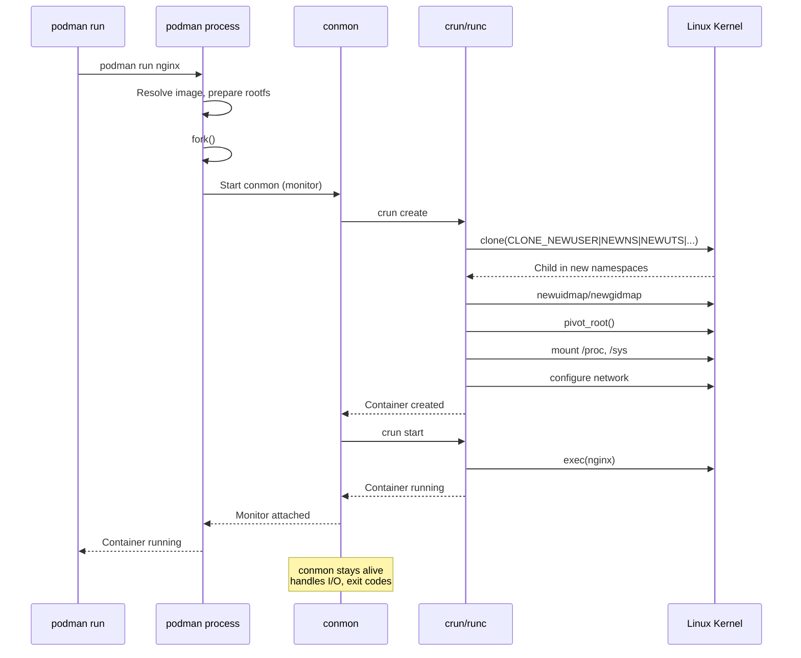
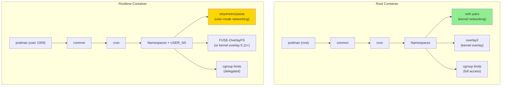
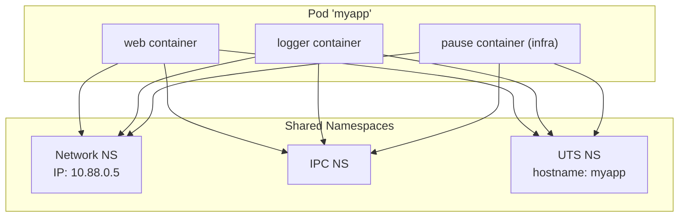
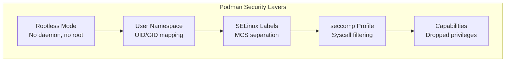
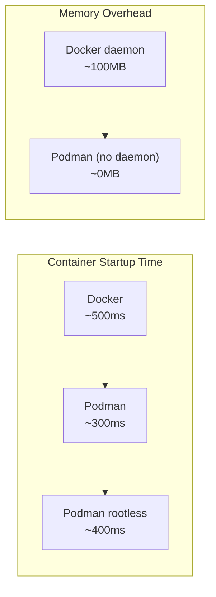

# Chapter 176: Podman — Rootless Containers, Pods, and systemd Integration

## 1. Introduction

Podman (Pod Manager) is a daemonless container engine developed by Red Hat as a drop-in replacement for Docker. Its defining characteristics are **rootless operation**, **daemonless architecture**, and native **pod support** (the same pod abstraction used by Kubernetes). Podman is the default container runtime on RHEL 8+, Fedora, and is available on all major Linux distributions.

Where Docker uses a central daemon (`dockerd`) that runs as root, Podman creates containers directly as a regular user process. This eliminates the single point of failure and security risk of a privileged daemon.

## 2. Architecture

### 2.1 Daemonless Design

```
┌─────────────────────────────────────────────────────┐
│  Docker Architecture                                │
│                                                     │
│  docker CLI → dockerd (daemon, root) → containerd   │
│            → runc → container                       │
│                                                     │
│  Single daemon manages ALL containers               │
└─────────────────────────────────────────────────────┘

┌─────────────────────────────────────────────────────┐
│  Podman Architecture                                │
│                                                     │
│  podman → fork() + clone() → conmon → container     │
│                                                     │
│  Each container is an independent process tree       │
│  No central daemon, no single point of failure      │
└─────────────────────────────────────────────────────┘
```

**How Podman creates a container (simplified):**

1. User runs `podman run`
2. Podman process resolves the image, prepares the rootfs
3. Podman `fork()`s a child process
4. The child calls `clone()` with namespace flags
5. **conmon** (container monitor) is spawned to supervise the container
6. conmon launches the OCI runtime (runc/crun) which `exec()`s the container process
7. Podman parent process exits (or waits in foreground mode)

### 2.2 conmon — The Container Monitor

**conmon** (container monitor) is a lightweight C program that:

- Serves as the container's parent process (PID 1 from the host's perspective)
- Handles container I/O (stdout, stderr, stdin)
- Attaches to the container's terminal
- Writes exit codes for container cleanup
- Manages container logging

```
podman run nginx

Host PID tree:
├── systemd (PID 1)
├── conmon (PID 5000)  ← Monitors the container
│   └── nginx (PID 5001)  ← Container PID 1
│       └── nginx worker (PID 5002)
```

### 2.3 OCI Runtime: runc vs crun

Podman supports multiple OCI runtimes:

| Runtime | Language | Characteristics |
|---------|----------|-----------------|
| runc | Go | Docker's default, widely used |
| crun | C | Faster startup, lower memory, Red Hat default |
| kata-runtime | Go | VM-based isolation |
| gVisor (runsc) | Go | Application kernel |

```bash
# Check which runtime Podman is using
podman info | grep runtime
# OCIRuntime:
#   name: crun
#   path: /usr/bin/crun

# Use a specific runtime
podman run --runtime=runc nginx
```

**crun advantages:** 2-3x faster container startup, 50% less memory usage than runc. Being written in C, it has no Go runtime overhead.

## 3. Rootless Containers

### 3.1 The Core Concept

Rootless containers allow unprivileged users to create and manage containers without any root privileges. The key mechanisms are:

1. **User namespaces** — Map container root to host user
2. **newuidmap/newgidmap** — Set up UID/GID mappings
3. **/etc/subuid, /etc/subgid** — Allocate subordinate UID/GID ranges
4. **Slirp4netns / Pasta** — User-mode networking
5. **FUSE-OverlayFS** — User-mode overlay filesystem (if kernel overlay unavailable)

### 3.2 UID/GID Mapping Setup

```bash
# /etc/subuid — subordinate UIDs for each user
cat /etc/subuid
# john:100000:65536
# Means: user "john" can map UIDs 100000-165535

# /etc/subgid — subordinate GIDs
cat /etc/subgid
# john:100000:65536

# These ranges are used by newuidmap/newgidmap
# Container UID 0 → Host UID 100000
# Container UID 1 → Host UID 100001
# ...
# Container UID 65535 → Host UID 165535
```

### 3.3 How Rootless Podman Works

```
┌─────────────────────────────────────────────────────────┐
│  User "john" (UID 1000)                                 │
│                                                         │
│  podman run nginx                                       │
│      │                                                  │
│      ├── newuidmap: maps container UIDs to subordinate  │
│      │   Container UID 0 → Host UID 100000              │
│      │                                                  │
│      ├── newgidmap: maps container GIDs                 │
│      │                                                  │
│      ├── User namespace: CLONE_NEWUSER                  │
│      │   Container root (UID 0) = Host UID 1000         │
│      │   (with full capabilities inside namespace)      │
│      │                                                  │
│      ├── Other namespaces: mount, pid, net, uts, ipc    │
│      │                                                  │
│      ├── Slirp4netns: user-mode networking              │
│      │   Container gets 10.0.2.100/24                   │
│      │   NAT via slirp4netns process                    │
│      │                                                  │
│      └── FUSE-OverlayFS or native overlay               │
│          (kernel overlay works since Linux 5.11 with    │
│           user namespaces)                              │
└─────────────────────────────────────────────────────────┘
```

### 3.4 Rootless Networking (Slirp4netns and Pasta)

Rootless containers can't create network namespaces with veth pairs (requires root). Instead, they use user-mode networking:

**Slirp4netns:**
- Implements a user-mode TCP/IP stack using libslirp
- The container's network traffic is proxied through a slirp4netns process
- Provides NAT-like connectivity
- Performance is lower than kernel networking (~50% throughput)

**Pasta (available since Podman 4.1+):**
- Pack A Subtle Tap Abstraction
- Better performance than slirp4netns
- Uses tap devices and native network stack
- Recommended for modern rootless Podman

```bash
# Check networking mode
podman info | grep networkBackend
# networkBackend: netavark
# networkBackendInfo:
#   backend: pasta

# Force slirp4netns
podman run --network slirp4netns nginx

# Force pasta
podman run --network pasta nginx
```

### 3.5 Rootless Storage

Rootless Podman uses user-specific storage:

```bash
# Root storage: /var/lib/docker/containers
# Rootless storage: ~/.local/share/containers/

ls ~/.local/share/containers/storage/
# libpod/     — Podman metadata
# overlay/    — Image layers (overlayfs)
# vfs/        — If overlay not available
```

**OverlayFS in rootless mode:**

Since Linux 5.11, overlayfs works in user namespaces:

```bash
# Check if kernel overlay is available
podman info | grep -A5 graphDriver
# graphDriverName: overlay
# If "vfs" is shown, kernel overlay is not available
```

If kernel overlay isn't available, Podman falls back to FUSE-OverlayFS:

```bash
# FUSE-OverlayFS (slower, user-space)
podman --storage-driver overlay run nginx
# Uses fuse-overlayfs binary
```

## 4. The Pod Concept

### 4.1 What is a Pod?

A pod is a group of one or more containers that share:
- **Network namespace** — Same IP, same ports
- **IPC namespace** — Shared memory accessible between containers
- **UTS namespace** — Same hostname

Each container in the pod has its own:
- **PID namespace** — Separate PID 1
- **Mount namespace** — Separate filesystem
- **User namespace** — Separate UID mapping

This is the same abstraction as a Kubernetes pod.

### 4.2 Creating Pods with Podman

```bash
# Create a pod
podman pod create --name myapp -p 8080:80

# Add containers to the pod
podman run --pod myapp --name web -d nginx
podman run --pod myapp --name logger -d fluentd

# The containers share the pod's network namespace
podman exec web curl localhost  # Can reach other containers
podman exec logger curl localhost:80  # Same

# Inspect the pod
podman pod inspect myapp
```

### 4.3 Pod Network Architecture

```
┌─────────────────────────────────────────────────┐
│  Pod "myapp"                                    │
│                                                 │
│  ┌─────────────────┐  ┌─────────────────┐      │
│  │ web (nginx)     │  │ logger (fluentd)│      │
│  │ Mount NS: own   │  │ Mount NS: own   │      │
│  │ PID NS: own     │  │ PID NS: own     │      │
│  └────────┬────────┘  └────────┬────────┘      │
│           │                    │                │
│           └────────┬───────────┘                │
│                    │                            │
│           ┌────────▼────────┐                   │
│           │   Shared:       │                   │
│           │   Network NS    │                   │
│           │   IPC NS        │                   │
│           │   UTS NS        │                   │
│           │   IP: 10.88.0.5 │                   │
│           └─────────────────┘                   │
└─────────────────────────────────────────────────┘
```

### 4.4 Pause Container

Every pod has an infrastructure container (pause container) that holds the shared namespaces:

```bash
# The pause container is visible in the pod
podman pod ps
# POD ID   NAME   STATUS   INFRA ID   # OF CONTAINERS
# abc123   myapp  Running  def456     3

# The infra container runs /pause (a tiny binary that does nothing but hold namespaces)
```

## 5. systemd Integration

### 5.1 `podman generate systemd`

Podman can generate systemd unit files for containers and pods:

```bash
# Generate systemd unit for a container
podman create --name mynginx nginx
podman generate systemd --new --name mynginx --files
# Creates container-mynginx.service

# Generate for a pod
podman pod create --name myapp
podman run --pod myapp --name web nginx
podman generate systemd --new --name myapp --files
# Creates pod-myapp.service, container-web.service
```

**Generated unit example:**

```ini
# container-mynginx.service
[Unit]
Description=Podman container-mynginx.service
Documentation=man:podman-generate-systemd(1)
Wants=network-online.target
After=network-online.target
RequiresMountsFor=/run/user/1000/containers

[Service]
Environment=PODMAN_SYSTEMD_UNIT=%n
Restart=on-failure
TimeoutStopSec=70
ExecStartPre=/bin/rm -f %t/container-mynginx.pid
ExecStart=/usr/bin/podman run \
    --cidfile=%t/container-mynginx.pid \
    --cgroups=no-conmon \
    --rm \
    --sdnotify=conmon \
    -d \
    --replace \
    --name mynginx \
    nginx
ExecStop=/usr/bin/podman stop --ignore --cidfile=%t/container-mynginx.pid
ExecStopPost=/usr/bin/podman rm --ignore -f --cidfile=%t/container-mynginx.pid
Type=notify
NotifyAccess=all

[Install]
WantedBy=default.target
```

### 5.2 Quadlet — Declarative Container Management

Since Podman 4.4+, **Quadlet** provides a more native systemd integration:

```ini
# /etc/containers/systemd/mynginx.container
[Container]
Image=docker.io/library/nginx:latest
PublishPort=8080:80
Volume=mydata.volume:/usr/share/nginx/html:ro
Network=mynet.network
AutoUpdate=registry

[Service]
Restart=always

[Install]
WantedBy=default.target
```

```ini
# /etc/containers/systemd/mynet.network
[Network]
Subnet=10.89.0.0/24
Gateway=10.89.0.1
```

```ini
# /etc/containers/systemd/mydata.volume
[Volume]
Label=app=nginx
```

```bash
# Reload systemd to pick up Quadlet files
systemctl daemon-reload

# Start the container as a service
systemctl start mynginx

# Check status
systemctl status mynginx
```

**Quadlet vs `generate systemd`:**
- Quadlet: Declarative, maintainable, automatic dependency resolution
- `generate systemd`: Imperative, generates static unit files from existing containers

### 5.3 Socket Activation

Podman supports socket activation — systemd creates the socket and passes it to the container:

```ini
# myweb.socket
[Socket]
ListenStream=80

[Install]
WantedBy=sockets.target
```

```ini
# myweb.container
[Container]
Image=nginx
Network=host
```

## 6. Podman vs Docker

### 6.1 Command Compatibility

Podman is designed as a Docker CLI drop-in replacement:

```bash
# Most Docker commands work identically
alias docker=podman

# Commands that differ:
# docker-compose → podman-compose (or podman compose with Docker Compose v2)
# docker swarm → Not supported (use Kubernetes)
# docker buildx → podman build (multi-arch natively supported)
```

### 6.2 Key Differences

| Feature | Docker | Podman |
|---------|--------|--------|
| Architecture | Client-daemon | Daemonless |
| Default runtime | runc | crun |
| Root by default | Yes | Rootless by default |
| Pod support | No (Swarm services) | Native pods |
| systemd integration | External | Native (Quadlet) |
| Docker Compose | Native | podman-compose or compatible |
| Swarm mode | Yes | No |
| Build context | Daemon-side | Local |
| Image format | OCI + Docker | OCI + Docker |

### 6.3 Migration Checklist

```bash
# 1. Install Podman
sudo dnf install podman   # RHEL/Fedora
sudo apt install podman   # Ubuntu/Debian

# 2. Set up rootless
usermod --add-subuids 100000-165535 --add-subgids 100000-165535 $USER

# 3. Create alias (optional)
echo 'alias docker=podman' >> ~/.bashrc

# 4. Test basic commands
podman run --rm alpine echo "Hello from Podman"

# 5. Migrate volumes
podman volume create mydata
podman run -v mydata:/data alpine touch /data/test

# 6. Migrate networks
podman network create mynet
podman run --network mynet alpine ip addr
```

## 7. Security Advantages

### 7.1 No Privileged Daemon

Docker's daemon runs as root and has full system access. A vulnerability in dockerd is a full system compromise. Podman has no daemon — each container is an independent process.

### 7.2 Rootless by Default

```bash
# Docker: must add user to docker group (effectively root equivalent)
sudo usermod -aG docker $USER

# Podman: works without any group membership
podman run --rm alpine whoami  # root inside, regular user outside
```

### 7.3 User Namespace Isolation

```bash
# Podman always uses user namespaces (rootless)
podman run --rm alpine cat /proc/self/uid_map
#          0       1000          1
#          1     100000      65535

# Container root (UID 0) = Host UID 1000
# Container UID 1+ = Host UID 100000+
```

### 7.4 SELinux Integration

Podman (on RHEL/Fedora) automatically applies SELinux labels:

```bash
# Containers get unique SELinux labels
podman run --rm alpine cat /proc/self/attr/current
# system_u:system_r:container_t:s0:c123,c456
```

### 7.5 seccomp and AppArmor

Podman applies security profiles by default:

```bash
# Default seccomp profile blocks dangerous syscalls
podman run --rm alpine cat /proc/self/status | grep Seccomp
# Seccomp: 2 (filter mode)

# Use a custom seccomp profile
podman run --security-opt seccomp=my-profile.json alpine

# Disable seccomp (dangerous)
podman run --security-opt seccomp=unconfined alpine

# Check AppArmor profile
docker run --rm alpine cat /proc/self/attr/apparmor/current
```

### 7.6 Podman Machine (macOS/Windows)

On non-Linux platforms, Podman runs containers inside a Linux VM:

```bash
# Initialize a Podman machine (Linux VM)
podman machine init --cpus 4 --memory 4096 --disk-size 50

# Start the machine
podman machine start

# Check machine status
podman machine list

# SSH into the machine
podman machine ssh

# Stop the machine
podman machine stop

# Remove the machine
podman machine rm
```

The machine uses QEMU (Linux), HyperKit (macOS), or WSL2 (Windows) to run a minimal Linux distribution (Fedora CoreOS) that hosts the container runtime.

### 7.7 Image Building with Podman

Podman builds images using Buildah under the hood:

```bash
# Build an image
podman build -t myimage .

# Build without a Dockerfile (using Buildah directly)
podman build --no-cache -t myimage -f Containerfile .

# Multi-arch build
podman build --platform linux/amd64,linux/arm64 -t myimage .

# Build and push in one step
podman build -t registry.example.com/myimage:v1 --push .

# Use cache from a registry
podman build --cache-from registry.example.com/myimage:buildcache -t myimage .
```

## 8. Mermaid Diagrams

### 8.1 Podman Container Creation Flow



### 8.2 Rootless vs Root Architecture



### 8.3 Pod Network Architecture



### 8.4 Podman Security Model



### 8.5 Podman vs Docker Performance



### 8.6 Podman Kubernetes Integration

Podman can generate Kubernetes YAML from running containers:

```bash
# Generate Kubernetes YAML from a pod
podman pod create --name myapp -p 8080:80
podman run --pod myapp --name web nginx
podman run --pod myapp --name logger fluentd

# Generate YAML
podman generate kube myapp > myapp.yaml
# Creates a valid Kubernetes Pod YAML

# Generate from a single container
podman generate kube my-container > container.yaml

# Play Kubernetes YAML (run containers from YAML)
podman play kube myapp.yaml
# Creates and starts containers based on the YAML

# This enables:
# - Local development with same config as production
n# - Testing Kubernetes manifests locally
# - Migration from Docker Compose to Kubernetes
```

## 9. Common Pitfalls

### 9.1 Rootless Port Binding

```bash
# Rootless can't bind to ports < 1024 by default
podman run -p 80:80 nginx
# Error: rootlessport cannot expose privileged port 80

# Solution 1: Use higher port
podman run -p 8080:80 nginx

# Solution 2: Allow unprivileged port binding
sudo sysctl net.ipv4.ip_unprivileged_port_start=80

# Solution 3: Use net.ipv4.ip_unprivileged_port_start=0
```

### 9.2 Image Pull Authentication

```bash
# Rootless Podman uses ~/.docker/config.json (not /root/)
podman login docker.io
# Credentials stored in ~/.docker/config.json or 
# ~/.config/containers/auth.json
```

### 9.3 Storage Space

```bash
# Rootless storage is under $HOME
du -sh ~/.local/share/containers/storage/

# Clean up unused images
podman system prune -a

# Check storage configuration
podman info | grep -A10 store
```

### 9.4 SELinux Label Conflicts

```bash
# If a volume contains files with wrong SELinux labels
podman run -v /host/path:/container/path nginx
# Permission denied

# Solution: Add :Z flag to relabel
podman run -v /host/path:/container/path:Z nginx
# Or :z for shared labels
```

### 9.5 CNI vs Netavark

```bash
# Older Podman used CNI plugins
# Newer Podman (4.0+) uses Netavark by default

# Check which backend is in use
podman info | grep networkBackend

# Migrate networks if needed
podman system reset  # Warning: destroys all containers and images
```

### 9.6 Rootless cgroup v2 Delegation Issues

```bash
# If rootless containers can't set resource limits
# Check cgroup delegation
cat /sys/fs/cgroup/user.slice/user-1000.slice/cgroup.controllers
# Should show: cpu memory pids

# If not delegated, add to /etc/systemd/system/user@.service.d/delegate.conf
# [Service]
# Delegate=cpu memory pids io

# Reload systemd and re-login
systemctl daemon-reload
# Log out and back in

# Verify delegation
cat /sys/fs/cgroup/user.slice/user-1000.slice/cgroup.controllers
# Now should show: cpu memory pids io
```

## 10. Best Practices

1. **Use rootless mode by default** — Only use root containers when absolutely necessary (e.g., specific kernel features).

2. **Use Quadlet for production** — Declarative container management with systemd is more maintainable than `generate systemd`.

3. **Set up proper subordinate UID/GID ranges** — Ensure `/etc/subuid` and `/etc/subgid` have sufficient range (at least 65536).

4. **Use pasta for rootless networking** — Better performance than slirp4netns.

5. **Use `--security-opt label=level:s0` for shared volumes** — When containers need to access the same volume.

6. **Pin image versions** — Use digest references for reproducibility.

7. **Use `podman pod` for multi-container workloads** — Model after Kubernetes pods.

8. **Enable auto-update for Quadlet containers** — `AutoUpdate=registry` keeps images current.

9. **Monitor rootless storage usage** — Home directory space is often more limited than `/var`.

10. **Use `podman system migrate`** — After changing storage or namespace configuration.

## 11. Exercises

### Exercise 1: Rootless Container Setup

```bash
# Set up a rootless user
sudo useradd -m testuser
sudo passwd testuser

# Configure subordinate IDs
sudo usermod --add-subuids 200000-265535 --add-subgids 200000-265535 testuser

# As testuser:
su - testuser
podman run --rm alpine echo "Rootless works!"
```

### Exercise 2: Create a Pod

```bash
# Create a pod with a web server and logger
podman pod create --name webapp -p 8080:80

podman run --pod webapp --name nginx -d \
  -v ./html:/usr/share/nginx/html:ro \
  nginx

podman run --pod webapp --name logger -d \
  alpine sh -c 'while true; do wget -q -O- http://localhost:80; sleep 5; done'

# Verify they share the network namespace
podman exec nginx wget -q -O- http://localhost:80

# Clean up
podman pod stop webapp
podman pod rm webapp
```

### Exercise 3: Generate and Test systemd Units

```bash
# Create a container
podman create --name myapp -p 8080:80 nginx

# Generate systemd unit
podman generate systemd --new --name myapp --files

# Move to systemd user directory
mkdir -p ~/.config/systemd/user/
mv container-myapp.service ~/.config/systemd/user/

# Enable and start
systemctl --user daemon-reload
systemctl --user enable --now container-myapp.service
systemctl --user status container-myapp.service
```

## 12. References

1. Podman documentation: https://podman.io/docs/
2. Podman rootless tutorial: https://github.com/containers/podman/blob/main/docs/tutorials/rootless_tutorial.md
3. Quadlet documentation: https://docs.podman.io/en/latest/markdown/podman-systemd.unit.5.html
4. conmon source: https://github.com/containers/conmon
5. crun source: https://github.com/containers/crun
6. slirp4netns: https://github.com/rootless-containers/slirp4netns
7. pasta: https://passt.top/passt/about/
8. OCI Runtime Specification: https://github.com/opencontainers/runtime-spec
9. Red Hat Enterprise Linux container documentation
