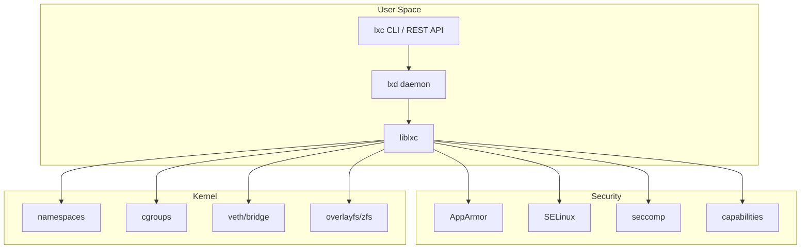
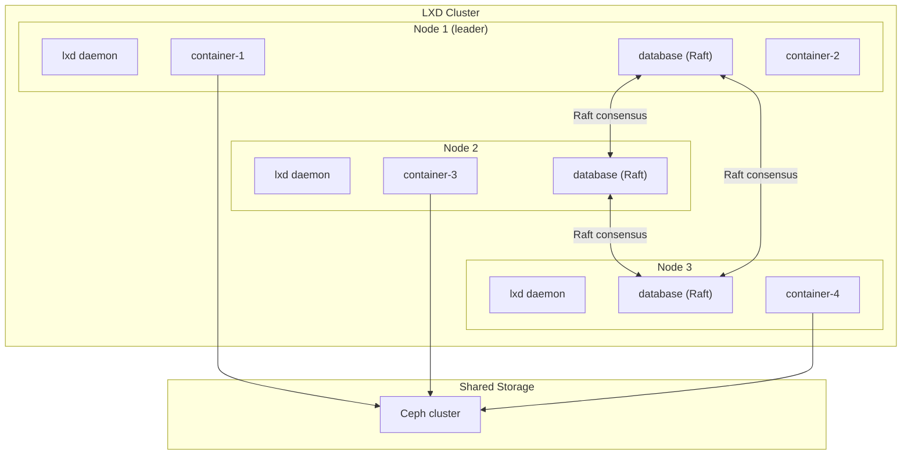

# Chapter 177: LXC and LXD — System Containers, Templates, and Clustering

## 1. Introduction

LXC (Linux Containers) and LXD (the container manager built on top of LXC) represent a different philosophy from Docker. While Docker packages single applications in minimal containers, LXC/LXD creates **system containers** — full Linux environments that behave like lightweight virtual machines. Each system container runs a complete init system (systemd), has multiple processes, and provides an experience nearly identical to a VM but with container-level overhead.

LXC was the original container technology on Linux (predating Docker by years), providing the low-level primitives (namespaces, cgroups, capabilities) that Docker later built upon. LXD, developed by Canonical, adds a management layer with clustering, image management, networking, and storage.

## 2. Architecture

### 2.1 LXC — The Low-Level Library

LXC provides the fundamental container primitives:

```
┌─────────────────────────────────────────────┐
│              Application                     │
├─────────────────────────────────────────────┤
│         liblxc (C library)                   │
│  ┌─────────────────────────────────────────┐│
│  │ Container lifecycle management          ││
│  │ Configuration parsing                   ││
│  │ Template/script execution               ││
│  │ Security (AppArmor, SELinux, seccomp)   ││
│  └─────────────────────────────────────────┘│
├─────────────────────────────────────────────┤
│         Linux Kernel                         │
│  Namespaces, cgroups, capabilities,          │
│  seccomp, AppArmor/SELinux                   │
└─────────────────────────────────────────────┘
```

**LXC's key components:**

- **liblxc** — Core C library for container management
- **lxc-create/lxc-start/lxc-stop** — CLI tools
- **lxc-templates** — Scripts to create container rootfs from distribution images
- **lxc-net** — Network configuration helper

### 2.2 LXD — The Container Manager

LXD builds on LXC to provide a complete container management platform:

```
┌─────────────────────────────────────────────────────┐
│                    lxc CLI                          │
│           (or REST API, Python SDK)                 │
└─────────────────┬───────────────────────────────────┘
                  │ (REST API over unix socket / HTTPS)
┌─────────────────▼───────────────────────────────────┐
│                    lxd daemon                        │
│  ┌──────────┐ ┌──────────┐ ┌──────────┐            │
│  │ Images   │ │ Networks │ │ Storage  │            │
│  │          │ │          │ │ Pools    │            │
│  └──────────┘ └──────────┘ └──────────┘            │
│  ┌──────────┐ ┌──────────┐ ┌──────────┐            │
│  │ Clusters │ │ Profiles │ │ Projects │            │
│  └──────────┘ └──────────┘ └──────────┘            │
└─────────────────┬───────────────────────────────────┘
                  │ (liblxc)
┌─────────────────▼───────────────────────────────────┐
│                    LXC                               │
│  liblxc, namespaces, cgroups, security profiles     │
└─────────────────┬───────────────────────────────────┘
                  │
┌─────────────────▼───────────────────────────────────┐
│              Linux Kernel                            │
└─────────────────────────────────────────────────────┘
```

### 2.3 LXD vs Docker: Fundamental Differences

| Aspect | Docker | LXD |
|--------|--------|-----|
| Container type | Application container | System container |
| Init system | Not used (single process) | Full systemd |
| Process model | One main process | Multiple processes (like a VM) |
| Image contents | Minimal (Alpine, distroless) | Full OS (Ubuntu, Debian, etc.) |
| Networking | Per-container, simple | Managed networks, bridges, VLANs |
| Storage | OverlayFS layers | ZFS, Btrfs, LVM, Ceph, dir |
| Use case | Microservices, CI/CD | VM replacement, desktop, infrastructure |
| Clustering | Docker Swarm | Built-in LXD clustering |

## 3. LXC Templates

### 3.1 How LXC Creates Containers

LXC uses **templates** (shell scripts) to download and configure distribution images:

```bash
# Create an Ubuntu container
lxc-create -t ubuntu -n my-container -- -r jammy

# Create a Debian container
lxc-create -t debian -n my-container -- -r bookworm

# Create an Alpine container
lxc-create -t alpine -n my-container
```

### 3.2 Template Script Structure

A template script must implement:

```bash
#!/bin/bash

# Required functions:
configure() {
    # Configure the container after rootfs creation
    # Set up init system, networking, etc.
}

install() {
    # Download and extract the rootfs
    # Install packages, configure repos
}

copy_configuration() {
    # Write LXC config files
}

clean() {
    # Clean up temporary files
}
```

### 3.3 LXC Container Configuration

```bash
# /var/lib/lxc/my-container/config
lxc.uts.name = my-container
lxc.arch = amd64

# Root filesystem
lxc.rootfs.path = dir:/var/lib/lxc/my-container/rootfs

# Network
lxc.net.0.type = veth
lxc.net.0.flags = up
lxc.net.0.link = lxcbr0
lxc.net.0.hwaddr = 00:16:3e:xx:xx:xx

# Capabilities
lxc.cap.drop = sys_module mac_admin mac_override sys_time

# Security
lxc.apparmor.profile = lxc-container-default
lxc.seccomp.profile = /usr/share/lxc/config/common.seccomp

# Console
lxc.tty.max = 4
lxc.pty.max = 1024

# Init
lxc.init.cmd = /sbin/init
lxc.signal.halt = SIGRTMIN+3
lxc.signal.stop = SIGRTMIN+4
```

### 3.4 LXC Container Lifecycle

```bash
# Create (template + configuration)
lxc-create -t ubuntu -n my-container -f /path/to/config

# Start
lxc-start -n my-container

# List running containers
lxc-ls -f

# Attach to container (like SSH, but using namespace)
lxc-attach -n my-container

# Stop (graceful, sends SIGRTMIN+3 to init)
lxc-stop -n my-container

# Force stop
lxc-kill -n my-container

# Destroy
lxc-destroy -n my-container

# Clone
lxc-copy -n my-container -N my-clone

# Snapshot
lxc-snapshot -n my-container
```

## 4. LXD in Depth

### 4.1 LXD Installation and Initialization

```bash
# Install LXD (Ubuntu)
sudo snap install lxd

# Initialize LXD
sudo lxd init
# Prompts for:
# - Storage backend (ZFS, Btrfs, dir, LVM, Ceph)
# - Network bridge configuration
# - Clustering mode

# Or non-interactive
sudo lxd init --auto --storage-backend=zfs --storage-create-loop=20GB
```

### 4.2 Creating and Managing Containers

```bash
# Launch a container (create + start)
lxc launch ubuntu:22.04 my-container

# List containers
lxc list
# +--------------+---------+---------------------+-----------+-----------+
# |     NAME     |  STATE  |        IPV4         |   TYPE    | SNAPSHOTS |
# +--------------+---------+---------------------+-----------+-----------+
# | my-container | RUNNING | 10.166.87.100 (eth0)| CONTAINER | 0         |
# +--------------+---------+---------------------+-----------+-----------+

# Execute commands
lxc exec my-container -- apt update
lxc exec my-container -- bash

# File operations
lxc file push local-file.txt my-container/root/
lxc file pull my-container/etc/hostname .

# Stop/start/restart
lxc stop my-container
lxc start my-container
lxc restart my-container

# Delete
lxc delete my-container
# Force delete running container
lxc delete my-container --force
```

### 4.3 Images

LXD uses images as templates for containers:

```bash
# List available remote images
lxc image list ubuntu:jammy
lxc image list images:debian/bookworm

# Copy a remote image locally
lxc image copy ubuntu:22.04 local: --alias ubuntu-22.04

# Create a container from a local image
lxc launch ubuntu-22.04 my-container

# List local images
lxc image list

# Publish a container as an image
lxc publish my-container --alias my-image

# Export/import images
lxc image export my-image ./my-image.tar.gz
lxc image import ./my-image.tar.gz --alias imported-image

# Image caching and auto-update
lxc config set images.auto_update_interval 6  # hours
```

### 4.4 Profiles

Profiles define container defaults:

```bash
# List profiles
lxc profile list

# Show default profile
lxc profile show default
# config: {}
# description: Default LXD profile
# devices:
#   eth0:
#     name: eth0
#     network: lxdbr0
#     type: nic
#   root:
#     path: /
#     pool: default
#     type: disk

# Create a custom profile
lxc profile create webserver
cat <<'EOF' | lxc profile edit webserver
config:
  limits.cpu: "2"
  limits.memory: 1GB
  security.nesting: "true"
description: Web server profile
devices:
  eth0:
    name: eth0
    network: lxdbr0
    type: nic
  root:
    path: /
    pool: default
    size: 20GB
    type: disk
  http-proxy:
    connect: tcp:0.0.0.0:80
    listen: tcp:0.0.0.0:80
    type: proxy
EOF

# Apply profile to container
lxc profile add my-container webserver
```

### 4.5 Networking

```bash
# List networks
lxc network list

# Show network details
lxc network show lxdbr0

# Create a managed bridge
lxc network create mybridge \
  ipv4.address=10.0.0.1/24 \
  ipv4.nat=true \
  ipv6.address=none

# Create a container on the custom network
lxc launch ubuntu:22.04 --network mybridge my-container

# Add a network device to an existing container
lxc config device add my-container eth0 nic network=mybridge

# Port forwarding
lxc network forward create mybridge 192.168.1.100
lxc network forward port add mybridge 192.168.1.100 tcp 80 10.0.0.5 80

# VLAN configuration
lxc network create myvlan \
  parent=eth0 \
  vlan=100 \
  ipv4.address=10.100.0.1/24
```

### 4.6 Storage

```bash
# List storage pools
lxc storage list

# Create a ZFS pool
lxc storage create mypool zfs source=/dev/sdb

# Create a Btrfs pool
lxc storage create mypool btrfs source=/data/btrfs

# Create a directory pool
lxc storage create mypool dir source=/data/lxd

# Create a volume
lxc storage volume create mypool myvolume

# Attach a volume to a container
lxc config device add my-container mydisk disk pool=mypool source=myvolume path=/data

# Storage volume snapshots
lxc storage volume snapshot mypool myvolume snap1
```

### 4.7 Snapshots and Backup

```bash
# Create a snapshot
lxc snapshot my-container before-upgrade

# Restore a snapshot
lxc restore my-container before-upgrade

# List snapshots
lxc info my-container | grep -A20 "Snapshots:"

# Export a container (backup)
lxc export my-container /backup/my-container.tar.gz

# Import a container
lxc import /backup/my-container.tar.gz

# Publish snapshot as image
lxc publish my-container/before-upgrade --alias my-backup-image
```

## 5. LXD Clustering

### 5.1 What is LXD Clustering?

LXD clustering allows multiple LXD servers to work together as a single cluster. Containers are distributed across cluster members, and management is centralized.

```
┌──────────────────────────────────────────────────────┐
│                  LXD Cluster                         │
│                                                      │
│  ┌──────────┐  ┌──────────┐  ┌──────────┐          │
│  │ Node 1   │  │ Node 2   │  │ Node 3   │          │
│  │ (leader) │  │ (member) │  │ (member) │          │
│  │          │  │          │  │          │          │
│  │ c1, c2   │  │ c3, c4   │  │ c5, c6   │          │
│  └────┬─────┘  └────┬─────┘  └────┬─────┘          │
│       │              │              │                │
│       └──────────────┼──────────────┘                │
│                      │                               │
│              ┌───────▼───────┐                       │
│              │ Shared Storage │                       │
│              │ (Ceph, NFS)   │                       │
│              └───────────────┘                       │
└──────────────────────────────────────────────────────┘
```

### 5.2 Setting Up a Cluster

```bash
# On the first node (bootstrap)
lxd init
# Select clustering mode
# This node becomes the initial leader

# On subsequent nodes
lxd init
# Select "Join an existing cluster"
# Provide the cluster join token from the leader

# Generate join token on leader
lxc cluster add node2
# Returns a token like: eyJzZXJ2ZXJfbmFtZSI6Im5vZGUyIiwiZmluZ2VycHJpbnQiOi...

# Check cluster status
lxc cluster list
# +-------+----------------------------+----------+--------+-------------------+
# | NAME  |            URL             | DATABASE | STATE  |    MESSAGE         |
# +-------+----------------------------+----------+--------+-------------------+
# | node1 | https://10.0.0.1:8443      | YES      | ONLINE | fully operational |
# | node2 | https://10.0.0.2:8443      | YES      | ONLINE | fully operational |
# | node3 | https://10.0.0.3:8443      | YES      | ONLINE | fully operational |
# +-------+----------------------------+----------+--------+-------------------+
```

### 5.3 Cluster-Aware Operations

```bash
# Launch container on specific node
lxc launch ubuntu:22.04 my-container --target node2

# Move container between nodes
lxc move my-container --target node3

# Check container placement
lxc list
# +--------------+---------+------+-----------+
# |     NAME     |  STATE  | IPV4 | LOCATION  |
# +--------------+---------+------+-----------+
# | my-container | RUNNING | ...  | node3     |
# +--------------+---------+------+-----------+
```

### 5.4 Distributed Storage with Ceph

```bash
# Create a Ceph storage pool (requires Ceph cluster)
lxc storage create ceph-pool ceph \
  ceph.cluster_name=ceph \
  ceph.osd.pool_name=lxd \
  ceph.user.name=lxd

# Containers using Ceph can be live-migrated between nodes
lxc launch ubuntu:22.04 --storage ceph-pool my-container
lxc move my-container --target node2  # Live migration
```

### 5.5 LXD Security Features

LXD provides multiple layers of security:

```bash
# Unprivileged containers by default
# Container root (UID 0) maps to an unprivileged host UID

# AppArmor confinement
lxc config set my-container security.nesting false  # Prevent container-in-container
lxc config set my-container security.privileged false  # Force unprivileged

# Seccomp filtering
lxc config set my-container security.syscalls.intercept.mknod false
lxc config set my-container security.syscalls.intercept.setxattr false

# Read-only rootfs
lxc config set my-container security.protection.delete true  # Prevent deletion
lxc config set my-container security.protection.shift true   # Prevent UID shifting

# Linux capabilities
lxc config set my-container security.syscalls.intercept.mknod true
lxc config set my-container security.syscalls.intercept.sys_setuid true

# GPU passthrough (for ML/AI workloads)
lxc config device add my-container gpu gpu id=0
# Makes /dev/nvidia0 available inside the container
```

### 5.6 LXD Performance Tuning

```bash
# CPU pinning
lxc config set my-container limits.cpu 0-3  # Pin to CPUs 0-3
lxc config set my-container limits.cpu.allowance 50%  # Limit to 50% of allocated CPUs
lxc config set my-container limits.cpu.priority 5  # Scheduling priority (0-10)

# Memory management
lxc config set my-container limits.memory 4GB
lxc config set my-container limits.memory.swap false  # Disable swap
lxc config set my-container limits.memory.enforce hard  # hard=OOM kill, soft=allow

# I/O limits
lxc config set my-container limits.disk.priority 5  # I/O priority (0-10)

# Network limits
lxc config set my-container limits.network.priority 5  # Network priority
lxc config set my-container limits.hugepages.64KB 256MB  # Huge page allocation

# Process limits
lxc config set my-container limits.processes 500  # Max processes

# Check resource usage
lxc info my-container
# Shows CPU, memory, disk, network usage
```

### 5.7 LXD Image Server

LXD can serve as an image server:

```bash
# Publish a container as a public image
lxc publish my-container --alias my-image --public

# Create an image server
lxc config set core.https_address :8443

# Clients can add this server as a remote
lxc remote add my-server https://lxd.example.com:8443
lxc launch my-server:my-image new-container

# SimpleStreams image server
# LXD can serve images via SimpleStreams protocol
lxc config set images.remote_cache_expiry 30  # Cache expiry in days
```

## 6. LXD vs Incus

Incus is a fork of LXD created by the Linux Containers community after Canonical changed LXD's license:

```
LXD (original, Canonical)
├── Apache 2.0 license (original)
└── Changed to CLA + AGPL (2023)

Incus (fork, Linux Containers community)
├── Apache 2.0 license
└── Community-governed
```

```bash
# Incus CLI is identical to LXD
incus launch images:ubuntu/22.04 my-container
incus list
incus exec my-container -- bash
```

### 6.1 LXD vs Docker Comparison

| Feature | LXD | Docker |
|---------|-----|--------|
| Container type | System containers | Application containers |
| Init system | Full systemd | Single process |
| Image format | LXD images (rootfs tarballs) | OCI images (layered) |
| Networking | Managed bridges, VLANs, OVN | Simple bridge, overlay |
| Storage | ZFS, Btrfs, LVM, Ceph, dir | OverlayFS layers |
| Clustering | Built-in (Raft consensus) | Docker Swarm |
| API | REST API (HTTPS) | REST API (Unix socket) |
| CLI | `lxc` command | `docker` command |
| Use case | VM replacement, desktop | Microservices, CI/CD |
| Resource limits | cgroups, direct | cgroups via containerd |
| Security | AppArmor, SELinux, seccomp | seccomp, AppArmor, capabilities |

### 6.2 LXD Monitoring and Logging

```bash
# Monitor container events
lxc monitor
# Shows real-time events: container start/stop, operations, etc.

# Monitor specific container
lxc monitor --type=lifecycle

# View container logs
lxc info my-container
# Shows: CPU, memory, disk, network usage, snapshots

# Container console output
lxc console my-container --show-log
# Shows boot messages and console output

# LXD server logs
journalctl -u snap.lxd.daemon -f

# Operation tracking
lxc operation list
# Shows running operations (create, migrate, etc.)

# Get detailed operation info
lxc operation show <operation-id>
```

## 7. Mermaid Diagrams

### 7.1 LXC/LXD Architecture Stack



### 7.2 LXD Cluster Architecture



## 8. Common Pitfalls

### 8.1 LXD vs LXC Confusion

```bash
# LXC commands (low-level)
lxc-create -t ubuntu -n my-container
lxc-start -n my-container
lxc-attach -n my-container

# LXD commands (high-level)
lxc launch ubuntu:22.04 my-container
lxc exec my-container -- bash

# Both use the "lxc" command prefix but are completely different!
# LXD's CLI is "lxc" but it talks to the lxd daemon
# LXC's CLI tools are "lxc-create", "lxc-start", etc.
```

### 8.2 Privileged vs Unprivileged Containers

```bash
# LXD containers are unprivileged by default (secure)
lxc config set my-container security.privileged true  # DANGEROUS

# Unprivileged: container root = host unprivileged UID
# Privileged: container root = host root (full access)
```

### 8.3 Storage Backend Selection

```bash
# ZFS: Best features (snapshots, compression, dedup)
# Btrfs: Good features, simpler setup
# LVM: Good performance, familiar to sysadmins
# dir: Simple but no CoW, slow snapshots
# Ceph: Required for clustering with live migration

# Check current storage backend
lxc storage show default
```

### 8.4 AppArmor Profile Issues

```bash
# If container operations fail with permission denied
# Check AppArmor
dmesg | grep apparmor

# Use a more permissive profile (security risk)
lxc config set my-container raw.lxc "lxc.apparmor.profile=unconfined"
```

### 8.5 Container Migration Issues

```bash
# Live migration requires shared storage (Ceph, NFS)
lxc move my-container --target node2  # Fails without shared storage

# Solution: Use Ceph storage pool
lxc storage create ceph-pool ceph ceph.cluster_name=ceph
lxc launch ubuntu:22.04 --storage ceph-pool my-container
lxc move my-container --target node2  # Works with Ceph

# Check migration compatibility
lxc info my-container | grep Architecture
# Both nodes must have same architecture (amd64, arm64)
```

### 8.6 Container Resource Leaks

```bash
# Check container resource usage
lxc info my-container | grep -A20 Resources

# Monitor memory usage
lxc exec my-container -- free -h

# Check disk usage
lxc exec my-container -- df -h

# Clean up unused images
lxc image delete <fingerprint>

# Remove old snapshots
lxc snapshot my-container snap1  # Creates snapshot
lxc delete my-container/snap1     # Deletes snapshot
```

## 9. Best Practices

1. **Use LXD for system containers** — When you need a full OS environment, not just a single application.

2. **Use ZFS or Btrfs storage** — For snapshots, copy-on-write, and efficient storage.

3. **Keep containers unprivileged** — Only use `security.privileged=true` when absolutely necessary.

4. **Use profiles for consistency** — Create profiles for common configurations (web server, database, etc.).

5. **Enable clustering for production** — Provides high availability and load distribution.

6. **Regular snapshots** — Before upgrades and configuration changes.

7. **Use LXD projects for multi-tenancy** — Projects provide isolated views of the LXD server.

8. **Monitor resource usage** — Use `lxc info` and cgroup statistics.

9. **Use image caching** — Cache frequently used images locally to speed up container creation.

10. **Consider Incus** — For community-governed, open-source container management.

## 10. Exercises

### Exercise 1: Create a System Container

```bash
# Initialize LXD
sudo lxd init --auto

# Launch an Ubuntu container
lxc launch ubuntu:22.04 my-system

# Install and configure systemd services
lxc exec my-system -- apt update
lxc exec my-system -- apt install -y nginx
lxc exec my-system -- systemctl enable nginx
lxc exec my-system -- systemctl start nginx

# Access the container's web server
lxc exec my-system -- curl localhost
```

### Exercise 2: Create a Custom Profile

```bash
# Create a database profile
lxc profile create database
cat <<'EOF' | lxc profile edit database
config:
  limits.cpu: "4"
  limits.memory: 4GB
  linux.kernel_modules: ip_tables,ip6_tables,nf_nat,overlay
description: Database server profile
devices:
  eth0:
    name: eth0
    network: lxdbr0
    type: nic
  root:
    path: /
    pool: default
    size: 50GB
    type: disk
  data:
    path: /var/lib/mysql
    source: /data/mysql
    type: disk
EOF

# Launch a container with this profile
lxc launch ubuntu:22.04 --profile database my-database
```

### Exercise 3: Snapshot and Rollback

```bash
# Create a container
lxc launch ubuntu:22.04 my-test

# Make some changes
lxc exec my-test -- touch /root/before-snapshot

# Snapshot
lxc snapshot my-test clean-state

# Make more changes
lxc exec my-test -- touch /root/after-snapshot
lxc exec my-test -- rm /root/before-snapshot

# Rollback
lxc restore my-test clean-state

# Verify
lxc exec my-test -- ls /root/
# Should show before-snapshot, not after-snapshot
```

## 11. References

1. LXC documentation: https://linuxcontainers.org/lxc/documentation/
2. LXD documentation: https://documentation.ubuntu.com/lxd/en/latest/
3. Incus documentation: https://linuxcontainers.org/incus/docs/
4. liblxc source: https://github.com/lxc/lxc
5. LXD source: https://github.com/canonical/lxd
6. Incus source: https://github.com/lxc/incus
7. LXC template scripts: https://github.com/lxc/lxc-templates
8. LXD clustering: https://documentation.ubuntu.com/lxd/en/latest/clustering/
9. "Linux Containers" — Red Hat Enterprise Linux documentation
