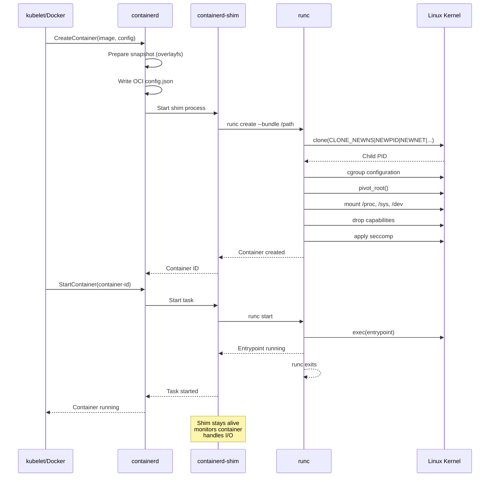
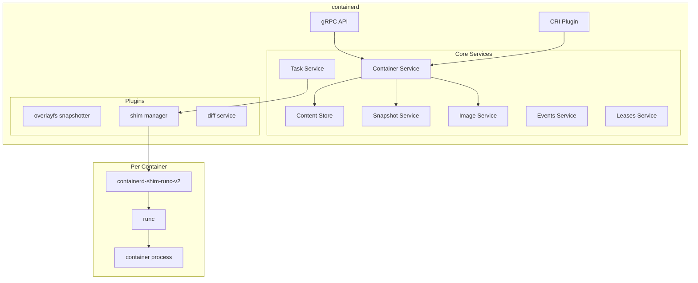
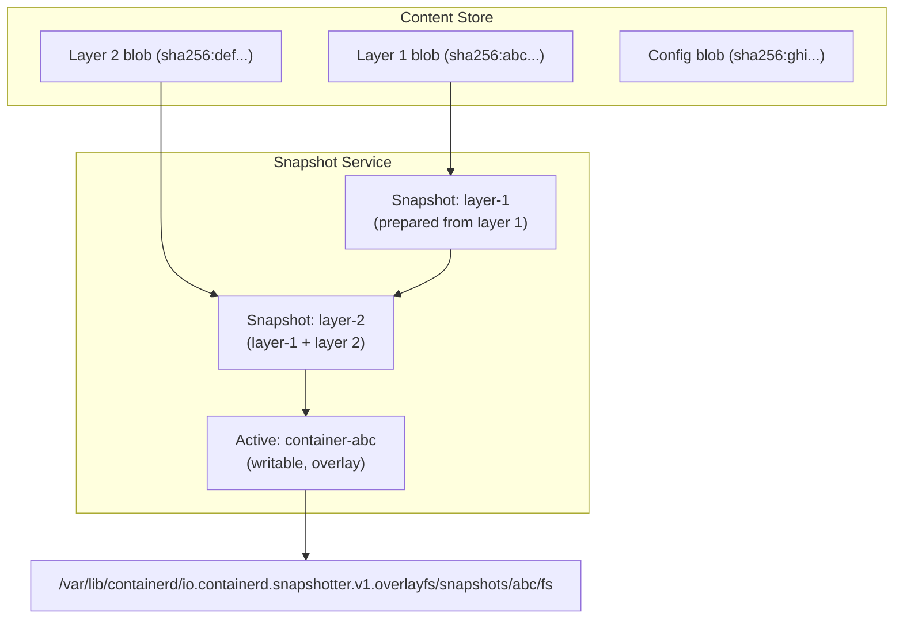

# Chapter 178: containerd and runc — Container Runtime, Shim, and OCI Spec

## 1. Introduction

When you type `docker run`, the actual container creation happens far down the stack — in **containerd** and **runc**. Understanding these components is essential for anyone working with containers in production, as they're the foundation that Docker, Podman, Kubernetes, and virtually every other container platform builds upon.

**containerd** is the industry-standard container runtime that manages the complete container lifecycle: image transfer, storage, container execution, supervision, and networking. **runc** is the OCI-compliant low-level runtime that actually creates containers using kernel primitives. Together, they form the runtime layer that turns an image into a running process.

## 2. Architecture

### 2.1 The Container Runtime Stack

```
┌─────────────────────────────────────────────────────┐
│  High-Level Runtimes                                │
│  (Docker, Podman, CRI-O, containerd CLI)            │
└────────────────────┬────────────────────────────────┘
                     │
┌────────────────────▼────────────────────────────────┐
│              containerd                              │
│  Image management, storage, container lifecycle,     │
│  snapshot management, content store                  │
│                                                     │
│  ┌─────────────────────────────────────────────────┐│
│  │ containerd-shim (one per container)             ││
│  │ - Keeps container alive if containerd restarts  ││
│  │ - Manages container I/O                         ││
│  │ - Reports exit status                           ││
│  └────────────────────┬────────────────────────────┘│
│                       │                             │
└───────────────────────┼─────────────────────────────┘
                        │
┌───────────────────────▼─────────────────────────────┐
│                    runc                              │
│  OCI runtime: creates namespaces, cgroups,           │
│  pivot_root, drops capabilities, exec's entrypoint  │
│                                                     │
│  Exits immediately after container starts           │
└───────────────────────┬─────────────────────────────┘
                        │
┌───────────────────────▼─────────────────────────────┐
│              Linux Kernel                            │
│  namespaces, cgroups, seccomp, capabilities          │
└─────────────────────────────────────────────────────┘
```

### 2.2 Why containerd and runc Are Separate

The split exists because containerd and runc have different responsibilities and lifecycles:

**containerd:**
- Long-running daemon
- Manages multiple containers
- Handles image pull, storage, content addressing
- Provides gRPC API
- Supervises container processes via shims

**runc:**
- Short-lived process (exits after container starts)
- Creates exactly one container
- Implements the OCI runtime specification
- Directly interfaces with the kernel
- Stateless — all configuration is in `config.json`

**The shim** bridges these two worlds — it's a per-container process that stays alive even if containerd restarts, ensuring containers aren't orphaned.

### 2.3 containerd's Internal Architecture

```
┌──────────────────────────────────────────────────────────┐
│                      containerd                           │
│                                                          │
│  ┌────────────────────────────────────────────────────┐  │
│  │                    gRPC API                         │  │
│  │  (CRI plugin for Kubernetes, direct API for Docker)│  │
│  └────────────────────────────────────────────────────┘  │
│                                                          │
│  ┌──────────┐ ┌──────────┐ ┌──────────┐ ┌───────────┐  │
│  │ Content  │ │ Snapshot │ │ Images   │ │ Containers│  │
│  │ Store    │ │ Service  │ │ Service  │ │ Service   │  │
│  └──────────┘ └──────────┘ └──────────┘ └───────────┘  │
│                                                          │
│  ┌──────────┐ ┌──────────┐ ┌──────────┐ ┌───────────┐  │
│  │ Tasks    │ │ Events   │ │ Leases   │ │ Namespaces│  │
│  │ Service  │ │ Service  │ │ Service  │ │ Service   │  │
│  └──────────┘ └──────────┘ └──────────┘ └───────────┘  │
│                                                          │
│  ┌────────────────────────────────────────────────────┐  │
│  │              Plugins                                │  │
│  │  (storage drivers, snapshot drivers, runtime shim) │  │
│  └────────────────────────────────────────────────────┘  │
└──────────────────────────────────────────────────────────┘
```

**Key services:**

| Service | Purpose |
|---------|---------|
| Content Store | Content-addressable storage for blobs (layers, configs) |
| Snapshot Service | Manages container filesystem snapshots |
| Image Service | References manifests and configs to content |
| Container Service | Container metadata (config, runtime, snapshot) |
| Task Service | Running container processes (tasks) |
| Events Service | Pub/sub for container lifecycle events |
| Leases Service | Prevents garbage collection of temporary resources |
| Namespaces Service | Multi-tenancy isolation |

## 3. containerd in Detail

### 3.1 Installation and Configuration

```bash
# Install containerd (standalone)
sudo apt install containerd
# or
sudo dnf install containerd.io

# Generate default configuration
sudo containerd config default > /etc/containerd/config.toml

# Start containerd
sudo systemctl start containerd
sudo systemctl enable containerd
```

**Configuration file:**

```toml
# /etc/containerd/config.toml
version = 2

[plugins]
  [plugins."io.containerd.grpc.v1.cri"]
    # Sandbox image (pause container for Kubernetes)
    sandbox_image = "registry.k8s.io/pause:3.9"
    
    [plugins."io.containerd.grpc.v1.cri".containerd]
      # Default runtime
      default_runtime_name = "runc"
      
      [plugins."io.containerd.grpc.v1.cri".containerd.runtimes]
        [plugins."io.containerd.grpc.v1.cri".containerd.runtimes.runc]
          runtime_type = "io.containerd.runc.v2"
          
          [plugins."io.containerd.grpc.v1.cri".containerd.runtimes.runc.options]
            # Use systemd cgroup driver
            SystemdCgroup = true
            # Binary path
            BinaryName = "/usr/bin/runc"
    
    [plugins."io.containerd.grpc.v1.cri".cni]
      # CNI configuration for Kubernetes
      bin_dir = "/opt/cni/bin"
      conf_dir = "/etc/cni/net.d"
  
  # Snapshot drivers
  [plugins."io.containerd.snapshotter.v1.overlayfs"]
    root_path = ""
    
  # Storage
  [plugins."io.containerd.gc.v1.scheduler"]
    pause_threshold = 0.02
    deletion_threshold = 0
    mutation_threshold = 100
    schedule_delay = "0s"
    startup_delay = "100ms"
```

### 3.2 containerd CLI (`ctr`)

containerd ships with a low-level CLI tool called `ctr`:

```bash
# Pull an image
ctr images pull docker.io/library/nginx:latest

# List images
ctr images ls

# Create a container
ctr containers create docker.io/library/nginx:latest my-nginx

# List containers
ctr containers ls

# Start a task (running instance of a container)
ctr tasks start my-nginx

# List tasks
ctr tasks ls

# Execute a command in a container
ctr tasks exec --exec-id shell1 my-nginx /bin/bash

# Stop a task
ctr tasks kill my-nginx

# Delete container and task
ctr tasks rm my-nginx
ctr containers rm my-nginx
```

### 3.3 Namespaces in containerd

containerd uses namespaces to isolate resources (not to be confused with Linux namespaces):

```bash
# Default namespace
ctr -n default images ls

# Kubernetes namespace
ctr -n k8s.io images ls

# Create a custom namespace
ctr -n myproject images pull docker.io/library/alpine:latest

# List namespaces
ctr namespaces ls
```

### 3.4 Image Management

```bash
# Pull with specific platform
ctr images pull --platform linux/amd64 docker.io/library/nginx:latest

# Pull all platforms
ctr images pull --all-platforms docker.io/library/nginx:latest

# Export an image
ctr images export nginx.tar docker.io/library/nginx:latest

# Import an image
ctr images import nginx.tar

# Content inspection
ctr content ls
ctr content get sha256:abc123...

# Garbage collection
content delete sha256:abc123...
```

### 3.5 containerd Plugins

containerd's plugin system allows extending its functionality:

```toml
# Register a custom runtime
[plugins."io.containerd.grpc.v1.cri".containerd.runtimes.kata]
  runtime_type = "io.containerd.kata.v2"
  
# Register a custom snapshotter
[plugins."io.containerd.grpc.v1.cri".containerd]
  snapshotter = "stargz"  # Use stargz for lazy pulling
```

## 4. runc — The OCI Runtime

### 4.1 What runc Does

runc implements the OCI Runtime Specification. When containerd asks it to create a container:

1. **Read `config.json`** — OCI runtime configuration
2. **Create namespaces** — `clone()` with CLONE_NEW* flags
3. **Set up cgroups** — Create and configure cgroup hierarchy
4. **Mount filesystems** — `pivot_root()` to container rootfs
5. **Drop privileges** — Remove unnecessary capabilities
6. **Apply seccomp** — Install seccomp filter
7. **Exec entrypoint** — `exec()` the container's main process
8. **Exit** — runc exits, leaving the container running under the shim

### 4.2 runc Commands

```bash
# Create a container from an OCI bundle
runc create my-container

# Start the container (exec's the entrypoint)
runc start my-container

# List running containers
runc list

# Get container state
runc state my-container

# Execute a process in a running container
runc exec my-container /bin/bash

# Kill a container
runc kill my-container SIGTERM

# Delete a container
runc delete my-container

# Checkpoint a container (CRIU)
runc checkpoint my-container

# Restore a container from checkpoint
runc restore my-container
```

### 4.3 OCI Bundle Structure

An OCI bundle is a directory containing everything needed to run a container:

```
bundle/
├── config.json    # OCI runtime configuration
└── rootfs/        # Container's root filesystem
    ├── bin/
    ├── etc/
    ├── lib/
    ├── usr/
    └── ...
```

**Creating an OCI bundle:**

```bash
# Create rootfs from an image
mkdir -p my-container/rootfs
# Export image layers and extract to rootfs
docker export $(docker create nginx) | tar -xf - -C my-container/rootfs

# Generate a default config.json
cd my-container
runc spec

# The generated config.json needs modification for actual use
```

## 5. The containerd-shim

### 5.1 Why the Shim Exists

The shim solves the **"who watches the watcher?"** problem:

```
Without shim:
containerd (PID 100) → runc (PID 200) → container (PID 201)
If containerd crashes: container becomes orphaned!

With shim:
containerd (PID 100) → shim (PID 200) → container (PID 201)
If containerd crashes: shim keeps container alive!
When containerd restarts: it reconnects to existing shims.
```

### 5.2 Shim Responsibilities

1. **Keep container alive** — If containerd restarts, the shim maintains the container
2. **Reap container process** — The shim is the parent of the container process
3. **Manage I/O** — Forward stdin/stdout/stderr between containerd and container
4. **Report exit status** — Write exit code to a file that containerd reads
5. **Hold open terminal** — If the container uses a PTY

### 5.3 Shim Versions

```bash
# containerd-shim (v1, deprecated)
# containerd-shim-runc-v1 (for runc v1 containers)
# containerd-shim-runc-v2 (current, supports runc v2 features)

# Check which shim is being used
ps aux | grep shim
# containerd-shim-runc-v2 -namespace default -id abc123 ...
```

### 5.4 Shim API

The shim exposes a TTRPC API that containerd communicates with:

```go
// Shim service API (simplified)
service TaskService {
    rpc Create(CreateTaskRequest) returns (CreateTaskResponse);
    rpc Start(StartRequest) returns (StartResponse);
    rpc Delete(DeleteRequest) returns (DeleteResponse);
    rpc Exec(ExecProcessRequest) returns (ExecProcessResponse);
    rpc Kill(KillRequest) returns (google.protobuf.Empty);
    rpc CloseIO(CloseIORequest) returns (google.protobuf.Empty);
    rpc ResizePty(ResizePtyRequest) returns (google.protobuf.Empty);
    rpc State(StateRequest) returns (StateResponse);
    rpc Stats(StatsRequest) returns (StatsResponse);
}
```

## 6. containerd as CRI (Container Runtime Interface)

### 6.1 CRI Plugin

For Kubernetes, containerd implements the CRI (Container Runtime Interface) plugin:

```bash
# containerd with CRI plugin
# Kubernetes kubelet → CRI → containerd → runc

# Verify CRI is working
crictl info
crictl images
crictl ps
```

### 6.2 crictl — CRI CLI

```bash
# Pull an image
crictl pull nginx:latest

# List images
crictl images

# Create a pod sandbox
crictl runp pod-config.json

# Create a container in a pod
crictl create <pod-id> container-config.json pod-config.json

# Start a container
crictl start <container-id>

# List containers
crictl ps

# List pods
crictl pods

# Execute in a container
crictl exec -i -t <container-id> /bin/bash

# View container logs
crictl logs <container-id>

# Stop and remove
crictl stop <container-id>
crictl rm <container-id>
crictl stopp <pod-id>
crictl rmp <pod-id>
```

### 6.3 Container Metrics and Monitoring

containerd provides container resource metrics:

```bash
# Get container metrics (via crictl)
crictl stats
# CONTAINER           CPU %      MEMORY     DISK      INODES
# abc123              0.50%      125MB      45MB      1234
# def456              1.20%      256MB      89MB      5678

# Get detailed stats for a specific container
crictl stats --id abc123

# Using ctr for direct containerd metrics
ctr -n k8s.io tasks metrics
# ID          TIMESTAMP       CPU      MEMORY
# abc123      1234567890      50000    131072000

# Container resource usage via cgroups
# Find container's cgroup
cat /sys/fs/cgroup/kubepods/.../abc123/memory.current
# 131072000 (125 MB)
```

### 6.4 containerd Content Store

The content store is containerd's blob storage:

```bash
# List all content blobs
ctr content ls
# DIGEST                                                                  SIZE    AGE
# sha256:abc123...                                                        75MB    2d
# sha256:def456...                                                        45MB    2d
# sha256:ghi789...                                                        15MB    2d

# Get specific content
ctr content get sha256:abc123... > layer.tar.gz

# Delete content (if not referenced)
ctr content delete sha256:abc123...

# Force garbage collection
# containerd automatically GCs unreferenced content
# But you can trigger it manually:
ctr content prune
```

### 6.5 containerd Events

containerd publishes events for container lifecycle:

```bash
# Listen for events
ctr events
# INFO[0000] /containers/create    id=abc123 type=container
# INFO[0005] /tasks/create         id=abc123 pid=12345 type=task
# INFO[0006] /tasks/start          id=abc123 pid=12345 type=task
# INFO[0100] /tasks/exit           id=abc123 pid=12345 exit-status=0 type=task
# INFO[0100] /tasks/delete         id=abc123 pid=12345 type=task

# Events can be consumed by monitoring tools
# containerd exposes events via gRPC API
```

### 6.6 runc Rootless Mode

runc supports running containers without root privileges:

```bash
# Create a rootless container
runc run --rootless my-container

# Requirements for rootless runc:
# 1. User namespaces enabled (kernel.unprivileged_userns_clone=1)
# 2. newuidmap/newgidmap configured
# 3. /etc/subuid and /etc/subgid entries
# 4. FUSE-OverlayFS or kernel overlay (5.11+)

# Check rootless support
runc features | jq .linux.namespaces
# Shows supported namespace types

# Rootless runc creates:
# - User namespace (maps container root to host user)
# - Other namespaces (pid, net, mnt, etc.)
# - Uses slirp4netns for networking
# - Uses fuse-overlayfs for filesystem
```

### 6.7 runc Checkpoint/Restore (CRIU)

runc supports checkpointing and restoring containers using CRIU:

```bash
# Checkpoint a running container
runc checkpoint my-container
# Creates checkpoint files in /run/containerd/...

# Restore from checkpoint
runc restore my-container
# Container resumes from checkpoint state

# Requirements:
# - CRIU installed (https://criu.org)
# - Kernel support for process checkpointing
# - Some features may not be checkpointable (network sockets, etc.)

# Use case: Live migration
# 1. Checkpoint on host A
# 2. Transfer checkpoint files to host B
# 3. Restore on host B
```

### 6.8 containerd Plugin System

containerd uses a plugin architecture for extensibility:

```bash
# List available plugins
containerd plugins ls
# TYPE                            ID                  PLATFORMS
# io.containerd.content.v1        content             linux/amd64
# io.containerd.snapshotter.v1    overlayfs           linux/amd64
# io.containerd.differ.v1         walking             linux/amd64
# io.containerd.gc.v1             scheduler           linux/amd64
# io.containerd.runtime.v2        task                linux/amd64
# io.containerd.grpc.v1           containers          linux/amd64
# io.containerd.grpc.v1           content             linux/amd64
# io.containerd.grpc.v1           diff                linux/amd64
# io.containerd.grpc.v1           events              linux/amd64
# io.containerd.grpc.v1           images              linux/amd64
# io.containerd.grpc.v1           leases              linux/amd64
# io.containerd.grpc.v1           namespaces          linux/amd64
# io.containerd.grpc.v1           snapshots           linux/amd64
# io.containerd.grpc.v1           tasks               linux/amd64
# io.containerd.grpc.v1           version             linux/amd64

# Plugin configuration in config.toml
[plugins."io.containerd.snapshotter.v1.overlayfs"]
  root_path = ""
  sync_remove = false
  slow_chown = false
```

### 6.9 containerd Health Checks

```bash
# Check containerd health
containerd-status
# or
systemctl status containerd

# Check containerd version and features
containerd --version
# containerd github.com/containerd/containerd v1.7.x

# Verify CRI is working
crictl info | jq .status.conditions
# Should show: "Ready": true

# Check gRPC connectivity
grpc_health_probe -addr=/run/containerd/containerd.sock
# If healthy: exit 0

# Monitor containerd metrics
# containerd exposes Prometheus metrics
curl -s http://localhost:1338/metrics | grep containerd
# Shows: container_create_total, container_delete_total, etc.
```

## 7. Mermaid Diagrams

### 7.1 Container Creation Sequence



### 7.2 containerd Internal Components



### 7.3 Filesystem Snapshot Flow



## 8. Common Pitfalls

### 8.1 containerd Restart and Containers

```bash
# containerd can be restarted without killing containers
# (thanks to shims)
sudo systemctl restart containerd

# Containers continue running
crictl ps  # Still shows running containers

# But: containerd-shim processes must be running
ps aux | grep containerd-shim
```

### 8.2 Namespace Confusion

```bash
# containerd namespaces ≠ Linux namespaces
# containerd namespaces are logical isolation (like tenants)

# Images pulled in "default" namespace aren't visible in "k8s.io"
ctr -n default images ls
ctr -n k8s.io images ls  # Different set of images
```

### 8.3 Image Garbage Collection

```bash
# Images can be garbage collected if not leased
ctr -n k8s.io images ls  # Check what's present

# Leases prevent GC
ctr -n k8s.io leases add my-lease
# Content referenced by this lease won't be GC'd
```

### 8.4 runc Version Compatibility

```bash
# Different runc versions have different features
runc --version

# containerd-shim-runc-v2 supports:
# - exec process lifecycle
# - cgroup v2
# - systemd cgroup driver
# - rootless containers
```

### 8.5 Debugging Container Startup Failures

```bash
# Check containerd logs
sudo journalctl -u containerd

# Check shim logs
# Shims write to containerd's log or their own stderr

# Use runc directly for debugging
runc --debug run my-container
# Shows detailed error messages for namespace, cgroup, or mount failures
```

### 8.6 containerd Garbage Collection

containerd automatically garbage collects unused resources:

```bash
# Check GC configuration
cat /etc/containerd/config.toml | grep -A10 gc

# Manual GC trigger
ctr content prune

# GC prevents:
# - Unused image layers from filling disk
# - Stale container metadata from accumulating
# - Orphaned snapshots from consuming space

# Monitor storage usage
ctr snapshots ls
ctr content ls | wc -l
# If content count is high, run GC
```

### 8.7 runc vs crun Performance

```bash
# Benchmark container startup time
time runc create my-container && runc start my-container && runc delete my-container
# runc: ~50-100ms

time crun create my-container && crun start my-container && crun delete my-container
# crun: ~20-40ms

# Memory usage comparison
ps aux | grep -E '(runc|crun)'
# runc: ~15-20MB RSS
# crun: ~5-10MB RSS

# crun advantages:
# - 2-3x faster startup
# - 50% less memory
# - No Go runtime overhead
# - Better for high-density deployments
```

### 8.8 Security Hardening for containerd/runc

```bash
# Run containerd as non-root (if possible)
# Typically requires root for container creation

# Enable seccomp for containerd
# containerd applies seccomp profiles from OCI config

# Use read-only rootfs for containers
crictl create --config container-config.json --pod sandbox-config.json
# In container-config.json:
# "rootfs": { "readonly": true }

# Drop all capabilities except needed ones
# In container-config.json:
# "capabilities": { "bounding": ["NET_BIND_SERVICE"], ... }

# Use user namespaces for rootless containers
crictl create --config container-config.json --pod sandbox-config.json
# In sandbox-config.json:
# "linux": { "security_context": { "namespace_options": { "user_id_options": ... } } }
```

## 9. Best Practices

1. **Use containerd directly for Kubernetes** — Don't add Docker as an extra layer.

2. **Enable systemd cgroup driver** — For Kubernetes on systemd-based hosts.

3. **Use containerd namespaces for multi-tenancy** — Isolate different workloads.

4. **Monitor shim processes** — Ensure they're not orphaned or consuming excessive resources.

5. **Keep runc updated** — Security patches are critical for the runtime.

6. **Use content-addressable storage** — Leverage containerd's deduplication.

7. **Configure garbage collection** — Prevent unbounded storage growth.

8. **Use `crictl` for Kubernetes debugging** — It's the standard CRI debugging tool.

9. **Log container I/O** — Configure shim to forward logs to a logging driver.

10. **Test container checkpoint/restore** — Useful for live migration and debugging.

## 10. Exercises

### Exercise 1: Manual OCI Container Creation

```bash
# Create an OCI bundle
mkdir -p /tmp/oci-bundle/rootfs

# Export a minimal image
docker export $(docker create alpine) | tar -xf - -C /tmp/oci-bundle/rootfs

# Generate default spec
cd /tmp/oci-bundle
runc spec

# Modify config.json to run /bin/sh
# Edit process.args: ["sh"]

# Run the container
sudo runc run my-test

# In another terminal, check state
sudo runc state my-test
```

### Exercise 2: containerd Image Management

```bash
# Pull an image
ctr images pull docker.io/library/alpine:3.18

# Inspect the image
ctr images inspect docker.io/library/alpine:3.18

# List content blobs
ctr content ls

# Export and re-import
ctr images export alpine.tar docker.io/library/alpine:3.18
ctr images import alpine.tar

# Check namespaces
ctr namespaces ls
```

### Exercise 3: Shim Investigation

```bash
# Start a container with Docker
docker run -d --name shim-test nginx

# Find the shim process
ps aux | grep containerd-shim

# Check the shim's file descriptors
ls -la /proc/$(pgrep -f "id shim-test")/fd/

# Restart containerd (container should survive)
sudo systemctl restart containerd

# Verify container is still running
docker ps | grep shim-test
```

## 11. References

1. containerd source: https://github.com/containerd/containerd
2. containerd documentation: https://containerd.io/docs/
3. runc source: https://github.com/opencontainers/runc
4. OCI Runtime Specification: https://github.com/opencontainers/runtime-spec
5. OCI Image Specification: https://github.com/opencontainers/image-spec
6. containerd architecture: https://containerd.io/docs/architecture/
7. CRI specification: https://github.com/kubernetes/cri-api
8. containerd-shim design documents
9. "containerd: An Industry-Standard Container Runtime" — KubeCon talks
