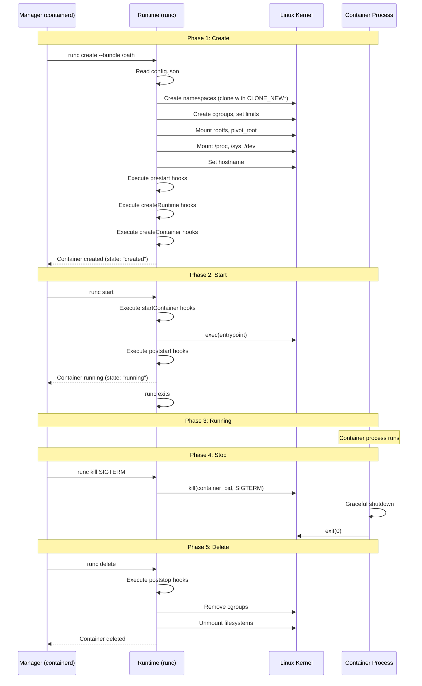
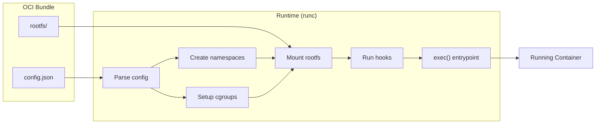
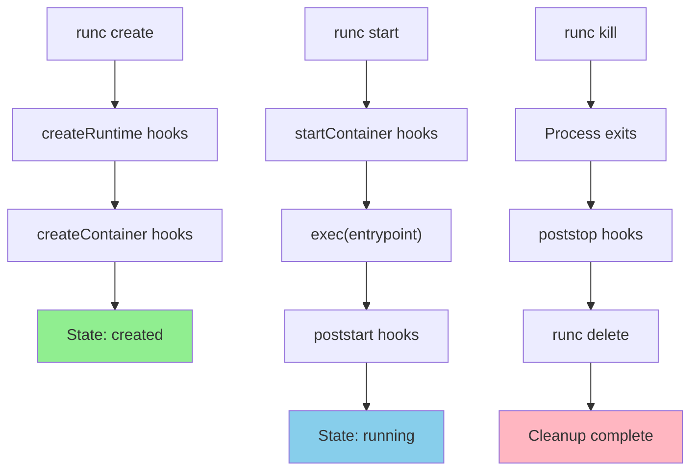

# Chapter 179: OCI Runtime Specification — config.json, rootfs, Hooks, and Lifecycle

## 1. Introduction

The OCI (Open Container Initiative) Runtime Specification defines the standard interface between a container runtime (like runc) and the tools that manage containers (like containerd or Docker). It specifies how a container's configuration is described, how the runtime should create and manage the container, and what lifecycle hooks are available.

Understanding the OCI Runtime Specification is essential for building custom container runtimes, debugging container startup failures, and ensuring portability across different runtime implementations (runc, crun, kata-runtime, gVisor).

## 2. Architecture

### 2.1 The OCI Ecosystem

The OCI defines three specifications:

```
┌─────────────────────────────────────────────────────┐
│              OCI Specifications                      │
│                                                     │
│  ┌─────────────┐ ┌─────────────┐ ┌──────────────┐  │
│  │   Image     │ │  Runtime    │ │ Distribution │  │
│  │ Specification│ │ Specification│ │ Specification│  │
│  │             │ │             │ │              │  │
│  │ Layers,     │ │ config.json │ │ Registry API │  │
│  │ manifests,  │ │ rootfs,     │ │ Push/pull    │  │
│  │ config      │ │ lifecycle   │ │ content      │  │
│  └─────────────┘ └─────────────┘ └──────────────┘  │
└─────────────────────────────────────────────────────┘
```

### 2.2 The OCI Bundle

An OCI bundle is the runtime's input — a directory containing:

```
bundle/
├── config.json    # Container configuration (JSON)
└── rootfs/        # Container filesystem
```

**The runtime receives this bundle and:**
1. Reads `config.json`
2. Creates the container environment (namespaces, cgroups, mounts)
3. Executes the container's process
4. Manages the container lifecycle

## 3. config.json — The Container Configuration

### 3.1 Top-Level Structure

```json
{
    "ociVersion": "1.0.2",
    "process": { ... },
    "root": { ... },
    "hostname": "...",
    "mounts": [ ... ],
    "hooks": { ... },
    "linux": { ... },
    "annotations": { ... }
}
```

### 3.2 The `process` Section

Defines the process to run inside the container:

```json
{
    "process": {
        "terminal": false,
        "user": {
            "uid": 0,
            "gid": 0,
            "additionalGids": [10, 29]
        },
        "args": ["nginx", "-g", "daemon off;"],
        "env": [
            "PATH=/usr/local/sbin:/usr/local/bin:/usr/sbin:/usr/bin:/sbin:/bin",
            "NGINX_VERSION=1.25.3"
        ],
        "cwd": "/",
        "capabilities": {
            "bounding": ["CAP_NET_BIND_SERVICE", "CAP_SETUID", "CAP_SETGID"],
            "effective": ["CAP_NET_BIND_SERVICE", "CAP_SETUID", "CAP_SETGID"],
            "inheritable": ["CAP_NET_BIND_SERVICE", "CAP_SETUID", "CAP_SETGID"],
            "permitted": ["CAP_NET_BIND_SERVICE", "CAP_SETUID", "CAP_SETGID"],
            "ambient": ["CAP_NET_BIND_SERVICE"]
        },
        "rlimits": [
            {
                "type": "RLIMIT_NOFILE",
                "hard": 1024,
                "soft": 1024
            }
        ],
        "noNewPrivileges": true,
        "apparmorProfile": "docker-default",
        "oomScoreAdj": 0,
        "selinuxLabel": "system_u:system_r:container_t:s0:c123,c456"
    }
}
```

**Key fields explained:**

| Field | Purpose |
|-------|---------|
| `terminal` | Whether to allocate a PTY |
| `args` | Command and arguments (exec form) |
| `env` | Environment variables |
| `cwd` | Working directory |
| `capabilities` | Linux capabilities for the process |
| `rlimits` | Resource limits (ulimits) |
| `noNewPrivileges` | Prevent setuid/setgid escalation |
| `apparmorProfile` | AppArmor profile name |
| `oomScoreAdj` | OOM killer score adjustment (-1000 to 1000) |

**Capability sets explained:**

- **bounding** — Maximum capabilities the process can ever have
- **effective** — Currently active capabilities
- **permitted** — Capabilities that can be made effective
- **inheritable** — Capabilities preserved across `execve()`
- **ambient** — Capabilities that are automatically added to the inheritable set

### 3.3 The `root` Section

Specifies the container's root filesystem:

```json
{
    "root": {
        "path": "rootfs",
        "readonly": true
    }
}
```

- `path` — Relative path to the rootfs directory within the bundle
- `readonly` — Whether to mount the rootfs as read-only (security best practice)

### 3.4 The `mounts` Section

Defines additional filesystem mounts:

```json
{
    "mounts": [
        {
            "destination": "/proc",
            "type": "proc",
            "source": "proc"
        },
        {
            "destination": "/dev",
            "type": "tmpfs",
            "source": "tmpfs",
            "options": ["nosuid", "strictatime", "mode=755", "size=65536k"]
        },
        {
            "destination": "/dev/pts",
            "type": "devpts",
            "source": "devpts",
            "options": ["nosuid", "noexec", "newinstance", "ptmxmode=0666", "mode=0620", "gid=5"]
        },
        {
            "destination": "/dev/shm",
            "type": "tmpfs",
            "source": "shm",
            "options": ["nosuid", "noexec", "nodev", "mode=1777", "size=65536k"]
        },
        {
            "destination": "/dev/mqueue",
            "type": "mqueue",
            "source": "mqueue",
            "options": ["nosuid", "noexec", "nodev"]
        },
        {
            "destination": "/sys",
            "type": "sysfs",
            "source": "sysfs",
            "options": ["nosuid", "noexec", "nodev", "ro"]
        },
        {
            "destination": "/sys/fs/cgroup",
            "type": "cgroup",
            "source": "cgroup",
            "options": ["nosuid", "noexec", "nodev", "relatime", "ro"]
        }
    ]
}
```

### 3.5 The `linux` Section

Linux-specific configuration:

```json
{
    "linux": {
        "namespaces": [
            { "type": "pid" },
            { "type": "network" },
            { "type": "ipc" },
            { "type": "uts" },
            { "type": "mount" },
            { "type": "cgroup" },
            { "type": "user" }
        ],
        "uidMappings": [
            {
                "hostID": 1000,
                "containerID": 0,
                "size": 1
            },
            {
                "hostID": 100000,
                "containerID": 1,
                "size": 65536
            }
        ],
        "gidMappings": [
            {
                "hostID": 1000,
                "containerID": 0,
                "size": 1
            },
            {
                "hostID": 100000,
                "containerID": 1,
                "size": 65536
            }
        ],
        "resources": {
            "memory": {
                "limit": 536870912,
                "reservation": 268435456,
                "swap": 1073741824
            },
            "cpu": {
                "shares": 1024,
                "quota": 200000,
                "period": 100000,
                "cpus": "0-3",
                "mems": "0"
            },
            "blockIO": {
                "weight": 500,
                "weightDevice": [
                    {
                        "major": 8,
                        "minor": 0,
                        "weight": 500
                    }
                ],
                "throttleReadBpsDevice": [
                    {
                        "major": 8,
                        "minor": 0,
                        "rate": 10485760
                    }
                ]
            },
            "pids": {
                "limit": 100
            },
            "devices": [
                {
                    "allow": false,
                    "access": "rwm"
                },
                {
                    "allow": true,
                    "type": "c",
                    "major": 1,
                    "minor": 3,
                    "access": "rwm"
                },
                {
                    "allow": true,
                    "type": "c",
                    "major": 1,
                    "minor": 5,
                    "access": "rwm"
                },
                {
                    "allow": true,
                    "type": "c",
                    "major": 1,
                    "minor": 7,
                    "access": "rwm"
                },
                {
                    "allow": true,
                    "type": "c",
                    "major": 1,
                    "minor": 8,
                    "access": "rwm"
                },
                {
                    "allow": true,
                    "type": "c",
                    "major": 1,
                    "minor": 9,
                    "access": "rwm"
                },
                {
                    "allow": true,
                    "type": "c",
                    "major": 5,
                    "minor": 0,
                    "access": "rwm"
                },
                {
                    "allow": true,
                    "type": "c",
                    "major": 5,
                    "minor": 1,
                    "access": "rwm"
                }
            ]
        },
        "seccomp": {
            "defaultAction": "SCMP_ACT_ERRNO",
            "architectures": ["SCMP_ARCH_X86_64", "SCMP_ARCH_X86", "SCMP_ARCH_AARCH64"],
            "syscalls": [
                {
                    "names": ["accept4", "access", "adjtimex", "alarm", "bind", "brk",
                              "capget", "capset", "chdir", "chmod", "chown", "chroot",
                              "clock_getres", "clock_gettime", "clock_nanosleep", "clone",
                              "close", "connect", "copy_file_range", "dup", "dup2", "dup3",
                              "epoll_create", "epoll_create1", "epoll_ctl", "epoll_pwait",
                              "epoll_wait", "eventfd2", "execve", "execveat", "exit",
                              "exit_group", "faccessat", "fadvise64", "fallocate", "fchdir",
                              "fchmod", "fchmodat", "fchown", "fchownat", "fcntl",
                              "fdatasync", "flock", "fork", "fstat", "fsync", "ftruncate",
                              "futex", "getcwd", "getdents64", "getegid", "geteuid",
                              "getgid", "getgroups", "getpeername", "getpgid", "getpgrp",
                              "getpid", "getppid", "getpriority", "getrandom", "getresgid",
                              "getresuid", "getrlimit", "get_robust_list", "getrusage",
                              "getsid", "getsockname", "getsockopt", "get_thread_area",
                              "gettid", "gettimeofday", "getuid", "inotify_add_watch",
                              "inotify_init", "inotify_init1", "inotify_rm_watch", "ioctl",
                              "io_cancel", "io_destroy", "io_getevents", "ioprio_get",
                              "ioprio_set", "io_setup", "io_submit", "kill", "lchown",
                              "lgetxattr", "link", "linkat", "listen", "listxattr",
                              "llistxattr", "lremovexattr", "lseek", "lsetxattr", "madvise",
                              "memfd_create", "mincore", "mkdir", "mkdirat", "mknod",
                              "mknodat", "mlock", "mlock2", "mlockall", "mmap", "mprotect",
                              "mq_getsetattr", "mq_notify", "mq_open", "mq_timedreceive",
                              "mq_timedsend", "mq_unlink", "mremap", "msgctl", "msgget",
                              "msgrcv", "msgsnd", "msync", "munlock", "munlockall",
                              "munmap", "nanosleep", "newfstatat", "open", "openat",
                              "pause", "pipe", "pipe2", "poll", "ppoll", "prctl",
                              "pread64", "preadv", "preadv2", "prlimit64", "pselect6",
                              "pwrite64", "pwritev", "pwritev2", "read", "readahead",
                              "readlink", "readlinkat", "readv", "recv", "recvfrom",
                              "recvmmsg", "recvmsg", "remap_file_pages", "removexattr",
                              "rename", "renameat", "renameat2", "restart_syscall",
                              "rmdir", "rt_sigaction", "rt_sigpending", "rt_sigprocmask",
                              "rt_sigqueueinfo", "rt_sigreturn", "rt_sigsuspend",
                              "rt_sigtimedwait", "rt_tgsigqueueinfo", "sched_getaffinity",
                              "sched_getattr", "sched_getparam", "sched_get_priority_max",
                              "sched_get_priority_min", "sched_getscheduler", "sched_setaffinity",
                              "sched_setattr", "sched_setparam", "sched_setscheduler",
                              "sched_yield", "seccomp", "select", "semctl", "semget",
                              "semop", "semtimedop", "send", "sendfile", "sendmmsg",
                              "sendmsg", "sendto", "setfsgid", "setfsuid", "setgid",
                              "setgroups", "setitimer", "setpgid", "setpriority",
                              "setregid", "setresgid", "setresuid", "setreuid", "setrlimit",
                              "setsid", "setsockopt", "set_tid_address", "setuid",
                              "setxattr", "shmat", "shmctl", "shmdt", "shmget",
                              "shutdown", "sigaltstack", "signalfd4", "socket", "socketpair",
                              "splice", "stat", "statfs", "statx", "symlink", "symlinkat",
                              "sync", "sync_file_range", "syncfs", "sysinfo", "syslog",
                              "tee", "tgkill", "time", "timer_create", "timer_delete",
                              "timerfd_create", "timerfd_gettime", "timerfd_settime",
                              "timer_getoverrun", "timer_gettime", "timer_settime",
                              "times", "tkill", "truncate", "umask", "uname", "unlink",
                              "unlinkat", "utime", "utimensat", "utimes", "vfork",
                              "vmsplice", "wait4", "waitid", "waitpid", "write", "writev"],
                    "action": "SCMP_ACT_ALLOW"
                }
            ]
        },
        "rootfsPropagation": "private",
        "maskedPaths": [
            "/proc/kcore",
            "/proc/keys",
            "/proc/latency_stats",
            "/proc/timer_list",
            "/proc/timer_stats",
            "/proc/sched_debug",
            "/proc/scsi",
            "/sys/firmware"
        ],
        "readonlyPaths": [
            "/proc/asound",
            "/proc/bus",
            "/proc/fs",
            "/proc/irq",
            "/proc/sys",
            "/proc/sysrq-trigger"
        ]
    }
}
```

### 3.6 The `hooks` Section

Hooks allow the runtime to execute custom commands at specific points in the container lifecycle:

```json
{
    "hooks": {
        "prestart": [
            {
                "path": "/usr/bin/setup-network",
                "args": ["setup-network", "container-id"],
                "env": ["CONTAINER_ID=abc123"],
                "timeout": 10
            }
        ],
        "createRuntime": [
            {
                "path": "/usr/bin/configure-cgroup",
                "args": ["configure-cgroup"],
                "timeout": 5
            }
        ],
        "createContainer": [
            {
                "path": "/usr/bin/setup-mounts",
                "args": ["setup-mounts"],
                "timeout": 10
            }
        ],
        "startContainer": [
            {
                "path": "/usr/bin/update-etc-hosts",
                "args": ["update-etc-hosts"],
                "timeout": 5
            }
        ],
        "poststart": [
            {
                "path": "/usr/bin/register-container",
                "args": ["register-container"],
                "timeout": 30
            }
        ],
        "poststop": [
            {
                "path": "/usr/bin/cleanup-network",
                "args": ["cleanup-network"],
                "timeout": 30
            }
        ]
    }
}
```

## 4. Container Lifecycle

### 4.1 Lifecycle States

```
┌─────────────────────────────────────────────────────────────┐
│                  OCI Container Lifecycle                     │
│                                                             │
│  ┌──────────┐   create    ┌──────────┐   start             │
│  │          │────────────→│          │──────────┐          │
│  │ (no      │             │ created  │          │          │
│  │ container)│             │          │          ▼          │
│  └──────────┘             └──────────┘   ┌──────────┐      │
│       ▲                                  │ running  │      │
│       │                                  └────┬─────┘      │
│       │ delete                                │            │
│       │ (from any state)                      │ stop/kill  │
│       │                                       ▼            │
│       │                                  ┌──────────┐      │
│       └──────────────────────────────────│ stopped  │      │
│                                          └──────────┘      │
└─────────────────────────────────────────────────────────────┘
```

### 4.2 Lifecycle Operations

| Operation | State Transition | Description |
|-----------|-----------------|-------------|
| `create` | → created | Create the container environment (namespaces, cgroups, mounts) but don't start the process |
| `start` | created → running | Execute the container's process |
| `kill` | running → stopped | Send a signal to the container process |
| `delete` | stopped → (none) | Clean up container resources |
| `state` | any | Query container state |
| `exec` | running | Execute an additional process in the container |

### 4.3 Detailed Lifecycle Sequence



## 5. Hooks in Detail

### 5.1 Hook Types and Execution Order

| Hook | When Executed | Container State |
|------|---------------|-----------------|
| `prestart` | After container created, before `start` | created |
| `createRuntime` | During `create`, after namespaces/cgroups | created |
| `createContainer` | During `create`, after createRuntime | created |
| `startContainer` | During `start`, before exec | created → running |
| `poststart` | After exec, container is running | running |
| `poststop` | After container exits, before `delete` | stopped |

**Execution order for `create`:**
1. `createRuntime` hooks
2. `createContainer` hooks

**Execution order for `start`:**
1. `startContainer` hooks
2. `exec()` the process
3. `poststart` hooks

### 5.2 Common Hook Use Cases

**prestart / createRuntime:**
- Network setup (veth pair creation, IP assignment)
- Device node creation
- Storage mounting

**createContainer:**
- Additional mount setup
- Configuration file injection

**startContainer:**
- Final configuration before exec
- `/etc/hosts` modification
- DNS configuration

**poststart:**
- Container registration with service discovery
- Health check initialization

**poststop:**
- Network cleanup
- Resource deregistration
- Log rotation

### 5.3 nvidia-container-hook Example

NVIDIA's GPU container runtime uses hooks:

```json
{
    "hooks": {
        "prestart": [
            {
                "path": "/usr/bin/nvidia-container-runtime-hook",
                "args": ["nvidia-container-runtime-hook", "prestart"],
                "env": [
                    "NVIDIA_VISIBLE_DEVICES=all",
                    "NVIDIA_DRIVER_CAPABILITIES=compute,utility"
                ]
            }
        ]
    }
}
```

The hook:
1. Detects GPU devices requested
2. Creates device nodes in the container
3. Mounts NVIDIA libraries
4. Configures CUDA environment variables

## 6. Linux-Specific Configuration Details

### 6.1 Namespace Configuration

```json
{
    "linux": {
        "namespaces": [
            { "type": "pid" },
            { "type": "network" },
            { "type": "ipc" },
            { "type": "uts" },
            { "type": "mount" },
            { "type": "cgroup" },
            { "type": "user" },
            { "type": "time" }
        ]
    }
}
```

**Path-based namespace joining:**

```json
{
    "namespaces": [
        {
            "type": "network",
            "path": "/proc/1234/ns/net"
        }
    ]
}
```

When `path` is specified, the container joins an existing namespace instead of creating a new one.

### 6.2 Seccomp Configuration

```json
{
    "seccomp": {
        "defaultAction": "SCMP_ACT_ERRNO",
        "architectures": ["SCMP_ARCH_X86_64"],
        "syscalls": [
            {
                "names": ["read", "write", "open", "close", "stat", "fstat",
                          "lstat", "poll", "lseek", "mmap", "mprotect", "munmap",
                          "brk", "ioctl", "access", "pipe", "select", "sched_yield",
                          "mremap", "msync", "mincore", "madvise", "dup", "dup2",
                          "nanosleep", "getpid", "clone", "fork", "vfork", "execve",
                          "exit", "wait4", "kill", "uname", "fcntl", "flock",
                          "fsync", "fdatasync", "ftruncate", "getdents", "getcwd",
                          "chdir", "rename", "mkdir", "rmdir", "creat", "link",
                          "unlink", "symlink", "readlink", "chmod", "fchmod",
                          "chown", "fchown", "lchown", "umask", "gettimeofday",
                          "getuid", "getgid", "geteuid", "getegid", "getppid",
                          "getpgrp", "setsid", "setreuid", "setregid", "getgroups",
                          "setgroups", "setresuid", "setresgid", "getresuid",
                          "getresgid", "getpgid", "setpgid", "setfsuid", "setfsgid",
                          "getsid", "capget", "capset", "rt_sigaction", "rt_sigprocmask",
                          "rt_sigpending", "rt_sigtimedwait", "rt_sigqueueinfo",
                          "rt_sigsuspend", "sigaltstack", "mknod", "personality",
                          "ustat", "statfs", "fstatfs", "sysfs", "getpriority",
                          "setpriority", "sched_setparam", "sched_getparam",
                          "sched_setscheduler", "sched_getscheduler",
                          "sched_get_priority_max", "sched_get_priority_min",
                          "sched_rr_get_interval", "mlock", "munlock", "mlockall",
                          "munlockall", "vhangup", "pivot_root", "prctl",
                          "adjtimex", "setrlimit", "chroot", "sync", "acct",
                          "settimeofday", "mount", "umount2", "swapon", "swapoff",
                          "reboot", "sethostname", "setdomainname", "init_module",
                          "delete_module", "quotactl", "nfsservctl", "getpmsg",
                          "putpmsg", "afs_syscall", "tuxcall", "security", "gettid",
                          "readahead", "setxattr", "lsetxattr", "fsetxattr",
                          "getxattr", "lgetxattr", "fgetxattr", "listxattr",
                          "llistxattr", "flistxattr", "removexattr", "lremovexattr",
                          "fremovexattr", "tkill", "futex", "sched_setaffinity",
                          "sched_getaffinity", "io_setup", "io_destroy", "io_getevents",
                          "io_submit", "io_cancel", "lookup_dcookie", "epoll_create",
                          "epoll_ctl_old", "epoll_wait_old", "remap_file_pages",
                          "getdents64", "set_tid_address", "restart_syscall",
                          "semtimedop", "fadvise64", "timer_create", "timer_settime",
                          "timer_gettime", "timer_getoverrun", "timer_delete",
                          "clock_settime", "clock_gettime", "clock_getres",
                          "clock_nanosleep", "exit_group", "epoll_wait",
                          "epoll_ctl", "tgkill", "utimes", "vserver",
                          "mbind", "set_mempolicy", "get_mempolicy", "mq_open",
                          "mq_unlink", "mq_timedsend", "mq_timedreceive",
                          "mq_notify", "mq_getsetattr", "kexec_load",
                          "waitid", "add_key", "request_key", "keyctl",
                          "ioprio_set", "ioprio_get", "inotify_init",
                          "inotify_add_watch", "inotify_rm_watch", "migrate_pages",
                          "openat", "mkdirat", "mknodat", "fchownat", "futimesat",
                          "newfstatat", "unlinkat", "renameat", "linkat", "symlinkat",
                          "readlinkat", "fchmodat", "faccessat", "pselect6",
                          "ppoll", "unshare", "set_robust_list", "get_robust_list",
                          "splice", "tee", "sync_file_range", "vmsplice",
                          "move_pages", "utimensat", "epoll_pwait",
                          "signalfd4", "timerfd_create", "eventfd2", "epoll_create1",
                          "dup3", "pipe2", "inotify_init1", "preadv", "pwritev",
                          "rt_tgsigqueueinfo", "perf_event_open", "recvmmsg",
                          "fanotify_init", "fanotify_mark", "prlimit64",
                          "name_to_handle_at", "open_by_handle_at", "clock_adjtime",
                          "syncfs", "sendmmsg", "setns", "getcpu", "process_vm_readv",
                          "process_vm_writev", "kcmp", "finit_module",
                          "sched_setattr", "sched_getattr", "renameat2",
                          "seccomp", "getrandom", "memfd_create", "bpf",
                          "execveat", "userfaultfd", "membarrier", "mlock2",
                          "copy_file_range", "preadv2", "pwritev2", "pkey_mprotect",
                          "pkey_alloc", "pkey_free", "statx", "io_pgetevents",
                          "rseq", "pidfd_send_signal", "io_uring_setup",
                          "io_uring_enter", "io_uring_register",
                          "open_tree", "move_mount", "fsopen", "fsconfig",
                          "fsmount", "fspick", "pidfd_open", "clone3",
                          "close_range", "openat2", "pidfd_getfd", "faccessat2",
                          "process_madvise", "epoll_pwait2", "mount_setattr",
                          "quotactl_fd", "landlock_create_ruleset",
                          "landlock_add_rule", "landlock_restrict_self",
                          "memfd_secret", "process_mrelease", "futex_waitv",
                          "set_mempolicy_home_node"],
                    "action": "SCMP_ACT_ALLOW"
            }
        ]
    }
}
```

### 6.3 Device Configuration

```json
{
    "devices": [
        {
            "allow": false,
            "access": "rwm"
        },
        {
            "allow": true,
            "type": "c",
            "major": 1,
            "minor": 3,
            "access": "rwm",
            "fileMode": 438,
            "uid": 0,
            "gid": 0
        }
    ]
}
```

**Default allowed devices (Docker):**
- `/dev/null` (1:3) — rwm
- `/dev/zero` (1:5) — rwm
- `/dev/full` (1:7) — rwm
- `/dev/tty` (5:0) — rwm
- `/dev/random` (1:8) — rwm
- `/dev/urandom` (1:9) — rwm
- `/dev/console` (5:1) — rwm (if terminal=true)

### 6.4 cgroup v2 Resources

```json
{
    "linux": {
        "resources": {
            "unified": {
                "memory.max": "536870912",
                "memory.high": "268435456",
                "memory.low": "134217728",
                "cpu.max": "200000 100000",
                "cpu.weight": "100",
                "io.max": "8:0 rbps=10485760 wbps=5242880",
                "pids.max": "100"
            }
        }
    }
}
```

### 6.5 OCI Runtime Validation

The OCI project provides a validation tool to test runtime compliance:

```bash
# Install runtime-tools
go install github.com/opencontainers/runtime-tools/cmd/runtimetest@latest

# Validate a runtime against the spec
runtimetest --runtime /usr/bin/runc --bundle /path/to/bundle

# Test specific features
runtimetest --runtime /usr/bin/runc --bundle /path/to/bundle --test linux_cgroups_blkio
runtimetest --runtime /usr/bin/runc --bundle /path/to/bundle --test linux_cgroups_memory
runtimetest --runtime /usr/bin/runc --bundle /path/to/bundle --test linux_namespaces

# CI/CD integration
# Many container runtimes include OCI validation in their test suites
# runc: make test
# crun: make check
```

### 6.6 Custom OCI Runtimes

You can implement your own OCI runtime:

```bash
# The OCI runtime spec requires implementing these commands:
# create <container-id> --bundle <path> [--pid-file <path>]
# start <container-id>
# kill <container-id> <signal>
# delete <container-id>
# state <container-id>
# exec <container-id> <command>

# Example: Simple runtime wrapper
#!/bin/bash
# my-runtime
set -e

COMMAND=$1
CONTAINER_ID=$2

function create_container() {
    # Parse config.json
    # Create namespaces
    # Set up cgroups
    # Mount rootfs
    # Apply security profiles
}

function start_container() {
    # exec() the entrypoint
}

function kill_container() {
    # Send signal to container process
}

function delete_container() {
    # Cleanup cgroups, mounts, network
}

function state_container() {
    # Return container state as JSON
}

case $COMMAND in
    create) create_container ;;
    start) start_container ;;
    kill) kill_container ;;
    delete) delete_container ;;
    state) state_container ;;
    *) echo "Unknown command: $COMMAND"; exit 1 ;;
esac
```

## 7. Mermaid Diagrams

### 7.1 OCI Bundle to Container



### 7.2 Hook Execution Timeline



## 8. Common Pitfalls

### 8.1 Missing Mounts

```json
// Without /proc mount, many commands fail
// ps, top, etc. all need /proc
{
    "mounts": [
        {
            "destination": "/proc",
            "type": "proc",
            "source": "proc"
        }
    ]
}
```

### 8.2 Capability Dropping

```json
// Too many capabilities left:
"capabilities": {
    "effective": ["CAP_SYS_ADMIN", "CAP_NET_ADMIN", "CAP_SYS_PTRACE"],
    // CAP_SYS_ADMIN is extremely powerful — avoid if possible
    // CAP_SYS_PTRACE allows debugging other processes — security risk
}

// Better: minimal capabilities
"capabilities": {
    "effective": ["CAP_NET_BIND_SERVICE"],
    "bounding": ["CAP_NET_BIND_SERVICE"]
}
```

### 8.3 Seccomp Profile Too Permissive

```json
// DANGEROUS: allows all syscalls
"seccomp": {
    "defaultAction": "SCMP_ACT_ALLOW"
}

// Better: deny by default, allow specific
"seccomp": {
    "defaultAction": "SCMP_ACT_ERRNO",
    "syscalls": [
        { "names": ["read", "write", ...], "action": "SCMP_ACT_ALLOW" }
    ]
}
```

### 8.4 Hook Timeout

```json
// Hooks without timeout can hang indefinitely
{
    "path": "/usr/bin/slow-hook",
    "timeout": 0  // No timeout — dangerous
}

// Always set a timeout
{
    "path": "/usr/bin/slow-hook",
    "timeout": 30  // 30 seconds max
}
```

## 9. Best Practices

1. **Use minimal capabilities** — Drop all capabilities except those explicitly needed.

2. **Enable seccomp** — Use a restrictive seccomp profile (deny by default).

3. **Set rootfs to read-only** — `root.readonly: true` prevents container writes to the filesystem.

4. **Mask sensitive paths** — Use `maskedPaths` to hide `/proc/kcore`, `/sys/firmware`, etc.

5. **Use `noNewPrivileges`** — Prevent privilege escalation via setuid binaries.

6. **Set hook timeouts** — Prevent hooks from hanging container creation.

7. **Use cgroup v2 resources** — When available, use the `unified` field for v2-native configuration.

8. **Validate config.json** — Use the OCI schema to validate before passing to the runtime.

9. **Use user namespaces** — Map container root to an unprivileged host user.

10. **Test with different runtimes** — Ensure your config works with runc, crun, and other OCI runtimes.

## 10. Exercises

### Exercise 1: Create an OCI Bundle from Scratch

```bash
# Create the bundle directory
mkdir -p /tmp/oci-test/rootfs

# Create a minimal rootfs
cd /tmp/oci-test/rootfs
mkdir -p bin etc lib lib64 usr/bin usr/lib proc sys dev tmp
cp /bin/sh bin/
cp /bin/ls bin/
# Copy required libraries
ldd /bin/sh | awk '{print $3}' | grep -v '^$' | while read lib; do
    cp "$lib" "lib/"
done

# Generate config.json
cd /tmp/oci-test
runc spec

# Modify config.json to run /bin/sh
# Edit process.args

# Test with runc
sudo runc run test-container
```

### Exercise 2: Implement a Prestart Hook

```bash
#!/bin/bash
# /usr/bin/my-hook — A simple prestart hook
# Creates a /tmp/hook-info.txt in the container

CONTAINER_ID="$1"
echo "Container $CONTAINER_ID started at $(date)" > /tmp/hook-output.txt
echo "Args: $@" >> /tmp/hook-output.txt
echo "Env: $(env)" >> /tmp/hook-output.txt
```

Add to config.json:
```json
{
    "hooks": {
        "prestart": [
            {
                "path": "/usr/bin/my-hook",
                "args": ["my-hook", "container-123"],
                "timeout": 5
            }
        ]
    }
}
```

### Exercise 3: Experiment with Capabilities

```bash
# Create a config with no capabilities
# Edit config.json:
# "capabilities": {
#     "bounding": [],
#     "effective": [],
#     "inheritable": [],
#     "permitted": [],
#     "ambient": []
# }

# Try operations that require capabilities
sudo runc run test-no-caps
# Inside: mount -t tmpfs tmpfs /tmp  # Fails (no CAP_SYS_ADMIN)
# Inside: hostname new-name          # Fails (no CAP_SYS_ADMIN)
# Inside: ping 8.8.8.8              # Fails (no CAP_NET_RAW)
```

## 11. References

1. OCI Runtime Specification: https://github.com/opencontainers/runtime-spec
2. OCI Runtime Specification (v1.0.2): https://specs.opencontainers.org/runtime-spec/
3. OCI Image Specification: https://github.com/opencontainers/image-spec
4. OCI Distribution Specification: https://github.com/opencontainers/distribution-spec
5. runc source: https://github.com/opencontainers/runc
6. crun source: https://github.com/containers/crun
7. Linux man pages: `man 5 oci-runtime-spec` (where available)
8. Docker's default OCI config generation: https://github.com/moby/moby
