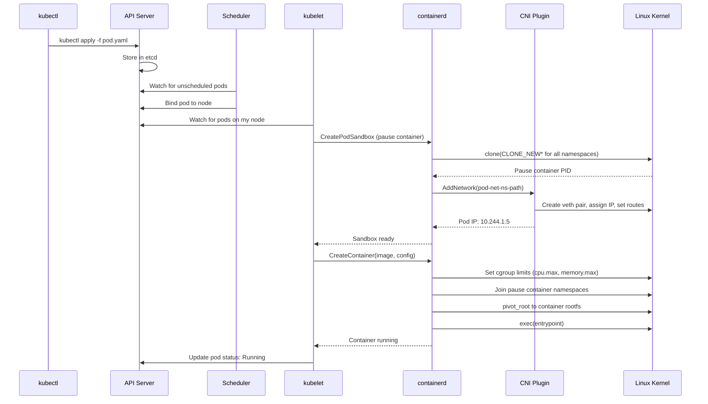
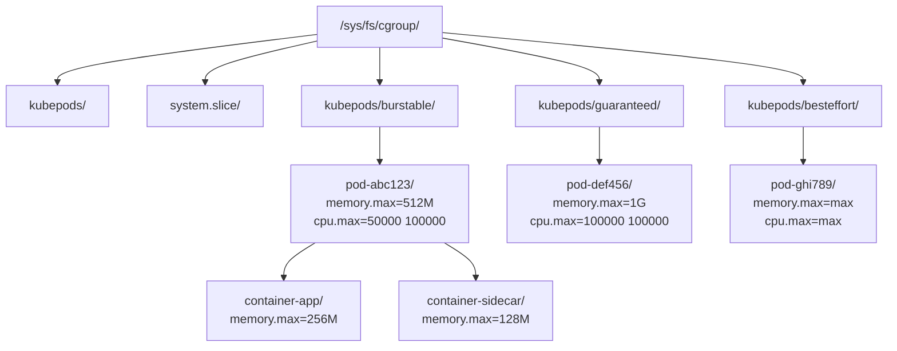

# Chapter 180: Kubernetes Basics — From a Linux Perspective

## 1. Introduction

Kubernetes is the de facto standard for container orchestration, but it's fundamentally a Linux application. Underneath the YAML manifests and abstractions, Kubernetes creates pods, namespaces, cgroups, network rules, and storage mounts — all Linux primitives. Understanding Kubernetes from the Linux kernel's perspective demystifies what happens when you `kubectl apply` and makes debugging production issues dramatically easier.

This chapter examines Kubernetes through the lens of Linux: what pods actually are, how namespaces and cgroups are used, how resource limits map to kernel interfaces, and how the node-level components interact with the operating system.

## 2. Architecture

### 2.1 Kubernetes Control Plane

```
┌─────────────────────────────────────────────────────────────┐
│                    Control Plane                             │
│                                                             │
│  ┌──────────────┐  ┌──────────────┐  ┌──────────────────┐  │
│  │ kube-apiserver│  │ etcd         │  │ kube-scheduler   │  │
│  │ (REST API)   │  │ (state store)│  │ (pod placement)  │  │
│  └──────┬───────┘  └──────────────┘  └──────────────────┘  │
│         │                                                   │
│  ┌──────▼───────┐                                           │
│  │ kube-        │                                           │
│  │ controller-  │                                           │
│  │ manager      │                                           │
│  └──────────────┘                                           │
└─────────────────────────────────────────────────────────────┘
```

### 2.2 Node Components (Where Linux Happens)

```
┌─────────────────────────────────────────────────────────────┐
│                    Worker Node                               │
│                                                             │
│  ┌──────────────┐  ┌──────────────┐  ┌──────────────────┐  │
│  │ kubelet      │  │ kube-proxy   │  │ Container        │  │
│  │ (node agent) │  │ (networking) │  │ Runtime          │  │
│  └──────┬───────┘  └──────────────┘  │ (containerd)     │  │
│         │                             └──────────────────┘  │
│         │                                                   │
│  ┌──────▼───────────────────────────────────────────────┐  │
│  │              Linux Kernel                             │  │
│  │  Namespaces, cgroups, netfilter, ipvs, iptables       │  │
│  └──────────────────────────────────────────────────────┘  │
│                                                             │
│  ┌──────────────────────────────────────────────────────┐  │
│  │              Pods (Containers)                        │  │
│  │  ┌────────────┐ ┌────────────┐ ┌────────────┐       │  │
│  │  │ Pod 1      │ │ Pod 2      │ │ Pod 3      │       │  │
│  │  │ ┌────┐┌──┐ │ │ ┌────┐    │ │ ┌────┐    │       │  │
│  │  │ │App ││S │ │ │ │App │    │ │ │App │    │       │  │
│  │  │ └────┘└──┘ │ │ └────┘    │ │ └────┘    │       │  │
│  │  └────────────┘ └────────────┘ └────────────┘       │  │
│  └──────────────────────────────────────────────────────┘  │
└─────────────────────────────────────────────────────────────┘
```

### 2.3 kubelet — The Node Agent

kubelet is the component that actually creates containers on nodes. It:

1. Watches the API server for pod specs assigned to its node
2. Calls the container runtime (via CRI) to create pods
3. Monitors container health (liveness/readiness probes)
4. Reports node and pod status back to the API server
5. Manages volume mounts

```
kubelet → CRI (gRPC) → containerd → containerd-shim → runc → container
```

## 3. Pods — From Linux's Perspective

### 3.1 What is a Pod?

A pod is a group of one or more containers that share:
- **Network namespace** — Same IP address, same port space
- **IPC namespace** — Shared memory accessible between containers
- **UTS namespace** — Same hostname

Each container has its own:
- **PID namespace** — Separate PID 1
- **Mount namespace** — Separate filesystem
- **User namespace** — Separate UID mapping (when enabled)

### 3.2 The Pause Container

Every pod has an infrastructure container called the **pause container** that holds the shared namespaces:

```bash
# On a Kubernetes node, you'll see pause containers
crictl ps | grep pause
# abc123  Running  registry.k8s.io/pause:3.9  2 hours ago

# The pause container:
# 1. Creates the network namespace
# 2. Holds the shared IPC and UTS namespaces
# 3. Does nothing (just sleeps)
# 4. All other containers in the pod join its namespaces
```

**Why pause is needed:**
- It's the "anchor" for shared namespaces
- If the application container crashes, the pause container keeps the network namespace alive
- Other containers can restart without losing their network identity

### 3.3 Pod Namespace Creation Flow

```bash
# When kubelet creates a pod:

# 1. Create pause container with all new namespaces
clone(CLONE_NEWNS | CLONE_NEWUTS | CLONE_NEWIPC | CLONE_NEWPID | CLONE_NEWNET | CLONE_NEWCGROUP)

# 2. Pause container creates:
#    - Network namespace (gets pod IP)
#    - UTS namespace (sets hostname)
#    - IPC namespace
#    - Cgroup namespace

# 3. Application containers join pause's namespaces:
#    - Network: join pause's network NS (same IP)
#    - IPC: join pause's IPC NS
#    - UTS: join pause's UTS NS
#    - Mount: own mount NS (separate rootfs)
#    - PID: own PID NS (separate PID 1)
```

### 3.4 Inspecting Pod Namespaces

```bash
# Find a pod's pause container
POD_NAME="my-pod"
NAMESPACE="default"

# Get the pause container PID
PAUSE_PID=$(crictl pods --name $POD_NAME -q | xargs crictl inspectp | jq .info.pid)

# Inspect namespaces
ls -la /proc/$PAUSE_PID/ns/
# lrwxrwxrwx 1 root root 0 Jun 29 12:00 cgroup -> cgroup:[4026532510]
# lrwxrwxrwx 1 root root 0 Jun 29 12:00 ipc -> ipc:[4026532499]
# lrwxrwxrwx 1 root root 0 Jun 29 12:00 mnt -> mnt:[4026532498]
# lrwxrwxrwx 1 root root 0 Jun 29 12:00 net -> net:[4026532503]
# lrwxrwxrwx 1 root root 0 Jun 29 12:00 pid -> pid:[4026532501]
# lrwxrwxrwx 1 root root 0 Jun 29 12:00 user -> user:[4026532500]
# lrwxrwxrwx 1 root root 0 Jun 29 12:00 uts -> uts:[4026532497]

# Get application container PID
APP_PID=$(crictl ps --pod $(crictl pods --name $POD_NAME -q) --name app -q | xargs crictl inspect | jq .info.pid)

# Compare — should share network, IPC, UTS with pause
readlink /proc/$PAUSE_PID/ns/net
readlink /proc/$APP_PID/ns/net  # Same!
```

## 4. Kubernetes Namespaces vs Linux Namespaces

### 4.1 Two Different Concepts

**Kubernetes namespace** — A logical grouping of resources in the API (like a virtual cluster):
```bash
kubectl get namespaces
# NAME          STATUS   AGE
# default       Active   30d
# kube-system   Active   30d
# production    Active   15d
```

**Linux namespace** — Kernel-level isolation of system resources (PID, network, etc.)

### 4.2 How They Relate

```
Kubernetes Namespace "production"
├── Pod "web-app"
│   └── Linux Namespaces:
│       ├── Network NS (pod IP: 10.244.1.5)
│       ├── PID NS (PID 1 = nginx)
│       ├── Mount NS (rootfs)
│       ├── UTS NS (hostname: web-app)
│       ├── IPC NS
│       └── Cgroup NS
│
├── Pod "api-server"
│   └── Linux Namespaces:
│       ├── Network NS (pod IP: 10.244.1.6)
│       └── ...
│
└── Pod "database"
    └── Linux Namespaces:
        ├── Network NS (pod IP: 10.244.1.7)
        └── ...
```

## 5. Resource Limits — From YAML to Kernel

### 5.1 Pod Resource Specification

```yaml
apiVersion: v1
kind: Pod
metadata:
  name: resource-demo
spec:
  containers:
  - name: app
    image: nginx
    resources:
      requests:
        memory: "128Mi"
        cpu: "250m"
      limits:
        memory: "512Mi"
        cpu: "500m"
```

### 5.2 How Kubernetes Translates Resources

**CPU:**
```bash
# requests.cpu: "250m" (250 millicores)
# → Used by scheduler for placement
# → Maps to cgroup cpu.weight or cpu.shares

# limits.cpu: "500m" (500 millicores)
# → Used by kubelet for cgroup limits
# → cgroups v1: cpu.cfs_quota_us = 50000, cpu.cfs_period_us = 100000
# → cgroups v2: cpu.max = "50000 100000"
```

**Memory:**
```bash
# requests.memory: "128Mi"
# → Used by scheduler for placement
# → Maps to cgroup memory.low (soft guarantee)

# limits.memory: "512Mi"
# → Used by kubelet for cgroup limits
# → cgroups v1: memory.limit_in_bytes = 536870912
# → cgroups v2: memory.max = "536870912"
# → memory.high = "419430400" (80% of limit, safety valve)
```

### 5.3 Cgroup Structure on a Kubernetes Node

```
/sys/fs/cgroup/
├── kubepods/                          # All Kubernetes pods
│   ├── burstable/                     # Pods with requests < limits
│   │   ├── podabc123/                 # Specific pod
│   │   │   ├── container1/           # Container cgroup
│   │   │   │   ├── cpu.max
│   │   │   │   ├── memory.max
│   │   │   │   └── cgroup.procs
│   │   │   └── container2/
│   │   └── poddef456/
│   ├── guaranteed/                    # Pods with requests == limits
│   │   └── podghi789/
│   └── besteffort/                    # Pods with no requests/limits
│       └── podjkl012/
```

### 5.4 Verifying Cgroup Limits

```bash
# Find a pod's cgroup
POD_UID=$(kubectl get pod resource-demo -o jsonpath='{.metadata.uid}')

# cgroups v2
CGROUP_PATH=$(find /sys/fs/cgroup/kubepods -name "*${POD_UID}*" -type d | head -1)

# Check memory limit
cat $CGROUP_PATH/memory.max
# 536870912

# Check CPU limit
cat $CGROUP_PATH/cpu.max
# 50000 100000

# Check current usage
cat $CGROUP_PATH/memory.current
cat $CGROUP_PATH/cpu.stat
```

### 5.5 OOM Behavior in Kubernetes

```bash
# When a container exceeds its memory limit:
# 1. Kernel OOM killer selects a process in the cgroup
# 2. Container runtime detects the container died
# 3. kubelet sees the container OOMKilled
# 4. Based on restartPolicy, kubelet may restart it

kubectl describe pod resource-demo
# Last State: Terminated
#   Reason: OOMKilled
#   Exit Code: 137

# The pod status shows:
kubectl get pod resource-demo
# STATUS: CrashLoopBackOff (if repeatedly OOM killed)
```

## 6. Kubernetes Networking (Linux View)

### 6.1 Pod Networking Model

Every pod gets its own IP address. This is achieved through:

1. **Network namespace** — Created by the pause container
2. **CNI plugin** — Configures the network namespace (veth pair, IP, routes)
3. **Service networking** — iptables/IPVS rules for service load balancing

### 6.2 How a Pod Gets Its IP

```
1. kubelet creates pause container with new network namespace
2. kubelet calls CNI plugin with the network namespace path
3. CNI plugin:
   a. Creates a veth pair
   b. Moves one end into the pod's network namespace
   c. Attaches the other end to a bridge (or configures overlay)
   d. Assigns an IP address to the pod's veth end
   e. Sets up routes
4. Pod now has network connectivity
```

### 6.3 kube-proxy and Service Networking

kube-proxy configures Linux netfilter (iptables or IPVS) rules to implement Kubernetes Services:

```bash
# iptables rules for a Service
iptables -t nat -L KUBE-SERVICES
# Chain KUBE-SERVICES (policy ACCEPT)
# target     prot  opt  source    destination
# KUBE-SVC-abc  tcp  --  anywhere  10.96.0.10  /* default/kubernetes:https */ tcp dpt:https
# KUBE-SVC-def  tcp  --  anywhere  10.96.0.100 /* default/my-service:http */ tcp dpt:http

# DNAT rule for service
iptables -t nat -L KUBE-SVC-def
# target        prot  opt  source    destination
# KUBE-SEP-ghi  all   --  anywhere  anywhere  /* default/my-service:http */ statistic mode random probability 0.33333
# KUBE-SEP-jkl  all   --  anywhere  anywhere  /* default/my-service:http */ statistic mode random probability 0.50000
# KUBE-SEP-mno  all   --  anywhere  anywhere  /* default/my-service:http */

# Endpoint DNAT
iptables -t nat -L KUBE-SEP-ghi
# target     prot  opt  source    destination
# KUBE-MARK-MASQ  all  --  10.244.1.5  anywhere
# DNAT       tcp   --   anywhere  anywhere  tcp to:10.244.1.5:80
```

**IPVS mode (higher performance):**

```bash
# IPVS rules for a Service
ipvsadm -Ln
# TCP  10.96.0.100:80 rr
#   -> 10.244.1.5:80      Masq    1      0
#   -> 10.244.1.6:80      Masq    1      0
#   -> 10.244.1.7:80      Masq    1      0
```

## 7. Kubernetes Volumes (Linux Mounts)

### 7.1 Volume Types and Linux Equivalents

| Kubernetes Volume | Linux Mechanism |
|-------------------|-----------------|
| emptyDir | tmpfs mount or host directory |
| hostPath | Bind mount from host |
| configMap | tmpfs mount with files |
| secret | tmpfs mount with files |
| persistentVolumeClaim | Block device or NFS mount |
| downwardAPI | tmpfs mount with metadata |

### 7.2 How Volumes Are Mounted

```bash
# kubelet creates the volume directory
mkdir -p /var/lib/kubelet/pods/<pod-uid>/volumes/kubernetes.io~empty-dir/my-volume

# For emptyDir: tmpfs mount
mount -t tmpfs tmpfs /var/lib/kubelet/pods/<pod-uid>/volumes/kubernetes.io~empty-dir/my-volume

# For hostPath: bind mount
mount --bind /host/path /var/lib/kubelet/pods/<pod-uid>/volumes/kubernetes.io~empty-dir/my-volume

# For PVC: mount the block device or NFS share
mount /dev/sdb1 /var/lib/kubelet/pods/<pod-uid>/volumes/kubernetes.io~pvc/pvc-abc123

# kubelet then mounts the volume into the container's mount namespace
# Using the container runtime's mount configuration
```

## 8. Security Context (Linux Security)

### 8.1 Pod Security Context

```yaml
apiVersion: v1
kind: Pod
metadata:
  name: security-demo
spec:
  securityContext:
    runAsUser: 1000
    runAsGroup: 3000
    fsGroup: 2000
    runAsNonRoot: true
    seccompProfile:
      type: RuntimeDefault
  containers:
  - name: app
    image: nginx
    securityContext:
      allowPrivilegeEscalation: false
      readOnlyRootFilesystem: true
      capabilities:
        drop: ["ALL"]
        add: ["NET_BIND_SERVICE"]
```

### 8.2 How Security Context Maps to Linux

```bash
# runAsUser: 1000
# → Sets container process UID to 1000
# → OCI config.json: process.user.uid = 1000

# runAsGroup: 3000
# → Sets container process GID to 3000
# → OCI config.json: process.user.gid = 3000

# fsGroup: 2000
# → Sets group ownership of mounted volumes
# → chown :2000 on volume mount points

# seccompProfile: RuntimeDefault
# → Applies the container runtime's default seccomp profile
# → OCI config.json: linux.seccomp with restricted syscall list

# capabilities.drop: ["ALL"]
# → Removes all capabilities from the container process
# → OCI config.json: process.capabilities = {all empty}

# readOnlyRootFilesystem: true
# → Container rootfs is mounted read-only
# → OCI config.json: root.readonly = true
```

### 8.3 Linux Capabilities in Kubernetes

Kubernetes allows fine-grained capability control:

```yaml
apiVersion: v1
kind: Pod
metadata:
  name: capability-demo
spec:
  containers:
  - name: app
    image: nginx
    securityContext:
      capabilities:
        drop:
        - ALL           # Remove all capabilities
        add:
        - NET_BIND_SERVICE  # Allow binding to ports < 1024
        - CHOWN             # Allow changing file ownership
```

**Common capabilities in containers:**

| Capability | Purpose | Risk Level |
|------------|---------|------------|
| NET_BIND_SERVICE | Bind to ports < 1024 | Low |
| NET_RAW | Use raw sockets (ping) | Medium |
| SYS_ADMIN | Mount, namespace operations | High |
| SYS_PTRACE | Debug processes | High |
| SYS_TIME | Set system clock | High |
| DAC_OVERRIDE | Bypass file permission checks | Medium |

### 8.4 AppArmor and seccomp in Kubernetes

```yaml
apiVersion: v1
kind: Pod
metadata:
  name: apparmor-demo
  annotations:
    container.apparmor.security.beta.kubernetes.io/app: localhost/custom-profile
spec:
  containers:
  - name: app
    image: nginx
    securityContext:
      seccompProfile:
        type: Localhost
        localhostProfile: profiles/my-seccomp.json
```

**Built-in seccomp profiles:**
- `RuntimeDefault` — Container runtime's default profile (recommended)
- `Unconfined` — No seccomp filtering (dangerous)
- `Localhost` — Custom profile from node filesystem

### 8.5 Pod Security Standards

Kubernetes defines three security levels:

```yaml
# Privileged: Unrestricted (for system workloads)
# Baseline: Minimal restrictions (for most workloads)
# Restricted: Maximum security (for sensitive workloads)

apiVersion: v1
kind: Namespace
metadata:
  name: production
  labels:
    pod-security.kubernetes.io/enforce: restricted
    pod-security.kubernetes.io/warn: restricted
    pod-security.kubernetes.io/audit: restricted
```

**Restricted profile requirements:**
- Must run as non-root
- Must drop all capabilities
- Must use seccomp RuntimeDefault
- Must have read-only root filesystem
- Must not use host namespaces
- Must not use host ports

### 8.6 Debugging Kubernetes from the Linux Perspective

```bash
# On the node, inspect pod cgroups
# Find pod UID
POD_UID=$(kubectl get pod my-pod -o jsonpath='{.metadata.uid}')

# Find cgroup path
find /sys/fs/cgroup/kubepods -name "*${POD_UID}*" -type d

# Check memory usage
cat /sys/fs/cgroup/kubepods/.../memory.current
# Shows current memory usage in bytes

# Check CPU usage
cat /sys/fs/cgroup/kubepods/.../cpu.stat
# Shows nr_periods, nr_throttled, throttled_time

# Check container logs (on node)
ls /var/log/pods/<namespace>_<pod-name>_<pod-uid>/
# Each container has its own log directory

tail -f /var/log/pods/<namespace>_<pod-name>_<pod-uid>/container-name/0.log

# Inspect container via crictl
# Find container ID
CONTAINER_ID=$(crictl ps --name my-container -q)

# Inspect container details
crictl inspect $CONTAINER_ID
# Shows: PID, cgroup, network namespace, mounts, etc.

# Get container logs
crictl logs $CONTAINER_ID

# Execute in container
crictl exec -i -t $CONTAINER_ID /bin/sh

# Check container filesystem
# Container rootfs is at:
# /var/lib/containerd/io.containerd.snapshotter.v1.overlayfs/snapshots/<id>/fs

# Debug networking
# Find pod network namespace
NETNS=$(crictl inspectp $(crictl pods --name my-pod -q) | jq .info.runtimeSpec.linux.namespaces[] | select(.type=="network") | .path)

# Enter pod network namespace
nsenter --net=$NETNS ip addr
nsenter --net=$NETNS ip route
nsenter --net=$NETNS iptables -L
```

## 9. Mermaid Diagrams

### 9.1 Kubernetes Pod Creation Flow



### 9.2 Cgroup Hierarchy on a Kubernetes Node



## 10. Common Pitfalls

### 10.1 Node Pressure and Eviction

```bash
# When node runs low on resources, kubelet evicts pods
# Check node conditions
kubectl describe node my-node | grep -A5 Conditions

# MemoryPressure: Node is low on memory
# DiskPressure: Node is low on disk
# PIDPressure: Too many processes

# Eviction order:
# 1. BestEffort pods (no requests/limits)
# 2. Burstable pods (requests < limits)
# 3. Guaranteed pods (requests == limits) — only if system critical
```

### 10.2 CPU Throttling

```bash
# With CPU limits, containers get throttled
# Check throttling stats
cat /sys/fs/cgroup/kubepods/.../cpu.stat
# nr_periods 1234
# nr_throttled 56
# throttled_time 5600000000  # nanoseconds

# High throttling causes latency spikes
# Solution: Increase CPU limit or use CPU requests instead of limits
```

### 10.3 Memory vs Requests Mismatch

```yaml
# requests != limits means Burstable QoS
# The pod can be evicted before hitting its limit if the node is under pressure

# For critical workloads, use Guaranteed QoS:
resources:
  requests:
    memory: "512Mi"
    cpu: "500m"
  limits:
    memory: "512Mi"   # Same as requests
    cpu: "500m"        # Same as requests
```

### 10.4 Host Network Namespace

```yaml
# Using hostNetwork: true shares the host's network namespace
spec:
  hostNetwork: true
  containers:
  - name: app
    image: nginx
    # Pod uses host's IP, host's port space
    # Can bind to host ports directly
    # But loses network isolation
```

## 11. Best Practices

1. **Always set resource requests** — Without requests, the scheduler can't make good placement decisions.

2. **Set memory limits slightly above expected usage** — Leaves room for spikes before OOM.

3. **Use Guaranteed QoS for critical workloads** — requests == limits.

4. **Avoid `hostNetwork: true`** — Unless absolutely necessary (e.g., CNI plugins, monitoring agents).

5. **Use securityContext to drop all capabilities** — Add back only what's needed.

6. **Set `readOnlyRootFilesystem: true`** — Use tmpfs mounts for writable directories.

7. **Monitor cgroup throttling** — CPU limits cause throttling, not scheduling delays.

8. **Use `terminationGracePeriodSeconds`** — Give applications time to shut down gracefully.

9. **Avoid running as root** — Use `runAsUser` and `runAsNonRoot: true`.

10. **Understand QoS classes** — BestEffort, Burstable, Guaranteed affect eviction priority.

## 12. Exercises

### Exercise 1: Inspect Pod Namespaces

```bash
# Create a pod
kubectl run test-pod --image=nginx --restart=Never

# Wait for it to be running
kubectl wait --for=condition=Ready pod/test-pod

# Get the node it's running on
NODE=$(kubectl get pod test-pod -o jsonpath='{.spec.nodeName}')

# SSH to the node and inspect
# Find the pause container
PAUSE_PID=$(crictl pods --name test-pod -q | xargs crictl inspectp | jq .info.pid)

# List namespaces
ls -la /proc/$PAUSE_PID/ns/

# Find the app container
APP_PID=$(crictl ps --pod $(crictl pods --name test-pod -q) | grep nginx | awk '{print $1}' | xargs crictl inspect | jq .info.pid)

# Compare namespaces (network should match)
readlink /proc/$PAUSE_PID/ns/net
readlink /proc/$APP_PID/ns/net
```

### Exercise 2: Verify Cgroup Limits

```bash
# Create a pod with resource limits
cat <<EOF | kubectl apply -f -
apiVersion: v1
kind: Pod
metadata:
  name: resource-test
spec:
  containers:
  - name: stress
    image: polinux/stress
    command: ["stress"]
    args: ["--vm", "1", "--vm-bytes", "200M", "--vm-keep"]
    resources:
      requests:
        memory: "100Mi"
        cpu: "100m"
      limits:
        memory: "256Mi"
        cpu: "200m"
EOF

# On the node, find the cgroup
# Check memory.max and cpu.max
# Watch the container get OOM killed when it exceeds 256Mi
```

### Exercise 3: Trace iptables Rules for a Service

```bash
# Create a service
kubectl expose pod test-pod --port=80 --target-port=80

# On the node, examine iptables rules
iptables -t nat -L KUBE-SERVICES -n
iptables -t nat -L KUBE-SVC-* -n
iptables -t nat -L KUBE-SEP-* -n

# Trace a connection
iptables -t raw -A PREROUTING -p tcp --dport 80 -j TRACE
iptables -t raw -A OUTPUT -p tcp --dport 80 -j TRACE
# Check kernel log for trace results
dmesg | grep TRACE
```

## 13. References

1. Kubernetes documentation: https://kubernetes.io/docs/
2. Kubernetes source: https://github.com/kubernetes/kubernetes
3. CRI specification: https://github.com/kubernetes/cri-api
4. CNI specification: https://github.com/containernetworking/cni
5. kubelet source: https://github.com/kubernetes/kubernetes/tree/master/pkg/kubelet
6. "Kubernetes Networking" — Kubernetes documentation
7. "Pod Security Standards" — Kubernetes documentation
8. "Resource Management for Pods and Containers" — Kubernetes documentation
9. Linux man pages: `man 8 iptables`, `man 8 ipvsadm`
